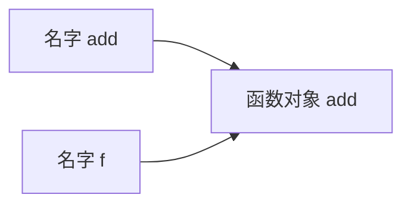
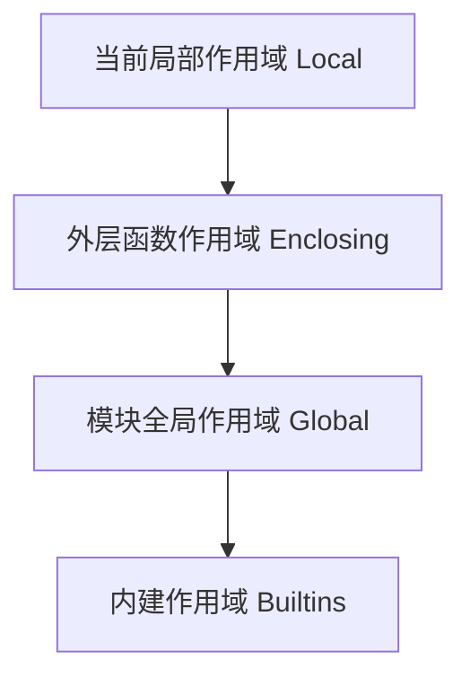

# Python - 第 4 课：函数是一等公民：作用域、闭包、装饰器与参数绑定

## 学习目标（本节结束后你能做到什么）

- 能解释为什么说 Python 里的函数是一等公民，而不只是“可以调用的代码块”。
- 能说清 Python 的作用域查找规则，理解 `LEGB`、`global`、`nonlocal` 分别在解决什么问题。
- 能讲清闭包的本质，知道它为什么会出现“晚绑定”问题，以及如何修正。
- 能从语法糖和运行时两个角度解释装饰器，知道它为什么本质上是高阶函数。
- 能系统理解函数参数绑定规则，包括位置参数、关键字参数、默认参数、`*args`、`**kwargs`、仅位置参数、仅关键字参数。

## 内容讲解（核心概念，用类比、例子、图示说清楚）

### 1. 为什么这一课在 Python 里特别关键

如果说前 3 课在建立：

- Python 是对象系统
- 变量是名字绑定对象
- 容器本质上是不同的数据组织方式

那么这一课就是把这些观念推进到“代码本身”。

很多语言里，函数更像一种语法结构。  
但在 Python 里，函数不只是“你可以写 `def` 再调用”的东西，它同时还是：

- 对象
- 值
- 运行时可传递的能力
- 可被包装、替换、延迟执行、捕获外部状态的抽象单元

这也是为什么后面这些看起来分散的知识点，其实是连在一起的：

- 闭包
- 装饰器
- 回调
- 工厂函数
- 函数式风格
- 依赖注入
- 路由注册
- AOP 风格增强

如果你把“函数就是对象”这个地基吃透，后面很多 Python 高级特性都会突然变自然。

### 2. 什么叫“函数是一等公民”

一句话概括：

**函数和整数、字符串、列表一样，都是对象，都可以被当作值来处理。**

这意味着函数可以：

- 赋值给变量
- 作为参数传给别的函数
- 作为返回值返回
- 放进容器里
- 在运行时动态创建和替换

例如：

```python
def add(x, y):
    return x + y

f = add
print(f(2, 3))
```

这里 `f = add` 的本质，和前面讲过的 `b = a` 没有本质区别：

- 名字 `add` 绑定到一个函数对象
- 名字 `f` 也绑定到同一个函数对象

图示如下：



这说明函数不是“只能被执行的语法块”，它首先是一个对象，只不过这个对象支持被调用。

#### 2.1 函数为什么重要

因为它能把“行为”本身当数据传来传去。

例如：

```python
def apply_twice(func, x):
    return func(func(x))
```

这里 `func` 不是某种特殊语法，它只是一个绑定到函数对象的名字。  
这种能力是 Python 抽象表达力很强的重要原因之一。

### 3. `def` 到底做了什么

很多人以为 `def` 只是“定义一段代码”。  
更准确地说，执行 `def` 语句时，Python 会做两件事：

1. 创建一个函数对象
2. 把这个函数对象绑定到某个名字上

也就是说：

```python
def hello():
    print("hi")
```

不是“编译时永久写死一个函数”，而是运行到这里时，创建了一个函数对象，再让名字 `hello` 指向它。

这件事很重要，因为它解释了很多现象：

- 函数可以定义在别的函数里
- 函数可以动态返回
- 不同调用可以创建不同的闭包对象
- 装饰器本质上是在 `def` 后立刻重新绑定名字

你甚至可以把它想成：

```python
hello = <某个函数对象>
```

只是 `def` 帮你把“函数体 + 对象创建 + 名字绑定”打包起来了。

### 4. 作用域：名字到底去哪里找

前面我们一直在说“名字绑定对象”，那下一个自然问题就是：

**当你在函数体里写一个名字时，Python 去哪里找它？**

这就进入作用域规则。

#### 4.1 LEGB 规则

Python 里最经典的名字查找顺序是：

- `L`：Local，局部作用域
- `E`：Enclosing，外层嵌套函数作用域
- `G`：Global，模块全局作用域
- `B`：Builtins，内建作用域

例子：

```python
x = "global"

def outer():
    x = "enclosing"

    def inner():
        x = "local"
        print(x)

    inner()

outer()
```

`inner()` 里打印的是 `local`，因为局部作用域优先级最高。

你可以把它想成一层层往外找：



#### 4.2 为什么会有这个规则

因为函数调用时会创建自己的局部命名空间，但 Python 又允许嵌套函数引用外层变量，所以必须规定查找路径。

这也是闭包成立的前提之一。

### 5. `global` 和 `nonlocal` 分别在解决什么问题

很多人会把这两个关键字混在一起。  
其实它们指向的是不同层级。

#### 5.1 `global`

`global` 的意思是：

**这个名字不是当前函数的局部变量，而是模块级全局变量。**

例如：

```python
count = 0

def inc():
    global count
    count += 1
```

如果没有 `global`，`count += 1` 会让 Python 认为你要在函数内部给 `count` 赋值，于是它把 `count` 当成本地变量，但在读取它旧值时又发现它还没在本地初始化，于是就会报错。

#### 5.2 `nonlocal`

`nonlocal` 则是说：

**这个名字不是当前局部变量，而是外层嵌套函数里的变量。**

例如：

```python
def outer():
    count = 0

    def inner():
        nonlocal count
        count += 1
        return count

    return inner
```

这里的 `count` 不是模块全局变量，而是 `outer` 的局部变量。  
但对 `inner` 来说，它又是“外层可捕获变量”，所以要用 `nonlocal`。

#### 5.3 一句话区分

- `global`：改模块级名字
- `nonlocal`：改外层函数作用域里的名字

面试里只要把这句话说稳，很多追问就能接住。

### 6. 闭包到底是什么

闭包是 Python 高频面试点，但很多人只会背定义。

更直白地说：

**闭包就是“函数 + 它记住的一部分外部作用域状态”。**

例如：

```python
def make_counter():
    count = 0

    def inc():
        nonlocal count
        count += 1
        return count

    return inc

counter = make_counter()
print(counter())  # 1
print(counter())  # 2
```

这里 `inc` 在 `make_counter` 执行结束后还能继续访问 `count`，这就是闭包最直观的现象。

#### 6.1 为什么闭包成立

因为 Python 不是简单把外层函数返回后就把所有名字都扔掉。  
如果内层函数还依赖外层某些变量，这些变量会以特殊方式被保留下来。

你可以先不深挖 `cell object` 这些实现细节，先记住本质：

- 内层函数引用了外层作用域中的变量
- 这些变量在函数返回后仍然被需要
- 所以它们会和函数对象一起“活下来”

这就是闭包。

#### 6.2 闭包有什么工程价值

闭包不是面试花活，它很实用：

- 生成带状态的函数
- 做轻量级工厂函数
- 延迟绑定某些配置
- 实现装饰器
- 避免到处塞类，只为了保存一两个状态

比如你想生成不同倍率的乘法器：

```python
def make_multiplier(n):
    def multiply(x):
        return x * n
    return multiply
```

这里 `n` 就是被闭包捕获的外部状态。

### 7. 闭包为什么会有“晚绑定”问题

这题是面试非常爱问的。

看代码：

```python
funcs = []

for i in range(3):
    funcs.append(lambda: i)

print([f() for f in funcs])
```

很多人直觉会觉得输出 `[0, 1, 2]`，但常见结果是：

```python
[2, 2, 2]
```

为什么？

因为闭包捕获的不是“当时的值快照”，而是“名字对应的变量槽位或绑定关系”。  
等这些函数真正执行时，循环已经结束了，`i` 最终是 `2`，所以大家看到的都是同一个最终结果。

这就叫晚绑定：  
**不是在创建闭包时把值复制进去，而是在真正使用时再去看那个变量当前是什么。**

#### 7.1 怎么修正

一个很经典的修正方式是用默认参数在定义时把当前值“冻结”下来：

```python
funcs = []

for i in range(3):
    funcs.append(lambda i=i: i)
```

这里的 `i=i` 会在函数定义时完成参数默认值绑定，于是每个函数都有了自己的当前值。

这个例子特别好，因为它一下把三件事串起来了：

- 闭包
- 作用域
- 参数默认值在定义时求值

如果你能把这三件事连起来讲，面试官通常会觉得你理解比较扎实。

### 8. 装饰器到底是什么

很多人第一次学装饰器时，会被 `@xxx` 这个语法吓住。  
其实装饰器的本质很朴素：

**它就是一个接收函数、返回新函数的高阶函数。**

例如：

```python
def log_decorator(func):
    def wrapper(*args, **kwargs):
        print("before call")
        result = func(*args, **kwargs)
        print("after call")
        return result
    return wrapper
```

如果你这样写：

```python
@log_decorator
def add(x, y):
    return x + y
```

它大致等价于：

```python
def add(x, y):
    return x + y

add = log_decorator(add)
```

这里是不是很熟悉？  
本质上又回到了前面那件事：

- 先有函数对象 `add`
- 再调用装饰器得到一个新函数对象
- 最后让名字 `add` 重新绑定到这个新对象

所以装饰器从来不是什么“魔法语法”，它只是：

- 函数是一等公民
- 名字可以重新绑定
- 闭包可以保存原函数对象

这三件事的组合。

#### 8.1 装饰器最常见的用途

- 日志
- 权限校验
- 缓存
- 重试
- 计时
- 路由注册
- 事务管理

这些场景的共同点是：

**我想在不改原函数业务主体的前提下，给它包一层额外行为。**

这就是装饰器天然适合的地方。

#### 8.2 为什么很多装饰器里都写 `*args, **kwargs`

因为包装器通常希望尽量兼容原函数的各种调用方式。  
如果你提前写死参数列表，装饰器就会很脆弱。

所以常见模板是：

```python
def wrapper(*args, **kwargs):
    return func(*args, **kwargs)
```

它相当于“把接收到的所有参数继续原样转发给原函数”。

### 9. 参数绑定：Python 调用函数时到底发生了什么

这是另一个经常被低估的点。

当你写：

```python
result = f(1, 2, z=3)
```

Python 在做的不是简单“把值塞进去”，而是在执行一套参数绑定规则：

- 哪些参数按位置绑定
- 哪些参数按名字绑定
- 哪些参数使用默认值
- 多余的位置参数是否收集到 `*args`
- 多余的关键字参数是否收集到 `**kwargs`

你可以把函数调用想成“实参到形参的一次匹配过程”。

### 10. 参数的几种主要类型

为了面试和工程表达方便，你最好把参数类型分清。

#### 10.1 位置参数

最普通的参数，按顺序匹配：

```python
def add(x, y):
    return x + y
```

调用时：

```python
add(1, 2)
```

#### 10.2 关键字参数

调用时按名字指定：

```python
add(y=2, x=1)
```

#### 10.3 默认参数

当调用者不传时使用默认值：

```python
def greet(name, prefix="Hi"):
    return f"{prefix}, {name}"
```

但这里有一个前面已经埋过的雷：

**默认参数在函数定义时求值，不是在每次调用时重新计算。**

所以可变默认参数才会出坑。

#### 10.4 可变位置参数 `*args`

用于接收额外的位置参数：

```python
def total(*args):
    return sum(args)
```

这里 `args` 本质上是一个 `tuple`。

#### 10.5 可变关键字参数 `**kwargs`

用于接收额外的关键字参数：

```python
def build_user(**kwargs):
    return kwargs
```

这里 `kwargs` 本质上是一个 `dict`。

#### 10.6 仅位置参数和仅关键字参数

这是很多人面试容易忽略，但其实挺能体现理解深度的点。

例如：

```python
def f(a, b, /, c, *, d):
    ...
```

它表示：

- `a`、`b` 只能按位置传
- `c` 既可以位置传，也可以关键字传
- `d` 只能按关键字传

这类设计在 API 里很有价值，因为它能更明确地控制调用方式和兼容性边界。

### 11. 参数绑定最常见的几个坑

#### 11.1 可变默认参数

这个我们已经在上一课和本课都提到了，因为它真的太高频。

```python
def append_item(x, data=[]):
    data.append(x)
    return data
```

问题不是“默认参数不该用列表”，而是：

- 默认值对象在定义时创建
- 后面重复调用时会复用同一个对象

#### 11.2 混用位置参数和关键字参数导致重复绑定

例如：

```python
def f(x, y):
    ...

f(1, x=2)
```

这里 `x` 会被绑定两次，于是报错。

所以你应该把参数绑定理解成一个正式的匹配过程，而不是“随便传点东西进去”。

#### 11.3 装饰器不转发参数

例如你写了：

```python
def deco(func):
    def wrapper():
        return func()
    return wrapper
```

那它只能包装无参函数。  
一旦原函数有参数，马上就会崩。

这也是为什么很多通用装饰器模板都会写成：

```python
def wrapper(*args, **kwargs):
    return func(*args, **kwargs)
```

### 12. 这一整课背后的统一主线

你如果回头看，会发现这一课其实不是 5 个散点，而是一条主线：

1. 函数是对象  
   所以函数可以被传递、返回、重新绑定。

2. 名字要在作用域里查找  
   所以有 `LEGB`、`global`、`nonlocal`。

3. 内层函数可以记住外层状态  
   所以有闭包。

4. 函数既然能被传入又能返回新函数  
   所以装饰器成立。

5. 函数调用本质是形参与实参的绑定  
   所以参数系统不是语法边角料，而是运行时规则的一部分。

这就是 Python 抽象能力强的一个核心原因：  
它不是在语法层零碎地给你很多功能，而是让“对象、名字、作用域、调用”这套机制彼此配合。

### 13. 面试里怎么把这一组知识讲得成体系

如果面试官问你：

- 什么是闭包？
- 装饰器本质是什么？
- `global` 和 `nonlocal` 区别是什么？
- Python 参数有哪些类型？

你可以按下面这个框架回答：

1. 先给总前提  
   Python 的函数是一等公民，本身就是对象，可以被传递、返回和重新绑定。

2. 再讲作用域  
   函数体里的名字按 `LEGB` 规则查找；修改模块级变量用 `global`，修改外层函数变量用 `nonlocal`。

3. 再讲闭包  
   当内层函数引用外层变量并在外层返回后继续使用时，就形成闭包；晚绑定是因为闭包捕获的是变量绑定，而不是简单值拷贝。

4. 再讲装饰器  
   装饰器本质是接收函数、返回新函数的高阶函数，`@deco` 大致等价于 `f = deco(f)`。

5. 最后讲参数绑定  
   Python 调用函数时会进行形参与实参匹配，涉及位置参数、关键字参数、默认参数、`*args`、`**kwargs`、仅位置和仅关键字参数。

如果你能这样回答，说明你理解的是“运行时模型”，而不是零散的八股定义。

## 小结（3-5 条关键点）

- Python 的函数是一等公民，函数对象可以被赋值、传递、返回和包装。
- 名字查找遵循 `LEGB` 规则，`global` 作用于模块级变量，`nonlocal` 作用于外层函数作用域变量。
- 闭包本质是“函数 + 被保留下来的外部状态”，晚绑定问题来自闭包捕获的是变量绑定而不是值快照。
- 装饰器本质是高阶函数，`@decorator` 大致等价于把原函数传进去再重新绑定名字。
- 参数系统本质是一次绑定规则执行，默认参数、`*args`、`**kwargs`、仅位置参数、仅关键字参数都属于这套规则的一部分。

## 问题（检测用户对当前章节内容是否了解）

1. 为什么说 Python 的函数是一等公民？请你至少列出 3 个由此带来的能力。
2. `global` 和 `nonlocal` 的根本区别是什么？它们分别修改的是哪一层作用域里的名字？
3. 闭包为什么会出现“晚绑定”问题？请你用循环里创建多个 `lambda` 的经典例子解释。
4. 为什么说装饰器本质上是高阶函数？`@deco` 和 `f = deco(f)` 之间是什么关系？
5. Python 的默认参数为什么会在可变对象场景下埋坑？这个问题和参数绑定规则有什么关系？

如果你愿意，我们下一篇就继续写第 5 课，把迭代协议、生成器、`yield`、`send` 和惰性计算系统讲透，这一课会直接给后面的协程和 `asyncio` 打地基。
