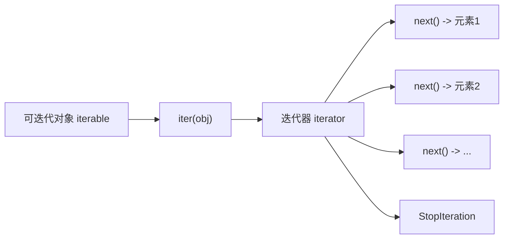
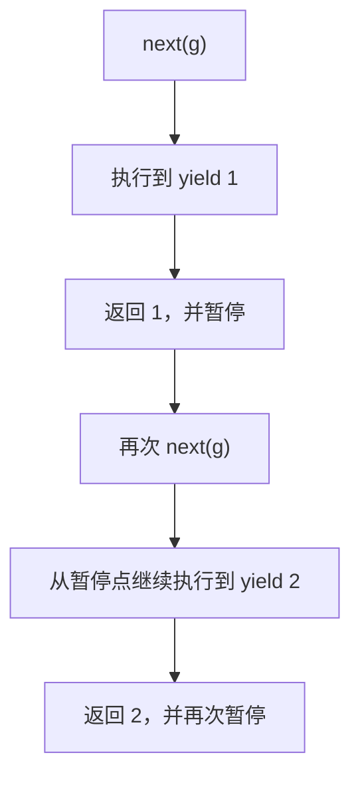

# Python - 第 5 课：迭代协议、生成器、`yield`、`send` 与惰性计算

## 学习目标（本节结束后你能做到什么）

- 能说清什么是可迭代对象、什么是迭代器，以及它们之间的关系。
- 能解释 `for` 循环在 Python 背后大致做了什么，不再把“能遍历”当成黑箱。
- 能理解生成器为什么省内存，以及它和普通函数最本质的差异是什么。
- 能讲清 `yield`、`next()`、`send()`、`StopIteration` 之间的配合关系。
- 能把“惰性计算”“流式处理”“协程前身”这些看似分散的概念统一起来。

## 内容讲解（核心概念，用类比、例子、图示说清楚）

### 1. 为什么这一课是后面 `asyncio` 和协程的地基

很多人学生成器时，停留在一个很浅的印象：

- `yield` 可以一边产出一边算
- 生成器比列表省内存
- 写法有点像函数，但又不太一样

这当然不算错，但如果只停在这里，后面一学协程、事件循环、异步任务，就很容易觉得像“突然换了一套新体系”。

其实不是。  
生成器这课的真正价值，在于它会让你第一次非常明确地看到：

- Python 的 `for` 循环不是魔法，而是协议驱动
- 一个函数并不一定非得“一次执行到底再返回”
- 代码执行可以被暂停，再恢复
- 计算不一定要一次性把结果全部准备好

这四件事一旦你吃透，后面学：

- 生成器表达式
- 流式处理
- 协程
- `async` / `await`
- `asyncio`

理解成本会低非常多。

### 2. 先区分两个非常容易混的概念：可迭代对象 vs 迭代器

这是整课最重要的入口。

#### 2.1 可迭代对象（iterable）

可迭代对象指的是：

**可以被拿来遍历的对象。**

常见例子：

- `list`
- `tuple`
- `str`
- `dict`
- `set`
- 文件对象
- 生成器对象

你平时能写：

```python
for x in data:
    ...
```

这里的 `data` 往往就是可迭代对象。

#### 2.2 迭代器（iterator）

迭代器则更具体，它是：

**一个知道“下一个元素是什么”的对象。**

它通常至少要支持两件事：

- `__iter__()`：返回迭代器自身或某个迭代器
- `__next__()`：返回下一个元素；如果没有了，就抛出 `StopIteration`

一句话区分：

- 可迭代对象：能拿来开启遍历
- 迭代器：真正负责一步一步吐出元素

这两个概念就像：

- 菜谱是一套可按顺序做菜的说明
- 厨师正在一盘一盘端菜，才更像迭代器

### 3. `for` 循环背后到底做了什么

很多人写了很多年 Python，但从没认真想过：

```python
for x in data:
    print(x)
```

到底发生了什么。

你可以把它大致理解成下面这个过程：

1. 先对 `data` 调用 `iter(data)`，拿到一个迭代器
2. 再不断调用这个迭代器的 `next()`
3. 每次拿到一个值，就执行循环体
4. 直到抛出 `StopIteration`，循环结束

也就是它大致等价于：

```python
it = iter(data)

while True:
    try:
        x = next(it)
    except StopIteration:
        break
    print(x)
```

这件事非常关键，因为它把“遍历”从语法层，拉回到了协议层。

也就是说，Python 并不是内建只会遍历 `list`。  
它真正依赖的是：

**只要你提供符合迭代协议的对象，`for` 就能工作。**

### 4. 迭代协议到底是什么

如果更形式化一点，迭代协议可以先粗略理解成两步：

#### 4.1 `iter(obj)`

Python 会尝试从对象那里拿到一个迭代器。

#### 4.2 `next(it)`

Python 再不断向这个迭代器要“下一个值”。

图示可以理解成：



这解释了很多平时“理所当然”的行为：

- 为什么 `list` 能 `for`
- 为什么文件对象能一行一行读
- 为什么生成器也能被 `for`
- 为什么有些对象明明不是列表，也照样能遍历

### 5. 为什么 `list` 是可迭代对象，但通常不是“它自己就是迭代器”

看一个例子：

```python
nums = [1, 2, 3]
it = iter(nums)
```

这里：

- `nums` 是可迭代对象
- `it` 是从它产生出来的迭代器

为什么要分成两层？

因为一个可迭代对象通常代表的是“这批数据”，而迭代器代表的是“当前遍历到了哪儿”。

这很像一本书和一个书签：

- 书本身是数据集合
- 书签记录当前读到哪里

如果 `list` 自己直接承担“当前位置状态”，那同一个列表就很难同时被两个独立遍历过程使用。

而现在这样分层后，你可以：

```python
nums = [1, 2, 3]
it1 = iter(nums)
it2 = iter(nums)
```

这两个迭代器就能各自维护自己的位置。

### 6. 生成器到底是什么

很多人会说“生成器是用 `yield` 写出来的”。  
这句话不算错，但还不够本质。

更准确地说：

**生成器是一类特殊的迭代器，它不是一次性把所有结果准备好，而是在每次被请求时，再继续向前执行一点，产出下一个值。**

例如：

```python
def gen():
    yield 1
    yield 2
    yield 3
```

调用：

```python
g = gen()
```

这里不会立刻执行函数体，也不会立刻得到 `[1, 2, 3]`。  
你得到的是一个生成器对象，也就是一个特殊迭代器。

后面当你写：

```python
next(g)
```

它才开始跑，跑到第一个 `yield` 停下来，把值 `1` 交给你。

### 7. `yield` 到底做了什么

这是生成器的核心。

普通函数里的 `return` 是：

- 把结果返回
- 整个函数结束

而生成器里的 `yield` 是：

- 产出一个值
- 暂停函数执行
- 保留当前执行现场
- 等下次再从这里继续

这就是普通函数和生成器函数最本质的差异。

#### 7.1 “保留执行现场”是什么意思

意思是函数不会像普通 `return` 那样彻底销毁调用上下文。  
它会把下面这些状态保留下来：

- 当前执行到哪一行
- 局部变量当前值是什么
- 控制流应从哪里恢复

所以下次 `next()` 再调用时，它不是“重新从头执行”，而是从上次暂停点继续。

图示如下：



这也是为什么很多人第一次学生成器时会觉得它像一个“小状态机”。

### 8. 生成器为什么省内存

这是最常被提到的优点，但不能只背一句“因为惰性计算”。

先看两个写法：

```python
nums = [x * x for x in range(1000000)]
```

和：

```python
nums = (x * x for x in range(1000000))
```

第一个是列表推导式，第二个是生成器表达式。

区别在于：

- 列表推导式会把一百万个结果一次性全部算完并存下来
- 生成器表达式只是在需要下一个值时，再算下一个

所以生成器省内存，不是因为“它更神奇”，而是因为：

**它不急着拥有所有结果，只保存产生结果所需的最小状态。**

这就是惰性计算。

#### 8.1 惰性计算适合什么场景

- 数据量很大
- 数据流是逐步到来的
- 你不一定会消费全部结果
- 你更想边算边处理，而不是一次性全装进内存

典型例子：

- 逐行读取大文件
- 流式处理日志
- 管道式数据变换
- 无限序列

### 9. 生成器和列表的本质差别，不只是“一个带括号、一个带中括号”

面试里如果只说“一个省内存，一个不省”还不够。

更完整的差异是：

#### 9.1 结果持有方式不同

- 列表：立即持有所有结果
- 生成器：只保存未来如何继续产出结果的状态

#### 9.2 访问方式不同

- 列表：可反复遍历，可按下标访问
- 生成器：通常只能顺序往前走，一次消费

#### 9.3 适用场景不同

- 列表：需要随机访问、多次遍历、结果集不大
- 生成器：需要流式处理、节省内存、延迟计算

所以你不要把生成器理解成“列表的低配版”。  
它们是为不同问题设计的。

### 10. `StopIteration` 为什么重要

很多人知道它是“遍历结束会抛的异常”，但没意识到它其实是迭代协议的停止信号。

也就是说，迭代器告诉外界“我没元素了”，不是靠返回 `None`、空字符串之类约定俗成的值，而是靠明确抛出：

```python
StopIteration
```

这很重要，因为：

- `None` 本身可能就是合法数据
- 空字符串、0、空列表也都可能是合法数据

所以要有一个不会和正常数据混淆的停止机制。

这也是 `for` 循环知道什么时候停下来的根本依据。

### 11. `send()` 到底在做什么

很多人对 `send()` 的印象很模糊，甚至只会背“可以给生成器发值”。

更准确地说：

**`next()` 可以理解成“恢复执行，并把当前 `yield` 表达式结果视为 `None`”；而 `send(value)` 则是“恢复执行，并把当前暂停点那个 `yield` 表达式的结果设为 `value`”。**

看例子：

```python
def echo():
    x = yield "start"
    yield f"got {x}"
```

执行过程大致是：

```python
g = echo()
print(next(g))        # "start"
print(g.send(42))     # "got 42"
```

这里第一次 `next(g)` 的作用是：

- 启动生成器
- 跑到第一个 `yield "start"`
- 返回 `"start"`

然后 `g.send(42)` 的作用是：

- 从刚才暂停处恢复
- 把那个 `yield "start"` 表达式的结果赋给 `x`
- 所以 `x == 42`

这时生成器就不只是“向外吐值”，它还具备了某种“接收输入再继续”的能力。

这也是为什么很多教材会说：

- `yield` 让函数可暂停
- `send()` 让暂停点可恢复且可注入值

这套机制后来就自然通向了协程。

### 12. 为什么说生成器像状态机

你可以把生成器想成一种极轻量的状态机。

普通函数往往是：

- 启动
- 一次执行到底
- 结束

而生成器是：

- 启动
- 运行到某个状态
- 暂停
- 再恢复
- 再进入下一个状态
- 最终结束

例如：

```python
def workflow():
    print("A")
    yield
    print("B")
    yield
    print("C")
```

它每次 `next()` 都像把状态机往前推进一步。

所以你会发现，生成器天然适合描述：

- 分阶段处理
- 流水线
- 增量计算
- 恢复型执行流

这也是它和协程、异步编程关系密切的原因。

### 13. 生成器表达式和列表推导式怎么选

这是工程里很常见的判断题。

#### 13.1 选列表推导式

当你需要：

- 结果集不大
- 后面要多次使用
- 要随机访问
- 需要立刻拿到完整结果

列表推导式通常更直接。

#### 13.2 选生成器表达式

当你需要：

- 节省内存
- 惰性计算
- 流式消费
- 与 `sum`、`any`、`all`、管道式处理配合

生成器表达式通常更合适。

例如：

```python
total = sum(x * x for x in range(1000000))
```

这里如果只是为了交给 `sum()` 逐个消费，没必要先构造整张列表。

### 14. 自己实现一个最小迭代器，才能真正理解协议

如果你只看生成器，容易把协议感弱化。  
最好至少看一次最小手写迭代器：

```python
class CountDown:
    def __init__(self, start):
        self.current = start

    def __iter__(self):
        return self

    def __next__(self):
        if self.current <= 0:
            raise StopIteration
        value = self.current
        self.current -= 1
        return value
```

这段代码非常有教育意义，因为它让你明确看到：

- `__iter__` 在干嘛
- `__next__` 在干嘛
- 状态放在哪里
- 什么时候抛 `StopIteration`

而生成器，本质上只是 Python 帮你把这套状态管理和暂停恢复机制写得更优雅。

### 15. 这一课最常见的误区

#### 15.1 误区：能被 `for` 遍历的都是列表

不对。  
`for` 依赖的是迭代协议，不是列表类型。

#### 15.2 误区：生成器就是“慢一点的列表”

不对。  
生成器不是列表的缩水版，而是完全不同的计算模型：按需生成、一次消费、保存状态。

#### 15.3 误区：`yield` 和 `return` 只是写法不同

不对。  
`return` 结束函数，`yield` 暂停函数并保留上下文。

#### 15.4 误区：生成器一定更好

也不对。  
如果你需要多次遍历、随机访问、反复使用结果，列表可能更合适。

#### 15.5 误区：`send()` 很少用，所以不用理解

如果你后面要学协程、异步编程，最好理解它。  
因为它代表的是“恢复执行时还能把值送回暂停点”的能力，这是生成器从单向产出走向双向交互的重要一步。

### 16. 这一整课背后的统一主线

你可以把这课总结成一条连续的演化链：

1. Python 需要统一的遍历方式  
   所以有迭代协议。

2. `for` 循环不直接依赖具体类型  
   而是依赖 `iter()` 和 `next()`。

3. 手写迭代器可以实现协议  
   但状态管理麻烦。

4. 生成器用 `yield` 把“暂停 + 恢复 + 保存状态”简化了  
   所以它是写迭代器的更优雅方式。

5. `send()` 让生成器不仅能吐值，还能接收值  
   所以它开始具备协程味道。

6. 惰性计算让生成器特别适合大数据流和流水线处理  
   所以后面它自然连接到异步和并发模型。

如果你把这条链真正看懂，后面学 `asyncio` 就不会像换新语言，而像是在已有地基上继续搭楼。

### 17. 面试里怎么把这一组知识讲得又准又顺

如果面试官问：

- 什么是迭代器？
- 生成器和列表的区别是什么？
- `yield` 做了什么？
- `for` 循环底层怎么工作？

你可以按下面这个结构回答：

1. 先讲协议  
   Python 的遍历不是硬编码给列表的，而是依赖迭代协议：先 `iter()` 拿迭代器，再不断 `next()` 取值，直到 `StopIteration`。

2. 再区分概念  
   可迭代对象是“能提供迭代器的对象”，迭代器是“真正负责逐个产出元素的对象”。

3. 再讲生成器  
   生成器是一类特殊迭代器，用 `yield` 实现按需产出；和普通函数不同，它可以暂停并保留现场。

4. 再讲价值  
   它的价值在于惰性计算、节省内存、流式处理，也为后面的协程机制打基础。

5. 最后补边界  
   生成器适合顺序消费和大数据流，不适合随机访问和反复多次遍历的场景。

这样答，一般就比“生成器更省内存”这种单句答案强很多。

## 小结（3-5 条关键点）

- Python 的 `for` 循环依赖的是迭代协议：先 `iter()`，再不断 `next()`，直到遇到 `StopIteration`。
- 可迭代对象负责“提供迭代能力”，迭代器负责“逐个给出下一个值”，两者不是同一个层次。
- 生成器是一类特殊迭代器，`yield` 会产出值并暂停执行，保留局部状态等待下次恢复。
- 生成器省内存的根本原因不是“更高级”，而是它采用惰性计算，只在需要时才生成下一个结果。
- `send()` 让生成器具备了恢复时接收输入的能力，这也是它通向协程模型的重要一步。

## 问题（检测用户对当前章节内容是否了解）

1. 可迭代对象和迭代器的根本区别是什么？为什么 `list` 通常是可迭代对象，但它本身不一定承担“当前遍历位置”的状态？
2. 请你用自己的话解释：`for x in data` 背后大致等价于什么流程？`StopIteration` 在里面起什么作用？
3. 为什么说生成器和普通函数的本质区别，不只是多了一个 `yield` 关键字，而是“执行模型不同”？
4. 生成器为什么通常比列表更省内存？这种“省”具体省在什么地方？
5. `send()` 和 `next()` 的差别是什么？为什么 `send()` 让生成器开始有了“协程味道”？

如果你愿意，我们下一篇就继续写第 6 课，把 `MRO`、描述符、`property`、`dataclass` 和元类这一整组最容易被觉得“玄学”的知识，拆成一套能讲清原理和工程价值的体系。
