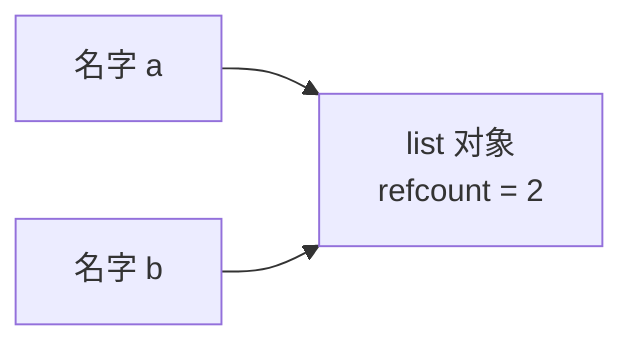

# Python - 第 7 课：内存管理与垃圾回收：引用计数、循环引用、`gc` 与对象缓存

## 学习目标（本节结束后你能做到什么）

- 能解释 `CPython` 为什么以引用计数作为主要内存管理机制，并知道它的优点和局限。
- 能说清对象什么时候会被释放，为什么“没有引用”通常意味着对象可以被回收。
- 能理解循环引用为什么会让单纯引用计数失效，以及 `gc` 模块为什么存在。
- 能区分“对象被回收”“内存归还给 Python 分配器”“内存归还给操作系统”这三件事。
- 能解释小整数缓存、字符串驻留、对象池这类优化为什么会让 `is`、内存占用和释放行为看起来“不直观”。

## 内容讲解（核心概念，用类比、例子、图示说清楚）

### 1. 为什么后端工程师必须懂 Python 内存管理

很多人写 Python 时，会有一种很自然的感觉：

- 我不用手动 `malloc`
- 我不用手动 `free`
- 对象不用了，解释器会自动处理

这当然是 Python 提升开发效率的重要原因。  
但如果你为了面试、排查线上问题、写长期运行的服务，只停在“自动回收”这个层面，就会踩很多坑：

- 为什么一个大列表 `del` 之后，进程内存看起来没明显下降
- 为什么循环引用会导致对象迟迟不释放
- 为什么有 `__del__` 的对象更麻烦
- 为什么 `a is b` 有时候对小整数是 `True`
- 为什么 Python 服务跑久了内存越来越高，不一定就是“垃圾回收坏了”

所以这一课要建立的是运行时视角：

**Python 确实帮你管理内存，但它不是魔法；它有机制、有边界，也有工程代价。**

### 2. 先把范围说清：这里主要讲 `CPython`

Python 是语言，`CPython` 是最主流实现。  
这一课很多内容都默认围绕 `CPython`：

- 引用计数
- 分代垃圾回收
- 对象缓存
- `pymalloc`
- GIL 和引用计数更新的关系

其他实现，比如 `PyPy`，可能采用不同的内存管理策略。  
所以面试时比较严谨的表达应该是：

**在常见的 `CPython` 实现中，内存管理主要依赖引用计数，并辅以循环垃圾回收。**

这句话比简单说“Python 用 GC”要准确得多。

### 3. 引用计数：最核心的一层机制

在 `CPython` 中，每个对象内部都会维护一个引用计数。  
你可以把它理解成：

**当前有多少个地方还在引用这个对象。**

当一个新名字、容器、栈帧等持有这个对象时，引用计数增加；  
当某个引用消失时，引用计数减少。

当引用计数降到 0，说明没有任何地方能再访问这个对象了，于是这个对象通常就可以被释放。

图示如下：



如果执行：

```python
a = [1, 2, 3]
b = a
```

那么这个列表对象至少被 `a` 和 `b` 两个名字引用。  
如果后面执行：

```python
del a
```

不是“立刻删除列表对象”，而是删除名字 `a` 到对象的绑定，列表对象的引用计数减少。  
只要 `b` 还在引用它，它就不会被释放。

### 4. `del` 到底删除了什么

这是一个非常常见的误区。

很多人以为：

```python
del x
```

等于“删除对象”。  
更准确地说，它删除的是：

**当前命名空间里名字 `x` 和对象之间的绑定关系。**

对象是否释放，要看这个对象的引用计数是否因此降到 0。

例如：

```python
a = [1, 2]
b = a
del a
```

这里列表对象还活着，因为 `b` 仍然引用它。

所以面试里如果被问到 `del` 是否释放内存，不要简单回答“是”或“不是”。  
更稳的回答是：

**`del` 删除引用或容器里的绑定；对象是否真正释放，取决于是否还有其他引用。**

### 5. 引用计数的优点

引用计数非常直观，也有明显优点。

#### 5.1 回收及时

当引用计数降到 0 时，对象通常可以马上释放。  
这和一些依赖周期性扫描的垃圾回收器相比，释放时机更确定。

例如一个临时对象离开作用域后，如果没有别的引用，它可能很快被清理。

#### 5.2 实现逻辑相对直接

它不需要一开始就做复杂的全堆扫描。  
只要维护每个对象被引用的次数，就能判断很多对象是否还活着。

#### 5.3 对资源释放有帮助

在 `CPython` 中，由于引用计数释放较及时，某些对象的资源释放看起来也比较及时，比如文件对象不再被引用时可能较快关闭。  
但工程上仍然不应该依赖这一点，而应该使用上下文管理器：

```python
with open("data.txt") as f:
    ...
```

因为“对象最终何时析构”不是你应该用来表达资源生命周期的主要方式。

### 6. 引用计数的最大问题：循环引用

引用计数最经典的缺陷是处理不了循环引用。

看例子：

```python
a = []
b = []
a.append(b)
b.append(a)
```

现在 `a` 引用 `b`，`b` 又引用 `a`。

图示如下：


如果外部名字都删掉：

```python
del a
del b
```

从用户代码角度看，这两个列表已经访问不到了。  
但它们彼此还在引用对方，所以各自引用计数都不是 0。

这就导致一个问题：

- 它们实际上已经是垃圾
- 但单纯引用计数看不出来

这就是循环引用问题。

### 7. `gc` 为什么存在：专门处理循环垃圾

为了解决引用计数处理不了的循环引用，`CPython` 还有一套循环垃圾回收机制，也就是常说的 `gc`。

你可以先把它理解成：

**引用计数负责大多数对象的及时回收，`gc` 负责发现那些“彼此引用但外部已经不可达”的对象。**

这也是为什么准确表述应该是：

- 主机制：引用计数
- 补充机制：分代循环垃圾回收

而不是简单说“Python 用 GC，所以不用管引用”。

### 8. 可达性：判断循环垃圾的关键

循环引用本身不一定是问题。  
真正的问题是：

**这个循环对象群从程序根部还能不能访问到。**

例如：

```python
root = []
a = []
b = []
a.append(b)
b.append(a)
root.append(a)
```

这里 `a` 和 `b` 虽然形成循环，但通过 `root` 仍然能访问到，所以它们不是垃圾。

如果 `root` 也不再引用它们，那这组循环对象就变成不可达垃圾。

所以垃圾回收并不是看到“循环”就删，而是要判断：

- 这组对象是否还从外部可达
- 如果不可达，才可以回收

### 9. 分代垃圾回收：为什么要分代

`gc` 如果每次都扫描所有对象，成本会很高。  
所以 `CPython` 的循环垃圾回收采用了分代思想。

分代思想背后的经验假设是：

**大多数对象要么很快死亡，要么会活比较久。**

因此可以把对象分成不同代：

- 年轻代：新创建对象，检查更频繁
- 老年代：活过多轮检查的对象，检查频率降低

这样做的目的不是“更准确”，而是“更划算”：

- 高频检查容易产生垃圾的年轻对象
- 少扫描长期存活的老对象

这和很多 JVM 垃圾回收器里的分代理念有相似直觉，只是实现细节不同。

### 10. `gc` 模块能做什么

Python 标准库里的 `gc` 模块可以让你观察和控制垃圾回收行为。

常见能力包括：

- 查看是否启用 `gc`
- 手动触发收集
- 查看阈值
- 调试不可回收对象

例如：

```python
import gc

gc.isenabled()
gc.collect()
gc.get_threshold()
```

但工程上要注意：

**不要把 `gc.collect()` 当成解决内存问题的万能按钮。**

如果你的程序持续保留引用，手动触发 GC 也不会释放这些仍然可达的对象。  
真正要排查的是：

- 谁还持有引用
- 哪个缓存没有淘汰
- 哪个全局结构越积越大
- 哪些闭包、回调、任务对象意外保留了大对象

### 11. `__del__` 为什么会让问题更复杂

`__del__` 是对象析构时可能调用的方法。  
但在垃圾回收场景里，它会让事情更复杂。

原因是：

- 如果对象之间存在循环引用
- 它们又都有析构逻辑
- 回收器要决定先析构谁，顺序可能影响行为

现代 Python 对这块已经比早期更稳，但工程上仍然建议：

- 不要把关键资源释放完全寄托在 `__del__`
- 文件、连接、锁、事务这类资源优先用上下文管理器
- 明确的 `close()` / `with` 比等待析构可靠

换句话说：

**垃圾回收负责内存生命周期，不应该替代业务资源生命周期管理。**

### 12. 对象回收不等于内存立刻还给操作系统

这点是线上排查非常重要的知识。

你可能会看到：

```python
big = [0] * 10_000_000
del big
```

然后观察进程内存，发现 RSS 没有明显下降。  
很多人会立刻以为：

- Python 内存泄漏了
- GC 没工作

但这不一定对。

这里要区分三件事：

1. 对象不可达，可以被释放
2. Python 内部分配器回收了这块内存，准备复用
3. 进程把内存归还给操作系统

这三件事不是同一件事。

对象释放后，内存可能进入 Python 自己的内存池或分配器缓存，后续 Python 再创建对象时可以复用。  
所以从操作系统视角看，进程占用不一定马上降。

面试里如果能说清这一点，会显得你很有线上经验。

### 13. `pymalloc` 和小对象分配：为什么 Python 会自己管理内存池

`CPython` 对大量小对象有自己的内存分配策略。  
因为 Python 程序会频繁创建很多小对象：

- 整数
- 短字符串
- 小元组
- 临时函数调用对象
- 各种容器内部结构

如果每次都直接向操作系统申请和释放，成本会很高。  
所以 Python 会使用自己的小对象分配器和内存池机制，提高分配和复用效率。

这带来的结果是：

- 小对象创建销毁更快
- 内存可能被 Python 留着复用
- 进程内存曲线不一定随着对象释放立刻下降

所以排查内存问题时，你不能只盯着“对象已经 del 了，为什么 RSS 不降”。  
你要进一步判断：

- 是对象真的还活着
- 还是对象释放了，但内存被分配器保留复用

### 14. 小整数缓存：为什么有些 `is` 结果看起来很奇怪

前面讲过，`is` 比较的是对象身份。  
但你可能会看到：

```python
a = 100
b = 100
print(a is b)  # 可能是 True
```

这是因为 `CPython` 对一些常用小整数做了缓存。  
常见小整数会被预先创建并复用，避免频繁分配。

这带来一个常见误区：

有人看到 `100 is 100` 是 `True`，就误以为整数比较可以用 `is`。  
这是错误的。

你应该记住：

- `is` 比较身份
- `==` 比较值
- 小整数缓存是实现优化，不是业务语义

所以除了 `None` 这类单例判断，值比较都应该用 `==`。

### 15. 字符串驻留：为什么有些字符串也可能是同一个对象

`CPython` 还可能对某些字符串做驻留，也就是复用相同内容的字符串对象。  
这样可以：

- 减少重复对象
- 加快某些比较
- 优化标识符、属性名等高频字符串使用

但和小整数缓存一样，它也不应该成为你写业务逻辑时依赖的行为。

例如：

```python
a = "hello"
b = "hello"
a is b
```

结果可能是 `True`，但你不能因此说“字符串相等应该用 `is`”。  
正确原则仍然是：

- 比值用 `==`
- 比身份用 `is`

### 16. “内存泄漏”在 Python 里通常长什么样

Python 没有手动释放内存，但仍然可能出现内存持续增长。  
原因通常不是“对象不会自动回收”，而是：

**你还在某个地方持有引用。**

常见场景包括：

- 全局列表、字典不断增长
- LRU 缓存没有上限或命中模式异常
- 日志、任务、请求上下文被错误保存
- 闭包捕获了大对象
- 回调、事件监听器、信号处理器没有注销
- 异步任务对象长期挂起
- ORM session 或连接上下文没有释放

所以排查 Python 内存问题时，第一反应不应该是“强制 GC”，而应该是：

- 哪些对象数量在增长
- 谁引用着它们
- 它们为什么还可达
- 缓存是否有上限
- 生命周期是否设计清楚

### 17. 工程里怎么降低内存风险

#### 17.1 控制缓存边界

缓存一定要问：

- 最大容量是多少
- 过期策略是什么
- key 的粒度是否会无限增长
- 是否需要按租户、用户、请求做隔离

无界缓存是 Python 服务内存上涨的常见源头。

#### 17.2 大对象及时断开引用

如果一个大对象只在某个阶段使用，阶段结束后要避免被长期结构引用。

例如：

- 不要把大结果集放进全局变量
- 不要让闭包无意捕获大对象
- 不要在异常对象或 traceback 里长期保留局部变量链

#### 17.3 流式处理优先于一次性加载

这和第 5 课的生成器思维连起来了。  
大文件、大结果集、大批量数据，尽量考虑：

- 逐行读
- 分页拉
- 批量处理
- 生成器管道

不要轻易一次性读进内存。

#### 17.4 资源释放用上下文管理器

文件、连接、锁这类资源，不要依赖 GC：

```python
with open("data.txt") as f:
    ...
```

这比等待对象析构更明确，也更容易在异常场景下保证释放。

### 18. 面试里怎么系统回答 Python 内存管理

如果面试官问：

- Python 如何做内存管理？
- Python GC 是怎么回事？
- 引用计数有什么问题？
- 为什么 `del` 后内存没降？

你可以按这个结构答：

1. 先限定实现  
   在常见 `CPython` 中，内存管理主要依赖引用计数，辅以分代循环垃圾回收。

2. 再讲引用计数  
   每个对象维护引用计数，引用增加计数加一，引用消失计数减一；计数为 0 时对象通常可被释放。

3. 再讲循环引用  
   引用计数处理不了对象之间互相引用但外部不可达的情况，所以需要 `gc` 来发现循环垃圾。

4. 再讲分代  
   `gc` 用分代思想减少扫描成本，年轻对象检查更频繁，长期存活对象检查更少。

5. 再讲工程边界  
   `del` 删除的是引用绑定，不一定直接释放对象；对象释放也不等于内存立刻归还 OS；小整数缓存、字符串驻留、内存池都会影响观察结果。

6. 最后讲实践  
   排查内存增长时重点看谁还持有引用、缓存是否无界、是否一次性加载大数据，而不是盲目 `gc.collect()`。

这样答会比“Python 有垃圾回收，不用手动释放内存”成熟很多。

## 小结（3-5 条关键点）

- `CPython` 主要依赖引用计数管理对象生命周期，引用计数为 0 时对象通常可以被及时释放。
- 引用计数处理不了循环引用，所以 `CPython` 还需要分代循环垃圾回收机制来发现不可达的循环对象。
- `del` 删除的是名字或容器中的引用绑定，对象是否释放取决于是否还有其他引用。
- 对象释放、Python 分配器复用内存、操作系统层面 RSS 下降是三件不同的事，不能混为一谈。
- 小整数缓存、字符串驻留、对象池是实现优化，不应该改变你使用 `==` 和 `is` 的基本原则。

## 问题（检测用户对当前章节内容是否了解）

1. 请解释 `CPython` 里的引用计数机制：什么时候加一，什么时候减一，什么时候对象通常可以释放？
2. 为什么循环引用会让单纯引用计数失效？请自己举一个两个列表互相引用的例子。
3. `del x` 到底删除了什么？为什么它不一定意味着对象马上被释放？
4. 为什么一个大对象被释放后，进程的 RSS 可能没有明显下降？请区分对象释放、内存池复用和归还操作系统。
5. 小整数缓存和字符串驻留为什么会让 `is` 的结果看起来“不稳定”？为什么业务代码仍然应该用 `==` 比较值？

如果你愿意，我们下一篇就继续写第 8 课，把模块、`import` 系统、包管理、虚拟环境和发布这组工程基础系统讲透。
