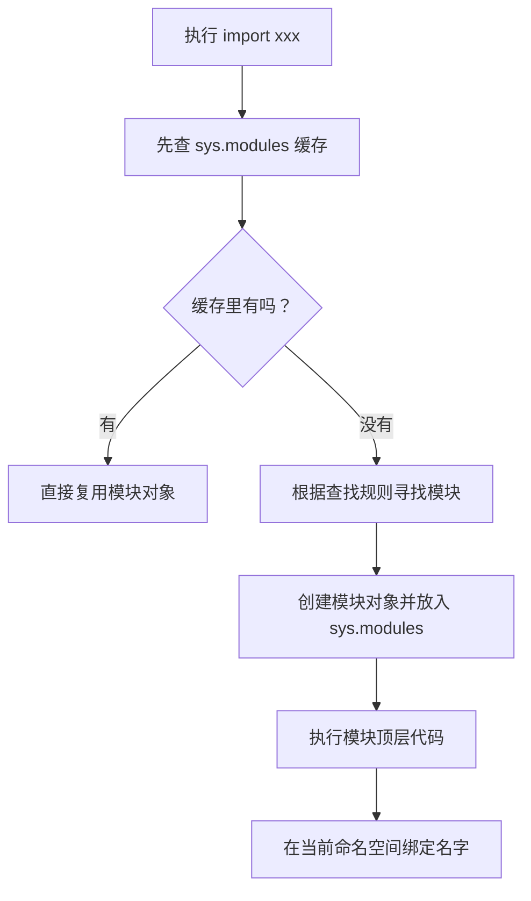

# Python - 第 8 课：模块、`import` 系统、包管理、虚拟环境与发布

## 学习目标（本节结束后你能做到什么）

- 能解释模块、包、项目、发行包这几个概念的区别，不再把它们混成一团。
- 能说清 `import` 大致经历哪些步骤：查缓存、找路径、加载模块、执行顶层代码、绑定名字。
- 能理解 `sys.path`、`sys.modules`、`__init__.py`、绝对导入、相对导入分别在解决什么问题。
- 能解释为什么会出现循环导入、影子模块、脚本运行路径不同导致导入失败等常见工程坑。
- 能建立虚拟环境、依赖管理、`requirements.txt`、`pyproject.toml`、wheel、源码分发之间的基本地图。

## 内容讲解（核心概念，用类比、例子、图示说清楚）

### 1. 为什么第 8 课要从工程化讲起

前面 7 课，我们主要在打语言和运行时地基：

- 对象模型
- 名字绑定
- 容器
- 函数
- 迭代器
- 面向对象高级机制
- 内存管理

这些决定了你能不能把 Python 讲“深”。  
但真实工作里，Python 还有一类很常见的问题，不是语法不会，而是工程组织没理清：

- 明明文件存在，为什么 `ModuleNotFoundError`
- 为什么本地能跑，线上不能跑
- 为什么脚本从不同目录执行，导入结果不一样
- 为什么我建了一个 `requests.py`，结果真正的 `requests` 包导不进来了
- 为什么两个模块互相导入会报奇怪的半初始化错误
- 为什么要用虚拟环境
- `requirements.txt`、`pyproject.toml`、wheel 到底分别是什么

这些问题背后不是玄学，而是 Python 模块系统和依赖环境的规则。  
这一课的目标，就是把这些规则拆清楚。

### 2. 先区分四个概念：模块、包、项目、发行包

这四个词经常被混用，但它们不是一个层次。

#### 2.1 模块（module）

一个 `.py` 文件通常就是一个模块。

例如：

```text
utils.py
```

你可以：

```python
import utils
```

这时 `utils` 就是一个模块对象。

#### 2.2 包（package）

包是一组模块的组织方式，通常是一个目录。  
传统包里通常会有 `__init__.py`：

```text
myapp/
├── __init__.py
├── users.py
└── orders.py
```

这样你可以写：

```python
import myapp.users
```

包的价值是把多个模块组织成命名空间，避免所有文件都堆在同一层。

#### 2.3 项目（project）

项目是你工作中的完整代码仓库或应用单元。  
它可能包含：

- 源码包
- 测试
- 配置
- 文档
- 构建配置
- 依赖声明

例如：

```text
my_service/
├── pyproject.toml
├── README.md
├── src/
│   └── my_service/
│       ├── __init__.py
│       └── api.py
└── tests/
```

#### 2.4 发行包（distribution package）

发行包是可以被安装和分发的包产物。  
比如你执行：

```bash
pip install requests
```

这里安装的是一个发行包。  
它安装后可能提供一个或多个 Python 包和模块。

这就是一个很容易混的点：

- `pip install xxx` 里的 `xxx` 是发行包名
- `import yyy` 里的 `yyy` 是模块名或包名

很多时候它们一样，但并不保证永远一样。

### 3. `import` 不是“复制代码”，而是加载模块对象

很多初学者会把 `import` 想成“把另一个文件的代码复制过来”。  
这个理解非常容易误导。

更准确地说：

**`import` 的目标是找到模块，必要时执行模块顶层代码，创建模块对象，然后把名字绑定到当前命名空间。**

看例子：

```python
import math
```

这不是把 `math` 的源码复制到你的文件里，而是：

- 找到 `math` 模块
- 加载它
- 在当前模块里绑定名字 `math`

之后你访问：

```python
math.sqrt(9)
```

就是通过这个模块对象去访问它的属性。

### 4. `import` 大致经历哪些步骤

可以先记住一个简化流程：



这个流程解释了很多重要行为。

#### 4.1 为什么同一个模块通常只执行一次

因为第一次导入后，模块对象会进入 `sys.modules` 缓存。  
后续再导入同一个模块时，通常会直接复用缓存对象，而不是重新执行一遍顶层代码。

例如：

```python
import config
import config
```

正常情况下，`config.py` 的顶层代码不会因为你写了两次 `import` 就执行两遍。

#### 4.2 为什么模块顶层代码要谨慎

因为导入模块时会执行顶层代码。  
如果你在模块顶层做了很重的事情，比如：

- 发网络请求
- 连数据库
- 启动线程
- 读取大文件
- 执行昂贵计算

那么只要别人 `import` 这个模块，这些副作用就会发生。

工程上更推荐：

- 顶层放定义：函数、类、常量
- 真正执行逻辑放进函数或 `main`
- 用 `if __name__ == "__main__":` 控制脚本入口

### 5. `sys.modules`：模块缓存为什么重要

`sys.modules` 本质上是一个字典，记录已经加载过的模块：

```python
import sys
print(sys.modules)
```

它的 key 通常是模块名，value 是模块对象。

理解它有三个价值：

#### 5.1 解释重复导入不会重复执行

模块第一次加载后就缓存了，后续直接复用。

#### 5.2 解释循环导入里的“半初始化模块”

模块在执行顶层代码之前，通常就已经被放进 `sys.modules`。  
如果这时发生循环导入，另一个模块可能拿到的是一个还没执行完的模块对象。

这就是很多循环导入错误的根源。

#### 5.3 解释为什么 monkey patch 可能影响全局

如果你修改了某个已加载模块对象的属性，其他地方再次导入拿到的是同一个模块对象，就可能看到你的修改。

这也是 Python 动态性很强的一面，但工程上要谨慎使用。

### 6. `sys.path`：Python 到底去哪里找模块

当模块不在缓存中时，Python 需要去找它。  
查找路径通常和 `sys.path` 有关。

你可以看：

```python
import sys
print(sys.path)
```

里面通常包括：

- 当前脚本所在目录或当前工作目录相关路径
- 环境变量提供的路径
- 标准库路径
- 第三方包安装路径
- 其他被工具或框架加入的路径

所以当你遇到：

```text
ModuleNotFoundError
```

不要只想“文件明明在啊”，而要问：

**这个文件所在目录，是否在当前 Python 进程的模块查找路径里？**

这也是为什么同一个脚本：

- 从项目根目录运行
- 从子目录运行
- 用 `python file.py` 运行
- 用 `python -m package.module` 运行

导入行为可能不同。

### 7. `__init__.py` 到底有什么用

传统上，一个目录里有 `__init__.py`，Python 就会把它视为包。

例如：

```text
shop/
├── __init__.py
├── order.py
└── payment.py
```

导入：

```python
import shop.order
```

其中 `__init__.py` 可以是空文件，也可以放一些包初始化逻辑。

但工程上要小心：

- 不要在 `__init__.py` 里做太重的事情
- 不要为了“导入方便”暴露太多内部实现
- 不要让包初始化引入复杂循环导入

你可以把 `__init__.py` 理解成：

**这个包被导入时的入口文件。**

它不是垃圾桶，也不是所有东西都该塞进去的地方。

### 8. 绝对导入和相对导入

#### 8.1 绝对导入

绝对导入从项目或包的顶层命名空间开始写：

```python
from shop.order import create_order
```

优点是清晰，不容易误解来源。

#### 8.2 相对导入

相对导入基于当前包位置：

```python
from .order import create_order
from ..common.logger import get_logger
```

`.` 表示当前包，`..` 表示上一级包。

相对导入适合包内部模块之间引用，但它要求当前模块确实是在包上下文中运行。  
如果你直接运行某个包内部文件：

```bash
python shop/order.py
```

相对导入很可能出问题，因为这个文件此时不一定被当成包的一部分来执行。

更推荐的运行方式通常是从项目根目录用模块方式运行：

```bash
python -m shop.order
```

这会让 Python 以模块身份运行它，包上下文更完整。

### 9. `python file.py` 和 `python -m package.module` 的差别

这是很多导入问题的根源。

#### 9.1 `python file.py`

直接把某个文件当脚本运行。  
这时它的 `__name__` 是：

```python
"__main__"
```

模块查找路径和包上下文可能与你预期不一致。

#### 9.2 `python -m package.module`

把它当成某个包里的模块运行。  
这时 Python 会按模块路径解析它，更适合包内相对导入和项目结构。

所以工程里如果你维护的是包结构，而不是单文件脚本，尽量养成：

```bash
python -m your_package.some_module
```

的习惯。

### 10. `if __name__ == "__main__"` 到底在解决什么

看代码：

```python
def main():
    print("run")

if __name__ == "__main__":
    main()
```

它解决的问题是：

**这个文件既可以被导入，也可以被直接执行。**

当文件被直接运行时：

```python
__name__ == "__main__"
```

所以会执行 `main()`。

当它被别的模块导入时：

```python
__name__ == "模块名"
```

这时不会自动执行脚本逻辑。

这就是为什么它能避免“导入时误执行主流程”。

### 11. 循环导入：为什么两个模块互相导入会炸

循环导入常见形式：

```text
a.py 导入 b.py
b.py 又导入 a.py
```

看起来只是互相引用，但在 Python 的导入执行模型里会变复杂。

假设：

```python
# a.py
from b import func_b

def func_a():
    ...
```

```python
# b.py
from a import func_a

def func_b():
    ...
```

当导入 `a` 时：

1. Python 创建 `a` 模块对象，放入 `sys.modules`
2. 执行 `a.py` 顶层代码，遇到 `from b import func_b`
3. 开始导入 `b`
4. 执行 `b.py`，又遇到 `from a import func_a`
5. 此时 `a` 在缓存里，但 `func_a` 可能还没定义到那一行
6. 于是出现“部分初始化模块”相关错误

这就是循环导入的本质：

**不是两个文件不能互相知道，而是导入执行顺序导致某个名字还没准备好。**

#### 11.1 怎么解决循环导入

常见思路：

- 抽出共同依赖到第三个模块
- 把导入放到函数内部延迟执行
- 重新划分模块职责，避免双向依赖
- 只在类型检查时导入类型，运行时避免导入

最根本的方法通常是：

**降低模块之间的双向耦合。**

如果两个模块必须互相 import，往往说明边界设计已经有点混乱。

### 12. 影子模块：为什么不要把文件命名成标准库或第三方包名

如果你在项目里创建：

```text
requests.py
```

然后写：

```python
import requests
```

Python 可能优先导入你当前目录下的 `requests.py`，而不是真正的第三方 `requests` 包。

这就叫影子模块问题。

常见危险文件名包括：

- `requests.py`
- `json.py`
- `logging.py`
- `typing.py`
- `asyncio.py`
- `email.py`

所以工程习惯上，尽量不要把自己的模块命名成标准库或常见第三方包名。

### 13. 虚拟环境为什么必须用

虚拟环境解决的是：

**不同项目需要不同依赖版本，不能全部混在同一个全局 Python 环境里。**

例如：

- 项目 A 需要 `fastapi==0.x`
- 项目 B 需要另一个版本
- 项目 C 依赖一批数据处理库

如果全部装进全局环境，很快会变成：

- 版本冲突
- 无法复现
- 本地能跑，部署不能跑
- 升级一个项目影响另一个项目

虚拟环境会为项目隔离出一套独立的解释器环境和 site-packages。

常见方式：

```bash
python -m venv .venv
source .venv/bin/activate
```

之后安装的依赖通常会进入 `.venv`，而不是污染全局环境。

### 14. `pip`、`requirements.txt` 和锁定依赖

`pip` 是 Python 生态里最常见的包安装工具之一。

你可以安装依赖：

```bash
pip install requests
```

也可以从文件安装：

```bash
pip install -r requirements.txt
```

#### 14.1 `requirements.txt` 是什么

它通常记录项目运行所需依赖，例如：

```text
requests==2.31.0
fastapi==0.110.0
```

这里有一个工程重点：

- 如果不锁版本，环境可能不可复现
- 如果锁得太死，升级维护成本可能变高

所以团队通常要结合场景选择策略：

- 应用项目更强调可复现，倾向锁具体版本
- 库项目更强调兼容范围，通常不会把所有依赖锁死

### 15. `pyproject.toml`：现代 Python 项目的中心配置

越来越多 Python 项目会使用 `pyproject.toml` 作为项目配置入口。  
它可以承载：

- 构建系统配置
- 项目元数据
- 依赖声明
- 工具配置

例如代码格式化、测试、类型检查工具，也常把配置放进这里。

你可以把它理解成：

**现代 Python 项目的统一配置入口。**

但要注意，不同工具对它的字段支持不同，具体项目还是要看团队约定。

### 16. wheel 和源码分发是什么

当你要发布一个 Python 包时，常见产物包括：

- wheel
- source distribution，也就是源码分发包

#### 16.1 wheel

wheel 是一种构建好的分发格式。  
它的安装通常更快，因为很多构建步骤已经提前完成。

#### 16.2 源码分发

源码分发包包含源码和构建所需信息。  
安装时可能需要在目标机器上构建。

对于纯 Python 包，两者差异可能不太明显；  
但如果涉及 C 扩展、平台相关代码，wheel 的平台兼容性和构建环境就会变得非常重要。

### 17. 应用项目和库项目的依赖策略不同

这一点工程上很重要。

#### 17.1 应用项目

应用项目通常是你要部署运行的服务。  
它更关心：

- 环境可复现
- 部署稳定
- 依赖版本确定

所以应用项目往往更倾向锁定完整依赖版本。

#### 17.2 库项目

库项目是给别人安装和复用的。  
它更关心：

- 给使用方留兼容空间
- 不要过度限制依赖版本
- 语义化版本和兼容范围

所以库项目通常会声明依赖范围，而不是把所有间接依赖都锁死。

这就是为什么“依赖要不要锁死”没有统一答案，要看你是在做应用还是做库。

### 18. 一个推荐的后端项目结构直觉

对于后端项目，一个清晰结构通常比“能 import 就行”重要得多。

一种常见结构是：

```text
my_service/
├── pyproject.toml
├── README.md
├── src/
│   └── my_service/
│       ├── __init__.py
│       ├── api/
│       ├── domain/
│       ├── infra/
│       └── main.py
└── tests/
```

这里有几个好处：

- 源码和测试分开
- 包名清晰
- 不容易误把当前目录当成包
- 更接近真实安装后的导入行为

当然，不是所有项目都必须用 `src` 布局。  
但对中大型项目来说，它能减少很多“本地路径碰巧能导入，安装后却不能”的问题。

### 19. 常见工程坑总结

#### 19.1 在模块顶层写重副作用

别人一 `import` 就触发，容易让启动慢、测试难、循环导入更复杂。

#### 19.2 从错误目录运行脚本

导致 `sys.path` 和包上下文不符合预期。

#### 19.3 文件名撞标准库或第三方库

例如 `json.py`、`logging.py`、`requests.py`。

#### 19.4 循环导入

本质通常是模块职责互相缠绕，需要重新拆边界。

#### 19.5 不使用虚拟环境

导致依赖污染、版本冲突和部署不可复现。

#### 19.6 依赖声明不清

项目能在你机器上跑，不代表别人能复现。

### 20. 面试里怎么系统回答 Python 模块和工程化问题

如果面试官问：

- Python 的 `import` 是怎么工作的？
- 为什么会出现循环导入？
- 虚拟环境有什么用？
- `requirements.txt` 和 `pyproject.toml` 是什么？

你可以按这个框架回答：

1. 先讲模块模型  
   `.py` 文件通常是模块，目录可以组织成包，项目是完整工程，发行包是可安装分发的产物。

2. 再讲导入流程  
   `import` 会先查 `sys.modules`，没有再按查找路径寻找模块，加载后执行顶层代码，并在当前命名空间绑定名字。

3. 再讲查找路径  
   模块能不能找到，与 `sys.path`、运行方式、包上下文有关；直接运行文件和 `python -m` 运行模块会有差异。

4. 再讲常见问题  
   循环导入来自顶层执行顺序和半初始化模块，影子模块来自命名冲突，顶层副作用会放大导入问题。

5. 再讲工程环境  
   虚拟环境隔离项目依赖，依赖文件帮助复现环境，`pyproject.toml` 是现代项目配置入口，wheel 是常见分发格式。

这样答，比简单说“`import` 就是导入模块”要有工程深度得多。

## 小结（3-5 条关键点）

- 模块、包、项目、发行包是不同层次：`.py` 文件通常是模块，目录组织成包，项目是完整工程，发行包是可安装产物。
- `import` 会查 `sys.modules` 缓存、按路径查找模块、执行模块顶层代码，并把模块名绑定到当前命名空间。
- `sys.path` 决定模块查找范围，`python file.py` 和 `python -m package.module` 的运行上下文不同，导入行为也可能不同。
- 循环导入通常不是“不能互相引用”，而是顶层代码执行顺序导致拿到半初始化模块。
- 虚拟环境、依赖声明、`pyproject.toml` 和分发格式共同决定 Python 项目能否被稳定复现、安装和部署。

## 问题（检测用户对当前章节内容是否了解）

1. 模块、包、项目、发行包分别是什么？为什么 `pip install xxx` 里的名字和 `import yyy` 的名字不一定完全一样？
2. 请用自己的话描述一次 `import module` 大致会经历哪些步骤，`sys.modules` 在其中起什么作用？
3. 为什么循环导入会出现“半初始化模块”的问题？你会优先用哪些方式解决？
4. `python file.py` 和 `python -m package.module` 的核心差异是什么？为什么包内部模块更推荐后者？
5. 虚拟环境解决什么问题？应用项目和库项目在依赖版本管理上为什么策略可能不同？

如果你愿意，我们下一篇就继续写第 9 课，把异常、上下文管理器、日志与测试串成“把脚本写成工程代码”的完整能力。
