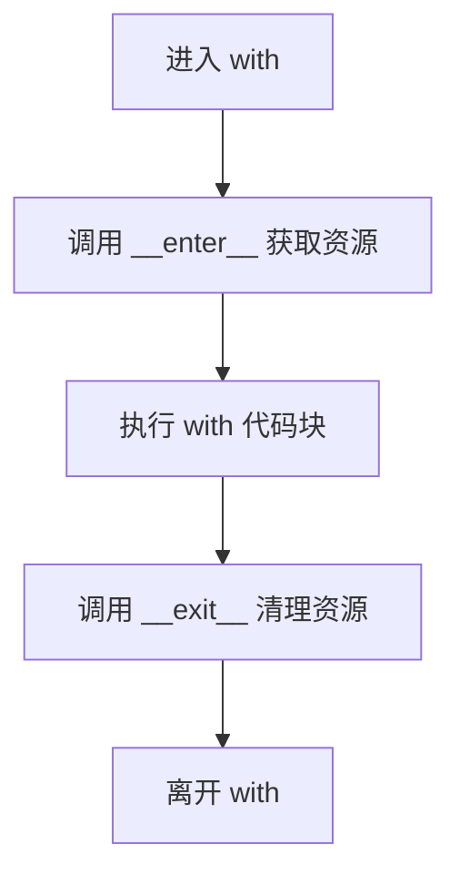

# Python - 第 9 课：异常、上下文管理器、日志与测试：把脚本写成工程代码

## 学习目标（本节结束后你能做到什么）

- 能区分“异常处理”和“吞掉错误”，知道什么时候该捕获、什么时候该继续抛出。
- 能理解 `try` / `except` / `else` / `finally`、异常链、`raise from`、自定义异常的工程价值。
- 能解释上下文管理器为什么适合管理资源生命周期，以及 `with` 背后大致发生了什么。
- 能把 `print` 调试升级为结构化日志思维，理解日志级别、logger 层级、异常日志和上下文字段。
- 能建立测试意识：把脚本拆成可测试函数，用单元测试、集成测试、fixture、mock 去控制复杂度。

## 内容讲解（核心概念，用类比、例子、图示说清楚）

### 1. 为什么这一课是“脚本”和“工程”的分水岭

Python 很容易写出能跑的脚本。

比如：

```python
data = requests.get(url).json()
for item in data:
    save_to_db(item)
print("done")
```

这类代码在一次性任务、临时验证、个人工具里很常见。  
但如果它进入后端服务、定时任务、数据处理链路、AI 工具平台，问题就来了：

- 请求失败怎么办
- 数据格式异常怎么办
- 数据库写到一半失败怎么办
- 资源有没有释放
- 线上出错时能不能从日志定位
- 修改逻辑后怎么证明没引入回归
- 失败时应该重试、跳过、报警，还是直接终止

这些问题靠“多写几个 `if`”解决不了。  
它们需要一套工程能力：

- 异常处理：错误如何表达、传播、恢复
- 上下文管理器：资源如何安全获取和释放
- 日志：线上发生什么，如何留下可排查证据
- 测试：代码变更后，如何证明行为仍然正确

这一课的目标就是把 Python 从“能跑”推向“可维护”。

### 2. 异常的本质：把错误从正常返回值里分离出来

在没有异常机制的风格里，函数常常通过返回值表达成功或失败：

```python
result, err = read_config(path)
if err:
    ...
```

这种方式当然也能工作，但代码很容易被错误判断淹没。  
异常机制的核心思想是：

**正常路径保持清晰，异常路径通过抛出和捕获单独处理。**

例如：

```python
def load_config(path):
    with open(path) as f:
        return json.load(f)
```

如果文件不存在、JSON 格式错误，函数可以直接抛异常。  
调用方再根据场景决定：

- 这是启动配置，失败就终止
- 这是用户上传文件，失败就返回 400
- 这是批处理某一条数据，失败就记录并跳过

所以异常不是“坏事”，它是一种错误表达机制。

### 3. `try` / `except` / `else` / `finally` 分别负责什么

最常见结构是：

```python
try:
    result = risky_operation()
except SpecificError as e:
    handle_error(e)
else:
    handle_success(result)
finally:
    cleanup()
```

这四块职责不同：

- `try`：放可能失败的核心操作
- `except`：处理特定异常
- `else`：没有异常时执行
- `finally`：无论是否异常都执行，通常用于清理

#### 3.1 为什么要用 `else`

很多人从来不用 `else`，把所有成功逻辑都塞进 `try`。

例如：

```python
try:
    data = load_data()
    process(data)
except LoadError:
    ...
```

这里有个问题：  
如果 `process(data)` 也抛了 `LoadError`，可能被同一个 `except` 捕获，导致错误边界混乱。

更清晰的写法是：

```python
try:
    data = load_data()
except LoadError:
    ...
else:
    process(data)
```

`else` 的价值是把“可能失败的范围”收窄，让异常处理更精准。

#### 3.2 `finally` 不等于“成功后执行”

`finally` 是无论如何都会执行：

- 成功会执行
- 抛异常会执行
- `return` 前也会执行

它更适合放清理逻辑，而不是业务成功逻辑。

### 4. 不要裸 `except`

非常常见的坏写法：

```python
try:
    do_something()
except:
    pass
```

这段代码的问题很严重：

- 它会吞掉你没预料到的错误
- 线上失败时没有日志
- 调试会非常痛苦
- 甚至可能吞掉系统退出、键盘中断等特殊异常

更好的原则是：

**只捕获你知道怎么处理的异常。**

例如：

```python
try:
    user = load_user(user_id)
except UserNotFound:
    return None
```

如果你不知道怎么处理，就让异常继续向上抛。  
“不捕获”有时比“乱捕获”更负责任。

### 5. 捕获异常的三个层次

工程里可以把异常处理分成三层。

#### 5.1 就地恢复

你知道如何恢复，比如：

- 文件不存在就创建默认文件
- 缓存读取失败就回源数据库
- 某条脏数据跳过并记录

这时可以在本地捕获。

#### 5.2 转换语义

底层异常对上层没有业务意义，需要转换。

例如数据库抛出底层连接错误，你可能转成：

```python
class UserRepositoryUnavailable(Exception):
    pass
```

这样上层不用理解数据库驱动细节。

#### 5.3 边界兜底

比如 Web 服务入口、任务调度入口、CLI 主入口。  
在系统边界统一捕获未处理异常，记录日志，返回标准错误响应或退出码。

这三层不要混：

- 不是每个函数都要兜底
- 不是每个异常都要转义
- 不是每个错误都能就地恢复

### 6. 异常链和 `raise from`

有时你需要捕获一个底层异常，再抛出更有业务语义的异常。

例如：

```python
try:
    raw = client.get_user(user_id)
except TimeoutError as e:
    raise UserServiceTimeout(user_id) from e
```

`raise from` 的价值是：

- 上层看到的是业务异常
- 原始异常链没有丢
- 排查时仍然能看到根因

如果你直接：

```python
raise UserServiceTimeout(user_id)
```

也能抛，但异常之间的因果关系不够清楚。

所以面试里如果被问到“如何保留异常上下文”，可以提 `raise from`。

### 7. 自定义异常什么时候有价值

不是所有错误都需要自定义异常。  
如果内建异常已经表达得很清楚，可以直接用。

自定义异常适合这些情况：

- 你要表达业务语义
- 上层需要按错误类型做不同处理
- 你想屏蔽底层实现细节
- 你想形成模块或领域内统一错误体系

例如：

```python
class PaymentError(Exception):
    pass

class PaymentTimeout(PaymentError):
    pass

class PaymentRejected(PaymentError):
    pass
```

这样上层可以：

```python
try:
    pay(order)
except PaymentTimeout:
    retry_later(order)
except PaymentRejected:
    mark_failed(order)
```

异常类型本身就是控制流和业务语义的一部分。

### 8. EAFP 和 LBYL：Python 常说的两种风格

Python 里常见两个缩写：

- EAFP：Easier to Ask Forgiveness than Permission，先做，失败再处理
- LBYL：Look Before You Leap，先检查，再做

#### 8.1 LBYL 例子

```python
if key in data:
    value = data[key]
else:
    value = default
```

#### 8.2 EAFP 例子

```python
try:
    value = data[key]
except KeyError:
    value = default
```

Python 社区常偏好 EAFP，因为很多对象是协议驱动的，直接尝试操作更自然。  
但这不是绝对规则。

#### 8.3 什么时候不适合 EAFP

如果失败很常见，而且异常路径成本高、日志噪音大、语义不清晰，那先检查可能更合适。  
另外对于用户输入校验、权限检查、业务规则判断，明确判断往往更可读。

成熟的结论是：

**EAFP 是 Python 风格之一，但不是所有场景都要用异常代替条件判断。**

### 9. 上下文管理器：资源生命周期的工程化表达

很多资源有固定生命周期：

- 打开文件，最后关闭
- 获取锁，最后释放
- 开启事务，最后提交或回滚
- 建立连接，最后归还连接池
- 临时切换配置，最后恢复

如果只靠手写：

```python
f = open(path)
try:
    ...
finally:
    f.close()
```

代码会很啰嗦。  
`with` 语句和上下文管理器就是为这类模式服务的。

例如：

```python
with open(path) as f:
    data = f.read()
```

它表达的是：

**进入这个上下文时获取资源，离开这个上下文时自动清理资源。**

### 10. `with` 背后大致发生了什么

一个上下文管理器通常实现：

- `__enter__`
- `__exit__`

例如：

```python
class ManagedResource:
    def __enter__(self):
        print("acquire")
        return self

    def __exit__(self, exc_type, exc, tb):
        print("release")
```

使用：

```python
with ManagedResource() as resource:
    print("use")
```

大致流程是：



如果代码块里抛异常，`__exit__` 仍然会被调用。  
这就是它适合资源管理的关键原因。

### 11. `__exit__` 能不能吞异常

`__exit__(exc_type, exc, tb)` 会收到异常信息。  
如果它返回 `True`，表示异常被处理掉，不再向外传播；如果返回 `False` 或 `None`，异常继续抛出。

这很强，但也要慎用。

大多数资源清理型上下文管理器不应该吞异常，只负责释放资源。  
否则调用方可能以为操作成功了，实际错误已经被悄悄吃掉。

### 12. `contextlib`：更轻量地写上下文管理器

如果不想手写类，可以用 `contextlib.contextmanager`：

```python
from contextlib import contextmanager

@contextmanager
def managed():
    print("acquire")
    try:
        yield
    finally:
        print("release")
```

使用：

```python
with managed():
    print("use")
```

这里的 `yield` 把上下文管理器分成两段：

- `yield` 前：进入上下文
- `yield` 后的 `finally`：退出上下文

你会发现，这和第 5 课的生成器知识直接连上了。

### 13. 日志：为什么 `print` 不是工程日志

`print` 很适合临时调试，但不适合线上工程。

工程日志需要回答：

- 什么时候发生的
- 哪个模块发生的
- 严重程度是什么
- 请求 id / 用户 id / 订单 id 是什么
- 异常堆栈是什么
- 是否能被日志系统采集和检索

`print` 通常缺少这些结构。

Python 标准库提供 `logging`：

```python
import logging

logger = logging.getLogger(__name__)

logger.info("user created")
```

使用 `__name__` 的好处是 logger 名字和模块路径对应，方便按模块管理日志级别。

### 14. 日志级别怎么用

常见级别包括：

- `DEBUG`：调试细节，生产默认通常不开
- `INFO`：正常关键流程
- `WARNING`：有异常迹象但系统还能继续
- `ERROR`：某个操作失败，需要关注
- `CRITICAL`：系统级严重故障

不要把所有日志都打成 `ERROR`。  
如果用户输入错误、业务校验失败、本来就可预期，可能不应该上升到系统错误级别。

日志级别的本质是：

**告诉读日志的人和系统，这件事有多严重、需不需要行动。**

### 15. 异常日志怎么打

捕获异常时，最好保留堆栈。

常见写法：

```python
try:
    process(order)
except Exception:
    logger.exception("failed to process order", extra={"order_id": order.id})
    raise
```

`logger.exception()` 会自动记录当前异常堆栈，通常只应该在 `except` 块里使用。

这里有两个重点：

- 记录上下文，比如 `order_id`
- 不要记录完就无脑吞掉，是否继续抛出要看调用方是否还能恢复

### 16. 日志要带上下文

一条没有上下文的日志很难排查：

```text
failed to process
```

更好的日志应该能回答：

- 哪个任务
- 哪个用户
- 哪个订单
- 哪个外部系统
- 重试第几次
- 耗时多少

例如：

```python
logger.warning(
    "payment provider timeout",
    extra={
        "order_id": order_id,
        "provider": "stripe",
        "attempt": attempt,
    },
)
```

真实后端系统里，结构化日志通常更利于检索和聚合。  
即使暂时不用完整结构化日志，也要养成“日志携带关键上下文”的习惯。

### 17. 测试：为什么脚本难测试

很多脚本难测试，是因为它把所有事情写在一起：

```python
data = read_file()
result = transform(data)
write_db(result)
send_email()
```

如果没有函数边界、没有依赖注入、没有清晰输入输出，测试就会很痛苦。

可测试代码通常有几个特点：

- 核心逻辑是纯函数或接近纯函数
- I/O 边界被隔离
- 外部依赖可以替换
- 错误路径可被模拟
- 函数职责小而清楚

所以测试不是最后补几个文件，而会反过来影响代码设计。

### 18. 单元测试、集成测试、端到端测试

#### 18.1 单元测试

测试一个小函数或小模块，不依赖真实数据库、网络、文件系统。  
重点是快、稳定、定位精确。

#### 18.2 集成测试

测试多个组件是否能配合工作，比如服务和数据库、缓存、消息队列。  
它更接近真实环境，但成本更高。

#### 18.3 端到端测试

从用户入口或 API 入口跑完整链路。  
价值大，但慢、脆弱、维护成本高。

成熟项目通常不会只靠一种测试，而是组合使用。

### 19. `pytest` 的基本思维

Python 项目里常用 `pytest`。  
一个测试可以很简单：

```python
def test_add():
    assert add(1, 2) == 3
```

测试文件通常命名为：

```text
test_xxx.py
```

测试函数通常以：

```text
test_
```

开头。

`pytest` 的强大之处不仅在于断言简单，还在于：

- fixture
- 参数化
- 临时目录
- monkeypatch
- 丰富插件生态

### 20. fixture：把测试准备逻辑抽出来

如果多个测试都需要准备同样数据，可以用 fixture。

例如：

```python
import pytest

@pytest.fixture
def sample_user():
    return {"id": 1, "name": "Alice"}

def test_user_name(sample_user):
    assert sample_user["name"] == "Alice"
```

fixture 的价值是：

- 复用测试准备逻辑
- 让测试主体更聚焦行为
- 管理资源创建和清理

它和上下文管理器一样，都是在表达生命周期，只是测试场景下的生命周期。

### 21. mock：不要让单元测试依赖不可控外部世界

如果一个函数会调用外部接口，单元测试里通常不希望真的发请求。

这时可以用 mock 替换外部依赖。

但 mock 也有边界：

- mock 太多，测试可能只是在验证实现细节
- mock 的行为和真实系统偏离，测试会给你虚假的安全感
- 对关键集成点，仍然需要集成测试兜底

所以成熟的测试策略不是“全部 mock”，而是：

- 单元测试中隔离外部依赖
- 集成测试中验证真实协作

### 22. 异常路径也要测试

很多人只测试成功路径：

- 输入正确时返回什么

但工程代码最容易出问题的地方往往是异常路径：

- 文件不存在
- 网络超时
- 数据格式错误
- 权限不足
- 第三方返回异常

例如：

```python
import pytest

def test_load_config_missing_file():
    with pytest.raises(FileNotFoundError):
        load_config("missing.json")
```

这类测试能帮你明确：

- 失败时到底抛什么异常
- 调用方应该如何处理
- 错误语义是否稳定

### 23. 把脚本改造成工程代码的一个基本模板

一个临时脚本常常这样：

```python
data = read_input()
result = transform(data)
write_output(result)
```

更工程化的结构可以是：

```python
def transform(data):
    ...

def run(input_path, output_path):
    data = read_input(input_path)
    result = transform(data)
    write_output(output_path, result)

def main():
    run("input.json", "output.json")

if __name__ == "__main__":
    main()
```

这样做的好处：

- `transform` 可以单独测试
- `run` 表达流程
- `main` 处理入口
- 导入模块不会自动执行任务
- 未来加参数解析、日志、异常兜底更自然

### 24. 一个后端任务的工程化骨架

比如一个批处理任务，可以粗略组织成：

```python
import logging

logger = logging.getLogger(__name__)

def process_one(item):
    ...

def run_batch(items):
    success = 0
    failed = 0

    for item in items:
        try:
            process_one(item)
        except RecoverableError:
            failed += 1
            logger.exception("failed to process item", extra={"item_id": item.id})
        else:
            success += 1

    return {"success": success, "failed": failed}

def main():
    try:
        items = load_items()
        result = run_batch(items)
        logger.info("batch finished", extra=result)
    except Exception:
        logger.exception("batch crashed")
        raise
```

这里体现了几件事：

- 单条失败和整体崩溃区分开
- 错误有日志
- 结果有统计
- 顶层有兜底
- 核心逻辑可以测试

这就是从“能跑”走向“能维护”的差异。

### 25. 面试里怎么系统回答这一组问题

如果面试官问：

- Python 异常处理最佳实践是什么？
- `with` 背后是什么？
- 为什么不用 `print` 当日志？
- 你怎么写可测试的 Python 代码？

你可以按这个框架回答：

1. 先讲异常  
   只捕获知道如何处理的异常，避免裸 `except`；需要转换语义时用自定义异常和 `raise from`；边界层做统一兜底。

2. 再讲资源  
   文件、连接、锁、事务这类资源用上下文管理器表达生命周期，`with` 会调用 `__enter__` 和 `__exit__`，异常时也能清理。

3. 再讲日志  
   工程日志要有级别、模块名、上下文和异常堆栈；`logger.exception` 适合在异常处理中保留 traceback。

4. 再讲测试  
   把核心逻辑拆成可测试函数，隔离 I/O 和外部依赖；单元测试覆盖纯逻辑，集成测试验证组件协作，异常路径也要测。

5. 最后讲工程结构  
   用 `main()` 和 `if __name__ == "__main__"` 控制入口，避免导入时执行副作用，让脚本可以被复用和测试。

这样答，面试官会感觉你不仅会写 Python，还理解后端工程代码的长期维护成本。

## 小结（3-5 条关键点）

- 异常处理不是把错误吞掉，而是让错误有清晰语义、传播路径和恢复策略；只捕获你知道怎么处理的异常。
- `with` 和上下文管理器用于表达资源生命周期，核心是进入时获取资源、离开时释放资源，异常场景也能清理。
- 工程日志不能只靠 `print`，要有级别、模块、上下文和异常堆栈，方便线上检索和定位。
- 测试会反向推动代码设计：核心逻辑要可单测，I/O 和外部依赖要隔离，异常路径也要覆盖。
- 从脚本到工程代码的关键，是把入口、流程、核心逻辑、资源管理、日志和测试边界拆清楚。

## 问题（检测用户对当前章节内容是否了解）

1. 为什么不推荐裸 `except`？什么情况下你会捕获异常，什么情况下你会让异常继续向上抛？
2. `try` / `except` / `else` / `finally` 分别适合放什么逻辑？为什么 `else` 能帮助缩小异常捕获范围？
3. `with` 语句背后大致调用了哪两个方法？为什么它比手写 `try/finally` 更适合表达资源生命周期？
4. `logger.exception()` 和普通 `logger.error()` 的核心区别是什么？为什么异常日志一定要带上下文？
5. 如果你要把一个一次性脚本改成可测试工程代码，你会先做哪几件事？

如果你愿意，我们下一篇就继续写第 10 课，把线程、协程、多进程和 I/O 模型的选型框架系统讲透。
