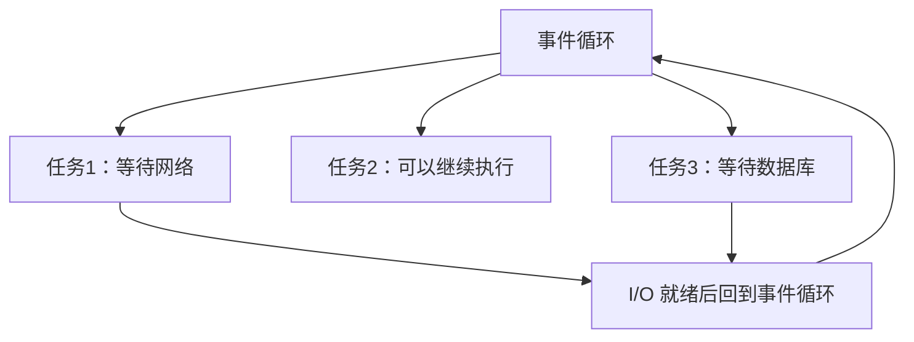
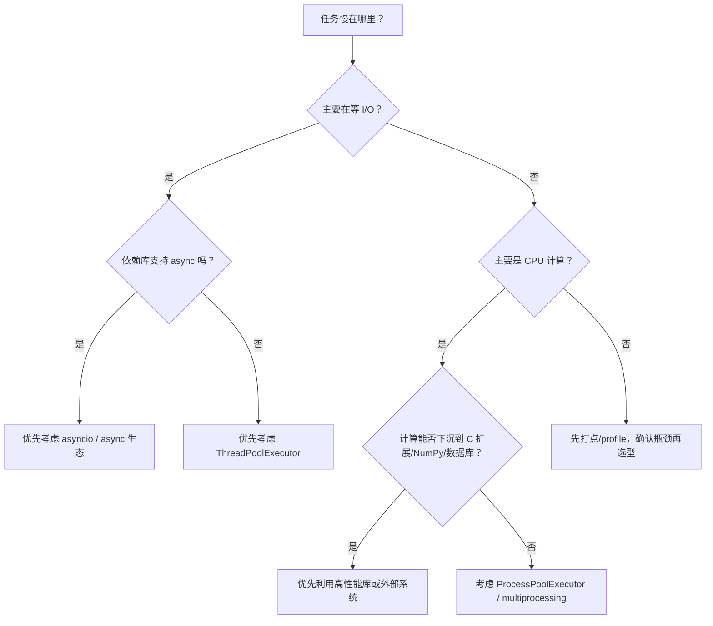

# Python - 第 10 课：并发总览：线程、协程、多进程与 I/O 模型怎么选

## 学习目标（本节结束后你能做到什么）

- 能区分并发和并行，不再把“同时处理多个任务”和“多个 CPU 核心真正同时执行”混成一件事。
- 能判断一个任务是 I/O 密集型、CPU 密集型，还是混合型，并据此选择线程、协程或多进程。
- 能解释 GIL 对 `CPython` 多线程的真实影响，知道它限制什么、不限制什么。
- 能理解线程池、事件循环、协程、多进程池分别适合解决什么工程问题。
- 能建立一套面试和工程都能用的 Python 并发选型框架。

## 内容讲解（核心概念，用类比、例子、图示说清楚）

### 1. 为什么并发是 Python 面试里的大题

Python 并发特别容易被学乱。

很多人脑子里同时塞着这些词：

- `threading`
- `ThreadPoolExecutor`
- `asyncio`
- `async` / `await`
- `multiprocessing`
- `ProcessPoolExecutor`
- GIL
- 阻塞 I/O
- 非阻塞 I/O
- 事件循环

如果没有总图，就会出现几种常见误区：

- 一听并发就开线程
- 一听 Python 多线程就说“没用，因为 GIL”
- 一听高并发就说“用协程”
- 一听 CPU 密集就说“多进程”，但不知道代价
- `asyncio` 会写，但不知道为什么必须配合非阻塞 I/O

所以第 10 课不急着写某一种 API，而是先建立判断框架：

**先判断任务类型，再选择并发模型。**

这是 Python 并发学习最重要的一句话。

### 2. 并发和并行不是一回事

这两个词经常被混用，但面试里最好分清。

#### 2.1 并发（concurrency）

并发强调的是：

**系统能同时推进多个任务。**

它不要求这些任务在同一瞬间真的都在 CPU 上执行。  
即使只有一个 CPU 核心，只要系统能在多个任务之间切换，让它们交替推进，也可以叫并发。

比如：

- 任务 A 等网络响应
- 任务 B 趁机执行
- 任务 C 等数据库返回
- 任务 A 返回后继续处理

这种场景里，任务在时间线上交错推进。

#### 2.2 并行（parallelism）

并行强调的是：

**多个任务在同一时刻真正同时执行。**

这通常需要多个 CPU 核心或多个计算资源。

比如：

- 进程 A 在 CPU 核心 1 上计算
- 进程 B 在 CPU 核心 2 上计算
- 两个进程真的同时跑

#### 2.3 一句话区分

- 并发：处理多个任务的结构能力
- 并行：多个任务真正同时执行的计算能力

图示如下：


Python 线程、协程、多进程都可以做并发；  
但在 `CPython` 里，要让纯 Python CPU 计算真正多核并行，通常更依赖多进程或 C 扩展。

### 3. 先判断任务类型：I/O 密集 vs CPU 密集

并发选型的第一步不是问：

- 用线程还是协程？

而是问：

**任务主要时间花在哪里？**

#### 3.1 I/O 密集型任务

I/O 密集型任务的特点是：

**大部分时间在等外部系统。**

典型例子：

- 发 HTTP 请求
- 查数据库
- 读写文件
- 访问 Redis
- 等消息队列
- socket 网络通信
- 调第三方 API

这类任务的瓶颈通常不是 CPU 算不过来，而是：

- 网络延迟
- 磁盘延迟
- 数据库响应时间
- 外部服务处理时间

这时并发的价值是：

**把等待时间重叠起来。**

#### 3.2 CPU 密集型任务

CPU 密集型任务的特点是：

**大部分时间在计算。**

典型例子：

- 大量纯 Python 循环计算
- 加密解密
- 图片逐像素处理
- 大规模文本解析和复杂规则匹配
- 复杂算法搜索
- 压缩、编码、统计计算

这类任务的瓶颈是 CPU 本身。  
你要提升吞吐，就需要更多真实计算资源，或者把计算下沉到更高效的实现。

#### 3.3 混合型任务

真实后端系统经常是混合型：

- 先请求接口
- 再解析 JSON
- 再写数据库
- 再做一点计算

这种场景不能简单贴标签，要看主要耗时在哪里。  
如果 90% 时间在等网络，就是 I/O 密集；如果 90% 时间在本地计算，就是 CPU 密集。

成熟的做法是：

- 先 profile 或打点
- 再决定并发模型
- 不要凭感觉优化

### 4. 三种主流模型先给总图

Python 常见并发模型可以先粗略分成三类：

| 模型 | 常见工具 | 适合场景 | 关键代价 |
| --- | --- | --- | --- |
| 多线程 | `threading`、`ThreadPoolExecutor` | I/O 密集、阻塞库较多 | 线程切换、共享状态、GIL 限制 CPU 并行 |
| 协程 | `asyncio`、`async` / `await` | 高并发 I/O、非阻塞库生态 | 需要 async 生态、调用链传染、不能阻塞事件循环 |
| 多进程 | `multiprocessing`、`ProcessPoolExecutor` | CPU 密集、绕开 GIL | 进程开销、数据序列化、进程间通信成本 |

如果只记一个最实用版本：

- I/O 密集 + 阻塞库：优先线程池
- I/O 密集 + async 生态：优先协程
- CPU 密集：优先多进程或 C 扩展 / NumPy 等

### 5. GIL 到底限制了什么

GIL 是 `Global Interpreter Lock`，全局解释器锁。  
在常见 `CPython` 中，它的核心影响可以先这样理解：

**同一个进程内，同一时刻通常只有一个线程在执行 Python 字节码。**

这句话有几个边界必须讲清楚。

#### 5.1 GIL 主要影响纯 Python CPU 计算

如果你开多个线程做大量纯 Python 计算，多个线程通常不能真正同时执行 Python 字节码。  
它们会在 GIL 下轮流执行。

结果可能是：

- 没有明显加速
- 甚至因为线程切换更慢

所以纯 Python CPU 密集任务通常不适合靠多线程加速。

#### 5.2 GIL 不等于 Python 线程没用

这句话也非常重要。

线程在等待 I/O 时，通常会释放 GIL，让别的线程继续跑。  
所以在 I/O 密集场景下，多线程仍然很有价值。

例如：

- 线程 A 等 HTTP 响应
- 线程 B 可以继续发另一个请求
- 线程 C 可以处理已经返回的数据

这就是为什么：

**GIL 限制的是 CPU 密集型多线程并行能力，不是所有并发能力。**

#### 5.3 GIL 也不等于所有 C 扩展都不能并行

一些 C 扩展在执行耗时计算时可能释放 GIL。  
例如很多数值计算库会把重计算放到 C / Fortran / 原生库里执行。

这意味着：

- 纯 Python 循环可能受 GIL 影响明显
- 但 NumPy 这类库内部计算可能不完全受同样限制

面试里如果能讲出这个边界，比一句“Python 有 GIL 所以慢”成熟很多。

### 6. 多线程：适合重叠等待，但要小心共享状态

Python 多线程最自然的战场是 I/O 密集型任务。

例如你要并发请求 100 个 URL：

```python
from concurrent.futures import ThreadPoolExecutor

def fetch(url):
    return requests.get(url, timeout=3).text

with ThreadPoolExecutor(max_workers=20) as pool:
    results = list(pool.map(fetch, urls))
```

这种场景下，线程池能让多个网络等待重叠起来。

#### 6.1 为什么推荐线程池而不是手动开一堆线程

`ThreadPoolExecutor` 的工程价值在于：

- 控制最大并发数
- 复用线程
- 收集返回值
- 传播异常
- 更容易管理生命周期

如果你手动创建很多 `threading.Thread`，很容易遇到：

- 线程数量失控
- 异常丢失
- 退出管理混乱
- 结果收集麻烦

所以工程里常见建议是：

**优先用线程池，而不是裸线程。**

#### 6.2 多线程最大的工程风险：共享状态

线程共享同一个进程内存。  
这既是优点，也是风险。

优点是：

- 数据共享方便
- 创建成本低于进程

风险是：

- 多个线程同时改同一个对象可能产生竞态
- 锁用不好会死锁
- 状态越共享，程序越难推理

所以多线程设计里有一个非常重要的原则：

**尽量减少共享可变状态。**

可以用：

- 队列传递任务
- 每个任务返回结果
- 只在主线程汇总
- 必要时用锁保护临界区

### 7. 协程：用单线程管理大量 I/O 等待

协程的直觉是：

**不是让操作系统在线程之间切换，而是让程序在遇到等待点时主动让出控制权。**

在 Python 里，现代协程主要通过：

- `async def`
- `await`
- `asyncio`

来表达。

例如：

```python
import asyncio

async def fetch(url):
    ...

async def main():
    results = await asyncio.gather(
        fetch(url1),
        fetch(url2),
        fetch(url3),
    )
```

#### 7.1 协程为什么适合高并发 I/O

线程的上下文切换由操作系统调度，线程数量很多时成本不低。  
协程运行在用户态，切换更轻量。

更重要的是，协程非常适合表达：

- 我现在要等网络
- 等的时候把控制权交回事件循环
- 事件循环去推进别的任务
- 等数据来了再恢复我

这就是高并发 I/O 的典型模式。

#### 7.2 协程不是多核并行

这点非常重要。

协程通常运行在一个线程的事件循环里。  
它的优势是高效管理大量等待，不是把纯 Python 计算自动分到多个 CPU 核心上。

如果你在协程里写一个很重的 CPU 循环：

```python
async def bad():
    while True:
        heavy_compute()
```

它可能会堵住整个事件循环，让其他协程都没机会运行。

所以协程里的关键原则是：

**不要阻塞事件循环。**

### 8. 事件循环：协程世界的调度中心

事件循环可以理解成协程系统里的调度器。

它大致做几件事：

- 维护待执行任务
- 监听 I/O 事件
- 哪个任务准备好了就推进哪个
- 遇到 `await` 时切走
- 等待完成后再恢复

图示如下：



你可以把事件循环想成一个很忙的调度员：

- 谁在等，就先挂起
- 谁准备好了，就继续推进
- 不浪费时间傻等

### 9. 协程的最大工程门槛：生态和调用链

协程并不是“把函数前面加 `async` 就更快”。

要让协程发挥作用，你的等待操作必须是异步友好的。  
也就是说：

- HTTP 客户端要支持 async
- 数据库驱动要支持 async
- Redis 客户端要支持 async
- 文件或其他 I/O 操作不能随便阻塞事件循环

如果你在 `async def` 里调用一个阻塞函数：

```python
async def handler():
    requests.get(url)  # 阻塞
```

这仍然会阻塞事件循环。  
看起来写了协程，实际上破坏了协程调度。

所以协程的工程门槛在于：

- 依赖库要支持 async
- 调用链要 async 化
- 团队要理解不能阻塞事件循环

这也是为什么有些项目用线程池更现实。

### 10. 多进程：绕开 GIL 做真正 CPU 并行

多进程的核心优势是：

**每个进程有自己的 Python 解释器和 GIL，所以可以利用多核做 CPU 并行。**

例如：

```python
from concurrent.futures import ProcessPoolExecutor

def compute(x):
    return heavy_cpu_work(x)

with ProcessPoolExecutor() as pool:
    results = list(pool.map(compute, data))
```

这类场景适合：

- 每个任务计算量比较大
- 任务之间相对独立
- 输入输出可以被序列化
- 不需要频繁共享大量状态

#### 10.1 多进程的代价

多进程不是免费午餐。

它的代价包括：

- 进程创建成本更高
- 进程间内存不共享
- 参数和结果通常要序列化
- 大对象传来传去成本很高
- 调试和部署复杂度更高

所以如果每个任务很小，多进程可能反而更慢。  
它适合“粗粒度 CPU 密集任务”，不适合把非常细碎的小计算都拆成进程任务。

### 11. 阻塞 I/O、非阻塞 I/O 和 I/O 多路复用

为了理解协程，最好建立一点 I/O 模型直觉。

#### 11.1 阻塞 I/O

阻塞 I/O 的直觉是：

**调用发出去后，当前执行流停在那里等结果。**

例如：

```python
data = socket.recv(1024)
```

如果没有数据，线程可能就卡住等待。

#### 11.2 非阻塞 I/O

非阻塞 I/O 的直觉是：

**调用不会一直等，如果暂时没数据，就立刻告诉你还没准备好。**

这样程序可以先去干别的事。

#### 11.3 I/O 多路复用

I/O 多路复用的直觉是：

**用一个线程监听很多 I/O 对象，哪个准备好了就处理哪个。**

底层常见机制包括：

- `select`
- `poll`
- `epoll`
- `kqueue`

你不一定需要在 Python 面试里展开这些系统调用细节，但要知道：

**事件循环和高并发 I/O 背后，离不开“不要每个连接都傻等一个线程”的思想。**

### 12. Web 后端里怎么选

#### 12.1 传统同步 Web 服务

如果你的框架和依赖主要是同步阻塞式，比如大量使用同步数据库驱动、同步 HTTP 客户端，那么线程池或多 worker 模型通常更自然。

典型思路：

- 每个请求由某个 worker / 线程处理
- 阻塞等待期间，其他线程或进程处理其他请求

#### 12.2 异步 Web 服务

如果你的框架和依赖都是 async 生态，比如 ASGI 风格服务，协程可以更高效地管理大量 I/O 等待。

典型思路：

- 一个事件循环管理大量连接
- 请求处理遇到 I/O 就 `await`
- 等待期间让出控制权

#### 12.3 CPU 密集逻辑不要硬塞进请求线程或事件循环

如果请求里有很重的 CPU 计算，常见做法是：

- 放到进程池
- 放到后台任务系统
- 下沉到专门计算服务
- 用 C 扩展 / NumPy / Rust / Go 等实现核心计算

不要让它堵住 Web 服务的主处理路径。

### 13. 批处理和爬虫里怎么选

#### 13.1 并发请求第三方 API

如果使用同步 HTTP 客户端，线程池很自然。  
如果使用异步 HTTP 客户端，协程更适合大量并发连接。

关键还要控制：

- 最大并发
- 超时
- 重试
- 限流
- 失败隔离

并发不是越高越好。  
太高会压垮自己、压垮对方，或者触发限流。

#### 13.2 批量 CPU 处理

例如批量压缩、复杂计算、图像处理。  
如果核心计算是纯 Python，优先考虑多进程。  
如果可以使用高性能库，优先考虑向量化或 C 扩展。

#### 13.3 大文件处理

不要上来就并发。  
先考虑流式处理、生成器、分块读取。  
很多内存问题不是并发不足，而是一次性加载太多。

### 14. 一个实用选型决策树

可以按下面顺序问：



这张图比背结论更重要。  
因为真实工程里，任务类型和依赖生态会决定你的选择。

### 15. 并发程序的共通工程问题

无论你选线程、协程还是多进程，都逃不开这些工程问题。

#### 15.1 超时

没有超时的并发程序很危险。  
一个外部服务卡住，就可能拖住大量任务。

#### 15.2 限流

并发数不是越大越好。  
你要保护：

- 自己的 CPU / 内存 / 连接池
- 下游数据库
- 第三方 API

#### 15.3 重试

重试要有边界：

- 最大次数
- 退避策略
- 幂等性
- 是否会放大流量

#### 15.4 取消和退出

程序收到退出信号时：

- 任务是否能停
- 已提交任务是否继续
- 资源是否释放
- 中间状态是否一致

#### 15.5 可观测性

并发问题很难排查，所以要有：

- 日志
- 任务 id
- 耗时
- 成功失败计数
- 队列长度
- 活跃任务数

并发不是只会开很多任务，而是要能控制、能观测、能恢复。

### 16. 常见误区

#### 16.1 误区：Python 有 GIL，所以线程完全没用

不对。  
I/O 密集场景线程仍然非常有用。

#### 16.2 误区：协程一定比线程快

不对。  
协程要配合非阻塞 I/O 和 async 生态；如果调用阻塞库，可能反而把事件循环堵死。

#### 16.3 误区：CPU 密集就一定多进程

不一定。  
如果可以使用 NumPy、数据库、搜索引擎、C 扩展把计算下沉，可能比多进程更好。

#### 16.4 误区：并发数越高越好

不对。  
并发数太高会引发连接耗尽、超时堆积、下游限流、内存上涨。

#### 16.5 误区：学会 API 就等于会并发

不对。  
真正难的是选型、控制并发、处理异常、退出、限流、观测和资源边界。

### 17. 面试里怎么系统回答 Python 并发选型

如果面试官问：

- Python 线程、协程、多进程怎么选？
- GIL 对多线程有什么影响？
- `asyncio` 适合什么场景？
- CPU 密集型任务怎么优化？

你可以按这个结构回答：

1. 先区分并发和并行  
   并发是多个任务交替推进，并行是多个任务真正同时执行。

2. 再判断任务类型  
   I/O 密集主要在等外部系统，CPU 密集主要在本地计算；选型先看瓶颈。

3. 再讲线程  
   `CPython` 线程受 GIL 影响，不适合纯 Python CPU 密集加速，但很适合阻塞 I/O 场景，工程上优先用线程池。

4. 再讲协程  
   协程适合 async 生态下的大量 I/O 等待，通过事件循环和 `await` 主动让出控制权，但不能阻塞事件循环。

5. 再讲多进程  
   多进程绕开 GIL，适合粗粒度 CPU 密集任务，但有进程创建、序列化、通信和内存成本。

6. 最后讲工程边界  
   并发程序必须考虑超时、限流、重试、幂等、取消、资源释放和可观测性。

这样答会比“IO 用线程，CPU 用进程”更完整，也更像有真实工程经验。

## 小结（3-5 条关键点）

- 并发强调多个任务交替推进，并行强调多个任务真正同时执行；两者不是一回事。
- Python 并发选型首先看任务瓶颈：I/O 密集看等待，CPU 密集看计算，混合型要先打点确认。
- `CPython` 的 GIL 限制纯 Python 多线程 CPU 并行，但不代表线程没用；线程仍适合大量阻塞 I/O。
- 协程适合 async 生态下的高并发 I/O，本质是事件循环调度和协作式让出控制权，不适合阻塞事件循环。
- 多进程适合粗粒度 CPU 密集任务，但要付出进程创建、序列化、通信和内存隔离成本。

## 问题（检测用户对当前章节内容是否了解）

1. 并发和并行的区别是什么？请用一个 I/O 等待场景和一个 CPU 多核计算场景分别举例。
2. 为什么说 GIL 不等于“Python 线程没用”？它主要限制的是什么场景？
3. 线程池和协程都能处理 I/O 并发，它们的核心差异是什么？什么情况下你会优先用线程池？
4. 为什么协程里不能随便调用阻塞函数？这会对事件循环造成什么影响？
5. CPU 密集型任务为什么通常考虑多进程？多进程又有哪些工程代价？

如果你愿意，我们下一篇就继续写第 11 课，深入 `asyncio` 的执行模型：事件循环、Task、Future、取消、超时和异常传播。
