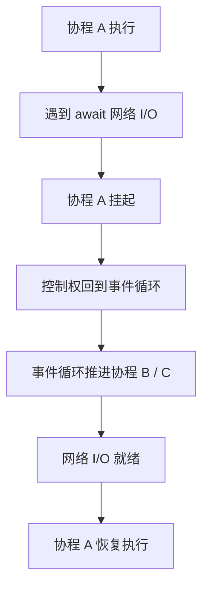
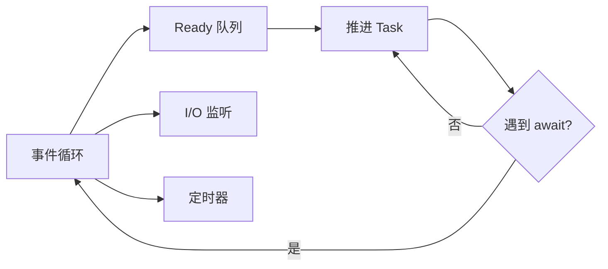

# Python - 第 11 课：生成器、协程与 `asyncio` 执行模型：事件循环、Task 与取消

## 学习目标（本节结束后你能做到什么）

- 能说清生成器、原生协程、`async` / `await` 之间的关系，不再把协程理解成“更轻量的线程”。
- 能解释协程对象、Task、Future、事件循环分别是什么，以及它们如何配合。
- 能理解 `await` 的真实含义：不是“阻塞等待”，而是“挂起当前协程，把控制权交还给事件循环”。
- 能掌握 `asyncio.create_task()`、`asyncio.gather()`、`TaskGroup`、超时、取消、异常传播这些工程核心点。
- 能识别 `asyncio` 常见坑：忘记 `await`、阻塞事件循环、任务无引用、取消被吞、异常无人处理。

## 内容讲解（核心概念，用类比、例子、图示说清楚）

### 1. 为什么第 11 课要单独讲 `asyncio`

第 10 课我们已经建立了并发选型总图：

- I/O 密集 + 阻塞库：线程池常常更自然
- I/O 密集 + async 生态：协程和 `asyncio` 更合适
- CPU 密集：多进程或高性能扩展更合适

但这还只是“选型层”。  
真正写 `asyncio` 时，很多人会遇到另一类问题：

- `async def` 调了为什么没有执行
- `await` 到底是不是阻塞
- `create_task()` 和直接 `await` 有什么区别
- `gather()` 里一个任务失败，其他任务怎么办
- 超时为什么本质上和取消有关
- 为什么取消一个任务后，任务里还要做清理
- 为什么在协程里调用 `time.sleep()` 会把整个服务卡住

这些问题都指向同一个核心：

**你必须理解 `asyncio` 的执行模型，而不是只会背 API。**

这一课会沿着下面这条线走：

**生成器的暂停恢复 -> 原生协程 -> awaitable -> Task -> 事件循环 -> 取消和异常传播 -> 工程实践**

### 2. 从生成器到协程：暂停和恢复是共同地基

第 5 课我们讲过，生成器的关键能力是：

- `yield` 产出值
- 暂停执行
- 保留现场
- 下次继续

例如：

```python
def gen():
    yield 1
    yield 2
```

生成器让一个函数不再必须“一次执行到底”。  
这件事非常重要，因为协程的底层直觉也和“暂停 / 恢复”有关。

但现代 `asyncio` 里，我们更常用的是原生协程：

```python
async def fetch():
    await some_io()
    return "done"
```

这里的 `async def` 定义的是协程函数。  
调用它：

```python
coro = fetch()
```

不会立刻执行函数体，而是创建一个协程对象。

这和生成器很像：

- 调用生成器函数，得到生成器对象
- 调用协程函数，得到协程对象

它们都不是“调用后立刻跑完”的普通函数。

### 3. 协程对象不会自己跑

这是 `asyncio` 初学最容易踩的坑。

看代码：

```python
async def hello():
    print("hello")

hello()
```

这并不会真正打印 `hello`。  
因为 `hello()` 只是创建了一个协程对象，你还没有让事件循环调度它，也没有 `await` 它。

要让它执行，常见方式是：

```python
import asyncio

asyncio.run(hello())
```

或者在另一个协程里：

```python
await hello()
```

所以你可以把协程对象理解成：

**一段可暂停、可恢复的异步执行计划。**

它需要被事件循环驱动，才会真正向前执行。

### 4. `await` 到底是什么意思

很多人把 `await` 翻译成“等待”，然后误以为它等同于阻塞。  
这会造成很大误解。

更准确地说：

**`await` 表示当前协程在这里挂起，把控制权交还给事件循环，等被等待的对象完成后再恢复。**

关键是：

- 当前协程暂停
- 事件循环可以去运行别的任务
- 不是把整个线程傻等住

图示如下：



所以在 `asyncio` 语境里：

- `await` 不是 CPU 阻塞等待
- `await` 是协作式让出控制权

这也是协程能高效管理大量 I/O 等待的根本原因。

### 5. 什么东西可以被 `await`

能被 `await` 的对象通常被叫做 awaitable。  
常见包括：

- 协程对象
- `Task`
- `Future`
- 实现了特定 await 协议的对象

例如：

```python
await some_coroutine()
await task
await future
```

对应用层开发来说，最常接触的是：

- 协程对象
- Task

Future 更偏底层，常用于连接回调式异步代码和 `async` / `await` 代码。  
大多数业务代码不需要手动创建 Future，但要知道它代表：

**未来某个时刻才会有结果的占位对象。**

### 6. 事件循环：谁来驱动协程向前走

协程对象不会自己运行，那谁来驱动它？

答案是事件循环。

事件循环大致负责：

- 调度已经准备好的任务
- 监听 I/O 事件
- 管理定时器
- 在任务遇到 `await` 时切换到别的任务
- 在 I/O 就绪或等待完成后恢复任务

可以把事件循环想成一个单线程调度中心：



在普通应用里，你通常用：

```python
asyncio.run(main())
```

启动一个事件循环并运行顶层协程。

工程上要记住：

**不要在已经运行的事件循环里再随便调用 `asyncio.run()`。**

Web 框架、Notebook、异步服务通常已经有事件循环。  
这时你应该在已有异步上下文里 `await`，而不是重新启动一个顶层循环。

### 7. 直接 `await` 和 `create_task()` 有什么区别

这是非常重要的工程点。

看第一种写法：

```python
async def main():
    result1 = await fetch("a")
    result2 = await fetch("b")
```

这里是顺序执行：

- 等 `fetch("a")` 完成
- 再开始 `fetch("b")`

如果两个都是网络 I/O，这样没有把等待时间重叠起来。

第二种写法：

```python
async def main():
    task1 = asyncio.create_task(fetch("a"))
    task2 = asyncio.create_task(fetch("b"))

    result1 = await task1
    result2 = await task2
```

这里 `create_task()` 会把协程包装成 Task，并安排它尽快被事件循环调度。  
于是两个请求可以并发推进。

一句话区分：

- `await coro()`：当前协程等待这个协程完成，常常是顺序控制流
- `create_task(coro())`：把协程提交给事件循环，让它作为独立任务并发推进

### 8. Task 是什么

Task 可以理解成：

**被事件循环调度的协程执行单元。**

协程对象只是“可执行计划”，Task 则是“已经交给事件循环管理的任务”。

Task 有自己的状态：

- pending
- running
- done
- cancelled

你可以：

- `await task` 获取结果
- `task.cancel()` 请求取消
- `task.done()` 查看是否完成
- `task.result()` 取结果
- `task.exception()` 取异常

不过业务代码里，不要过度手动操作这些状态。  
更常见的是：

- 创建任务
- 等待任务
- 处理结果和异常
- 做好取消和超时

### 9. 为什么 `create_task()` 后要保存引用

一个常见坏写法：

```python
asyncio.create_task(background_job())
```

然后什么也不管。

这看起来像“后台任务”，但工程上很危险：

- 任务异常可能没人处理
- 任务生命周期不清晰
- 程序退出时它可能还没完成
- 你没有办法取消、等待、记录结果

官方文档也强调，应保存任务引用，尤其是 fire-and-forget 风格任务。

常见写法是维护一个集合：

```python
background_tasks = set()

task = asyncio.create_task(background_job())
background_tasks.add(task)
task.add_done_callback(background_tasks.discard)
```

这样既避免任务中途没有强引用，又能在完成后清理集合。

不过更成熟的工程方式是：

- 尽量少写无监管后台任务
- 用 TaskGroup 或明确的任务管理器管理生命周期

### 10. `asyncio.gather()`：并发等待多个任务

如果你要并发执行多个 awaitable，并收集结果，常见写法是：

```python
results = await asyncio.gather(
    fetch("a"),
    fetch("b"),
    fetch("c"),
)
```

`gather()` 会并发推进这些任务，并按传入顺序返回结果。

但要注意异常行为：

- 默认情况下，如果其中一个任务抛异常，异常会传播给等待 `gather()` 的地方
- 其他任务如何处理，需要你理解当前版本和具体封装语义
- 如果你设置 `return_exceptions=True`，异常会作为结果返回，而不是直接抛出

例如：

```python
results = await asyncio.gather(*tasks, return_exceptions=True)
```

这适合批处理场景：

- 某些任务失败
- 但你仍然想拿到所有任务的结果或异常

不过不要滥用 `return_exceptions=True`。  
它会把错误变成普通结果，如果你没有认真检查结果，失败就可能被悄悄忽略。

### 11. `TaskGroup`：结构化并发

Python 3.11 引入了 `asyncio.TaskGroup`。  
它代表一种更结构化的并发写法：

```python
async with asyncio.TaskGroup() as tg:
    task1 = tg.create_task(fetch("a"))
    task2 = tg.create_task(fetch("b"))
```

当退出 `async with` 块时，TaskGroup 会等待里面的任务完成。

它的关键价值是：

**任务有明确的生命周期边界，不再是随手散落在外面的后台任务。**

如果 TaskGroup 里的某个任务发生非取消异常，它会取消组内剩余任务，并把异常组织后向外抛出。  
这比随手 `create_task()` 更安全，也更符合“谁创建，谁等待，谁负责收尾”的工程原则。

可以这样理解：

- `gather()` 更像“等这一批 awaitable 的结果”
- `TaskGroup` 更像“在这个作用域内管理一组相关任务的生命周期”

对于新代码，如果你使用 Python 3.11+，很多场景可以优先考虑 TaskGroup。

### 12. 取消不是杀线程，而是协作式请求

在 `asyncio` 里取消任务通常这样：

```python
task.cancel()
```

但这不是强行杀死一个正在运行的线程。  
它更像是：

**向任务注入一个取消请求，让任务在下一个可取消点收到 `CancelledError`。**

常见可取消点就是 `await`。

例如：

```python
async def worker():
    try:
        while True:
            await asyncio.sleep(1)
    except asyncio.CancelledError:
        print("cleanup")
        raise
```

这里有个非常重要的原则：

**捕获 `CancelledError` 做清理后，通常应该重新 `raise`。**

否则你就把取消吞掉了，调用方会以为任务没有被取消。

### 13. `CancelledError` 为什么特殊

取消在异步系统里不是普通业务异常，它是控制流的一部分。  
任务取消时，协程内部通常会收到 `asyncio.CancelledError`。

在较新的 Python 版本中，`asyncio.CancelledError` 的继承关系也体现了它的特殊性：它不是普通业务错误，不应该被随便吞掉。

所以你写：

```python
try:
    await do_work()
except Exception:
    logger.exception("failed")
```

通常不会像你想象的那样捕获取消。  
这其实是好事，因为取消应该沿着调用链传播。

更危险的是你显式捕获了 `BaseException` 或 `CancelledError` 后不重新抛：

```python
except asyncio.CancelledError:
    logger.info("cancelled")
    # 忘了 raise
```

这会破坏取消语义。

### 14. 超时本质上经常是取消

在 `asyncio` 里，超时通常不是“时间到了就直接返回一个特殊值”，而是通过取消等待中的任务来实现。

常见方式之一：

```python
try:
    result = await asyncio.wait_for(fetch(), timeout=3)
except TimeoutError:
    ...
```

`wait_for()` 超时时会取消被等待的 awaitable，并抛出 `TimeoutError`。

Python 3.11+ 也常见：

```python
try:
    async with asyncio.timeout(3):
        result = await fetch()
except TimeoutError:
    ...
```

这里要注意一个细节：

**`asyncio.timeout()` 会在上下文管理器内部处理取消，并在外部表现为 `TimeoutError`。**

所以通常要在 `async with` 外面捕获 `TimeoutError`。

### 15. `shield()`：什么时候不想让内部任务被外部取消

有时外层等待被取消，但你希望内部任务继续跑，可以用 `asyncio.shield()`。

例如：

```python
await asyncio.shield(important_task)
```

但它不是“取消免疫”。  
它只是改变外层取消对内部任务的传播方式。

工程上要慎用 `shield()`，因为它会让任务生命周期更难管理。  
适合的场景通常是：

- 某个清理动作非常重要
- 某个提交动作不希望半途被外层取消
- 你明确知道内部任务后续由谁负责等待和收尾

如果只是为了“不想处理取消”，不要用 `shield()` 逃避问题。

### 16. 异常传播：异步任务里的异常不会自动消失

如果你：

```python
task = asyncio.create_task(fail())
```

但从不 `await task`，也不检查它的异常，那么任务失败后可能出现：

```text
Task exception was never retrieved
```

这说明任务里的异常没有被正确消费。

正确做法是：

- `await task`
- 或用 TaskGroup 管理
- 或添加 done callback 并记录异常
- 或集中维护后台任务集合并在退出时收尾

不要把 `create_task()` 当成“异常自动有人管”的后台线程。

### 17. `asyncio.sleep()` 和 `time.sleep()` 的区别

这是非常经典的坑。

在协程里应该写：

```python
await asyncio.sleep(1)
```

而不是：

```python
time.sleep(1)
```

区别是：

- `asyncio.sleep()` 会挂起当前协程，把控制权还给事件循环
- `time.sleep()` 会阻塞当前线程，事件循环也被一起堵住

如果你在异步 Web 服务里写了 `time.sleep()`，可能会让整个事件循环上的其他请求都被拖住。

所以异步代码里要反复问自己：

**我这里调用的是异步友好的等待，还是阻塞了整个事件循环？**

### 18. 阻塞函数怎么放进异步程序

真实工程里，你不可能所有库都是 async 的。  
如果你必须调用阻塞函数，可以考虑把它丢到线程里执行。

常见方式：

```python
result = await asyncio.to_thread(blocking_func, arg1, arg2)
```

或者更底层地使用 executor。

这适合：

- 阻塞 I/O
- 旧同步库
- 短时间阻塞操作

但要注意：

- 这不适合大量纯 Python CPU 密集计算加速
- 线程池也要控制并发
- 阻塞函数本身仍然要有超时和资源边界

### 19. async 不是自动并发：常见错误写法

看这段：

```python
async def main():
    for url in urls:
        await fetch(url)
```

这仍然是一个一个顺序请求。

如果你想并发，需要显式创建并发任务：

```python
async def main():
    tasks = [asyncio.create_task(fetch(url)) for url in urls]
    return await asyncio.gather(*tasks)
```

或者用 TaskGroup。

所以：

**`async` 只是让函数具备异步暂停能力，不代表自动并发。**

并发来自你如何调度多个任务。

### 20. 限制并发：不要一次创建无限任务

很多人会写：

```python
tasks = [asyncio.create_task(fetch(url)) for url in urls]
await asyncio.gather(*tasks)
```

如果 `urls` 有 10 个，没问题。  
如果有 100 万个，灾难。

问题包括：

- 任务对象占内存
- 连接数爆炸
- 下游被打挂
- 本地文件描述符耗尽
- 超时和重试风暴

常见做法是用信号量限制并发：

```python
sem = asyncio.Semaphore(100)

async def limited_fetch(url):
    async with sem:
        return await fetch(url)
```

核心思想是：

**异步并发也必须有背压和限流。**

### 21. 异步上下文管理器和异步迭代器

同步代码里有：

```python
with resource:
    ...
```

异步代码里常见：

```python
async with resource:
    ...
```

它对应的是：

- `__aenter__`
- `__aexit__`

常见场景：

- 异步数据库连接
- 异步 HTTP session
- 异步锁

同理，异步迭代器使用：

```python
async for item in stream:
    ...
```

它适合逐步消费异步数据流，比如：

- websocket 消息
- 异步分页
- 流式响应
- 异步队列

这说明 `asyncio` 并不是只多了 `await`，而是整个资源管理和迭代模型都有异步版本。

### 22. `asyncio.Queue`：异步生产者消费者

线程里常用队列解耦生产者和消费者。  
异步程序里也有 `asyncio.Queue`。

例如：

```python
queue = asyncio.Queue(maxsize=100)

async def producer():
    for item in items:
        await queue.put(item)

async def consumer():
    while True:
        item = await queue.get()
        try:
            await process(item)
        finally:
            queue.task_done()
```

这里 `maxsize` 很重要。  
它能形成背压：

- 队列满了，生产者会等待
- 消费者处理不过来时，不会无限堆积内存

这就是并发工程里非常重要的“控流”思维。

### 23. `asyncio` 程序怎么优雅退出

一个成熟的异步程序需要考虑退出：

- 收到取消信号
- 停止接收新任务
- 等待进行中任务完成或超时
- 取消剩余任务
- 关闭连接池、HTTP session、数据库连接
- flush 日志和指标

不要只写：

```python
while True:
    ...
```

然后指望进程被杀就完事。

协程程序里的退出，本质上也是取消传播和资源清理问题。

### 24. 常见误区总结

#### 24.1 误区：调用 `async def` 函数就会执行

不对。  
它只会创建协程对象，需要 `await`、Task 或事件循环驱动。

#### 24.2 误区：`await` 会阻塞整个线程

不对。  
它挂起当前协程，让事件循环调度其他任务。

#### 24.3 误区：用了 `async` 就自动并发

不对。  
并发需要你创建多个任务或同时等待多个 awaitable。

#### 24.4 误区：协程里调用同步阻塞库没关系

不对。  
这会堵住事件循环，破坏所有任务调度。

#### 24.5 误区：取消就是立即杀死任务

不对。  
取消是协作式的，通常在 await 点注入 `CancelledError`。

#### 24.6 误区：后台任务不需要管理

不对。  
任务异常、取消、退出、引用和生命周期都需要明确管理。

### 25. 面试里怎么系统回答 `asyncio`

如果面试官问：

- `asyncio` 执行模型是什么？
- `await` 到底做了什么？
- Task 和协程有什么区别？
- 取消和超时怎么处理？

你可以按这个框架回答：

1. 先讲协程对象  
   `async def` 调用后返回协程对象，不会立即执行；它需要被 `await` 或包装成 Task 交给事件循环调度。

2. 再讲事件循环  
   事件循环负责调度 Task、监听 I/O、管理定时器；协程遇到 `await` 时挂起，把控制权交还给事件循环。

3. 再讲 Task  
   Task 是被事件循环管理的协程执行单元，`create_task()` 会安排协程并发推进；直接 `await` 更偏顺序等待。

4. 再讲并发组合  
   `gather()` 适合等待一组 awaitable，`TaskGroup` 提供结构化并发和更清晰的生命周期边界。

5. 再讲取消和超时  
   取消是协作式的，通过 `CancelledError` 传播；超时通常基于取消实现；清理后一般要重新抛取消异常。

6. 最后讲工程坑  
   不要阻塞事件循环，不要丢失后台任务引用，不要无限创建任务，要限制并发并管理退出。

这样答，会比“asyncio 是单线程并发”更完整，也更能体现工程经验。

## 小结（3-5 条关键点）

- `async def` 调用后得到的是协程对象，它不会自动执行，需要被 `await` 或包装成 Task 后由事件循环驱动。
- `await` 的核心不是阻塞线程，而是挂起当前协程，把控制权交还给事件循环，等待完成后再恢复。
- Task 是事件循环调度的协程执行单元，`create_task()` 用于让协程并发推进，但任务生命周期和异常必须被管理。
- 取消是协作式的，通常在 await 点注入 `CancelledError`；清理后一般要重新抛出，避免吞掉取消。
- `asyncio` 工程重点不只是 API，而是避免阻塞事件循环、控制并发、处理超时、管理后台任务和优雅退出。

## 问题（检测用户对当前章节内容是否了解）

1. `async def func()` 被调用后为什么不会立刻执行？协程对象、Task、事件循环三者分别是什么角色？
2. `await` 和阻塞等待有什么区别？为什么 `await asyncio.sleep(1)` 不会像 `time.sleep(1)` 一样堵住事件循环？
3. 直接 `await fetch("a"); await fetch("b")` 和先 `create_task()` 再等待两个任务有什么差别？
4. 为什么取消任务后通常要在 `except asyncio.CancelledError` 里清理资源并重新 `raise`？
5. 如果你要并发请求 10 万个 URL，为什么不能一次性创建 10 万个 Task？你会怎么限制并发？

如果你愿意，我们下一篇就进入第 12 课，回到已经写好的多线程专题，把它和前面两课的并发总图、`asyncio` 执行模型做一次横向对比。
