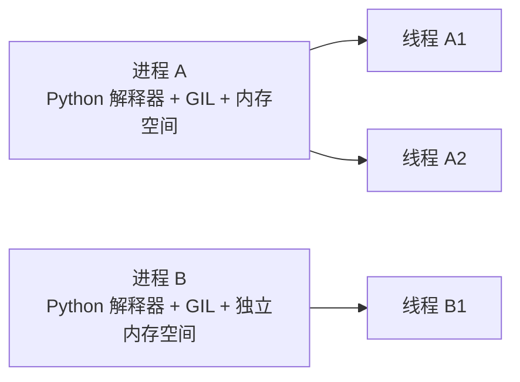

# Python - 第 13 课：多进程、`ProcessPoolExecutor` 与 CPU 密集型任务

## 学习目标（本节结束后你能做到什么）

- 能解释为什么 `CPython` 里 CPU 密集型任务通常不靠多线程加速，而更常考虑多进程、C 扩展或外部计算系统。
- 能说清进程和线程的核心差异：内存隔离、启动成本、通信成本、故障隔离和并行能力。
- 能掌握 `multiprocessing` 与 `ProcessPoolExecutor` 的常见用法、限制和工程边界。
- 能理解 `spawn`、`fork`、`forkserver` 三种启动方式的差异，以及为什么现代 Python 里不能再默认依赖 `fork`。
- 能从任务粒度、序列化成本、共享状态、进程生命周期、异常传播和资源清理角度设计多进程程序。

## 内容讲解（核心概念，用类比、例子、图示说清楚）

### 1. 为什么第 13 课要讲多进程

前面第 10 课我们建立了并发总图：

- I/O 密集：重点是重叠等待，线程池或协程都可能合适
- CPU 密集：重点是获得真实计算资源，多进程常常更合适
- 混合型：先打点，再判断瓶颈

第 11 课深入了 `asyncio`。第 12 课已有多线程专题。  
现在第 13 课要解决的是另一个大问题：

**当任务真的卡在 CPU 计算上，Python 应该怎么办？**

很多人会直接回答：

- “用多进程，因为可以绕开 GIL。”

这句话方向对，但太浅。  
真正工程里，你还要继续回答：

- 任务能不能被拆分
- 拆分后每块计算够不够大
- 参数和结果能不能 pickle
- 传输大对象会不会比计算还贵
- 子进程能不能导入主模块
- 进程池怎么关闭
- 某个子进程挂了怎么办
- macOS、Linux、Windows 的启动方式差异会不会影响行为

所以多进程不是“线程不行就换进程”这么简单。  
它是一套以隔离和真实并行为核心、但代价也更高的模型。

### 2. 先复习：GIL 为什么让 CPU 密集型多线程尴尬

在常见 `CPython` 中，GIL 的核心影响是：

**同一个进程内，同一时刻通常只有一个线程在执行 Python 字节码。**

所以如果你写的是纯 Python CPU 密集任务，比如：

```python
def count(n):
    total = 0
    for i in range(n):
        total += i * i
    return total
```

然后开多个线程一起算，线程之间会争抢 GIL。  
它们看起来是并发，但很多时候不能真正多核并行执行 Python 字节码。

结果可能是：

- 没有明显提速
- 线程切换反而增加开销
- CPU 多核利用率不理想

这就是为什么 CPU 密集型任务通常要考虑：

- 多进程
- C 扩展
- NumPy / Pandas / Polars 等底层向量化库
- Numba / Cython
- 外部计算服务
- 数据库或搜索引擎下推计算

多进程只是选项之一，不是唯一答案。

### 3. 进程和线程的核心差异

你可以先用一句话区分：

- 线程：同一进程内的执行流，共享内存
- 进程：操作系统资源隔离单元，各自有独立内存空间

图示如下：



多进程之所以能绕开 GIL，是因为：

- 每个进程都有自己的解释器
- 每个解释器有自己的 GIL
- 操作系统可以把不同进程调度到不同 CPU 核心

所以多个进程里的 Python 代码可以真正并行。

但隔离也带来代价：

- 进程启动比线程更重
- 内存不能像线程那样直接共享
- 数据传输通常要序列化
- 进程间通信更复杂
- 调试更麻烦

这就是多进程的基本 trade-off：

**用更高隔离和真实并行，换更高启动、通信和内存成本。**

### 4. 多进程适合什么任务

多进程适合这样的任务：

#### 4.1 CPU 计算占主导

比如：

- 大量纯 Python 计算
- 图像处理
- 密集文本解析
- 批量压缩
- 密码哈希
- 搜索 / 回溯 / 模拟

#### 4.2 任务可以拆成相对独立的小块

例如：

- 100 万条数据分成 8 份
- 1000 张图片分给多个进程
- 多个文件分别处理

#### 4.3 每个任务粒度足够大

如果每个任务只算 1 毫秒，但进程间传输和调度要花更多时间，那多进程反而亏。

多进程更适合：

- 每个任务计算较重
- 输入输出相对小
- 任务之间依赖少

#### 4.4 函数、参数、返回值可以被序列化

这点非常关键。  
进程之间通常不能直接共享对象引用，任务需要通过 pickle 等机制序列化传给子进程。

所以：

- 顶层函数通常可以
- lambda 通常不适合
- 局部函数通常不适合
- 打开的数据库连接、文件句柄、锁对象通常不能直接传

### 5. 什么场景不适合多进程

#### 5.1 I/O 等待为主

如果任务主要在等网络、数据库、文件，线程池或协程往往更轻。

#### 5.2 任务太碎

例如几百万个非常小的计算任务。  
如果每个任务都单独提交给进程池，调度和序列化成本可能压过计算收益。

这时应该考虑：

- 批量提交
- 增大 chunk
- 在子进程内循环处理一批数据

#### 5.3 大对象频繁传输

例如你把一个几百 MB 的对象传给每个子进程。  
即使计算并行了，数据复制和序列化成本也可能非常高。

#### 5.4 需要频繁共享可变状态

如果多个任务不断修改同一个共享结构，多进程会很麻烦。

线程共享内存还可以加锁；进程间共享状态则需要：

- Queue
- Pipe
- Manager
- shared memory
- 文件 / 数据库 / 外部存储

复杂度明显上升。

### 6. `multiprocessing` 和 `ProcessPoolExecutor` 的关系

Python 里有两套常见接口：

#### 6.1 `multiprocessing`

它更底层，提供：

- `Process`
- `Queue`
- `Pipe`
- `Pool`
- `Lock`
- shared memory 等

适合你需要更细控制进程、通信和同步的时候。

#### 6.2 `concurrent.futures.ProcessPoolExecutor`

它是更高层的接口，和 `ThreadPoolExecutor` 风格一致：

- `submit`
- `map`
- `Future`
- `as_completed`
- `shutdown`

更适合后端工程里做“把一批 CPU 任务丢到进程池执行”这种模式。

常见建议是：

**能用 `ProcessPoolExecutor` 解决的任务，优先用它；需要复杂进程通信时，再深入 `multiprocessing`。**

### 7. 一个最小 `ProcessPoolExecutor` 例子

```python
from concurrent.futures import ProcessPoolExecutor

def cpu_work(n):
    total = 0
    for i in range(n):
        total += i * i
    return total

def main():
    nums = [10_000_000, 10_000_000, 10_000_000, 10_000_000]

    with ProcessPoolExecutor() as pool:
        results = list(pool.map(cpu_work, nums))

    print(results)

if __name__ == "__main__":
    main()
```

这里有两个重要点：

1. `cpu_work` 放在模块顶层  
   子进程要能 import 到它。

2. 用 `if __name__ == "__main__"` 保护入口  
   在 `spawn` 等启动方式下，子进程会重新导入主模块。如果不加保护，可能出现递归创建子进程等问题。

这不是“Windows 才需要”的习惯。  
随着现代 Python 对启动方式的调整，它已经是多进程代码的基本规范。

### 8. 为什么 `__main__` 必须可导入

官方文档强调，`ProcessPoolExecutor` 的 worker 子进程需要能导入 `__main__` 模块。  
这带来几个限制：

- 交互式解释器里定义的函数通常不适合丢给进程池
- lambda 不要指望稳定工作
- 局部函数、闭包函数通常不适合作为进程任务
- 脚本入口要用 `if __name__ == "__main__"`

例如这种就不适合：

```python
def main():
    def inner(x):
        return x * x

    with ProcessPoolExecutor() as pool:
        print(list(pool.map(inner, [1, 2, 3])))
```

因为 `inner` 是局部函数，子进程通常没法通过模块路径导入它。

稳妥写法是：

```python
def square(x):
    return x * x
```

放在模块顶层。

### 9. pickle：进程间传参的隐形成本

线程之间可以共享同一内存空间里的对象引用。  
进程之间不行。

当你提交任务：

```python
future = pool.submit(work, data)
```

通常需要把：

- 函数
- 参数
- 返回值
- 异常

在进程之间序列化和反序列化。

这带来几个后果：

#### 9.1 只有可 pickle 的对象适合传

普通数字、字符串、列表、字典通常可以。  
但很多资源对象不行，比如：

- 打开的 socket
- 数据库连接
- 文件对象
- 线程锁
- 某些 C 扩展对象

#### 9.2 大对象传输很贵

如果你把一个大 DataFrame、大列表、大模型对象反复传给子进程，可能序列化成本巨大。

#### 9.3 异常也要能传回主进程

子进程抛异常时，异常信息需要传回主进程。  
大多数普通异常可以，但复杂异常对象也可能带来序列化问题。

所以多进程设计里要尽量：

- 传小数据
- 传任务 id 或文件路径
- 在子进程内加载所需资源
- 批量处理，减少传输次数

### 10. `submit`、`map`、`as_completed` 怎么选

#### 10.1 `map`

适合：

- 同一个函数
- 一批输入
- 按输入顺序返回结果

例如：

```python
with ProcessPoolExecutor() as pool:
    results = list(pool.map(cpu_work, nums))
```

注意：`map` 返回结果顺序和输入顺序一致，不是哪个先完成先返回哪个。

#### 10.2 `submit`

适合：

- 每个任务参数更复杂
- 需要单独管理 Future
- 需要和任务元数据绑定

```python
future = pool.submit(cpu_work, n)
```

#### 10.3 `as_completed`

适合：

- 谁先完成就先处理谁
- 某些任务很慢，不想被顺序结果卡住

```python
from concurrent.futures import as_completed

with ProcessPoolExecutor() as pool:
    future_to_n = {pool.submit(cpu_work, n): n for n in nums}

    for future in as_completed(future_to_n):
        n = future_to_n[future]
        try:
            result = future.result()
        except Exception as exc:
            print(f"{n} failed: {exc}")
        else:
            print(f"{n} -> {result}")
```

工程上，`submit + as_completed` 通常更适合复杂批处理，因为它能更清楚地记录每个任务的成功失败。

### 11. `map` 的 `chunksize` 为什么重要

`ProcessPoolExecutor.map()` 有一个对进程池很重要的参数：`chunksize`。

如果你有大量小任务，默认一个一个提交，调度成本可能很高。  
`chunksize` 可以把输入切成更大的块发给子进程。

官方文档也提到，对于很长的迭代器，设置较大的 `chunksize` 可能显著提升性能。

例如：

```python
with ProcessPoolExecutor() as pool:
    results = list(pool.map(cpu_work, nums, chunksize=100))
```

经验上：

- 任务很重：`chunksize` 影响可能不明显
- 任务很轻且数量大：适当增大 `chunksize` 很重要
- 任务耗时差异很大：`chunksize` 太大可能导致负载不均

所以它不是越大越好，而是要结合任务粒度调。

### 12. 进程启动方式：`spawn`、`fork`、`forkserver`

这是多进程里最容易被忽略、但非常重要的底层差异。

Python 常见启动方式有三种。

#### 12.1 `spawn`

启动一个全新的 Python 解释器进程。  
子进程会重新导入主模块，并从干净状态开始。

优点：

- 更安全
- 跨平台，Windows 和 macOS 常见
- 不会继承太多父进程复杂状态

缺点：

- 启动较慢
- 要求可导入性更强
- 更容易暴露没有 `if __name__ == "__main__"` 的问题

#### 12.2 `fork`

父进程通过 `fork()` 复制出子进程。  
子进程初始状态几乎像父进程的快照。

优点：

- 启动快
- 利用 copy-on-write，在某些场景下初始内存共享更高效

缺点：

- 多线程程序里 fork 很危险
- 父进程里已有的锁、连接、线程状态可能被不安全继承
- 在现代 Python 里不能再默认依赖它

#### 12.3 `forkserver`

先启动一个相对干净的 server 进程，后续由它 fork 子进程。  
目标是在性能和安全之间折中。

Python 3.14 起，POSIX 平台默认启动方式已经从 `fork` 改为 `forkserver`；同时 `fork` 不再是任何平台的默认启动方式。  
如果代码强依赖 `fork`，需要显式指定上下文。

这点很重要，因为很多老经验默认 Linux 是 `fork`，但新版本已经变了。

### 13. 如何显式指定启动方式

可以用 `multiprocessing.get_context()`：

```python
import multiprocessing as mp
from concurrent.futures import ProcessPoolExecutor

def main():
    ctx = mp.get_context("spawn")
    with ProcessPoolExecutor(mp_context=ctx) as pool:
        ...

if __name__ == "__main__":
    main()
```

这样你能明确告诉进程池使用哪种启动方式。

工程建议：

- 应用代码可以根据平台和依赖选择合适方式
- 库代码不要擅自全局设置启动方式
- 如果库必须依赖某种启动方式，要清楚文档化

因为一个进程里全局启动方式通常只能设置一次，库强行设置会影响使用方。

### 14. 子进程里的资源初始化

有些资源不适合从父进程直接传给子进程，比如：

- 数据库连接
- HTTP session
- GPU 上下文
- 大模型对象

更好的方式往往是：

- 子进程启动后自己初始化
- 或使用 `initializer`

例如：

```python
worker_state = {}

def init_worker(config_path):
    worker_state["config"] = load_config(config_path)

def work(item):
    config = worker_state["config"]
    return process(item, config)

def main():
    with ProcessPoolExecutor(
        initializer=init_worker,
        initargs=("config.json",),
    ) as pool:
        ...
```

这样可以避免每个任务都重复传一大堆配置，也避免传不可序列化对象。

### 15. `max_tasks_per_child`：为什么要限制 worker 生命周期

`ProcessPoolExecutor` 支持 `max_tasks_per_child`，表示单个 worker 执行多少任务后退出并被替换。

它适合一些场景：

- 第三方库有内存泄漏风险
- 长时间运行后进程状态变脏
- 希望周期性刷新 worker

但它也有代价：

- worker 重启会增加开销
- 与某些启动方式存在兼容限制
- 使用不当可能导致性能波动

所以它不是默认要开的选项，而是排查到 worker 生命周期问题时再考虑。

### 16. 取消 Future 和杀掉进程不是一回事

`Future.cancel()` 只能取消还没开始执行的任务。  
如果任务已经在某个子进程里运行了，通常不能靠 `cancel()` 直接终止它。

这和 `asyncio` 的取消一样，都不是“魔法杀死一切”。

Python 3.14 的 `ProcessPoolExecutor` 增加了：

- `terminate_workers()`
- `kill_workers()`

用于尝试立即终止或杀掉存活 worker，并释放 executor 资源。

但这类 API 应该被视为强制收尾工具，而不是普通控制流。  
因为强行终止可能导致：

- 中间状态不一致
- 临时文件未清理
- 数据写一半
- 子进程资源没优雅释放

正常工程里仍然应该优先设计：

- 任务有超时
- 任务粒度可控
- 可幂等重试
- 能安全中断或丢弃结果

### 17. 异常传播和 `BrokenProcessPool`

子进程里任务抛异常时，主进程在取 `future.result()` 时会看到异常。

例如：

```python
try:
    result = future.result()
except Exception as exc:
    ...
```

如果某个 worker 进程异常退出，比如崩溃、被杀、初始化失败，进程池可能进入 broken 状态，后续任务会失败。

这时你需要：

- 记录异常
- 释放当前进程池
- 判断是否重建池
- 判断任务是否可重试

不要让主流程在 `future.result()` 处无日志地崩掉。

### 18. 共享状态：能不用就不用

官方 multiprocessing 指南也强调，尽量避免共享状态。  
这是非常好的工程建议。

多进程之间共享状态通常有几种方式：

- `Queue`
- `Pipe`
- `Manager`
- `Value` / `Array`
- shared memory
- 外部系统，比如 Redis / 数据库 / 文件

但每种方式都有代价：

- Queue / Pipe 要序列化
- Manager 通常更慢
- shared memory 需要你自己管理同步和数据布局
- 外部系统引入网络和一致性问题

所以多进程设计的最佳形态通常是：

**输入一块数据，计算出结果，返回；中间尽量不共享可变状态。**

也就是函数式、批处理式、map-reduce 式。

### 19. 大数据怎么处理：不要把所有东西塞进进程间通信

如果数据很大，可以考虑：

#### 19.1 传文件路径，不传文件内容

主进程把文件路径交给子进程，子进程自己读取对应片段。

#### 19.2 分块处理

每个子进程处理一段范围，结果再汇总。

#### 19.3 使用共享内存

对于数值数组这类结构，可以考虑 shared memory 或底层库支持的共享机制。  
但这会提高复杂度，需要谨慎封装。

#### 19.4 利用外部系统

有时最好的“进程间共享”是不要共享，让数据库、对象存储、消息队列承担边界。

### 20. 多进程与 `asyncio` 怎么配合

有时异步服务里也会遇到 CPU 密集任务。

你不能直接在事件循环里做重计算，否则会堵住所有协程。  
可以考虑：

- 把计算放到进程池
- 用 `loop.run_in_executor`
- 使用后台任务系统
- 把计算拆到独立服务

例如：

```python
import asyncio
from concurrent.futures import ProcessPoolExecutor

def cpu_work(x):
    return x * x

async def main():
    loop = asyncio.get_running_loop()
    with ProcessPoolExecutor() as pool:
        result = await loop.run_in_executor(pool, cpu_work, 10)
        print(result)
```

这表示：

- 事件循环不直接做 CPU 计算
- CPU 计算交给进程池
- 当前协程 await 结果
- 等待期间事件循环仍可推进其他任务

不过如果这是高频路径，频繁创建进程池也会很贵。  
真实服务里通常要复用池或使用专门任务系统。

### 21. 和 `InterpreterPoolExecutor` 的关系

Python 3.14 文档里还有 `InterpreterPoolExecutor`。  
它使用多个解释器，每个解释器有自己的 GIL，因此也能提供真正多核并行。

但它和传统多进程不同：

- worker 在同一进程的不同解释器中
- 解释器之间运行时状态隔离
- 可变对象不能随便共享
- 也需要序列化传输任务和结果

对多数面试和工程主线来说，你应该先掌握：

- 线程池
- `asyncio`
- 进程池

再把多解释器作为新版本里的扩展能力了解。  
不要把它和传统线程池混为一谈。

### 22. 一个多进程批处理的工程模板

```python
from concurrent.futures import ProcessPoolExecutor, as_completed
import logging

logger = logging.getLogger(__name__)

def process_file(path):
    # 子进程执行：读取文件、CPU 处理、返回小结果
    return {"path": path, "count": count_words(path)}

def run(paths, max_workers=None):
    results = []
    failed = []

    with ProcessPoolExecutor(max_workers=max_workers) as pool:
        future_to_path = {
            pool.submit(process_file, path): path
            for path in paths
        }

        for future in as_completed(future_to_path):
            path = future_to_path[future]
            try:
                results.append(future.result())
            except Exception:
                logger.exception("failed to process file", extra={"path": path})
                failed.append(path)

    return results, failed

def main():
    paths = load_paths()
    results, failed = run(paths)
    logger.info("batch finished", extra={"success": len(results), "failed": len(failed)})

if __name__ == "__main__":
    main()
```

这个模板体现了几个好习惯：

- worker 函数在模块顶层
- 入口有 `__main__` 保护
- 用 `with` 管理进程池生命周期
- 用 `as_completed` 逐个处理结果
- 每个任务失败有上下文日志
- 返回小结果，不在进程间传大对象

### 23. 面试里怎么系统回答多进程

如果面试官问：

- Python CPU 密集任务怎么优化？
- `ProcessPoolExecutor` 为什么能绕开 GIL？
- 多进程有什么坑？
- 为什么多进程代码要写 `if __name__ == "__main__"`？

你可以按这个结构回答：

1. 先讲背景  
   在 `CPython` 里，GIL 让同一进程内多线程难以真正并行执行纯 Python 字节码，所以 CPU 密集任务常考虑多进程或下沉到 C 扩展等方案。

2. 再讲多进程原理  
   多进程每个进程有独立解释器和独立 GIL，操作系统可以把它们调度到多个 CPU 核心上，因此能实现真正并行。

3. 再讲适用场景  
   适合粗粒度、可拆分、计算占主导、输入输出较小、任务之间依赖少的场景。

4. 再讲限制  
   函数、参数、返回值要可 pickle；`__main__` 要能被子进程导入；lambda、局部函数、REPL 函数通常不适合；大对象传输很贵。

5. 再讲启动方式  
   `spawn`、`fork`、`forkserver` 行为不同；现代 Python 里不能默认依赖 `fork`，需要时应显式指定 context。

6. 最后讲工程边界  
   要控制任务粒度、chunk、异常、日志、进程池生命周期、强制终止风险和共享状态复杂度。

这样回答会比一句“CPU 密集用多进程”完整很多。

## 小结（3-5 条关键点）

- 多进程能绕开 `CPython` 单进程 GIL 限制，因为每个进程有独立解释器和独立 GIL，可以被操作系统调度到不同 CPU 核心。
- `ProcessPoolExecutor` 适合粗粒度、可拆分、CPU 密集、输入输出相对小的任务，不适合大量细碎任务或频繁传输大对象。
- 进程池任务的函数、参数和返回值通常需要可 pickle；worker 函数应放在模块顶层，入口应使用 `if __name__ == "__main__"`。
- `spawn`、`fork`、`forkserver` 的行为差异会影响兼容性和性能；Python 3.14 起默认启动方式已不再是 `fork`。
- 多进程工程设计要尽量避免共享可变状态，重点控制任务粒度、序列化成本、异常传播、进程生命周期和资源清理。

## 问题（检测用户对当前章节内容是否了解）

1. 为什么 `CPython` 中 CPU 密集型任务通常不推荐靠多线程加速？多进程为什么能绕开这个限制？
2. `ProcessPoolExecutor` 里的任务函数为什么最好放在模块顶层？为什么 lambda、局部函数、REPL 里定义的函数通常不适合？
3. 多进程里的 pickle 成本会带来哪些工程问题？如果输入数据很大，你会怎么设计任务边界？
4. `spawn`、`fork`、`forkserver` 三种启动方式的核心区别是什么？为什么现代代码不应该默认依赖 `fork`？
5. `Future.cancel()`、`terminate_workers()`、`kill_workers()` 分别大致适合什么层级的问题？为什么强制杀进程不是普通业务控制流？

如果你愿意，我们下一篇就继续写第 14 课，把网络编程与 Web 栈里的 `socket`、HTTP、WSGI、ASGI 和 FastAPI 系统串起来。
