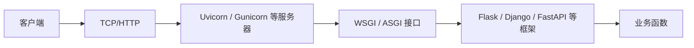
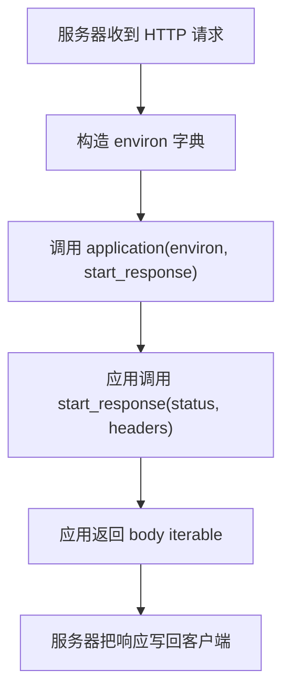
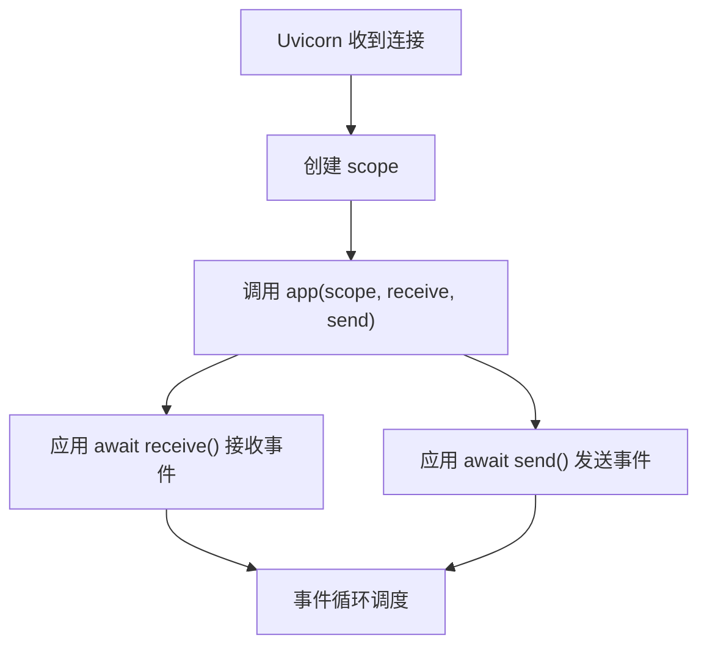
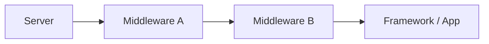
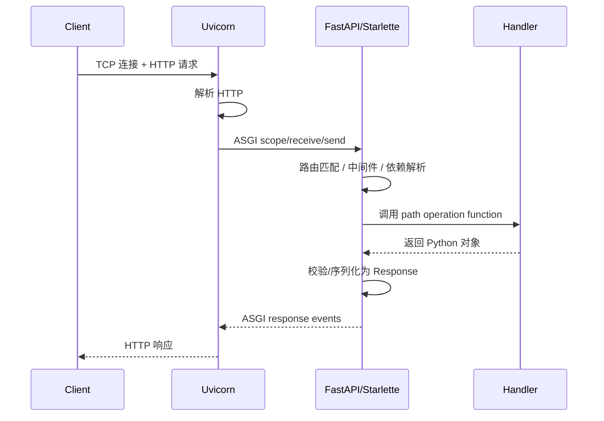

# Python - 第 14 课：网络编程与 Web 栈：`socket`、HTTP、WSGI、ASGI 与 FastAPI

## 学习目标（本节结束后你能做到什么）

- 能从底层解释一个 Web 请求大致如何从 TCP 连接、HTTP 报文进入 Python Web 应用。
- 能区分 `socket`、HTTP、Web Server、WSGI/ASGI、Web Framework、业务代码分别站在哪一层。
- 能说清 WSGI 为什么解决了“服务器和框架解耦”的问题，以及它为什么天然偏同步请求响应模型。
- 能解释 ASGI 为什么出现，它如何通过 `scope`、`receive`、`send` 支持异步、WebSocket 和长连接。
- 能理解 FastAPI 在 Web 栈里的位置：基于 ASGI、Starlette、Pydantic，负责路由、参数解析、校验、序列化和 OpenAPI。

## 内容讲解（核心概念，用类比、例子、图示说清楚）

### 1. 为什么后端工程师学 Python Web 不能只学框架 API

很多人学 Python Web，会直接从：

```python
from fastapi import FastAPI

app = FastAPI()

@app.get("/")
async def root():
    return {"message": "hello"}
```

开始。  
这当然能快速写接口，但如果你只停在框架 API 层，面试和线上排障时很容易断层：

- 浏览器发来的请求到底先到哪里
- Uvicorn 和 FastAPI 是什么关系
- 为什么 FastAPI 不是“自己直接监听 TCP 端口”
- WSGI 和 ASGI 到底差在哪
- 同步接口和异步接口在服务器里怎么跑
- 为什么 WebSocket 不是传统 WSGI 的强项
- 为什么 CPU 密集任务不能直接塞进 FastAPI handler
- 为什么多 worker 会增加内存占用

所以这一课的目标不是教你“怎么写一个接口”，而是建立一张 Web 栈地图：

```text
客户端
  -> TCP socket
  -> HTTP 协议
  -> Web Server / Protocol Server
  -> WSGI 或 ASGI 接口
  -> Web Framework
  -> 业务函数
  -> Response
```

有了这张图，你再学 FastAPI、Django、Flask、Uvicorn、Gunicorn、Nginx、负载均衡，就不会把层次混在一起。

### 2. 最底层先看 `socket`：网络通信的文件描述符抽象

从操作系统视角看，网络通信不是“调用一个 URL”这么高级。  
更底层是一端创建 socket，绑定地址，监听连接，接收字节流，发送字节流。

一个极简 TCP server 大概长这样：

```python
import socket

server = socket.socket(socket.AF_INET, socket.SOCK_STREAM)
server.bind(("127.0.0.1", 8080))
server.listen()

conn, addr = server.accept()
data = conn.recv(1024)
conn.sendall(b"hello")
conn.close()
server.close()
```

这里你能看到几个底层动作：

- `socket()`：创建网络端点
- `bind()`：绑定 IP 和端口
- `listen()`：开始监听
- `accept()`：接受客户端连接
- `recv()`：接收字节
- `sendall()`：发送字节

这层完全不关心：

- 路由是什么
- JSON 是什么
- FastAPI 是什么
- 请求参数怎么校验

它只处理字节流。

### 3. HTTP：把字节流组织成请求和响应

HTTP 是应用层协议。  
它在 TCP 字节流之上约定了一套格式，让双方知道：

- 请求方法是什么
- 访问路径是什么
- header 有哪些
- body 是什么
- 响应状态码是什么
- 响应 body 是什么

一个非常简化的 HTTP 请求长这样：

```http
GET /users/1 HTTP/1.1
Host: example.com
Accept: application/json
```

一个非常简化的 HTTP 响应长这样：

```http
HTTP/1.1 200 OK
Content-Type: application/json

{"id": 1, "name": "Alice"}
```

所以 HTTP 的价值是：

**把无结构的字节流，组织成 Web 应用能理解的请求响应语义。**

Python Web 框架通常不会让你直接解析这些原始报文。  
这部分工作通常由服务器、协议解析库和框架底层完成。

### 4. Web Server / Protocol Server：框架前面的那一层

一个 Python Web 应用通常不是自己直接处理所有 socket 细节。  
中间会有一层服务器。

常见例子：

- Gunicorn
- uWSGI
- Uvicorn
- Hypercorn
- Daphne

它们负责：

- 监听端口
- 接受连接
- 解析 HTTP
- 管理 worker
- 调用应用对象
- 把应用返回结果写回客户端

在 ASGI 语境里，Uvicorn 这类常被称作 ASGI server 或 protocol server。  
它不是业务框架，而是负责把网络协议翻译成 ASGI 调用。

你可以粗略理解成：



### 5. 为什么需要 WSGI：服务器和框架解耦

早期 Python Web 生态有很多框架和服务器。  
如果每个框架都只能配某个服务器，生态会很割裂。

WSGI 的目标就是定义一个标准接口：

**Web 服务器和 Python Web 应用之间应该怎么对接。**

官方 PEP 3333 里，WSGI 应用是一个 callable，大致形态是：

```python
def application(environ, start_response):
    status = "200 OK"
    headers = [("Content-Type", "text/plain")]
    start_response(status, headers)
    return [b"Hello, world!"]
```

这里有两个核心参数：

- `environ`：包含请求信息的字典
- `start_response`：应用用它告诉服务器响应状态和响应头

返回值通常是一个可迭代对象，产出响应 body 的字节。

### 6. WSGI 的运行模型

一次 WSGI 请求大致是：



它很好地解决了同步 HTTP 请求响应场景：

- 请求进来
- 调用应用
- 应用返回响应

Flask、传统 Django 等都可以工作在 WSGI 模型下。

### 7. WSGI 的边界：为什么 WebSocket 和长连接不自然

WSGI 的设计很成功，但它天然偏向：

**一次请求对应一次响应。**

这对于普通 HTTP 接口非常好。  
但现代 Web 应用越来越多场景不是简单的一问一答：

- WebSocket
- 长轮询
- Server-Sent Events
- HTTP/2 多路复用
- 异步流式请求体和响应体
- 长时间连接

WSGI 也可以通过一些扩展和技巧处理部分场景，但它的核心模型不是为这些协议设计的。

这就是 ASGI 出现的重要背景。

### 8. ASGI：异步服务器网关接口

ASGI 是 Asynchronous Server Gateway Interface。  
它可以看作 WSGI 的精神继任者，但目标更宽：

- 支持异步
- 支持 HTTP
- 支持 WebSocket
- 支持长连接和多事件通信

ASGI 应用的核心形态是一个异步 callable：

```python
async def app(scope, receive, send):
    ...
```

三个参数分别是：

- `scope`：连接信息，比如协议类型、路径、headers 等
- `receive`：异步接收事件
- `send`：异步发送事件

这和 WSGI 最大的不同是：

- WSGI 是一次请求输入 + 一次响应输出的 callable
- ASGI 是一个连接 scope + 双向事件流

### 9. ASGI 的运行模型

ASGI 把协议转换成事件。

例如 HTTP 请求里，请求体可能通过 `receive()` 一段段进来；应用通过 `send()` 发响应头和响应体。

一个极简 ASGI 应用大概是：

```python
async def app(scope, receive, send):
    assert scope["type"] == "http"

    await send({
        "type": "http.response.start",
        "status": 200,
        "headers": [(b"content-type", b"text/plain")],
    })
    await send({
        "type": "http.response.body",
        "body": b"Hello, world!",
    })
```

图示如下：



ASGI 的核心抽象是：

**连接不是一次函数返回就结束，而是一个可以持续收发事件的生命周期。**

这让 WebSocket 这类协议变得自然。

### 10. WSGI 和 ASGI 的核心对比

| 维度 | WSGI | ASGI |
| --- | --- | --- |
| 应用形态 | 同步 callable | async callable |
| 主要模型 | 请求 -> 响应 | 连接 scope + 事件流 |
| 参数 | `environ`, `start_response` | `scope`, `receive`, `send` |
| 适合场景 | 传统 HTTP | HTTP、WebSocket、长连接、异步 I/O |
| 并发方式 | 多进程 / 多线程常见 | 事件循环 + Task + worker |
| 代表框架 | Flask、传统 Django | FastAPI、Starlette、Django Channels |

你可以这样记：

- WSGI：同步 HTTP 请求响应标准接口
- ASGI：异步多协议事件驱动标准接口

### 11. FastAPI 在这条链路里站在哪

FastAPI 不是 Web Server。  
它不会自己替代 Uvicorn 去监听 socket。

FastAPI 是一个 ASGI Web framework。  
它运行在 ASGI server 之上，比如 Uvicorn。

常见启动：

```bash
uvicorn main:app --reload
```

这里：

- `uvicorn` 是服务器进程
- `main:app` 是 import string
- `main` 是模块
- `app` 是 FastAPI 实例，也是 ASGI 应用对象

FastAPI 的工作是：

- 路由匹配
- 参数解析
- 类型转换
- 数据校验
- 依赖注入
- 调用你的 path operation function
- 响应序列化
- 生成 OpenAPI schema
- 提供交互式文档

它不是直接处理原始 TCP 字节流的那一层。

### 12. FastAPI、Starlette、Pydantic 的关系

FastAPI 官方文档里也说明，它依赖 Starlette 和 Pydantic。

可以粗略理解成：

- Starlette：提供 ASGI Web toolkit 能力，比如路由、中间件、请求响应、WebSocket、后台任务等
- Pydantic：提供数据校验、类型解析、schema 生成等能力
- FastAPI：把类型标注、依赖注入、OpenAPI、Starlette 能力整合成 API 框架体验

所以当你写：

```python
@app.get("/items/{item_id}")
async def read_item(item_id: int, q: str | None = None):
    return {"item_id": item_id, "q": q}
```

FastAPI 会根据：

- path 模板
- 函数参数名
- 类型标注
- 默认值

推断：

- `item_id` 来自路径参数，并且要转成 `int`
- `q` 来自 query 参数，并且是可选字符串
- 返回值可以序列化成 JSON
- OpenAPI 文档可以自动生成

这就是 FastAPI 开发效率高的关键。

### 13. 同步 handler 和异步 handler 有什么区别

FastAPI 允许你写：

```python
@app.get("/sync")
def sync_endpoint():
    return {"ok": True}
```

也允许写：

```python
@app.get("/async")
async def async_endpoint():
    return {"ok": True}
```

这两者都能工作，但语义不同。

#### 13.1 `async def`

适合你内部要 `await` 异步 I/O：

- async HTTP client
- async DB driver
- async Redis
- async message queue

你要避免在里面调用阻塞函数，比如同步 `requests.get()` 或 `time.sleep()`。

#### 13.2 普通 `def`

适合同步阻塞代码。  
ASGI 框架通常会把同步 endpoint 放到线程池里执行，避免直接阻塞事件循环。

但这不代表同步 endpoint 可以无限阻塞。  
线程池也是有限资源。

所以选用原则是：

- 有 async 依赖链：写 `async def`
- 依赖都是同步阻塞库：写普通 `def` 反而更诚实
- CPU 密集：不要直接塞进 handler，考虑进程池或后台任务系统

### 14. 中间件是什么

中间件是在请求进入业务函数前后插入的一层逻辑。

常见用途：

- 认证
- 日志
- 追踪 trace id
- CORS
- 压缩
- 限流
- 错误处理
- 统一响应头

在 WSGI 和 ASGI 里，中间件本质上都可以理解为：

**一边扮演应用给上游服务器调用，一边扮演服务器去调用下游应用。**

图示：



中间件很强，但也要注意：

- 顺序很重要
- 不要在中间件里做太重的逻辑
- 异常处理边界要清楚
- ASGI 中间件不能阻塞事件循环

### 15. 请求生命周期：从客户端到业务函数

以 FastAPI + Uvicorn 为例，一次请求可以粗略理解为：



这张图非常重要。  
它能帮你定位问题属于哪一层：

- 端口监听失败：服务器层
- 路由 404：框架路由层
- 参数 422：校验层
- handler 慢：业务层或依赖 I/O
- WebSocket 断开：ASGI 连接生命周期层
- 多 worker 内存高：进程模型层

### 16. 为什么 FastAPI 自动生成文档

FastAPI 利用：

- 路由定义
- 函数签名
- 类型标注
- Pydantic 模型
- 响应模型

自动生成 OpenAPI schema。

然后基于 OpenAPI 提供：

- `/docs`
- `/redoc`
- `/openapi.json`

这不是“附带小功能”，而是现代 API 工程里的重要能力：

- 前后端契约
- 自动文档
- 自动客户端生成
- 测试和 mock
- API 网关和平台治理

但要注意：

**自动文档质量取决于你类型标注、模型设计和响应语义是否清楚。**

如果你的 handler 到处返回随意字典，文档也会变得模糊。

### 17. WebSocket 为什么更适合 ASGI

WebSocket 不是典型的一次请求一次响应。

它是：

- 建立连接
- 握手升级
- 长时间保持
- 双向发送消息
- 直到任一方断开

这就很适合 ASGI 的 `scope + receive + send` 模型。

因为 WebSocket 连接的生命周期可以持续很久，期间会不断收到事件：

- `websocket.connect`
- `websocket.receive`
- `websocket.disconnect`

也可以不断发送事件：

- `websocket.accept`
- `websocket.send`
- `websocket.close`

这类双向事件流，不适合被硬塞进 WSGI 的单次请求响应模型。

### 18. 部署时 Uvicorn、Gunicorn、Nginx 分别是什么角色

常见部署链路可能是：

```text
Client -> CDN / LB -> Nginx -> Gunicorn/Uvicorn workers -> FastAPI app
```

粗略分工：

- Nginx：反向代理、TLS 终止、静态资源、连接管理、限流等
- Gunicorn：进程管理器，管理多个 worker
- Uvicorn worker：ASGI server，运行事件循环和 ASGI 应用
- FastAPI：业务框架

有些部署里可以直接用 Uvicorn workers，有些用 Gunicorn 管理 Uvicorn worker，有些容器/Kubernetes 场景下更倾向一个容器一个 worker，再交给平台做横向扩展。

重点不是背某种固定组合，而是理解：

**谁负责监听，谁负责进程管理，谁负责协议转换，谁负责业务框架。**

### 19. 多 worker 和内存的关系

第 13 课讲过，进程之间通常不共享内存。  
Web 服务多 worker 也是一样。

如果你的 FastAPI 应用启动时加载一个 1GB 模型，开 4 个 worker，可能不是总共 1GB，而是接近 4GB。

这就是部署时必须考虑：

- worker 数量
- 单进程内存
- CPU 核数
- 连接数
- 模型加载方式
- 是否需要外部模型服务

不要把 worker 数量当成“越多越好”。  
它会提高并行处理能力，但也会增加内存和上下文切换成本。

### 20. FastAPI 里哪些事情不要直接做

#### 20.1 不要在 async handler 里调用阻塞 I/O

例如：

```python
@app.get("/")
async def bad():
    time.sleep(5)
```

这会阻塞事件循环。

#### 20.2 不要在请求路径里做重 CPU 计算

如果计算很重，考虑：

- 进程池
- 后台任务队列
- 专门计算服务
- 缓存

#### 20.3 不要把全局可变状态当数据库

多 worker 下，每个进程都有自己的内存。  
你在全局 dict 里写的数据，不会自动同步到其他 worker。

#### 20.4 不要在 import 阶段做重副作用

Uvicorn/Gunicorn 会 import 你的 app。  
如果 import 阶段就连数据库、拉远程配置、加载巨大模型，启动和 reload 都会很重，也更难排错。

### 21. 一个 FastAPI 工程骨架直觉

一个较清晰的后端项目可以这样组织：

```text
app/
├── __init__.py
├── main.py
├── api/
│   ├── __init__.py
│   └── users.py
├── domain/
│   └── user_service.py
├── infra/
│   └── db.py
└── schemas/
    └── user.py
```

`main.py` 里负责创建应用和注册路由：

```python
from fastapi import FastAPI
from app.api import users

app = FastAPI()
app.include_router(users.router)
```

`api/users.py` 里只处理 HTTP 层：

```python
from fastapi import APIRouter

router = APIRouter(prefix="/users")

@router.get("/{user_id}")
async def get_user(user_id: int):
    ...
```

工程原则是：

- API 层处理协议和参数
- domain/service 层处理业务
- infra 层处理数据库、缓存、外部服务
- schema 层处理请求响应模型

不要把所有逻辑堆在 route handler 里。

### 22. 面试里怎么系统回答 Python Web 栈

如果面试官问：

- WSGI 和 ASGI 有什么区别？
- FastAPI 为什么适合异步 Web？
- Uvicorn 和 FastAPI 是什么关系？
- 一个请求在 FastAPI 里怎么走？

你可以按这个框架回答：

1. 先讲底层链路  
   客户端通过 TCP 建连，发送 HTTP 报文；服务器监听 socket、解析协议，再通过 WSGI 或 ASGI 调用 Python 应用。

2. 再讲 WSGI  
   WSGI 是同步 Web Server 和 Python Web 应用之间的标准接口，应用 callable 接收 `environ` 和 `start_response`，返回响应 body iterable。

3. 再讲 ASGI  
   ASGI 是异步、多协议接口，应用是 `async def app(scope, receive, send)`，通过事件收发支持 HTTP、WebSocket、长连接等。

4. 再讲 FastAPI  
   FastAPI 是 ASGI 框架，基于 Starlette 和 Pydantic，负责路由、参数解析、类型校验、序列化、依赖注入和 OpenAPI。

5. 再讲部署  
   Uvicorn 是 ASGI server，负责运行事件循环和调用 ASGI app；生产环境可能用多 worker、反向代理、容器编排，但 worker 数量要结合 CPU 和内存。

6. 最后讲工程边界  
   async handler 不要阻塞事件循环，CPU 密集任务不要塞请求线程，跨 worker 状态不要放内存全局变量。

这样答，比单纯说“FastAPI 是异步框架”更完整。

## 小结（3-5 条关键点）

- `socket` 处理的是字节流，HTTP 把字节流组织成请求响应语义，Web Server 再把协议解析结果交给 Python 应用。
- WSGI 解决的是同步 Web Server 与 Python Web 应用的标准接口问题，核心是 `application(environ, start_response)`。
- ASGI 用 `scope`、`receive`、`send` 把连接和事件抽象出来，更适合异步 I/O、WebSocket 和长连接。
- FastAPI 是 ASGI 框架，不是 Web Server；它基于 Starlette 和 Pydantic，负责路由、校验、序列化、依赖注入和 OpenAPI。
- 部署时要区分反向代理、进程管理器、ASGI server、框架和业务代码的职责，多 worker 会提升并行能力但也增加内存成本。

## 问题（检测用户对当前章节内容是否了解）

1. 请从 socket、HTTP、Web Server、ASGI server、FastAPI、业务函数这几层，描述一次请求大致如何被处理。
2. WSGI 的应用 callable 长什么样？它为什么更适合同步 HTTP 请求响应模型？
3. ASGI 的 `scope`、`receive`、`send` 分别是什么？为什么这个模型更适合 WebSocket？
4. Uvicorn 和 FastAPI 分别负责什么？为什么说 FastAPI 不是直接监听 TCP 端口的服务器？
5. FastAPI 中 `async def` handler 里调用阻塞函数会有什么问题？CPU 密集任务又应该怎么处理？

如果你愿意，我们下一篇就继续写第 15 课，把性能优化与调试：复杂度、profiling、内存分析与常见陷阱系统讲透。
