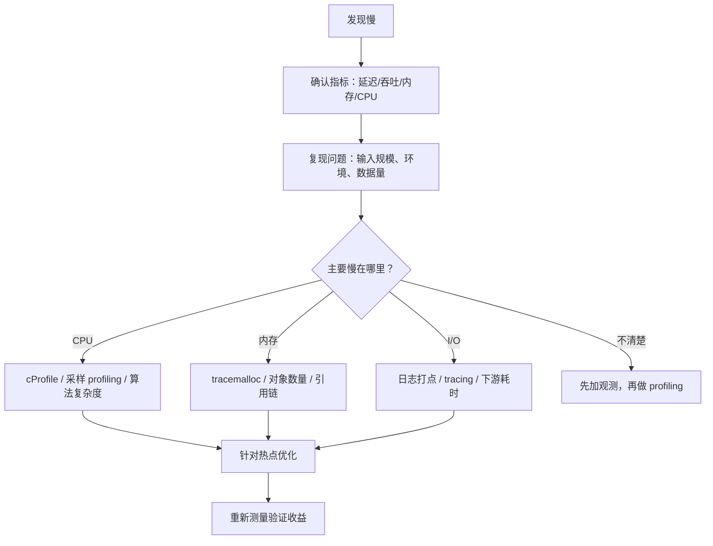

# Python - 第 15 课：性能优化与调试：复杂度、profiling、内存分析与常见陷阱

## 学习目标（本节结束后你能做到什么）

- 能建立 Python 性能优化的正确顺序：先定位瓶颈，再选择优化手段，而不是凭感觉改代码。
- 能区分 wall time、CPU time、I/O 等待、内存占用、吞吐和延迟这些常见指标。
- 能使用 `timeit` 做小片段基准测试，理解它和 `cProfile` 的边界不同。
- 能用 `cProfile` / `pstats` 定位函数级 CPU 热点，用 `tracemalloc` 分析 Python 层内存分配。
- 能识别 Python 常见性能陷阱：算法复杂度错误、频繁小对象创建、字符串拼接、N+1 I/O、阻塞事件循环、无界缓存、过早优化。

## 内容讲解（核心概念，用类比、例子、图示说清楚）

### 1. 为什么性能优化第一步不是“优化代码”

很多人一听“Python 性能慢”，第一反应是：

- 把 `for` 循环改成列表推导式
- 把函数调用内联
- 把 `list` 换成 `set`
- 上多线程
- 换成 `asyncio`
- 换成多进程

这些手段有时有效，但如果没有先定位瓶颈，就很容易变成“玄学调参”。

真正的性能优化应该先问：

**慢在哪里？**

可能慢在：

- 算法复杂度太高
- CPU 计算太重
- 数据库查询太多
- 网络 I/O 等待太久
- JSON 序列化太大
- 日志打太多
- 内存分配太频繁
- 对象长期被引用导致内存增长
- 并发模型选错
- 下游系统限流或抖动

如果瓶颈是数据库 N+1 查询，你把 Python 循环改成列表推导式没有意义。  
如果瓶颈是纯 CPU 计算，你把同步函数改成 `async def` 也不会变快。  
如果瓶颈是算法 `O(n^2)`，你调一堆微优化也只是杯水车薪。

所以第一原则是：

**Measure first, optimize second.**

### 2. 先分清几个性能指标

性能不是一个单一数字。

#### 2.1 wall time

墙钟时间，也就是从外部观察“这段代码实际过去了多久”。

如果一个请求从开始到结束用了 500ms，这就是 wall time 视角。

它包括：

- CPU 执行时间
- 等数据库
- 等网络
- 等锁
- 等队列
- 等文件 I/O

#### 2.2 CPU time

CPU 真正在执行你的进程代码花了多少时间。  
如果 wall time 很长，但 CPU time 很低，通常说明程序大量时间在等待。

#### 2.3 延迟

单次请求或任务从开始到结束的耗时。  
比如接口 P95 延迟 800ms。

#### 2.4 吞吐

单位时间能处理多少请求或任务。  
比如每秒处理 1000 个请求。

#### 2.5 内存占用

包括：

- Python 对象分配
- 进程 RSS
- 分配器保留内存
- C 扩展库额外内存

第 7 课讲过，对象释放不等于 RSS 立刻下降，所以内存分析要谨慎。

#### 2.6 一句话总结

性能排查时，你至少要区分：

- 是 CPU 忙
- 还是 I/O 等
- 是单次延迟高
- 还是吞吐上不去
- 是内存峰值高
- 还是内存持续增长

不同问题，优化方向完全不同。

### 3. 一个实用性能排查流程

可以先按这个顺序走：



注意最后一步：重新测量。  
很多优化看起来很漂亮，但实际收益可能很小，甚至引入回归。

### 4. 复杂度优先：大方向错了，微优化没用

Python 性能优化里最重要的不是“少写一层函数调用”，而是先看算法复杂度。

看例子：

```python
result = []
for x in a:
    if x in b:
        result.append(x)
```

如果 `b` 是列表，那么 `x in b` 是线性扫描。  
整体复杂度可能是 `O(n * m)`。

如果 `b` 很大，可以先转成 `set`：

```python
b_set = set(b)
result = []
for x in a:
    if x in b_set:
        result.append(x)
```

这时成员判断平均接近 `O(1)`，整体可能降到 `O(n + m)`。

这类优化比把循环写成列表推导式重要得多。

#### 4.1 面试里常见表达

如果被问“Python 如何优化性能”，不要只说工具。  
先说：

**先检查算法复杂度和数据结构选型，因为这是数量级收益来源。**

然后再谈 profiling 和局部优化。

### 5. `timeit`：适合小片段基准测试

`timeit` 适合测小段代码的执行时间。  
Python 官方文档也强调，它会避免很多常见计时陷阱。

例如：

```bash
python -m timeit "'-'.join(str(n) for n in range(100))"
```

或者在代码里：

```python
import timeit

elapsed = timeit.timeit(
    "sum(range(1000))",
    number=10000,
)
print(elapsed)
```

如果你要测当前命名空间里的函数，可以传 `globals`：

```python
def f():
    return sum(range(1000))

print(timeit.timeit("f()", globals=globals(), number=10000))
```

#### 5.1 `timeit` 适合什么

- 比较两个小实现哪个更快
- 验证微优化是否真的有收益
- 测量纯 Python 小片段

#### 5.2 `timeit` 不适合什么

- 复杂线上请求链路
- 数据库/网络 I/O
- 多线程/多进程系统整体表现
- 长时间服务内存增长

#### 5.3 一个重要细节：GC

官方文档说明，`timeit()` 默认会临时关闭垃圾回收，让独立计时更可比。  
这有好处，也有坏处：

- 好处：减少 GC 干扰
- 坏处：如果你测的代码本身受 GC 影响很大，结果可能不代表真实场景

所以你要知道它在测什么，不要把 `timeit` 结果直接等同于线上性能。

### 6. `cProfile`：定位函数级 CPU 热点

`cProfile` 是 Python 标准库里的确定性 profiler。  
官方文档也建议大多数用户优先使用 `cProfile`，因为它是 C 扩展实现，开销相对更合理。

最简单用法：

```bash
python -m cProfile -s cumulative script.py
```

常见排序方式：

- `tottime`：函数自身耗时，不包括子函数
- `cumtime`：函数累计耗时，包括子函数
- `calls`：调用次数

#### 6.1 怎么读 `cProfile` 输出

你通常会看到类似字段：

```text
ncalls  tottime  percall  cumtime  percall filename:lineno(function)
```

含义大致是：

- `ncalls`：调用次数
- `tottime`：函数自身花费时间
- `cumtime`：函数及其子调用累计时间
- `percall`：平均每次调用时间

如果你想找“整体拖慢链路的入口”，看 `cumtime` 很有用。  
如果你想找“函数内部自己很慢”，看 `tottime` 更有用。

#### 6.2 在代码里精细控制 profiling

```python
import cProfile
import pstats
from pstats import SortKey

profiler = cProfile.Profile()
profiler.enable()

run_workload()

profiler.disable()
stats = pstats.Stats(profiler).sort_stats(SortKey.CUMULATIVE)
stats.print_stats(20)
```

这样你可以只 profile 某一段关键逻辑，而不是整个程序。

#### 6.3 `cProfile` 的边界

官方文档也提醒，profiler 主要提供程序执行 profile，不是专门做小片段 benchmark 的。  
如果是小代码片段对比，用 `timeit` 更合适。

另外，`cProfile` 对 Python 函数调用统计很有用，但对下面情况要谨慎：

- C 扩展内部耗时可能显示得不够细
- I/O 等待和 CPU 计算需要结合上下文解释
- profiling 本身有开销
- 多进程/多线程需要分别采集或用其他工具

### 7. CPU 慢时，应该怎么优化

当 profiling 发现 CPU 热点后，常见优化方向按优先级看：

#### 7.1 改算法和数据结构

这是最优先的。  
例如：

- `list` 成员判断改 `set`
- 嵌套循环改索引结构
- 重复排序改堆或预处理
- N 次扫描改一次聚合

#### 7.2 减少重复计算

例如：

- 缓存纯函数结果
- 提前计算不变值
- 避免在循环里反复编译正则
- 避免重复解析 JSON

#### 7.3 减少 Python 层循环

如果数据量大，纯 Python 循环开销可能明显。  
可以考虑：

- 内建函数
- 标准库高效实现
- NumPy / Pandas / Polars 向量化
- C 扩展 / Rust 扩展

#### 7.4 并行化

如果确认是 CPU 密集且任务可拆，可以考虑：

- `ProcessPoolExecutor`
- 多 worker
- 外部任务系统

但第 13 课讲过，多进程有序列化和进程管理成本，不能无脑上。

### 8. 内存分析：`tracemalloc` 适合看 Python 层分配

`tracemalloc` 是 Python 标准库里的内存分配追踪工具。  
官方文档说明，它可以追踪 Python 分配的内存块，提供分配位置、按文件/行统计、快照差异等信息。

最小用法：

```python
import tracemalloc

tracemalloc.start()

run_workload()

snapshot = tracemalloc.take_snapshot()
top_stats = snapshot.statistics("lineno")

for stat in top_stats[:10]:
    print(stat)
```

这可以告诉你：

- 哪些文件和行分配了最多 Python 内存
- 分配了多少块
- 总大小是多少

#### 8.1 快照对比

如果你怀疑某段代码导致内存增长，可以做两次快照：

```python
import tracemalloc

tracemalloc.start()

snapshot1 = tracemalloc.take_snapshot()
run_workload()
snapshot2 = tracemalloc.take_snapshot()

top_stats = snapshot2.compare_to(snapshot1, "lineno")
for stat in top_stats[:10]:
    print(stat)
```

这有助于发现：

- 哪些地方新增了大量分配
- 哪些对象可能持续增长

#### 8.2 `tracemalloc` 的边界

它主要追踪 Python 内存分配。  
如果大量内存来自：

- NumPy 底层数组
- C 扩展自己的 allocator
- 外部 native 库

`tracemalloc` 可能看不完整。  
这时还要结合：

- 进程 RSS
- 外部 profiler
- 库自身工具
- 容器和系统指标

所以不要看到 `tracemalloc` 没显示，就断言“没有内存问题”。

### 9. 内存问题要区分峰值高和持续增长

内存问题有两类。

#### 9.1 峰值高

比如某个批处理一次性加载了太多数据：

```python
rows = list(load_all_rows())
```

这种问题的解法通常是：

- 分页
- 分块
- 生成器流式处理
- 边读边写
- 避免一次性构造大列表

#### 9.2 持续增长

比如服务跑一天内存越来越高。  
这通常要查：

- 全局缓存是否无界
- 列表/字典是否只增不减
- 是否有任务对象未释放
- 是否有闭包或回调持有大对象
- 是否有连接、session、上下文没有关闭

这类问题不一定靠 `gc.collect()` 解决。  
如果对象仍然可达，GC 不会回收它。

### 10. I/O 慢时，不要用 CPU profiler 解决所有问题

如果瓶颈是 I/O，`cProfile` 可能告诉你时间花在某个请求函数上，但它不能自动告诉你下游为什么慢。

I/O 慢通常要加：

- 请求耗时日志
- 数据库慢查询日志
- tracing
- 下游状态码
- 重试次数
- 超时统计
- 连接池等待时间

比如一个接口慢，原因可能是：

- 数据库查询没有索引
- Redis 偶发超时
- 第三方 API 慢
- HTTP 连接池耗尽
- 同步阻塞函数堵住事件循环
- 单次返回数据太大

这类问题要从系统链路看，不是只看 Python 函数耗时。

### 11. 常见 Python 性能陷阱

#### 11.1 在循环里做线性查找

```python
for item in items:
    if item.id in id_list:
        ...
```

如果 `id_list` 很大，应考虑转成 `set`。

#### 11.2 字符串循环拼接

```python
s = ""
for part in parts:
    s += part
```

大量字符串拼接时，通常应考虑：

```python
s = "".join(parts)
```

因为字符串不可变，反复拼接可能创建大量中间对象。

#### 11.3 不必要的一次性列表

```python
sum([x * x for x in nums])
```

如果只给 `sum` 消费，可以写：

```python
sum(x * x for x in nums)
```

但也不要机械迷信生成器。  
如果需要多次遍历或随机访问，列表更合适。

#### 11.4 循环里重复编译正则

```python
for text in texts:
    if re.match(pattern, text):
        ...
```

如果 pattern 固定，可以提前编译：

```python
compiled = re.compile(pattern)
for text in texts:
    if compiled.match(text):
        ...
```

#### 11.5 过度使用异常做高频控制流

异常适合异常路径。  
如果某个失败分支在热循环里极其高频，异常创建和堆栈处理可能成为成本。

但也不要因此否定 EAFP。  
关键仍然是测量和场景。

#### 11.6 日志字符串提前格式化

```python
logger.debug(f"payload: {expensive()}")
```

即使 debug 级别没打开，`expensive()` 也已经执行了。

更好的是避免在关闭级别下做昂贵计算，必要时先判断级别，或者使用 logging 的延迟格式化：

```python
logger.debug("payload: %s", payload)
```

#### 11.7 async 里调用阻塞函数

第 11 和第 14 课都讲过。  
在事件循环里调用阻塞 I/O 或 `time.sleep()`，可能让所有协程都被拖住。

### 12. 缓存：最有效也最危险的优化之一

缓存能显著减少重复计算或重复 I/O，但风险也很大。

#### 12.1 适合缓存的场景

- 结果稳定
- 计算昂贵
- 命中率高
- 数据量可控
- 有明确过期策略

#### 12.2 常见工具

例如标准库：

```python
from functools import lru_cache

@lru_cache(maxsize=1024)
def parse_config(path):
    ...
```

#### 12.3 缓存的坑

- 没有上限导致内存增长
- key 设计太细导致命中率低
- 缓存旧数据导致一致性问题
- 多进程下每个 worker 有自己的缓存
- 缓存穿透或击穿导致下游压力

所以缓存不是“加了就快”，而是要设计容量、过期、失效和观测。

### 13. 并发优化不是性能万能药

很多人看到慢就想上并发。

但要先问：

- 慢是因为 CPU 不够，还是因为等待 I/O
- 下游能承受更高并发吗
- 是否会触发限流
- 是否会造成更多重试
- 是否有超时和取消
- 是否会放大内存占用

并发的本质不是减少单个任务的工作量，而是改变任务调度和资源利用方式。

如果算法是 `O(n^2)`，并发只是让更多慢任务同时发生。  
如果下游数据库已经慢，并发可能把它打得更慢。

### 14. 优化 Python 代码时的一个顺序建议

可以按这个优先级：

1. 改需求边界  
   能不能少做、懒做、分页做、缓存做。

2. 改算法复杂度  
   避免数量级错误。

3. 改数据结构  
   用对 `list`、`dict`、`set`、heap、deque 等。

4. 减少 I/O 次数  
   批量查询、连接池、避免 N+1。

5. 减少对象分配  
   流式处理、复用结构、避免中间大列表。

6. 利用更快实现  
   内建函数、标准库、C 扩展、NumPy、数据库下推。

7. 并发或并行  
   线程、协程、多进程。

8. 最后才做微优化  
   局部语法层面的细节调整。

这个顺序能帮你避免过早优化。

### 15. 一个接口慢的排查示例

假设一个 FastAPI 接口 P95 延迟从 100ms 涨到 900ms。

不要直接改代码。先问：

#### 15.1 是所有请求都慢，还是某类请求慢

- 按路径看
- 按用户/租户看
- 按数据量看
- 按状态码看

#### 15.2 时间花在哪

加结构化日志或 tracing：

- 参数解析
- 权限检查
- 数据库
- Redis
- 第三方 API
- 序列化响应

#### 15.3 CPU 是否打满

如果 CPU 高：

- 用 profiler 找热点
- 看是否大循环、大 JSON、大排序、大正则

#### 15.4 I/O 是否等待

如果 CPU 不高但延迟高：

- 看数据库慢查询
- 看连接池等待
- 看下游超时
- 看网络抖动

#### 15.5 内存是否异常

如果内存持续涨：

- 看缓存
- 看大对象
- 看任务积压
- 看是否一次性加载大量结果

这个流程比“感觉哪里慢改哪里”可靠得多。

### 16. 一个批处理慢的排查示例

假设一个 Python 批处理从 10 分钟变成 2 小时。

排查思路：

- 数据量是否增长
- 是否从一次查询变成 N 次查询
- 是否某一步排序/去重复杂度变了
- 是否把生成器改成了大列表
- 是否日志量暴涨
- 是否下游 API 限流
- 是否进程池任务太碎
- 是否大对象在进程间反复 pickle

批处理优化经常不是“Python 循环慢”，而是：

- 数据边界变大
- I/O 次数变多
- 中间结果太大
- 并发粒度不合理

### 17. 调试性能时要避免的心态

#### 17.1 迷信某个工具

`cProfile`、`timeit`、`tracemalloc` 都有边界。  
工具不能替你理解系统。

#### 17.2 只看平均值

线上更关心：

- P95
- P99
- 最大值
- 尾延迟
- 抖动

平均值可能掩盖少数非常慢的请求。

#### 17.3 在本地小数据上得出结论

很多优化在 100 条数据上没差异，在 1000 万条数据上差异巨大。  
也可能反过来，小数据上某个写法快，大数据上因为内存暴涨而慢。

#### 17.4 优化没有回归测试

性能优化也可能改错行为。  
所以优化前后要有：

- 正确性测试
- 性能对比
- 回滚方案

### 18. 面试里怎么系统回答 Python 性能优化

如果面试官问：

- Python 性能慢怎么排查？
- `cProfile` 和 `timeit` 怎么用？
- 内存泄漏怎么查？
- 怎么优化 Python 代码？

你可以按这个框架回答：

1. 先讲原则  
   不凭感觉优化，先明确指标和复现路径，再定位瓶颈。

2. 再分类型  
   看是 CPU、I/O、内存、算法复杂度、并发模型还是下游系统问题。

3. 再讲工具  
   小片段用 `timeit`，函数级热点用 `cProfile` / `pstats`，Python 层内存分配用 `tracemalloc`，线上链路用日志、指标和 tracing。

4. 再讲优化方向  
   优先改复杂度和数据结构，其次减少 I/O 和对象分配，再考虑缓存、向量化、多进程、协程等。

5. 最后讲验证  
   优化后要重新测量，确认收益和正确性，避免只做局部微优化。

这样答，比“Python 慢就用多进程”成熟很多。

## 小结（3-5 条关键点）

- Python 性能优化的第一步是定位瓶颈，而不是直接改代码；CPU、I/O、内存、复杂度和下游系统要分开看。
- `timeit` 适合小片段基准测试，`cProfile` 适合函数级执行热点分析，`tracemalloc` 适合追踪 Python 层内存分配。
- 算法复杂度和数据结构选型通常带来数量级收益，比语法微优化重要得多。
- 内存问题要区分峰值高和持续增长，也要区分 Python 对象释放、分配器复用和 OS 层 RSS 下降。
- 并发、缓存、向量化、多进程都是工具，必须结合瓶颈、数据规模、下游承载能力和工程边界选择。

## 问题（检测用户对当前章节内容是否了解）

1. 如果一个接口变慢，你会如何判断它是 CPU 问题、I/O 问题、内存问题，还是下游系统问题？
2. `timeit` 和 `cProfile` 分别适合什么场景？为什么不能把它们混成一个工具？
3. `cProfile` 输出里的 `tottime` 和 `cumtime` 有什么区别？分别适合看什么问题？
4. `tracemalloc` 能帮你看到什么？它为什么不一定能看到 NumPy 或 C 扩展里的全部内存？
5. 为什么说算法复杂度优化通常比 Python 语法层微优化更重要？请举一个 `list` 成员判断改 `set` 的例子。

如果你愿意，我们下一篇就继续写第 16 课，把 Python 面试高频题从语言细节到底层原理做一次系统串讲。
