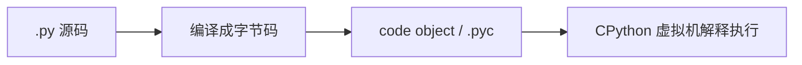
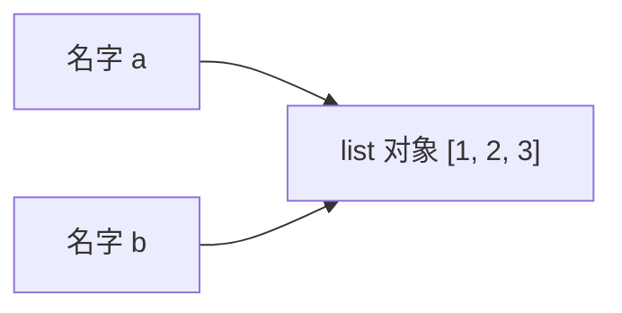
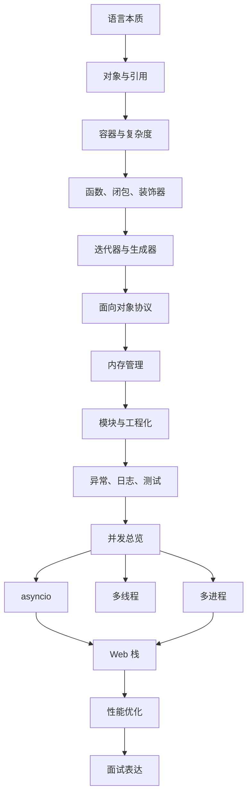

# Python - 第 16 课：面试高频题串讲：从语言细节到底层原理的答题框架

## 学习目标（本节结束后你能做到什么）

- 能把前 15 课的 Python 知识从“散点概念”组织成可用于面试表达的结构化答案。
- 能用“定义 -> 原理 -> 边界 -> 工程场景”的框架回答 Python 高频问题。
- 能避免常见低水平回答，比如“Python 是解释型语言”“GIL 导致线程没用”“生成器省内存”这种只有结论、没有边界的说法。
- 能把语言细节和底层运行时联系起来，例如对象模型、引用计数、描述符、迭代协议、`asyncio`、WSGI/ASGI。
- 能形成首轮复盘地图，知道后续哪些点可以继续深入到 CPython 源码、性能工程、Web 服务和并发实战。

## 内容讲解（核心概念，用类比、例子、图示说清楚）

### 1. 为什么最后一课不是继续堆新知识，而是训练表达

系统学习和面试表达不是一回事。

你可能已经理解：

- Python 变量是名字绑定对象
- `dict` 基于哈希表
- 生成器能暂停恢复
- 描述符能接管属性访问
- `CPython` 主要靠引用计数
- GIL 影响多线程 CPU 并行
- `asyncio` 依赖事件循环

但面试时，如果这些知识只是散在脑子里，就很容易出现两种问题：

第一种是答得太浅：

- “Python 是解释型语言。”
- “`dict` 查询是 `O(1)`。”
- “GIL 所以 Python 多线程没用。”
- “生成器省内存。”

这些话不是完全错，但太像背答案。

第二种是答得太散：

- 你知道很多细节
- 但没有先给主干
- 面试官听不到重点
- 越讲越像在倒知识点

所以这一课的目标，是把前 15 课压缩成面试可用的表达框架。

一个好的技术回答通常有四层：

1. 定义  
   先把问题定位清楚。

2. 原理  
   解释为什么是这样。

3. 边界  
   说明什么时候成立、什么时候不成立。

4. 工程场景  
   回到真实项目里怎么用、怎么避坑。

后面每个高频题都按这个思路来串。

### 2. 高频题 1：Python 是解释型语言吗

#### 推荐回答

Python 通常被归类为解释型语言，但这个说法不完整。  
以最常见的 `CPython` 为例，源码通常会先经过词法和语法分析，被编译成字节码，然后再由 Python 虚拟机解释执行这些字节码。

所以更准确地说：

**Python 不是像 C/C++ 那样通常提前编译成本地机器码运行，但也不是完全没有编译阶段。**

#### 可以补充的原理

执行链路大致是：



这也是为什么会有：

- `__pycache__`
- `.pyc`
- `dis` 模块能看字节码

#### 边界意识

还要区分 Python 语言和 Python 实现：

- `CPython` 是最主流实现
- `PyPy` 有 JIT
- 不同实现可能执行机制不同

所以面试里不要把所有实现细节都说成“Python 语言规定”。

### 3. 高频题 2：Python 是动态类型还是强类型

#### 推荐回答

Python 是动态类型语言，也是强类型语言。

动态类型指的是：

**变量名本身没有固定类型，类型属于对象。**

例如：

```python
x = 1
x = "hello"
```

这里不是变量 `x` 的类型被永久改变，而是名字 `x` 先绑定到 `int` 对象，后面又绑定到 `str` 对象。

强类型指的是：

**Python 不会在不合理的类型操作中随便隐式转换。**

例如：

```python
1 + "2"
```

会报错，而不是偷偷变成 `"12"` 或 `3`。

#### 面试加分点

把它和对象模型连起来：

- 变量是名字
- 类型属于对象
- 操作能不能执行，取决于对象支持的协议和方法

这样就不是在背“动态强类型”四个字，而是在讲运行时模型。

### 4. 高频题 3：变量、对象、引用怎么理解

#### 推荐回答

Python 里的变量更准确地说是名字。  
赋值不是把值复制进盒子，而是让名字绑定到对象。

例如：

```python
a = [1, 2]
b = a
b.append(3)
```

`a` 和 `b` 绑定到同一个列表对象。  
`append` 修改的是这个共享的可变对象本身，所以通过 `a` 也能看到变化。

#### 图示表达



#### 边界意识

如果是：

```python
b = b + [3]
```

那是创建新列表，再让 `b` 重新绑定过去，不是原地修改原列表。  
所以判断是否影响外部，要看：

- 是否共享同一个对象
- 对象是否可变
- 操作是原地修改还是重新绑定

### 5. 高频题 4：`is` 和 `==` 有什么区别

#### 推荐回答

`==` 比较值是否相等，`is` 比较对象身份是否相同，也就是是不是同一个对象。

```python
a = [1, 2]
b = [1, 2]

a == b  # True
a is b  # False
```

两个列表内容相同，所以 `==` 为真；但它们是两个不同对象，所以 `is` 为假。

#### 面试边界

判断 `None` 推荐：

```python
x is None
```

因为 `None` 是单例，我们关心身份。

但不要因为小整数缓存或字符串驻留导致某些 `is` 返回 `True`，就用 `is` 比较值。  
小整数缓存和字符串驻留是 `CPython` 实现优化，不是业务语义。

### 6. 高频题 5：可变对象和不可变对象有什么区别

#### 推荐回答

可变和不可变描述的是对象本身能不能原地修改。

常见不可变对象：

- `int`
- `float`
- `str`
- `tuple`

常见可变对象：

- `list`
- `dict`
- `set`
- 大多数自定义对象

不可变对象不能原地改，但名字可以重新绑定。  
例如：

```python
s = "abc"
s = s + "d"
```

这里不是把原字符串改了，而是创建新字符串，再让 `s` 绑定过去。

#### 工程场景

可变对象容易带来共享副作用。  
典型坑是默认参数：

```python
def add(x, items=[]):
    items.append(x)
    return items
```

默认参数在函数定义时求值，这个列表会被多次调用共享。  
推荐写法：

```python
def add(x, items=None):
    if items is None:
        items = []
    items.append(x)
    return items
```

### 7. 高频题 6：浅拷贝和深拷贝有什么区别

#### 推荐回答

浅拷贝通常只复制最外层容器，里面元素仍然是原对象的引用。  
深拷贝会递归复制对象图，尽量让内层对象也变成新对象。

例如：

```python
import copy

data = [[1, 2], [3, 4]]
shallow = copy.copy(data)
deep = copy.deepcopy(data)
```

如果执行：

```python
shallow[0].append(99)
```

原始 `data` 也会受影响，因为内层列表是共享的。

#### 边界意识

深拷贝不是万能解法：

- 更慢
- 更占内存
- 复杂对象图可能有特殊行为
- 有些对象不能或不应该复制

工程上要先想清楚需要复制到哪一层，而不是无脑 `deepcopy`。

### 8. 高频题 7：Python 函数传参是值传递还是引用传递

#### 推荐回答

更准确地说，Python 是对象共享传递，也常叫 call by sharing。

函数调用时，形参是一个新名字，绑定到实参所引用的同一个对象。  
如果函数内部原地修改这个对象，外部能看到；如果只是让形参重新绑定到新对象，外部看不到。

例子：

```python
def f(x):
    x.append(1)

def g(x):
    x = x + [1]
```

`f` 修改共享列表对象，外部受影响。  
`g` 创建新列表并让局部名字 `x` 重新绑定，外部不受影响。

#### 面试加分点

这道题不要陷入“值传递 / 引用传递”二选一。  
直接回到名字绑定对象模型，答案会更稳。

### 9. 高频题 8：`list`、`tuple`、`dict`、`set` 怎么选

#### 推荐回答

可以先分两组：

- `list` / `tuple` 是序列结构
- `dict` / `set` 是哈希结构

`list` 适合有序、可变、按下标访问、末尾追加。  
`tuple` 适合有序、不可变、表达稳定记录，也可能作为复合 key。  
`dict` 适合 key-value 映射和按 key 快速查找。  
`set` 适合去重和成员测试。

#### 复杂度表达

- `list[i]` 是 `O(1)`
- `list.append()` 摊还是 `O(1)`
- `x in list` 是 `O(n)`
- `x in set` 平均是 `O(1)`
- `dict[key]` 平均是 `O(1)`

#### 边界意识

`dict` / `set` 平均查找快，是用更多内存换时间。  
`O(1)` 是平均情况，不是绝对永远常数。  
能不能做 `dict` key，关键看对象是否可哈希，通常要求哈希值稳定。

### 10. 高频题 9：`dict` 底层是什么，为什么快

#### 推荐回答

`dict` 底层核心思想是哈希表。  
查找时先根据 key 计算哈希值，再根据哈希值定位到候选位置，如果有冲突再继续探测和比较。

它快的原因是：

**尽量把线性扫描变成通过哈希直接定位。**

#### 面试边界

平均查找是 `O(1)`，但不是没有代价：

- 哈希表需要额外空间
- 要处理冲突
- 装载因子不能太高
- 极端冲突下可能退化

工程上如果需要频繁成员判断，`set` / `dict` 往往比 `list` 合适；但如果只需要顺序遍历，`list` 可能更简单、更省空间。

### 11. 高频题 10：什么是闭包

#### 推荐回答

闭包是：

**函数加上它捕获并保留下来的外部作用域状态。**

例如：

```python
def make_counter():
    count = 0

    def inc():
        nonlocal count
        count += 1
        return count

    return inc
```

`make_counter` 返回后，`inc` 仍然能访问并修改 `count`，这就是闭包。

#### 晚绑定问题

经典例子：

```python
funcs = []
for i in range(3):
    funcs.append(lambda: i)
```

最后调用时可能都返回 `2`。  
因为闭包捕获的是变量绑定，不是创建时的值快照。

修复：

```python
funcs.append(lambda i=i: i)
```

用默认参数在定义时冻结当前值。

### 12. 高频题 11：装饰器本质是什么

#### 推荐回答

装饰器本质上是一个接收函数、返回函数的高阶函数。  
`@deco` 大致等价于：

```python
f = deco(f)
```

例子：

```python
def log(func):
    def wrapper(*args, **kwargs):
        print("before")
        result = func(*args, **kwargs)
        print("after")
        return result
    return wrapper
```

#### 原理连接

装饰器成立依赖三件事：

- 函数是一等公民
- 名字可以重新绑定
- 闭包可以保存原函数对象

#### 工程场景

适合做：

- 日志
- 鉴权
- 重试
- 缓存
- 计时
- 事务包装

不要把核心业务逻辑藏进过多装饰器里，否则可读性和调试会变差。

### 13. 高频题 12：迭代器和生成器有什么区别

#### 推荐回答

可迭代对象是能提供迭代器的对象。  
迭代器是真正负责逐个产出元素的对象，通常实现 `__iter__` 和 `__next__`。

`for` 循环背后大致是：

```python
it = iter(data)
while True:
    try:
        x = next(it)
    except StopIteration:
        break
```

生成器是一类特殊迭代器，用 `yield` 实现暂停、产出、恢复。

#### 生成器价值

生成器适合：

- 惰性计算
- 流式处理
- 大文件逐行处理
- 不需要一次性保存全部结果的场景

#### 边界意识

生成器通常不能随机访问，且常常只能顺序消费一次。  
如果结果要多次遍历或按下标访问，列表可能更合适。

### 14. 高频题 13：`yield` 和 `return` 有什么区别

#### 推荐回答

`return` 返回结果并结束函数。  
`yield` 产出一个值、暂停函数执行、保留当前上下文，等下次 `next()` 或 `send()` 时继续执行。

生成器函数调用后不会立刻执行函数体，而是返回生成器对象。

#### 加分点：`send`

`send(value)` 可以恢复生成器，并把暂停点的 `yield` 表达式结果设为 `value`。  
这让生成器不只是单向产出值，也能接收值，形成协程的前置基础。

### 15. 高频题 14：Python 的面向对象高级机制怎么理解

#### 推荐回答总图

Python 面向对象高级机制主要围绕两个问题：

- 属性怎么找
- 类怎么造

`MRO` 解决继承体系中属性和方法按什么顺序查找。  
`super()` 不是简单调用父类，而是按 MRO 找下一个实现。  
描述符是接管属性访问行为的对象。  
`property` 是描述符的常见应用。  
`dataclass` 适合数据承载型类，减少样板代码。  
元类是创建类的类，控制类对象创建过程。

#### 描述符推荐表达

描述符实现 `__get__`、`__set__`、`__delete__` 等方法，可以控制属性读取、写入和删除。  
普通方法绑定 `self`、`property`、`classmethod`、ORM 字段都和描述符思想有关。

#### 元类边界

元类很强，但不应该作为第一反应。  
很多问题可以用普通函数、类装饰器、描述符、`__init_subclass__` 更清晰地解决。

### 16. 高频题 15：Python 内存管理怎么做

#### 推荐回答

在常见 `CPython` 中，内存管理主要依赖引用计数，并辅以分代循环垃圾回收。

每个对象维护引用计数：

- 新引用出现，计数增加
- 引用消失，计数减少
- 计数为 0，对象通常可以被释放

但引用计数处理不了循环引用，所以需要 `gc` 来发现外部不可达但内部互相引用的对象。

#### 工程边界

`del x` 删除的是名字绑定或容器引用，不一定马上释放对象。  
对象释放也不等于内存立刻归还操作系统，因为 Python 分配器可能保留内存复用。

#### 面试加分点

小整数缓存、字符串驻留、对象池都是实现优化，不应该影响你使用 `==` 和 `is` 的基本原则。

### 17. 高频题 16：GIL 是什么，有什么影响

#### 推荐回答

GIL 是 `CPython` 中的全局解释器锁。  
它的核心影响是：

**同一个进程中，同一时刻通常只有一个线程在执行 Python 字节码。**

所以纯 Python CPU 密集型任务通常很难靠多线程实现多核加速。

#### 边界意识

GIL 不等于 Python 线程没用。  
线程在等待 I/O 时通常会释放 GIL，所以 I/O 密集型任务仍然适合线程池。

GIL 也不代表所有计算都不能并行。  
一些 C 扩展或数值库可能释放 GIL，或者把计算下沉到原生库。

#### 选型表达

- I/O 密集 + 同步阻塞库：线程池
- I/O 密集 + async 生态：协程
- CPU 密集：多进程、C 扩展、NumPy、外部计算服务

### 18. 高频题 17：线程、协程、多进程怎么选

#### 推荐回答

先判断任务类型：

- I/O 密集：主要时间在等网络、数据库、文件
- CPU 密集：主要时间在本地计算
- 混合型：先打点确认瓶颈

线程适合同步阻塞 I/O。  
协程适合 async 生态下的大量 I/O 等待。  
多进程适合粗粒度 CPU 密集任务。

#### 关键边界

线程有共享状态和锁问题。  
协程不能阻塞事件循环。  
多进程有启动、pickle、进程间通信和内存成本。

#### 面试金句

**并发选型不是先选工具，而是先看瓶颈在哪里。**

### 19. 高频题 18：`asyncio` 的执行模型是什么

#### 推荐回答

`async def` 调用后返回协程对象，不会自动执行。  
协程需要被 `await`，或包装成 Task 交给事件循环调度。

事件循环负责调度 Task、监听 I/O、管理定时器。  
当协程遇到 `await` 时，会挂起当前协程，把控制权交还给事件循环；等待对象完成后，再恢复执行。

#### Task 和协程区别

- 协程对象：可执行计划
- Task：被事件循环管理和调度的协程执行单元

`create_task()` 会让协程并发推进。  
直接连续 `await` 多个协程，可能仍然是顺序执行。

#### 工程边界

- 不要在协程中调用阻塞函数
- 不要无限创建 Task
- 要处理取消和超时
- `CancelledError` 清理后通常要重新抛出
- 后台任务要管理生命周期和异常

### 20. 高频题 19：多进程有哪些坑

#### 推荐回答

多进程能绕开单进程 GIL，因为每个进程有自己的解释器和 GIL，可以真正多核并行。  
但代价是：

- 进程启动更重
- 进程内存隔离
- 参数和返回值需要 pickle
- 大对象传输成本高
- 进程间共享状态复杂
- 子进程需要能导入主模块

`ProcessPoolExecutor` 中任务函数最好放在模块顶层，入口要加：

```python
if __name__ == "__main__":
    main()
```

#### 版本边界

现代 Python 中不能默认依赖 `fork` 行为。  
`spawn`、`fork`、`forkserver` 启动方式不同，代码应明确了解环境。

### 21. 高频题 20：WSGI 和 ASGI 有什么区别

#### 推荐回答

WSGI 是同步 Web Server 和 Python Web 应用之间的标准接口。  
应用大致是：

```python
application(environ, start_response)
```

它适合传统 HTTP 请求响应模型。

ASGI 是异步服务器网关接口。  
应用大致是：

```python
async def app(scope, receive, send):
    ...
```

它用 `scope` 表示连接信息，用 `receive` / `send` 处理事件，更适合异步 I/O、WebSocket、长连接和多协议。

#### FastAPI 位置

FastAPI 是 ASGI 框架，不是 Web Server。  
Uvicorn 是 ASGI server，负责监听连接、解析协议、调用 ASGI app。  
FastAPI 负责路由、参数解析、校验、依赖注入、序列化和 OpenAPI。

### 22. 高频题 21：Python 性能慢怎么排查

#### 推荐回答

不要先凭感觉优化。  
先明确指标和复现路径，再定位瓶颈。

排查顺序：

1. 看慢的是延迟、吞吐、CPU、内存还是 I/O。
2. 看输入规模、数据量、环境是否变化。
3. CPU 问题用 `cProfile` / profiling。
4. 小片段对比用 `timeit`。
5. Python 层内存分配用 `tracemalloc`。
6. I/O 问题靠日志、metrics、tracing、慢查询。
7. 优化后重新测量验证收益。

#### 优化优先级

优先改复杂度和数据结构。  
然后减少 I/O、减少对象分配、缓存、向量化、并发或并行。  
最后才做语法层微优化。

### 23. 高频题 22：如何把脚本写成工程代码

#### 推荐回答

脚本工程化主要看几个边界：

- 入口边界
- 函数职责
- 异常处理
- 资源管理
- 日志
- 测试
- 依赖和配置

推荐结构：

```python
def transform(data):
    ...

def run(input_path, output_path):
    data = read_input(input_path)
    result = transform(data)
    write_output(output_path, result)

def main():
    run("input.json", "output.json")

if __name__ == "__main__":
    main()
```

这样导入模块不会自动执行任务，核心逻辑也更容易测试。

#### 工程加分点

- 异常只捕获知道如何处理的
- 资源用 `with`
- 日志用 `logging`，保留上下文和堆栈
- 测试覆盖成功路径和异常路径
- 外部依赖用 mock 或集成测试隔离

### 24. 高频题 23：`import` 是怎么工作的

#### 推荐回答

`import` 不是复制代码，而是加载模块对象并在当前命名空间绑定名字。

简化流程：

1. 查 `sys.modules` 缓存。
2. 如果已有，直接复用模块对象。
3. 如果没有，按 `sys.path` 等规则查找模块。
4. 创建模块对象并放入 `sys.modules`。
5. 执行模块顶层代码。
6. 在当前命名空间绑定名字。

#### 常见坑

- 循环导入会拿到半初始化模块
- 影子模块会覆盖标准库或第三方库
- 直接运行文件和 `python -m package.module` 的包上下文不同
- 模块顶层不要做重副作用

### 25. 高频题 24：模块、包、发行包有什么区别

#### 推荐回答

模块通常是一个 `.py` 文件。  
包是组织模块的目录，传统包通常有 `__init__.py`。  
项目是完整代码仓库或应用单元。  
发行包是可以被安装和分发的产物。

`pip install xxx` 里的名字是发行包名。  
`import yyy` 里的名字是模块名或包名。  
它们经常相同，但不保证一定相同。

#### 工程边界

虚拟环境用于隔离项目依赖。  
应用项目通常更强调锁定版本和可复现。  
库项目通常更强调兼容范围。

### 26. 高频题 25：上下文管理器背后是什么

#### 推荐回答

上下文管理器用于表达资源生命周期。  
`with` 进入时调用 `__enter__`，离开时调用 `__exit__`。

即使代码块里抛异常，`__exit__` 也会被调用，因此适合：

- 文件关闭
- 锁释放
- 连接归还
- 事务提交或回滚
- 临时状态恢复

#### 边界意识

`__exit__` 如果返回 `True` 会吞掉异常。  
大多数资源清理型上下文管理器不应该随便吞异常，只负责清理。

也可以用 `contextlib.contextmanager` 基于生成器写更轻量的上下文管理器。

### 27. 高频题 26：日志怎么打才算工程化

#### 推荐回答

工程日志不是 `print`。  
它应该包含：

- 时间
- 级别
- 模块
- 关键上下文
- 异常堆栈
- 可检索字段

常见级别：

- `DEBUG`
- `INFO`
- `WARNING`
- `ERROR`
- `CRITICAL`

异常日志推荐：

```python
logger.exception("failed to process order", extra={"order_id": order_id})
```

`logger.exception()` 会记录当前异常堆栈，通常在 `except` 块里使用。

#### 边界意识

不要所有问题都打 `ERROR`。  
业务校验失败和系统异常要区分。  
日志要有上下文，否则线上不可排查。

### 28. 如何把多个知识点串成一个高级回答

面试官有时会问开放题：

- “你怎么看 Python 的性能？”
- “Python 适不适合写后端？”
- “Python 和 Java/Go 比有什么优劣？”

这时不要散答。  
可以这样组织：

#### 28.1 Python 的优势

- 表达力强
- 动态性强
- 生态丰富
- 开发效率高
- 适合脚本、平台工具、AI / 数据处理、I/O 型后端服务

#### 28.2 Python 的代价

- 动态类型和对象模型有运行时开销
- `CPython` 字节码解释执行
- 函数调用和属性查找成本较高
- GIL 影响单进程多线程 CPU 并行
- 部署和依赖环境需要管理好

#### 28.3 工程解法

- I/O 服务用线程池或 async
- CPU 计算用多进程、C 扩展、NumPy、外部服务
- 大数据用流式、分页、批处理
- 性能问题先 profiling
- 项目用虚拟环境、清晰模块结构、日志、测试

#### 28.4 最终结论

Python 不是以极致运行效率取胜，而是以开发效率、生态和工程组合能力取胜。  
在合适边界内，它非常适合后端平台、AI 工具链、数据处理和中后台服务；在极致低延迟或重 CPU 计算场景，要通过架构拆分和高性能组件补齐短板。

### 29. 一个面试答题模板

遇到 Python 问题，可以用这个模板：

```text
这个问题我会分四层看：

第一，概念上它是什么。
第二，在 CPython 或常见实现里它大致怎么工作。
第三，它有什么边界和常见坑。
第四，工程里我会怎么使用或规避问题。
```

举例，问 GIL：

```text
GIL 是 CPython 的全局解释器锁。
它使同一进程内同一时刻通常只有一个线程执行 Python 字节码。
所以它限制纯 Python CPU 密集型多线程并行，但不代表线程没用，I/O 等待时线程仍然有价值。
工程里我会先判断任务类型：同步 I/O 用线程池，async 生态用 asyncio，CPU 密集用多进程或 C 扩展。
```

这个模板能让你避免只背一句结论。

### 30. 首轮主线复盘地图

首轮 16 课可以压缩成这张地图：



这条路线的重点不是把所有 API 都背完，而是建立一套判断力：

- 语言现象能回到对象模型
- 性能问题能回到复杂度和 profiling
- 并发问题能回到任务类型
- Web 问题能回到协议和网关接口
- 工程问题能回到边界、日志、测试和可观测性

### 31. 后续可以继续深挖的方向

首轮结束后，可以按需要进入第二轮：

1. CPython 对象模型源码  
   看 `PyObject`、类型对象、引用计数、字节码执行循环。

2. Python 性能工程  
   深入采样 profiler、火焰图、内存泄漏定位、C 扩展边界。

3. FastAPI 实战工程  
   项目结构、依赖注入、数据库 session、中间件、认证、测试、部署。

4. 并发实战  
   线程池批处理、`asyncio` 队列、任务取消、进程池、后台任务系统。

5. 面试专项训练  
   按高频题逐个模拟回答，再根据回答补 `xxb_补充.md`。

这也符合这个仓库的掌握学习原则：  
不是一口气看完就算掌握，而是通过回答问题暴露误区，再补课纠偏。

## 小结（3-5 条关键点）

- Python 面试回答不要只背结论，最好按“定义 -> 原理 -> 边界 -> 工程场景”组织。
- 很多高频题本质上都能回到几条主线：对象模型、名字绑定、协议、运行时、并发模型、工程边界。
- GIL、生成器、描述符、`asyncio`、WSGI/ASGI、内存管理这些看似分散的知识，都可以和前面主线连接起来。
- 面试表达要主动区分 Python 语言层和 `CPython` 实现层，避免把实现细节说成语言规范。
- 首轮学习完成后，下一步最重要的是用问答检验掌握程度，而不是继续无脑堆新概念。

## 问题（检测用户对当前章节内容是否了解）

1. 请你用“定义 -> 原理 -> 边界 -> 工程场景”的结构回答：GIL 是什么，有什么影响？
2. 请解释 Python 变量为什么不是盒子模型，并用这个模型解释默认可变参数的问题。
3. 请比较线程、协程、多进程的适用场景，并说明你会如何判断一个任务该用哪种模型。
4. 请解释 WSGI 和 ASGI 的区别，并说明 FastAPI、Uvicorn 分别站在哪一层。
5. 如果一个 Python 接口突然变慢，你会如何从 CPU、I/O、内存、复杂度、下游系统几个角度排查？

你可以先任选 2 到 3 题回答。  
我会根据你的回答判断掌握程度：如果很稳，我们可以进入第二轮深入；如果某些点还虚，我会补对应的 `xxb_补充.md`。
