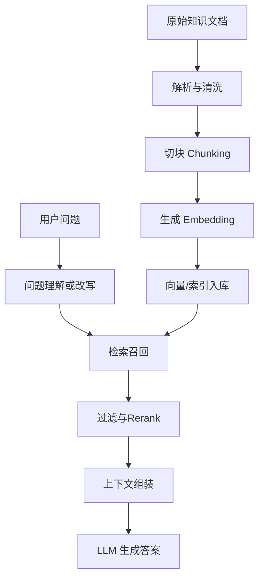

# RAG - 第 1 课：RAG是什么、它解决什么问题

## 学习目标（本节结束后你能做到什么）

1. 能用自己的话解释 RAG 是什么，而不是只会背全称。
2. 能说清楚为什么大模型在很多知识问答场景里需要 RAG。
3. 能区分 RAG、微调、传统搜索、数据库查询各自适合解决什么问题。
4. 能画出一个最基本的 RAG 链路，并理解每一步的职责。

## 内容讲解（核心概念，用类比、例子、图示说清楚）

### 1. 先别急着记定义，先看 RAG 为什么会出现

很多人第一次接触大模型时，会有一种错觉：模型已经“懂很多东西”了，那是不是我把问题直接问它就行？  
在一些通用知识问题上，这么做确实可以。但一旦进入真实业务，问题很快就出现了。

假设你在公司里做一个“员工制度问答机器人”。你把问题直接发给模型：

`试用期员工出差，住宿报销上限是多少？`

这时模型会遇到至少四个困难：

1. 它未必见过你公司的内部制度。
2. 就算见过相似表述，也不代表记得住你们现在最新版本的规定。
3. 即使它答出了一个看起来像真的数字，也不代表这个数字来自你们的正式文档。
4. 当用户追问“依据在哪一页、哪一条”时，它往往说不清来源。

这就是大模型在企业知识场景里的典型短板：它很擅长语言理解和组织表达，但它不天然等于“你公司的实时、私有、可追溯知识库”。

所以，RAG 出现的核心原因不是“模型太笨”，而是因为我们需要一种方法，让模型在回答前先去找资料，再基于资料作答，而不是只靠自己“回忆”。

你可以把它想成一次开卷考试：

- 没有 RAG：考生只凭记忆作答，记错了也会一本正经地写出来。
- 有了 RAG：考生先去翻指定教材，找到相关段落，再根据材料组织答案。

这里最关键的变化，不是模型变聪明了，而是回答过程多了一步`先检索证据`。

### 2. RAG 到底是什么

RAG 是 `Retrieval-Augmented Generation`，中文通常叫“检索增强生成”。

这个名字里有三层意思：

- `Retrieval`
  先从知识库里检索和问题最相关的内容片段。
- `Augmented`
  把这些检索到的片段作为额外上下文补充给模型。
- `Generation`
  再让模型基于问题和上下文生成最终回答。

所以，RAG 不是一个单独模型，也不是一个单独数据库，而是一条工作链路。

最小闭环通常长这样：

如果只从一句话理解，RAG 就是：

`把“先找资料，再回答”这件事系统化。`

### 3. 一个具体例子：为什么“先检索”会比“直接问”靠谱

继续看公司的制度问答系统。知识库里有三份文档：

- `员工差旅制度 2026 版`
- `试用期管理规范`
- `财务报销 FAQ`

用户问：

`试用期员工从上海去杭州出差，住宿可以报多少？`

如果没有 RAG，模型可能会根据一般常识回答“二线城市每天 400 元左右”，听起来很合理，但可能完全不是你公司的标准。

如果有 RAG，系统会先做这些事：

1. 从文档里找出和“试用期”“出差”“住宿报销上限”最相关的段落。
2. 把这些段落连同文档标题、章节号一起送给模型。
3. Prompt 明确要求模型“仅基于提供资料回答；资料不足时明确说明不知道”。
4. 最终答案里附带来源，比如“依据《员工差旅制度 2026 版》第 3.2 节”。

这时系统的价值就不只是“答对概率更高”，而是还多了三种工程价值：

- `可追溯`
  你能知道答案基于哪份资料。
- `可更新`
  制度变了，重建知识索引就行，不需要重训大模型。
- `可控`
  找不到证据时，可以让系统拒答，而不是胡编。

### 4. RAG 解决的到底是哪一类问题

RAG 特别适合下面这些场景：

- 私有知识问答，比如企业制度、内部 SOP、产品文档、接口文档
- 需要最新知识的问题，比如价格、规则、版本说明、运营策略
- 长文档知识提取，比如合同、论文、手册、会议纪要
- 需要给出处或引用依据的场景

你会发现，这些问题有一个共同点：答案不是“模型训练时背下来的通识”，而是“存在于某些资料里，而且最好能指出资料位置”。

换句话说，RAG 更像在解决`知识访问问题`，而不是纯粹的`推理能力问题`。

如果资料本身没有答案，RAG 也救不了你。  
它不是魔法，而是让模型尽可能站在“有证据”的基础上说话。

### 5. RAG 和微调、搜索、数据库查询分别是什么关系

这部分特别容易混。

#### 5.1 RAG 和微调不是互相替代

很多初学者会问：既然我要让模型懂我的资料，为什么不直接微调？

因为微调和 RAG 解决的主要不是一回事。

- 微调更擅长调整模型的`行为方式`
  比如输出格式、说话风格、任务习惯、分类模式。
- RAG 更擅长补充模型的`外部知识`
  比如公司文档、最新版本说明、不断变化的业务规则。

如果你的知识经常更新，或者你希望能指出依据，RAG 通常比微调更合适。  
微调像是在“改这个人说话和做题的习惯”，RAG 像是在“给这个人一套可以翻阅的新资料”。

#### 5.2 RAG 和传统搜索也不是一回事

传统搜索的核心目标是“把相关文档找出来给你看”。  
RAG 的目标则是“先找相关文档，再由模型帮你组织成答案”。

所以搜索更像“把书架上的书递给你”，RAG 更像“先把相关书页找出来，再帮你总结成一段回答”。

但这不代表搜索会被替代。实际上，很多效果好的 RAG 系统反而很依赖传统搜索能力，比如：

- 关键词检索能精确命中术语、编号、报错码
- BM25 对短词和专有名词经常很有价值
- 混合检索通常比纯向量检索更稳

所以真实工程里经常不是“搜索 or RAG”，而是“搜索 + RAG”。

#### 5.3 RAG 和数据库查询也不同

数据库查询适合结构化、确定性的事实读取，比如：

- 某个订单的状态是什么
- 某位用户今天下了几单
- 某个配置项当前值是多少

这类问题本质上是精确读数，不需要模型“总结”。  
如果你已经有标准 SQL 或 KV 查询路径，直接查数据库通常比走 RAG 更稳、更便宜、更可控。

所以你要有一个很重要的判断：

`能用精确查询解决的问题，尽量不要绕一圈变成 RAG。`

RAG 更适合半结构化、非结构化文本里的知识理解和归纳，不适合替代所有后端查询逻辑。

### 6. RAG 不是“接上向量库就结束了”

这是最常见的误解之一。

很多教程会让你很快跑通一个 Demo：上传文档，切块，做 embedding，写入向量库，然后 query 一下。  
Demo 能跑通，不代表系统就好用。

真正影响效果的关键问题包括：

- 文档切块是否合理
- metadata 是否保留了标题、章节、页码、来源、权限信息
- query 和 document embedding 是否来自兼容模型
- 检索结果是否需要 rerank
- 最终 Prompt 是否要求引用来源和拒绝无依据回答
- token 预算是否合理，是否把无关片段塞满了上下文

也就是说，向量库只是其中一个零件，不是全部答案。  
RAG 的本质是整个链路设计，而不是某个单点组件。

### 7. 什么时候不该优先用 RAG

学 RAG 时，另一个很重要的能力是知道什么时候别滥用它。

下面这些场景里，RAG 往往不是第一选择：

- 纯结构化查询
  直接查数据库更稳。
- 明确规则计算
  比如运费、税费、折扣计算，应该优先写规则引擎或服务逻辑。
- 低容错高风险决策
  比如医疗、法律、金融审批，不能只靠 RAG 回答直接做决策。
- 资料本身质量很差
  如果源文档混乱、冲突、过时，RAG 只是把脏知识检索得更快。

所以你要记住一句话：

`RAG 的上限，往往受限于资料质量和链路设计，而不是受限于“有没有向量库”。`

### 8. 这一课你先建立的核心直觉

到这里，你应该先形成三个直觉。

第一个直觉：  
RAG 不是为了让模型“更会想”，而是为了让模型回答时“更有依据”。

第二个直觉：  
RAG 的重点不是某个炫酷框架，而是整条链路有没有把资料处理好、检索准、上下文装对。

第三个直觉：  
RAG 不是万能替代品。它适合文本知识问答，但不该替代结构化查询、规则计算和高风险决策系统。

如果这三个直觉建立起来，后面学 chunk、embedding、pgvector、rerank、token 预算时，你就不会只盯着工具，而会一直围绕“为什么这么设计”去理解。

## 小结（3-5 条关键点）

- RAG 的本质是让模型在回答前先检索证据，再基于证据生成回答。
- RAG 主要解决的是私有知识、最新知识、长文档知识和可追溯回答的问题。
- 微调更偏调整模型行为，RAG 更偏补充外部知识，两者不是同一类方案。
- 传统搜索、数据库查询和 RAG 各有边界，不能把所有问题都一股脑交给 RAG。
- RAG 的效果好坏，取决于整条链路设计，而不只是“有没有用了向量库”。

## 检查站

先别急着往下读，试着自己回答这 3 个问题：

1. 为什么企业内部知识问答通常比通用聊天更需要 RAG？
2. 如果一个问题可以直接用 SQL 精确查到结果，为什么通常不应该优先走 RAG？
3. “RAG 不是向量库，而是一条链路”这句话，你会怎么向别人解释？
