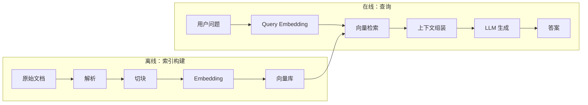
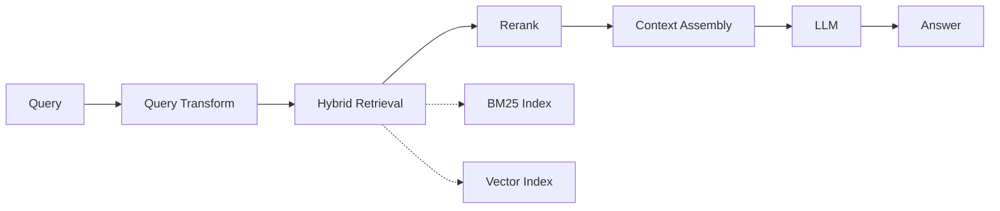

# RAG - 第 1 课：RAG 的本质与 2026 年的重心迁移

## 学习目标（本节结束后你能做到什么）

1. 用一句话讲清 RAG 在解决什么，并能拆出背后的三类知识缺口。
2. 画出 RAG 最小闭环，并能指出每一步的工程坑。
3. 讲得出 2020 → 2022 → 2023 → 2024 → 2025 → 2026 的演化脉络，知道每一步是被什么逼出来的。
4. 面对`"RAG vs 微调 vs 长上下文 vs Cache-Augmented Generation"`的对比，能给出一个不含糊的选型框架。
5. 能回应"RAG 已死"这个话题，不陷入两边站队，而是讲清`重心在迁移`。
6. 建立三个 2026 年做 RAG 必须有的工程直觉。

---

## 1. 从问题定义开始：大模型的三类知识缺口

RAG 不是一个酷炫框架，它首先是一个`工程补丁`。理解它的正确方式，是先看`大模型自己搞不定什么`。

大模型有一个常被忽视的事实：它的参数里存储的知识是`截断`的、`静态的`、`不可审计的`。这导致在真实业务里它面对三类明确缺口：

### 1.1 私有知识缺口（Private Knowledge Gap）

模型训练语料里不会有你公司的：
- 内部制度、SOP、接口文档、产品手册
- 客户合同、工单历史、CRM 记录
- 代码仓、设计文档、架构评审记录

这部分知识天然在`模型参数外`。没有任何微调可以一劳永逸地解决这个问题，因为文档在持续变化。

### 1.2 时效性知识缺口（Freshness Gap）

即使是公开信息，模型也存在`knowledge cutoff`。Claude Opus 4.7 的知识截断是 2026 年 1 月，GPT 家族类似。但现实业务里很多信息每天都在变：

- 商品价格、库存状态、运营活动
- 合规规则、税率、法规更新
- 股价、新闻、竞品动态

这类信息必须`运行时获取`，不可能靠训练时记忆。

### 1.3 长尾知识缺口（Long-tail Gap）

即使在模型`看过`的语料里，有些知识也只是`记得一点`。模型的记忆能力遵循 power law：

- 高频实体（美国总统、Python 语法）它记得很牢。
- 中频实体（某个开源库的冷门 API）它可能记错。
- 低频实体（某个区域性法规、某个小众论文里的算法）它基本靠猜。

长尾知识是幻觉的主要来源。模型越是`不确定`，越容易`一本正经地胡说`。

> **面试 takeaway**：如果面试官问"为什么需要 RAG？"，不要只回答"防止幻觉"。正确答法是：RAG 在补三类缺口——私有、时效、长尾——而幻觉只是长尾缺口的可见症状。

---

## 2. RAG 最小闭环（Naive RAG）

把三类缺口翻译成系统语言，RAG 在做的事其实就一句话：

`回答前先检索证据，再基于证据生成。`

最朴素的 RAG（教科书里那一套）长这样：



这套东西 2022-2023 年被 LangChain、LlamaIndex 推成了"RAG 的标准形态"。但它有一个现在看起来很明显的问题：**每一步都是最朴素的实现**。

- 解析：PyPDF 硬抽文本，表格全乱。
- 切块：按 500 字符硬切，overlap 50。
- Embedding：text-embedding-ada-002（2022 年的模型）。
- 检索：纯向量，topK=4。
- 上下文组装：简单拼接。
- 生成：一段 prompt，"基于以下资料回答"。

2023 年的很多 RAG 系统，基本就是这套东西。效果也就还行——在`演示场景`里看着挺唬人，`上生产就拉胯`。

这就是`Naive RAG`（朴素 RAG）这个词在 2024 年被发明出来的原因：人们开始把它和后来更成熟的架构区分开。

---

## 3. 2020 → 2026 演化史：每一步是被什么逼出来的

这是本章的核心。理解`演化路径`比记住`当前最优解`更重要，因为它让你在面对`明天会出现的新方案`时，能判断它在解决什么老问题。

### 3.1 2020：RAG 论文，原教旨主义时代

RAG 这个词来自一篇 Facebook AI Research 的论文：

> Lewis et al., *Retrieval-Augmented Generation for Knowledge-Intensive NLP Tasks*, NeurIPS 2020.

那时候还没有 ChatGPT，也没有 GPT-4。这篇论文做的事是：
- 用 DPR（Dense Passage Retrieval）做检索器。
- 用 BART 做生成器。
- 两者`联合训练`，让生成器学会用检索结果。

重点：**这个原始版本是 end-to-end 训练的**，检索器和生成器一起优化。这和后来 2023 年那种"把 GPT 当黑盒 + 向量库"的做法根本不是一回事。

这里先埋一个伏笔：**2025-2026 年的一个趋势是把"联合优化"的思想请回来**，比如 DSPy、RAG-specific 的 reranker 训练、甚至 reasoning model 自带检索能力。

### 3.2 2022 年底：ChatGPT 出现，"RAG 平民化"开始

2022 年 11 月 ChatGPT 发布。随后两个月里：
- LangChain（2022.10）发布。
- GPT Index（后来改名 LlamaIndex，2022.11）发布。
- Pinecone、Weaviate、Chroma 等向量库产品化。

这些工具让`非 ML 工程师`也能搭一个 RAG Demo。代价是——大家都只会搭那个 Demo，因为工具就是按最简单的 flow 设计的。

这个时期的典型 RAG：
```python
# 2023 年初的典型 RAG 代码（Python）
from langchain.embeddings import OpenAIEmbeddings
from langchain.vectorstores import Chroma
from langchain.chains import RetrievalQA
from langchain.llms import OpenAI

# 切块：CharacterTextSplitter，固定 1000 字符
# Embedding：text-embedding-ada-002
# 向量库：Chroma in-memory
# LLM：gpt-3.5-turbo
qa = RetrievalQA.from_chain_type(llm=OpenAI(), retriever=vectorstore.as_retriever())
print(qa.run("我们的差旅报销规则是什么？"))
```

这代码跑是跑得起来，问题一大堆：
- 切块切坏了，表格和列表都被切断。
- Embedding 对中文支持差（ada-002 对中文不友好）。
- 没 rerank，topK 里一半是噪声。
- 没引用，没拒答，没评测。

但这是整个行业的起点。

### 3.3 2023：Advanced RAG 的"缝补期"

2023 年全年，大家都在给 Naive RAG `打补丁`。重要的补丁包括：

- **Hybrid Retrieval**：BM25 + 向量，RRF 融合。2023 年人们发现纯向量检索在`专有名词`、`代码`、`错误码`场景下表现远不如 BM25。
- **Rerank**：Cohere Rerank（2023.05）、bge-reranker（2023 年下半年）、cross-encoder 路线成熟。Rerank 成为生产系统的标配。
- **Query 改写**：HyDE（2022.12 发表，2023 年开始流行）、Multi-query、Step-back。
- **Parent-Child Chunking**：切小的做检索，返回大的做生成，解决`检索准 vs 上下文全`的矛盾。
- **Evaluation**：RAGAs（2023.09）出现，第一次有了统一的 RAG 评测框架。

到 2023 年底，业界形成了一个叫`Advanced RAG`的共识架构：



这个架构到今天仍然是`70% 生产 RAG 系统`的底座。但它解决不了的问题，2024 年被两件事放大：**长上下文**和**全局性问题**。

### 3.4 2024：五件大事重塑了 RAG

2024 年是 RAG 技术的"寒武纪大爆发"。五件事值得记住：

#### （1）GraphRAG（Microsoft，2024.04）

> Edge et al., *From Local to Global: A Graph RAG Approach to Query-Focused Summarization*, 2024.04.

微软研究院提出：对整个语料先做`实体抽取 + 图构建 + 社区聚类 + 层次化摘要`，查询时走图。它解决的是`全局性问题`，比如"这套文档的主要观点是什么"——这种问题 chunk 检索永远答不好，因为答案`不在任何一个 chunk 里`，而是在`chunk 之间的联系里`。

代价：构图成本极高，一份 1M token 语料索引成本 1-10 美金，更新困难。

#### （2）RAPTOR（Stanford，2024.01）

> Sarthi et al., *RAPTOR: Recursive Abstractive Processing for Tree-Organized Retrieval*, ICLR 2024.

不用图，用`递归摘要树`。对 chunk 聚类，对每个聚类做摘要，再对摘要聚类，再摘要，形成多层树。检索时可以命中`叶子 chunk`也可以命中`中层摘要`。比 GraphRAG 便宜，解决`多层次抽象`的问题。

#### （3）ColPali（2024.06-07）

> Faysse et al., *ColPali: Efficient Document Retrieval with Vision Language Models*, 2024.07.

革命性想法：**别再解析 PDF 了**。直接用 VLM（Vision Language Model）把整页当图像 embedding，再用 ColBERT 的 late interaction 做多向量检索。

它解决了 RAG 最老的痛点之一：PDF 里的图表、公式、复杂版面，文本解析永远丢信息。ColPali 绕过了整个"解析 + 切块"流程。

#### （4）Contextual Retrieval（Anthropic，2024.09）

> Anthropic blog, *Introducing Contextual Retrieval*, 2024.09.19.

想法很简单但非常有效：**给每个 chunk 预先生成一段"上下文说明"，把 chunk 放回文档全貌中**。再做 embedding 和 BM25 索引。

举例：
```
原始 chunk: "公司第二季度收入增长 3%，达到 25 亿美元。"

加 Contextual Retrieval 后:
"这个 chunk 来自 ACME Corp 2023 年第二季度财报。前一个段落是 Q1 收入（23 亿）。"
"公司第二季度收入增长 3%，达到 25 亿美元。"
```

Anthropic 的数据：检索失败率下降 **49%**（结合 Rerank 下降 **67%**）。代价：每个 chunk 要多调一次 LLM，用 prompt caching 后成本可控（大约 每 M token $1）。

这是 2024 年对`chunk 表达`的最大一次升级。第 4 课会深讲。

#### （5）Late Chunking（Jina AI，2024.08）

> Günther et al., *Late Chunking: Contextual Chunk Embeddings Using Long-Context Embedding Models*, 2024.08.

想法反过来：**embedding 的时候不先切，用长上下文 embedding 模型编码整个文档，再在 token-level 输出上做平均池化得到 chunk embedding**。这样每个 chunk 的 embedding 自带全文上下文。

它和 Contextual Retrieval 解决同一个问题（chunk 的上下文语义丢失），但走完全不同的路——一个靠 LLM 重写，一个靠 encoder 的长上下文能力。

---

到 2024 年底，Advanced RAG 被扩展成了 **Modular RAG**。典型架构包含：

- 多种 chunk 策略（固定、结构化、parent-child、Contextual、Late）
- 多种索引（vector、BM25、graph、tree）
- 多种检索路由（query router 决定走哪条）
- 多级 rerank
- Self-correction（CRAG、Self-RAG 开始成熟）

### 3.5 2025：Agentic RAG 与 Reasoning 的融合

2025 年有两件事深刻改变了 RAG 的形态：

#### （1）Reasoning models 普及

2024 年 9 月 OpenAI 发布 o1，2025 年 1 月 DeepSeek R1 开源，reasoning model 进入主流。这改变了 RAG 的什么？

**Query 理解和多跳推理被"还给"模型**。以前你要写一堆 prompt 模板做 Query Decomposition、Step-back，现在给 reasoning model 一个"可以调用检索的工具"，它自己会：
- 拆分问题
- 判断要不要检索
- 分析返回结果
- 决定要不要继续检索
- 综合给出答案

这就是 **Agentic RAG** 的本质：把 orchestration 从代码逻辑迁移到模型推理。

#### （2）Deep Research 类产品

2025 年陆续出现的 Deep Research（OpenAI、Google、Perplexity 都有）是 Agentic RAG 的巅峰形态：一个查询可能触发几十次检索、几分钟的推理。用户看到的是`一份带引用的调研报告`，背后是数十次`retrieve → read → reason → retrieve again`。

这类产品验证了一件事：**RAG 的价值在高 stakes、高复杂度的知识任务上被放大了，而不是被长上下文替代了**。

#### （3）MCP 改变工具/数据接入方式

2024 年 11 月 Anthropic 发布 Model Context Protocol（MCP），2025 年被 OpenAI、Google 相继采纳。MCP 对 RAG 的影响不是`替代 RAG`，而是`标准化 RAG 作为一种工具的接入协议`。

以前每个 RAG 系统都自己定义 "retrieve 接口"，现在 MCP 把它标准化成一种 tool。这意味着：
- 知识库可以做成 MCP server，供任意 Agent 调用。
- 多个知识库可以被同一个 Agent 并行查询。
- 知识库的边界从`某个应用内部`扩展到`跨应用的基础设施层`。

### 3.6 2026：重心迁移到"数据代理层"

到 2026 年（现在），RAG 领域出现了几个明显趋势：

**（a）传统 pipeline 部分贬值**
- prompt engineering 的边际价值下降（因为模型自己能做 query 改写和反思了）。
- 简单的 orchestration workflow 被 reasoning model + tool 替代。
- "拼接 8 个 chunk 喂给 LLM" 这种做法效果不如 "给 Agent 5 轮检索机会"。

**（b）数据层价值上升**
- 文档解析（尤其是多模态）仍然是瓶颈。
- Chunk 策略、metadata 设计、知识结构建模仍然极度重要。
- `Knowledge Unit` 概念成熟：把知识从`扁平 chunk`升级为`结构化知识单元`（见第 2 课）。

**（c）检索作为"数据代理"而非"管道组件"**
- 知识库越来越像`对外服务`，而不是`内嵌在应用里的组件`。
- `Data Proxy` 的概念：在 Agent 和原始数据之间架一层代理，提供统一的语义访问接口。

这就是为什么这版大纲第 2 课专门讲`从 chunk 检索到 Knowledge Unit + Data Proxy`。

---

## 4. RAG vs 微调 vs 长上下文 vs CAG：2026 年的选型框架

这是面试最爱考的对比题。不要背答案，用下面这个决策框架：

### 4.1 维度一：知识的`稳定性`

| 知识类型 | 变化频率 | 建议方案 |
|---|---|---|
| 企业制度、产品手册 | 周-月 | RAG |
| 行为风格、输出格式 | 基本不变 | 微调 |
| 代码仓、法律条文 | 天-周 | RAG |
| 领域术语、行业习惯 | 基本不变 | 微调（或 in-context few-shot） |

核心逻辑：**知识变，用 RAG；能力变，用微调**。

### 4.2 维度二：知识的`体量`

| 体量 | 建议方案 |
|---|---|
| < 50K tokens（一本小册子） | 长上下文直接塞，必要时加 prompt caching |
| 50K - 5M tokens | Cache-Augmented Generation（CAG）或 RAG |
| > 5M tokens | RAG 几乎是唯一选择 |

**Cache-Augmented Generation (CAG)** 是 2024 年底被提出的一个概念（Chan et al., 2024.12）：如果你的知识库能整个塞进长上下文（比如 500K 以内），而且查询 QPS 不是极高，你可以用 prompt caching 把整个知识库`缓存`住，每次查询只付出 prefix cache hit 的成本（Anthropic 上约 1/10 的 token 成本）。

CAG 在`知识库中等大小 + 高命中精度要求 + 低 QPS`场景下，有时比 RAG 更好。

### 4.3 维度三：是否需要`可追溯性`

如果业务要求`每个答案能指向具体文档段落`（合规、法律、医疗），几乎必须 RAG，因为微调和长上下文都难以保证引用的准确性。

### 4.4 维度四：`延迟`和`成本`

- RAG 延迟 = 检索延迟 + 生成延迟（检索 100-300ms，生成 1-5s）
- 长上下文延迟 = prefill 时间（500K token 可能 5-15s）+ 生成
- CAG 延迟 = cache hit 的 prefill（快很多）+ 生成
- 微调 = 生成延迟（最快）

### 4.5 一句话总结

```
稳定能力 → 微调
小而稳的知识 → 长上下文 / CAG
大而动的知识 → RAG
要引用 → RAG
预算紧 → 先 RAG + prompt caching
```

真实系统里经常是`微调 + RAG + 长上下文`组合使用。这不是矛盾，而是不同缺口用不同工具。

---

## 5. "RAG is dead" 是噪音吗？

2024-2025 年反复出现一波"RAG is dead"的声音，理由通常是：
- 长上下文到 1M-10M，不用检索了。
- Agent 自己能调工具，不需要预先索引。
- 模型越来越会"自己想"，不需要喂资料。

这些论点都有`部分真实`，但结论错了。正确的说法是：

> **"Naive RAG 的某些假设老化了，但 RAG 作为一种'把外部知识接到模型'的范式没死，只是重心在迁移。"**

具体迁移：

- **从 "好的 pipeline" 迁移到 "好的数据"**
  以前工程力气花在 splitter、retriever、reranker 的微调。现在更多花在解析、知识结构化、metadata 设计。

- **从 "静态 orchestration" 迁移到 "Agentic 交互"**
  以前 RAG 是一条直线：retrieve → generate。现在是 Agent 带检索工具，自主决定何时用。

- **从 "应用内组件" 迁移到 "数据代理层"**
  以前每个应用自己搭 RAG。现在越来越多团队把知识库抽成`独立服务`（Data Proxy + MCP server），跨应用复用。

面试里听到"RAG is dead"，你可以这么回答：

> "我不认同 RAG 已死的说法。简单 pipeline 的边际价值在下降，这是真的。但数据层、检索器质量、评测这些在模型变强的时候反而更关键——因为 garbage in garbage out 的放大效应更严重。2024 年的 Contextual Retrieval、ColPali、Late Chunking 这些都是 RAG 领域的重要创新，说明这个方向远没到终点。"

这个回答会让面试官知道你既看过新闻，也有自己的判断。

---

## 6. 代码示例：一个`有反思的最小 RAG`

为了让你对 2026 年"现代 RAG"有直观感受，下面是一个最小实现，比 2023 年的 Naive RAG 多了几件事：

- 用 `bge-m3`（2024 年主流中英双语 embedding，支持 dense + sparse + multi-vector）
- 用 `bge-reranker-v2-m3` 做 cross-encoder rerank
- 用结构化 chunk（按标题 + 段落）
- 让模型返回 `{"answer": ..., "citations": [...]}`，并在`检索置信度低`时拒答
- 可选的 reflection：让模型判断当前上下文是否足够，不够就再检索

```python
# requirements:
# pip install sentence-transformers FlagEmbedding qdrant-client anthropic
# （这里以 Anthropic Claude 为例，换 OpenAI 同理）

from __future__ import annotations
import re
import anthropic
from typing import List, Dict, Any
from sentence_transformers import SentenceTransformer
from FlagEmbedding import FlagReranker
from qdrant_client import QdrantClient
from qdrant_client.models import VectorParams, Distance, PointStruct

# ---------- 1. 结构化 chunk：按标题分段，保留 metadata ----------
def chunk_by_heading(text: str, source: str) -> List[Dict[str, Any]]:
    """
    极简结构化 chunker：
    - 按 Markdown 标题切段
    - 每段保留来源和标题作为 metadata
    - 真实生产要换成 unstructured / docling
    """
    blocks = re.split(r"(?=^#{1,6}\s)", text, flags=re.MULTILINE)
    chunks = []
    for i, b in enumerate(blocks):
        b = b.strip()
        if not b:
            continue
        heading_match = re.match(r"^(#{1,6})\s+(.+)$", b.split("\n", 1)[0])
        heading = heading_match.group(2) if heading_match else ""
        chunks.append({
            "id": f"{source}-{i}",
            "text": b,
            "metadata": {"source": source, "heading": heading, "position": i},
        })
    return chunks

# ---------- 2. 索引构建 ----------
encoder = SentenceTransformer("BAAI/bge-m3")
reranker = FlagReranker("BAAI/bge-reranker-v2-m3", use_fp16=True)
qdrant = QdrantClient(":memory:")
COLLECTION = "docs"
qdrant.recreate_collection(
    collection_name=COLLECTION,
    vectors_config=VectorParams(size=1024, distance=Distance.COSINE),
)

def index(chunks: List[Dict[str, Any]]):
    embeddings = encoder.encode([c["text"] for c in chunks], normalize_embeddings=True)
    qdrant.upsert(
        collection_name=COLLECTION,
        points=[
            PointStruct(id=i, vector=embeddings[i].tolist(), payload=chunks[i])
            for i in range(len(chunks))
        ],
    )

# ---------- 3. 带 rerank 的检索 ----------
def retrieve(query: str, top_k: int = 20, rerank_top: int = 5) -> List[Dict[str, Any]]:
    q_emb = encoder.encode(query, normalize_embeddings=True).tolist()
    hits = qdrant.search(collection_name=COLLECTION, query_vector=q_emb, limit=top_k)
    pairs = [(query, h.payload["text"]) for h in hits]
    scores = reranker.compute_score(pairs, normalize=True)
    ranked = sorted(
        [(h, s) for h, s in zip(hits, scores)],
        key=lambda x: x[1],
        reverse=True,
    )[:rerank_top]
    return [
        {**h.payload, "score": float(s)} for h, s in ranked
    ]

# ---------- 4. 生成：要求引用，置信度低时拒答 ----------
client = anthropic.Anthropic()

ANSWER_PROMPT = """你是一个严谨的企业知识助手。下面是检索到的资料片段，每条有 id 和文本。
请仅基于这些资料回答用户问题，并在答案中用 [id] 的形式标注引用。
如果资料不足以回答，请直接回复 {"answer": "资料不足，无法回答", "citations": []}。

用户问题：{query}

资料：
{context}

请以 JSON 格式返回，字段为 answer 和 citations（citations 是引用的 id 列表）。"""

def answer(query: str, min_score: float = 0.3) -> Dict[str, Any]:
    chunks = retrieve(query)
    # 置信度护栏：最高分太低直接拒答
    if not chunks or chunks[0]["score"] < min_score:
        return {"answer": "资料不足，无法回答", "citations": []}
    context = "\n\n".join(
        f"[{c['id']}] ({c['metadata']['heading']}) {c['text']}" for c in chunks
    )
    resp = client.messages.create(
        model="claude-opus-4-7",
        max_tokens=1024,
        messages=[{
            "role": "user",
            "content": ANSWER_PROMPT.format(query=query, context=context),
        }],
    )
    import json
    return json.loads(resp.content[0].text)
```

这段代码 **不是生产级**，但它比 2023 年的 Naive RAG 多了几个关键工程护栏：

- 结构化切块保留标题
- `bge-m3` 是 2024 年主流中英双语 embedding
- rerank 把 top-20 收敛到 top-5
- 置信度护栏：最高 rerank 分数低于阈值就拒答
- 要求结构化输出 + 引用

后面每一章会把其中某一块继续深挖。

---

## 7. 三个 2026 年工程师必须有的直觉

**直觉一：RAG 的上限是数据，不是模型。**
模型能力越强，`garbage in garbage out` 的放大效应越严重。模型越能"根据资料生成流畅答案"，错误资料产生的错误答案就越像真的。2026 年做 RAG，80% 的精力应该投在数据层。

**直觉二：不要把 RAG 当成一条直线。**
经典 retrieve → rerank → generate 是一种形态，但不是唯一形态。2024 年 GraphRAG / RAPTOR 证明层次化、图结构也是 RAG；2025 年 Agentic RAG 证明 retrieve 可以是一个`被模型主动调用多次的工具`，而不是一次性管道。

**直觉三：每加一个组件，都要想清楚代价。**
Rerank 让召回更准，但多一跳延迟和模型成本。Contextual Retrieval 效果好，但索引成本多一倍。GraphRAG 答全局问题强，但构图成本 10 倍起。评价一个 RAG 方案，不能只看它能做什么，要看`它把成本和延迟推到什么位置`。

---

## 小结

1. RAG 补的是大模型的三类知识缺口：私有、时效、长尾。幻觉只是长尾缺口的症状。
2. 从 2020 的 end-to-end RAG，到 2022-2023 的 Naive RAG，到 2024 的 Advanced / Modular RAG，到 2025 的 Agentic RAG，到 2026 的 Knowledge Unit + Data Proxy，演化主线是**数据层价值上升，静态 pipeline 价值下降**。
3. 2024 年五件大事：GraphRAG、RAPTOR、ColPali、Contextual Retrieval、Late Chunking。2025 年 Reasoning + Agentic + MCP 重塑了 RAG 的执行形态。
4. RAG vs 微调 vs 长上下文 vs CAG，不是二选一。选型看`知识稳定性、体量、可追溯、延迟/成本`四个维度。
5. "RAG is dead" 是噪音。正确的判断是`重心在迁移`：从 pipeline 工程迁移到数据工程和 Agent 工程。

---

## 检查站

读完这章，试着不查资料回答下面三个问题。回答后我再决定下一步是直接进第 2 课，还是先补一节针对性补充课：

1. 为什么说"RAG 的幻觉问题只是长尾知识缺口的症状"？这句话对系统设计有什么具体指导意义？
2. 2024 年 Contextual Retrieval 和 Late Chunking 解决的是同一个问题吗？如果是同一个，为什么会出现两种方案？选择它们各自适合什么场景？
3. 面试官问你："我们团队知识库总共 200K tokens，QPS 很低，是不是不用做 RAG，直接长上下文就行？"——你的回答是什么？给出你的判断框架。

---

## 参考（按时间顺序）

- Lewis et al., *RAG for Knowledge-Intensive NLP Tasks*, NeurIPS 2020.
- Karpukhin et al., *Dense Passage Retrieval for Open-Domain QA*, EMNLP 2020.
- Gao et al., *Precise Zero-Shot Dense Retrieval without Relevance Labels* (HyDE), 2022.12.
- Sarthi et al., *RAPTOR*, ICLR 2024.
- Edge et al., *From Local to Global: A Graph RAG Approach*, 2024.04.
- Faysse et al., *ColPali: Efficient Document Retrieval with Vision Language Models*, 2024.07.
- Günther et al., *Late Chunking*, Jina AI 2024.08.
- Anthropic, *Introducing Contextual Retrieval*, 2024.09.
- Chan et al., *Don't Do RAG: When Cache-Augmented Generation is All You Need*, 2024.12.
- Gao et al., *Retrieval-Augmented Generation for LLMs: A Survey* (定期更新), 2023-2025.
