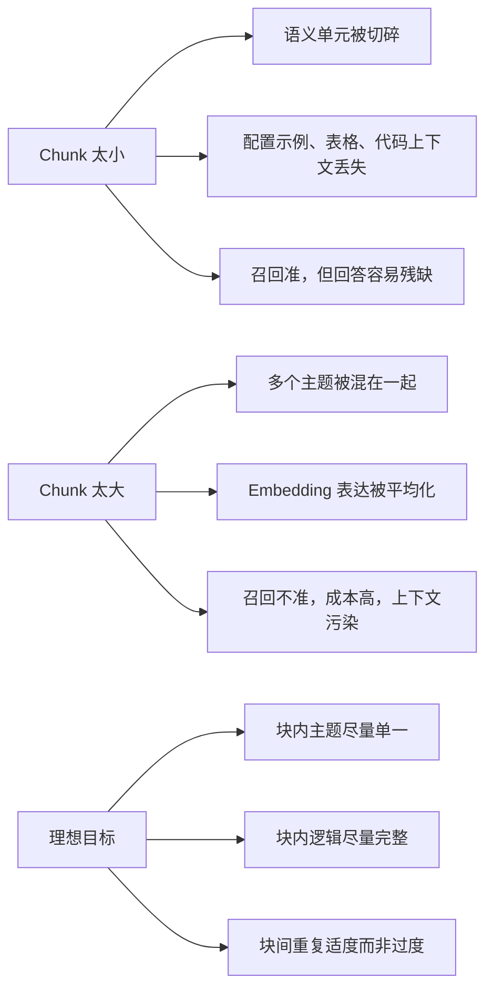
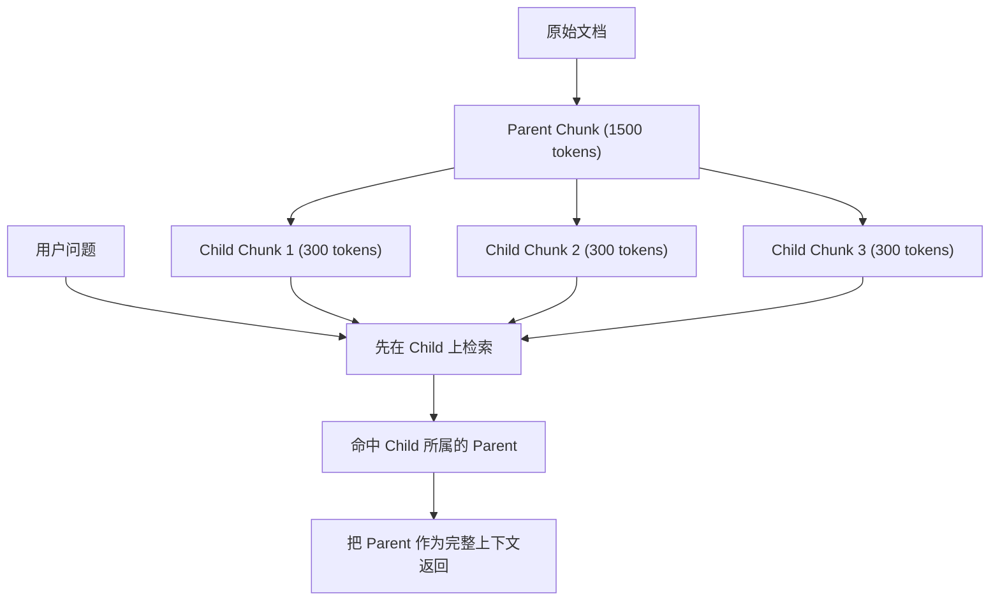
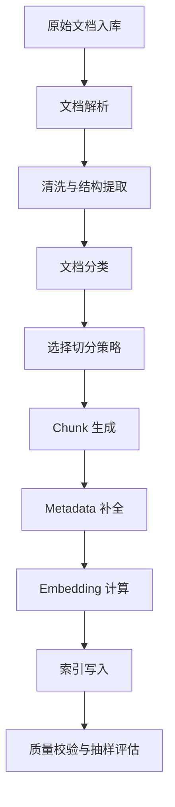

# RAG - 第 2 课：Chunk分片：RAG里最容易被低估、却最影响效果的一层

## 学习目标（本节结束后你能做到什么）

1. 你能解释为什么 chunk 不是“预处理细节”，而是 RAG 效果的地基。
2. 你能说清固定长度切分、结构化切分、语义切分、Parent-Child、Late Chunking 分别在解决什么问题，又分别会踩什么坑。
3. 你能根据文档类型和查询类型，给出一个有依据的 chunk 策略，而不是背“500 tokens 最佳实践”。
4. 你能建立一套评估 chunk 好坏的方法，知道什么时候问题出在切分，什么时候其实出在检索、rerank 或生成。
5. 你能从后端工程视角设计文档解析、切分、索引、增量更新、监控和告警这条链路。

## 内容讲解（核心概念，用类比、例子、图示说清楚）

### 1. 先把这个问题摆正：chunk 不是“把文档切一下”这么简单

很多人第一次做 RAG，会把问题理解成：

1. 文档丢进去。
2. 切成小块。
3. 做 embedding。
4. 相似度检索。
5. 把结果塞给模型。

这条链路当然没有错，但真正的坑在于：  
**第 2 步看起来最普通，实际上它决定了后面 3、4、5 步的上限。**

因为 RAG 的知识访问方式不是“直接看原始文档”，而是“先在切出来的小块里找，再把找到的小块拼回去”。  
这意味着：

- chunk 切坏了，embedding 再强也只能学到坏切片的语义。
- chunk 切坏了，向量库再快也只能检索到坏切片。
- chunk 切坏了，Prompt 再优雅也只能基于错误或不完整的上下文作答。

所以 chunk 是什么？  
最直白的说法就是：

`chunk 是你给知识库建立的“最小检索单元”。`

你可以把它想成图书馆索引系统里的“卡片”：

- 如果卡片太粗，只写“这本书讲 Java”，那就查不准。
- 如果卡片太细，细到每一行代码都单独做一张卡片，那就丢掉上下文。
- 如果卡片刚好覆盖一个完整的小主题，检索和回答就都舒服。

RAG 系统里大多数“为什么检索不准”“为什么答案不完整”“为什么成本这么高”的问题，最后都能追溯到 chunk 切得不合适。

### 2. 为什么一定要切：这是大模型、检索和成本三方面共同逼出来的

先别谈技巧，先谈约束。  
文档之所以必须切，不是因为大家爱折腾，而是因为不切根本跑不起来，或者跑起来会非常贵、非常差。

#### 2.1 上下文窗口不是无限资源

哪怕今天很多模型的上下文已经很大，比如 100k、200k token，甚至更大，也不意味着我们应该把整篇文档直接塞进去。

原因有三个：

- **第一，成本问题。**  
  模型上下文越长，输入 token 成本越高。你每次问一个问题都带上整本手册，API 账单会非常难看。

- **第二，时延问题。**  
  长上下文意味着更慢的预填充和推理。很多工程系统不是做“学术演示”，而是做真实在线服务，响应时间要可控。

- **第三，位置偏差问题。**  
  长上下文里，模型并不是对每个位置都同样敏感。中间内容往往最容易被忽略，这就是著名的 “Lost in the Middle” 现象。

所以，“模型上下文很大”不等于“RAG 可以不切块”。  
它只意味着：**你在切块和上下文组装上可以更从容，但不会消灭切块问题。**

#### 2.2 检索的基本单位必须足够小

向量检索不是魔法，它要比较的是“问题向量”和“chunk 向量”之间的相似性。

如果一个 chunk 里同时塞了：

- Spring Boot 启动优化
- Spring Cloud 配置中心
- Feign 超时重试
- Docker 镜像构建

那这个 chunk 的 embedding 就会变成一个“主题平均值”。  
用户问 `Spring Boot 启动优化` 时，它可能检索到，也可能被别的语义稀释掉。

所以检索单元不能太大，否则语义表达会被“平均化”，召回边界变模糊。

#### 2.3 生成模型吃上下文也不是越多越好

很多人觉得，多给模型一点上下文总没坏处。  
实际上不对。

上下文太多会引出三个工程问题：

- 噪声增加：相关片段淹没在无关片段里。
- token 预算被浪费：真正关键的内容反而占比下降。
- 模型更容易“拼接式胡编”：把多个相邻但不该合并的片段混成一个答案。

因此，切块的目标不是“把文档切小”，而是：

`让每个块既足够小，能被准确召回；又足够完整，能支持后续回答。`

### 3. 切分悖论：所有 chunk 设计，本质上都在平衡两个相反目标

这也是为什么团队总会围绕 `chunk_size` 和 `overlap` 争论半天。

可以把 chunk 设计理解成一个经典悖论：

- **切太小**  
  召回更精确，但上下文丢失，答案不完整。
- **切太大**  
  上下文更完整，但召回变钝，成本更高，噪声更多。

这就是“切分悖论”。

它不是一个可以彻底消灭的问题，而是一个必须管理的权衡。

我们可以用一张图把它画出来：



所以不要问：

`“chunk_size 到底应该设多少？”`

更有价值的问题是：

`“对于这类文档、这类查询、这类成本约束，我希望检索单元多大才最合适？”`

### 4. Token 这件事，比很多人以为的要坑得多

这一节非常重要。很多团队调 chunk 时的第一个错误，就是把“字符数”和“token 数”混着用。

#### 4.1 字符、词、token 不是一回事

对于中文，最容易出错。  
比如：

`基于深度学习的自然语言处理技术`

这串文本看起来只有十几个字，但不同 tokenizer 下 token 数差别很大。  
同样一句中文：

- 在某些 OpenAI tokenizer 下可能是 11 个 token
- 在某些 Anthropic tokenizer 下可能是 9 个 token
- 在某些对中文不友好的 tokenizer 下可能是 20 多个 token

这意味着：

- 你用 A 模型的 tokenizer 去估 B 模型的上下文预算，结果经常会偏。
- 你在本地评估时觉得 600 token 很安全，换模型上线后可能直接超。

所以一个很朴素但经常被忽视的规则是：

`chunk 大小的预算，一定要基于目标模型的 tokenizer。`

#### 4.2 中文标点、代码块、表格都可能扭曲 token 估算

很多经验法则只适合英文纯文本，比如：

`1 token ≈ 0.75 个英文单词`

但中文里：

- 标点可能单独占 token
- 省略号、全角符号、特殊换行都可能让 token 急剧增加
- Markdown 标题、代码 fence、JSON、YAML 都会放大 token 数

尤其是代码文档和 API 文档，字符看起来不长，token 往往偏多。

#### 4.3 你最终管理的是“总 token 预算”，而不是单个 chunk 大小

chunk 不是孤立存在的。  
一次检索通常会返回多个 chunk，再加上：

- system prompt
- query
- instructions
- citations
- output reservation

真正需要管理的是一次请求的总预算：

```text
总输入预算 = 系统提示 + 查询改写 + 检索结果 + 额外指令 + 安全冗余
```

如果你给 chunk 切得很大，`topK=8` 的时候可能一下就爆掉。  
所以 chunk 设计一定要和后面的 `topK`、rerank、上下文组装一起考虑。

### 5. 固定长度切分：为什么它最常见，也最容易埋雷

最原始的 chunk 思路就是按固定长度切。

比如：

```python
def naive_chunk(text, size=1000):
    return [text[i:i+size] for i in range(0, len(text), size)]
```

这类方案之所以大家都用过，是因为它有两个明显优点：

- 极其简单
- 很稳定，不依赖复杂解析器

如果你只是为了快速跑通 Demo，它确实是最容易上手的方案。

但它的问题也同样明显。

#### 5.1 它不理解任何语义边界

固定长度切分对文本一视同仁：

- 不知道哪里是段落边界
- 不知道哪里是代码块边界
- 不知道哪里是表格边界
- 不知道哪里是一句话刚讲完

结果就是：

- 一个完整配置示例上半段在 A，下半段在 B
- 标题和正文分开
- 表格行被切断
- 注释和代码分家

#### 5.2 它会制造“检索时命中不到、生成时拼不完整”的典型事故

举个真实场景：

文档里有一段：

```text
Spring Boot 启动优化建议如下：
1. 开启懒加载；
2. 减少自动配置扫描范围；
3. 使用 CDS；
4. 检查第三方 starter 初始化耗时。
```

如果固定 1000 字符硬切，刚好把第 1 行切到一个块，第 2~4 行切到另一个块：

- 用户搜“Spring Boot 启动优化”时，可能只召回标题块；
- 用户搜“CDS 怎么优化启动”时，可能只召回列表块；
- 任何一边单独进模型，都会丢掉完整语义。

#### 5.3 overlap 是固定长度切分的补救机制，不是万能药

很多人发现固定切分会断上下文，就会加 overlap。

这当然有用，但 overlap 只能缓解，不能根治。

因为 overlap 解决的是：

- 边界处的信息断裂

它解决不了的是：

- chunk 本身主题杂糅
- 切分点不自然
- 重复内容膨胀

所以 overlap 更像一个缓冲垫，而不是结构化切分的替代品。

### 6. overlap 到底该怎么理解：它不是越多越安全

overlap 最常见的误区就是：

`“怕丢内容，那我多重叠一点不就好了？”`

听起来合理，实际代价很大。

#### 6.1 overlap 的正面作用

它主要解决边界问题：

- 某个概念从 chunk A 结尾延续到 chunk B 开头
- 某个配置示例跨越边界
- 某句话上下句被拆开

这时适量重叠，确实能提升召回的连续性。

#### 6.2 overlap 的负面作用

但 overlap 一旦太大，会引出三个副作用：

- **存储膨胀**：重复文本做了多次 embedding，占空间、占索引。
- **召回去重难度上升**：同一段内容会以多个几乎相同的 chunk 形式反复出现。
- **上下文污染**：最终拼装 prompt 时，重复内容占用了宝贵 token。

#### 6.3 overlap 更像“边界保险”，不是“效果增强器”

经验上，overlap 通常可以先从相对保守的范围起步：

- 技术文档：10% 到 15%
- 新闻与短内容：15% 到 20%
- 强依赖上下文的法律或规范文档：20% 到 25%

但这只是起点，不是定律。

你应该始终结合两件事一起看：

- 你的 chunk 是否经常把完整信息切断
- 你的最终 prompt 里是否出现大量重复上下文

### 7. 结构化切分：真正工程可用的第一步

如果说固定长度切分是“先跑起来”的办法，  
那结构化切分通常是“第一次真正做出效果”的关键转折点。

它的核心思想不是按字符数硬切，而是优先尊重文档结构：

- 段落
- 标题
- 句号
- 列表项
- 代码块
- 表格
- Markdown 层级

这类方法的好处是：

`尽量让 chunk 边界和人类阅读边界一致。`

#### 7.1 一个常见的结构化切分思路

本质上是“优先级分隔符 + 大小约束”的组合。

比如：

1. 优先按标题或空段切
2. 如果块太大，再按句号切
3. 如果还太大，再按分号、逗号切
4. 最后才退化到硬切

这类策略虽然朴素，但在工程里非常鲁棒。

因为它不会假装自己“理解文档”，而是先最大化利用现成结构信号。

#### 7.2 为什么它比纯语义切分更容易落地

因为结构信号通常更稳定：

- 段落是作者自己划出来的
- 标题是文档天然的语义边界
- 代码块 fence 是硬边界
- 表格结构是格式边界

这些边界不需要额外算 embedding，就能直接利用。

这就是为什么很多成熟系统最终都会采用一种“看起来不够炫，但效果稳定”的方案：  
**先结构化，必要时再语义微调。**

### 8. 语义切分：很迷人，但不要神话它

语义切分的想法很自然：

既然 chunk 的目标是保持语义完整，那我为什么不直接用 embedding 相似度，在语义跳变处切呢？

思路通常是：

1. 先把文档切成句子或小单元
2. 为每个句子生成 embedding
3. 比较相邻句子的相似度
4. 当相似度低于阈值时，认为主题发生切换，于是切分

理论上非常优雅，问题也非常现实。

#### 8.1 语义切分的三个核心难点

**第一，成本高。**  
每一句都算 embedding，长文档处理时间很可观，尤其是离线索引构建规模一大就更明显。

**第二，阈值难定。**  
0.7、0.75、0.8 看起来只是几个数字，但对不同文档类型含义完全不同。

**第三，局部句子相似度并不等于主题连续性。**  
这是最容易被忽略的问题。

举个典型技术规范例子：

```text
系统采用微服务架构。API 网关负责请求路由。认证服务处理用户登录。
```

这三句话都在讲“系统架构”，但句子之间词汇表面差异很大。  
如果只看句子 embedding，相似度可能并不高，于是被切成三个块。

这就说明：

`语义切分并不天然等于“主题切分”。`

它只是用一个局部统计信号，去近似你真正想找的主题边界。

#### 8.2 语义切分适合什么场景

它更适合：

- 句子结构比较清晰的正文型文档
- 语义段落自然过渡明显的文本
- 离线可接受额外计算成本的系统

它不太适合：

- 强结构文档（Markdown、代码、表格）
- 公式密集文档
- 带大量模板化句式的规范文档

所以语义切分一般不应该是你的默认第一选择，而更像一个“精修工具”。

### 9. 一个更成熟的思路：混合切分而不是押宝单一策略

很多团队最后都会发现，最实用的不是“找到唯一正确的 chunk 算法”，而是：

`先分类，再选策略。`

也就是说，切分策略和文档类型应该耦合。

#### 9.1 文档分类为什么重要

同样 100 页内容：

- 技术规范
- FAQ
- Markdown 教程
- 接口文档
- Word 合同
- PDF 扫描件

它们的理想切分边界根本不是一回事。

#### 9.2 一个非常实用的工程套路

先做轻量采样分析，再决定走哪条处理链：

- 如果前 5000 字里出现大量 code fence，倾向代码文档
- 如果标题层级明显，倾向 Markdown/结构文档
- 如果 OCR 噪声严重，先清洗再切分
- 如果表格很多，走专门表格处理链

这看起来“没那么学术”，但非常符合工程现实：  
**不要试图用一个切分器吃掉所有文档。**

### 10. Parent-Child 双层索引：为什么它经常是质量跃迁点

这部分非常值得吃透。

Parent-Child 的直觉其实很简单：

- 小块检索更准
- 大块上下文更全

那为什么不两者都要？

这就是 Parent-Child 的核心思路：

1. 先把文档切成较大的 parent chunk，尽量保持主题完整。
2. 再把每个 parent chunk 切成较小的 child chunk，用来做高精度检索。
3. 查询时，先在 child 上检索；命中后，再返回对应的 parent 给生成模型。

它解决的是一个长期存在的矛盾：

- 如果只存小块，召回准，但上下文容易碎。
- 如果只存大块，上下文全，但召回精度差。

Parent-Child 让你在“检索精度”和“回答完整性”之间建立桥梁。



#### 10.1 Parent-Child 带来的真实好处

- 用户搜一个很具体的小点时，小块更容易命中
- 生成答案时，不必只拿到一句孤零零的话
- 对于配置、示例、解释型文档特别有效

#### 10.2 它也有成本

当然，它不是免费的：

- 需要维护 parent-child 关联关系
- 索引更复杂
- 去重、回源、聚合逻辑更复杂

但如果你的系统主要是“知识解释”“配置说明”“技术问答”，Parent-Child 往往比单层 chunk 更稳。

### 11. Chunk 不只是文本：metadata 设计往往和切分同样重要

很多人谈 chunk，只谈正文文本。  
但真实系统里，`metadata` 常常和 chunk 本文一样重要。

至少应该问自己：

- 这个 chunk 来自哪篇文档？
- 来自哪一页、哪一章、哪个标题？
- 是否属于某个租户、某个权限域？
- 是否是代码块、表格、标题、正文？
- 创建时间、版本号、更新时间是什么？

这些信息的价值体现在四个地方：

1. **过滤**
   - 只搜某个产品线
   - 只搜最新版制度
   - 只搜自己有权限的知识

2. **排序**
   - 同分情况下优先新版本
   - 同分情况下优先标题命中

3. **解释**
   - 让答案附带来源页码、章节、文档名

4. **运维**
   - 文档更新时知道该重建哪些 chunk
   - 某篇文档解析异常时可以回溯

所以你可以记住一句话：

`chunk 设计 = 文本切分 + metadata 建模`

### 12. 特殊内容处理：代码、表格、PDF 才是真正的坑王

如果你的知识库只处理纯正文，那已经很幸福了。  
真实业务里最难搞的往往是这三类：

- 代码文档
- 表格文档
- 复杂 PDF

#### 12.1 代码块：不能把语法结构随便切断

代码文档有几个特殊性：

- 一个函数、一个类、一个 YAML 配置片段通常必须整体理解
- 注释和代码语义是配套的
- 缩进本身就是语义（Python、YAML）

所以对代码内容，常见策略是：

- 先识别 fence code block
- 尽量把整个代码块作为一个单元保护起来
- 如果代码块超大，再按函数、类、配置段做二次切分

这件事本质上不是“文本切分”，而是“语法边界切分”。

#### 12.2 表格：文本检索对它天然不友好

表格难点在于它的信息不是线性叙述，而是二维结构。

常见处理方式各有缺点：

- 转 Markdown：简单，但复杂格式会丢
- 转 JSON：结构清晰，但 token 占用大
- 保留 HTML：结构在，但 embedding 和检索效果不稳定

一个实用折中方案通常是：

- 简单表格：转成 Markdown
- 复杂表格：提取表头 + 摘要描述 + 原始引用链接
- 关键数据表：单独存储为结构化数据源，不完全依赖 RAG

#### 12.3 PDF：真正难的是“你看到的结构”和“解析出来的结构”不是一回事

复杂 PDF 里最常见的问题：

- 页眉页脚重复
- 双栏布局打乱阅读顺序
- 标题层级丢失
- 表格被拆成碎文本
- OCR 结果噪声极大

这就是为什么很多团队会在“切分策略”上纠结半天，其实问题根源在更上游：**解析就已经错了。**

所以 chunk 之前一定要建立一个意识：

`切分质量依赖于解析质量。`

如果解析结果乱序、噪声重、标题结构丢失，再高级的切分策略也救不回来。

### 13. Late Chunking：为什么它看起来像下一代思路

Late Chunking 这几年很火，因为它试图倒过来做一件事：

- 传统流程：先切，再给每个 chunk 做 embedding
- Late Chunking：先得到更完整上下文下的 token-level 表示，再决定边界，再生成 chunk embedding

它的吸引力在于：

`chunk 的向量表示不再只看自己这小块，而是在更大上下文中形成。`

这对以下场景很有帮助：

- 学术论文
- 法律条文
- 强上下文依赖的长说明文档

因为这些内容常常需要“周围上下文”才能正确理解当前片段的语义。

#### 13.1 它为什么还没成为默认工程方案

主要有两个原因：

- 成本高，适合离线，不适合高频实时流水线
- 工程链路更复杂，对 embedding 模型和处理框架要求更高

所以你可以把它理解成：

**效果上很有前景，但目前更偏高质量离线索引构建手段，而不是低成本普适方案。**

### 14. 从信息论和优化视角看 chunk：为什么这不是纯拍脑袋

如果从理论上抽象，chunk 切分本质上是一个文本分割优化问题。

你希望达到的理想状态大概是：

- chunk 内部尽量语义连贯
- chunk 之间尽量边界清晰
- 尽量不要在语义强关联的位置切断
- 同时还要兼顾成本、索引规模和上下文预算

如果借用一个更抽象的目标函数，切分质量可以被理解成三种力量的平衡：

```text
Q = α * Coherence + β * Coverage - γ * Redundancy
```

其中：

- `Coherence`：块内语义是否连贯
- `Coverage`：相关信息是否能在合理块内被完整保留
- `Redundancy`：块间重复是否过高

这不是说你真的要在线上去求解这个公式，而是提醒你：

`chunk 优化从来不是单指标优化。`

你不可能只优化召回率、不看成本；  
也不可能只压缩 token、不看回答完整性。

### 15. 如何评估 chunk 切得好不好：不要只凭体感

这是最容易被忽略、但最该制度化的一部分。

很多团队优化 chunk 的方式是：

- 改个参数
- 问几个人“感觉好像变准了”
- 然后上线

这很危险。  
因为 chunk 的变化影响面非常广，靠体感容易误判。

#### 15.1 检索层评估

至少要看：

- Precision@k
- Recall@k
- MRR
- nDCG

其中 MRR 很重要，因为它能反映：  
**第一个真正相关结果是否足够靠前。**

这是 RAG 体验的关键指标之一。

#### 15.2 生成层评估

检索好了，不代表答案就一定好。  
所以还要看：

- faithfulness
- answer relevancy
- context precision
- context recall

像 RAGAS 这样的框架可以帮你快速建立这类评估。

#### 15.3 端到端评估

最终最重要的还是：

- 用户真实问题
- 对应标准答案或参考答案
- 端到端打分

很多时候一个 chunk 策略在离线检索指标上更好，但在真实问答里并没有明显收益。  
这通常意味着：

- 检索优化没有传导到生成
- 或者生成策略本身把召回优势抵消了

#### 15.4 在线指标

生产环境里至少建议长期监控：

- chunk 大小分布
- 文档解析失败率
- embedding 处理时延
- 检索空结果率
- topK 结果去重率
- 用户点击引用率
- 用户反馈分数
- 回答拒答率

如果你的平均 chunk size 突然从 500 token 掉到 200 token，往往说明上游解析结构变了，而不是“系统突然更聪明了”。

### 16. 生产环境怎么落地：chunk 不是一个函数，而是一条处理流水线

更贴近后端系统的视角，一条完整的 chunk 流水线通常长这样：



这条链里每一层都可能出问题：

- 解析错
- 清洗过度
- 分类误判
- chunk 过碎
- metadata 缺失
- embedding 模型切换不兼容
- 索引写入不完整

这也是为什么成熟系统里，chunk 不应该只是某个“工具函数”，而应该是一个可观察、可回放、可重建的 pipeline。

### 17. 工程里最常见的问题，以及怎么定位

这一节很重要，尽量把“出事后怎么看”提前建立起来。

#### 17.1 检索命中但答案残缺

典型原因：

- chunk 太小
- 标题与正文分离
- 配置或示例跨块被切开

优先排查：

- 是否需要增大 chunk
- 是否应该启用 Parent-Child
- 是否需要改成按结构边界切

#### 17.2 检索总是偏题

典型原因：

- chunk 太大，主题混杂
- metadata filter 没有限制范围
- embedding 模型对领域术语表达不佳
- rerank 缺失

优先排查：

- 缩小 chunk
- 补 metadata
- 增加混合检索和 rerank

#### 17.3 成本高得离谱

典型原因：

- overlap 太大
- chunk 太多太碎
- topK 太高
- prompt 去重和合并做得差

优先排查：

- 减少重复
- 调低 topK 并引入 rerank
- 合并相邻 chunk

#### 17.4 文档更新后效果漂移

典型原因：

- 只更新原文，没有增量更新 chunk 与 embedding
- 文档结构变化导致切分分布突变

优先排查：

- 建立版本号
- 文档更新触发重切分
- 增量索引重建

### 18. 如何按文档类型和查询类型做策略选择

到这里，你应该已经能接受一个事实：

`没有全场景通吃的最佳 chunk size。`

真正实用的是建立一个策略矩阵。

#### 18.1 按文档类型

**技术文档**

- 推荐：500 到 800 token
- overlap：10% 到 15%
- 优先按标题、段落、代码块切

**新闻文章**

- 推荐：300 到 500 token
- overlap：15% 到 20%
- 优先按自然段和句号切

**法律文书 / 规范制度**

- 推荐：600 到 1000 token
- overlap：20% 到 25%
- 强调条款连续性和引用关系

**代码文档**

- 不要只看 token 大小
- 优先按函数、类、配置块边界切

#### 18.2 按查询类型

**事实型查询**

例如：

`某版本号是多少？`

这类问题更偏精确定位，小 chunk 更占优。

**概念型查询**

例如：

`解释一下微服务架构`

这类问题需要连续上下文，大 chunk 或 Parent-Child 更有优势。

**操作型查询**

例如：

`如何配置 XX`

这类问题通常最怕把步骤或代码示例切断，所以中等大小 chunk + 保持示例完整性最重要。

### 19. 工具体验：不要把框架默认参数当行业标准

这部分值得单独说，因为很多坑不是算法本身的问题，而是你“相信了框架默认值”。

#### 19.1 LangChain

优点：

- 生态全
- 各种 splitter 都能快速接上
- Demo 跑起来快

缺点：

- 版本变化快
- abstraction 层多
- 某些默认行为并不适合中文或复杂文档

一个很典型的工程事故就是：  
框架升级后，separator 优先级或递归切分逻辑变了，线上 chunk 分布突然失真。

#### 19.2 LlamaIndex

优点：

- 更专注索引和节点组织
- 某些 parser 在长文处理上体验更细致

缺点：

- 如果你的整体栈并不围绕它，可能引入额外心智负担

#### 19.3 Unstructured

优点：

- 复杂 PDF、Office 文档、表格处理能力强

缺点：

- 高精度模式贵且慢
- 上游解析一旦不稳定，后面全线受影响

所以工具选择的正确姿势不是：

`“哪个框架更高级？”`

而是：

`“哪个工具在我的文档类型、性能预算和维护成本下最合适？”`

### 20. 一个更务实的三阶段成长路线

如果你是第一次做 RAG，我更推荐这样的节奏：

#### 第一阶段：先跑通，不做过度优化

- 用结构化递归切分器
- chunk_size 从 500 token 左右起步
- overlap 从 50~80 token 起步
- 跑通索引、检索、回答闭环

目标不是“最好”，而是“先有一个可以测的系统”。

#### 第二阶段：进入优化期

- 分析文档类型
- 建立测试集
- 比较 2~3 种 chunk 方案
- 引入 Parent-Child 或混合策略

目标是把优化从“拍脑袋”变成“有指标支撑”。

#### 第三阶段：进入生产治理期

- 建监控
- 做增量更新
- 做版本回滚
- 做质量抽检
- 做成本治理

目标不是继续卷算法，而是让系统稳定、可持续。

### 21. 这一课真正要建立的底层意识

这一课最重要的不是记住某个参数，而是建立四个意识：

#### 21.1 chunk 是检索单元，不是格式化步骤

它直接定义了系统“看待知识”的颗粒度。

#### 21.2 chunk 优化本质上是一个多目标权衡

你同时在平衡：

- 召回精度
- 上下文完整性
- 成本
- 时延
- 冗余

#### 21.3 chunk 不是独立模块

它和以下东西强耦合：

- tokenizer
- embedding 模型
- topK
- rerank
- prompt 预算
- 文档解析质量

#### 21.4 chunk 的答案永远依赖场景

真正成熟的工程判断，不是背出一句：

`“最佳 chunk size 是 512 token。”`

而是能说出：

`“对这类文档、这类问题、这类成本目标，我为什么选这个策略。”`

## 小结（5 条关键点）

- chunk 是 RAG 的最小检索单元，它的设计会直接影响 embedding、检索、生成三层效果。
- 所有切分策略都在平衡一个悖论：块太小会丢上下文，块太大会稀释语义并增加成本。
- 固定长度切分适合快速验证，但真正工程可用的方案通常要尊重结构边界，并按文档类型分类处理。
- Parent-Child、Late Chunking、表格和代码专门处理，都是在试图缓解“检索精度”和“上下文完整性”的矛盾。
- chunk 优化必须结合离线指标、端到端测试和在线监控，不能只靠体感调参。

## 检查站：请回答以下问题

1. 为什么说 chunk 不是一个“预处理小细节”，而是会决定整条 RAG 链路的上限？
2. 固定长度切分为什么最容易上手，但又最容易埋坑？overlap 为什么不能无限加？
3. Parent-Child 为什么经常能显著改善效果？它真正缓解的是哪一个矛盾？
4. 如果你的系统检索准确率下降了，你会怎么判断问题到底出在 chunk、embedding、检索还是生成？
5. 面对技术文档、法律文书、新闻文章这三类数据，你会怎么设计不同的 chunk 策略？
