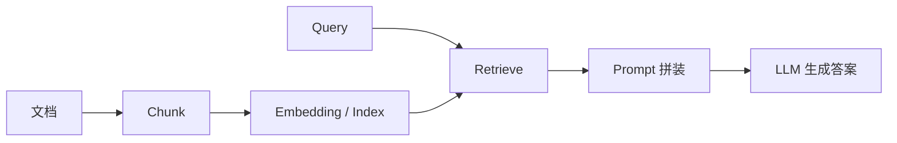
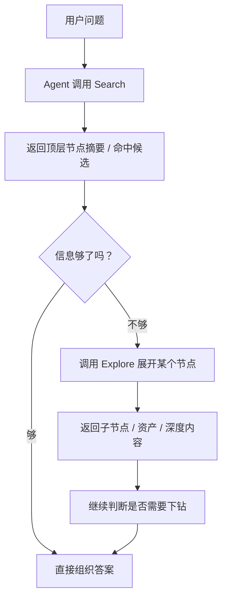
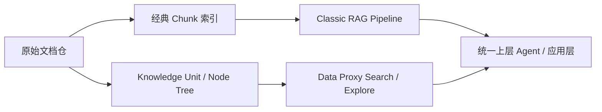

# RAG - 补充课 02b：经典 RAG 之后：Data Proxy、Knowledge Unit 与 Progressive Search

## 学习目标（本节结束后你能做到什么）

1. 你能说清楚为什么很多团队会觉得“传统 RAG 还活着，但原来的那套工程假设正在快速老化”。
2. 你能区分“RAG 没死”和“传统 RAG 中某些模块正在贬值”这两句话的差别。
3. 你能理解为什么在 2026 这种模型能力和长上下文都大幅提升的前提下，知识库系统的价值会从“生成管道”转向“数据代理层”。
4. 你能解释什么是 `Knowledge Unit`、什么是 `Data Proxy`、什么是 `Progressive Search`，以及它们分别在解决什么问题。
5. 你能从工程视角评估：什么时候经典 chunk + retrieve + generate 还够用，什么时候应该开始走向结构化知识单元树和面向 Agent 的标准接口。

## 内容讲解（核心概念，用类比、例子、图示说清楚）

### 1. 先把问题摆正：这篇不是在唱衰 RAG，而是在讨论 RAG 的重心转移

这两年经常能看到一些激进说法，比如：

- `RAG is dead`
- `以后根本不需要检索了`
- `长上下文一来，向量库就要下岗`

这些话如果拿来当流量标题还行，但如果真的据此做系统判断，就很容易走偏。

更准确的说法应该是：

`RAG 没死，但经典 RAG 的很多工程重点，正在发生迁移。`

什么叫迁移？

过去两年，大家做 RAG 时，花了大量精力在下面这些地方：

- prompt engineering
- 回答风格控制
- 回答格式约束
- 多轮对话历史拼装
- query 改写、路由、workflow 编排
- agentic wrapper

这些东西当然不是没价值。  
但它们之所以当时那么重要，很大程度上是因为：

- 模型原生推理还不够稳
- 长上下文还不够长
- 长上下文下的信息提取还不够好
- token 成本还不够低

换句话说，很多“外部脚手架”是在替基座模型补短板。

而当这些短板持续缩小时，外部复杂脚手架的边际价值就会下降，甚至开始反噬系统：

- 增加维护成本
- 限制模型能力发挥
- 固化成脆弱 workflow
- 导致知识库架构越来越难演进

所以这篇文章真正要讨论的问题不是：

`“RAG 还要不要做？”`

而是：

`“在模型足够强的时代，知识库系统到底还应该把工程力气花在哪里？”`

### 2. 先接受两个时代前提：如果这两个前提成立，很多老设计确实会失效

这篇讨论成立，依赖两个技术前提。

#### 2.1 前提一：模型原生智能发生了质变

也就是：

- zero-shot 推理能力更强
- 指令遵循更稳
- 复杂逻辑链规划能力更好
- 面对工具调用和多步任务时，自主性更高

如果这个前提成立，那么很多过去必须由外部流程显式控制的事情，现在模型自己就能做得不错。

比如：

- 问题改写
- 证据摘要
- 信息融合
- 风格适配
- 多轮上下文消歧

这意味着我们没必要像以前那样，在“生成端”搭很多又长又脆的手工脚手架。

#### 2.2 前提二：长上下文不仅更长，而且“更能用”

仅仅上下文窗口大还不够。真正关键的是：

- 中长距离信息提取衰减变小
- “大海捞针”能力达到工程可接受水平
- token 单价持续下降

如果只是“窗口很大，但模型依然读不明白中间部分”，那很多传统 RAG 假设依旧成立。  
但如果是“窗口大，而且真能稳定在里面找对信息”，那知识库系统的很多设计目标就会改变。

这里要特别注意一个边界：

`长上下文能力提升，并不意味着可以把所有资料一股脑塞进去。`

它真正改变的是：

- 以前必须极致压缩上下文
- 现在可以让知识单元保持更完整结构
- 以前必须在外部拼凑答案
- 现在可以把更多探索权直接交给模型

### 3. 为什么说传统 RAG 里的 “Generation” 正在贬值

这部分是整篇讨论的核心切口。

我们先回忆一下经典 RAG：

在很多团队里，后半段被堆了大量工程：

- 回答模板
- 角色设定
- 领域提示词
- 多轮历史拼装
- 文风控制
- 输出格式控制
- 人工路由不同问答链

本质上都是在“生成端”加强约束。

#### 3.1 为什么这些东西过去很有价值

因为过去模型会经常：

- 看不懂上下文
- 不能稳定引用资料
- 容易胡编
- 回答风格飘忽
- 多轮对话容易上下文错乱

于是工程团队被迫在外部补很多逻辑。

#### 3.2 为什么它们现在开始快速贬值

因为模型原生已经更擅长：

- 理解复杂上下文
- 基于证据总结
- 保持风格一致
- 遵循格式约束
- 在长上下文中自我规划

这时，如果你还在外部用一大堆硬编码流程强行接管生成过程，反而会带来两个问题：

1. **限制模型能力**
   - 模型本来能自己做更好的信息整合，但你提前把它塞进固定模板里了。

2. **形成新的技术债**
   - 外部 prompt/workflow 越复杂，越难维护、越难调试、越难迁移。

所以这里的关键观点是：

`未来知识库系统的主战场，不会再是“怎么替模型说话”，而会转向“怎么把高质量知识交给模型自己探索”。`

### 4. Agentic RAG 真的是出路吗？为什么很多时候它只是复杂度转移

这几年另外一个很流行的方向是 Agentic RAG。

典型做法是：

- 先建多个工具
- 再建一个路由 Agent
- 再建一个 planner
- 再建 workflow
- 再让系统自己决定检索、搜索、总结、验证的顺序

听起来很先进。  
但很多工程团队实际做下来会发现：

`复杂度没有消失，只是换了地方。`

#### 4.1 Agentic RAG 容易出现的几个问题

**第一，控制流爆炸。**  
一开始只有三五个节点，后来变成十几个 Agent、几十条边、多个状态机，调试成本直线上升。

**第二，路由规则脆弱。**  
路由逻辑一旦依赖太多人工假设，模型一升级、知识结构一变、业务一扩展，就会开始错配。

**第三，系统重心跑偏。**  
团队把大部分力气花在“这个问题应该先走 A 还是先走 B”，结果忽略了底层知识本身其实仍然是碎片化的。

#### 4.2 它的问题本质是什么

本质上，很多 Agentic RAG 方案还是在试图：

`用越来越复杂的控制流，去弥补底层知识组织方式的不合理。`

也就是说：

- 数据还是碎的
- 结构还是散的
- 文档关系还是弱的
- 但上层拼了很多 Agent 来救场

这就像什么？

像你把仓库货架摆得乱七八糟，却试图通过更聪明的仓库机器人来弥补。  
机器人当然可以更聪明，但真正的工程直觉通常是：

`先把货架和索引体系设计对。`

### 5. 知识库的最终形态，可能不是问答系统，而是 Data Proxy

这是这篇文章最有价值的地方。

如果我们把：

- 过度控制生成
- 过度控制 workflow

这两层执念都放下，那么知识库系统真正剩下的硬价值是什么？

答案是：

`它是一层面向智能体的标准化数据代理（Data Proxy）。`

也就是说，知识库未来不一定非得长成一个带前端 UI 的“问答产品”。  
它更可能长成一个：

- Skill
- MCP Server
- Agent Tool
- 标准 API 层

让外部各种 Agent 都通过它去访问企业异构数据。

它像什么？

你可以把它想成：

- 不是“秘书本人”
- 而是“公司内部资料室的统一馆员接口”

谁来问都行：

- Claude Code
- 通用 Agent
- 企业内部 Copilot
- 自动化流程
- 研发助手

但都不能直接去原始混乱数据里乱翻。  
他们必须通过这个 Data Proxy 来拿资料。

所以这层系统的核心职责变成了：

1. 统一治理异构数据
2. 提供面向 Agent 的可探索接口
3. 让模型在结构化知识上游走，而不是在碎片文本里碰运气

### 6. 从 Chunk 到 Knowledge Unit：为什么未来不该只输出文本碎片

这是第二个核心转变。

经典 RAG 的基本假设是：

`文档 -> 切成 chunk -> chunk 就是检索单元`

但这个假设在复杂 ToB 场景里会很快吃瘪。

原因很简单：  
企业资料并不是“纯连续正文”，而是大量异构复合体：

- 多 Sheet Excel
- 带图表的 PDF
- 带附件的 PPT
- 标题 + 正文 + 表格 + 图例 + 图片共同构成一个业务语义单元

这时如果你还用传统的暴力 chunk：

- 按 500 token 切
- 按 800 token 切
- 加 overlap

你其实是在做一件危险的事：

`主动破坏原始业务结构。`

#### 6.1 为什么传统 chunk 在复杂业务文档上会失真

比如一份重工业排期 Excel：

- Sheet 1：10 个工序明细，每个工序还有配图
- Sheet 2：这批工序对应的全局耗材明细

如果你把它粗暴切成若干文本块，最终得到的是：

- 零碎工序片段
- 零碎物料片段
- 丢失工序和耗材之间原本的业务绑定关系

这时候你就算做知识图谱，也很容易只抽出一些干瘪三元组：

- `(工序) -[消耗]-> (物料)`

但真正重要的信息，比如：

- 批次要求
- 阶梯变化
- 全局耗材约束
- 图例和图表解释

都很容易丢掉。

#### 6.2 Knowledge Unit 在这里的意义

Knowledge Unit 的思路是：

`不要把文档默认拆成固定大小的文本块，而是重建成“业务上天然完整”的知识单元。`

举个例子：

- 那 10 个工序不应该是 10 个孤立碎片
- 它们应该构成一个父级知识单元
- Sheet 2 的耗材图表作为附件资源挂载在这个单元下

这样，当模型命中这个知识单元时，拿到的不是若干残缺 chunk，而是：

- 一个主题完整的父节点
- 其下关联的子节点
- 以及附件、图表、表格等资产

这里最关键的一句话是：

`结构本身就是知识。`

传统 RAG 往往默认“文本内容才是知识”，  
而这套思路强调：

`标题、层级、表格关系、附件归属、跨 sheet 绑定，本身都属于知识的一部分。`

### 7. Data Proxy 的第一大核心：异构数据治理

如果说过去的 RAG 工程核心是：

- 切块
- 向量化
- 检索

那么面向未来的知识代理层，第一大核心会变成：

`异构数据治理。`

#### 7.1 为什么异构数据治理是新的护城河

因为未来基座模型会越来越强，  
而“企业内部数据到底组织得有多好”，依然是最难复制、最脏、最耗人工的部分。

同样一个模型，谁家知识库更强，往往不取决于模型调用 SDK 写得多漂亮，而取决于：

- 解析得好不好
- 结构保留得好不好
- 元数据建模有没有业务意识
- 多模态附件有没有挂对
- 更新链路有没有治理好

#### 7.2 它和“清洗文本”有什么本质区别

传统数据清洗更像是在做：

- 去页眉页脚
- 去噪声
- 去乱码

异构数据治理则更进一步，是在做：

- 结构重建
- 语义归类
- 资产挂载
- 节点关系抽象
- 可探索接口生成

也就是说，目标不再是“得到一段干净文本”，而是“得到一个可被模型系统性探索的知识空间”。

### 8. 为什么知识图谱不是天然答案：E-R 三元组太瘦了

很多人一看到“保留结构”，第一反应就是：

`那不就是知识图谱吗？`

不完全是。

传统知识图谱最常见的是 E-R 三元组：

- 实体
- 关系
- 实体

它非常适合表示：

- 人和组织关系
- 商品和类目关系
- 论文和作者关系

但在复杂业务文档里，它常常太“瘦”。

为什么？

因为很多知识不是简单的实体关系，而是：

- 一个层级块中的上下文
- 一组表格 + 附件 + 注释共同表达的业务约束
- 一个父主题下的若干子主题和资源集合

这些内容如果强行压缩成三元组，很容易丢掉大量隐式信息。

所以这篇文章的思路不是否定图谱，而是在提醒：

`如果你的数据本来是高度结构化文档，先别急着把它抽瘦成三元组。`

有时更好的做法是：

- 先保留层级结构
- 保留附件和资产引用
- 在必要位置上叠加轻量关系边

换句话说，你可能需要的不是“纯 KG”，而是：

`树为主、图为辅的结构化知识单元系统。`

### 9. Progressive Search：为什么不是“能塞多长就塞多长”

接下来是第三个关键概念：渐进式搜索。

如果你已经把文档治理成了节点树，接下来最大的问题就是：

`怎么把这些知识交给模型？`

最暴力的办法当然是：

- 直接把所有相关节点全塞给模型

但这会立刻遇到两个问题：

1. **信噪比下降**  
   你带进去的不是只有相关内容，还有大量暂时无关的内容。

2. **成本和并发压力上升**  
   ToB 场景里一旦查询量高起来，长上下文下的 token 消耗很快就会成为现实成本。

所以更优雅的方案不是“全给”，而是：

`渐进式披露（Progressive Disclosure）`

也就是：

- 先给概览
- 再按需展开
- 模型自己决定要不要继续往下钻

### 10. Search + Explore：把知识库做成给模型游走的文件系统

这套思路最精炼的 API 设计可以抽象成两类操作：

#### 10.1 Search：全局定位

Search 不负责把所有细节都拿回来，  
它更像是：

- 给你顶层节点
- 给你摘要
- 给你宏观结构
- 告诉你“知识大概在哪”

#### 10.2 Explore：局部下钻

Explore 则更像：

- 展开某个节点
- 读取子节点
- 拉取附件
- 获取局部更完整的细节

也就是说：

- Search 负责广度定位
- Explore 负责深度展开

这很像一个文件系统：

- 先 `ls` 看目录
- 再 `cd` 进某个子目录
- 再 `cat` 某个文件

模型真正拿到的就不再是一次性拼好的全部资料，而是一个可以游走、可以探索的知识空间。

这里真正大的变化不是 API 形式，而是：

`知识探索权被交回给模型，而不是由外部 workflow 预先写死。`

### 11. 这套思路和传统 RAG 的本质区别：不是在碎片里找答案，而是在结构里找知识

这句话值得单独拎出来讲。

传统 RAG 的基本假设是：

`只要我召回了足够多的相关碎片，模型就能把答案拼出来。`

而这里的新假设是：

`如果我保留了原始知识结构，模型就能像人类专家一样循着结构去获取知识。`

这两种假设差别非常大。

#### 11.1 传统 RAG 的工作方式

- 文档切碎
- 从碎片里向量匹配
- 命中若干片段
- 拼成 prompt
- 让模型整合

#### 11.2 新方案的工作方式

- 文档重构成知识单元树
- 先拿概览
- 再下钻特定分支
- 逐步展开相关内容
- 模型在结构中探索并决策

这意味着：

- 前者更像在碎纸堆里找证据
- 后者更像在带目录的手册里查知识

它们不是“同一条路换个名字”，而是底层知识组织方式变了。

### 12. 这套架构真正的工程 Trade-off：不是没有代价，而是代价更靠近本质

如果只讲优点，这种方案会显得太理想主义。  
从工程上看，它当然也有代价。

#### 12.1 延迟会更高

渐进式搜索意味着一个问题可能不是一次请求完成，而是：

- Search
- Explore
- 继续 Explore
- 最后 Generate

交互链变长，自然增加端到端延迟。

但为什么它依然可能值得？

因为在很多 ToB 场景里，用户真正不能接受的不是“慢 1 秒”，而是：

- 答错
- 编造
- 漏掉关键约束

如果用多一步探索，能显著提升复杂知识问答的可靠性，那么这个 trade-off 是合理的。

#### 12.2 数据建模成本更高

传统 chunk 的入门门槛很低：

- 解析文本
- 切块
- embedding

而 Knowledge Unit / Data Proxy 的门槛更高：

- 需要更强解析能力
- 需要结构抽象
- 需要节点和资产建模
- 需要标准接口定义

但这部分成本有一个巨大好处：

`它更可复用。`

因为你一旦把知识空间治理好了，不只是一个问答机器人能用，任何 Agent 都能复用这层代理。

#### 12.3 架构复杂度转移到数据层

这其实是这篇文章最强的工程判断：

`与其把复杂度堆在 workflow 上，不如把复杂度前移到数据治理层。`

为什么这往往更正确？

因为：

- 数据治理更稳定
- 结构设计的寿命往往比 prompt 和 workflow 更长
- 模型升级时，数据层资产通常可持续复用

### 13. 树形拓扑还不够：跨文档关联会逼你走向轻量图结构

这里是这篇讨论里最重要的开放问题之一。

如果知识空间只是单文档内部结构，树形已经很好用：

- 标题
- 子标题
- 段落
- 附件

但企业知识不是孤岛。  
真实世界里经常会出现：

- 一份制度约束多份 SOP
- 一份配置规范影响多个服务文档
- 一份术语词典被多个系统共享引用

这时就会出现跨文档关系。

#### 13.1 为什么纯树会遇到瓶颈

树擅长表达：

- 父子层级
- 章节嵌套
- 局部展开

但它不擅长表达：

- 横向约束
- 跨文档引用
- 多源合流

比如：

`《安全生产规范》 -> 约束 -> 多个独立 SOP`

这个关系更像图，而不是树。

#### 13.2 为什么又不能轻易退化成“全量知识图谱”

因为全图谱化的代价也很大：

- 关系抽取成本高
- 维护复杂
- 解释困难
- 很容易过度建模

所以更务实的方向往往是：

`树为主体，必要时补轻量 DAG / 图边。`

也就是说：

- 日常探索仍然以树形知识单元为主
- 当确实存在跨文档强关系时，再显式补边

这条路线比一上来全面图谱化更像现实可落地方案。

### 14. 这个话题和你刚刚学过的 chunk 有什么直接关系

这其实是同一条线的延伸。

上一课我们讲的是：

- chunk 有局限
- chunk 本质上在做检索单元设计

而这一课其实是在问一个更进一步的问题：

`如果 chunk 本身就是一种受限的检索单元，我们能不能换一种更接近业务结构的知识单元？`

所以这两节不是断开的：

- `02` 解决的是：经典 RAG 里的 chunk 怎么做得更好
- `02b` 讨论的是：如果你已经把 chunk 做到头了，下一代知识库该往哪里走

这也是为什么这篇很适合放在 chunk 课后面，而不是等到最后才讲。

### 15. 什么时候你应该继续用传统 RAG，而不是着急走 Data Proxy

这里必须落回现实。

虽然上面的方向很值得关注，但并不代表所有团队现在都该立刻重构知识库。

如果你的场景满足以下条件，经典 RAG 依然是非常好的方案：

- 文档以连续正文为主
- 数据源结构不复杂
- 业务问题相对直接
- 对跨文档关系要求不高
- 上线速度比长期演进更重要

比如：

- 企业 FAQ
- 产品帮助文档
- 内部制度问答
- SDK 文档问答

这些场景里，把 chunk、metadata、混合检索、rerank 和 prompt 做扎实，通常已经够用了。

### 16. 什么时候你应该开始考虑 Knowledge Unit / Data Proxy

反过来，如果你遇到这些信号，就说明传统 chunk RAG 可能已经开始碰天花板了：

#### 16.1 文档是明显异构复合体

比如：

- Excel + 图表 + 多 Sheet
- PDF + 表格 + 图片 + 批注
- PPT + 附件 + 讲解文字

#### 16.2 你发现“结构丢失”比“检索不准”更痛

也就是：

- 命中了，但答案还是不完整
- 命中了，但表格和正文关系丢了
- 命中了，但附件上下文不在

#### 16.3 你的调用方不再只是问答 UI

一旦未来调用方包括：

- 代码助手
- 工单 Agent
- 业务 Copilot
- 自动化工作流

你就会很自然地需要一层标准化的数据代理，而不是一个绑死前端页面的问答系统。

#### 16.4 你已经开始写大量 workflow 来弥补底层知识组织问题

这时很可能说明：

`系统问题不在“路由不够复杂”，而在“知识组织方式不够好”。`

### 17. 如果你今天就要做架构升级，应该怎么渐进推进

这条路线不适合 Big Bang 重构，更适合渐进式演化。

#### 第一阶段：把 chunk 做到极致

- 文档分类
- 结构化切分
- metadata 完整建模
- Parent-Child
- 评估体系

先确认自己不是“经典 RAG 还没做扎实，就急着追新概念”。

#### 第二阶段：引入知识单元概念

- 对特定高价值文档类型先试点
- 例如复杂 PDF、Excel、规范手册
- 把 chunk 升级成结构化知识单元

#### 第三阶段：提供 Search / Explore 接口

- 不再只暴露“query -> answer”
- 开始暴露“query -> node candidates -> node expansion”

#### 第四阶段：升级为 Agent 通用数据代理

- 用 Skill / MCP Server / Tool API 包装
- 让更多上层 Agent 复用

这样推进的好处是：

- 每一步都能单独验证价值
- 不用一次性全盘推翻
- 可以在现有 RAG 系统上逐层演进

### 17.5 如果真的要把它做成系统，Data Proxy 的接口不该长什么样

讲到这里，我们已经有了方向：

- 不再只暴露一个“问答接口”
- 而是暴露一组面向模型探索的知识访问接口

但工程上真正难的不是喊出 `Search + Explore`，而是：

`接口到底该返回什么粒度的信息，才能既适合模型调用，又不把系统自己拖垮？`

这里给一个更像工程系统而不是 PPT 的接口分层。

#### 17.5.1 最小接口集合

一个最小可用的 Data Proxy，我认为至少需要下面四类能力：

1. `Search`
   - 输入：查询、作用域、过滤条件
   - 输出：候选知识节点的摘要、分数、节点类型、可展开标记

2. `Explore`
   - 输入：节点 id、展开深度、是否包含附件元数据
   - 输出：子节点列表、局部正文、关联资产索引、关系边

3. `FetchAsset`
   - 输入：asset id
   - 输出：具体附件内容或可消费表示
   - 例如：图片 OCR 结果、表格 markdown、原始文件链接、结构化解析 JSON

4. `ExplainNode`
   - 输入：节点 id
   - 输出：这个节点为什么存在、它来自哪个原始文档、它与哪些父子节点或跨文档边相关

最后这个 `ExplainNode` 很容易被忽略，但我很建议加上。  
原因很简单：

`未来知识库系统不是只要能查到，还要能解释“为什么查到的是它”。`

否则一旦线上效果变差，你调试时就会极其痛苦：

- 命中了哪个节点？
- 这个节点是怎么生成的？
- 为什么它不是叶子节点而是父节点？
- 为什么它会挂这个附件？

如果这些问题只能靠读数据库表来猜，那这个系统很快就会变成黑箱。

#### 17.5.2 Search 不该返回完整正文，而应该返回“可决策摘要”

这是个很关键的设计点。

很多人第一次做这种接口时，会忍不住让 `Search` 直接返回：

- 大段正文
- 大量原文内容
- 一堆相关片段

但这样做的问题是，`Search` 就退化回了传统 retrieval。

更合理的做法是让 `Search` 返回：

- 节点标题
- 节点摘要
- 节点类型
- 命中原因
- 相关性分数
- 是否可展开
- 该节点下面大概还有什么

也就是说，它应该足够让模型做出“要不要继续钻下去”的决策，但不要一上来就把细节全喂满。

你可以把它理解成：

- `Search` 返回的是目录卡片
- `Explore` 返回的是目录下面的内容
- `FetchAsset` 返回的是目录里的附件本体

这个分层的价值在于：

- 节省 token
- 提高信噪比
- 给模型保留探索空间
- 给系统保留缓存与权限控制空间

### 17.6 这类系统最容易踩的工程坑，以及更稳的解法

这部分非常重要。  
因为很多“新架构”不是死在理念上，而是死在工程上。

下面这些坑，我建议你把它们当成 checklist 看。

#### 17.6.1 坑一：节点建得太细，Explore 次数爆炸

一种很常见的误区是：

- 为了保留结构
- 于是把每个小标题、每一行表格、每张图片都做成独立节点

这样做在建模上看起来很精致，但运行时会直接出问题：

- 一个问题要连续 Explore 很多次
- 端到端延迟上升
- 调用链变长
- 失败点变多

更稳的做法是：

`节点粒度优先服务“可回答性”，不是优先服务“结构完整主义”。`

也就是说，一个节点至少应该满足：

- 它能表达一个相对完整的业务子主题
- 它足够小，不至于把无关信息带太多
- 它又足够大，不至于每问一句都要连跳五层

如果一个节点展开后，模型大概率还是看不明白，那它可能太大。  
如果一个节点展开后，模型还必须立刻再点三层才能回答问题，那它可能太小。

#### 17.6.2 坑二：节点摘要写得像目录，不像“决策依据”

Search 阶段返回摘要时，很多团队会偷懒，只返回：

- 标题
- 章节名
- 页面号

结果模型虽然“看到了结构”，却无法判断值不值得展开。

更合理的摘要应该至少包含：

- 该节点讲的核心内容
- 该节点适合回答哪类问题
- 子节点范围
- 是否包含附件/图表/表格

这其实和搜索系统里的 snippet 很像。  
你不是要把正文都给出来，而是要给足决策信号。

#### 17.6.3 坑三：把所有附件都一股脑挂上去，结果上下文又炸了

Data Proxy 的一个很诱人的点是可以把：

- 图片
- 表格
- PDF 附件
- 图表
- 原始 Excel

全部挂到节点下面。

但这不意味着每次都要把它们全部展开给模型。

一个更稳的资产策略应该是：

- `Search` 只告诉模型这个节点“有附件”
- `Explore` 返回附件索引和摘要
- 只有模型明确需要时，再 `FetchAsset`

这点非常像对象存储：

- 你先拿 metadata
- 真要下载再拿 blob

如果一上来就把所有附件内容都塞上下文，最后你只是把“长上下文时代的暴力全塞”换了个包装而已。

#### 17.6.4 坑四：权限模型只做在文档层，没有做到节点层

这是 ToB 场景里非常现实的问题。

很多企业文档不是“整份文档都能看”或“整份都不能看”，而是：

- 某几页敏感
- 某张表敏感
- 某个附件敏感
- 某个小节只允许特定岗位查看

如果你的 Data Proxy 只在“原始文件”粒度做权限，而 Knowledge Unit 已经被拆成节点和资产，那么你最终一定会出事故：

- Search 命中了一个不该命中的摘要
- Explore 展开了一个不该展开的节点
- FetchAsset 拉到了不该给模型的附件

所以权限控制至少要考虑三层：

1. 文档级权限
2. 节点级权限
3. 资产级权限

并且权限判断应尽量前置到：

- Search 前过滤
- Explore 前过滤
- FetchAsset 前二次校验

不要想着“先拿出来再让模型别说”。  
那已经晚了。

#### 17.6.5 坑五：跨文档补边太激进，最后谁都不敢维护

前面我们提到树不够，需要轻量图边。  
但工程上另一个极端是：

- 给所有文档都疯狂补关系
- 想一步到位搞成“企业知识图谱宇宙”

结果就是：

- 抽边规则复杂
- 人工审核压力大
- 关系噪声很多
- 谁都不敢改

更稳的原则是：

`只补高价值、高稳定性的边。`

例如：

- 规范 -> 约束 -> SOP
- 指南 -> 依赖 -> 附件模板
- 概念词典 -> 被引用于 -> 多个文档

而不是“只要可能有关就补边”。

图边一旦太多，模型探索成本也会上升。  
它会从“可导航知识空间”退化成“复杂迷宫”。

### 17.7 迁移到这类架构时，最现实的双轨模式是什么

很多团队真正落地时不会从零重做，而是旧 RAG 系统已经在线。

这时最现实的方式往往不是替换，而是双轨并行。

这种双轨的意义是：

- 简单问题继续走经典 RAG
- 复杂结构问题走 Data Proxy
- 老系统不需要一次性下线
- 可以逐文档类型迁移

我很建议把迁移优先级按文档类型定，而不是按系统模块定。

例如：

- FAQ、普通制度、产品帮助文档：继续 classic RAG
- 复杂 PDF、规范手册、多 Sheet Excel：优先迁到 Knowledge Unit

这样收益会更明显，也更容易向业务解释为什么要做架构升级。

### 17.8 这套架构该怎么评估，不然很容易又陷入“感觉更先进”

所有新架构最后都得回到评估。

如果没有评估，你很容易陷入一种幻觉：

- 概念更先进
- 图画得更好看
- 术语更多
- 但真实效果未必更好

对于这种“经典 RAG -> Data Proxy”升级，我建议至少看四类指标。

#### 17.8.1 正确性指标

- 复杂问题回答完整率
- 关键约束遗漏率
- 表格/附件信息引用正确率
- 跨文档关联问题回答正确率

这类指标是最核心的。  
因为新架构如果不能把复杂问题答得更完整，那就没有迁移价值。

#### 17.8.2 探索效率指标

- 平均 Search 次数
- 平均 Explore 次数
- 每次问答平均展开节点数
- 每次问答平均拉取资产数

这组指标能告诉你：

- 节点是不是太碎
- 摘要是不是不够好
- 模型是不是在知识空间里“迷路”

#### 17.8.3 成本指标

- 每次问答 token 成本
- 每次问答后端 API 调用成本
- 热点节点缓存命中率
- 平均上下文长度

很多人容易只看模型 token，忽略后端代理层自己的调用成本。  
但如果 Search/Explore/FetchAsset 都很多次，后端成本也会上升。

#### 17.8.4 可运维指标

- 节点解析失败率
- 节点摘要生成失败率
- 资产挂载失败率
- 权限拒绝率
- 结构更新延迟

因为一旦这套系统上线，难点不再只是问答，而是：

`文档进来之后，能不能稳定、可解释地被治理成知识空间。`

### 17.9 最后把这篇观点压成一句真正有判断力的话

如果要把整篇文章的工程判断压成一句话，我会这样说：

`未来知识库系统的竞争力，不在于谁能把碎片召回得更花，而在于谁能把企业知识组织成可被模型稳定探索的结构化空间。`

这句话背后其实包含三层转向：

- 从生成端脚手架，转向数据层治理
- 从固定 chunk，转向结构化 Knowledge Unit
- 从一次性塞上下文，转向 Progressive Search

如果你把这个判断建立起来，这节课就值了。

### 18. 这一课真正要建立的底层意识

这节最重要的，不是记住几个新名词，而是建立下面几个判断。

#### 18.1 RAG 的价值正在从“生成脚手架”回到“数据基建”

未来知识库真正稀缺的不是多花哨的 prompt，而是：

- 谁把知识治理得更结构化
- 谁把异构数据抽象得更像机器可探索空间

#### 18.2 复杂 workflow 不一定是进步，也可能是底层设计欠账

很多时候不是系统需要更多 Agent，而是数据层需要更好结构。

#### 18.3 chunk 不是终点，而只是第一代检索单元

Knowledge Unit 可以看作 chunk 的下一阶段演化：

- 更保留结构
- 更保留上下文
- 更适合 Agent 探索

#### 18.4 Data Proxy 可能是知识库系统的最终稳定形态

因为它的价值不依赖某个具体 UI，不依赖某个具体问答链，而是提供了一层长期可复用的数据访问标准面。

## 小结（5 条关键点）

- RAG 没死，真正正在贬值的是传统 RAG 里大量堆在生成端和控制流上的外部脚手架。
- 在模型原生智能增强、长上下文更可用、token 成本下降的前提下，知识库系统的重心会从“怎么让模型说得更像样”转向“怎么把知识组织得更像机器可探索空间”。
- 经典 chunk 适合连续正文场景，但在异构复杂文档里，经常会破坏结构；Knowledge Unit 的目标是保留业务上天然完整的知识单元。
- Progressive Search 的核心不是一次性把所有资料塞给模型，而是通过 Search + Explore 把探索权交给模型，让它按需下钻。
- 真正长期有护城河的，往往不是 prompt 和 workflow，而是异构数据治理、结构化知识单元设计和标准化数据代理接口。

## 检查站：请回答以下问题

1. 为什么说“RAG 没死”和“传统 RAG 中的 G 正在贬值”并不矛盾？
2. Agentic RAG 为什么看起来更智能，但在工程上可能只是复杂度转移？
3. 什么叫 `Knowledge Unit`？它和我们上一课讲的 `chunk` 有什么本质区别？
4. `Progressive Search` 为什么不只是“多查几次”，而是一种不同的知识交付方式？
5. 如果你的知识库主要处理复杂 Excel、带表格的 PDF 和跨文档规范引用，你为什么可能需要从经典 RAG 走向 Data Proxy？
