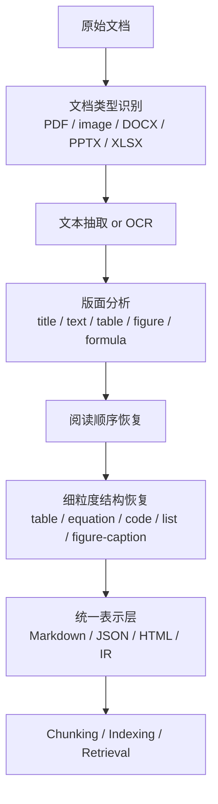

# RAG - 第 3 课：文档解析：PDF / 表格 / 图文 / 版面与多模态输入

## 学习目标（本节结束后你能做到什么）

1. 你能解释为什么`文档解析不是预处理细节，而是 RAG 数据层的地基`。
2. 你能区分数字原生 PDF、扫描件 PDF、图文混排报告、学术论文、Office 文档在解析上的根本差异。
3. 你能把文档解析栈拆成：`文本抽取 -> OCR -> 版面分析 -> 阅读顺序 -> 表格/公式/图像理解 -> 统一表示` 六层来讲。
4. 你能说清 `PyMuPDF4LLM`、`Unstructured`、`GROBID`、`Nougat`、`Docling`、`MinerU` 分别强在哪、弱在哪、适合放在什么场景。
5. 你能讲出 2024 → 2025 → 2026 的最新演化：为什么行业从 rule-based / OCR-first，走向 layout-aware、toolbox 化，再走向 VLM 与 hybrid parser 并存。
6. 面试里如果被问“为什么你们的 RAG 检索不准”，你能先想到可能不是 embedding 或 rerank 的锅，而是文档根本没被正确解析出来。

---

## 1. 先把问题摆正：很多 RAG 失败，不是检索没找对，而是文档一开始就没被“读对”

很多团队第一次做 RAG，会把文档处理理解成：

1. PDF 读成文本
2. 文本切块
3. 做 embedding
4. 检索

这条链路看起来很自然，但真正的问题是：

`PDF 从来就不是“天然可读的文本文件”。`

它更像一种`排版结果格式`，而不是知识表示格式。

这意味着：

- 你在屏幕上看到的“标题、段落、表格、页眉、脚注、双栏顺序”，不一定在文件里以同样方式存在；
- 对解析器来说，很多视觉上显而易见的结构，其实要重新推断；
- 一旦推断错了，后面所有环节都会跟着错。

典型事故包括：

- 表格被打平成一列文本，数值列和字段名错位；
- 双栏论文被按左上到右下线性串起来，阅读顺序崩掉；
- 页眉页脚反复混进正文，chunk 被“污染”；
- 公式没转成 LaTeX，只剩乱码或图片占位符；
- 图片里的关键信息完全丢失；
- 扫描件 OCR 把专有名词识别错，后面 BM25 和 dense retrieval 一起失灵。

所以文档解析这一层真正决定的是：

`知识库里到底存进去的是“文档的知识”，还是“文档残骸”。`

如果你把残骸喂给后面的 chunk、embedding、retriever，  
后面做得再精，也是在垃圾输入上精加工。

> 面试 takeaway：如果面试官说“你们 RAG 检索不准，先调什么”，成熟回答不该只盯着 topK、embedding、rerank，也应该先反问：数据进入索引前是不是已经把文档结构读坏了？

---

## 2. 文档解析到底在解决什么：不是“抽文本”，而是“重建文档结构”

### 2.1 PDF 最难的地方，不是字符本身，而是结构缺失

对于一个后端工程师来说，最容易建立的错误直觉是：

`PDF 不就是文本 + 图片吗？`

实际上不是。

同一页 PDF，在文件内部可能更接近：

- 一堆字符对象
- 一堆坐标
- 若干字体、字号、加粗斜体信息
- 几张图片
- 若干绘图指令

但是没有显式告诉你：

- 哪一段是标题
- 哪一段是表格单元格
- 两栏应该先读左边再读右边
- 某个脚注属于正文哪一处
- 某张图和图注是否绑定

所以解析的本质不是“把文本读出来”，而是：

`从排版痕迹里反推出语义结构。`

### 2.2 文档解析是一个多任务问题，不是单任务问题

如果把一份复杂 PDF 拆开来看，它同时包含多种子任务：

1. `可提取文本检测`
   - 这是 born-digital PDF，还是扫描图像 PDF？

2. `OCR`
   - 图像里的字是什么？

3. `版面分析`
   - 页面里有哪些 block？标题、正文、表格、图片、公式、页眉、页脚？

4. `阅读顺序恢复`
   - 这些 block 应该以什么顺序组织？

5. `细粒度结构恢复`
   - 表格行列关系、公式的 LaTeX、列表层级、代码块边界、图文绑定

6. `统一表示`
   - 最终要不要输出 Markdown？JSON？HTML？坐标化结构树？中间 IR？

这就是为什么文档解析栈很少能靠“一个函数”解决。

---

## 3. 先把输入分型：不同文档不是难度不同，而是问题类型不同

### 3.1 数字原生 PDF（born-digital PDF）

特点：

- 文本可以直接提取
- 字体、字号、坐标通常可用
- 但结构仍然未必显式

风险：

- 双栏顺序错
- 表格被打散
- 页眉页脚混入

适合路线：

- text extraction + layout-aware reconstruction

### 3.2 扫描件 / 传真件 / 拍照件

特点：

- 本质上是图像
- 文本必须 OCR
- 还常伴随噪声、阴影、倾斜、透视变形

风险：

- OCR 错字
- 段落边界和表格边界丢失
- 复杂布局完全崩

适合路线：

- OCR + layout analysis
- 或 VLM-based page understanding

### 3.3 学术论文

特点：

- 双栏
- 公式密集
- 表格复杂
- 引文、参考文献、图注结构强

风险：

- 阅读顺序错
- 公式无法保真
- 参考文献结构化失败

适合路线：

- GROBID / Nougat / Docling / MinerU 这类更强的学术或复杂文档栈

### 3.4 企业报告 / 财报 / 手册

特点：

- 图文混排
- 多级标题
- 大量表格
- 页眉页脚固定模板多

风险：

- 表格理解错位
- 图注关系丢失
- 章节树没恢复出来

适合路线：

- layout-aware parser + table/formula aware pipeline

### 3.5 Office 文档（DOCX / PPTX / XLSX）

这一类最大的误区是：

`都转成 PDF 再解析。`

这在 2023 年还是常见做法，但到 2025-2026 越来越不推荐。

因为 Office 文档天然带结构：

- 标题层级
- 表格对象
- 幻灯片文本框
- 单元格关系

先转 PDF，再去从排版里猜结构，基本是在主动丢信息。

这也是为什么 2026 年的 Docling、MinerU 都在强调原生支持多格式，而不只是 PDF。

---

## 4. 一个成熟的文档解析栈，应该怎么分层理解

最稳的理解方式，是把它看成六层。



这张图特别重要，因为它解释了一个工程现实：

`文档解析不是一个模型，而是一条 pipeline。`

后面我们看各种工具，本质上都在这些层里做不同组合。

---

## 5. 原理：为什么“阅读顺序”和“结构保真”比“抽到更多字”更重要

### 5.1 文本抽到了，不代表知识就保住了

很多团队会用一个很危险的指标评估解析：

- “文本看起来差不多都抽出来了”

这个指标非常不够。

因为对 RAG 来说，以下错误比漏几个字更致命：

- 顺序错
- 表格结构错
- 标题层级错
- 图片与图注脱钩
- 跨页内容没拼上

比如财报里：

| 年份 | 收入 | 利润 |
| --- | --- | --- |
| 2024 | 10 亿 | 1 亿 |
| 2025 | 11 亿 | 0.6 亿 |

如果被打平成：

`年份 收入 利润 2024 10 亿 2025 11 亿 1 亿 0.6 亿`

字几乎都还在，但语义已经坏掉了。

### 5.2 解析层真正影响的是“后续可检索性”

检索依赖的是：

- query 和 chunk 语义是否对齐
- chunk 内部结构是否保持完整

如果解析已经把：

- 一行表格拆裂
- 双栏正文交错
- 标题和正文分开

那后续 embedding 再强也无法“恢复原文档结构”。

所以文档解析最重要的目标不是 OCR accuracy 的最大化，而是：

`让后续索引和检索拿到正确的结构化知识单元。`

---

## 6. 2024 → 2025 → 2026 的主线：从规则和 OCR，到 layout-aware，到 VLM / hybrid parser

### 6.1 2024：toolbox 化和模块化开始成熟

2024 年一个非常明显的变化，是大家不再把 PDF 解析看成：

- OCR 一个模型搞定

而是明确拆成：

- layout detection
- formula detection / recognition
- OCR
- table recognition
- reading order

这一思路在 `PDF-Extract-Kit` 里体现得非常清楚。  
官方 repo 直接把 PDF 解析拆成：

- Layout Detection
- Formula Detection
- Formula Recognition
- OCR
- Table Recognition

这说明到 2024 年，业界已经普遍接受一个事实：

`复杂文档解析不是单模型任务，而是多模块协同任务。`

### 6.2 2025：VLM parser 从“演示效果惊艳”走向“可接进工程”

2025 年的重要变化是：

- `GraniteDocling` 这类紧凑型文档 VLM 开始作为产品化组件集成进 Docling
- `MinerU2.5` 这类复杂文档解析模型开始强调生产可用性，而不是只秀 benchmark

Hugging Face 上的 `granite-docling-258M` 模型卡写得很明确：

- 它是为高效 document conversion 设计的 multimodal image-text-to-text 模型
- 完整集成到 Docling pipeline
- 支持 full-page inference 和 bbox-guided region inference
- 在公式识别、inline math 和文档元素 QA 上做了增强

这里最重要的信号不是“VLM 很强”，而是：

`VLM 开始从独立模型，变成解析系统里的一个可替换 stage。`

### 6.3 2026：hybrid parser 成为主流工程路线，而不是“全 VLM 一把梭”

到 2026 年，最新趋势并不是所有人都改成 end-to-end VLM。

恰恰相反，更成熟的方向是：

`根据文档类型和资源约束，在 OCR / detector / text extraction / VLM 之间做混合编排。`

MinerU 在 2026 年 4 月 18 日发布的 `3.1.0` 官方 changelog 很能说明这个趋势：

- 主 VLM 升级到 `MinerU2.5-Pro-2604-1.2B`
- 同时继续保留 `pipeline`、`vlm-engine`、`hybrid-engine`
- 并明确区分：
  - `pipeline`: 快、稳定、低幻觉、CPU/GPU 都能跑
  - `vlm-engine`: 高精度
  - `hybrid-engine`: 高精度 + native text extraction + 低幻觉

这是一条非常成熟的工程路线。  
它说明 2026 年最先进的系统并不相信“一个范式统一所有文档”，而是：

`让不同解析范式按场景协同。`

### 6.4 2026：benchmark 开始强调“现实世界鲁棒性”，而不只是数字 PDF

OmniDocBench 官方 repo 在 2026 年 4 月 10 日把 benchmark 更新到 `v1.6`：

- 扩展到了 1651 页
- 覆盖 10 种文档类型、5 种布局类型、5 种语言类型
- 同时支持端到端、布局、表格、公式、OCR 等多维评测

更关键的是，2026 年 3 月的 `Real5-OmniDocBench` 又往前推了一步：

- 不是只测数字文档
- 而是把整个 OmniDocBench v1.5 做了物理世界重建
- 覆盖 Scanning、Warping、Screen-Photography、Illumination、Skew 五类现实扰动

这件事的意义非常大。  
它说明 2026 年大家开始正视一个现实：

`在数字 PDF 上近乎完美，不等于在真实扫描、拍照、歪斜、光照变化下也好用。`

---

## 7. 六个核心工具，应该怎么放到同一张地图里理解

这一节是整篇最重要的“工具定位图”。

### 7.1 PyMuPDF4LLM：轻量、快、本地、对 born-digital 文档很实用

PyMuPDF4LLM 官方 repo把自己定义得很清楚：

- 一行代码把文档转成 LLM-ready Markdown / JSON / text
- 基于 MuPDF C engine
- 处理 multi-column、tables、headers、scanned pages with automatic OCR
- 重建自然阅读顺序

它的长处：

- 很轻量
- 无需 GPU
- 对数字原生 PDF 非常实用
- 直接面向 RAG 输出 Markdown / JSON
- 本地运行、部署门槛低

它特别适合：

- 内部文档库快速接入
- 大量 born-digital PDF
- 你更在意吞吐和简洁，而不是复杂文档极限精度

它的局限：

- 对非常复杂的扫描件、公式密集学术文档、复杂财报，不会是极限质量路线
- 本质上仍然偏 layout-aware extraction，不是最强的 end-to-end 文档理解器

一句话定位：

`如果你的 PDF 质量不错、主要目标是高性价比地喂 RAG，PyMuPDF4LLM 是很强的起点。`

### 7.2 Unstructured：更像“文档接入编排层”，不是单点解析 SOTA

Unstructured 的价值，不在于它单独某个 PDF parser 最强，而在于：

`它把多种 partition 策略统一成一个 ingest 抽象。`

官方 docs 对 PDF 的 `strategy` 写得很明确：

- `auto`
- `hi_res`
- `ocr_only`
- `fast`

而且有很重要的工程细节：

- `auto` 会根据文档可提取文本情况自动切换
- `hi_res` 使用 `detectron2_onnx` 做 layout 识别
- `ocr_only` 用 Tesseract OCR
- `fast` 用 `pdfminer` 直接抽文本

官方文档还特别提醒了一点：

- `hi_res` 当前在多栏文档的元素顺序上有困难
- 多栏且不可直接提取文本时，反而推荐 `ocr_only`

这说明 Unstructured 的工程哲学非常现实：

`不是追求单一路线最强，而是提供一套可配置、可回退、可切策略的 ingestion 框架。`

它特别适合：

- 文档来源复杂
- 想先统一接入
- 希望文件类型和下游 chunk / embedding / clean / stage 可以走一套管线

但如果你要追求复杂 PDF 极限质量，它通常更像“编排层”，而不是最终解析精度天花板。

### 7.3 GROBID：科学文献领域的老牌强者，重点不是 Markdown，而是结构化 TEI

GROBID 这类系统非常值得后端工程师学习，因为它代表了另一条路线：

`不是先变 Markdown，而是先变成结构化学术 XML / TEI。`

GROBID 官方文档有两句话非常关键：

- 它把文档解析建模成`cascade of sequence labeling models`
- 它处理的不是 plain text，而是 `layout tokens`

所谓 layout tokens，包括：

- Unicode token
- 字号、字体、粗斜体等 rich text 信息
- bounding boxes
- 线、块、列等布局分组信息

这条路线的优点非常明显：

- 对论文头信息、作者、机构、参考文献、章节结构非常强
- 学术 PDF ingestion 很成熟
- 输出 TEI，适合后续 text mining、citation parsing、metadata extraction

官方文档还明确强调：

- 默认配置仍然偏向 CRF，是为了在 commodity hardware 上保持速度和可扩展性
- 如果优先追求精度，也支持更慢的 deep learning 设置

它特别适合：

- 学术论文知识库
- 文献计量 / 引文解析
- 需要高质量元数据和参考文献结构化

它不太适合：

- 企业复杂财报、手册、表格混排文档的统一解析底座

一句话定位：

`GROBID 是 scientific PDF 的结构化 TEI 老兵，不是通用企业 RAG 的万能底座。`

### 7.4 Nougat：学术文档 OCR/解析的端到端路线，优点惊艳，但边界很窄

Nougat 的官方定位非常鲜明：

- `Neural Optical Understanding for Academic Documents`
- 学术 PDF parser
- 能理解 LaTeX 数学公式和表格

它最让人眼前一亮的地方是：

- 直接把学术 PDF 页转成接近 Markdown / Mathpix 风格的输出
- 对公式和表格比普通 OCR 更友好

但官方 README 也把边界写得非常明确：

- 训练数据主要来自 arXiv 和 PMC 的科学论文
- 最适合英文或其他拉丁语系论文
- 中文、俄文、日文等基本不适用

这说明 Nougat 不是通用 document parser，  
它更像：

`专门为科学论文设计的端到端光学理解器。`

所以它在今天更适合作为：

- 学术解析特种工具
- 文档 VLM 历史演化里的关键节点

而不是你企业通用 RAG ingestion 的默认起点。

### 7.5 Docling：统一表示层 + 多模型 pipeline，是 2025-2026 很值得关注的“系统型工具”

Docling 官方文档给出的定位非常完整：

- 多格式解析
- advanced PDF understanding
- page layout、reading order、table structure、code、formulas、image classification
- Unified `DoclingDocument`
- 多种输出格式：Markdown、HTML、DocTags、lossless JSON
- extensive OCR support
- 支持 VLM（GraniteDocling）

这几个特征放在一起，说明 Docling 的真正价值是：

`它不是单模型，而是一套围绕统一文档表示的解析平台。`

2026 年官方文档里的“What's new”也很关键：

- `Heron` 成为默认 layout model
- 增加 MCP server
- 持续扩展多格式支持

这透露出两层信号：

1. 它仍然保留 layout-aware / pipeline 式优点  
2. 但又把 VLM 能力并进来，而不是完全切换范式

这正是 2026 年很主流的工程思路。

它特别适合：

- 想在一个统一 IR 上接多种文档格式
- 后面还想做 chunking、serialization、visual grounding、信息抽取
- 重视本地部署、可扩展性和下游 RAG 集成

一句话定位：

`Docling 更像文档理解平台，不只是 PDF 转 Markdown 工具。`

### 7.6 GraniteDocling：Docling 上的轻量级文档 VLM，是 2025 年很有代表性的工程化 VLM

GraniteDocling 模型卡里最值得记住的几句话是：

- 它是高效 document conversion 的多模态 image-text-to-text 模型
- 完整兼容 `DoclingDocument`
- 支持 full-page inference 和 bbox-guided region inference
- 2025-09-17 发布
- 支持中、日、阿拉伯语为实验特性

这很重要，因为它代表了 2025 年 VLM parser 的一个成熟方向：

`不是做一个巨无霸 OCR 模型，而是做一个能插进现有解析平台的小而实用的文档 VLM。`

### 7.7 MinerU：2026 年复杂文档解析里非常强的生产路线代表

MinerU 到 2026 年 4 月的官方 repo，已经非常清楚地说明了自己的系统定位：

- 高精度 document parsing engine
- `VLM + OCR dual engine`
- 支持 PDF / DOCX / PPTX / XLSX / images / web pages
- 支持公式转 LaTeX、表格转 HTML
- 支持跨页表格合并、手写、多栏、页眉页脚移除、阅读顺序恢复

它最值得学习的地方有两个：

#### （1）不是只做模型，而是把部署策略产品化

官方 repo 里明确区分：

- `pipeline`
- `vlm-engine`
- `hybrid-engine`

这说明它不是“选一个最准模型”思路，而是：

`按资源、精度、幻觉风险做多路径部署。`

#### （2）非常强调复杂文档的 end-to-end 结构恢复

例如 2026-04-18 的 `3.1.0` 更新里明确提到：

- `MinerU2.5-Pro-2604-1.2B`
- 图片和图表解析
- truncated paragraph merging
- cross-page table merging
- 表格内部图片识别
- 原生 `PPTX` / `XLSX`

这说明它已经不只是“把 PDF 转字”，而是在做：

`复杂文档知识单元重建。`

如果你问我 2026 年做复杂企业文档、复杂论文、财报、图表混排文档时，最值得重点跟进哪条开源路线，  
MinerU 一定在第一梯队。

---

## 8. 不同工具的工程选型，不该只问“谁最准”，而该问“你的文档分布是什么”

可以先用这个简单决策框架：

| 场景 | 更合适的起点 |
| --- | --- |
| 数字原生 PDF、内网文档、希望本地轻量接入 | PyMuPDF4LLM |
| 文档来源很多，想统一接入与分段编排 | Unstructured |
| 科学论文、参考文献、作者机构元数据 | GROBID |
| 英文学术 PDF，尤其公式多 | Nougat |
| 多格式统一表示、后面要深做 RAG / IE / grounding | Docling |
| 复杂企业文档、复杂布局、表格公式、生产精度优先 | MinerU |

注意，这里没有“唯一正确答案”。  
更成熟的团队经常会混用：

- 学术论文用 GROBID / Nougat / MinerU
- 企业通用文档用 Docling / PyMuPDF4LLM / Unstructured
- 超复杂页再走 VLM 或人工回退

这才符合真实工程。

---

## 9. 统一表示层为什么比很多人想得更重要

这是文档解析里最容易被低估的一层。

### 9.1 Markdown 很方便，但不是最理想的内部表示

Markdown 的优点：

- 人可读
- 适合快速喂 LLM
- 很方便做 demo

但它有天然局限：

- 几何信息丢失
- block 级与 span 级边界可能被压平
- 图表、页码、坐标、阅读顺序证据难保留

所以一个成熟系统更应该有两层表示：

1. `canonical IR`
   - 页面 ID
   - block ID
   - bbox
   - element type
   - reading order
   - parent-child 结构
   - 原始文本 / OCR 文本 / 公式 / 表格 HTML

2. `serving format`
   - Markdown
   - HTML
   - JSON snippet
   - 下游 chunk

### 9.2 Docling 和 GROBID 的共同价值，其实都在“先建强结构 IR”

虽然它们路线不同：

- GROBID 走 TEI
- Docling 走 DoclingDocument / DocTags / JSON

但本质上它们都比“直接输出一坨文本”成熟得多。

因为它们保住了：

- 结构
- 语义标签
- 坐标
- 层次关系

这对后面的：

- chunking
- citations
- visual grounding
- metadata filtering
- layout-aware retrieval

都非常重要。

---

## 10. Python 示例：同一份 PDF，不同解析路线该怎么接

### 10.1 PyMuPDF4LLM：最快速的本地 Markdown 抽取

```python
import pymupdf4llm

md = pymupdf4llm.to_markdown("report.pdf")
print(md[:1000])
```

什么时候这么用：

- 文档大多是数字原生 PDF
- 先快速验证知识库可用性
- 你想先把解析门槛降下来

### 10.2 Unstructured：按文档特征动态选策略

```python
from unstructured.partition.pdf import partition_pdf

elements = partition_pdf(
    filename="report.pdf",
    strategy="auto",  # auto / hi_res / ocr_only / fast
)

for el in elements[:10]:
    print(type(el), str(el)[:120])
```

什么时候这么用：

- 文档来源复杂
- 你想把“能直接抽文本”和“必须 OCR”统一进一套 ingest 流程

### 10.3 Docling：保留统一结构表示，再决定怎么导出

```python
from docling.document_converter import DocumentConverter

converter = DocumentConverter()
result = converter.convert("report.pdf")
doc = result.document

markdown = doc.export_to_markdown()
lossless_json = doc.export_to_dict()

print(markdown[:1000])
print(lossless_json.keys())
```

什么时候这么用：

- 你不仅要 RAG，还想保留结构、坐标、后续 enrichment 能力

### 10.4 GROBID：把学术 PDF 转成结构化 XML / TEI

```python
import requests

with open("paper.pdf", "rb") as f:
    files = {"input": f}
    resp = requests.post(
        "http://localhost:8070/api/processFulltextDocument",
        files=files,
        timeout=120,
    )

tei_xml = resp.text
print(tei_xml[:1000])
```

什么时候这么用：

- 你需要论文头信息、作者、参考文献、章节结构

---

## 11. 工程落地：文档解析这一层，最该怎么做系统设计

### 11.1 不要把“解析结果”当一次性产物

成熟系统里，解析结果应该被视为：

- 可版本化的数据资产
- 可重跑
- 可对比
- 可回溯

因为解析器会升级：

- OCR 引擎升级
- layout model 升级
- VLM parser 升级

你必须知道：

- 某份文档是什么版本解析出来的
- 新版本是否真的更好

### 11.2 解析层要保存中间结果，而不是只保存最终 Markdown

至少建议保存：

- 原始文件 hash
- 每页图像 / 中间 OCR 结果
- layout blocks
- 表格 HTML / CSV
- 公式 LaTeX
- 最终 IR
- 最终 serving format

这样你后面才能做：

- diff
- 回滚
- 局部重跑
- 人工校验

### 11.3 不同解析路线应该允许 A/B

例如：

- born-digital 先走 PyMuPDF4LLM
- 复杂页 fallback 到 Docling / MinerU
- 学术论文走 GROBID

如果所有文档都只允许一条解析路线，你会很快陷入：

- 一部分文档很好
- 一部分文档完全不可用

更成熟的做法是 routing：

- 按文件类型
- 按页复杂度
- 按 layout 特征
- 按历史失败模式

选择 parser。

### 11.4 评测不能只看 OCR 准确率

更有价值的解析评测应该包含：

- text recognition
- reading order
- layout detection
- table recognition
- formula recognition
- end-to-end markdown / structured output fidelity

OmniDocBench 正是因为把这些维度统一起来，才对工程有价值。

---

## 12. 最容易踩的 12 个坑

### 12.1 把 PDF 当成普通文本文件

这是所有问题的起点。

### 12.2 只追求字符召回，不看结构保真

字都在，不代表语义还在。

### 12.3 表格抽平

这是企业文档 RAG 最常见的致命伤。

### 12.4 忽略阅读顺序

双栏论文和多栏报告最容易踩这个坑。

### 12.5 Office 文档先转 PDF 再解析

这是主动丢结构。

### 12.6 把 Markdown 当唯一真相

Markdown 适合 serving，不适合做唯一 canonical store。

### 12.7 扫描件和数字原生 PDF 走同一路线

这通常意味着某一类文档会被严重错配。

### 12.8 不记录 parser 版本

后面升级后你根本不知道效果变化来自哪里。

### 12.9 不做页级 fallback

很多文档不是整份坏，而是只有少数复杂页需要更强 parser。

### 12.10 只做离线演示，不测真实拍照 / 扫描扰动

2026 的 Real5-OmniDocBench 已经证明现实世界鲁棒性差距还很大。

### 12.11 没把图片、图表、公式当一等公民

复杂知识库里，很多关键知识根本不在 plain text 里。

### 12.12 过早相信“一个模型能统一所有文档”

2026 真正成熟的路线恰恰是 hybrid parser。

---

## 13. 面试里怎么讲，才像真的做过文档理解系统

如果面试官问：

`为什么文档解析会影响 RAG 效果？`

你可以这样答：

> 因为 RAG 检索和生成依赖的是文档被重建后的知识单元，而不是 PDF 表面的字符。解析一旦把阅读顺序、表格结构、公式、标题层级读坏，后面的 chunk、embedding、rerank 都是在错误结构上工作。很多检索失败，本质上不是 retriever 不够强，而是索引进库的内容已经失真。

如果面试官再问：

`PyMuPDF4LLM、Docling、MinerU 这种工具怎么选？`

你可以答：

> 我会先看文档分布和成本目标。数字原生 PDF、吞吐优先时，PyMuPDF4LLM 很划算；如果要统一多格式、保留强结构表示并和后续 RAG 深集成，Docling 更合适；如果文档极其复杂，表格、公式、跨页、多栏很多，精度优先时，MinerU 是 2026 很值得重点考虑的路线。它们不是简单的新旧替代关系，更像不同 parse stack 的工程取舍。

如果面试官继续追问：

`2026 的最新趋势是什么？`

你可以答：

> 一是 VLM parser 已经从 demo 进入工程，比如 GraniteDocling、MinerU2.5；二是成熟系统并没有全面切到 end-to-end VLM，而是更强调 hybrid parser，把 native text extraction、OCR、layout model、VLM 组合起来；三是 benchmark 开始重视现实场景鲁棒性，比如 OmniDocBench v1.6 和 Real5-OmniDocBench，说明数字 PDF 上高分不再足够。

---

## 小结

1. 文档解析不是“抽文本”，而是“重建文档结构”。
2. 对 RAG 来说，阅读顺序、表格保真、公式保真、统一表示层，往往比多抽出几个字更重要。
3. 2024 年之后，文档解析明确走向模块化；2025 年 VLM 开始工程化；2026 年 hybrid parser 成为成熟路线。
4. `PyMuPDF4LLM` 轻量实用，`Unstructured` 强在接入编排，`GROBID` 是学术 TEI 老兵，`Nougat` 是学术端到端特种工具，`Docling` 是统一文档平台，`MinerU` 是复杂文档高精度生产路线代表。
5. 最成熟的文档解析系统不会只保存 Markdown，而会保存结构化 IR，并允许按文档类型和复杂度做解析路由。

---

## 检查站

1. 为什么说 PDF 解析的难点不是 OCR 本身，而是结构恢复？
2. 如果一份财报的表格被打平成文本，后面的 embedding 和 rerank 为什么很难补救？
3. `Docling` 和 `PyMuPDF4LLM` 的核心定位差异是什么？
4. 为什么 2026 的趋势不是“全面换成 end-to-end VLM”，而是“更强调 hybrid parser”？

---

## 参考与延伸阅读

- Docling Documentation  
  https://docling-project.github.io/docling/
- Granite Docling 258M Model Card  
  https://huggingface.co/ibm-granite/granite-docling-258M
- MinerU Official Repository  
  https://github.com/opendatalab/MinerU
- PDF-Extract-Kit Official Repository  
  https://github.com/opendatalab/PDF-Extract-Kit
- OmniDocBench Official Repository  
  https://github.com/opendatalab/OmniDocBench
- Real5-OmniDocBench (arXiv:2603.04205)  
  https://arxiv.org/abs/2603.04205
- Unstructured Docs: Partitioning  
  https://docs.unstructured.io/open-source/core-functionality/partitioning
- GROBID Docs: How GROBID works  
  https://grobid.readthedocs.io/en/latest/Principles/
- PyMuPDF4LLM  
  https://github.com/pymupdf/pymupdf4llm
- Nougat Official Repository  
  https://github.com/facebookresearch/nougat
