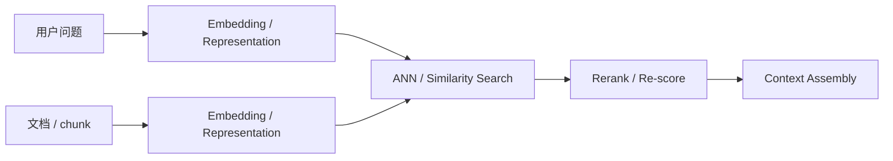

# RAG - 第 5 课：Embedding 深度：单向量、多向量、Matryoshka 与量化

## 学习目标（本节结束后你能做到什么）

1. 你能讲清 embedding 在 RAG 里到底承担什么角色，以及为什么“换个更强 embedding 模型”常常能直接改变检索上限。
2. 你能区分 single-vector bi-encoder、cross-encoder、late interaction / multi-vector 三条路线，并知道它们分别适合检索链路的哪一层。
3. 你能解释 Matryoshka Representation Learning（MRL）为什么在 2024 之后变得重要，以及它和量化根本不是一回事。
4. 你能从工程视角讲清 int8 / binary quantization、维度截断、检索延迟、显存 / 存储占用之间的取舍。
5. 你能基于文档类型、语言、上下文长度、部署方式，对 `bge`、`gte / mGTE`、`Qwen3-Embedding` 给出一个现实可用的选型框架。
6. 你能读懂 MTEB 这类 benchmark 的价值和局限，不会把排行榜当作“生产环境唯一真相”。
7. 你能讲清 pooling、normalization、instruction / prefix 为什么属于 embedding protocol，并知道不同方式的优缺点和选型规则。

---

## 1. 先把问题摆正：embedding 不是“把文本变成向量”这么简单

很多人第一次做 RAG，会把 embedding 理解成：

- 输入一段文本
- 输出一个向量
- 用余弦相似度比一下

这当然没错，但远远不够。

在检索系统里，embedding 真正要解决的是：

`如何把自然语言问题和知识片段压缩进同一个可比较的表示空间。`

这里“压缩”两个字非常关键。

为什么？

因为原始文本里有大量信息：

- 主题
- 语气
- 结构
- 关键词
- 局部关系
- 长距离依赖
- 实体指代

而 embedding 最终交给向量库的，可能只是：

- 一个 768 维向量
- 一个 1024 维向量
- 或若干 token-level 向量

这意味着 embedding 本质上是在做取舍：

- 哪些信息保住
- 哪些信息被平均掉
- 哪些信息被量化损失掉

所以“embedding 模型选型”从来都不是换个 API 名字那么简单，  
它本质上是在决定：

`你愿意用多少表示能力，换取多少检索效率。`

---

## 2. embedding 在检索链路里到底放在哪

如果把整个 retrieval stack 抽象一下，大致是：



embedding 这一层做的是：

- 把 query 映射到检索空间
- 把文档映射到检索空间
- 让相似性比较可计算、可索引、可压缩

它直接影响三件事：

1. `Recall 上限`
   - 如果表示空间本身没把相关内容拉近，后面的 rerank 根本看不到正确候选

2. `检索成本`
   - 向量维度、向量数量、量化方式都会影响索引大小和 ANN 成本

3. `跨语言 / 跨域泛化`
   - 同样的 retrieval pipeline，对中英混合、代码、表格描述、长文段落的稳健性差异很大

所以 embedding 是：

`RAG 检索层里最典型的“先决定上限，再决定成本”的模块。`

---

## 3. 先把三条路线分清：single-vector、cross-encoder、multi-vector

这三类模型在面试里经常被混说，但它们不是同一个东西。

### 3.1 Single-vector bi-encoder：最主流的第一阶段检索器

最常见的 dense retrieval 方式是：

- query 单独编码成一个向量
- 文档单独编码成一个向量
- 用向量相似度做 ANN 检索

这类方法的长处：

- 文档向量可预计算
- 查询延迟低
- 易于做大规模 ANN

也是为什么它成为生产 RAG 的默认主力。

但它的代价同样明显：

`一个向量必须概括整段文本。`

于是：

- 多主题段落会被平均化
- 局部词项和细粒度约束会被稀释
- query 中的某个关键 token 不一定被稳定保住

### 3.2 Cross-encoder：不是 embedding 模型，但必须拿来对照

cross-encoder 的输入是 query 和文档一起编码。  
它不产出可索引的独立文档向量，而是直接输出 pair-wise relevance score。

它的价值不在大规模第一阶段检索，而在：

- 精排
- 细粒度相关性判断
- 复杂条件和局部匹配

所以面试里如果有人问：

`embedding 和 reranker 区别是什么？`

一个很稳的回答是：

- bi-encoder embedding 负责大规模粗召回
- cross-encoder 负责第二阶段精排

### 3.3 Multi-vector / Late Interaction：在效果和效率之间重新找折中

ColBERTv2 的 NAACL 2022 论文把 late interaction 这条路线讲得很清楚：

- 查询和文档仍然分别编码
- 但不是压成单个向量
- 而是保留 token-level 或局部多向量表示
- 打分时做细粒度 interaction

论文摘要里明确强调：

- 它相比 single-vector 检索效果更强
- 但空间成本更大
- ColBERTv2 通过 residual compression 将 footprint 压缩了 6-10 倍

这条路线特别值得记住，因为它点破了一个事实：

`single-vector 检索的根本瓶颈，不是训练不够，而是信息压缩得太狠。`

所以 multi-vector 的本质，是在说：

`不要急着把整段文本压成一个点。`

---

## 4. single-vector 为什么能赢这么久：不是因为最好，而是因为“最值”

这点非常重要。  
很多人看完 ColBERT 或更复杂的多向量模型后，会自然觉得 single-vector 很落后。

但现实里 single-vector 仍然长期占主流，原因不是因为它一定效果最好，而是因为：

`它是大规模检索里性价比最高的默认点。`

它赢在：

- 预编码简单
- 索引成熟
- 存储成本低
- ANN 生态成熟
- 对大多数企业问答 already good enough

也就是说，single-vector 是工程均衡点。

所以真正成熟的理解不是：

- “single-vector 过时了”

而是：

- “single-vector 依然是默认基座，但越来越多场景会在第二阶段或高价值路径上叠加 multi-vector / reranker。”

---

## 5. 一个向量里到底压了什么：pooling、normalization、instruction，本身都不是小事

很多工程团队用 embedding 时容易忽略三个细节。

- **Pooling**：把一堆 token 向量“压缩”成一个文本向量。
- **Normalization**：把向量长度统一，方便做相似度比较。
- **Instruction**：告诉 embedding 模型“你现在是为了什么任务来编码这段文本”。

这三件事看起来像“小参数”，但在生产 RAG 里，它们会直接影响：

- 离线评测分数
- 线上召回结果
- 向量库距离函数选择
- query 和 document 是否落在同一个表示协议里
- 后续量化、截维、rerank 的稳定性

一个很重要的意识是：

`embedding 不只是模型权重，还是一套使用协议。`

同一个模型，如果 pooling 用错、normalization 和索引距离不一致、query instruction 没按模型卡来，效果可能会明显掉一档。

### 5.1 pooling 决定“整段文本如何被概括”

Transformer 通常会输出一串 token-level hidden states：

```text
token_1 -> h1
token_2 -> h2
token_3 -> h3
...
token_n -> hn
```

但 single-vector retrieval 最后只需要一个向量：

```text
text_embedding = pool(h1, h2, ..., hn)
```

所以 pooling 解决的问题是：

`怎么把一串 token 表示压成一个句子 / 段落 / chunk 表示。`

常见做法有下面几类。

#### 5.1.1 CLS pooling

做法：

- 取 `[CLS]` token 的 hidden state 作为整段文本向量

直觉：

- 让一个特殊 token 代表整段输入

优点：

- 计算简单
- 早期 BERT 分类任务里非常常见
- 如果模型训练时专门优化过 CLS 表示，效果可以很好

缺点：

- 不是所有模型的 `[CLS]` 都天然适合语义检索
- 如果训练目标没有把 CLS 训练成 sentence embedding，它可能只是“位置特殊”，不代表全局语义真的好
- 对长 chunk、列表、代码、表格说明这类结构，CLS 容易过度依赖开头信号

适合：

- 模型卡明确要求 CLS pooling
- 你使用的是已经封装好的 sentence embedding 模型，并且它的 pooling 配置就是 CLS

不适合：

- 你直接拿一个普通 encoder 的最后层 CLS 来做生产检索，然后假设它一定有效

#### 5.1.2 Mean pooling

做法：

- 对所有有效 token 的 hidden states 做平均
- 注意要排除 padding token

伪代码：

```python
token_embeddings = model_output.last_hidden_state
mask = attention_mask.unsqueeze(-1)

sum_embeddings = (token_embeddings * mask).sum(dim=1)
token_count = mask.sum(dim=1).clamp(min=1)
sentence_embedding = sum_embeddings / token_count
```

直觉：

- 整段文本由所有 token 共同投票决定

优点：

- 稳定、简单、可解释
- 对 sentence-transformers 类模型很常见
- 对中短文本、知识 chunk、FAQ、Wiki 段落通常是很强的默认选择
- 不太依赖某个特殊 token 是否被训练好

缺点：

- 对长 chunk 可能把多个主题平均掉
- 高频但无区分度的 token 会参与平均
- 列表、表格、代码块里，所有 token 平均不一定符合人类关注重点

适合：

- 你不知道该选什么，而且模型卡允许 mean pooling
- 中短文本语义检索
- RAG 第一阶段 dense retrieval baseline

不适合：

- chunk 特别长、主题混杂
- 需要保留非常细粒度局部匹配的场景

#### 5.1.3 Last-token pooling

做法：

- 取最后一个有效 token 的 hidden state

直觉：

- 在 causal / decoder-only 模型里，最后一个 token 已经看过前面所有 token，因此它可以携带整段前文信息

优点：

- 很适合某些 decoder-only embedding 模型
- 对“把整段输入压到最后位置”的训练协议比较自然
- 实现简单

缺点：

- 对 padding side、截断位置非常敏感
- 如果最后几个 token 是无意义标点、模板后缀、格式噪声，表示会受影响
- 不适合随便套到普通 BERT-style encoder 上

适合：

- 模型卡明确要求 last-token pooling
- decoder-only / causal LM 路线的 embedding 模型

不适合：

- 没确认模型训练协议时手工替换 mean / CLS

#### 5.1.4 Max pooling

做法：

- 对每个维度取 token hidden states 的最大值

直觉：

- 只要某个 token 在某个语义维度上强烈激活，就保留下来

优点：

- 对关键词、实体、局部强信号更敏感
- 某些分类或短文本任务里可能有用

缺点：

- 容易被噪声 token 放大
- 表示不够平滑
- 在通用 dense retrieval 里通常不是默认首选

适合：

- 需要强调局部触发词的实验性场景

不适合：

- 默认生产 RAG 检索 baseline

#### 5.1.5 Weighted mean / position-weighted pooling

做法：

- 不是简单平均，而是给不同位置或 token 不同权重

常见动机：

- 长文本里后半段或标题附近可能更重要
- 某些模型训练时使用了 position-weighted pooling

优点：

- 比普通 mean pooling 更灵活
- 可以缓解长文本里所有 token 权重完全相同的问题

缺点：

- 权重策略如果不是模型训练时学出来的，就容易变成拍脑袋
- 不同文档结构下泛化不一定稳定

适合：

- 模型官方实现就是这样做
- 你有足够评测集验证它确实优于 mean pooling

#### 5.1.6 pooling 怎么选

一个很实用的顺序是：

1. **优先使用模型官方封装**
   - 例如 SentenceTransformer、FlagEmbedding、模型卡示例代码
   - 不要随便把官方 pooling 换掉

2. **如果自己用 Hugging Face raw model，先看模型卡**
   - 模型说 mean 就用 mean
   - 模型说 CLS 就用 CLS
   - 模型说 last token 就用 last token

3. **如果模型卡没说清，用小评测集做 A/B**
   - 同一批 query
   - 同一批 doc chunks
   - 比较 Recall@K、MRR、NDCG、最终 RAG answer groundedness

4. **不要只看一个检索指标**
   - pooling 变化可能让 Recall@20 上升，但 top-5 质量下降
   - 最终塞给 LLM 的上下文质量才是 RAG 里更关键的结果

可以把选择简化成这张表：

| pooling 方式 | 优点 | 缺点 | 适合场景 |
| --- | --- | --- | --- |
| CLS | 简单，若训练过则效果好 | 未训练时不一定代表全局语义 | 模型明确要求 CLS |
| Mean | 稳定，通用，适合 baseline | 长文本会平均掉局部重点 | 中短 chunk、FAQ、Wiki、普通 RAG |
| Last-token | 适合 causal LM 表示协议 | 对截断、padding、末尾噪声敏感 | 模型明确要求 last-token |
| Max | 保留局部强信号 | 容易放大噪声 | 局部关键词强匹配实验 |
| Weighted mean | 可调表达重点 | 需要训练或评测支撑 | 长文本或模型官方策略 |

最终原则是：

`pooling 不是后处理小技巧，而是 embedding 模型训练协议的一部分。`

如果你换 pooling，本质上是在换这个模型的使用方式。

### 5.2 normalization 决定相似度空间的几何性质

很多 embedding pipeline 会在向量输出后做 L2 normalize。

公式上就是：

```text
v_norm = v / ||v||
```

归一化后，每个向量长度都变成 1。

这件事会直接影响相似度比较。

#### 5.2.1 cosine、dot product、L2 的关系

常见距离 / 相似度有三种：

| 比较方式 | 看什么 | 特点 |
| --- | --- | --- |
| Cosine similarity | 两个向量夹角 | 更关注方向，弱化长度 |
| Dot product / inner product | 方向 + 长度 | 向量 norm 会影响分数 |
| L2 distance | 欧氏距离 | 常用于某些 ANN index |

如果向量已经 L2 normalize，那么：

```text
dot product == cosine similarity
```

而且 L2 距离和 cosine 也可以互相单调转换。

这就是为什么很多向量库里会出现这种实践：

- 向量先 normalize
- 索引用 inner product
- 实际上等价于 cosine 检索

#### 5.2.2 normalization 的优点

- 让 cosine similarity 更稳定
- 把模型输出的向量尺度变化抹平
- 让离线评测和线上 ANN 距离函数更容易对齐
- 降低“向量长度”这个非语义因素对排序的影响
- 方便做跨批次、跨服务、跨索引的一致比较

尤其在 RAG dense retrieval 里，如果你的目标是“语义方向相似”，normalize 通常是很稳的默认选择。

#### 5.2.3 normalization 的代价

normalize 不是永远无脑正确。

它会抹掉向量长度信息。

而有些模型或训练目标可能让向量 norm 携带某种信号，例如：

- 置信度
- 文本信息量
- query / document 难度
- 分布外程度

如果模型训练时就是按 dot product + 非归一化向量优化的，你强行 normalize，可能会损失它原本想保留的尺度信息。

所以关键不是“归一化一定好”，而是：

`训练目标、推理方式、向量库距离函数必须一致。`

#### 5.2.4 normalization 怎么选

可以按下面的规则判断：

1. **模型卡或官方示例要求 normalize**
   - 跟着做
   - 例如很多 SentenceTransformer / BGE 风格示例会直接 `normalize_embeddings=True`

2. **你在线上用 cosine similarity**
   - 建议提前 L2 normalize
   - 然后用向量库的 cosine 或 inner product，但要确认两者语义一致

3. **你在线上用 inner product**
   - 如果向量已 normalize，inner product 约等于 cosine
   - 如果没 normalize，向量长度会参与排序

4. **你做 MRL 截维**
   - 通常应先截维，再对截维后的向量重新 normalize
   - 不要只 normalize 完整向量后直接截前 256 维就结束

5. **你做量化**
   - 常见做法是保留全精度原始向量或归一化向量用于重打分
   - 低精度向量负责粗召回，小候选再用高精度向量或 reranker 校正

6. **query 和 document 必须一致**
   - 不要 query normalize，document 不 normalize
   - 不要离线评测 cosine，线上索引用未归一化 inner product

一个工程决策表：

| 场景 | 推荐做法 | 原因 |
| --- | --- | --- |
| 普通 RAG dense retrieval | L2 normalize + cosine / IP | 稳定、简单、可复现 |
| 模型卡明确要求非归一化 dot product | 不要擅自 normalize | 尊重训练协议 |
| MRL 截维 | 截维后重新 normalize | 保证子向量几何一致 |
| int8 / binary 粗召回 | 量化召回 + 全精度重排 | 避免量化误差直接决定最终排序 |
| hybrid retrieval 融合 | normalize 后再做 score calibration | dense 分数更稳定，便于和 BM25 融合 |

#### 5.2.5 最常见的 normalization 事故

事故 1：

```text
离线实验：cosine
线上向量库：inner product
向量：没有 normalize
```

结果：

- 离线看起来效果不错
- 线上排序被向量长度影响
- 检索结果和离线评测对不上

事故 2：

```text
旧索引：未 normalize
新索引：normalize
线上混查两个索引
```

结果：

- 分数不可比
- A/B 实验结果混乱
- fusion 和 threshold 全部漂移

事故 3：

```text
完整 1024 维向量 normalize
截成 256 维后不重新 normalize
```

结果：

- 256 维子向量长度不再是 1
- 相似度空间变形
- 低维索引评测失真

### 5.3 instruction / query prefix 很多时候是模型能力的一部分

很多现代 embedding 模型已经不再默认 query/document 完全同分布。  
而是会建议：

- query 走 instruction-style prefix
- document 走 plain text
- 或者 query 和 passage 分别使用不同 prefix

这说明一件很重要的事：

`现代 embedding 模型越来越把“检索任务意图”显式编码进输入协议里。`

如果你忽略这些使用方式，
线上效果可能会明显低于模型卡上的结果。

#### 5.3.1 instruction 到底在做什么

对 embedding 来说，instruction 不是让模型“生成答案”，而是告诉模型：

`请按某种检索任务来组织这个输入的表示。`

例如同一句话：

```text
门禁权限多久停用？
```

如果它作为普通句子，语义很短、信息很少。

但如果加上 query instruction：

```text
Represent this query for retrieving relevant policy documents: 门禁权限多久停用？
```

模型会更倾向于把它编码成“找制度条款”的查询，而不是普通语义相似句。

再比如 E5 类模型常见的思想是区分：

```text
query: 员工离职后多久停用门禁权限？
passage: 离职审批完成后24小时内停用门禁权限。
```

这里的 `query:` 和 `passage:` 就是在告诉模型：

- 这边是问题
- 那边是候选文本
- 你们不是同一种输入角色

#### 5.3.2 instruction 的优点

- 对非对称检索更友好
  - query 很短
  - document 很长
  - 两边文本风格不同

- 能显式表达任务意图
  - 搜政策
  - 搜代码
  - 搜 FAQ
  - 做相似句匹配
  - 做聚类

- 对多任务 embedding 模型尤其重要
  - 同一个模型可能支持 retrieval、classification、clustering、reranking 辅助表示
  - instruction 可以帮助模型切换任务模式

- 对领域检索有帮助
  - 比如“检索相关法律条款”
  - “检索能回答该问题的技术文档”
  - “检索与该报错最相关的排障记录”

#### 5.3.3 instruction 的缺点

- 增加输入 token
  - query 侧通常没问题
  - document 侧如果每个 chunk 都加长 instruction，会增加离线 embedding 成本

- 协议一旦确定就要稳定
  - 旧索引用一种 prefix
  - 新索引用另一种 prefix
  - 两批向量可能不完全在同一分布里

- 写错 instruction 会误导模型
  - 明明是找政策，却写成找相似句
  - 明明要搜代码，却写成自然语言问答

- 不同模型的 instruction 格式不通用
  - A 模型推荐 `query:`
  - B 模型推荐自然语言 task instruction
  - C 模型可能不需要 prefix

所以 instruction 也不是越多越好。

它是一种“输入协议”，不是 prompt 魔法。

#### 5.3.4 query instruction、document instruction、双侧 instruction 怎么选

常见有四种方式：

| 方式 | 做法 | 优点 | 缺点 | 适合场景 |
| --- | --- | --- | --- | --- |
| 无 instruction | query / document 都直接编码原文 | 简单，成本低 | 对非对称检索不够显式 | 对称语义相似、模型不要求 prefix |
| query-only instruction | query 加任务说明，document 保持原文 | 成本低，适合 RAG 搜文档 | document 侧角色不显式 | 大多数企业 RAG baseline |
| query / passage prefix | query 和 document 分别加短 prefix | 角色清晰，实现简单 | prefix 必须和训练协议一致 | E5 / BGE 风格检索协议 |
| full task instruction | 用较完整自然语言描述任务 | 表达能力强，适合多任务模型 | token 成本高，容易写偏 | Qwen / instruct embedding 风格、复杂任务路由 |

一个实用选择顺序：

1. **先照模型卡做**
   - embedding 模型的 prefix / instruction 往往是训练协议的一部分
   - 不要自己先发明一套

2. **普通企业 RAG 优先 query-only 或 query/passage prefix**
   - query 通常短，加 instruction 成本低
   - document chunk 保持原文，引用和排查也更干净

3. **多任务或多知识源检索再考虑 full task instruction**
   - 比如同一个模型同时服务：
     - FAQ 检索
     - 法规条款检索
     - 代码检索
     - 工单相似案例检索

4. **索引一旦建好，不要随便改 document prefix**
   - 改了 document encoding protocol，就应该重建索引
   - 否则新旧 chunk 向量分布不一致

#### 5.3.5 instruction 示例

政策 / 制度 RAG：

```text
Represent this query for retrieving relevant internal policy passages: 员工离职后多久停用门禁权限？
```

技术文档 RAG：

```text
Represent this query for retrieving relevant technical documentation: 如何配置 Redis Sentinel 故障转移？
```

工单相似案例：

```text
Represent this incident for retrieving similar troubleshooting tickets: 用户反馈登录后立即被踢出
```

代码文档：

```text
Represent this query for retrieving relevant code or API documentation: validateUserPermission 在哪里被调用？
```

注意，这些只是说明思路。
真正上线时应该以模型官方建议和你的离线评测结果为准。

### 5.4 三者放在一起看：真正要选的是一套 embedding protocol

pooling、normalization、instruction 不是三颗孤立按钮。

它们共同组成一套协议：

```text
raw text
-> add instruction / prefix
-> tokenize
-> model forward
-> pooling
-> optional dimension truncation
-> normalization
-> optional quantization
-> vector index
```

这里最重要的是顺序和一致性。

一个比较稳的 baseline 是：

```text
query:
  按模型卡添加 query instruction
  -> 官方 encoder / pooling
  -> normalize

document:
  保持原文或按模型卡添加 passage prefix
  -> 官方 encoder / pooling
  -> normalize

index:
  使用 cosine 或 normalized inner product
```

如果支持 MRL：

```text
encode full vector
-> truncate to target dimension
-> normalize truncated vector
-> index
```

如果支持量化：

```text
full precision vectors kept for small-candidate rescoring
quantized vectors used for large-scale coarse retrieval
```

### 5.5 各种方式怎么选：一个工程决策表

| 选择点 | 默认建议 | 什么时候换 | 主要风险 |
| --- | --- | --- | --- |
| Pooling | 用官方封装 | 只有评测证明更好才换 | 手工换 pooling 导致模型协议失效 |
| CLS vs Mean | 普通 RAG 更常从 mean baseline 开始 | 模型明确要求 CLS | CLS 未训练好时效果差 |
| Last-token | 只在模型要求时使用 | decoder-only embedding | padding / 截断 / 末尾噪声敏感 |
| Normalize | 普通 dense retrieval 建议做 | 模型明确要求非归一化 dot product | 离线和线上距离函数不一致 |
| Cosine vs IP | normalize 后二者近似等价 | 非归一化向量要谨慎用 IP | norm 影响排序 |
| Query instruction | 优先按模型卡启用 | 对称相似度任务可不用 | 忽略 instruction 会掉效果 |
| Document prefix | 按模型卡或保持原文 | 模型训练协议要求 passage prefix | 改 prefix 要重建索引 |
| Full task instruction | 多任务 / 复杂检索再用 | query 路由到不同任务 | instruction 写偏会污染表示 |
| 截维 + normalize | 截维后重新 normalize | 模型不支持 MRL 就不要乱截 | 子向量几何变形 |
| 量化 | 粗召回用，最终重排校正 | 数据量大、成本敏感 | 量化误差影响最终排序 |

### 5.6 一句话总结

如果要用一句后端工程语言总结：

`embedding protocol 必须版本化。`

也就是说，你至少要记录：

```json
{
  "model": "BAAI/bge-m3",
  "model_revision": "xxx",
  "query_instruction": "Represent this query for retrieving relevant passages:",
  "document_prefix": "",
  "pooling": "official_sentence_transformer_pooling",
  "normalize": true,
  "dimension": 1024,
  "truncate_dimension": null,
  "precision": "float32",
  "distance": "cosine",
  "embedding_pipeline": "embedding_v3"
}
```

原因很简单：

- pooling 改了，向量分布会变
- normalization 改了，分数尺度会变
- instruction 改了，query / document 对齐方式会变
- dimension / quantization 改了，召回质量和索引成本会变

这些变化都不是“小改动”，而是索引协议变更。

生产里应该把它当成：

`需要评测、灰度、回滚和必要时重建索引的变更。`

---

## 6. 2024 → 2026：embedding 这一层到底变了什么

### 6.1 2024：从“更强单向量”走向“多功能统一模型”

2024 年最有代表性的工作之一是 `BGE-M3`。

arXiv 论文标题就把野心写得很清楚：

`Multi-Linguality (100+ languages), Multi-Functionality (dense retrieval, sparse retrieval, multi-vector / ColBERT), Multi-Granularity (input up to 8192 tokens)`

这件事意义很大，因为它说明 2024 年 embedding 模型已经不再满足于：

- 只做 single-vector dense retrieval

而是开始尝试把：

- dense
- sparse
- multi-vector

统一进一个模型族里。

这实际上在逼近一个更成熟的工业需求：

`我们不想为每个 retrieval stage 维护完全不同的模型生态。`

### 6.2 2024：Matryoshka 开始从研究概念进入检索实践

Matryoshka Representation Learning（NeurIPS 2022）的思想在 2024 之后突然变得非常重要，原因很现实：

- embedding 越来越长
- 检索和存储成本越来越高
- 大家开始强烈需要“同一个向量能不能按预算伸缩”

MRL 的核心直觉非常漂亮：

`让 embedding 的前缀子向量本身也有用。`

也就是说，一个 1024 维向量，不是只能完整使用；  
它的前 512 维、前 256 维也应该保留尽量好的语义表示能力。

这就带来非常强的工程价值：

- 同一模型可适配不同延迟 / 成本预算
- 同一索引可尝试不同维度截断
- coarse retrieval 和 fine retrieval 可以共享同一表示体系

### 6.3 2025：长上下文 embedding 变成硬需求，而不是可选特性

随着 chunking 进入 late chunking、contextual retrieval 和长文档 retrieval 阶段，  
embedding 模型开始被明确要求支持：

- 更长输入
- 更稳的长上下文表征
- 跨语言和跨任务泛化

`mGTE` / `gte` 这条线很能体现这个趋势。  
arXiv 论文标题就直说：

`Generalized Long-Context Text Representation and Reranking Models for Multilingual Text Retrieval`

这里两个关键词非常关键：

- `Long-Context`
- `Generalized`

也就是：

`不是只在英文短句上强，而是要在长文、多语言、多个检索相关任务上都能用。`

### 6.4 2025-2026：embedding 和 reranker 越来越成对发布

一个值得注意的产业趋势是：

- 模型发布不再只给 embedding
- 而是 embedding + reranker 一起给

Qwen3 这条线特别典型。  
官方 Hugging Face 模型卡直接把 `Qwen3-Embedding` 和 `Qwen3-Reranker` 成对发布，并明确强调：

- 支持多语言、多语种代码、文本检索
- 支持自定义 embedding dimensions
- 支持 Matryoshka Representation Learning（MRL）
- 支持 binary quantization

这说明到 2026 年，产业侧已经越来越把检索看成：

`表示模型 + 精排模型 + 可伸缩表示预算`

的组合问题，而不是单个 embedding 名字。

---

## 7. Matryoshka Representation Learning：为什么它不是“向量裁剪技巧”，而是训练目标变化

这是本节最值得讲透的部分之一。

### 7.1 先讲直觉

正常 embedding 训练里，一个 1024 维向量通常只在“完整 1024 维”时被优化。  
如果你上线后为了省钱，直接截成前 256 维：

- 有时还能用
- 但效果常明显下降

因为模型根本没被训练成“前 256 维也必须自洽”。

Matryoshka 的想法就是：

`训练时就让多个前缀维度都参与目标。`

这样模型会学到：

- 前面维度先表达最粗、最重要的信息
- 后面维度逐步补充更细的信息

它像套娃，所以叫 Matryoshka。

### 7.2 它的工程价值为什么这么大

因为它直接解决了一个现实问题：

`不同产品、不同机器、不同索引阶段，预算不一样。`

有了 MRL 之后，你可以：

- 离线先存 1024 维
- 在线 ANN 先用 256 维做粗召回
- 再用 512 / 1024 维做精细重排

或者：

- 同一模型服务不同租户
- 高预算租户用高维
- 低预算租户用低维

这让 embedding 模型第一次具备了：

`表示预算的弹性。`

### 7.3 它和量化不是一回事

这一点必须讲清：

`MRL` 解决的是“信息如何分层排布在维度中”  
`Quantization` 解决的是“每个维度的数值如何更便宜地存储”

一个是训练表示方式，  
一个是存储 / 计算压缩方式。

两者可以结合，但绝不能混为一谈。

### 7.4 为什么 2025-2026 模型越来越强调 MRL support

因为这和实际产品需求太贴了。  
Qwen3 模型卡明确提到：

- 支持 custom dimensions
- 支持 Matryoshka Representation Learning

这意味着 MRL 已经不只是论文概念，而是：

`模型发布时的产品特性。`

---

## 8. 量化：不要只把它理解成“省一点存储”

### 8.1 为什么 embedding 特别适合量化

因为 retrieval 系统里文档向量往往数量非常大：

- 10 万
- 100 万
- 1000 万

每条向量如果是：

- 1024 维
- float32

存储和内存占用会很快上去。

所以 embedding 量化的收益往往非常直接：

- 降低索引体积
- 降低内存占用
- 有时还能提升 ANN 速度

### 8.2 常见路线：float16 / int8 / binary

可以粗略理解为：

- `float16`
  - 损失小，省一半空间

- `int8 / scalar quantization`
  - 更省，通常是比较稳的工程折中

- `binary / ubinary`
  - 极致压缩，但召回损失会更明显

Hugging Face 官方博客《Binary and Scalar Embedding Quantization for Significantly Faster & Cheaper Retrieval》把这件事讲得很明确：

- 对嵌入做 scalar / binary quantization
- 可以显著降低存储成本
- 并结合 rescore 缓解精度损失

这和前面 MRL 其实非常互补：

- MRL：先决定维度前缀如何保留信息
- quantization：再决定每维怎么更便宜地存

### 8.3 量化最常见的正确打开方式：粗召回量化 + 小候选重打分

一个很成熟的工业套路是：

1. 文档向量用 int8 / binary 存
2. 粗召回 topN
3. 再用全精度向量或 reranker 重打分

这比“全链路只用低精度向量”稳得多。

---

## 9. Multi-vector 为什么值得学，但通常不是第一步就上

这部分要讲得非常实事求是。

### 9.1 它为什么强

ColBERTv2 已经把价值说得很清楚：

- token-level late interaction
- 比 single-vector 更细粒度
- 更能保留局部匹配和复杂条件

它特别适合：

- 长文精细检索
- 高价值问答
- 需要更强 recall / precision 的专业场景

### 9.2 它为什么还没全面取代 single-vector

因为它的代价不是小补丁，而是：

- 索引对象更多
- 存储更大
- 查询更复杂
- 系统工程更难

即使 ColBERTv2 已经做了 residual compression，  
它依然不是“默认最省心”的路线。

所以成熟判断通常是：

- `single-vector` 做基础 dense retrieval
- `multi-vector` 用于高价值路径或更强第二阶段表示

---

## 10. 中文 / 多语言 embedding 选型：不要只看英文榜单

这是很多团队在国内语境里最容易掉进去的坑。

### 10.1 BGE：工程生态成熟，功能覆盖面大

`BGE-M3` 的优势非常明显：

- 100+ languages
- dense / sparse / multi-vector 三合一
- 最长输入 8192 tokens
- `FlagEmbedding` 生态完善

如果你是：

- 中英混合
- 想先落一个强而通用的检索基座
- 希望 dense / sparse / ColBERT 风格能在一个体系内衔接

那 BGE 这条线非常值得优先看。

### 10.2 GTE / mGTE：长上下文与 multilingual retrieval 很值得关注

`mGTE` 的定位更像：

- generalized
- multilingual
- long-context text representation

如果你的文档：

- 很长
- 多语言
- retrieval 和 reranking 都想在同一家族里统一

GTE 这条线很值得重点考虑。

### 10.3 Qwen3-Embedding：2025-2026 很值得关注的中文 / 多语种新一代路线

Qwen3 官方模型卡里几个点非常关键：

- 多语言、代码、文本都覆盖
- 支持自定义维度
- 支持 MRL
- 支持 binary quantization

这意味着它对工程团队非常友好，因为它把很多“上线后才发现重要”的特性前置成了模型能力。

如果你现在要在中文场景里选一个：

- 新
- 强
- 又明确考虑了尺寸弹性和量化落地

Qwen3-Embedding 是很值得重点跟踪的一条线。

### 10.4 选型不要只看榜单第一

真正该看的维度是：

- 语言覆盖
- 文档长度
- 是否需要 query instruction
- 是否支持 MRL
- 是否易于量化
- 是否有配套 reranker
- 是否已有团队生态和示例

---

## 11. MTEB 怎么看，才不至于被排行榜带偏

MTEB 的价值非常大，但它不是万能真相机。

### 11.1 它为什么重要

MTEB 官方站点把自己定义成：

- massive text embedding benchmark
- 覆盖 retrieval、clustering、pair classification、reranking、STS、summarization 等多个任务

它的重要性在于：

- 给 embedding 模型一个更统一的横向比较基准
- 不再只看单个 retrieval benchmark

### 11.2 为什么不能把它当唯一真相

因为生产环境和 benchmark 有天然差异：

- 你的 query 更短还是更口语？
- 你的语料是 PDF 残骸、wiki、代码、政策、工单，还是清洗好的 benchmark？
- 你的检索链路有 BM25、filter、rerank 吗？
- 你的文档长度和语言分布是什么？

一个在 MTEB retrieval 上领先的模型，  
不一定就是你公司知识库里最稳的选择。

### 11.3 正确用法：把 MTEB 当初筛，不当最终裁决

更成熟的流程是：

1. 用 MTEB 先缩小候选集
2. 在自己语料和 query 分布上做离线评测
3. 再看线上延迟、成本、存储、配套 reranker

这才是面向工程的选型方式。

---

## 12. Python 示例：从 baseline 到进阶

### 12.1 baseline：single-vector bi-encoder

```python
from sentence_transformers import SentenceTransformer

model = SentenceTransformer("BAAI/bge-m3")

queries = ["员工离职后多久停用门禁权限？"]
docs = [
    "离职审批完成后24小时内停用门禁权限。",
    "试用期员工报销标准见附录。",
]

q_emb = model.encode(queries, normalize_embeddings=True)
d_emb = model.encode(docs, normalize_embeddings=True)
```

这是最典型的 dense retrieval 起点。

### 12.2 量化编码

Hugging Face / Sentence Transformers 生态现在已经支持在编码阶段直接输出低精度表示：

```python
from sentence_transformers import SentenceTransformer

model = SentenceTransformer("mixedbread-ai/mxbai-embed-large-v1")

emb_int8 = model.encode(
    docs,
    precision="int8",
    normalize_embeddings=True,
)
```

适合：

- 语料量大
- 先做便宜粗召回

### 12.3 MRL / 自定义维度思路

如果模型本身支持 MRL / custom dimensions，那么可以按预算裁剪：

```python
full_emb = model.encode(docs, normalize_embeddings=True)

# 只有在模型明确支持 MRL / dimension truncation 时才建议这么做
emb_256 = full_emb[:, :256]
emb_512 = full_emb[:, :512]
```

要点不是代码，而是：

- 不是所有 embedding 都该随便截维
- 只有 MRL-aware 模型才更适合这样用

### 12.4 multi-vector / late interaction

这类一般不会像 bi-encoder 那样“几行代码搞定全链路”。  
更典型的实践是：

- 第一阶段先用 bi-encoder 召回
- 第二阶段用 ColBERT 或 reranker 重打分

这也是为什么很多系统先把 07 和 05 分开讲，但工程上它们是连起来的。

---

## 13. 怎么做领域适配：不是所有任务都该从头训练 embedding

这个问题在生产里很现实。

如果你自己的语料是：

- 很强行业术语
- 很强格式特征
- 很多内部缩写
- 查询分布和公开 benchmark 差异很大

那领域适配会很有价值。

但成熟路线通常不是直接从头训练，而是：

1. 先选一个强的基础 embedding 家族
2. 再做小规模指令适配 / 对比学习微调 / LoRA 微调
3. 保持 query / positive / hard negative 数据构造质量

这里最容易犯的错是：

- 一开始就迷信“自己训一定更好”

现实常常是：

- 数据不够好
- hard negatives 不够难
- 训练完反而过拟合某类 query

所以除非你的域差异真的很大，  
否则更建议先用：

- 强基座模型
- 好的 chunking
- hybrid retrieval
- reranker

把基础链路打稳。

---

## 14. 最容易踩的 15 个坑

### 14.1 把 cross-encoder 当成 embedding 模型

它解决的是 pairwise scoring，不是大规模 first-stage indexing。

### 14.2 只看单个 retrieval 分数，不看系统总成本

更强模型如果把存储、延迟、吞吐全打爆，也未必真更好。

### 14.3 忽略 query instruction

很多模型的线上效果，就是在这里白白损失掉的。

### 14.4 不做向量归一化，却直接比较 cosine / inner product

这样很容易让离线实验和线上 ANN 不一致。

如果离线用 cosine，线上用未归一化 inner product，你看到的就不是同一个排序空间。

### 14.5 看到长向量就以为一定更强

维度更高常常意味着：

- 存储更大
- ANN 更慢
- 不代表在你的任务上就稳定更好

### 14.6 把 MRL 和量化混为一谈

一个是训练表示方式，一个是数值压缩方式。

### 14.7 多向量一上来就全量替换 single-vector

这通常会让系统复杂度先爆炸。

### 14.8 只看英文 benchmark 选中文模型

这是国内团队最常见的误判之一。

### 14.9 只看 embedding 榜单，不看配套 reranker

现代检索常常是 embedding + reranker 联合作战。

### 14.10 只看 Recall，不看 retrieval 后上下文质量

召回到了，但如果候选太脏，最终 answer 也不一定好。

### 14.11 对截维模型随便裁切

不是所有向量都适合直接裁前缀。

### 14.12 在坏 chunk、坏解析上调 embedding

这会把上游问题误诊成表示问题。

### 14.13 自己手工换 pooling，却没有重新评测

很多模型的 pooling 是训练协议的一部分。

如果官方实现用 mean pooling，你手工换成 CLS；或者官方实现用 last-token pooling，你手工换成 mean，本质上不是“小优化”，而是改变了文本向量的形成方式。

这种改动必须重新跑检索评测。

### 14.14 改了 instruction / prefix，却复用旧索引

query instruction 改了，通常只影响在线 query encoder。

但 document prefix 改了，就会影响所有文档向量。

如果你把：

```text
passage: 原文
```

改成：

```text
Represent this document for retrieval: 原文
```

却不重建文档索引，新旧向量就不再遵守同一套协议。

### 14.15 截维后忘记重新 normalize

MRL 模型支持截维，不代表你可以：

```text
normalize 1024 维 -> 截前 256 维 -> 直接入库
```

更稳的是：

```text
截前 256 维 -> 对 256 维重新 normalize -> 入库
```

否则低维子向量的长度和距离空间都会漂。

---

## 15. 面试里怎么讲，才像真正理解过 embedding

如果面试官问：

`embedding 模型选型你看什么？`

你可以这样答：

> 我会先分三层看。第一层是表示路线：single-vector、multi-vector 还是 pairwise rerank；第二层是工程约束：维度、长上下文、是否支持量化和 MRL、是否有配套 reranker；第三层是域匹配：语言、文档长度、术语分布、query 风格。排行榜只能帮我缩小候选集，不能替代在线下和真实语料上的评测。

如果面试官再问：

`Matryoshka 为什么重要？`

你可以答：

> 因为它让同一个 embedding 在不同维度预算下都尽量可用，相当于把表示预算弹性训练进模型里。这样我们可以做更灵活的索引策略，比如低维粗召回、高维精排，或者同一模型适配不同成本档位。它解决的是表示分层问题，不是存储压缩问题，所以不能和量化混为一谈。

如果面试官继续追问：

`为什么 ColBERT 这种多向量方法没全面取代 bi-encoder？`

你可以答：

> 因为 single-vector 的价值不只是效果，而是索引、存储和 ANN 生态的性价比。多向量能显著提升细粒度匹配能力，但也带来更大的存储和系统复杂度。所以现实里更常见的不是完全替换，而是 single-vector 做第一阶段，大候选再交给多向量或 reranker 做第二阶段。

---

## 小结

1. embedding 的本质，是把 query 和文档压进同一个可比较表示空间，而压缩本身就是取舍。
2. single-vector bi-encoder 仍是生产默认基座；cross-encoder 负责精排；multi-vector / late interaction 负责在效果和效率之间做更强折中。
3. pooling、normalization、instruction / prefix 不是小参数，而是一套 embedding protocol；改动它们通常意味着索引协议变更。
4. 2024 之后 embedding 的关键变化，是统一多功能模型、长上下文表示、MRL 弹性维度和与 reranker 成对发布。
5. Matryoshka 解决的是“表示如何分层”，量化解决的是“表示如何便宜存储”；两者可以结合，但不是一回事。
6. MTEB 很重要，但只能做候选筛选，最终选型仍要回到你的语料、query 分布、延迟预算和全链路评测。

---

## 检查站

1. 为什么说 embedding 模型选型本质上是在做“表示能力 vs 检索成本”的取舍？
2. `single-vector`、`cross-encoder`、`multi-vector` 各自在检索链路里最适合放在哪？
3. Matryoshka 为什么会让“低维粗召回 + 高维精排”这种策略变得更自然？
4. 为什么一个 MTEB 上更强的模型，不一定就是你内部知识库的最优选择？
5. CLS pooling、mean pooling、last-token pooling 分别适合什么模型或场景？为什么不能随便互换？
6. L2 normalization 会改变什么？为什么离线 cosine 和线上未归一化 inner product 会导致排序不一致？
7. query instruction、document prefix 和 full task instruction 分别适合什么场景？为什么改 document prefix 通常要重建索引？

---

## 参考与延伸阅读

- Santhanam et al., *ColBERTv2: Effective and Efficient Retrieval via Lightweight Late Interaction* (NAACL 2022)  
  https://aclanthology.org/2022.naacl-main.272/
- Kusupati et al., *Matryoshka Representation Learning* (NeurIPS 2022)  
  https://openreview.net/forum?id=9njZa1fm35
- Chen et al., *BGE M3-Embedding: Multi-Lingual, Multi-Functionality, Multi-Granularity Text Embeddings Through Self-Knowledge Distillation* (2024)  
  https://arxiv.org/abs/2402.03216
- Zhang et al., *mGTE: Generalized Long-Context Text Representation and Reranking Models for Multilingual Text Retrieval* (2024)  
  https://arxiv.org/abs/2407.19669
- Qwen Team, *Qwen3 Embedding: Advancing Text Embedding and Reranking Through Foundation Models* (2025)  
  https://arxiv.org/abs/2506.05176
- BAAI `bge-m3` Model Card  
  https://huggingface.co/BAAI/bge-m3
- `Qwen3-Embedding-4B` Model Card  
  https://huggingface.co/Qwen/Qwen3-Embedding-4B
- MTEB Official Site  
  https://mteb.dev/
- Hugging Face Blog, *Binary and Scalar Embedding Quantization for Significantly Faster & Cheaper Retrieval*  
  https://huggingface.co/blog/embedding-quantization
