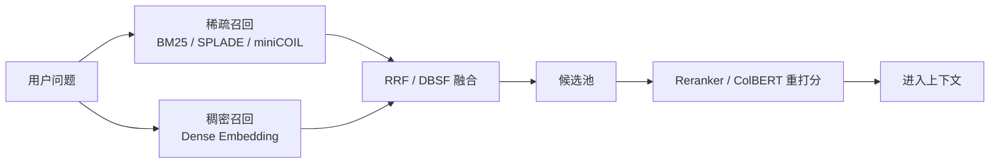

# RAG - 07a：混合检索：向量 + 关键词不是折中，而是生产 RAG 的默认底座

## 学习目标（本节结束后你能做到什么）

1. 你能讲清为什么`纯向量检索`在生产里经常不够，以及它到底会在什么类型的问题上失灵。
2. 你能解释 BM25、dense retrieval、RRF、DBSF 各自在系统里扮演什么角色，而不是把它们当成几个可替换名词。
3. 你能根据问题类型设计`双路召回 + 融合 + 重排`链路，并知道各路该给多深的候选。
4. 你能把 2024-2026 的最新变化讲出来，包括 Contextual BM25、原生 hybrid query、稀疏模型与多阶段检索的融合趋势。
5. 面试里被追问`为什么不是只上更强 embedding`时，你能给出一个工程上站得住的回答。

---

## 1. 先把问题摆正：混合检索不是“向量不行时补个关键词”

很多人第一次做 RAG，会把检索理解成一场单选题：

- 要么走 BM25
- 要么走 embedding

这其实是一个错误前提。  
在真实知识库里，这两类方法不是替代关系，而是`两种失配模式的补偿机制`。

为什么？

因为查询和文档之间至少有两种相关性：

1. `词项相关性`
   - 关键词、错误码、SKU、函数名、表字段名、版本号、合同编号
   - 这类东西不是“语义像不像”，而是“有没有命中这个字面串”

2. `语义相关性`
   - 说法不同、措辞不同、上下位概念、近义表达、隐式指代
   - 这类东西不是“是否出现同样的词”，而是“意思是不是同一件事”

如果你只用向量检索，常见事故是：

- 问题里有`TS-999`、`k8s readinessProbe`、`订单状态 17`，embedding 把它们看成一堆普通 token，精确命中能力不足。
- 代码、日志、错误码、配置项这类`低频精确词`，往往词面比语义更重要。

如果你只用 BM25，常见事故是：

- 用户问“员工离职后多久停用门禁权限”，文档写的是“人员解约后门禁账户将在 24 小时内冻结”。
- 词不一样，但意思一样，BM25 只能命中局部词面重叠。

所以混合检索真正要解决的，不是“谁更先进”，而是：

`同一个问题可能同时包含词面约束和语义约束。`

这就是为什么 2024 之后，业界越来越不把 hybrid retrieval 当成增强版，而是当成`生产默认值`。

---

## 2. 原理：混合检索其实是在并联两个打分空间

### 2.1 稀疏检索：BM25 负责“字面证据”

BM25 的直觉很朴素：

- 一个词在当前文档里出现越多，相关性通常越高；
- 但不是线性增长，出现 20 次不代表比 2 次强 10 倍；
- 一个词在全库越稀有，它越有区分度；
- 文档太长需要惩罚，否则长文天然占优。

BM25 的经典形式可以写成：

```text
score(q, d) = Σ IDF(t) * tf(t, d) * (k1 + 1) / (tf(t, d) + k1 * (1 - b + b * |d| / avgdl))
```

你不一定要现场背公式，但一定要理解这几个量：

- `IDF`：越稀有的词，权重越大
- `tf`：词频，但会饱和
- `|d| / avgdl`：文档长度归一化
- `k1, b`：控制 tf 饱和和长度惩罚

BM25 的强项不是“聪明”，而是`稳定`：

- 遇到错误码、专名、版本号、表字段、代码符号，往往一击即中；
- 它不需要训练数据；
- 词项分布稍微合理时，效果经常比大家想象中更强。

### 2.2 Dense retrieval：向量检索负责“语义邻近”

dense retrieval 做的是另一件事：

- 把 query 编成向量
- 把 chunk 编成向量
- 在向量空间里找最近邻

它擅长：

- 同义表达
- 不同措辞
- 轻度抽象与归纳
- 文档里没有直接复述 query 的场景

但它的弱点也非常明确：

- 对精确字符串不敏感
- 对非常罕见的实体、ID、日志片段未必稳
- 单向量表示容易把多个主题平均化

### 2.3 混合检索：问题不在“同时跑两路”，而在“怎么融合”

真正难的不是把两路结果拿到手，而是：

`BM25 分数和向量相似度根本不在一个量纲里。`

所以生产里不要直接把两路原始分数硬相加。  
更常见的做法有两种：

#### 方案一：RRF（Reciprocal Rank Fusion）

RRF 的核心思想是：

- 不相信原始分数
- 只相信`排名位置`

公式很简单：

```text
RRF(d) = Σ 1 / (k + rank_i(d))
```

直觉是：

- 某个 chunk 只要在多个结果列表里都排得靠前，就该被明显抬升；
- 不要求两个检索器分数可比；
- 对不同检索器、不同量纲很鲁棒。

Qdrant 2026 年文档里已经把 RRF 作为 hybrid query 的原生融合方式之一，并且支持参数化 `k` 以及带权重的 RRF，这说明它已经从“论文技巧”进入了`数据库原语`阶段。

#### 方案二：DBSF（Distribution-Based Score Fusion）

当你确实希望使用分数信息，而不是只用排名时，可以考虑做`分布归一化后再融合`。

Qdrant 文档里的 DBSF（Distribution-Based Score Fusion）就是这个思路：

- 先对每一路分数做归一化
- 再进行聚合

它适用于：

- 你希望保留“强匹配”和“弱匹配”的幅度差异
- 或者某一路召回器的排序质量明显更高，希望分数真正起作用

但在工程上，RRF 仍然通常是更稳的起点。

---

## 3. 为什么 2024 之后混合检索重新变得更重要

### 3.1 一个被低估的事实：RAG 的失败，很多不是“模型不会答”，而是“第一跳没找对”

检索系统里最危险的一种误判是：

`我们以为 embedding 够强了，所以词法问题自然会被模型学掉。`

现实不是这样。

Anthropic 在 2024 年 9 月发布的 Contextual Retrieval 博客里明确强调：

- embedding 擅长抓语义关系
- 但会漏掉精确词项匹配
- BM25 对独特标识符和技术术语尤其有效

他们进一步把`Contextual Embeddings + Contextual BM25`结合起来，报告显示：

- top-20 retrieval failure rate 下降 35%（仅 contextual embeddings）
- 结合 contextual BM25 后下降 49%
- 再叠加 reranking，下降 67%

这个信息非常重要。  
它说明到 2024 年，顶尖团队的判断已经不是“语义检索取代关键词”，而是：

`更好的做法，是同时把语义分支和词法分支都做强。`

### 3.2 从“BM25 + dense”到“dense + sparse + late interaction + rerank”

2023 年大家讲 hybrid retrieval，通常只是在说：

- BM25
- embedding
- RRF

但到 2025-2026，混合检索的含义已经明显变宽了。  
现在更完整的检索层往往是：



这里的关键变化是：

- 稀疏分支不再只有传统 BM25，也可能是 learned sparse representation（如 SPLADE）
- 第二阶段不一定直接上 cross-encoder，也可能用 ColBERT 这类 late interaction 作为折中
- 数据库开始直接支持 hybrid query、fusion、multi-stage re-scoring

Qdrant 2026 文档已经把以下模式原生化了：

- sparse + dense 的 RRF 融合
- DBSF 融合
- Matryoshka 向量的两阶段检索
- dense 预召回后用 ColBERT 多向量重打分

这说明混合检索正在从“应用层拼装技巧”变成`底层引擎能力`。

---

## 4. 生产里到底该怎么设计：不是双路 topK=10 就结束

### 4.1 正确的思路是：让不同分支承担不同召回职责

一个常见坏设计是：

- BM25 取 10
- dense 取 10
- 拼一起

问题在于，两路的职责其实不同。

更合理的做法通常是：

- `词法分支`
  - 专门照顾错误码、术语、函数名、字段名、型号、编号
  - 候选可较深，比如 top 50-100

- `语义分支`
  - 专门照顾改写表达、指代、省略、抽象问题
  - 候选也可较深，比如 top 50-100

- `融合后`
  - 去重
  - 做 rerank
  - 最终只把 top 5-20 放入上下文

注意这里的关键词不是“多拿点”，而是：

`先广召回，再让后续模型精筛。`

### 4.2 混合检索不是每次都要 50:50

不同问题类型，对两路的依赖程度不同。

比如：

- `"报错 TS-999 怎么处理"`：词法路权重更高
- `"试用期离职后门禁多久失效"`：语义路权重更高
- `"Q2 revenue growth"`：需要词法和语义都强

所以生产里常见做法包括：

- 不同 query 类型用不同融合权重
- 不同域用不同 tokenization / analyzer
- 某些 query 先走 classifier，再决定 hybrid 配方

这也是为什么 hybrid retrieval 和 query routing 往往会一起出现。

---

## 5. 中文场景下，混合检索比英文场景更值得重视

中文语料里，混合检索经常比英文更重要，原因有三个：

### 5.1 分词边界本来就不天然

英文以空格分词，中文不是。  
这意味着：

- BM25 的分词器质量直接影响词法召回
- 不同 analyzer 对术语命中差异很大
- 用户写法、文档写法、分词结果三者常常不一致

### 5.2 专名和缩写很多时候夹杂中英混写

真实企业文档里经常出现：

- `离职 offboarding`
- `灰度 release`
- `风控 rule`
- `订单 status=17`

这种混合写法对纯 dense 或纯 sparse 都可能不友好，混合检索更稳。

### 5.3 中文语义空间的“表达多样性”很高

同一件事可以说成：

- 停用权限
- 冻结账号
- 回收访问资格
- 注销门禁

你不能指望 BM25 靠词面全覆盖，也不能指望 embedding 对所有专名都稳定。  
两路并行，才是更现实的系统设计。

---

## 6. 混合检索最容易踩的 6 个坑

### 6.1 直接把分数硬相加

这是最常见错误。  
BM25 分数和 cosine / inner product 没有可比性，直接相加会把系统调成玄学。

### 6.2 两路都只拿很浅的候选

混合检索的价值在于`覆盖不同失配模式`。  
如果每一路只拿 top 5，很多长尾命中根本来不及进候选池。

### 6.3 不做去重

同一个父文档的多个相邻 chunk 容易同时命中两路。  
不去重的话，候选池会被少数文档挤满。

### 6.4 融合后不做重排

hybrid retrieval 解决的是`召回覆盖面`，不是最终精排。  
没有 reranker，很多语义上“差一点”的噪声 chunk 仍然会混进上下文。

### 6.5 把 hybrid 当全局最优，而不是 query-aware 配方

有些问题天然就是 exact lookup；  
有些问题天然是抽象问答。  
混合检索不是否定 specialization，而是为 specialization 提供底座。

### 6.6 只看整体 Recall，不看 query 分桶

正确的评测方式一定要分桶：

- exact-match 类
- acronym / code / id 类
- paraphrase 类
- multi-hop 类

否则你只会得到一个平均值，却看不到混合检索到底救了哪种失败。

---

## 7. 一个足够靠谱的生产默认方案

如果你现在要给团队落一个第一版生产方案，我会建议从下面这个结构起步：

```python
def hybrid_retrieve(query: str):
    sparse_hits = bm25.search(query, top_k=80)
    dense_hits = vector_index.search(embed(query), top_k=80)

    fused = reciprocal_rank_fusion(
        [sparse_hits, dense_hits],
        k=60,
    )

    candidates = dedupe_by_parent_and_chunk(fused, max_candidates=120)
    reranked = reranker.rerank(query, candidates, top_k=12)
    return reranked
```

这个版本的重点不是“最先进”，而是它具备了生产系统最关键的性质：

- 稳定
- 可解释
- 可评估
- 每一层都能独立替换

然后再逐步迭代：

1. 稀疏路从 BM25 升级到 BM25 + learned sparse
2. 融合从固定 RRF 走向 query-aware weighted RRF
3. 精排从 cross-encoder 走向 late interaction 或 LLM rerank
4. 某些 query 再叠加多路改写、HyDE 或 routing

---

## 8. 面试里怎么讲，才像真做过系统

如果面试官问：

`为什么你们不用更强的 embedding，而要做混合检索？`

你可以这样答：

> 更强 embedding 确实能改善语义召回，但它并不能稳定替代词法匹配。生产语料里有大量错误码、专名、字段名、版本号、函数名，这些是 lexical-first 的问题。我们把 BM25 看成“精确命中通道”，把 dense retrieval 看成“语义泛化通道”，两路并联后用 RRF 融合，再交给 reranker 做最终精排。这样召回覆盖面和最终准确率都更稳。

如果面试官继续追问：

`为什么 RRF 比直接加权分数更常用？`

你可以答：

> 因为 BM25 和 dense similarity 的分数不在同一量纲，直接加权很难稳定校准。RRF 只看排名位置，对召回器更换、模型升级、索引参数变化都更鲁棒，所以更适合做生产默认值。只有在我们对各路分数分布做过充分校准时，才会考虑 score-based fusion。

---

## 小结

1. 混合检索的本质，不是“给向量检索打补丁”，而是并联`词项匹配`和`语义匹配`两种能力。
2. BM25 负责精确词面命中，dense retrieval 负责语义泛化，两者在生产里长期共存。
3. RRF 是最稳的融合起点，DBSF 更像进阶选项。
4. 2024 之后的最新趋势不是取消 hybrid，而是把 hybrid 做得更深：contextual BM25、learned sparse、多阶段重打分、数据库原生融合。
5. 真正成熟的链路应该是：`双路召回 -> 融合 -> 去重 -> rerank -> 上下文组装`。

---

## 检查站

1. 为什么说`错误码检索`和`政策问答检索`对召回器的偏好不同？
2. RRF 为什么比“BM25 分数 + 向量相似度分数”更稳？
3. 如果你的 hybrid retrieval 线上延迟过高，你会优先缩哪一层：双路 topK、融合、还是 rerank？为什么？

---

## 参考与延伸阅读

- Anthropic, *Introducing Contextual Retrieval* (2024-09-19)  
  https://www.anthropic.com/engineering/contextual-retrieval
- Qdrant Docs, *Hybrid Queries*  
  https://qdrant.tech/documentation/search/hybrid-queries/
- Wang et al., *Query2doc: Query Expansion with Large Language Models* (EMNLP 2023)  
  https://aclanthology.org/2023.emnlp-main.585/
