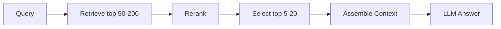

# RAG - 07c：Reranker：召回不是结束，重排才决定谁进入上下文

## 学习目标（本节结束后你能做到什么）

1. 你能说明为什么高 recall 的召回结果并不等于高质量上下文，reranker 在 RAG 里到底补的是哪一刀。
2. 你能区分 bi-encoder、cross-encoder、late interaction、LLM-as-reranker 的本质差别。
3. 你能根据延迟预算和质量目标设计 `retrieve -> rerank -> assemble context` 这条链路。
4. 你能把 2024-2026 的最新演化讲清楚：多语言 reranker、结构化数据 rerank、ColBERT 生产化、向量库内建多阶段重打分。
5. 面试里被问到“为什么不直接把 topK 召回结果塞给模型”，你能答得既有原理又有工程味道。

---

## 1. 先把问题摆正：召回负责“别漏”，重排负责“谁值得占上下文”

检索系统里经常有一个危险误解：

`只要把相关文档召回进 topK，问题就解决了。`

这句话只对了一半。

召回阶段的目标通常是：

- 别把相关文档漏掉
- 候选池覆盖尽量广

但生成阶段真正关心的是：

- 哪几段最值得进入 prompt
- 哪几段最能直接支撑答案
- 哪几段之间组合起来噪声最小

这两个目标并不一样。

举个很典型的例子：

用户问：

`员工离职后，门禁权限多久停用？`

召回 top 20 里可能同时有：

- 离职交接制度
- 门禁系统说明
- 人事审批流程
- 实习生管理办法
- 安保巡检规定
- 旧版本制度

从“有无相关信息”看，top 20 不算差。  
但从“拿哪 5 段给模型”看，差别非常大。

Reranker 的角色就是：

`在已经不太离谱的候选池里，重新判断哪几段与当前 query 最相关、最直接、最值得占 token。`

---

## 2. 为什么 embedding 检索本身不够做最终排序

### 2.1 bi-encoder 的优点，也是它的局限

embedding 检索之所以快，是因为：

- query 单独编码
- 文档单独编码
- 检索时只做向量相似度

这带来的好处是可预计算、可 ANN 加速。  
但代价也很明显：

`query 和 document 在打分前并没有真正“见面”。`

于是它特别擅长做：

- 粗筛
- 大规模召回
- 语义邻域搜索

但不擅长做：

- 细粒度语义对齐
- 否定、条件、比较、时间关系判断
- query 某个局部约束是否被文档真正满足

比如：

- `A 和 B 的区别是什么`
- `不是管理员时能否删除记录`
- `Q2 收入相比 Q1 增长多少`

这类问题，单向量相似度经常不够精。

### 2.2 召回阶段天然偏 recall，不偏 precision

召回器的逻辑通常是：

- 宁可多拿一点
- 别把正确答案漏掉

而 reranker 的逻辑是：

- 宁可少一点
- 但留下的必须更准

这就是为什么“召回分”和“最终进入上下文的资格”不能混为一谈。

---

## 3. 原理：Reranker 在做 query-document 的联合相关性判断

### 3.1 Cross-encoder：最经典也最直观

cross-encoder 的输入是：

```text
[CLS] query [SEP] passage [SEP]
```

它直接让模型同时看到 query 和 passage，然后输出相关性分数。

优点：

- query 和文档真正联合编码
- 细粒度语义判断强
- 常常显著优于只靠 embedding 相似度排序

缺点：

- 不能像向量库那样对整个库预编码
- 每个 query-doc pair 都要单独过一遍模型
- 候选多时成本会迅速上升

所以它非常适合做`第二阶段精排`，不适合做全库第一阶段检索。

### 3.2 Late interaction：介于 bi-encoder 和 cross-encoder 之间

以 ColBERT 为代表的 late interaction 路线做的是折中：

- query 和文档仍然分别编码
- 但不是压成单向量，而是保留 token 级多向量表示
- 打分时做 token-level matching

ColBERTv2 论文里明确指出：

- late interaction 在效果上比单向量检索更强
- 但会带来更大空间开销
- ColBERTv2 通过压缩机制把这一空间开销压缩了 6-10 倍

这条路线的价值在于：

`它把“更细粒度的匹配”带进了检索层，而不必每次都跑全量 cross-encoder。`

所以到 2025-2026，它越来越常被用在：

- 第二阶段重打分
- 高质量检索系统
- 对延迟敏感但又追求比单向量更细判断的场景

### 3.3 LLM-as-reranker：最强但最贵的裁判

如果让通用 LLM 直接判断：

- 这段是否回答了问题
- 哪一段更该排前面

质量常常还会继续提高，尤其在：

- 长文档
- 半结构化数据
- 表格、代码、JSON
- 多语言复杂问句

但问题同样明显：

- 慢
- 贵
- 难批量化
- 输出稳定性和校准比专门 reranker 差

所以 LLM rerank 更像：

- 高价值 query 的终极精排
- 离线蒸馏和标注器
- 或复杂 agent pipeline 里的小流量“高级裁判”

不是生产默认第一选择。

---

## 4. 2024-2026 的演化：rerank 从“可选优化”变成了检索栈标准件

### 4.1 2023：cross-encoder rerank 成为生产 RAG 的分水岭

2023 年很多团队第一次意识到：

- 只靠 dense topK，结果里噪声太多
- topK 调大，答案更完整，但污染更严重
- topK 调小，又容易漏关键片段

reranker 之所以重要，就是因为它能同时缓解这两个矛盾：

- 第一阶段拿更多候选
- 第二阶段重新压缩成更精的上下文

这也是为什么 Cohere Rerank、bge-reranker 这类模型迅速流行。

### 4.2 2024：reranker 开始从“英文文本重排”扩展到“多语言、代码、结构化文档”

Jina 在 2024 年 6 月发布 Jina Reranker v2 时，把方向讲得很清楚：

- 多语言
- Agentic RAG
- function calling / text-to-SQL 感知
- 代码搜索
- 相比 v1 提升 6 倍速度
- 相比 `bge-reranker-v2-m3` 文档处理吞吐可达 15 倍

这说明 reranker 的战场已经不是传统 web search 那种“英文短段落排序”，而是：

`复杂企业数据上的相关性判断。`

### 4.3 2024-2025：Anthropic 把 reranking 放回“检索失败率”这个核心指标里

Anthropic 在 Contextual Retrieval 博客里没有把 rerank 当锦上添花，而是明确纳入 retrieval failure rate 指标：

- contextual embeddings + contextual BM25：失败率下降 49%
- 再结合 reranking：下降 67%

这件事非常值得记住。  
它说明顶尖团队已经不把 rerank 看成“最后再调调”，而是把它视作：

`决定哪些证据真正有资格进入 prompt 的关键层。`

### 4.4 2025-2026：rerank 成为平台能力，而不只是模型能力

到 2026 年，产业侧有两个明显变化：

1. `平台层 API 稳定化`
   - Cohere v2 Rerank API 直接以 query + documents -> ordered results 的形式提供服务
   - 模型版本持续升级到 `rerank-v3.5`、`rerank-v4.0-pro`

2. `向量库/检索引擎支持多阶段重打分`
   - Qdrant 原生支持 coarse-to-fine 多阶段 query
   - dense 预召回后可再用 full vector / multi-vector / ColBERT 重打分

这意味着 rerank 正在从“应用层自己 glue 的一个模型调用”，变成`检索系统的标准 stage`。

---

## 5. 一个成熟的 RAG 链路里，reranker 该放在哪

### 5.1 标准位置：召回之后、上下文组装之前

最常见结构是：



这里每一步的目标不同：

- Retrieve：高召回
- Rerank：高精度
- Assemble：去冗余、保多样、控制 token

### 5.2 候选池不要太浅

一个高频误区是：

- 召回 top 10
- rerank top 10

这几乎等于没做 rerank。  
因为你没有给它足够的“重排空间”。

更合理的常见范围是：

- 第一阶段召回：50-200
- 第二阶段 rerank：压到 5-20

具体数值取决于：

- 文档密度
- query 类型
- 延迟预算
- reranker 吞吐

### 5.3 文档粒度要对

rerank 的对象最好是：

- 有完整局部语义的 chunk
- 而不是巨大父文档
- 也不是碎到没有上下文的小句子

如果你拿 4k token 的长段直接 rerank：

- 成本高
- 还容易因为截断丢掉关键信号

如果你拿 1 句碎片去 rerank：

- 分数不稳定
- 最后进入 prompt 还得回父块补上下文

所以 reranker 和 chunk 设计天然是耦合的。

---

## 6. 不同 reranker 路线怎么选

### 6.1 Cross-encoder：默认起点

适合：

- 企业知识库问答
- 规模不是极端夸张
- 希望质量先上来

优点：

- 效果稳
- 工具多
- 易于替换

缺点：

- 线上吞吐有限

### 6.2 ColBERT / late interaction：高质量检索系统的折中点

适合：

- 候选很多
- 希望比单向量更强
- 又不想每个 pair 都跑重 cross-encoder

代价：

- 存储和系统复杂度上升

### 6.3 API 型 reranker：最快落地

像 Cohere 这种托管 API，优点很明显：

- 上手快
- 模型持续升级
- 多语言和长文支持成熟

但要注意：

- 成本
- 数据出域
- 长文截断
- 高并发预算

### 6.4 LLM rerank：高价值问题的特种部队

适合：

- 关键 query
- 复杂表格/代码/长文
- 小流量高价值

不适合：

- 全量默认链路

---

## 7. Reranker 最容易踩的 7 个坑

### 7.1 候选池太浅

rerank 不是 magic。  
如果相关文档根本没进候选池，它无能为力。

### 7.2 候选池太脏，却期待 rerank 全救回来

如果第一阶段召回质量极差，reranker 只是从垃圾堆里挑相对不那么差的。

### 7.3 把 rerank 分数当成跨 query 可比的绝对概率

很多 reranker 的分数更适合当前 query 内排序，不适合跨 query 统一阈值。

### 7.4 不考虑截断

Cohere 文档就明确写了：长文档会按 `max_tokens_per_doc` 截断。  
如果你的相关信息总在后半段，效果会直接打折。

### 7.5 把相邻重复 chunk 都送进 rerank

这样会浪费候选位，导致 reranker 反复在同一文档附近做细抠。

### 7.6 只看 top1，不看进入 prompt 后的整体质量

reranker 的最终目标不是单条排序漂亮，而是：

- 进入上下文的组合更好
- 噪声更低
- 证据更直接

### 7.7 忽视延迟和批处理

如果你线上每个请求都 rerank 200 条、每条 2k token，又不做 batch，那延迟和成本一定会失控。

---

## 8. 一个靠谱的生产默认实现

```python
def retrieve_then_rerank(query: str):
    candidates = hybrid_retriever.search(query, top_k=100)

    # 先做轻度去重和父文档配额控制，避免单文档占满候选池
    candidates = diversify_candidates(candidates, per_parent_limit=3)

    reranked = reranker.rerank(
        query=query,
        documents=[c.text for c in candidates],
        top_n=12,
    )

    return [candidates[item.index] for item in reranked]
```

如果要再进一步升级，可以加：

- top 100 dense+BM25 候选
- ColBERT 二阶段重打分
- LLM rerank 只用于前 10 条 tie-break

---

## 9. 面试时怎么回答，才像真的做过检索系统

如果面试官问：

`为什么不直接把 top 20 召回结果全给模型？`

你可以这样答：

> 因为召回阶段的目标是高 recall，不是高 precision。top20 往往混有大量边缘相关片段，直接塞给模型会造成上下文污染、增加 token 成本，并放大 lost-in-the-middle 问题。reranker 的作用是对 query 和候选片段做联合相关性判断，把“可能相关”压缩成“最值得占上下文预算”的少量证据。

如果面试官再问：

`cross-encoder 和 ColBERT 的区别是什么？`

你可以答：

> cross-encoder 是 query-doc 联合编码，精排能力强但计算贵；ColBERT 是 late interaction，保留 token 级多向量表示，在效果和效率之间做折中。前者更像最强裁判，后者更像更聪明的检索器或轻量精排器。

---

## 小结

1. 召回的任务是`别漏`，reranker 的任务是`谁值得进 prompt`。
2. bi-encoder 适合粗筛，cross-encoder 适合精排，ColBERT 处在中间地带，LLM rerank 是高成本高上限方案。
3. 2024-2026 的趋势不是“是否要 rerank”，而是“rerank 用什么形式、放在哪一层、如何平台化”。
4. 生产链路里，`retrieve top 50-200 -> rerank -> 选 top 5-20` 是最常见的稳健结构。
5. 没有 reranker 的 RAG，往往不是召回不到，而是`把太多不该进上下文的东西带进去了`。

---

## 检查站

1. 为什么说 reranker 解决的是 precision 问题，而不是 recall 问题？
2. ColBERT 为什么常被视为 bi-encoder 和 cross-encoder 之间的折中？
3. 如果线上延迟太高，你会优先缩 rerank 候选数、换模型，还是把 rerank 干掉？为什么？

---

## 参考与延伸阅读

- Anthropic, *Introducing Contextual Retrieval*  
  https://www.anthropic.com/engineering/contextual-retrieval
- Santhanam et al., *ColBERTv2: Effective and Efficient Retrieval via Lightweight Late Interaction* (NAACL 2022)  
  https://aclanthology.org/2022.naacl-main.272/
- Jina AI, *Jina Reranker v2 for Agentic RAG* (2024-06-25)  
  https://jina.ai/zh-CN/news/jina-reranker-v2-for-agentic-rag-ultra-fast-multilingual-function-calling-and-code-search/
- Cohere Docs, *Rerank API (v2)*  
  https://docs.cohere.com/reference/rerank
- BAAI, *bge-reranker-v2-m3*  
  https://huggingface.co/BAAI/bge-reranker-v2-m3
