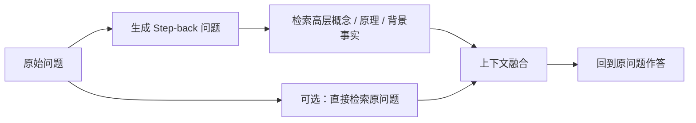

# RAG - 08d：Step-back Prompting：先退一步抽象，再回来检索与推理

## 学习目标（本节结束后你能做到什么）

1. 你能讲清 Step-back Prompting 的核心原理：为什么`先抽象、再求解`会比直接回答更稳。
2. 你能区分 Step-back、HyDE、query decomposition、多路召回之间的边界，而不是把它们都叫“query rewrite”。
3. 你能判断什么类型的问题适合做`query abstraction`，什么类型的问题一抽象就会把关键约束抽没。
4. 你能把 2024-2026 的演化讲出来：Step-back 从一个手工 prompt 技巧，逐渐被吸收到`自适应 query understanding`体系里。
5. 面试里如果被追问“Step-back 到底是在帮检索，还是在帮推理”，你能给出一个不含糊的答案。

---

## 1. 先把问题摆正：Step-back 不是“换个说法问一遍”，而是把问题抬到更高抽象层

很多人第一次看到 Step-back Prompting，会把它理解成：

- 把 query 改写一下
- 或者先问一个更宽泛的问题

这只抓住了表面。

Step-back Prompting 的真正关键不在“改写”，而在：

`把原问题里的低层细节，先映射成更高层的概念、原则或语义框架。`

原始问题可能是：

`Estella Leopold 在 1954 年 8 月到 11 月之间在哪所学校？`

直接答这个问题很难，因为：

- 时间约束细
- 实体信息碎
- 模型容易在多段时间线上走偏

Step-back 之后，问题变成：

`Estella Leopold 的教育经历是什么？`

这个新问题并不是原问题的同义改写。  
它做了两件事：

1. 把“具体月份区间”抽到“教育轨迹”这个高层概念
2. 让检索和推理先围绕这个概念搭起骨架，再回到原问题

这就是 Step-back 最容易被忽略的地方：

`它不是沿着原问题平移，而是沿着抽象层级向上走了一步。`

---

## 2. 原理：为什么“先抽象”会让检索和推理都变得更容易

### 2.1 原问题常常充满局部细节，但答案依赖的是更高层结构

很多复杂问题都存在这个现象：

- 表面问题里堆满了细节
- 真正决定答案的，却是某个更高层原则

比如：

- 物理题表面是在问数值变化，本质上是在考`理想气体定律`
- 时间问答表面是在问某个时间片，本质上是在考`时间线 / 生涯轨迹`
- 多跳问答表面在问最终结论，本质上是在考`实体关系链`

如果模型直接在细节层做推理，就容易出现两类错误：

1. `检索错位`
   - 细节太窄，检索不到最有用的背景事实

2. `中间推理走偏`
   - 模型在局部约束里兜圈子，却没抓住真正支撑答案的第一性原则

Step-back 的作用就是：

`先把问题投影到更稳定、更容易检索、更容易组织推理的语义层。`

### 2.2 Step-back 是“抽象引导推理”，不是“抽象替代推理”

ICLR 2024 原始论文的核心思想叫：

`Abstraction-grounded Reasoning`

也就是：

- 先抽象出高层概念 / 原理
- 再基于这些高层概念 / 原理，回到原题做推理

这里一定要注意：

`Step-back 并不是让模型停留在高层概念上。`

它最终还是要回到原始问题。  
抽象层的价值是：

- 给推理找骨架
- 给检索找锚点
- 给中间步骤降噪

所以它更像：

- 先看地图
- 再走街道

而不是只看地图就宣布已经到达目的地。

### 2.3 对 RAG 来说，它最直接的价值是“把难检索的问题改造成更可检索的问题”

Step-back 论文在 Knowledge QA 和 Multi-hop 任务上报告了明显提升。  
论文里的关键机制其实非常适合用 RAG 语言来理解：

- 原始 query 太细，难直接检索
- Step-back query 更贴近语料里高层组织方式
- 先召回“教育经历”“关键原理”“背景关系”这类更稳定的材料
- 再利用这些材料回答原始问题

原论文摘要里明确提到：

- 在 TimeQA 上带来 27% 的提升
- 在 MuSiQue 上带来 7% 的提升
- 在 MMLU 的 Physics / Chemistry 上分别带来 7% 和 11% 的提升

这里最值得记住的不是具体数字，而是它揭示的结构性结论：

`很多 retrieval failure，不是库里没有答案，而是 query 站错了语义层。`

---

## 3. 标准流程：Step-back 不是单轮改写，而是“两阶段抽象-回落”

可以把它画成这样：



这个流程里最关键的是两点。

### 3.1 Step-back 问题不是最终问题

它只是一个中间桥梁。  
最终答案必须仍然围绕用户原始问题组织。

### 3.2 最终排序和回答，最好回到原问题来做

哪怕你用 Step-back 分支召回了很多好材料，最终：

- rerank 最好还是对着原问题打分
- synthesis 也最好显式把“原问题 + step-back 背景”一起给模型

否则容易出现：

- 检索出来的都是好背景
- 但最后没有把具体约束补回来

这就是 Step-back 最常见的一个副作用：

`知道了大方向，却丢了原问题的细节边界。`

---

## 4. 它和 HyDE、多路召回、Query Decomposition 到底有什么区别

这是面试里非常容易被追问的点。

### 4.1 和 HyDE 的区别：一个往“更高抽象”走，一个往“更像答案文档”走

HyDE 做的是：

- 生成一段假想答案文档
- 让 query 更接近 document 分布

Step-back 做的是：

- 生成一个更高层的问题或原则
- 让 query 更接近`解释这个问题所需的上位概念`

所以两者方向完全不同：

- `HyDE`：向“答案长什么样”靠近
- `Step-back`：向“这个问题依赖什么高层原则”靠近

一个更像文档空间投影，  
一个更像概念空间上卷。

### 4.2 和 Query Decomposition 的区别：一个向上抽象，一个向下拆分

Query decomposition 做的是：

- 把复杂问题拆成几个更小子问题

Step-back 做的是：

- 把复杂问题抬到一个更上位的问题

可以这么记：

- `decomposition`：纵向往下，拆成更细
- `step-back`：纵向往上，提到更泛

例如：

`Redis 和 Memcached 在持久化和淘汰策略上有什么区别？`

decomposition 会拆成：

- Redis 持久化
- Memcached 持久化
- Redis 淘汰策略
- Memcached 淘汰策略

step-back 则更可能先问：

- 缓存系统设计里，持久化和淘汰策略分别解决什么问题？

一个是在拆子任务，  
一个是在找上位框架。

### 4.3 和多路召回的关系：Step-back 常常是多路召回中的一个“抽象分支”

多路召回是总框架：

- 可以有原 query 分支
- 可以有同义改写分支
- 可以有子问题分支
- 也可以有 Step-back 分支

所以更准确的关系是：

`Step-back 不是多路召回的替代，而是多路召回里一种很有价值的 query transform。`

### 4.4 和 Query Routing 的区别：routing 决定走哪条路，step-back 决定这条路里怎么变形 query

routing 的问题是：

- 去哪个知识源
- 用哪个检索器

step-back 的问题是：

- 在已经确定的检索路径里，query 应该先怎样抽象

所以 routing 是调度层，  
step-back 是 query understanding 层。

---

## 5. 2024-2026 的演化：Step-back 还重要，但它的角色已经从“手工技巧”转向“自适应抽象策略”

### 5.1 2024：ICLR 原始论文把“抽象”明确提成一个独立能力

ICLR 2024 的论文《Take a Step Back》最重要的贡献，不只是提出一个 prompt。

它真正把一个长期存在、但没被系统化表达的经验说清楚了：

`复杂问题常常先需要抽象，再需要推理。`

论文里还有两个很值得记住的发现：

1. 抽象这件事对 LLM 来说相对容易通过少量示例学会  
2. 真正更难的瓶颈，仍然是后续 reasoning

这很符合工程直觉。  
很多时候模型不是完全不知道该看什么，而是缺少一个正确的“高层切入角度”。

### 5.2 2025：UniRAG 把 Step-back 归入“query abstraction”这条更大的方法谱系

ACL 2025 的 UniRAG 很有代表性。  
它把 query augmentation 明确分成三类：

- query paraphrasing
- query expansion
- query abstraction

Step-back 就属于第三类。  
这个分类很重要，因为它说明 2025 年研究界已经不再把 Step-back 看成一个孤立技巧，而是把它放进：

`统一 query understanding / query augmentation`框架里。

这会直接改变工程上的思路：

- 不是“要不要开 Step-back”
- 而是“当前 query 该用 paraphrase、expansion 还是 abstraction”

### 5.3 2025：Q-PRM 这类工作开始强调“query rewriting 需要按复杂度自适应，而不是一刀切”

EMNLP 2025 Findings 的 Q-PRM 讨论的是：

- query rewriting 容易出现 over-refinement 和 under-refinement
- 问题复杂度不同，需要不同强度和不同步骤的改写

虽然它不是专门讲 Step-back，但对 Step-back 很有启发：

`不是每个 query 都值得抽象。`

有些 query 一抽象就更好；  
有些 query 一抽象就把关键约束抽没了。

这也是 2025 以后一个很明显的趋势：

- 手工固定 prompt 的重要性下降
- 自适应 query transformation 的重要性上升

### 5.4 2026：工业系统开始把“自动 query rewrite”做成平台能力，但不会替你决定什么时候该抽象

到 2026 年，OpenAI 的 Vector Store Search API 已经把 `rewrite_query` 作为显式参数提供出来。  
这说明 query rewrite 已经从论文技巧进入平台能力层。

但这里要非常清醒：

`平台能帮你重写 query，不等于平台天然知道什么时候该做 Step-back abstraction。`

因为 Step-back 的难点不是“改写本身”，而是：

- 要不要抽象
- 抽到哪一层
- 抽完后是否丢失原问题约束

所以到 2026 年，Step-back 更合理的定位是：

`一个由路由器/分类器/策略层按需触发的 abstraction branch。`

而不是一个对所有 query 默认打开的通用开关。

---

## 6. 什么类型的问题特别适合 Step-back

### 6.1 时间线与生涯轨迹类

比如：

- 某人在某段时间在哪里
- 某政策在某个时间点是否生效
- 某产品版本在某阶段具备什么能力

这类问题很适合先找：

- 时间线
- 演化史
- 履历 / 版本轨迹

### 6.2 原理驱动的 STEM / 技术问题

比如：

- 为什么压强会这样变化
- 为什么这个分布式系统会出现脑裂
- 为什么这个 SQL 计划会退化

这些问题表面问的是具体现象，本质问的是：

- 第一性原理
- 系统机制
- 通用约束

### 6.3 多跳问题里“缺少骨架”的那一类

不是所有多跳都需要先拆。  
有些多跳更需要先建立一个上位关系框架。

例如：

- `这家公司为什么在那几年同时削减研发又扩张海外市场？`

它可能先需要抽到：

- 公司当时的整体战略和财务约束

### 6.4 口语化、含混但背后有明确领域框架的问题

比如：

- `这个人为什么后来就不能进系统了？`
- `这个客户怎么突然不能下单了？`

表面很口语，背后其实对应：

- offboarding 流程
- 风控冻结流程
- 权限生命周期

这类问题常常适合先抽成：

- 权限回收流程
- 订单冻结规则

---

## 7. 什么类型的问题不适合 Step-back

### 7.1 精确定位类

例如：

- 错误码
- 订单号
- 合同编号
- API 参数名
- 配置项名

这类问题需要词法约束和 exact lookup，  
一抽象通常就会把最关键的检索信号丢掉。

### 7.2 约束极强的问题

比如：

- `2025 年 3 月 12 日版本的第 7 条怎么写`
- `status=17 且 source=partner 的订单为什么失败`

这类问题一旦往上抽，极容易把真正决定答案的限制条件抽没。

### 7.3 语料本来就没有高层结构

如果你的库里全是：

- 零散聊天记录
- 短工单
- 没整理过的日志片段

那 Step-back 可能并没有明显的高层概念可以抓。  
此时它生成的抽象 query 很可能比原 query 更空。

### 7.4 ACL、时间、来源过滤非常强的场景

如果系统里：

- 权限边界很硬
- 时间窗口很窄
- 来源必须严格限定

Step-back 不是不能用，但它绝不能绕过这些硬约束。  
也就是说：

`先抽象`不等于`先放宽边界`。

---

## 8. 生产里怎么把 Step-back 用对：不是替换原 query，而是增加一个“抽象分支”

### 8.1 最稳的默认结构：原 query + step-back query 并联

不要把 Step-back 当成唯一 query。  
更稳的做法是：

- 原 query 保留精确约束
- Step-back query 去找高层背景
- 两路候选汇总后再 rerank

这样做的好处是：

- 不会完全丢掉细节
- 高层背景和低层证据可以互补

### 8.2 Step-back 检索到的内容，通常更适合当“支撑背景”，不一定适合独占 top1

比如用户问：

`员工离职后多久停用门禁？`

step-back 分支可能检索到：

- offboarding 总流程
- 权限生命周期制度

原 query 分支可能检索到：

- 门禁回收条款

最好的上下文往往不是只拿其中一路，而是：

- 一两段高层流程背景
- 一两段直接命中的具体条款

### 8.3 Selective Step-back 比全局 Step-back 更现实

很实用的 gating 规则包括：

- `why/how/explain` 类更适合开
- 时间线 / 生涯轨迹 / 版本演化类更适合开
- query 很短但像在问机制时更适合开
- 含错误码、ID、版本号、配置键时更适合关

### 8.4 Step-back 的产物最好是“问题”或“原则”，而不是长篇小作文

HyDE 适合生成伪文档；  
Step-back 更适合生成：

- 一个高层问题
- 一组原则
- 一个上位概念

如果你把 Step-back 也写成大段文章，往往会把它做成 HyDE 的变体，失去方法边界。

---

## 9. 一个可落地的实现骨架

```python
def step_back_retrieve(query: str, user_ctx):
    step_back_query = llm.generate(
        f"""
        请把下面的问题提升到更高抽象层，
        生成一个更容易检索背景知识的高层问题或原则短语。
        不要回答原问题，不要丢掉核心主题。

        原问题：{query}
        """
    ).strip()

    original_hits = hybrid_retriever.search(
        query=query,
        top_k=40,
        filter=user_ctx.filters,
    )

    abstract_hits = hybrid_retriever.search(
        query=step_back_query,
        top_k=40,
        filter=user_ctx.filters,
    )

    candidates = merge_with_branch_tags(
        original_hits,
        abstract_hits,
        total_limit=80,
    )

    reranked = reranker.rerank(
        query=query,
        documents=candidates,
        top_k=12,
    )

    return {
        "step_back_query": step_back_query,
        "results": reranked,
    }
```

这里最关键的三个点是：

1. `filter` 对两个分支都生效  
2. rerank 仍然对着原问题  
3. 输出里保留 `branch tag`，便于后续分析 Step-back 分支是否真的贡献了结果

---

## 10. Step-back 最容易踩的 8 个坑

### 10.1 抽象过头

原问题是：

`员工离职后多久停用门禁？`

你抽成：

`企业安全管理的原则是什么？`

这就已经太高了。  
抽象层一旦过头，检索结果会泛到失真。

### 10.2 抽象后忘了回原题

这是最常见错误之一。  
模型拿到一堆高层背景后，开始输出一篇通用说明文，却没真正回答用户问题。

### 10.3 把 Step-back 当 decomposition 用

它们方向不同。  
该拆的时候你去抽象，结果往往会把问题变糊。

### 10.4 把 Step-back 当 HyDE 用

Step-back 的产物应该是`高层问题 / 原理`，  
不是“写一篇看似答案的文档”。

### 10.5 对 exact lookup 也默认打开

这是效果最容易变差的地方。

### 10.6 不做 branch-level 观测

你需要知道：

- Step-back 分支带来了哪些新增命中
- 哪类 query 它最有效
- 哪些 query 它只是带来了冗余背景

### 10.7 不控制上下文配额

如果 Step-back 分支拿到大量高层背景，很容易把上下文预算挤满，反而淹没原问题的直接证据。

### 10.8 误以为 Step-back 可以替代更强检索器

它是 query-side 的补丁，不是 retriever-side 的替代。  
如果底层 embedding、hybrid retrieval、rerank 很弱，Step-back 不会神奇救场。

---

## 11. 面试里怎么答，才像真正理解过这个方法

如果面试官问：

`Step-back Prompting 到底是在帮检索，还是在帮推理？`

你可以这样答：

> 两边都在帮，但直接收益最大的通常是 query understanding 和 retrieval。它通过把原问题提升到高层概念或原则，先找到更稳定的背景事实，再回到原问题推理。对 reasoning 也有帮助，因为它给中间推理提供了一个更稳的骨架。但如果底层检索很弱，Step-back 也不会凭空创造证据。

如果面试官再问：

`它和 HyDE 有什么本质区别？`

你可以答：

> HyDE 是把 query 变成“像答案文档”的表达，更接近 document manifold；Step-back 是把 query 变成“像上位概念或原则”的表达，更接近 abstraction manifold。一个更偏 document-shaped expansion，一个更偏 concept-level abstraction。

如果面试官继续追问：

`为什么不是所有 query 都开 Step-back？`

你可以答：

> 因为 query abstraction 有明显的适用边界。机制解释、时间线、原理驱动、多跳框架型问题适合；错误码、ID、配置项、强约束定位问题不适合。2025 之后很多工作也在强调 query augmentation 要自适应选择，不能一刀切。

---

## 小结

1. Step-back Prompting 的本质，不是换个说法，而是把问题提升到更高抽象层。
2. 它最适合解决的是：原问题细节很多，但答案依赖更高层概念、原理或轨迹结构的场景。
3. 在 RAG 里，它常常通过`更容易检索到高层背景事实`来发挥作用。
4. 它和 HyDE、decomposition、多路召回不是一回事；更准确地说，它是 query abstraction 这条路线上的一个代表方法。
5. 到 2026 年，它更适合作为一个`selective abstraction branch`存在，而不是对所有 query 默认开启。

---

## 检查站

1. 为什么说 Step-back 的核心不是 paraphrase，而是 abstraction？
2. 如果一个 query 同时包含“错误码 + 机制解释”，Step-back 分支该怎么和原 query 分支配合？
3. 什么时候 Step-back 会把问题“抽空”，从而让检索结果变泛？

---

## 参考与延伸阅读

- Zheng et al., *Take a Step Back: Evoking Reasoning via Abstraction in Large Language Models* (ICLR 2024)  
  https://openreview.net/forum?id=3bq3jsvcQ1
- Li et al., *UniRAG: Unified Query Understanding Method for Retrieval Augmented Generation* (ACL 2025)  
  https://aclanthology.org/2025.acl-long.693/
- Ye et al., *Q-PRM: Adaptive Query Rewriting for Retrieval-Augmented Generation via Step-level Process Supervision* (Findings of EMNLP 2025)  
  https://aclanthology.org/2025.findings-emnlp.817/
- OpenAI API Reference, *Search vector store*  
  https://developers.openai.com/api/reference/resources/vector_stores/methods/search
