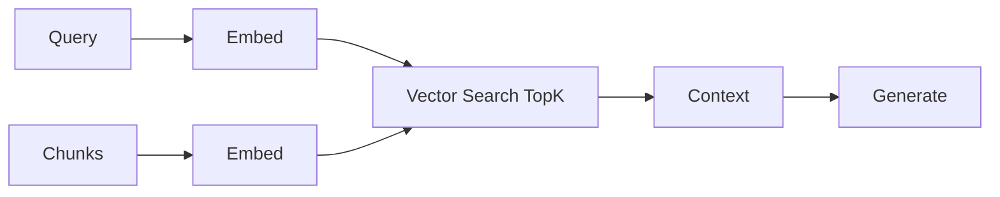
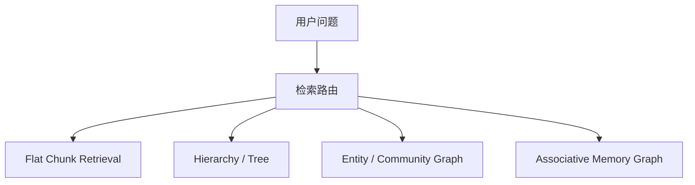
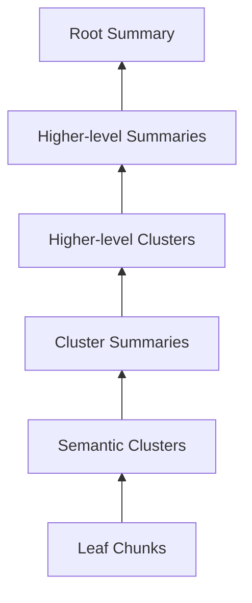
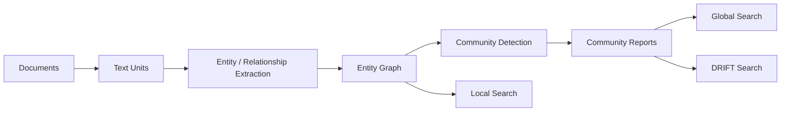
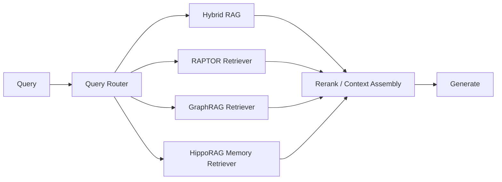

# RAG - 第 9 课：GraphRAG、RAPTOR、HippoRAG：层次化与图谱记忆

## 学习目标（本节结束后你能做到什么）

1. 你能讲清为什么 `flat chunk + topK` 的经典 RAG，对`全局性问题`、`多跳关系问题`、`长文抽象问题`经常天然吃亏。
2. 你能区分 `RAPTOR`、`GraphRAG`、`HippoRAG` 三条路线分别在建什么结构：`摘要树`、`语料图`、`关联记忆图`。
3. 你能解释 RAPTOR 的递归聚类摘要、GraphRAG 的社区报告与 local/global/DRIFT 检索、HippoRAG 的 `Personalized PageRank` 各自解决什么。
4. 你能把 2024 到 2026 这条线讲出来：为什么行业从“给 chunk 做向量”走向“给知识加拓扑”，以及为什么后续重点变成了`降本`、`剪枝`、`增量更新`、`记忆化`。
5. 面试里如果被问“GraphRAG 值不值得上生产”“RAPTOR 和 GraphRAG 有什么本质区别”“HippoRAG 为什么不是普通 knowledge graph QA”，你能给出带边界的回答。

---

## 1. 先把问题摆正：经典 RAG 真正缺的，不只是更多 chunk，而是知识的“拓扑”

我们先回忆最经典的 RAG：



这套链路对很多问题很好用，尤其是：

- 明确实体查询
- FAQ
- 局部事实查找
- 文档里“答案就藏在某几段”的问题

但它对三类问题会持续暴露结构性短板：

### 1.1 全局性问题

例如：

- “这 2 万篇事故报告里，最常见的根因模式是什么？”
- “这个季度所有周报的主要主题变化是什么？”

这类问题不是在找某个局部 chunk，  
而是在做：

`query-focused summarization over the whole corpus`

微软 2024 的 GraphRAG 论文就直说了这一点：  
传统 RAG 对整个语料的 global question 往往失灵，因为它本质不是显式检索问题，而是`面向整个语料的问答式总结`。

### 1.2 多跳关系问题

例如：

- “A 公司和 B 政策之间通过哪些中间事件相关？”
- “这个药物副作用和哪些临床试验结论存在间接联系？”

这类问题的答案往往分散在多处文本里，  
关键不只是“找到相似段落”，而是：

`把分散事实沿关系链串起来`

### 1.3 长文抽象问题

例如：

- “这本 200 页年报里，资本开支变化和毛利率压力之间的主线是什么？”
- “这篇长篇技术 RFC 的设计动机、约束和权衡分别是什么？”

问题既需要高层摘要，又需要叶子级证据。  
纯粹用固定 chunk 检索，常常会出现：

- topK 都是局部细节，没有全局主线
- 或者拿到一堆相似但冗余的段落
- 最后 token 窗口被噪声塞满

所以这类工作的共同出发点不是：

- “再调一调 topK”

而是：

`给知识加结构，让检索不再只是在平面 chunk 上找近邻。`

---

## 2. 一个统一视角：这三条路线其实在补三种不同的结构缺口

很多人学到这里会把各种“图谱 RAG”“层次化 RAG”混成一类。  
更好的记法是：它们在补不同类型的拓扑。



### 2.1 RAPTOR：补的是“抽象层级”

它的核心不是实体图，而是：

- 把底层 chunk 聚成簇
- 为每个簇生成摘要
- 递归向上形成树

也就是：

`一个多层摘要树`

它解决的是：

`同一份知识需要在不同抽象层级上被检索`

### 2.2 GraphRAG：补的是“跨文档关系与语料全局结构”

它的核心是：

- 从文本中抽取实体和关系
- 在实体图上做 community detection
- 对社区生成多层 community reports

也就是：

`一个跨文档的社区化知识图`

它解决的是：

`如何对整个语料做全局 sensemaking，同时还能回到局部实体证据`

### 2.3 HippoRAG：补的是“联想式记忆与多跳激活”

它更像一个记忆系统，而不是标准企业图谱项目。

核心思路是：

- 用图表示事实和联系
- 把 query 链接到少数种子节点
- 再用 `Personalized PageRank` 在图上传播激活

也就是：

`一个可扩散的关联记忆图`

它解决的是：

`问题和证据不一定直接相似，但它们在关系网络上彼此可达`

这就是这节课最重要的一句话：

`RAPTOR 解决多尺度抽象，GraphRAG 解决全局结构，HippoRAG 解决关联记忆。`

---

## 3. 2024 → 2025 → 2026：这条线到底怎么演化过来的

### 3.1 2024：大家开始正面承认“平面 chunk 检索”不够了

这一年有三篇非常关键：

- `RAPTOR`（2024.01）
- `GraphRAG`（2024.04）
- `HippoRAG`（2024.05）

它们分别代表了三种回答：

- 长文为什么需要`层次摘要树`
- 全局问题为什么需要`语料图 + 社区报告`
- 多跳关联为什么需要`记忆图 + 图扩散`

同年下半年，图增强 RAG 开始走向更工程化：

- `LightRAG`（2024.10）强调 dual-level retrieval 和 incremental update
- 微软发布 `DRIFT Search`（2024.10）与 `dynamic community selection`（2024.11）
- 微软继续发布 `LazyGraphRAG`（2024.11），直接把成本问题摆上台面

### 3.2 2025：重点从“建图”转向“图怎么更便宜、更稳、更可泛化”

2025 的关键变化是：

- `HippoRAG 2`（ICML 2025）开始从“Graph-enhanced RAG”转向“memory”
- `GFM-RAG`（NeurIPS 2025）尝试用 graph foundation model 处理 noisy / incomplete graph
- `PathRAG`（2025 提交，后见 AAAI 2026）明确指出：很多 graph-RAG 的问题不是“没召回”，而是`召回后太冗余`

也就是说，重心开始从：

- “要不要建结构”

转向：

- “结构怎么训练”
- “怎么剪枝”
- “怎么别把 prompt 撑爆”
- “怎么兼顾 factual memory 和 associative memory”

### 3.3 2026：行业更像是在做“结构化检索控制”

截至 `2026-04-23`，我基于上面的论文与微软官方 GraphRAG 演化文档的判断是：

`2026 的重点已经不是“把所有知识都做成大图”，而是让结构检索变得按需、可剪枝、可更新、可路由。`

这是一个推断，不是某一篇论文的原话。  
它主要来自三条信号：

1. 微软官方 GraphRAG 在持续强调 `DRIFT / dynamic community selection / LazyGraphRAG / FastGraphRAG`
2. `HippoRAG 2` 把重点从“graph trick”升级成“non-parametric memory”
3. `PathRAG / GFM-RAG` 这类工作开始集中解决图噪声、提示冗余、泛化性

换句话说，行业并没有走向：

- “以后所有 RAG 都是 GraphRAG”

而是在走向：

- “让不同问题命中不同结构化检索器”

---

## 4. RAPTOR：它不是图谱，而是“多层摘要树”

### 4.1 它在解决什么问题

RAPTOR 论文原话很直接：  
多数传统 RAG 只从语料里取短的连续 chunk，这会限制模型对整体文档上下文的把握。

这句话背后的真实问题是：

`query 的粒度和证据的粒度，往往不是一个层级。`

比如问：

- “这本书的中心论点是什么？”

你需要的是高层摘要。

但问：

- “第 7 章支持这个论点的具体实验是什么？”

你需要的是底层叶子证据。

经典 chunk RAG 没有层级结构，于是只能用同一种 retrieval unit 同时解决高层和底层问题。

### 4.2 核心原理：递归聚类 + 递归摘要

RAPTOR 的核心流程可以压成 6 步：

1. 把文档切成底层 chunks
2. 对 chunks 做 embedding
3. 把语义相近的 chunks 聚成簇
4. 用 LLM 为每个簇生成摘要节点
5. 再对这些摘要节点重复聚类和摘要
6. 最终形成一棵从叶子到根的摘要树



推理时不是只搜叶子，而是：

`在不同层级上检索最合适的节点，再回落到必要的叶子证据。`

这件事非常关键，因为它把检索从：

- “找最像 query 的段落”

改成了：

- “先找到最合适的抽象层，再决定要不要继续下钻”

### 4.3 它为什么有效

因为摘要树提供了一个非常重要的桥梁：

`高层节点负责主题召回，低层节点负责证据着陆。`

所以 RAPTOR 的优势特别适合：

- 长篇单文档
- 章节结构很强的文档
- 需要跨段整合的问答
- 需要在摘要和细节之间来回切换的任务

### 4.4 它的代价与边界

RAPTOR 很强，但一定不要神化。

它的问题在于：

1. `摘要漂移`
   如果某层 summary 失真，后面整棵树都会被带偏。

2. `聚类质量强依赖 embedding`
   聚类错了，摘要就错了。

3. `增量更新不友好`
   新文档加入后，可能要重做相当一部分树。

4. `跨文档关系不是它的强项`
   RAPTOR 的结构是“摘要树”，不是“关系图”。  
   它更擅长多尺度抽象，不擅长复杂实体网络。

### 4.5 什么时候优先考虑 RAPTOR

- 一本书、一个年报、一个 RFC、一个长法条集
- 你的主要痛点是“长文抽象”和“跨章节整合”
- 问题既可能问大意，也可能落到局部证据

如果你的核心问题是：

- 跨文档全局主题
- 多跳实体关系

那 RAPTOR 往往不是第一选择。

### 4.6 Python 骨架：一个最小版 RAPTOR 思路

```python
from __future__ import annotations

from dataclasses import dataclass, field
from typing import List

import numpy as np
from sklearn.cluster import KMeans


@dataclass
class TreeNode:
    text: str
    children: List["TreeNode"] = field(default_factory=list)
    level: int = 0


def embed_texts(texts: List[str]) -> np.ndarray:
    # 真实工程里可替换为 bge / gte / Qwen3-Embedding
    rng = np.random.default_rng(42)
    return rng.normal(size=(len(texts), 128))


def summarize_group(texts: List[str]) -> str:
    # 真实工程里这里会调用 LLM 生成簇摘要
    preview = " | ".join(t[:40] for t in texts[:3])
    return f"Summary({preview})"


def build_raptor_tree(chunks: List[str], branch_factor: int = 4) -> TreeNode:
    current = [TreeNode(text=chunk, level=0) for chunk in chunks]
    level = 0

    while len(current) > 1:
        level += 1
        texts = [node.text for node in current]
        embeddings = embed_texts(texts)
        k = min(branch_factor, len(current))
        labels = KMeans(n_clusters=k, random_state=42, n_init="auto").fit_predict(embeddings)

        next_level = []
        for cluster_id in range(k):
            members = [node for node, label in zip(current, labels) if label == cluster_id]
            summary = summarize_group([node.text for node in members])
            next_level.append(TreeNode(text=summary, children=members, level=level))
        current = next_level

    return current[0]
```

这段代码当然不是论文复现，但它能帮你抓住 RAPTOR 的本体：

`不是“先切块再搜”，而是“先把知识递归压成层级，再做跨层检索”。`

---

## 5. GraphRAG：从“局部检索”走向“整个语料的全局理解”

### 5.1 它在解决什么问题

GraphRAG 2024 论文的标题就已经把野心说透了：

`From Local to Global`

论文指出，传统 RAG 对这类问题表现不好：

- “这个数据集的主要主题是什么？”
- “整体来看，最重要的影响是什么？”

因为这不是在检索一个显式答案片段，而是在：

`对整个语料做问答式总结`

### 5.2 核心原理：实体图 + 社区 + 社区报告

GraphRAG 论文描述的主流程是：

1. 从 source documents 中抽取实体知识图
2. 对相近实体群体生成 community summaries
3. 查询时让每个 community summary 产出 partial response
4. 再把 partial responses 汇总成最终回答

GraphRAG 官方文档后来把这条链路讲得更工程化了：

- text units
- entities / relationships / claims
- community detection
- multi-level community reports
- embeddings 写入向量存储
- 查询时选择 `local / global / DRIFT / basic`



### 5.3 Local Search / Global Search / DRIFT 分别是什么

GraphRAG 官方查询文档把三种模式分得很清楚：

#### Local Search

适合：

- 实体导向的问题
- 需要理解特定对象的问题

它会把：

- 图中的实体与关系
- 原始文本 chunks

一起放进检索和上下文组装里。

#### Global Search

适合：

- 针对整个数据集的抽象问题
- 全局主题、趋势、影响、价值判断

它本质上是：

`在社区报告上做 map-reduce`

好处是全局感强，代价是很贵。

#### DRIFT Search

微软 2024.10 的博客把它定义为：

`combining global and local search`

它的核心思想不是只从命中的局部实体出发，而是把 community information 一起拉进来，  
让 local query 也能借到全局结构。

这很重要，因为真实业务里很多问题并不纯粹是 local 或 global，而是：

- 从一个具体实体出发
- 最后需要追到更大范围的上下文

### 5.4 Dynamic Community Selection：GraphRAG 开始认真解决成本

GraphRAG 的一个现实问题是：

`global search 太贵`

微软 2024.11 的官方博客提出 `dynamic community selection`：

- 从根社区开始
- 先让模型判断社区报告与 query 是否相关
- 不相关就整棵子树剪掉
- 相关才继续往下遍历

官方博客给出的结果很醒目：

- 在 AP News 数据集上，相比静态 global search，平均 token cost 可下降 `77%`
- 如果继续探索到更深层社区，某些指标还会提升，但成本会上涨

这说明一个非常关键的趋势：

`GraphRAG 的问题不再只是“能不能答”，而是“能不能以合理成本答”。`

### 5.5 LazyGraphRAG：把“图增强”做成按需的，而不是预付全款

微软 2024.11 的另一篇博客更激进：`LazyGraphRAG`

它不再像标准 GraphRAG 那样提前做全量 LLM 摘要，而是：

- 用更轻的概念图和共现图构建索引
- 把很多 LLM 推理延后到 query time

官方给出的结论非常强：

- 数据索引成本与 vector RAG 相同
- 只有 full GraphRAG 的 `0.1%`
- 某些设置下，对 global query 的质量接近 GraphRAG global search，但 query cost 低很多

这代表一个非常现实的转向：

`图增强 RAG 不一定非要重离线索引，它也可以是“轻索引 + 重在线推理”的组合。`

### 5.6 FastGraphRAG：官方已经把“便宜但更吵”的路线产品化了

GraphRAG 官方 methods 文档还给出了 `FastGraphRAG`：

- 用 noun phrase extraction 和 co-occurrence 代替大量 LLM 图抽取
- 官方估计 graph extraction 大约占整体索引成本的 `75%`

这意味着：

`如果你的主要目标是 global summarization，而不是高保真实体图探索，FastGraphRAG 可能比标准版更实用。`

但代价也清楚：

- 图更噪
- 实体质量更差
- 不适合对图本身做高精度分析

### 5.7 GraphRAG 的强项与短板

它的强项：

- 全局主题总结
- 跨文档模式发现
- 在大语料上构建语义地图
- local/global 联动

它的难点：

1. `索引成本高`
2. `实体抽取和实体对齐会错`
3. `社区报告可能把证据再摘要一遍，带来二次失真`
4. `增量更新比 flat RAG 更复杂`
5. `权限过滤更麻烦`
   图上的节点、边、社区如果跨租户或跨权限边界，会产生严重风险

所以 GraphRAG 不是“替代一切 RAG”，而是：

`面向全局问题与复杂语料理解的专用结构化检索器`

---

## 6. HippoRAG：不是在做“图问答”，而是在做“联想式检索记忆”

### 6.1 它在解决什么问题

HippoRAG 2024 的出发点不是企业知识图谱，而是：

`如何让 LLM 像长期记忆一样，把新经验组织起来并在需要时联想出来。`

论文把这一点说得很明确：

- 普通 RAG 即使加了检索，也仍然不擅长高效整合大量新经验
- HippoRAG 受 hippocampal indexing theory 启发
- 用 LLM、knowledge graph 和 `Personalized PageRank` 共同完成记忆检索

这个 framing 很重要，因为它让 HippoRAG 和 GraphRAG 的目标立刻区分开：

- GraphRAG 更像“给整个语料建结构化地图”
- HippoRAG 更像“给模型外挂一个会联想的长期记忆”

### 6.2 核心原理：query 不是直接找 chunk，而是先点亮记忆图上的种子

HippoRAG 的关键动作是：

1. 从文档中提取结构化事实
2. 构成图状记忆
3. 把 query 链接到若干种子节点
4. 在图上跑 `Personalized PageRank`
5. 根据扩散后的分数召回相关 passages / facts

为什么 `PPR` 很关键？

因为它允许系统表达这样一种关系：

- 某段文本和问题不一定直接高相似
- 但它和某个强相关事实之间只有一两跳
- 所以应该被“联想式”召回

这和纯 dense retrieval 的差异非常大。  
dense retrieval 更像“相似即相关”，而 HippoRAG 更像：

`可达且有传播权重的，才可能重要。`

### 6.3 它为什么对多跳问题特别有效

HippoRAG 论文里一个非常强的结论是：

- 单次检索下，HippoRAG 可达到或超过像 IRCoT 这样的 iterative retrieval
- 同时更便宜，也更快

这说明一件非常本质的事：

`多跳检索不一定非要多轮 query rewrite，也可以通过图扩散一次完成。`

这就是 HippoRAG 的真正魅力。

### 6.4 HippoRAG 2：从“Graph-enhanced RAG”走向“memory”

2025 的 `From RAG to Memory` 基本可以看作 HippoRAG 2。

这篇工作的批评非常关键：

- 很多结构增强 RAG 在 sense-making 和 associativity 上有提升
- 但在更基础的 factual memory 上反而掉得比标准 RAG 还厉害

HippoRAG 2 的回答是：

- 继续保留 `PPR` 这条主干
- 加强 passages 的深度整合
- 更有效地在在线阶段使用 LLM

论文直接声称它能在：

- factual memory
- sense-making
- associative memory

三类任务上全面超过标准 RAG；  
并在 associative memory 上相对强 embedding baseline 提升 `7%`。

这说明 HippoRAG 2 的意义不只是“图更强了”，而是：

`它开始认真解决“结构化方法为什么常常伤害基础事实检索”这个老问题。`

### 6.5 它适合什么，不适合什么

更适合：

- 多跳 QA
- 事实分散在多处、但彼此有关联的语料
- agent memory / personal knowledge memory
- 想做 continual learning 风格外挂记忆的场景

不那么适合：

- 问题高度依赖权限过滤和新鲜度过滤，但图索引更新机制还没设计好
- 主要目标是对整个语料做宏观综述
- 图抽取质量无法保障

### 6.6 Python 骨架：用 PPR 做联想式检索

```python
from __future__ import annotations

import networkx as nx


def build_memory_graph() -> nx.Graph:
    g = nx.Graph()
    g.add_edge("lead_poisoning", "cinnamon")
    g.add_edge("cinnamon", "ecuador")
    g.add_edge("cinnamon", "recall_notice")
    g.add_edge("recall_notice", "brand_a")
    g.add_edge("recall_notice", "brand_b")

    # passage nodes
    g.add_edge("cinnamon", "passage:batch_inspection_report")
    g.add_edge("ecuador", "passage:import_origin_report")
    g.add_edge("recall_notice", "passage:fda_recall_announcement")
    return g


def associative_retrieve(query_entities: list[str], topk: int = 3):
    g = build_memory_graph()
    personalization = {node: 0.0 for node in g.nodes}
    for entity in query_entities:
        if entity in personalization:
            personalization[entity] = 1.0 / len(query_entities)

    scores = nx.pagerank(g, alpha=0.85, personalization=personalization)
    ranked = sorted(scores.items(), key=lambda x: x[1], reverse=True)
    return [item for item in ranked if item[0].startswith("passage:")][:topk]


print(associative_retrieve(["lead_poisoning", "brand_a"]))
```

这段代码背后的思想，就是 HippoRAG 的灵魂：

`不要只问“哪段最像我”，还要问“从我当前激活的概念出发，哪段最可能沿关系网络被联想到”。`

---

## 7. 2025-2026 的后续进展：大家开始修图，而不是盲目迷信图

这一节很重要，因为它决定你对“GraphRAG 之后”的理解是不是停留在 2024。

### 7.1 LightRAG：双层检索 + 增量更新

LightRAG 2024 把重点放在两个词上：

- `dual-level retrieval`
- `incremental update`

这说明作者已经很清楚产业落地的痛点：

- 不是只要结构更强
- 还要更快
- 还要能更新

如果说 GraphRAG 更像“重型语料结构化”，  
那 LightRAG 更像：

`更轻、更快、更工程友好的 graph-enhanced RAG`

### 7.2 PathRAG：图检索的真实问题，经常不是不足，而是冗余

PathRAG 2025 / AAAI 2026 的一个判断非常值得记：

`当前 graph-based RAG 的主要限制，往往不在于检索不足，而在于检索冗余。`

它提出：

- 从 indexing graph 中检索关键 relational paths
- 用 flow-based pruning 降冗余
- 用 path-based prompting 让 LLM 看到更连贯的关系链

这背后是个很成熟的工程洞察：

`图方法不是只会漏召回，它同样会把一堆边、点、段落全塞进 prompt，最后答案反而更乱。`

### 7.3 GFM-RAG：让图检索从启发式走向可训练

GFM-RAG 2025 更进一步。

它批评的是：

- graph structure 有噪声
- graph structure 不完整
- 靠手工图遍历或启发式打分不够稳

于是它引入 graph foundation model，在 graph 上学习 query-knowledge relationship。

这件事的意义在于：

`graph retrieval 不再只是“建图 + 遍历”，而开始走向“建图 + 学图”。`

### 7.4 总结这条后续主线

所以 2025-2026 的“新意”不是大家一起重复 GraphRAG，  
而是三件事越来越明显：

1. `结构必须更便宜`
2. `结构必须更可剪枝`
3. `结构必须和原始 passage 一起工作，而不是替代原始证据`

---

## 8. 三条主线怎么选：用“问题类型”而不是“论文热度”来选

| 方法 | 核心结构 | 最擅长的问题 | 离线代价 | 在线代价 | 主要风险 |
| --- | --- | --- | --- | --- | --- |
| RAPTOR | 摘要树 | 长文抽象、跨章节整合、多尺度问答 | 中到高 | 中 | 摘要漂移、增量更新差 |
| GraphRAG | 实体图 + 社区报告 | 全局主题、跨文档模式发现、global sensemaking | 高 | local 中、global 高 | 索引贵、实体对齐难、权限复杂 |
| HippoRAG / 2 | 关联记忆图 + PPR | 多跳事实、联想检索、外挂长期记忆 | 中 | 低到中 | 图质量和 query linking 决定上限 |
| LightRAG / FastGraphRAG / LazyGraphRAG | 轻量图索引或延迟图推理 | 想要 graph 增强但承受不了 full GraphRAG 成本 | 低到中 | 中 | 图更噪、需要强路由与预算控制 |
| PathRAG / GFM-RAG | 路径剪枝 / 可训练图推理 | 图太冗余、图噪声重、需要更稳的 graph retrieval | 中到高 | 中 | 工程复杂度上升 |

一个很实用的选型口诀：

- `长文多尺度` 用 RAPTOR
- `全局综述` 用 GraphRAG
- `多跳联想` 用 HippoRAG 2
- `预算紧、数据常变` 看 LightRAG / LazyGraphRAG / FastGraphRAG
- `图已经太乱` 看 PathRAG / GFM-RAG

---

## 9. 生产落地时最容易踩的坑

### 9.1 不要把这些结构化方法当成“主检索唯一入口”

更成熟的架构通常是：



也就是说：

`把它们当 specialized retrievers，而不是替换整个 retrieval stack。`

### 9.2 原始 passage 仍然要保留为最终证据层

这是非常重要的工程纪律。

无论是：

- 社区报告
- 图节点描述
- 上层摘要

它们都应该更像：

`检索辅助结构`

而不是最终唯一证据。  
真正进入最终回答引用链的，最好仍然能回落到：

- 原始 chunk
- 原始段落
- 原始文档页码 / source id

否则你会遇到很难排查的“摘要型幻觉”。

### 9.3 ACL、时间、租户过滤绝不能在图上失控

这一节和你前面学过的 `07b 元数据过滤` 是连着的。

结构化检索会让一个风险放大：

- 一个节点可能连接多个来源
- 一个社区可能聚合多个权限域
- 一个路径可能跨越不可见事实

所以真实生产里，结构化 RAG 不是跳过过滤，而是：

`要把过滤前置到候选构建阶段，或者至少在路径/社区展开时做权限裁剪。`

### 9.4 评测不能只看 Recall@K

这类方法的评测经常失真，因为：

- 它们召回的不是固定 chunk
- 可能先召回 summary、community report、path、entity node
- 再回落到原文

所以除了 Recall@K，还要看：

- answer comprehensiveness
- diversity
- faithfulness
- evidence traceability
- prompt redundancy

换句话说：

`结构化检索的成败，不只是“有没有找到”，还包括“是不是以对 LLM 友好的形状找到”。`

---

## 10. 面试里最容易被问的 4 个问题

### 10.1 “GraphRAG 为什么不能替代所有 RAG？”

一个稳的回答是：

GraphRAG 擅长全局语料理解和跨文档模式发现，但它有更高的离线索引成本、实体抽取误差和权限复杂度。对于明确局部问题，hybrid retrieval + rerank 往往更便宜也更稳。生产上更合理的做法是把 GraphRAG 作为专用 retriever，由 query router 按问题类型选择。

### 10.2 “RAPTOR 和 GraphRAG 的本质区别是什么？”

RAPTOR 建的是`摘要树`，核心是多层抽象；GraphRAG 建的是`实体社区图`，核心是全局结构与跨文档关系。RAPTOR 更像多尺度文档检索，GraphRAG 更像语料级 sensemaking。

### 10.3 “HippoRAG 为什么不是普通知识图谱问答？”

因为它的重点不是用固定 schema 做 symbolic QA，而是把文档经验组织成可扩散的记忆网络，再通过 Personalized PageRank 做联想式召回。它服务的是 RAG / memory augmentation，而不是传统 KGQA 的封闭世界设定。

### 10.4 “2026 你怎么看这条线？”

一个成熟回答不是“以后都是图”，而是：

结构化检索会继续存在，但会越来越强调选择性使用、成本控制、路径剪枝、增量更新和对原始 passages 的回落。也就是说，它会成为 retrieval stack 中的一个可路由能力，而不是默认替代 flat retrieval。

---

## 11. 小结

1. `RAPTOR`、`GraphRAG`、`HippoRAG` 不是同一招的三个名字，它们分别补了`抽象层级`、`全局结构`、`关联记忆`。
2. 经典 flat chunk RAG 的核心缺陷，不只是 recall 不够，而是缺乏知识拓扑，导致它对全局问题、多跳关系、长文抽象天然吃亏。
3. 2024 的创新是“给知识加结构”，2025-2026 的重点则变成“让结构检索更便宜、更可剪枝、更可更新、更能回落到原始证据”。
4. 生产里最成熟的做法不是全量替换，而是把这些方法作为 specialized retrievers，挂在 hybrid RAG 之后由 router 选择。

---

## 12. 检查站

1. 为什么说 RAPTOR 的核心不是“更聪明的 chunking”，而是“让检索单位具备抽象层级”？
2. GraphRAG 的 global search 和 HippoRAG 的 PPR 检索，本质上分别在利用什么结构？
3. 如果你的数据每小时都在更新，而且你预算很紧，为什么 full GraphRAG 往往不是第一选择？

---

## 13. 参考与延伸阅读

以下尽量只放原始论文、官方文档与官方仓库：

- RAPTOR, 2024: [https://arxiv.org/abs/2401.18059](https://arxiv.org/abs/2401.18059)
- GraphRAG, 2024/2025 论文页: [https://arxiv.org/abs/2404.16130](https://arxiv.org/abs/2404.16130)
- Microsoft GraphRAG 官方文档: [https://microsoft.github.io/graphrag/](https://microsoft.github.io/graphrag/)
- GraphRAG methods 官方文档（Standard / FastGraphRAG）: [https://microsoft.github.io/graphrag/index/methods/](https://microsoft.github.io/graphrag/index/methods/)
- GraphRAG query 官方文档（Local / Global / DRIFT）: [https://microsoft.github.io/graphrag/query/overview/](https://microsoft.github.io/graphrag/query/overview/)
- Microsoft Research: DRIFT Search, 2024.10: [https://www.microsoft.com/en-us/research/blog/introducing-drift-search-combining-global-and-local-search-methods-to-improve-quality-and-efficiency/](https://www.microsoft.com/en-us/research/blog/introducing-drift-search-combining-global-and-local-search-methods-to-improve-quality-and-efficiency/)
- Microsoft Research: Dynamic Community Selection, 2024.11: [https://www.microsoft.com/en-us/research/blog/graphrag-improving-global-search-via-dynamic-community-selection/](https://www.microsoft.com/en-us/research/blog/graphrag-improving-global-search-via-dynamic-community-selection/)
- Microsoft Research: LazyGraphRAG, 2024.11: [https://www.microsoft.com/en-us/research/blog/lazygraphrag-setting-a-new-standard-for-quality-and-cost/](https://www.microsoft.com/en-us/research/blog/lazygraphrag-setting-a-new-standard-for-quality-and-cost/)
- HippoRAG, 2024/2025: [https://arxiv.org/abs/2405.14831](https://arxiv.org/abs/2405.14831)
- HippoRAG 官方仓库: [https://github.com/OSU-NLP-Group/HippoRAG](https://github.com/OSU-NLP-Group/HippoRAG)
- HippoRAG 2 / From RAG to Memory, ICML 2025: [https://arxiv.org/abs/2502.14802](https://arxiv.org/abs/2502.14802)
- LightRAG, 2024/2025: [https://arxiv.org/abs/2410.05779](https://arxiv.org/abs/2410.05779)
- LightRAG 官方页: [https://lightrag.github.io/](https://lightrag.github.io/)
- GFM-RAG, NeurIPS 2025: [https://arxiv.org/abs/2502.01113](https://arxiv.org/abs/2502.01113)
- PathRAG, 2025 / AAAI 2026: [https://arxiv.org/abs/2502.14902](https://arxiv.org/abs/2502.14902)
