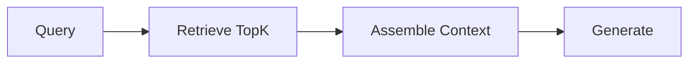
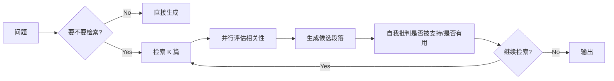
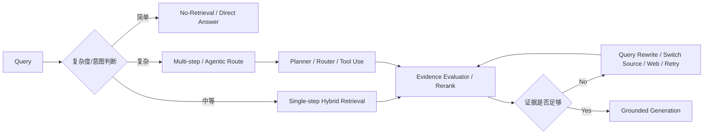

# RAG - 第 10 课：Self-RAG、CRAG、Adaptive、Agentic RAG：从“固定流程”到“会自己决定怎么检索”

## 学习目标（本节结束后你能做到什么）

1. 你能讲清为什么经典 RAG 的真正问题，不只是检索准不准，而是`控制流太死`。
2. 你能区分 `Self-RAG`、`CRAG`、`Adaptive RAG`、`Agentic RAG` 分别在控制流的哪个环节做决策，而不是把它们都混成“高级 RAG”。
3. 你能解释 Self-RAG 的 reflection tokens、CRAG 的 retrieval evaluator、Adaptive-RAG 的 complexity classifier、Agentic RAG 的 planner / critic / executor 各自在解决什么。
4. 你能把 2024 → 2025 → 2026 的演化讲出来：为什么行业从`固定 retrieve-then-read`，走向`带反思、带纠错、带路由、带工具调用的检索控制系统`。
5. 面试里如果被问到“Agentic RAG 到底是不是必要复杂化”，你能给出有边界、有工程权衡的回答。

---

## 1. 先把问题摆正：经典 RAG 的瓶颈，很多时候不是“检索模块不够强”，而是“流程假设错了”

我们先回忆最经典的 RAG：



这套流程默认了四个隐含假设：

1. `每个问题都需要检索`
2. `每次都只需要检索一次`
3. `第一次检索回来的证据大体可信`
4. `同一条问题都适合走同一条 solve path`

而 2024 之后大量工作其实都在拆这四个假设。

为什么这四个假设会出问题？

### 1.1 不是每个问题都值得检索

有些问题：

- 模型自己就能稳答
- 或者其实是闲聊、创作、风格化请求

这时强行检索只会：

- 增加延迟
- 增加噪声
- 让输出更僵硬

### 1.2 有些问题不是“一次检索”能解决的

特别是：

- 多跳推理
- 异构知识源
- 需要中间问题的复杂问答

这类问题的真实流程更像：

- 检一下
- 发现信息不够
- 改写问题
- 再检一次
- 或换一个知识源继续查

### 1.3 第一次检索错了，后面整个回答都会被带偏

这是 CRAG 这条线最核心的出发点。  
很多 RAG 系统的问题不是“生成模型太弱”，而是：

`模型被一批半相关、错相关、低质量证据拖进沟里了。`

### 1.4 问题复杂度分布本来就不均匀

Adaptive-RAG 这类工作抓住了一个非常朴素、但非常真实的点：

`真实流量里，问题复杂度是长尾分布，不是所有 query 都同样复杂。`

于是“一刀切”的固定流程会出现双输：

- 对简单问题过度工程化
- 对复杂问题又不够灵活

这四个问题叠在一起，才逼出了 Self-RAG、CRAG、Adaptive-RAG 和 Agentic RAG。

---

## 2. 一个更好的统一视角：这些方法都在回答“检索控制”的不同问题

如果只按论文名字去记，很容易越学越乱。  
更好的方式是把它们放到统一控制流里看：

```text
给定 query q 和当前证据状态 s，
系统要决定下一步动作 a 是什么。
```

也就是：

```text
a = π(q, evidence, confidence, budget, depth)
```

这里的动作可能是：

- `不检索，直接答`
- `检索一次`
- `继续检索`
- `改写 query`
- `换知识源`
- `丢弃低质证据`
- `停止并回答`

从这个角度看：

- `Self-RAG`：让模型自己决定是否检索、并自我批判生成结果
- `CRAG`：当检索结果不靠谱时，做纠错和补救
- `Adaptive-RAG`：在问题开始前先选最合适的求解策略
- `Agentic RAG`：把整个检索-推理过程看成一连串可决策动作

所以它们不是并列的四个“新花样”，而是：

`RAG 控制层逐渐显式化、可学习化、可反思化的四个阶段。`

---

## 3. 2023 → 2026 的演化主线：从“固定 retrieve-read”到“系统自己决定要不要、何时、如何检索”

这一章最重要的是抓住演化顺序，不然会误以为这些方向彼此割裂。

### 3.1 2023：ReAct 打开了“检索是动作，不只是预处理”的大门

ReAct 不是传统意义上的 RAG 论文，但它对 Agentic RAG 的意义非常大。

OpenReview 上的 ReAct（ICLR 2023）核心思想是：

- reasoning traces 和 actions 交替进行
- action 可以去调用外部知识源
- reasoning 用来规划和修正 action，action 再反过来更新 reasoning

它在 HotpotQA 和 FEVER 上直接和 Wikipedia API 交互，说明了一个关键转变：

`检索不是回答前的固定前菜，而可以是推理过程里的动作。`

这是后面 Agentic RAG 最重要的思想源头。

### 3.2 2024：Self-RAG、CRAG、Adaptive-RAG 三条线同时爆发

2024 是这个方向真正成型的一年。

三篇很关键：

- `Self-RAG`（ICLR 2024）：让模型学会 on-demand retrieval + self-reflection
- `CRAG`（CoRR 2024，后续进入 ICLR 2025 讨论）：检索不稳时做 corrective retrieval
- `Adaptive-RAG`（NAACL 2024）：按 query complexity 在 no-retrieval / single-step / multi-step 间切换

这三条线分别回答了三种不同问题：

- `Self-RAG`：谁来决定要不要检索？
- `CRAG`：检索错了怎么办？
- `Adaptive-RAG`：为什么所有问题都走同一条路径？

### 3.3 2025：Agentic RAG 从 prompt 技巧走向 critic、policy 和 process supervision

2025 年有一个很明显的变化：

`Agentic RAG 不再只是“让模型多想几步”，而开始引入显式 critic、流程级反馈和训练信号。`

几个代表：

- `RAG-Critic`（ACL 2025）：critic-guided agentic workflow，按错误类型定制执行流
- `DecEx-RAG`（EMNLP 2025 Industry）：把 Agentic RAG 建模成 MDP，并做 process-level policy optimization

这说明方向开始从：

- 手工 workflow

走向：

- `显式控制器`
- `显式错误反馈`
- `显式过程监督`

### 3.4 2026：重点从“多走几步”转向“系统级适应性”

到 2026 年，一个很重要的趋势是：

`大家不再只比谁的 agent 路径更长，而开始比谁更知道什么时候该停、什么时候该改、什么时候该换源。`

例如：

- `ReflectiveRAG`（EACL 2026 Industry）强调 architectural adaptivity，用小模型判断 evidence sufficiency、做 query refinement 和 noise removal
- `DeepSieve`（Findings of EACL 2026）把复杂 query 拆成子问题，再递归路由到合适知识源

这说明 2026 年的“最新进展”不只是更多 agent，而是：

`更细的检索控制、更显式的证据质量判断、更强的多源路由。`

我对这条线的总结是：

`2024 解决“要不要动”，2025 解决“怎么动得更聪明”，2026 解决“怎么少动但动在点上”。`

---

## 4. Self-RAG：让模型学会“按需检索、边生成边反思”

### 4.1 它在解决什么问题

Self-RAG 想解决的不是普通 RAG 的“能不能接外部知识”，而是：

`为什么我们总是假设检索永远有用、而且总是假设 retrieved passages 天然会被正确使用？`

OpenReview 上的 Self-RAG（ICLR 2024）写得很明确：

- 固定检索固定数量文档会损害 versatility
- off-topic passages 会拖低 generation quality
- 模型还可能无法显式学会“答案是否被证据支持”

所以它的目标是同时学三件事：

1. `要不要检索`
2. `检索回来的段落是否相关`
3. `生成内容是否被证据支持、是否有用`

### 4.2 它的核心原理：reflection tokens

Self-RAG 最有代表性的设计，就是特殊 token。

论文里把 reflection tokens 分成两大类：

- `retrieval token`
- `critique tokens`

其中 Table 1 里有四类判断：

- `Retrieve`：决定是否检索，输出 `{yes, no, continue}`
- `ISREL`：当前 passage 是否 relevant
- `ISSUP`：当前生成内容是否被 passage fully / partially / not supported
- `ISUSE`：回答整体是否有用

这个设计的厉害之处在于：

`它把“检索控制”和“质量自评”都塞回了语言模型的 token 生成过程里。`

换句话说，模型不是只在输出答案文本，  
它还在输出：

- 自己是否需要继续查
- 当前证据是否足够
- 当前回答是否站得住

### 4.3 它是怎么训练的

这是很多人忽略的细节。

Self-RAG 不是只靠 prompt 拼出来的。  
它做了 end-to-end 训练，而且有一个很巧的低成本设计：

- 先用 critic model 离线插入 reflection tokens
- 再把这些 token 当成 expanded vocabulary 里的下一 token 预测目标

论文还特别强调：

- 这样做不需要在训练时一直 host 一个 critic
- 比 RLHF 式训练开销低很多

这也是 Self-RAG 和很多纯 inference-time 技巧的重要区别：

`它不是给现成模型套一层逻辑，而是让模型本身学会这种控制行为。`

### 4.4 它为什么有效

因为它改变了两个传统 RAG 的弱点：

1. `检索频率固定`
   - Self-RAG 可以按段落、按上下文决定要不要继续 retrieve

2. `证据使用不可控`
   - Self-RAG 显式学习判断 relevance / support / usefulness

所以 Self-RAG 更像：



### 4.5 它的局限

Self-RAG 很强，但工程里有三个很现实的问题：

#### （1）需要专门训练

这意味着：

- 不是随手就能接进任何现有商业模型
- 对大多数团队来说，上手成本比 CRAG / rerank / query routing 高很多

#### （2）reflection tokens 的收益依赖训练质量

如果训练数据里的 critique 标注分布不好，  
模型学到的“自我批判”不一定可靠。

#### （3）它解决的是“模型是否知道该检索、该反思”，不是“所有检索器都自动变强”

底层 retriever、索引、rerank 仍然重要。  
Self-RAG 更像把控制层变聪明，而不是替代检索层。

---

## 5. CRAG：重点不是“更会检索”，而是“检索错了以后怎么纠错”

### 5.1 它在解决什么问题

CRAG 的出发点非常务实：

`RAG 的生成效果高度依赖 retrieved documents 的质量。那如果 retrieval 本身错了怎么办？`

OpenReview / CoRR 上的 CRAG（2024）摘要说得很直白：

- RAG 强依赖相关文档
- 检索错误会严重影响生成
- 所以需要一个 corrective framework

CRAG 的直觉不是“让模型自己在坏证据里硬着头皮总结”，而是：

`先判断证据质量，再决定要不要补救。`

### 5.2 它的核心组件：retrieval evaluator

CRAG 最关键的设计是一个轻量的 retrieval evaluator：

- 输入 query 和 retrieved documents
- 输出一个 confidence degree
- 根据这个 confidence 决定后续 action

这个 action 不是单一的 yes/no，  
而可能包括：

- 接受当前结果
- 扩展到 web search
- 进一步筛选和重组当前证据

这比传统 RAG 的思路成熟得多。  
传统 RAG 通常默认：

- topK 出来了
- 就直接交给 generator

CRAG 则插入了一个更合理的中间判断：

`证据质量检查`

### 5.3 它的第二个关键设计：decompose-then-recompose

CRAG 不是只判断文档质量，还对 retrieved docs 做了：

- `decompose`
- `recompose`

直觉上你可以把它理解成：

- 先把杂乱、长、半相关的证据拆成更小信息单元
- 再只保留关键内容重组给生成器

这件事很重要，因为现实里的 retrieval failure 不一定是“全错”，  
很多时候是：

- 文档里一半有用，一半噪声
- 多个段落有局部相关，但原样拼给 LLM 污染很大

所以 CRAG 的思路不是“全盘相信 / 全盘丢弃”，而是：

`评估 -> 补源 -> 去噪 -> 重组`

### 5.4 它和 Self-RAG 的区别

这是非常关键的面试点。

`Self-RAG` 主要在做：

- 让 LM 自己决定何时检索、如何反思

`CRAG` 主要在做：

- 当 retrieval 结果质量不好时，进行显式纠错

也就是说：

- Self-RAG 更像`把控制权学进模型`
- CRAG 更像`在检索和生成之间加一个质量控制层`

### 5.5 它的局限

#### （1）retrieval evaluator 本身可能误判

如果 evaluator 错把坏证据当好证据，后续流程仍然会被污染。

#### （2）web augmentation 会引入新问题

一旦扩展到 web：

- 新鲜度更高了
- 但 authority 可能下降
- 而且 latency 会明显上升

#### （3）它更像 inference-time patch，不是统一训练框架

这让它 plug-and-play，  
但也意味着控制能力不如 Self-RAG 那么内生。

---

## 6. Adaptive-RAG：不是所有问题都值得走同样重的链路

### 6.1 它在解决什么问题

Adaptive-RAG 的洞察非常像后端工程师会说的话：

`线上流量本来就分层，你不能把所有请求都送进最贵路径。`

NAACL 2024 的 Adaptive-RAG 论文明确指出：

- simple queries 走复杂 multi-step retrieval 会造成不必要开销
- complex queries 用 single-step retrieval 又不够
- 现实流量里两者都会出现

所以需要一个系统去动态选择：

- no retrieval
- single-step retrieval
- multi-step retrieval

### 6.2 它的核心原理：complexity classifier

Adaptive-RAG 的做法不是让大模型自己临场猜，  
而是训练一个较小的 classifier 来预测 query complexity。

论文里特别提到：

- 训练标签不是人工一个个标的
- 而是通过不同模型在 query 上的表现结果 + 数据集内在偏置自动收集

这个点非常工程化。  
它说明作者不是只在说“让模型自适应”，而是在认真考虑：

`这个 adaptive policy 怎么低成本训练出来。`

### 6.3 它为什么重要

因为它第一次非常明确地把 RAG 策略选择表述成：

`query complexity -> strategy selection`

这会直接改变生产系统的设计：

- 以前：所有 query 都走 `retrieve -> rerank -> answer`
- 现在：先分流，再决定走哪条 solve path

而且它和 08c 里我们讲的 routing 是连起来的：

- routing 更像“去哪个知识源 / 哪种方法”
- Adaptive-RAG 更像“当前问题值不值得走多重检索 / 迭代检索”

### 6.4 它的局限

#### （1）复杂度分类本身很难

一个 query 看起来短，不代表简单。  
一个 query 看起来长，也不一定需要 multi-hop。

#### （2）分类错了会把用户送错链路

例如：

- 复杂问题被送进 no-retrieval
- 简单问题被送进 iterative retrieval

这就是为什么 adaptive policy 一定要和 fallback 结合。

#### （3）复杂度不等于证据质量

Adaptive-RAG 解决的是“该走多重策略”，  
但不直接解决“当前 retrieved evidence 好不好”。  
这一点仍然需要 CRAG / rerank / critic 模块来补。

---

## 7. Agentic RAG：检索不再是固定阶段，而是推理过程中的工具调用

### 7.1 先把定义讲清楚

“Agentic RAG” 现在是一个非常热的词，但它不是一篇具体论文，而是一类系统设计。

我更愿意把它定义成：

`把 retrieval、query rewrite、source routing、evidence evaluation、tool calling、verification 都纳入推理循环，由系统在运行时按状态决定下一步动作。`

也就是说，它不是：

- 先检索完
- 再回答

而是：

- 先想一步
- 查一点
- 再想一步
- 发现不够再换源
- 再筛一下证据
- 再答

### 7.2 它的思想祖先：ReAct

ReAct（ICLR 2023）之所以重要，不是因为它名字里带 agent，  
而是因为它把 reasoning 和 acting 交织在一起：

- reasoning traces 帮助更新 action plan
- action 帮助访问外部知识源

这就是 Agentic RAG 的原型：

`检索是动作，推理是调度器。`

### 7.3 Agentic RAG 真正增加了什么

相比固定 RAG，Agentic RAG 增加的不是“多一个 loop”这么简单，  
而是四种能力：

1. `工具选择`
   - wiki、web、SQL、code search、企业 KB，选哪个

2. `动作选择`
   - 检索、改写、继续检索、停止、反思、拒答

3. `状态记忆`
   - 当前证据够不够、已经查过什么、还差什么

4. `反馈修正`
   - 查错了怎么办、证据不支持怎么办、答案冲突怎么办

### 7.4 2025-2026 的新变化：Agentic RAG 开始引入 critic、process supervision 和 knowledge router

这两年的代表工作能很好反映演化方向：

#### RAG-Critic（ACL 2025）

ACL 2025 的 RAG-Critic 提出：

- 先做 data-driven error mining，建立层次化错误体系
- 再训练 error-critic model，给出细粒度 error feedback
- 最后用 critic-guided agentic workflow 定制 executor-based solution flows

它的重要性在于：

`Agentic workflow 不再只是手写状态机，而是由 critic 反馈驱动。`

#### DecEx-RAG（EMNLP 2025 Industry）

DecEx-RAG 更进一步，把 Agentic RAG 建模成：

- 一个 MDP
- 带 decision-making 和 execution
- 再加 process-level policy optimization

它报告：

- 在 6 个数据集上平均绝对提升 6.2%
- 数据构造效率接近 6 倍提升

这说明 2025 年产业界已经在认真解决一个问题：

`Agentic RAG 不是不能做，而是要把过程监督和训练效率做好。`

#### DeepSieve（Findings of EACL 2026）

DeepSieve 体现的是另一个方向：

- 把复杂 query 分解成结构化 sub-questions
- 递归路由到最适合的知识源
- 通过多阶段 distillation 过滤 irrelevant information

这说明到 2026 年，Agentic RAG 的重点已经扩展到：

- 多源异构知识
- 递归路由
- 信息蒸馏和筛分

#### ReflectiveRAG（EACL 2026 Industry）

ReflectiveRAG 的特点很值得注意：

- training-free
- latency-aware
- 用小模型做 Self-Reflective Retrieval（SRR）
- 再做 Noise Removal（NR）

论文强调：

- 让 retrieval intelligence 来自 control flow 和 structural reasoning
- 而不是只靠 model scale
- 并报告减少 20%-30% 的冗余 API 调用

这其实非常有时代感。  
因为 2026 年行业更关心的，已经不是“再加一个更大的 agent”，而是：

`怎么让系统知道什么时候证据已经够了。`

---

## 8. 四者怎么对比，才最清楚

最清晰的方式，是按“决策发生在哪一层”来比：

| 方法 | 主要决策点 | 核心机制 | 优势 | 代价 |
| --- | --- | --- | --- | --- |
| Self-RAG | 生成中 | reflection tokens 决定检索与自评 | 控制内生化、可按需检索 | 需要专门训练 |
| CRAG | 检索后 | retrieval evaluator + corrective actions | plug-and-play、能救坏检索 | evaluator 本身要稳 |
| Adaptive-RAG | 检索前 | complexity classifier 选 no/single/multi-step | 成本收益比好 | 分类错了会错路 |
| Agentic RAG | 全流程 | planner / critic / router / tool loop | 灵活、多步、多源 | 系统复杂度和时延高 |

如果再压缩成一句话：

- `Self-RAG`：把“检不检”“好不好”学进模型
- `CRAG`：给检索结果做质检和修复
- `Adaptive-RAG`：先看题再决定走哪条路
- `Agentic RAG`：把整条路都变成可决策过程

---

## 9. 一个生产上更靠谱的统一架构

对大多数团队来说，我不建议一上来就做“满配 Agentic RAG”。  
更现实的演进顺序通常是：



这张图里其实已经把四条线都吸收进去了：

- `Adaptive-RAG`：在入口分流
- `CRAG / ReflectiveRAG`：在证据评估处做判断
- `Self-RAG`：如果你有能力训练，可以把部分控制内生到生成器里
- `Agentic RAG`：在复杂分支里管理多步工具调用

这也是我更推荐的工程思路：

`不要把这几篇论文当互斥选项，而要把它们当不同层的控制机制。`

---

## 10. 代码示例：一个最小可理解的 Adaptive + Corrective + Agentic 骨架

下面这段不是完整生产代码，但它足够表达控制逻辑。

```python
from dataclasses import dataclass, field
from typing import List, Literal


Action = Literal[
    "direct_answer",
    "single_retrieve",
    "multi_step_retrieve",
    "rewrite_and_retry",
    "switch_source",
    "answer",
    "refuse",
]


@dataclass
class Evidence:
    text: str
    source: str
    score: float


@dataclass
class State:
    query: str
    complexity: Literal["simple", "medium", "hard"]
    evidence: List[Evidence] = field(default_factory=list)
    confidence: float = 0.0
    budget_left: int = 3


def classify_complexity(query: str) -> Literal["simple", "medium", "hard"]:
    q = query.lower()
    if any(token in q for token in ["why", "how", "为什么", "如何", "区别"]):
        return "hard"
    if any(token in q for token in ["时间", "谁", "when", "who", "where"]):
        return "medium"
    return "simple"


def choose_initial_action(state: State) -> Action:
    if state.complexity == "simple":
        return "direct_answer"
    if state.complexity == "medium":
        return "single_retrieve"
    return "multi_step_retrieve"


def evaluate_evidence(evidence: List[Evidence]) -> float:
    if not evidence:
        return 0.0
    top = sorted(evidence, key=lambda x: x.score, reverse=True)[:3]
    return sum(item.score for item in top) / len(top)


def next_action(state: State) -> Action:
    if state.confidence >= 0.78:
        return "answer"
    if state.budget_left <= 0:
        return "refuse"
    if state.complexity == "hard" and state.confidence < 0.45:
        return "switch_source"
    return "rewrite_and_retry"


def solve_query(query: str) -> Action:
    state = State(query=query, complexity=classify_complexity(query))
    action = choose_initial_action(state)

    # 真实系统里这里会接 hybrid retrieval / web search / SQL / router
    while action not in {"answer", "refuse", "direct_answer"}:
        # mock retrieval result
        state.evidence = [
            Evidence(text="some evidence", source="kb", score=0.62),
            Evidence(text="some more evidence", source="web", score=0.41),
        ]
        state.confidence = evaluate_evidence(state.evidence)
        state.budget_left -= 1
        action = next_action(state)

    return action
```

这段代码最想表达的不是算法细节，而是一个工程直觉：

`现代 RAG 越来越像一个 policy loop，而不是单次函数调用。`

---

## 11. 工程上到底该怎么选，不要一上来就做“大而全 agent”

### 11.1 如果你是普通企业知识库团队

优先级通常应该是：

1. `Hybrid retrieval + rerank + metadata filter`
2. `简单的 adaptive gating`
3. `evidence evaluator / corrective retry`
4. `最后才是复杂 agent loop`

原因很现实：

- 大多数团队的瓶颈不在“没有 agent”
- 而在“基础检索和证据管理还没打牢”

### 11.2 什么时候值得上 Self-RAG

当你：

- 有训练资源
- 有足够任务数据
- 需要模型内生化“要不要检索、要不要引用、是否被支持”的能力

否则直接上 Self-RAG 往往成本过高。

### 11.3 什么时候 CRAG 很值

当你已经发现：

- topK 里常混噪声
- 用户问题经常需要补到 web 或次级知识源
- 生成器明显被脏 evidence 带偏

这时 CRAG 式的 evaluator 往往比“继续堆 prompt”更值钱。

### 11.4 什么时候 Agentic RAG 真正有必要

尤其是下面这类任务：

- 多跳多源
- 需要工具切换
- 需要边查边验证
- 需要复杂计划和证据聚合

如果你的业务只是：

- 单库 FAQ
- 制度问答
- 文档助手

那满配 agent 很可能只是复杂度转移。

---

## 12. 最容易踩的 10 个坑

### 12.1 把 agent loop 当成检索质量问题的万能药

底层检索弱、chunk 糟、rerank 没做，  
再多 agent 步也只是更慢地错。

### 12.2 把 Adaptive-RAG 误解成“意图分类器”

它关心的是`求解复杂度`，不只是 query 主题标签。

### 12.3 把 CRAG 误解成“多一次检索”

它真正的价值是`先判断当前证据值不值得信`。

### 12.4 把 Self-RAG 当成 prompt 技巧

它的强项来自训练框架和 reflection tokens，  
不是简单 few-shot 就能完全复现。

### 12.5 没有停止条件

Agentic RAG 最危险的问题之一就是：

- 一直改写
- 一直重查
- 一直不收敛

### 12.6 没有证据 sufficiency 判断

只会“继续查”，不会“该停了”，系统就会又慢又冗余。

### 12.7 critic 没有被独立评测

如果你的 critic / evaluator 本身乱判，整条控制链都会跑偏。

### 12.8 多源检索没做 authority 分层

web、新鲜，但不一定权威；  
内部制度，权威，但可能不够新。  
没有 source prior，agent 很容易把最新但不可靠的信息捧上来。

### 12.9 只看最终 answer accuracy，不看过程指标

至少应该看：

- retrieval depth
- retry rate
- evidence sufficiency hit rate
- wasted calls per query
- branch contribution

### 12.10 没预算治理

Agentic RAG 很容易出现：

- token 爆炸
- retriever 调用爆炸
- web search 成本爆炸

没有 budget manager，系统很难上线。

---

## 13. 面试里怎么讲，才像真的理解过“控制层”

如果面试官问：

`Self-RAG、CRAG、Adaptive RAG 的本质差别是什么？`

你可以这样答：

> 我会把它们放到 RAG 控制流里理解。Adaptive-RAG 是在问题开始前选策略，解决一刀切流程的问题；CRAG 是在检索后评估证据质量并决定是否补救，解决 bad retrieval 的问题；Self-RAG 更进一步，把“是否检索、证据是否相关、回答是否被支持”学进模型生成过程里。它们不是互斥关系，而是在不同决策点增强检索控制。

如果面试官继续问：

`Agentic RAG 真的是必要的吗？`

你可以答：

> 不是所有场景都需要。单库 FAQ 或制度问答，hybrid retrieval + rerank + filtering 往往更划算。Agentic RAG 真正适合的是多跳、多源、强工具依赖和需要边查边验证的任务。它的核心收益是控制灵活性，而不是单点检索质量。

如果面试官再问：

`2025-2026 的趋势是什么？`

你可以答：

> 趋势不是简单“更多 agent”，而是更细的 evidence control。2025 年开始出现 critic-guided workflow 和 process supervision，2026 年更强调 architectural adaptivity、evidence sufficiency 和 knowledge routing。也就是说，系统开始更关心“什么时候该停、什么时候该换源、什么时候当前证据已经够了”。这是比多走几步更重要的成熟信号。

---

## 小结

1. 经典 RAG 的核心问题之一，是控制流固定，而不是只会“检一次再答”。
2. `Self-RAG` 让模型学会按需检索和自我批判，核心是 reflection tokens。
3. `CRAG` 解决 bad retrieval，核心是 retrieval evaluator 和 corrective actions。
4. `Adaptive-RAG` 按 query complexity 选择 no-retrieval / single-step / multi-step。
5. `Agentic RAG` 把检索变成推理过程中的动作，并在 2025-2026 演化出 critic、process supervision、knowledge router 和 evidence sufficiency 这些更成熟的控制模块。

---

## 检查站

1. 为什么说 Self-RAG 和 CRAG 虽然都在“反思”，但反思的位置完全不同？
2. 如果一个系统已经有了强 reranker，为什么 CRAG 仍然可能有价值？
3. 什么情况下 Adaptive-RAG 比一套满配 Agentic RAG 更适合生产？
4. 2026 年为什么说 Agentic RAG 的成熟标志不是“走更多步”，而是“更知道什么时候该停”？

---

## 参考与延伸阅读

- Asai et al., *Self-RAG: Learning to Retrieve, Generate, and Critique through Self-Reflection* (ICLR 2024)  
  https://openreview.net/forum?id=hSyW5go0v8
- Yan et al., *Corrective Retrieval Augmented Generation* (CoRR 2024)  
  https://openreview.net/forum?id=FL7roDGPpP
- Jeong et al., *Adaptive-RAG: Learning to Adapt Retrieval-Augmented Large Language Models through Question Complexity* (NAACL 2024)  
  https://aclanthology.org/2024.naacl-long.389/
- Yao et al., *ReAct: Synergizing Reasoning and Acting in Language Models* (ICLR 2023)  
  https://openreview.net/forum?id=WE_vluYUL-X
- Dong et al., *RAG-Critic: Leveraging Automated Critic-Guided Agentic Workflow for Retrieval Augmented Generation* (ACL 2025)  
  https://aclanthology.org/2025.acl-long.179/
- Leng et al., *DecEx-RAG: Boosting Agentic Retrieval-Augmented Generation with Decision and Execution Optimization via Process Supervision* (EMNLP 2025 Industry)  
  https://aclanthology.org/2025.emnlp-industry.99/
- Guo et al., *DeepSieve: Information Sieving via LLM-as-a-Knowledge-Router* (Findings of EACL 2026)  
  https://aclanthology.org/2026.findings-eacl.160/
- Verma et al., *ReflectiveRAG: Rethinking Adaptivity in Retrieval-Augmented Generation* (EACL 2026 Industry)  
  https://aclanthology.org/2026.eacl-industry.27/
