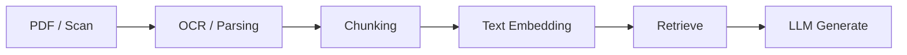
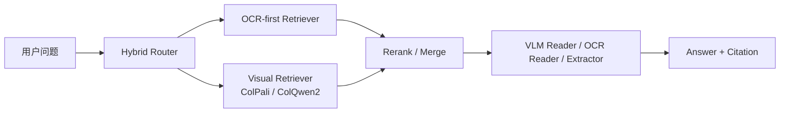

# RAG - 第 11 课：多模态 RAG：ColPali 与视觉文档理解

## 学习目标（本节结束后你能做到什么）

1. 你能讲清为什么`多模态 RAG`不只是“模型能看图”，而是检索与阅读阶段都可能发生模态变化。
2. 你能区分 `OCR-first 文本化检索`、`visual retrieval`、`vision reader / VLM grounding` 三条链路分别解决什么。
3. 你能解释 ColPali 的核心原理：为什么它把 PDF 页面当图像、为什么用 `ColBERT late interaction`、为什么这对表格、版面、图表特别重要。
4. 你能讲出 `ColPali -> ColQwen2 -> ColQwen2.5 -> ViDoRe V3` 这条 2024 到 2026 的演化线，以及它背后的工程含义。
5. 你能在面试里回答：什么时候应该上视觉检索，什么时候坚持 OCR-first，什么时候做 hybrid，为什么“能看图”不等于“能稳定做企业文档 RAG”。

---

## 1. 先把问题摆正：多模态 RAG 最容易犯的错，是把“看懂页面”和“检索页面”混成一件事

很多团队第一次聊多模态 RAG，会直接说：

- “我们准备用 VLM 做 PDF RAG”

这句话其实太粗了，因为它把三个完全不同的问题揉在了一起：

### 1.1 视觉检索

问题是：

`用户问题来了，应该先把哪几页、哪几张图、哪几个表找出来？`

这一步的目标是 recall，不是生成答案。

### 1.2 视觉阅读

问题是：

`已经拿到候选页面后，模型如何读懂页面上的文字、表格、图表和版面？`

这一步更接近 reader / extractor / grounding。

### 1.3 多模态答案生成

问题是：

`如何基于检索到的视觉证据，产出带引用、可验证的最终回答？`

这是 synthesis，不是 retrieval。

所以“多模态 RAG”最重要的第一原则是：

`retriever 和 reader 不一定是同一个模型，也不一定吃同一种表示。`

ColPali 这条线之所以重要，不是因为它把“所有事都做了”，而是因为它第一次把：

`视觉文档检索`

这件事本身做成了一个清晰、强效果、工程上可用的范式。

---

## 2. 为什么 OCR-first 在复杂文档上会持续吃亏

这一章要接住你在第 `03` 节学过的文档解析。

传统 PDF RAG 大致是：



这套链路对很多纯文本资料仍然很好用。  
但 ColPali 2024 论文的出发点很明确：

- 文档是视觉丰富结构
- 信息不仅在文本里
- 还在 figures、page layouts、tables、fonts 等视觉信号里
- 现代检索系统主要依赖它们从页面抽出的文字，因此很难高效利用关键视觉 cue

这句话特别关键。  
OCR-first 的问题不是“抽文本没价值”，而是：

`把页面先压成线性文本，会在检索前就损失掉布局与视觉语义。`

典型损失包括：

- 表头和表格单元格关系被打散
- 图和图注脱钩
- 章节标题层级被弱化
- 公式、图例、流程图、颜色/位置关系消失
- 扫描件上 OCR 直接出错

于是很多复杂问题会变难：

- “这个柱状图里哪一年增速最低？”
- “表 3 中哪一列对应 operating margin？”
- “脚注里对这个指标的定义是什么？”
- “这页组织架构图里哪个团队直接向 CTO 汇报？”

这些问题的答案，不只是 token 序列，还是：

`被布局承载的信息`

---

## 3. 多模态 RAG 的真正分界线：你是在索引“文本”，还是索引“页面”

一个更成熟的理解方式，是把 PDF RAG 拆成两类索引哲学。

### 3.1 OCR-first：索引的是解析后的文本单元

优点：

- 索引成熟
- 容易做 BM25 / dense / rerank
- 容易支持 metadata filter、ACL、时间范围过滤
- 更容易落地 chunk citation、span citation
- 成本通常更低

缺点：

- 高度依赖文档解析质量
- 视觉结构容易在索引前丢失
- 图表、复杂表格、扫描件效果经常不稳

### 3.2 Visual-first：索引的是页面图像本身

优点：

- 不必先把页面彻底“翻译”为线性文本
- 布局、表格、图像、字体这些视觉信息天然保留
- 对 born-digital PDF 和扫描件都更统一

缺点：

- 向量不是单页一个点，而往往是多向量
- 检索基础设施更复杂
- 命中的是“页”而不是精确 text span
- 后续仍然需要 reader / grounding 才能稳定作答

所以这类系统的本体不是“替代 OCR”，而是：

`把 OCR-first 中最脆弱的那一步，从“先把页面翻译成文本”改成“先在视觉空间里找对页面”。`

---

## 4. ColPali 的本质：把页面当图像，用 late interaction 做视觉文档检索

### 4.1 它在解决什么问题

ColPali 的 abstract 讲得非常直接：

- 为了 benchmark visually rich document retrieval，作者提出 ViDoRe
- 并提出一个新概念：直接嵌入 document page images 来做 document retrieval

它的目标不是：

- 让 VLM 直接回答一切问题

而是：

`让“找对哪一页”这件事，直接在视觉空间里发生。`

### 4.2 它为什么叫 ColPali

名字本身已经说明了结构：

- `Pali`：PaliGemma 视觉语言骨干
- `Col`：ColBERT 风格的 late interaction

也就是说，它不是简单的“VLM 单向量检索”，而是：

`VLM + multi-vector retrieval`

这一点特别重要，因为很多视觉页面不是一个单一主题。

一页 PDF 里同时可能有：

- 标题
- 正文
- 表格
- 图表
- 图注
- 页脚

如果把整页压成一个单向量，信息会被平均得很厉害。  
ColPali 借了 ColBERT 的关键思想：

- 不急着把整页压成一个点
- 而是保留 token / patch 级别的多向量表示
- 在匹配时做细粒度 late interaction

### 4.3 核心原理：query token 和 image patch 之间做 MaxSim

如果把它抽象一下，可以理解成：

- 文本 query 被编码成多个 query token vectors
- 页面图像被编码成多个 patch / token vectors
- 最终分数不是一个全局 pooled cosine
- 而是逐 query token 去找页面上最匹配的 patch，再聚合

可以写成 ColBERT 风格的直观形式：

```text
score(Q, D) = Σ_i max_j sim(q_i, d_j)
```

其中：

- `q_i` 是 query 的第 i 个 token 向量
- `d_j` 是页面图像表示中的第 j 个 patch / token 向量

这带来的好处非常大：

1. query 里每个关键约束都更容易保住  
   例如 “operating margin”“2024”“footnote” 不会那么容易在 pooling 中被平均掉。

2. 页面里局部区域可以直接对齐 query  
   比如某个表头、某个图例、某个角落的脚注。

3. 解释性更强  
   ILLUIN 官方仓库后来还补了 similarity maps，可把 query token 的注意热点叠加到原始页面图像上。

---

## 5. 为什么 ColPali 对复杂 PDF 有“代际感”

### 5.1 它不是只看字，而是在看“字怎么长在页面里”

Hugging Face 的 ColPali 文档对它的描述很准确：

- 它把每页当图像
- 不只捕获 text
- 还捕获 layout、tables、charts 和其他视觉元素

这就是它最本质的优势。

传统文本检索更像在问：

- “这页里有没有相似词或语义？”

ColPali 更像在问：

- “这整张页面，作为一个视觉-文本复合对象，和这个问题有多对味？”

### 5.2 它对哪些页面特别占优

最常见的是：

- 表格密集报告
- 财报、ESG、招股书
- 学术论文页面
- 扫描件 / 拍照件
- 图表导向页面
- 组织架构图、流程图、时间线图

因为这些页面最容易出现：

- 文本抽出来了，但结构没了
- 或 OCR 根本没抽对

### 5.3 它真正改善的是“页面检索 recall”，不是所有下游任务

这一点一定要讲清楚。

ColPali paper 说它在 ViDoRe 上大幅超过现代 document retrieval pipelines，  
而且更简单、更快、可 end-to-end train。

但这并不意味着：

- 它自动解决答案生成
- 自动解决精确引用
- 自动解决 cell-level grounding

更准确的说法是：

`它把“复杂页面找不对”的问题，系统性往前推了一大步。`

---

## 6. ColPali 不是终点：ColQwen2、ColQwen2.5 说明行业重点开始转向工程可用性

### 6.1 2024-06-27：ColPali 发布

Hugging Face 文档记录得很清楚：

- ColPali released on `2024-06-27`
- added to Transformers on `2024-12-17`

这两个日期一起看很有意思。

前者说明研究起点，后者说明：

`它不再只是论文和仓库实验，而开始进入主流推理生态。`

### 6.2 ColQwen2：更现实的 backbone 迁移

随后 Vidore 团队推出了 `ColQwen2`。

官方 model card 给出的关键信息是：

- 它基于 `Qwen2-VL-2B-Instruct`
- 仍然生成 ColBERT-style multi-vector 表示
- `v1.0` 支持 dynamic image resolutions
- 不像 ColPali 那样强行改输入纵横比
- 最多使用 768 image patches

这里背后的工程意义非常大：

`视觉文档检索开始从“证明可行”转向“提高分辨率利用率和页面保真”。`

为什么 dynamic resolution 重要？

因为 PDF 页面不是普通自然图像：

- 很长
- 很密
- 版式不规则
- 小字和表格细节特别多

如果把页面统一压到固定尺寸，细节会丢得很厉害。  
动态分辨率和更多 patch，本质上是在用更高代价换更好的页面细节保留。

### 6.3 ColQwen2.5：继续沿着“更强 backbone + dynamic resolution”推进

截至 `2026-04-23`，Vidore 官方 model card 已提供 `ColQwen2.5` 系列。

它延续的不是理论革命，而是很现实的路线：

- backbone 升级到 `Qwen2.5-VL-3B`
- 保持 ColBERT-style multi-vector retrieval
- 继续支持 dynamic resolution
- 继续把 patch 数控制在工程上可承受范围

这说明 2025 之后这条线的主旋律不是：

- “再发明一种完全不同的视觉检索理论”

而是：

- “用更合适的 VLM backbone，把视觉文档检索真正做成可部署能力”

### 6.4 生态成熟的另一个信号：Transformers 原生支持

截至 `2026-04-23`，Hugging Face 文档显示：

- `ColPali` 已进入 Transformers
- `ColQwen2` 已进入 Transformers，文档标注 added on `2025-06-02`

这件事的意义很大，因为它降低了：

- 推理接入门槛
- 部署和量化门槛
- 与现有 PyTorch / HF 工具链对接的摩擦

也就是说，这条线已经从“论文代码”走到了：

`主流模型生态中的一等公民`

---

## 7. 2025-2026 的真正重点：不是再讲“VLM 真厉害”，而是开始补 benchmark、infra 和成本

### 7.1 ViDoRe：这条线先把 benchmark 立住了

ColPali 论文同时引入了 `ViDoRe`，这是这条线能成立的关键原因之一。

因为没有 benchmark，你很难判断：

- 视觉检索到底强在哪
- 是不是只对某几个 demo 页面有效

Vidore 官方组织页显示：

- `ViDoRe V3` 发布于 2026 年线
- 数据覆盖 10 个数据集
- `26,000+` 页
- `3,099` 个查询
- `6` 种语言

而且官方描述明确强调：

- 目标是 enterprise relevance
- 更偏真实、视觉丰富、复杂文档
- 不再只是干净的 academic texts

这背后的信号非常明确：

`这条线的评测重点，已经从“模型论文好不好看”，转向“复杂真实文档里到底稳不稳”。`

更重要的是，ViDoRe V3 论文摘要已经给出了一个很有分量的结论：

- visual retrievers 整体优于 textual retrievers
- late-interaction 和 textual reranking 仍然有明显帮助
- hybrid 或 purely visual contexts 往往能提升 answer generation 质量
- 但当前模型仍然在 non-textual elements、open-ended queries、fine-grained visual grounding 上吃力

这其实非常像产业里的真实状态：

`视觉检索已经证明了价值，但细粒度视觉推理和稳定 grounding 还远没到“问题已解决”。`

### 7.2 评测框架也在变：retriever evaluation 和 pipeline evaluation 被分开了

Vidore 官方 benchmark 仓库到 2025-2026 有一个很值得记的变化：

- 单模型 retriever evaluation 转向 `MTEB`
- `ViDoRe v3` 更强调 `pipeline evaluation`

仓库 README 甚至直接写：

- complex pipeline evaluation 可以测试 multi-stage retrieval
- hybrid dense+sparse fusion
- OCR -> chunking -> embedding 自定义预处理链路
- 以及超出标准 dense/sparse 的任意 retrieval logic

这说明行业理解已经成熟了：

`视觉文档 RAG 的成败，不只取决于 retriever 本身，还取决于整条 pipeline。`

### 7.3 成本与延迟开始成为一等问题：fast-plaid、token pooling

ColPali 这类方法强，但天然有一个现实代价：

`它是多向量，不是单向量。`

这意味着：

- 每页存储更多向量
- 匹配开销更大
- 大库 ANN 更难做

ILLUIN 官方仓库在 2025 已经把这个问题当成主战场来处理：

- 支持 `fast-plaid` 加速 larger corpus matching
- 支持 `token pooling`

其中 token pooling 这一点很关键。  
官方仓库说明：

- 许多 image patches 是冗余的，比如大片白底
- 可以把这些 patches pool 起来
- 在它们的实验里，`pool factor = 3` 时，总向量数减少 `66.7%`
- 同时保留 `97.8%` 的原始性能

这说明视觉文档检索真正进入工程阶段后的核心问题是：

`如何把 late interaction 的质量优势，压进企业可接受的索引成本里。`

---

## 8. 这条线最重要的工程判断：视觉检索不是 OCR 的简单替代，而是和 OCR 构成互补

### 8.1 什么时候优先上 ColPali / ColQwen2 这类视觉检索

- 页面结构非常关键
- 表格、图表、图文混排很多
- OCR 质量不稳定
- 扫描件比例高
- 用户问题经常针对“某页长什么样”“某页哪块区域有什么”
- 你最先卡住的是 page recall，而不是 answer style

### 8.2 什么时候 OCR-first 反而更稳

- 文档几乎都是纯文本或结构清晰的 born-digital PDF
- 需要强 metadata filtering、ACL、租户隔离
- 需要精确 span 引用和 deterministic extraction
- 需要低成本服务海量文档
- 你的主要瓶颈是关键词命中和文本实体约束，而不是视觉布局

### 8.3 生产里最成熟的形态通常是 hybrid

真正成熟的链路往往不是二选一，而是：



也就是说：

- 文本检索负责便宜、可过滤、可解释
- 视觉检索负责补足复杂页面 recall
- reader 再决定怎样把页级证据读成可回答的事实

这才是“多模态 RAG”更现实的工程答案。

---

## 9. 一个最容易被忽略的点：ColPali 解决的是 page retrieval，不是 region grounding

这是面试里很容易问到的。

如果用户问：

- “表 7 里 2024 年欧洲市场份额是多少？”

ColPali 很可能帮你找对那一页。  
但它不天然等于：

- 定位到具体表格
- 定位到具体行列
- 读出具体数值

所以视觉文档 RAG 一般还要补下游：

1. `page -> region`
   - 用 OCR boxes、layout parser、VLM grounding、crop proposal 找到相关区域

2. `region -> answer`
   - 用 VLM 或 specialized extractor 读出字段、表格 cell、图表数值

这也是为什么说：

`视觉检索强，不代表端到端文档问答就已经 solved。`

---

## 10. 生产落地的 6 个常见坑

### 10.1 不要把 page image embedding 当成万能证据

图像 embedding 很适合召回，  
但最终最好仍然回落到：

- 原页截图
- OCR 文本
- 页面坐标
- 文档 id / page number

否则很难做：

- 引用
- 审计
- 错误定位

### 10.2 多向量基础设施不能想当然

ColPali / ColQwen2 不是普通单向量 embedding。  
官方仓库已经明确列出：

- Byaldi
- PyVespa
- Qdrant tutorial
- Weaviate tutorial
- Elastic tutorial

这本身就在说明一个现实：

`多向量 late interaction 需要专门的索引和检索适配，不是随便一个 vector DB API 就能平替。`

### 10.3 视觉检索很容易把过滤逻辑做弱

因为“页面图像”本身不像文本 chunk 那样天然挂着好处理的 metadata。

但生产里你仍然必须做：

- 用户权限
- 时间范围
- 数据来源
- 版本控制

所以图像页索引也必须与 metadata store 强绑定。

### 10.4 视觉页面 recall 高，不等于答案 faithfulness 高

找对页面后，reader 仍可能：

- 看错表头
- 看错图例
- 忽略脚注限制
- 把相邻视觉元素误绑定

所以评测不能只看 Recall@K，  
还要看：

- answer faithfulness
- citation correctness
- region grounding accuracy

### 10.5 语言泛化不是白送的

ColPali 最初训练集是全英文设计，  
尽管作者研究了 zero-shot multilingual generalization，  
但企业里遇到：

- 中英混排
- 小语种扫描件
- 行业专有缩写

仍然要谨慎验证。

### 10.6 不要忽略存储和索引成本

视觉检索的坏处不是只有模型推理贵，  
更大的问题常常是：

- 每页多向量 embedding 数量大
- 索引体积膨胀
- 更新和重建成本高
- rerank / reader 又会叠加更多成本

所以 token pooling、late interaction indexing、分级检索，都是这条线从研究走向生产的必修课。

---

## 11. Python 骨架：最小可运行的 ColPali 检索思路

下面这个例子更像“概念最小实现”，目的是帮你把链路串起来。

```python
import torch
from PIL import Image
from transformers import ColPaliForRetrieval, ColPaliProcessor


model_name = "vidore/colpali-v1.3-hf"

model = ColPaliForRetrieval.from_pretrained(
    model_name,
    dtype=torch.bfloat16,
    device_map="auto",
).eval()
processor = ColPaliProcessor.from_pretrained(model_name)


pages = [
    Image.open("/path/to/page_001.png").convert("RGB"),
    Image.open("/path/to/page_002.png").convert("RGB"),
    Image.open("/path/to/page_003.png").convert("RGB"),
]

queries = [
    "Which page contains the table about operating margin in 2024?",
]


with torch.no_grad():
    page_inputs = processor(images=pages, return_tensors="pt").to(model.device)
    query_inputs = processor(text=queries, return_tensors="pt").to(model.device)

    page_embeddings = model(**page_inputs).embeddings
    query_embeddings = model(**query_inputs).embeddings

scores = processor.score_retrieval(query_embeddings, page_embeddings)
top_page_idx = scores[0].argmax().item()
print("best page:", top_page_idx)
```

真正生产里你当然不会只做这一层。  
更完整的链路通常是：

1. PDF 每页渲染为图像
2. 用 ColPali / ColQwen2 建页级索引
3. query 命中 topK 页
4. 对 topK 页再做 OCR / VLM reading / region extraction
5. 最后做答案生成和引用

---

## 12. 面试里最容易被问的 5 个问题

### 12.1 “ColPali 和普通 OCR + embedding 的本质区别是什么？”

普通 OCR + embedding 是先把页面转成线性文本，再在文本空间检索；ColPali 是直接把页面图像映射到多向量表示，在视觉空间做检索，保留布局、表格、图表等视觉信号。

### 12.2 “为什么 ColPali 不是一个普通 VLM QA 模型？”

因为它的主要任务是 retrieval，不是直接 answer generation。它优化的是 query-page matching，而不是端到端问答质量。

### 12.3 “什么时候视觉检索值得上生产？”

当文档复杂、布局信息重要、OCR 不稳定，且 page-level recall 是瓶颈时值得上；如果资料基本是干净文本、强过滤和低成本更重要，OCR-first 通常更划算。

### 12.4 “ColPali 的工程难点在哪？”

多向量索引、late interaction 匹配成本、metadata 过滤、页级命中后的 region grounding，以及如何把 retrieval quality 压进可接受的延迟和存储成本。

### 12.5 “2026 这条线的重点是什么？”

不是继续喊“页面当图像就行了”，而是 benchmark 更真实、pipeline 评测更完整、backbone 更强、dynamic resolution 更成熟，同时围绕 token pooling、fast matching、多向量 infra 把成本打下来。

---

## 13. 小结

1. 多模态 RAG 不是一句“模型能看图”，而是`视觉检索 + 视觉阅读 + 文本/视觉联合生成`三层问题。
2. ColPali 的代际价值在于：它把复杂 PDF 的检索入口，从`先文本化`改成了`先视觉召回`。
3. ColQwen2 / ColQwen2.5 与 Transformers 支持说明这条线已经从论文创新走向工程成熟。
4. 2025-2026 的重点不再只是模型精度，而是 benchmark、pipeline evaluation、多向量 infra 和成本优化。
5. 生产里最稳的答案通常不是纯视觉或纯 OCR，而是 hybrid：让视觉检索补 recall，让文本链路补过滤、引用和可解释性。

---

## 14. 检查站

1. 为什么说 ColPali 真正改变的不是“阅读能力”，而是“页面召回方式”？
2. 如果你的文档大量是表格、图表和扫描件，为什么 OCR-first 往往会在检索前就吃亏？
3. 为什么多模态 RAG 在生产里通常仍然要保留 OCR / parser / metadata store，而不是只靠页面图像 embedding？

---

## 15. 参考与延伸阅读

- ColPali paper, ICLR 2025: [https://arxiv.org/abs/2407.01449](https://arxiv.org/abs/2407.01449)
- ColPali 官方仓库: [https://github.com/illuin-tech/colpali](https://github.com/illuin-tech/colpali)
- Hugging Face Transformers: ColPali docs: [https://huggingface.co/docs/transformers/en/model_doc/colpali](https://huggingface.co/docs/transformers/en/model_doc/colpali)
- Hugging Face blog: ColPali: Efficient Document Retrieval with Vision Language Models: [https://huggingface.co/blog/manu/colpali](https://huggingface.co/blog/manu/colpali)
- ColQwen2 model docs: [https://huggingface.co/docs/transformers/model_doc/colqwen2](https://huggingface.co/docs/transformers/model_doc/colqwen2)
- ColQwen2 official model card: [https://huggingface.co/vidore/colqwen2-v1.0](https://huggingface.co/vidore/colqwen2-v1.0)
- ColQwen2.5 official model card: [https://huggingface.co/vidore/colqwen2.5-v0.2](https://huggingface.co/vidore/colqwen2.5-v0.2)
- ViDoRe 官方主页: [https://huggingface.co/vidore](https://huggingface.co/vidore)
- ViDoRe Benchmark 仓库: [https://github.com/illuin-tech/vidore-benchmark](https://github.com/illuin-tech/vidore-benchmark)
