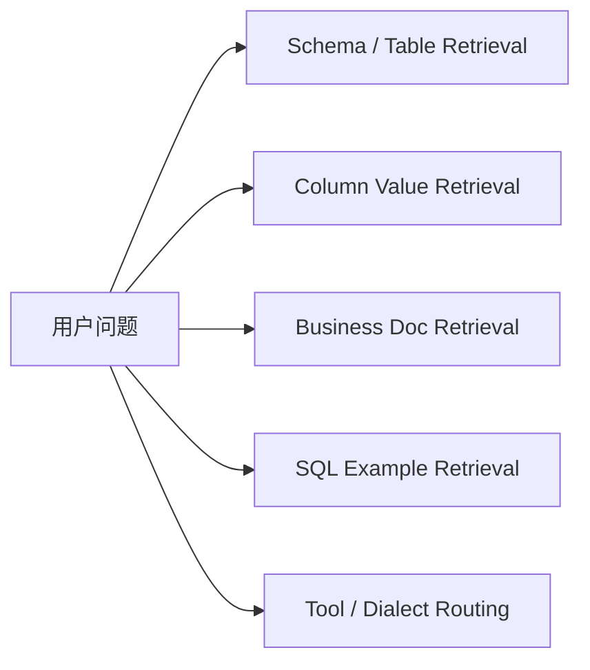
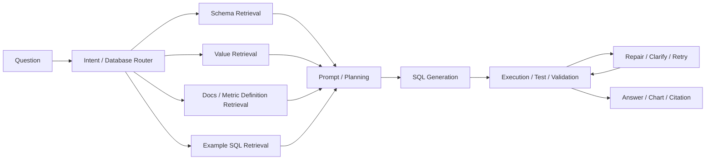
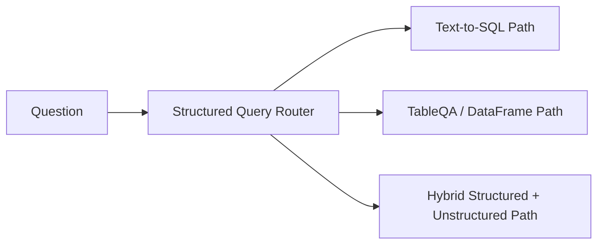

# RAG - 第 12 课：RAG on Structured Data：Text-to-SQL 与 TableQA

## 学习目标（本节结束后你能做到什么）

1. 你能讲清为什么`结构化数据上的 RAG`不是“把表塞进向量库”，而是围绕`schema / 文档 / 取值 / 示例 / 执行反馈`做检索增强。
2. 你能区分 `Text-to-SQL` 和 `TableQA` 各自的目标、适用边界和工程链路，不会把它们混成一句“问数据库”。
3. 你能解释为什么企业级结构化数据场景的真正难点不在 SQL 语法，而在`schema linking`、`value grounding`、`business rule retrieval`、`dialect / execution / repair`。
4. 你能把 `DIN-SQL`、`CHESS`、`retrieval-augmented text-to-SQL`、`TS-SQL`、`Spider 2.0`、`BIRD-Interact`、`LiveSQLBench` 串成一条 2024-2026 演化主线。
5. 你能在面试里回答：什么时候应该走 SQL，什么时候走 pandas / dataframe QA，什么时候必须做 agentic workflow，为什么很多 demo 级 NL2SQL 在真实企业库上会立刻失效。

---

## 1. 先把问题摆正：结构化数据里的“答案”常常不在库里，而是要被算出来

很多人第一次做结构化数据问答，会不自觉沿用文档 RAG 的直觉：

- 用户提问
- 去知识库里找相关内容
- 把内容塞给模型
- 让模型回答

这在文档场景通常成立，因为答案常常已经写在文本里。  
但数据库场景很不一样。

比如问：

- “2025 年华东区 GMV 同比下降最多的二级类目是什么？”
- “过去 90 天退款率高于均值且客诉量环比上涨的商家有多少？”
- “住院时间中位数最高的科室是什么，排除 2024 年以前已出院病例？”

这些问题的答案并不是某一段现成文本。  
系统通常要先完成：

- 找对库
- 找对表
- 找对列
- 弄清筛选条件
- 识别时间口径
- 明白业务定义
- 生成 SQL / 程序
- 执行
- 可能还要修一次

所以结构化数据场景里，RAG 真正增强的不是：

- “答案文本召回”

而是：

`把生成正确程序所需的上下文召回出来。`

这就是这节课最重要的一句话：

`在 Text-to-SQL 里，检索对象往往不是答案，而是“生成答案程序所需的证据”。`

---

## 2. 一个统一视角：结构化数据 RAG 到底在检索什么

如果把企业里的结构化数据问答拆开，你会发现它通常至少要检索 5 类东西。



### 2.1 Schema / table / column

也就是：

- 哪个数据库
- 哪些表
- 哪些列
- 主外键关系是什么

这一步是最基础的 schema linking。

### 2.2 值域与枚举

比如：

- `region` 里到底存的是 `East China` 还是 `华东`？
- 状态值是 `completed`、`success` 还是 `done`？
- 某个产品线在库里的真实名称是什么？

这一步叫 value grounding，经常比 SQL 语法本身更难。

### 2.3 业务文档与口径说明

比如：

- `GMV` 是否含退款
- `活跃用户` 是 7 天活跃还是 30 天活跃
- “老客” 是按账号还是按设备定义

这类信息往往不在 schema 里，而在：

- data catalog
- 指标文档
- wiki
- dbt models / tests / descriptions
- BI 口径文档

### 2.4 历史 SQL / 示例问题

很多问题并不需要模型从零发明 SQL，  
而更像：

`在过去类似 query 的基础上做适配`

这也是为什么 Vanna 官方文档会把它的核心定义成：

- 先训练一个 RAG corpus
- 再根据问题检索合适的参考上下文来生成 SQL

### 2.5 工具与执行路径

有的问题适合：

- 单条 SQL

有的问题更适合：

- 多步 SQL workflow
- SQL + Python / pandas
- SQL + chart
- SQL + follow-up clarification

所以结构化数据 RAG 还常常要做：

`tool / strategy routing`

---

## 3. 为什么企业级 Text-to-SQL 远比 Spider 时代看起来难

这一段非常重要，因为它解释了为什么很多 demo 可以做，生产却做不起来。

### 3.1 Spider 的世界相对“干净”

Spider 1.0 的价值很大，但它隐含了几个温和假设：

- schema 相对小
- SQL 往往是一条
- 数据环境比较封闭
- 给定 schema 后，主要难点是语义解析和 SQL 组合

这对研究很重要，但对企业落地不够。

### 3.2 BIRD 把“数据库内容规模”这个问题正面抬上来了

BIRD 官方站点介绍得很清楚：

- `12,751+` question-SQL pairs
- `95` 个大数据库
- 总大小 `33.4 GB`
- `37+` 专业领域

这不是只有 schema 更大而已，  
而是意味着：

`数据库内容本身也开始影响 text-to-SQL 的成败。`

为什么？

因为很多问题不再只靠列名就能解：

- 用户问题的实体值和库里真实值不完全一致
- 列名模糊
- 同义缩写多
- 数据脏

所以从 BIRD 开始，业界更明确地接受了一个现实：

`Text-to-SQL 不是单纯 semantic parsing，而是 retrieval + grounding + generation。`

### 3.3 Spider 2.0 把问题推进到“企业 SQL workflow”

Spider 2.0 官方网站把难度讲得非常具体：

- `632` 个真实企业工作流问题
- 数据库常常有 `1000+` 列，甚至 `3000+` 列
- 涉及 BigQuery、Snowflake 等真实环境
- SQL 可能超过 `100` 行
- 甚至需要多条 SQL 与 workflow

更关键的是，它给出了一个很强的对比：

- 在 Spider 2.0 论文语境里，`o1-preview` 只能解 `17.1%`
- `GPT-4o` 只有 `10.1%`

这些是 `2024` 发布时的结论。  
而截至 `2026-04-23`，官网 leaderboard 上已经出现 `40%+` 的 agentic systems。  
这两个日期必须一起看：

`模型和系统确实进步了，但 enterprise text-to-SQL 依然远没有被解决。`

### 3.4 BIRD-Interact 和 LiveSQLBench 继续证明：真正难的是交互、测试和 live context

BIRD 官方在 `2025-2026` 的更新里又把问题往前推了两步：

- `BIRD-Interact`：加入 conversational / agentic interaction
- `LiveSQLBench`：强调 contamination-free、full SQL spectrum、hierarchical knowledge base、test cases、business rule drift

官方新闻给出的数字非常能说明问题：

- `2025-06-04` 发布的 BIRD-Interact 中，顶级模型 success rate 仍然很低
- `2025-09-10` 发布的 LiveSQLBench-Base-Full-V1 中，Gemini-2.5-pro 在 colloquial queries 上也只有 `28.67`
- `2026-03-03` 发布的 LiveSQLBench-Large-v1 进一步把 schema 复杂度推高到每库约 `1K` columns、`54` tables、平均 prompt 约 `84K` tokens

这意味着到 `2026`，行业已经不再只问：

- “模型能不能写 SQL？”

而是在问：

- “模型能不能在长上下文、业务口径漂移、需要测试和交互的真实数据环境里可靠完成任务？”

---

## 4. 2024 → 2026 的主线：从 prompt 生成 SQL，走向 retrieval-augmented、execution-aware、agentic data interface

### 4.1 2024：重点是把“先检索再生成”做细

这一年几个特别关键的方向都很一致：

- `DIN-SQL`：把问题分解成更小子任务，再做 self-correction
- `CHESS`：显式引入 hierarchical retrieval、schema pruning、catalog/value 利用
- `Improving Retrieval-augmented Text-to-SQL with AST-based Ranking and Schema Pruning`：开始认真讨论示例检索和 schema 剪枝如何直接影响端到端效果
- `DART-SQL`：执行反馈驱动 question rewriting 和 refinement

这一年最重要的认识是：

`大模型不是看一眼全 schema 就能稳定写对 SQL，必须先帮它缩小问题空间。`

### 4.2 2025：重点转向交互、测试、workflow 和 benchmark realism

2025 的明显变化是：

- benchmark 不再满足于 Spider / BIRD 单次执行
- 开始强调多轮交互、agentic exploration、test-driven refinement、repository / workflow level SQL

代表信号包括：

- `BIRD-Interact`
- `LiveSQLBench`
- `TS-SQL`
- `Spider 2.0-DBT`

这说明行业开始承认：

`真实世界里，正确 SQL 往往不是“一步写对”，而是“检索 - 生成 - 执行 - 观察 - 修正”的闭环。`

### 4.3 2026：重点像是在做“安全的、带身份和记忆的数据接口”

截至 `2026-04-23`，我基于 benchmark、论文和官方产品文档的判断是：

`结构化数据 RAG 的前沿，已经越来越像“带检索、带权限、带执行反馈、带记忆的数据库接口”，而不是单纯 NL2SQL。`

这是我的综合判断，不是单篇论文原话。  
主要依据有三类：

1. benchmark 在持续向 `interactive / live / long-context / workflow` 迁移
2. 学术方法在持续加强 retrieval、pruning、test-driven refinement
3. 像 Vanna 2.0 这类官方产品文档已经把重点转向 `identity-first architecture`、tool memory、多用户权限和审计

所以如果你还把结构化数据问答理解成：

- “prompt 里贴 schema，让模型吐 SQL”

那已经明显落后于 2026 的问题定义了。

---

## 5. Text-to-SQL 的真正骨架：不是“翻译 SQL”，而是“程序合成前的检索控制”

一个成熟的 Text-to-SQL 系统，大致应该长这样：



这条链路里，最关键的其实不是最后一跳 SQL generation，而是前面的 4 个 retrieval。

### 5.1 Schema retrieval

真实库通常太大，不能全塞进 prompt。  
必须先做：

- table pruning
- column pruning
- join path hinting

CHESS 的 abstract 直接点出了这个问题：

- 复杂真实数据库里，schema、values、catalogs 都很大
- 必须有效检索和整合多种信息
- 它因此设计了 hierarchical retrieval 和 adaptive schema pruning

### 5.2 Value grounding

很多 Text-to-SQL 错误并不出在 SQL 结构，而出在值没对上。

例如：

- “华东” 对应 `EC`
- “活跃订单” 在库里是 `status in ('paid','shipped')`
- “一线城市” 根本不是原始字段，而是业务分组

这意味着需要从数据内容或 catalog 中检索：

- distinct values
- alias / synonym
- mapping rules

### 5.3 Example retrieval

示例 SQL 的价值通常有三层：

1. 提供类似 join pattern
2. 提供指标计算模板
3. 提供特定 dialect 的写法

Vanna 文档的思路就非常工程化：

- 用 `vn.train(...)` 把 DDL、文档、SQL 等加入 reference corpus
- `vn.ask(...)` 时检索这些内容来辅助 SQL 生成

这其实就是一个很典型的 structured-data RAG。

### 5.4 Execution / repair

到 2025 以后，这一层越来越不能省。

因为 SQL 错误通常可分成三类：

1. `语法错误`
2. `语义错误`
   - 表列错、join 错、group by 错
3. `业务错误`
   - SQL 能跑，但逻辑不对

只有第一类靠 parser 就能救，  
后两类往往要靠：

- 执行反馈
- 测试样例
- 自反修正
- 甚至用户澄清

这也是 `TS-SQL`、`DART-SQL` 这类工作重要的原因。

---

## 6. DIN-SQL、CHESS、TS-SQL 各自代表了什么

### 6.1 DIN-SQL：把 Text-to-SQL 拆开，不要指望一步想清

DIN-SQL 的核心思想是：

- 任务分解
- 子问题结果再喂给后续生成
- 加 self-correction

它的重要性不只是分数，而是揭示了一个很稳定的规律：

`Text-to-SQL 这种任务，显式中间步骤几乎总比一步到位更稳。`

### 6.2 CHESS：现代 Text-to-SQL 真正要解决的是“上下文 harnessing”

CHESS 的标题就很有意思：`Contextual Harnessing for Efficient SQL`

它强调的不是 fancy prompting，而是：

- relevant data retrieval
- efficient schema selection
- catalog 和 values 的利用
- hierarchical retrieval

这非常像真实企业系统，因为企业里最麻烦的不是写 `GROUP BY`，  
而是：

`让模型拿到足够但不过量、足够准但不过噪的上下文。`

### 6.3 TS-SQL：test-driven self-refinement

TS-SQL 2025 继续推进一个很现实的方向：

`把 SQL 生成看作可以被测试驱动的程序合成。`

这件事非常符合工程直觉。  
因为 SQL 天生就是可执行程序，所以：

- 你可以有 test cases
- 你可以看 execution result
- 你可以基于失败反馈修

和普通 free-form generation 比，SQL 更适合被纳入程序化自修正闭环。

---

## 7. 为什么说 TableQA 和 Text-to-SQL 有交集，但不是同一个问题

这部分是面试里经常被混掉的。

### 7.1 Text-to-SQL 的典型对象

- 关系型数据库
- 多表 join
- 指标计算
- 时间过滤
- 大规模数据
- 需要可执行、可审计查询

### 7.2 TableQA 的典型对象

- 一个或少量表格
- 可能是 CSV、DataFrame、Excel、网页表格、报表表格
- 关注直接问答、统计、对比、筛选、定位

它不一定需要 SQL。  
在很多场景里，以下路径更自然：

- pandas / polars code generation
- dataframe agent
- 直接 cell retrieval
- 表格结构化 reasoning

### 7.3 两者最根本的区别

可以把它压成一句话：

`Text-to-SQL 更像“对数据库编程”，TableQA 更像“对表做推理与读取”。`

当然，它们会重叠：

- 一个单表问题可以转成 SQL
- 一个数据库问题也可以抽成表格分析

但在工程上，系统设计经常不同。

---

## 8. TableQA 在 2024-2026 的变化：从“单表问答”走向复杂真实表

### 8.1 DataBench：先把真实世界 tabular QA 的底座立住

DataBench 2024 的意义非常大，因为它把问题从小玩具表格拉到真实数据集上。

ACL Anthology 页面写得很清楚：

- `65` 个真实数据集
- `1300` 个人工问题
- 多个领域
- 结果显示当前模型即使在简单布尔问题或单列问题上也仍有明显提升空间

它的重要意义是：

`TableQA 不是一个已经被 LLM 轻松拿下的能力。`

### 8.2 SemEval 2025 Task 8：说明 TableQA 已经进入更开放的系统比较阶段

SemEval 2025 Task 8 直接把：

- DataBench
- DataBench Lite

做成 shared task。  
官方总结里强调：

- LLM approaches 主导了任务
- 大模型明显强于小模型

这说明 TableQA 已经不只是论文内循环，而开始进入更公开、更体系化的 evaluation。

### 8.3 TableEval / GRI-QA / SCITAT：难点开始转向多结构、多语言、多表、多文档

2025 几个 benchmark 很值得一起看：

- `TableEval`：真实世界、多语言、多结构表格
- `GRI-QA`：ESG / 环境报告里的复杂表
- `SCITAT`：科学表格与文本联合问答

这些 benchmark 共同说明了一个趋势：

`TableQA 的真实难点，不再是“读懂一个扁平 csv”，而是处理层级表头、嵌套结构、跨文档、多步推理和领域术语。`

这和你在第 `11` 节学到的多模态文档 RAG 其实是连着的。  
因为很多企业表格根本不是数据库里的干净表，而是：

- PDF 里的表
- Excel 里的多层 header
- 报告中的多页表

所以真实 TableQA 往往天然带一点：

- 文档解析
- 表结构恢复
- 甚至视觉理解

### 8.4 KET-QA：很多表问题并不能只靠表本身解

KET-QA 2024 的核心结论也很值得记：

- 仅靠 table information 不够
- 引入 external knowledge 会显著提升

这点很像文档 RAG 的世界：

`很多表问题看起来像在问表，实际上还要借助表外知识。`

比如：

- 行业标准
- 指标解释
- 单位换算
- 业务规则

这也是为什么我会说：

`TableQA 本质上也常常是 retrieval-augmented reasoning。`

---

## 9. 生产里怎么设计：Router 决定是走 SQL 还是走 TableQA / dataframe path

一个更成熟的生产架构，通常不是“所有结构化问题都生成 SQL”，而是先路由。



### 9.1 走 Text-to-SQL 的典型场景

- 多表 join
- 大数据量聚合
- 权限必须由数据库强制执行
- 需要稳定审计
- 结果必须可复现

### 9.2 走 TableQA / dataframe 的典型场景

- 单表或少数几张临时表
- 用户上传 CSV / Excel
- 更像探索式分析
- 可能要输出图表或描述
- SQL 并不是最自然的执行语言

### 9.3 走 hybrid 的典型场景

- 先查数据库，再结合业务文档解释
- 先 SQL 拿结果，再结合 PDF 表格 / 报告文字
- 需要把结构化结果和非结构化证据一起回答

这就是为什么第 `12` 节和第 `15` 节工程落地会连起来。  
真实企业系统里，结构化和非结构化常常不是分开的两个产品。

---

## 10. Python 骨架：一个最小化的结构化数据 RAG 管线

下面这段代码不追求工业强度，重点是把“先检索上下文，再生成 SQL”这个骨架讲清楚。

```python
from __future__ import annotations

import re
import sqlite3
from dataclasses import dataclass
from typing import List


@dataclass
class SQLExample:
    question: str
    sql: str
    tags: List[str]


def tokenize(text: str) -> set[str]:
    return set(re.findall(r"[a-zA-Z_]+|[\u4e00-\u9fff]+", text.lower()))


class StructuredRAG:
    def __init__(self, conn: sqlite3.Connection, docs: dict[str, str], examples: List[SQLExample]):
        self.conn = conn
        self.docs = docs
        self.examples = examples

    def introspect_schema(self) -> dict[str, list[str]]:
        schema = {}
        tables = self.conn.execute(
            "SELECT name FROM sqlite_master WHERE type='table' ORDER BY name"
        ).fetchall()
        for (table,) in tables:
            cols = self.conn.execute(f"PRAGMA table_info({table})").fetchall()
            schema[table] = [col[1] for col in cols]
        return schema

    def retrieve_schema(self, question: str, topk: int = 4) -> list[tuple[str, list[str]]]:
        q = tokenize(question)
        scored = []
        for table, cols in self.introspect_schema().items():
            text = f"{table} {' '.join(cols)} {self.docs.get(table, '')}"
            score = len(q & tokenize(text))
            scored.append((score, table, cols))
        scored.sort(reverse=True)
        return [(table, cols) for score, table, cols in scored[:topk] if score > 0]

    def retrieve_examples(self, question: str, topk: int = 3) -> list[SQLExample]:
        q = tokenize(question)
        scored = []
        for ex in self.examples:
            text = ex.question + " " + " ".join(ex.tags)
            score = len(q & tokenize(text))
            scored.append((score, ex))
        scored.sort(key=lambda x: x[0], reverse=True)
        return [ex for score, ex in scored[:topk] if score > 0]

    def sample_values(self, table: str, column: str, limit: int = 10) -> list[str]:
        rows = self.conn.execute(
            f"SELECT DISTINCT {column} FROM {table} WHERE {column} IS NOT NULL LIMIT ?",
            (limit,),
        ).fetchall()
        return [str(r[0]) for r in rows]

    def build_prompt(self, question: str) -> str:
        schemas = self.retrieve_schema(question)
        examples = self.retrieve_examples(question)

        lines = ["You are a careful SQL generator.", f"Question: {question}", ""]
        lines.append("Relevant schema:")
        for table, cols in schemas:
            lines.append(f"- {table}({', '.join(cols)})")
            if table in self.docs:
                lines.append(f"  doc: {self.docs[table]}")

        lines.append("")
        lines.append("Relevant examples:")
        for ex in examples:
            lines.append(f"- Q: {ex.question}")
            lines.append(f"  SQL: {ex.sql}")

        lines.append("")
        lines.append("Return read-only SQL with an explicit LIMIT when appropriate.")
        return "\n".join(lines)


conn = sqlite3.connect("demo.db")
docs = {
    "orders": "订单事实表，status='paid' 表示支付成功，region 存储中文大区名。",
    "refunds": "退款表，refund_amount 单位为元。",
}
examples = [
    SQLExample(
        question="最近30天华东区支付成功订单数",
        sql="SELECT COUNT(*) FROM orders WHERE status='paid' AND region='华东' AND order_date >= date('now', '-30 day');",
        tags=["region", "status", "time"],
    )
]

pipeline = StructuredRAG(conn, docs, examples)
print(pipeline.build_prompt("过去90天华东区退款金额最高的商家是谁？"))
```

这段代码故意做得很朴素，但它已经把最本质的工程思想体现出来了：

- 先检索 schema
- 再检索 docs
- 再检索 SQL examples
- 最后再让模型生成 SQL

这比“把整个数据库 schema 一股脑贴进去”要成熟得多。

---

## 11. 生产里的 8 个高频坑

### 11.1 不要把“全 schema 进 prompt”当默认方案

库一大，这会同时带来：

- token 爆炸
- 噪声爆炸
- 错表错列概率上升

schema pruning 几乎是必需的。

### 11.2 value grounding 常常比 schema linking 更难

真实世界里最坑的经常是：

- 别名
- 缩写
- 业务映射
- 枚举值

如果不检索 values / aliases，SQL 结构写对也会查错数据。

### 11.3 只做 execution feedback 不够

很多 SQL 能跑，但结果是错的。  
所以还要有：

- business tests
- sanity checks
- row-count / null-ratio / time-range validation

### 11.4 权限必须由数据库和执行层兜底

不要把权限只交给 prompt。  
结构化数据场景里尤其要靠：

- read-only role
- row-level security
- view / semantic layer
- query allowlist / denylist

### 11.5 TableQA 不要默认走大模型长上下文硬读整表

很多表太大，直接全塞 prompt 既贵又不稳。  
应该先做：

- 列检索
- 行检索
- 统计摘要
- 结构归一化

### 11.6 SQL dialect 不是细节

SQLite、Postgres、BigQuery、Snowflake、SparkSQL 的函数、时间处理、JSON、CTE、窗口函数都不同。  
示例检索和 dialect-aware prompt 很关键。

### 11.7 结果展示也属于系统设计

结构化数据问答的输出不该只有一段自然语言。  
更成熟的形式通常包括：

- SQL
- 表格结果
- 图表
- 口径说明
- 引用到相关 metric docs

### 11.8 要有“拒答 / 澄清”能力

当问题含糊时，成熟系统应该能问：

- 你说的“活跃用户”指 7 天还是 30 天？
- 你要看订单创建时间还是支付时间？

这比硬编 SQL 更专业。

---

## 12. 面试里最容易被问的 5 个问题

### 12.1 “结构化数据上的 RAG 到底检索什么？”

不是检索最终答案文本，而是检索生成正确程序所需的 schema、值域、业务口径、示例 SQL 和工具选择上下文。

### 12.2 “为什么很多 NL2SQL demo 到企业库就失效？”

因为真实企业库 schema 巨大、列名含糊、值域复杂、业务定义散落在 catalog/wiki/dbt 文档里，而且 SQL 往往不是一条查询，而是 workflow。Spider 2.0、BIRD-Interact、LiveSQLBench 这几条 benchmark 已经把这个落差讲得很清楚。

### 12.3 “Text-to-SQL 和 TableQA 的区别是什么？”

Text-to-SQL 更像对数据库编程，强调多表、多库、可执行、可审计；TableQA 更像对一张或几张表做推理与读取，不一定要 SQL，很多时候 pandas / dataframe path 更自然。

### 12.4 “你会怎么做生产级结构化数据问答？”

先做 router，再做 schema / value / docs / example retrieval，然后生成 SQL 或程序；执行时用只读权限、测试和修正闭环兜底；输出时带 SQL、结果、图表和口径说明；对含糊问题先澄清。

### 12.5 “2026 这条线的最新变化是什么？”

从单轮 prompt 生成 SQL，转向 retrieval-augmented、execution-aware、agentic 和 identity-aware 的数据接口；benchmark 也从 Spider/BIRD 走向 Spider 2.0、BIRD-Interact、LiveSQLBench 这种更接近真实工作流的评测。

---

## 13. 小结

1. 结构化数据上的 RAG，本质不是答案召回，而是`程序生成上下文召回`。
2. Text-to-SQL 的关键难点不只是 SQL 语法，而是 schema linking、value grounding、business rule retrieval、execution repair。
3. 2024 到 2026 的主线非常清晰：从 prompt-only，走向 retrieval-augmented，再走向 execution-aware 和 agentic workflow。
4. TableQA 和 Text-to-SQL 有交集，但不是同一个问题；很多单表问题更适合 dataframe / program path。
5. 真实企业系统里，结构化数据问答越来越像“带权限、带记忆、带执行反馈的数据接口”，而不是一个单纯的 NL2SQL prompt。

---

## 14. 检查站

1. 为什么说结构化数据场景里的 RAG 检索对象通常不是答案，而是生成答案程序所需的上下文？
2. Schema retrieval、value grounding、example retrieval 这三层分别在解决什么不同问题？
3. 为什么 Spider 2.0、BIRD-Interact、LiveSQLBench 说明企业级 Text-to-SQL 不能再被理解成单轮 SQL 生成？

---

## 15. 参考与延伸阅读

尽量只放原始论文、官方 benchmark 与官方产品文档：

- DIN-SQL, NeurIPS 2023: [https://openreview.net/forum?id=p53QDxSIc5](https://openreview.net/forum?id=p53QDxSIc5)
- CHESS, 2024: [https://arxiv.org/abs/2405.16755](https://arxiv.org/abs/2405.16755)
- Improving Retrieval-augmented Text-to-SQL with AST-based Ranking and Schema Pruning, EMNLP 2024: [https://aclanthology.org/2024.emnlp-main.449/](https://aclanthology.org/2024.emnlp-main.449/)
- DART-SQL / Execution-Guided Refinement, ACL Findings 2024: [https://aclanthology.org/2024.findings-acl.120/](https://aclanthology.org/2024.findings-acl.120/)
- DTS-SQL, EMNLP Findings 2024: [https://aclanthology.org/2024.findings-emnlp.481/](https://aclanthology.org/2024.findings-emnlp.481/)
- TS-SQL, EMNLP Findings 2025: [https://aclanthology.org/2025.findings-emnlp.156/](https://aclanthology.org/2025.findings-emnlp.156/)
- BIRD 官方站点: [https://bird-bench.github.io/](https://bird-bench.github.io/)
- Spider 2.0 官方站点: [https://spider2-sql.github.io/](https://spider2-sql.github.io/)
- LiveSQLBench 官方站点: [https://livesqlbench.ai/](https://livesqlbench.ai/)
- Vanna 官方文档: [https://vanna.ai/docs/](https://vanna.ai/docs/)
- Vanna How It Works: [https://vanna.ai/docs/index.html](https://vanna.ai/docs/index.html)
- DataBench paper, LREC-COLING 2024: [https://aclanthology.org/2024.lrec-main.1179/](https://aclanthology.org/2024.lrec-main.1179/)
- SemEval-2025 Task 8: QA over Tabular Data: [https://aclanthology.org/2025.semeval-1.324/](https://aclanthology.org/2025.semeval-1.324/)
- KET-QA, LREC-COLING 2024: [https://aclanthology.org/2024.lrec-main.848/](https://aclanthology.org/2024.lrec-main.848/)
- GRI-QA, ACL Findings 2025: [https://aclanthology.org/2025.findings-acl.814/](https://aclanthology.org/2025.findings-acl.814/)
- TableEval, EMNLP 2025: [https://aclanthology.org/2025.emnlp-main.363/](https://aclanthology.org/2025.emnlp-main.363/)
- SCITAT, ACL Findings 2025: [https://aclanthology.org/2025.findings-acl.199/](https://aclanthology.org/2025.findings-acl.199/)
