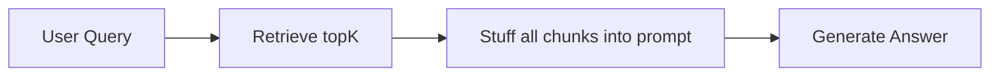
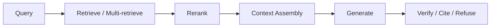
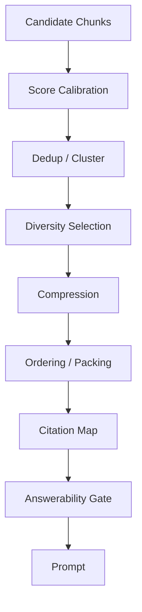

# RAG - 第 13 课：上下文工程：Token 预算、Lost-in-the-Middle、引用与拒答

## 学习目标（本节结束后你能做到什么）

1. 你能讲清为什么 RAG 不是 `retrieve topK -> 全塞 prompt`，而是要在检索后做一层严肃的`上下文工程`。
2. 你能解释 token 预算怎么分配：系统指令、用户问题、对话历史、证据、工具结果、输出空间分别要留多少。
3. 你能讲清 `Lost in the Middle` 的原理、为什么长上下文不等于高利用率，以及 `RULER / FILM-7B` 对这个问题的后续推进。
4. 你能设计一个现实可用的 `context assembly pipeline`：去重、重排、压缩、排布、引用、拒答、降级。
5. 你能在面试里回答：为什么 RAG 系统要拒答，为什么 citation 不是把 source id 贴上去，为什么“上下文越长越好”是错的。

---

## 1. 先把问题摆正：检索结束，不代表 RAG 已经准备好回答

很多初版 RAG 系统长这样：



这条链路看似简单，但生产里很容易出问题：

- topK 里有冗余 chunk
- topK 里有旧版本制度
- 多个来源互相矛盾
- 关键证据被放在 prompt 中间
- chunk 很长但只有一句相关
- 模型回答了，但 citation 指向的段落并不支持结论
- 证据不足时模型硬答

所以 RAG 的生成前阶段，其实不该叫“拼 prompt”。  
更准确的说法是：

`把检索结果编排成一个可被模型可靠使用、可被人审计的证据包。`

这就是上下文工程。

它处在这条链路里：



其中 `Context Assembly` 不是一个小步骤，而是一组决策：

- 哪些证据进来
- 进多少
- 以什么顺序进来
- 是否压缩
- 是否保留原文
- 怎么加引用 id
- 什么时候拒答
- 怎么给模型留输出空间

这一层的质量，常常决定最终答案是否稳定。

---

## 2. Token window 是容量，不是理解保证

2024 以后，很多模型上下文窗口变大。  
于是一个很自然的误解出现了：

`既然模型能吃 128K / 200K / 1M tokens，那 RAG 还需要精挑上下文吗？`

答案是：需要，而且更需要。

原因有三层。

### 2.1 长上下文会增加成本和延迟

输入越长：

- prefill latency 越高
- 输入 token 成本越高
- 首字延迟更难控
- cache 命中和复用更复杂

所以从工程上看，长上下文不是免费资源。

### 2.2 长上下文会增加噪声

更多 context 不等于更多 evidence。  
很多时候只是：

- 更多半相关段落
- 更多重复段落
- 更多过期段落
- 更多互相冲突的证据

如果检索质量不够，长上下文反而会把模型拖偏。

### 2.3 长上下文不代表模型能均匀利用所有位置

这就是 `Lost in the Middle`。

Liu 等人在 2023 的论文里发现：  
模型在多文档问答和 key-value retrieval 里，相关信息放在开头或结尾时表现最好，放在长上下文中间时明显变差，即便是显式支持长上下文的模型也会这样。

这说明：

`context window size` 和 `effective context utilization` 是两回事。

---

## 3. 2023 → 2026：上下文工程为什么越来越重要

### 3.1 2023：Lost in the Middle 把“长上下文幻觉”打破了

2023 的 `Lost in the Middle` 论文给 RAG 工程一个非常直接的提醒：

`不要假设模型会平等阅读 prompt 的每一个位置。`

这直接影响上下文排布策略：

- 最关键证据不要随机放
- 冗余内容不要挤占关键位置
- 如果有最终答案所需的核心证据，要明确靠前或靠近 query / instruction

### 3.2 2024：RULER 证明 Needle-in-a-Haystack 不够测长上下文

很多长上下文模型会用 needle-in-a-haystack 做展示：  
在很长文本里插一条“针”，看模型能不能找出来。

但 RULER 2024 指出：  
这种测试只覆盖很浅的长上下文能力。RULER 加入了多针、多跳 tracing、aggregation 等任务，并评测 17 个长上下文模型。

它的结论很重要：

- 很多模型在 vanilla needle 测试近乎完美
- 但随着 context length 和任务复杂度增加，性能会明显下降
- 声称 32K 以上窗口的模型，只有一部分能在 32K 长度维持满意表现

这给 RAG 的启示是：

`长上下文系统不能只测“能不能找到一句话”，还要测能不能综合、比较、聚合和抗干扰。`

### 3.3 2024：FILM-7B 说明问题不只在 prompt 排布，也在训练

`Make Your LLM Fully Utilize the Context` 提出 Information-Intensive Training，并训练出 `FILM-7B`。

它的核心判断是：

- Lost-in-the-middle 部分来自训练时缺乏显式监督
- 模型没有被充分训练去重视长上下文任意位置上的关键信息

这说明解决方案有两类：

1. `系统侧`
   - 重排、压缩、分块、证据靠前、减少噪声

2. `模型侧`
   - 长上下文训练、位置鲁棒训练、检索头优化

对大多数应用工程师来说，你不一定能训练 FILM 类模型，  
但你必须在系统侧做 context engineering。

### 3.4 2024-2025：引用和上下文压缩变成一等问题

这一阶段有两条很明显的线：

- `LongCite / ALCE / ContextCite`：答案要能追溯到具体证据，而不是只给一个笼统 source
- `RECOMP / LLMLingua-2 / EXIT / AttnComp`：上下文不能无限膨胀，要压缩、过滤、选择性增强

这说明行业已经从：

- “能答出来”

转向：

- “能用更少上下文答，并且能证明自己是从哪里答出来的”

### 3.5 2026：重点转向 search budget 和 abstention

2026 的 `Over-Searching in Search-Augmented LLMs` 特别值得放进这节课。

它指出 search-augmented LLM 经常会过度搜索：

- 不必要调用搜索
- 引入无关上下文
- 浪费计算
- 甚至伤害 unanswerable queries 上的 abstention

它还提出 `Tokens Per Correctness`，把性能和成本绑定起来看。

这给 2026 的上下文工程一个很清楚的方向：

`不是只追求更多检索、更长上下文，而是追求最小充分证据。`

---

## 4. 上下文工程到底要做什么：从候选证据到可回答证据包

可以把上下文工程拆成 8 个步骤：



### 4.1 Score calibration：不同召回源的分数不能直接比

如果你用了：

- BM25
- dense vector
- HyDE
- GraphRAG
- SQL result
- web search

它们的分数含义完全不同。  
不能简单把所有结果按原始 score 排序。

更成熟的做法是：

- 先在各路召回内部排序
- 用 RRF / normalized score 融合
- 再交给 reranker 或 evidence scorer

### 4.2 Dedup：去重不是省 token，而是防止模型被重复证据放大偏见

重复 chunk 会造成两个问题：

1. 浪费 token
2. 让模型误以为重复出现的观点更可信

尤其是制度文档、网页快照、版本化文档里，重复非常常见。  
上下文组装前必须做：

- near-duplicate detection
- same document adjacency merge
- version-aware dedup

### 4.3 Diversity selection：topK 全来自同一个文档，可能不是好事

如果问题需要多视角证据，  
你不能只拿最相关的 8 段，因为它们可能全来自同一章。

常见策略：

- MMR
- source cap
- document cap
- time cap
- evidence type quota

例如：

- 3 段政策正文
- 2 段实施细则
- 1 段最新公告
- 1 段历史变更说明

这比单纯 top7 更稳。

### 4.4 Compression：压缩不是摘要越短越好，而是证据保真

上下文压缩有三类：

1. `Extractive compression`
   - 只保留原文中的相关句子
   - 引用和审计更容易

2. `Abstractive compression`
   - 用模型重写/总结
   - 省 token，但有摘要幻觉风险

3. `Selective augmentation`
   - 如果证据无用，宁可不加
   - RECOMP 就明确包含这种思想

EXIT 2024 进一步强调 context-aware extractive compression：  
不是独立判断每个句子，而是在上下文里判断哪些句子该保留。

AttnComp 2025 则把压缩变成 adaptive：  
利用注意力和 Top-P compression，尝试保留最少但足够的文档集合，同时估计 response confidence。

所以到 2026，压缩的目标已经不是：

- “把 prompt 变短”

而是：

- “用更少 token 保留更强 answerability”

### 4.5 Ordering：证据排布会改变答案质量

根据 Lost in the Middle，证据位置很重要。  
常见排布策略包括：

1. `Best-first`
   - 最强证据最靠前
   - 简单有效

2. `Anchor-at-edges`
   - 最关键证据放开头和结尾
   - 缓解中间遗忘

3. `Question-aware grouping`
   - 按子问题分组
   - 对 decomposition / multi-hop 更友好

4. `Chronological ordering`
   - 对事件线、制度版本、法律变更特别重要

5. `Contradiction-first`
   - 如果存在冲突证据，显式告诉模型哪些来源冲突

没有一种排序永远最好。  
核心原则是：

`让模型少做无谓搜索，多做证据综合。`

### 4.6 Citation map：引用不是最后贴标签，而是上下文进入 prompt 时就要设计

真正可用的引用，至少要有：

- source id
- document id
- page / section / chunk id
- time / version
- span 或 sentence id
- 原文片段

如果你只给：

`[source: handbook.pdf]`

这几乎没法审计。

更好的做法是给每个证据块稳定 id：

```text
[S1] Employee Handbook v3.2, section 4.1, updated 2025-09-01
原文：员工离职后的门禁权限应在离职手续完成后 24 小时内停用。
```

然后要求模型：

- 每个事实性句子后必须引用 `S id`
- 不允许引用不支持该句子的 source
- 证据不足时必须说不足

### 4.7 Answerability gate：证据不足时，应该在生成前就拦

拒答不是失败。  
在 RAG 里，拒答是可靠性能力。

常见拒答触发条件：

- top evidence relevance 低
- 证据之间冲突且无法判定
- 检索结果只覆盖部分问题
- 没有权限访问必要证据
- 用户问题需要实时数据但知识库不新
- 问题本身模糊，需要澄清

2026 的 Over-Searching 也提醒我们：  
对不可回答问题，更多搜索和更多上下文可能伤害 abstention。

所以更成熟的系统不是：

- “找不到也硬答”

而是：

- “能判断自己证据不足，并说明缺什么”

---

## 5. Token 预算怎么分：不要等 prompt 爆了再裁剪

一个 RAG prompt 大致包含：

- system instruction
- developer / policy instruction
- user query
- conversation history
- retrieved evidence
- tool results
- output budget

真正成熟的做法是：  
在生成前就有预算表。

### 5.1 一个常用预算分配

假设模型上下文窗口是 32K，输出最多 2K。

可以先这么分：

| 区域 | 预算 | 说明 |
| --- | --- | --- |
| 系统与格式指令 | 1K | 固定模板，尽量短 |
| 用户问题与改写 | 1K | 包括原问题和子问题 |
| 对话历史 | 2K | 只保留任务相关历史 |
| 检索证据 | 22K | 主体证据区 |
| 工具结果 / SQL 结果 | 2K | 结构化结果要压缩展示 |
| 安全余量 | 2K | 防 tokenizer 估算误差 |
| 输出空间 | 2K | 不要把输入塞满导致回答被截断 |

这只是起点，不是固定公式。

### 5.2 按问题类型调整预算

不同问题预算应该不同：

- 单事实问题：证据少，输出短
- 多跳问题：子问题分组证据多
- 总结问题：证据覆盖范围要广
- 比较问题：每个对象都要留证据槽位
- 结构化数据问题：SQL 结果和口径说明比原始 chunk 更重要

这就是为什么 Query Routing 和 Context Engineering 是连着的。

### 5.3 不要让对话历史无脑吞掉证据空间

多轮 RAG 很容易让 conversation history 膨胀。  
但对很多事实查询来说，历史里真正有用的只是：

- 指代解析
- 约束继承
- 用户偏好

所以应该做：

- conversation state extraction
- query rewrite
- history summarization

而不是把完整聊天记录全塞进去。

---

## 6. 引用系统：citation 是“证据约束”，不是 UI 装饰

引用系统有三层。

### 6.1 Source-level citation

例如：

`参考 handbook.pdf`

这是最低级的引用。  
它只能说明答案大概来自哪个文档，不能说明哪句话支持哪个结论。

### 6.2 Passage-level citation

例如：

`[S3] 第 4.1 节`

这已经可用，但仍然不够细。  
如果 passage 很长，用户还是很难验证。

### 6.3 Sentence-level / claim-level citation

LongCite 2024 / ACL 2025 重点解决的就是这个问题：  
让长上下文问答中的回答可以生成 fine-grained sentence-level citations。

ALCE 2023 更早建立了一个可复现的 citation evaluation benchmark，  
它把评估拆成：

- fluency
- correctness
- citation quality

这些工作说明：

`好的引用不是答案末尾贴几个链接，而是每个事实性 claim 都能被具体证据支撑。`

### 6.4 引用的常见事故

1. `Citation laundering`
   - 答案是模型自己编的，但后面贴了一个看起来相关的 source

2. `Over-citation`
   - 每句话都引用，但很多引用不真正支持该句

3. `Under-citation`
   - 关键事实没有引用

4. `Wrong granularity`
   - 文档级引用太粗，无法审计

5. `Post-hoc citation`
   - 先生成答案，再用检索去找看起来像的证据
   - 这很危险，因为它不保证答案真实来自证据

更稳的设计是：

- 先构建 citation map
- 生成时强制从 citation map 中引用
- 生成后做引用校验

---

## 7. 拒答策略：什么时候应该说“证据不足”

拒答不是只靠一句 prompt：

`If you don't know, say you don't know.`

这句话有用，但远远不够。

更成熟的拒答应该是一个 gate。

### 7.1 基于检索分数的拒答

例如：

- top1 rerank score 低于阈值
- topK 平均分低
- 相关证据数量不足

优点：

- 快
- 易解释

缺点：

- 分数校准难
- 不同 query 类型阈值不同

### 7.2 基于证据覆盖的拒答

把用户问题拆成 requirements：

- 时间
- 对象
- 条件
- 指标
- 比较维度

然后检查证据是否覆盖每个 requirement。

例如问题：

`2025 年 Q4 华东区退款率最高的三个商家是什么？`

证据必须覆盖：

- 2025 Q4
- 华东区
- 退款率定义
- 商家维度
- 排序逻辑

只覆盖其中一部分，就应该拒答或澄清。

### 7.3 基于冲突检测的拒答

如果证据里存在：

- 新旧制度冲突
- 不同来源数字冲突
- 权威来源与非权威来源冲突

系统不应该直接平均或猜测。  
应该说明冲突，并优先使用：

- 最新版本
- 权威来源
- 用户有权限访问的来源

### 7.4 基于负证据的拒答

Over-Searching 2026 里一个很重要的观察是：  
负证据的存在会改善 abstention。

这对工程很有启发。

如果检索结果里明确出现：

- “当前政策未规定”
- “该数据尚未发布”
- “没有公开披露”

这类 negative evidence，应该被保留并传给模型，  
而不是因为“它看起来不是答案”就被过滤掉。

### 7.5 拒答不是终点，可以给下一步

好的拒答应该说明：

- 缺什么证据
- 已查到什么
- 为什么不足
- 用户可以补什么

例如：

```text
我目前无法确认这个结论。已检索到 2024 版制度和 2025 年通知，但没有找到 2026 年更新后的执行口径。需要补充最新 HR policy 或授权访问制度库后再判断。
```

这比简单说“我不知道”专业得多。

---

## 8. 降级链路：上下文太多、证据不足、延迟太高时怎么办

生产系统必须有降级策略。

### 8.1 上下文太多

可选降级：

- 提高 rerank 阈值
- source cap
- 只保留 top evidence sentence
- 先摘要再回答
- 问用户缩小范围

### 8.2 证据不足

可选降级：

- 触发二次检索
- 改写 query
- 换知识源
- 问澄清问题
- 拒答并说明缺口

### 8.3 延迟太高

可选降级：

- 关闭 LLM rerank
- 降低 candidate pool
- 只走快速 retriever
- 先流式返回“正在检索/已找到来源”
- 对长文总结走异步任务

### 8.4 引用校验失败

可选降级：

- 重写答案，只保留可引用 claim
- 删除无支持句子
- 回答“证据不足”
- 提供证据摘要，不做结论

---

## 9. Python 骨架：一个简单的上下文组装器

下面这个例子不是为了复刻论文，而是帮你把工程动作串起来：

- 预算估算
- 去重
- source cap
- 证据选择
- anchor-at-edges 排布
- answerability gate

```python
from __future__ import annotations

from dataclasses import dataclass
from typing import Iterable


@dataclass(frozen=True)
class Evidence:
    id: str
    source: str
    title: str
    text: str
    score: float
    updated_at: str | None = None


def rough_tokens(text: str) -> int:
    # 粗略估算，真实生产建议接入模型对应 tokenizer。
    return max(1, len(text) // 2)


def normalize_text(text: str) -> str:
    return " ".join(text.lower().split())


def dedup(evidences: Iterable[Evidence]) -> list[Evidence]:
    seen = set()
    result = []
    for ev in evidences:
        key = normalize_text(ev.text[:500])
        if key in seen:
            continue
        seen.add(key)
        result.append(ev)
    return result


def select_with_budget(
    evidences: list[Evidence],
    max_tokens: int,
    per_source_cap: int = 3,
    min_score: float = 0.35,
) -> list[Evidence]:
    selected = []
    used_tokens = 0
    source_count: dict[str, int] = {}

    for ev in sorted(evidences, key=lambda x: x.score, reverse=True):
        if ev.score < min_score:
            continue
        if source_count.get(ev.source, 0) >= per_source_cap:
            continue

        cost = rough_tokens(ev.text) + 40
        if used_tokens + cost > max_tokens:
            continue

        selected.append(ev)
        used_tokens += cost
        source_count[ev.source] = source_count.get(ev.source, 0) + 1

    return selected


def anchor_at_edges(evidences: list[Evidence]) -> list[Evidence]:
    """把最强证据放在开头和结尾，降低关键证据掉进中间的风险。"""
    if len(evidences) <= 2:
        return evidences

    ranked = sorted(evidences, key=lambda x: x.score, reverse=True)
    head = ranked[0]
    tail = ranked[1]
    middle = ranked[2:]
    return [head, *middle, tail]


def build_context(evidences: list[Evidence], token_budget: int = 6000) -> tuple[str, list[str]]:
    clean = dedup(evidences)
    selected = select_with_budget(clean, max_tokens=token_budget)

    if not selected:
        return "", ["NO_EVIDENCE"]

    selected = anchor_at_edges(selected)
    lines = []
    ids = []
    for i, ev in enumerate(selected, start=1):
        sid = f"S{i}"
        ids.append(sid)
        meta = f"{ev.title} | source={ev.source}"
        if ev.updated_at:
            meta += f" | updated_at={ev.updated_at}"
        lines.append(f"[{sid}] {meta}\n{ev.text.strip()}")

    return "\n\n".join(lines), ids


def answerability_check(selected_ids: list[str], min_evidence_count: int = 2) -> bool:
    return len(selected_ids) >= min_evidence_count
```

这段代码故意很朴素，但它体现了几个生产原则：

- 证据选择先于 prompt
- token budget 是硬约束
- source cap 防止单一来源垄断
- 引用 id 在上下文构建时就生成
- answerability gate 在生成前执行

---

## 10. 一个更稳的生成 prompt 结构

可以采用这种结构：

```text
你是一个企业知识库问答助手。

回答规则：
1. 只能基于 Evidence 中的信息回答。
2. 每个事实性句子后必须引用 [Sx]。
3. 如果 Evidence 不足以回答，必须说明证据不足，并列出缺失信息。
4. 如果 Evidence 之间冲突，必须指出冲突，不要自行猜测。

User Question:
{question}

Evidence:
{context}

Answer:
```

注意这里不是简单说“请引用来源”。  
它把 citation、refusal、conflict handling 都写成了硬约束。

真实生产里，还要配合：

- output parser
- citation validator
- evidence coverage checker
- post-generation verifier

否则模型仍可能违反规则。

---

## 11. 面试里最容易被问的 6 个问题

### 11.1 “为什么不把 topK 全塞给模型？”

因为 topK 里有冗余、噪声、冲突和过期信息。长上下文窗口也不保证模型能均匀利用所有位置。上下文组装要在 token 预算内选择最小充分证据，并安排顺序、引用和拒答。

### 11.2 “Lost in the Middle 对 RAG 有什么工程影响？”

关键证据的位置会影响模型使用效果。工程上应该避免把核心证据随机放在 prompt 中间，可以用 best-first、anchor-at-edges、按子问题分组等排布策略，同时减少无关中间噪声。

### 11.3 “citation 怎么做才可靠？”

引用 id 要在证据进入 prompt 前生成，并绑定到文档、版本、页码、chunk、句子或 span。生成时要求每个事实性 claim 引用对应 source，生成后还要验证引用是否真的支持该句。不能先编答案再事后找 citation。

### 11.4 “RAG 什么时候应该拒答？”

当证据相关性低、覆盖不完整、来源冲突、权限不足、数据过期或问题需要澄清时应该拒答。拒答要说明已查到什么、缺什么证据、为什么不足，以及用户下一步能补什么。

### 11.5 “长上下文模型会不会让 RAG 不需要检索？”

不会。长上下文降低了部分拼接压力，但增加了成本、延迟和噪声；RULER 等工作也说明有效上下文利用率不等于标称窗口大小。RAG 仍然需要检索、压缩和上下文编排。

### 11.6 “怎么评估上下文工程做得好不好？”

不能只看最终 answer accuracy，还要看：

- evidence token cost
- citation support rate
- answerability / abstention accuracy
- context precision
- latency / first-token latency
- redundant evidence ratio

2026 的 Over-Searching 提醒我们，性能要和 token 成本一起看。

---

## 12. 小结

1. 上下文工程是 RAG 的生成前调度层，目标是把候选检索结果变成可用、可引用、可拒答的证据包。
2. 长上下文是能力上限，不是使用保证；`Lost in the Middle` 和 `RULER` 都说明模型不一定能稳定利用所有位置。
3. token 预算、去重、多样性、压缩、排序、引用、拒答，是同一个系统问题，不是彼此孤立的小技巧。
4. 好的 citation 必须绑定到证据进入 prompt 的过程，而不是生成后贴链接。
5. 2026 的趋势不是无脑多检索，而是 search budget、minimal sufficient evidence 和 abstention。

---

## 13. 检查站

1. 为什么说 context window size 和 effective context utilization 不是一回事？
2. 如果 topK 召回里有 20 段相关内容，但 token 预算只能放 6 段，你会按哪些原则选择？
3. 为什么 post-hoc citation 有风险？一个更可靠的 citation pipeline 应该怎么设计？

---

## 14. 参考与延伸阅读

尽量只放论文、官方文档或官方仓库：

- Lost in the Middle, TACL 2023: [https://arxiv.org/abs/2307.03172](https://arxiv.org/abs/2307.03172)
- RULER, COLM 2024: [https://arxiv.org/abs/2404.06654](https://arxiv.org/abs/2404.06654)
- Make Your LLM Fully Utilize the Context / FILM-7B, NeurIPS 2024: [https://arxiv.org/abs/2404.16811](https://arxiv.org/abs/2404.16811)
- FILM-7B model card: [https://huggingface.co/In2Training/FILM-7B](https://huggingface.co/In2Training/FILM-7B)
- RECOMP, 2023: [https://arxiv.org/abs/2310.04408](https://arxiv.org/abs/2310.04408)
- LLMLingua-2, 2024: [https://arxiv.org/abs/2403.12968](https://arxiv.org/abs/2403.12968)
- EXIT, 2024: [https://arxiv.org/abs/2412.12559](https://arxiv.org/abs/2412.12559)
- AttnComp, EMNLP Findings 2025: [https://arxiv.org/abs/2509.17486](https://arxiv.org/abs/2509.17486)
- ALCE, EMNLP 2023: [https://aclanthology.org/2023.emnlp-main.398/](https://aclanthology.org/2023.emnlp-main.398/)
- LongCite, ACL Findings 2025: [https://aclanthology.org/2025.findings-acl.264/](https://aclanthology.org/2025.findings-acl.264/)
- ContextCite, NeurIPS 2024 / MIT CSAIL overview: [https://news.mit.edu/2024/citation-tool-contextcite-new-approach-trustworthy-ai-generated-content-1209](https://news.mit.edu/2024/citation-tool-contextcite-new-approach-trustworthy-ai-generated-content-1209)
- A Reality Check on Context Utilisation for RAG / DRUID, ACL 2025: [https://aclanthology.org/2025.acl-long.968/](https://aclanthology.org/2025.acl-long.968/)
- RHIO / GroundBench, ACL 2025: [https://aclanthology.org/2025.acl-long.826/](https://aclanthology.org/2025.acl-long.826/)
- Over-Searching in Search-Augmented LLMs, EACL 2026: [https://aclanthology.org/2026.eacl-long.361/](https://aclanthology.org/2026.eacl-long.361/)
