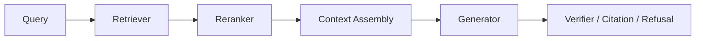

# RAG - 第 14 课：评测体系：RAGAs、ARES、TREC-RAG 与 LLM-as-judge

## 学习目标（本节结束后你能做到什么）

1. 你能讲清为什么 RAG 不能只用“回答对不对”一个指标评测，而必须拆成`检索、上下文、生成、引用、拒答、成本`多个维度。
2. 你能区分 `Recall@K / MRR / nDCG` 这类检索指标，和 `faithfulness / answer relevance / citation support / abstention accuracy` 这类生成指标。
3. 你能解释 RAGAs、ARES、RAGChecker、TREC-RAG 各自解决什么问题，为什么它们不是互相替代关系。
4. 你能说清 LLM-as-judge 的价值与风险：为什么它适合快速迭代，又为什么必须做校准、抽检和人类标注闭环。
5. 面试里如果被问“你怎么证明 RAG 系统变好了”，你能给出离线评测、线上观测、A/B、回归测试和错误归因的一整套回答。

---

## 1. 先把问题摆正：RAG 评测的难点，是它不是一个模型，而是一条链路

一个标准 RAG 系统至少有这些环节：



如果最后答案错了，可能是哪里错？

- query 改写错了
- retriever 没召回证据
- reranker 把证据排下去了
- context assembly 把关键证据裁掉了
- generator 没用证据
- citation 贴错了
- 应该拒答却硬答了
- 数据源本身过期了

所以 RAG 评测最重要的第一原则是：

`不要只评最终答案，要能定位是哪一层坏了。`

很多团队做 RAG 失败，不是因为没有评测，而是因为评测太粗。

比如他们只看：

- 用户点了赞没有
- LLM judge 给了 4/5 没有
- faithfulness 分数高不高

这些指标有价值，但无法回答：

`如果我换 embedding、调 chunk_size、加 reranker、改 prompt，具体是哪一层变好了？`

所以成熟 RAG 评测应该是：

`component-level diagnosis + end-to-end outcome + online monitoring`

---

## 2. 一个完整的 RAG 评测矩阵

可以先把评测对象按链路拆开：

| 层 | 核心问题 | 常用指标 |
| --- | --- | --- |
| Query understanding | 问题是否被正确改写、拆分、路由 | rewrite accuracy、routing accuracy、subquery coverage |
| Retrieval | 证据有没有被召回 | Recall@K、Hit@K、MRR、nDCG、context recall |
| Rerank | 正确证据是否被排到前面 | nDCG@K、MRR@K、pairwise preference accuracy |
| Context assembly | 进 prompt 的证据是否少而准 | context precision、redundancy ratio、token cost、coverage |
| Generation | 答案是否相关、正确、忠实 | answer relevance、correctness、faithfulness、groundedness |
| Citation | 每个事实是否有真实支持 | citation precision、citation recall、support rate |
| Refusal | 证据不足时是否拒答 | abstention accuracy、over-refusal、under-refusal |
| System | 是否可用、可扩展、可观察 | latency、cost、error rate、p95、token per correct answer |

这张表的意义很大：

`RAG 评测不是一个分数，而是一组仪表盘。`

---

## 3. 检索指标：先证明“正确证据进没进候选池”

检索评测是 RAG 里最应该先做的。  
因为如果证据没被召回，后面模型再强也很难稳定。

### 3.1 Hit@K / Recall@K

最简单的问题：

`topK 里有没有至少一个相关证据？`

如果每个 query 有一组 gold relevant documents：

```text
Recall@K = |relevant_docs ∩ topK_docs| / |relevant_docs|
Hit@K = 1 if relevant_docs ∩ topK_docs 非空 else 0
```

适合：

- FAQ
- 单证据问答
- 验证 embedding / hybrid / rerank 是否有效

局限：

- 只知道“有没有”，不知道排得好不好
- 对多证据问题不够细

### 3.2 MRR

MRR 关注第一个正确证据出现的位置：

```text
MRR = mean(1 / rank_of_first_relevant_doc)
```

如果正确证据总在第 1 位，MRR 高。  
如果正确证据虽然被召回但排在第 20 位，MRR 会低。

适合：

- 搜索体验
- reranker 评估
- first evidence 对生成影响很大的系统

### 3.3 nDCG

nDCG 支持 graded relevance，也就是：

- 0：无关
- 1：部分相关
- 2：相关
- 3：高度相关

它会奖励：

- 高相关文档排在前面
- 多个相关文档覆盖得更好

适合：

- 多文档证据
- 复杂查询
- reranker / fusion 方法比较

### 3.4 Context recall 与 context precision

传统 IR 指标评的是 doc list。  
RAG 还要评最终进入 prompt 的 context。

两个问题特别关键：

- `context recall`：回答所需信息有没有在 context 里？
- `context precision`：context 里有多少内容真的有用？

这也是 RAGAs、TruLens、Phoenix、DeepEval 这类工具都会强调 retrieval relevance / context relevance 的原因。

面试里可以这样说：

`Recall@K 评候选池，context precision/recall 评最终给模型的证据包。两者都要看。`

---

## 4. 生成指标：证明“模型有没有正确使用证据”

即使证据召回对了，答案也可能错。

常见失败包括：

- 模型忽略证据，用参数知识回答
- 模型把多个来源混成一个结论
- 模型引用了 A，却说了 B
- 模型补充了 context 里没有的细节
- 模型没有回答用户真正的问题

所以生成评测至少要拆成四个问题。

### 4.1 Faithfulness / groundedness

核心问题：

`答案中的 claim 是否被 retrieved context 支持？`

这不是问答案是否符合世界事实，  
而是问：

`答案是否忠实于给定证据。`

例如 context 里只说：

`员工离职后门禁权限应在 24 小时内停用。`

模型回答：

`员工离职后门禁、邮箱和 VPN 都会在 24 小时内停用。`

这就不是 faithful，因为邮箱和 VPN 不在证据里。

### 4.2 Answer relevance

核心问题：

`答案有没有真正回答用户问题？`

有些答案很忠实，但不相关。  
比如用户问“多久停用”，模型回答了一堆“谁负责审批”。

所以 relevance 和 faithfulness 是两件事。

### 4.3 Correctness

核心问题：

`答案和 gold answer 是否一致？`

这通常需要 reference answer 或人工标注。  
如果没有 reference，就只能用 LLM judge 或 claim-level evidence 近似。

### 4.4 Completeness / coverage

核心问题：

`答案是否覆盖了问题要求的所有方面？`

对多跳、多维度、比较型问题尤其重要。

例如：

`比较 2024 和 2025 两版政策的变化，并说明影响。`

答案必须覆盖：

- 2024
- 2025
- 变化点
- 影响

只答一个维度，faithfulness 可能高，但 completeness 低。

---

## 5. Citation 评测：不是有引用就行，而是引用真的支持 claim

第 `13` 节我们讲过，citation 是证据约束，不是 UI 装饰。

评测时也一样。

### 5.1 Citation precision

问题：

`被引用的 source 是否真的支持对应句子？`

如果模型每句话都贴引用，但很多引用只是主题相关而非直接支持，precision 就低。

### 5.2 Citation recall

问题：

`需要引用的事实性 claim 是否都有引用？`

如果答案里有很多事实结论没引用，recall 就低。

### 5.3 Sentence-level support

TREC 2024 RAG Search Track 的数据页就很有代表性：  
它不只提供文档检索相关性，还提供 nugget assessments 和 citation/support assessments，其中 citation/support 是按句子引用来评。

这说明前沿评测已经不是：

- “答案末尾有没有 sources”

而是：

- “每个句子是否有正确支持”

LongCite、ALCE、ContextCite 这条线也在强调 fine-grained citation。  
这对企业 RAG 很重要，因为审计和合规通常需要精确到段落、页面甚至句子。

---

## 6. Refusal / Abstention 评测：证明系统知道什么时候不该答

RAG 的可靠性不只是答对，也包括：

`证据不足时不乱答。`

### 6.1 三种情况要分开

| 情况 | 正确行为 | 评测关注 |
| --- | --- | --- |
| Answerable | 给出有证据支持的答案 | answer accuracy |
| Unanswerable | 拒答或说明证据不足 | abstention accuracy |
| Ambiguous | 澄清问题 | clarification accuracy |

很多系统只评 answerable questions，  
结果上线后遇到 unanswerable query 就开始胡说。

### 6.2 Over-refusal 和 under-refusal 都是问题

- `Over-refusal`：明明能答却拒答
- `Under-refusal`：证据不足却硬答

生产里两者都很伤：

- 过度拒答会降低可用性
- 不该答却答会降低信任

所以拒答评测应该包含：

- unanswerable test set
- outdated evidence test
- permission-denied test
- conflicting evidence test
- ambiguous query test

### 6.3 2026 的趋势：把拒答和搜索预算一起看

第 `13` 节提到的 Over-Searching 很关键。  
它提醒我们：

`更多搜索不一定让系统更可靠，反而可能让不可回答问题更容易被误答。`

所以 2026 的评测不能只看：

- answer accuracy

还要看：

- tokens per correct answer
- unnecessary search rate
- abstention under noise

---

## 7. RAGAs：快速自动化评测的代表，但不能当唯一真相

RAGAs 2023 的贡献在于：  
它把 RAG 评测拆成多个维度，并强调可以在没有人工 ground truth 的情况下做 reference-free evaluation。

原论文关注的维度包括：

- retrieval 是否找到了相关上下文
- LLM 是否忠实使用上下文
- 生成答案质量

截至 2026 年，Ragas 官方文档里已经形成了更丰富的 metrics 集合：

- Context Precision
- Context Recall
- Context Entities Recall
- Noise Sensitivity
- Response Relevancy
- Faithfulness
- Factual Correctness
- Semantic Similarity
- SQL 相关指标
- Agent / Tool use 指标

这说明它已经从早期 RAG 评测工具，扩展成更广义的 AI application evaluation 框架。

### 7.1 它适合什么

- 快速比较两个 RAG pipeline
- 每次改 chunk / embedding / rerank 后做回归测试
- 没有人类标注时先跑一版自动评测
- 生成 synthetic testset 辅助覆盖更多 query 类型

### 7.2 它不适合什么

- 直接替代人工标注
- 直接作为高风险业务上线门槛
- 不经校准就跨领域比较绝对分

RAGAs 很像温度计。  
它能帮你快速发现趋势，但温度计本身也要校准。

### 7.3 Synthetic testset 要谨慎使用

Ragas 官方文档强调理想测试集应覆盖真实场景、数量足够、持续更新以防数据漂移，也提供基于知识图谱的 synthetic testset generation。

这很有用，但要注意：

`合成问题经常覆盖“文档里显眼的信息”，但未必覆盖真实用户最会问的边界问题。`

所以更成熟的做法是：

- synthetic queries 做冷启动
- 真实线上 query 做回放集
- 人工标注做 calibration set
- 高风险场景单独建 adversarial set

---

## 8. ARES：用轻量 judge + 少量人工标注做更稳的自动评测

ARES 2023/2024 代表了另一条路线。

它评估三个核心维度：

- context relevance
- answer faithfulness
- answer relevance

但它不是简单调用一个大模型打分，而是：

- 用合成训练数据微调 lightweight LM judges
- 再用少量人工标注数据做 prediction-powered inference
- 目标是在减少人工标注成本的同时，保持统计可信度

这条路线非常适合企业理解：

`评测模型也应该被领域化、被校准，而不是永远依赖一个通用大模型打分。`

### 8.1 ARES 的工程启发

如果你的 RAG 系统服务：

- 法务
- 金融
- 医疗
- 企业内部制度

那通用 LLM judge 可能不够稳。  
你应该考虑：

- 人工标注少量 gold set
- 用它校准 judge
- 定期抽样复审
- 按业务域维护不同 judge rubric

### 8.2 ARES 和 RAGAs 的区别

可以这么记：

- `RAGAs` 更像通用自动化评测工具箱
- `ARES` 更像带统计校准的自动评测框架

它们不是替代关系。  
你可以先用 RAGAs 快速迭代，再用 ARES / 人工标注做更可信的上线评估。

---

## 9. RAGChecker / RAGBench：从“分数”走向“诊断”

2024 之后，一个明显趋势是：

`大家不满足于给 RAG 打一个总分，而是要解释为什么坏。`

### 9.1 RAGChecker

RAGChecker 2024 明确指出 RAG 评测难点来自：

- 模块化链路
- 长答案评测
- 指标可靠性

它提出一套同时面向 retrieval 和 generation 的 fine-grained diagnostic metrics，并声称和人类判断的相关性显著优于其他指标。

它的重要启发是：

`评测应该能指导你下一步改 retriever、改 generator，还是改 context assembly。`

### 9.2 RAGBench

RAGBench 2024 关注 explainable benchmark。  
它的价值在于提醒我们：

`RAG 评测不仅要告诉你对错，还要给出可解释的中间标注。`

这对于训练 judge、定位错误、对齐业务专家判断都很重要。

### 9.3 RAGTruth / HaluBench / Lynx

RAGTruth 2024 提供了近 `18,000` 个自然生成的 RAG responses，并做了 case-level 和 word-level hallucination annotations。  
Lynx / HaluBench 2024 则继续把重点放在 real-world hallucination detection。

这些工作的共同意义是：

`faithfulness 不能只靠一个 prompt 问 judge，要有更细粒度的 hallucination 标注和检测能力。`

---

## 10. TREC-RAG：为什么它对 2025-2026 很重要

TREC 是信息检索领域非常有传统的评测体系。  
TREC-RAG 的意义在于，它把 RAG 从“应用 demo 评测”拉回到更严肃的 shared task。

### 10.1 2024：把检索、nugget 和 citation/support 都纳入评测

TREC 2024 RAG Search Track 官方数据页包含：

- topics
- document retrieval relevance judgments
- UMBRELA passage relevance judgments
- nugget assessments
- citation/support assessments

这非常关键，因为它说明 RAG 的评测对象已经覆盖：

- 有没有找到文档
- 有没有覆盖答案要点
- 引用是否支持生成句子

### 10.2 2025：进入更复杂的信息需求和多子任务

TREC 2025 Proceedings 中，RAG Track 明确出现了：

- Retrieval
- Augmented Generation
- Retrieval-Augmented Generation
- Relevance Judgment

多个参赛系统也集中探索：

- sparse / dense / hybrid retrieval
- query decomposition
- agentic iterative retrieval
- gap-aware refinement
- nugget / cluster 级证据结构
- citation-grounded answer generation

这和我们前面课程的技术线完全对齐：  
RAG 评测正在从单轮问答，走向复杂信息需求下的证据覆盖、生成质量和引用质量。

### 10.3 面试里怎么表达 TREC-RAG 的价值

你可以说：

`TREC-RAG 的价值不是某个分数本身，而是它把 RAG 评测拆成 retrieval、nugget coverage、citation support 和 generation 这些可审计维度。它代表了 2025-2026 评测从简单 QA accuracy 走向 evidence-centered evaluation 的趋势。`

---

## 11. LLM-as-judge：好用，但绝不是裁判真理

LLM-as-judge 是 2024 之后 RAG 评测的主力，因为它便宜、快、能评开放式答案。  
但它必须被当成“可校准的测量仪器”，不能当真理。

### 11.1 为什么它有价值

G-Eval 2023 说明，使用 GPT-4 搭配 CoT 和 form-filling，可以在 NLG 评测上比传统 BLEU/ROUGE 更贴近人类判断。

MT-Bench / Chatbot Arena 2023 进一步说明，强 LLM judge 在开放式偏好评估里可以接近人类偏好一致性，同时也更可扩展。

这解释了为什么 RAG 评测大量采用 LLM judge：

- open-ended answer 没有唯一字符串答案
- faithfulness 需要语义判断
- citation support 需要读证据
- relevance / completeness 需要领域理解

### 11.2 它有哪些偏差

MT-Bench 论文明确讨论了：

- position bias
- verbosity bias
- self-enhancement bias
- reasoning limitation

G-Eval 也提醒 LLM-based evaluator 可能偏好 LLM-generated text。

在 RAG 里，这些偏差会变成：

- 长答案被误判更完整
- 看起来像权威语气的答案被高估
- judge 被 citation 数量迷惑
- judge 没发现引用其实不支持 claim
- judge 对自己同系列模型输出更宽容

### 11.3 怎么把 LLM judge 用稳

生产里至少要做 7 件事：

1. `固定 rubric`
   - 把评分维度写清楚，不让 judge 自由发挥

2. `pairwise + absolute 混用`
   - pairwise 更适合比较版本，absolute 更适合监控阈值

3. `blind evaluation`
   - 不告诉 judge 哪个是新版本，避免偏见

4. `position randomization`
   - 对 A/B 顺序随机化，缓解 position bias

5. `calibration set`
   - 用人工标注的小集合对齐 judge

6. `confidence / explanation`
   - 记录 judge 为什么这么打分，方便审计

7. `human audit`
   - 对低分、高风险、分歧大的样本人工复核

一句话：

`LLM-as-judge 可以让评测规模化，但不能让评测免校准。`

---

## 12. 离线评测集怎么建：不要只合成“容易题”

一个成熟 RAG eval set 至少要覆盖这些类型：

| 类型 | 目的 |
| --- | --- |
| 单事实问题 | 验证基础召回 |
| 多跳问题 | 验证 query decomposition / multi-hop |
| 比较问题 | 验证覆盖和排序 |
| 时间敏感问题 | 验证版本和 freshness |
| 权限问题 | 验证 ACL 和 metadata filter |
| 无答案问题 | 验证拒答 |
| 冲突证据问题 | 验证冲突处理 |
| 表格 / PDF / 多模态问题 | 验证解析和视觉链路 |
| 结构化数据问题 | 验证 Text-to-SQL / TableQA |
| 对抗问题 | 验证 prompt injection 和不可靠来源 |

### 12.1 Gold set 需要哪些字段

至少建议记录：

- query
- query type
- expected answer
- relevant document ids
- relevant chunk / span ids
- required claims
- allowed sources
- expected refusal or not
- metadata constraints
- rubric

如果只存：

`question -> answer`

那你只能评最终答案，不能诊断 RAG 链路。

### 12.2 合成数据的正确用法

合成数据适合：

- 冷启动
- 扩大覆盖
- 压测多跳 / 长尾类型

但不适合：

- 直接代表真实用户分布
- 直接替代人工 gold set

更好的比例是：

- 真实线上 query：主分布
- 专家标注样本：校准和上线门槛
- 合成样本：补 coverage
- adversarial 样本：守底线

---

## 13. 线上观测：离线分数高，不代表线上体验好

RAG 线上要监控三类指标。

### 13.1 质量指标

- answer accepted rate
- citation click / citation verified rate
- user correction rate
- escalation rate
- fallback / refusal rate
- answer regenerated rate

### 13.2 链路指标

- retrieval hit rate
- rerank score distribution
- context token count
- redundant context ratio
- judge faithfulness score
- citation support score
- abstention rate by query type

### 13.3 系统指标

- p50 / p95 latency
- first-token latency
- token cost
- model error rate
- vector DB latency
- index freshness lag
- cache hit rate

这三类必须一起看。  
否则你会遇到典型误判：

- 答案质量高，但 p95 太慢，用户流失
- faithfulness 高，但拒答过多，体验差
- 检索 recall 高，但 token cost 爆炸
- LLM judge 分数高，但 citation 点击后用户发现证据不支持

---

## 14. A/B 与回归测试：怎么证明一个改动真的变好

### 14.1 离线实验

每次改动都要对同一套 eval set 跑：

- baseline
- candidate
- per-query diff
- query type breakdown
- significance / confidence interval

不要只看平均分。  
平均分可能掩盖：

- FAQ 变好
- 多跳变差
- 中文变好
- 表格变差

### 14.2 线上 A/B

线上 A/B 应该看：

- 用户满意度
- 任务完成率
- 引用点击与留存
- 重新提问率
- escalation rate
- 延迟和成本

### 14.3 Shadow mode

高风险系统可以先 shadow：

- 新系统不直接回给用户
- 只记录它会怎么答
- 用 judge 和人工抽检比较

这对企业内部知识库、法务、医疗、财务尤其重要。

---

## 15. Python 骨架：最小 RAG 评测器

下面这个例子不依赖外部库，展示最核心的评测思想：

- Recall@K
- MRR@K
- nDCG@K
- citation support rate
- abstention accuracy

```python
from __future__ import annotations

import math
from dataclasses import dataclass
from typing import List


@dataclass
class EvalCase:
    query: str
    relevant_doc_ids: set[str]
    retrieved_doc_ids: list[str]
    should_answer: bool
    did_answer: bool
    cited_doc_ids: list[str]
    supported_cited_doc_ids: set[str]


def recall_at_k(case: EvalCase, k: int) -> float:
    if not case.relevant_doc_ids:
        return 1.0
    retrieved = set(case.retrieved_doc_ids[:k])
    return len(retrieved & case.relevant_doc_ids) / len(case.relevant_doc_ids)


def mrr_at_k(case: EvalCase, k: int) -> float:
    for rank, doc_id in enumerate(case.retrieved_doc_ids[:k], start=1):
        if doc_id in case.relevant_doc_ids:
            return 1.0 / rank
    return 0.0


def dcg(relevances: List[int]) -> float:
    return sum(rel / math.log2(idx + 2) for idx, rel in enumerate(relevances))


def ndcg_at_k(case: EvalCase, k: int) -> float:
    # 简化版：相关文档 relevance=1，不相关=0。
    gains = [1 if doc_id in case.relevant_doc_ids else 0 for doc_id in case.retrieved_doc_ids[:k]]
    ideal = sorted(gains, reverse=True)
    ideal_dcg = dcg(ideal)
    if ideal_dcg == 0:
        return 0.0
    return dcg(gains) / ideal_dcg


def citation_precision(case: EvalCase) -> float:
    if not case.cited_doc_ids:
        return 1.0 if not case.did_answer else 0.0
    supported = sum(1 for doc_id in case.cited_doc_ids if doc_id in case.supported_cited_doc_ids)
    return supported / len(case.cited_doc_ids)


def abstention_correct(case: EvalCase) -> bool:
    if case.should_answer:
        return case.did_answer
    return not case.did_answer


def aggregate(cases: list[EvalCase], k: int = 5) -> dict[str, float]:
    n = len(cases)
    return {
        f"recall@{k}": sum(recall_at_k(c, k) for c in cases) / n,
        f"mrr@{k}": sum(mrr_at_k(c, k) for c in cases) / n,
        f"ndcg@{k}": sum(ndcg_at_k(c, k) for c in cases) / n,
        "citation_precision": sum(citation_precision(c) for c in cases) / n,
        "abstention_accuracy": sum(abstention_correct(c) for c in cases) / n,
    }
```

真实生产里，`relevant_doc_ids`、`supported_cited_doc_ids` 当然不能都手写。  
它们可以来自：

- 人工标注
- LLM judge
- TREC-style qrels
- citation verifier
- domain expert review

但这段代码能帮你抓住核心：

`先定义你要测什么，再选择工具。不要反过来。`

---

## 16. 一个成熟团队的 RAG 评测流程

可以按这个节奏推进：

1. `冷启动`
   - RAGAs / Phoenix / TruLens 快速搭评测
   - 合成一批问题
   - 找明显坏点

2. `第一版 gold set`
   - 收集真实 query
   - 标注 relevant chunks、expected answer、refusal
   - 建基础 dashboard

3. `组件回归`
   - chunk / embedding / hybrid / rerank / prompt 每次改动都跑同一套集

4. `judge 校准`
   - 抽 200-500 条人工标注
   - 校准 LLM judge / 轻量 judge
   - 监控 judge drift

5. `线上观测`
   - trace 每次检索、rerank、context、生成、引用
   - 对失败样本进入 error taxonomy

6. `持续更新`
   - 每周或每月把线上失败样本纳入 regression set
   - 对新数据源、新权限、新业务口径新增专项评测

---

## 17. 面试里最容易被问的 6 个问题

### 17.1 “你怎么评估 RAG 系统？”

不要只说 RAGAs。  
更稳的回答是：

我会分层评估：retrieval 用 Recall@K、MRR、nDCG；context 用 precision/recall、冗余率和 token cost；generation 用 faithfulness、answer relevance、correctness；citation 用 support rate；unanswerable query 用 abstention accuracy；最后线上看用户反馈、延迟、成本和失败样本回流。

### 17.2 “为什么不能只看最终 answer accuracy？”

因为 answer accuracy 不能定位问题。答案错可能是 retriever 没找回来，也可能是 reranker 排错、context 裁掉、generator 幻觉、citation 错配。RAG 是链路系统，必须 component-level diagnosis。

### 17.3 “LLM-as-judge 靠谱吗？”

靠谱但不能无校准使用。它适合开放式答案的快速评测，但有 position、verbosity、self-enhancement 等偏差。生产里需要固定 rubric、顺序随机、人工校准集、抽样复核和 judge drift 监控。

### 17.4 “RAGAs 和 ARES 有什么区别？”

RAGAs 更像通用自动化评测工具箱，强调多维 reference-free metrics 和 synthetic testset；ARES 更强调用合成数据训练轻量 judge，再用少量人工标注做统计校准。前者适合快速迭代，后者更适合严肃上线评估。

### 17.5 “TREC-RAG 对产业有什么意义？”

它把 RAG 评测推进到 evidence-centered evaluation，不只看最终答案，还看 retrieval relevance、nugget coverage、citation/support 和复杂信息需求。这和企业 RAG 对可审计、可追责的要求更接近。

### 17.6 “如何防止评测集被污染或过拟合？”

保留 hidden set；按时间滚动更新；真实线上 query 和合成 query 分开；对高频失败类型建专项集；不要只优化一个平均分；上线前看 query-type breakdown 和人工抽检。

---

## 18. 小结

1. RAG 评测必须拆链路：检索、重排、上下文、生成、引用、拒答和系统成本都要看。
2. RAGAs、ARES、RAGChecker、TREC-RAG 代表了不同方向：快速自动评测、统计校准、细粒度诊断、shared task 级 evidence-centered evaluation。
3. LLM-as-judge 是生产 RAG 评测的核心工具，但必须经过 rubric、校准、随机化和人工抽检。
4. 评测集不能只靠合成问题，必须结合真实 query、人工 gold set、unanswerable/adversarial set 和持续线上回流。
5. 2026 的趋势是：评测不只问“答得对不对”，还问“用多少成本、基于哪些证据、能否正确引用、该拒答时是否拒答”。

---

## 19. 检查站

1. 为什么 RAG 的 retrieval recall 高，不代表最终答案一定好？
2. 如果一个系统 faithfulness 高但用户仍然不满意，可能是哪几层出了问题？
3. 你会如何设计一个包含 answerable、unanswerable、permission-denied、conflicting-evidence 的 RAG eval set？

---

## 20. 参考与延伸阅读

尽量只放论文、官方文档或官方项目：

- RAGAs paper: [https://arxiv.org/abs/2309.15217](https://arxiv.org/abs/2309.15217)
- Ragas 官方 metrics 文档: [https://docs.ragas.io/en/stable/concepts/metrics/](https://docs.ragas.io/en/stable/concepts/metrics/)
- Ragas testset generation: [https://docs.ragas.io/en/latest/concepts/test_data_generation/](https://docs.ragas.io/en/latest/concepts/test_data_generation/)
- ARES paper: [https://arxiv.org/abs/2311.09476](https://arxiv.org/abs/2311.09476)
- ARES GitHub: [https://github.com/stanford-futuredata/ARES](https://github.com/stanford-futuredata/ARES)
- RAGChecker paper: [https://arxiv.org/abs/2408.08067](https://arxiv.org/abs/2408.08067)
- RAGChecker GitHub: [https://github.com/amazon-science/RAGChecker](https://github.com/amazon-science/RAGChecker)
- RAGBench paper: [https://arxiv.org/abs/2407.11005](https://arxiv.org/abs/2407.11005)
- RAGTruth, ACL 2024: [https://aclanthology.org/2024.acl-long.585/](https://aclanthology.org/2024.acl-long.585/)
- RAGTruth GitHub: [https://github.com/ParticleMedia/RAGTruth](https://github.com/ParticleMedia/RAGTruth)
- Lynx / HaluBench: [https://arxiv.org/abs/2407.08488](https://arxiv.org/abs/2407.08488)
- TREC 2024 RAG Search Track data: [https://trec.nist.gov/data/rag2024.html](https://trec.nist.gov/data/rag2024.html)
- TREC 2025 RAG Proceedings: [https://pages.nist.gov/trec-browser/trec34/rag/proceedings/](https://pages.nist.gov/trec-browser/trec34/rag/proceedings/)
- TREC 2025 Proceedings index: [https://trec.nist.gov/pubs/trec34/index.html](https://trec.nist.gov/pubs/trec34/index.html)
- G-Eval, EMNLP 2023: [https://aclanthology.org/2023.emnlp-main.153/](https://aclanthology.org/2023.emnlp-main.153/)
- MT-Bench / Chatbot Arena LLM-as-judge: [https://arxiv.org/abs/2306.05685](https://arxiv.org/abs/2306.05685)
- TruLens RAG Triad: [https://www.trulens.org/getting_started/core_concepts/rag_triad/](https://www.trulens.org/getting_started/core_concepts/rag_triad/)
- Phoenix Evaluate RAG: [https://arize.com/docs/phoenix/cookbook/evaluation/evaluate-rag](https://arize.com/docs/phoenix/cookbook/evaluation/evaluate-rag)
- Phoenix Retrieval Relevance evaluator: [https://arize.com/docs/phoenix/evaluation/pre-built-metrics/retrieval-rag-relevance](https://arize.com/docs/phoenix/evaluation/pre-built-metrics/retrieval-rag-relevance)
- DeepEval RAG metrics: [https://docs.confident-ai.com/docs/metrics-introduction](https://docs.confident-ai.com/docs/metrics-introduction)
