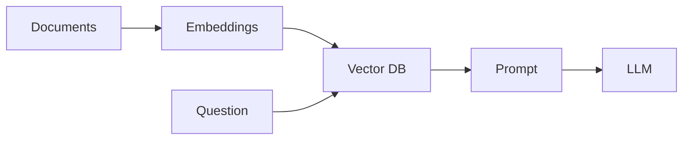
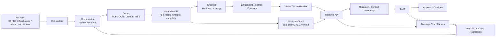
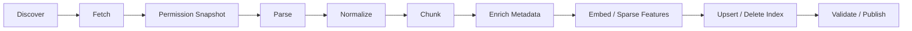
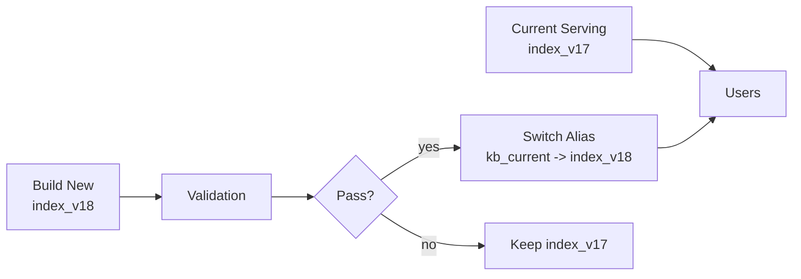
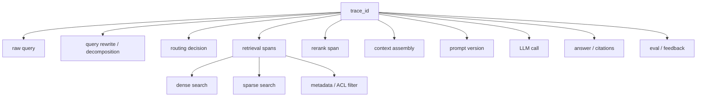

# RAG - 第 15 课：工程落地：数据 Pipeline、增量索引、多租户、语义缓存与成本

## 学习目标（本节结束后你能做到什么）

1. 你能把 RAG 从 `向量库 + LLM API` 讲成一个可运维的数据系统，覆盖数据接入、解析、索引、权限、缓存、观测、回滚和成本。
2. 你能设计一条生产级 ingestion pipeline：支持批处理、事件触发、失败重试、幂等写入、增量索引、删除和回放。
3. 你能讲清多租户与权限过滤的工程边界：什么时候用 namespace，什么时候用 metadata filter，为什么不能靠 post-filter 兜安全。
4. 你能解释语义缓存、检索缓存、embedding 缓存、prefix / KV cache 的区别，以及它们各自会带来的越权、陈旧和错误命中风险。
5. 你能给出 RAG 系统的成本公式、容量规划指标、SLO 仪表盘和常见故障预案。

---

## 1. 先把问题摆正：生产 RAG 不是一个无状态问答函数

Demo 级 RAG 通常长这样：



这张图对入门有用，但对生产几乎是危险的。  
因为它暗含了几个不成立的假设：

- 文档不会变
- 权限不会变
- 解析不会错
- embedding 模型不会换
- index 写入永远成功
- 删除可以忽略
- cache 命中一定安全
- 回答错误能靠 prompt 修
- 成本和延迟不是问题

生产环境里的 RAG 更接近一套“带 AI 特性的搜索数据平台”：



这一节的核心判断是：

`RAG 的工程难点，不在“能不能查一次”，而在“数据持续变化时，系统能不能安全、可追踪、低成本地持续查对”。`

面试里如果你能从这个角度展开，基本就已经离开“调 prompt 工程师”的层级了。

---

## 2. 2024 → 2025 → 2026：工程重心为什么迁到 pipeline、权限和成本

### 2.1 2024：从 Demo 爆发到“索引状态”暴露

2024 年大量团队开始把 RAG 接到内部知识库。早期系统通常关注：

- embedding 选哪个
- chunk size 多大
- topK 取多少
- 是否加 reranker
- prompt 怎么写

但上线后最先炸的往往不是模型，而是数据状态：

- 旧制度还在被召回
- 删除过的文档还在回答
- PDF 解析新版本把表格切碎
- 同一文档重复入库 3 次
- Confluence 页面改了，但向量库没更新
- HR 文档被工程租户查到了

所以 2024 的工程教训是：

`RAG 索引不是缓存，它是一个需要生命周期管理的派生数据系统。`

派生数据系统的关键词不是 `topK`，而是：

- source of truth
- manifest
- incremental update
- idempotency
- lineage
- rollback
- recovery

### 2.2 2025：Agentic / 多模态 / GraphRAG 把 pipeline 复杂度继续放大

进入 2025，RAG 不再只是“查几个 chunk”：

- Agentic RAG 会多轮调用 retriever
- GraphRAG 会构建实体、关系、社区摘要
- 多模态 RAG 会处理 OCR、layout、图片、表格、公式
- 结构化数据 RAG 会接入 warehouse、BI、semantic layer
- 评测系统会不断回放线上 query

这些都意味着：

`索引不再是一张向量表，而是一组可复现的数据产品。`

一个企业知识库可能同时有：

- 原文对象
- 解析后的元素
- chunk
- parent document
- summary node
- entity node
- relationship edge
- sparse token index
- dense vector index
- rerank feature
- ACL snapshot
- citation map
- eval dataset

每一个对象都可能有版本。  
任何一个版本对不上，都可能造成“看起来能答，但证据链错了”。

### 2.3 2026：最新趋势是把 RAG 纳入 DataOps / LLMOps，而不是单独做一个小服务

截至 2026-04-23，我对行业走向的判断是：

- 编排层更依赖 Airflow / Prefect 这类成熟 workflow 系统，而不是手写 cron。
- 数据资产、血缘和语义层开始进入 RAG 设计，dbt artifacts / semantic models / OpenLineage 这类体系越来越重要。
- 向量库产品普遍强化 multi-tenancy、filter-aware ANN、backup / restore 和 cost governance。
- LLM 应用观测从“看 token”升级到 tracing + eval + dataset + prompt version。
- 语义缓存从应用侧技巧，变成成本治理、延迟治理和推理服务优化的一部分。
- KV cache / prefix cache 从模型服务内部优化，逐步和 RAG 的多 chunk 上下文复用结合。

一句话：

`2026 的生产 RAG，不是 AI demo，而是 DataOps + Search Infra + LLMOps 的交叉系统。`

---

## 3. 生产级 RAG 的四类状态

要设计好工程落地，先要识别系统里到底有哪些状态。

### 3.1 Source state：源数据状态

源数据是事实来源：

- S3 文件
- 数据库表
- Confluence 页面
- Notion 页面
- SharePoint 文档
- Slack thread
- Jira ticket
- Git repository
- CRM / ERP 记录

你至少要记录：

| 字段 | 含义 |
| --- | --- |
| `source_system` | 数据来自哪里 |
| `source_doc_id` | 源系统里的稳定 ID |
| `source_uri` | 可审计的访问路径 |
| `source_updated_at` | 源系统更新时间 |
| `source_etag` / `content_hash` | 内容是否变化 |
| `owner` | 业务归属 |
| `acl_snapshot_id` | 当时的权限快照 |

不要只存文件名。  
文件名不是 identity，路径也经常变。  
生产里最好有稳定的 `source_doc_id`，否则增量索引会非常痛苦。

### 3.2 Derived state：派生数据状态

RAG 索引里的 chunk、embedding、summary、graph node 都不是事实来源，而是派生状态。

派生状态必须能回答：

- 它由哪个源文档生成？
- 用哪个 parser 版本生成？
- 用哪个 chunker 版本生成？
- 用哪个 embedding 模型生成？
- 写入哪个 index 版本？
- 是否仍然有效？

一个 chunk 最小应该长这样：

```text
chunk_id
source_doc_id
source_version
chunker_version
parser_version
embedding_model_version
index_version
content_hash
text
metadata
acl_snapshot_id
created_at
valid_from
valid_to
deleted_at
```

这里最关键的是：

`chunk_id 不应该是随机 UUID，而应该尽量可确定。`

否则重复运行 pipeline 时，你很难知道这是同一个 chunk 的更新，还是一个全新的 chunk。

### 3.3 Serving state：线上服务状态

线上服务状态包括：

- retriever 配置
- routing 策略
- reranker 版本
- prompt 版本
- context assembly 策略
- model 版本
- cache key 规则
- 线上 feature flag

很多 RAG 事故来自这里：

`索引没变，但 prompt / reranker / router 变了，答案突然变差。`

所以线上每次回答都应该记录：

- request id / trace id
- user / tenant / permission scope
- query rewrite 结果
- routed data source
- retriever version
- index version
- topK candidates
- rerank scores
- final context ids
- prompt version
- model version
- cache hit / miss
- answer
- citations

### 3.4 Evaluation state：评测与回归状态

第 14 节讲过，RAG 评测不是一次性脚本。  
生产里要把评测也当状态管理：

- offline dataset version
- golden answer / golden evidence
- judge prompt version
- evaluator model version
- production trace sample
- regression baseline
- release gate

否则你会遇到一个经典问题：

`我知道这次改动分数变了，但我不知道是系统变了、数据变了，还是评测器变了。`

---

## 4. 数据 Pipeline：从“导入文件”到“可回放的数据产品”

### 4.1 Pipeline 的职责

生产级 RAG ingestion pipeline 至少包含 10 步：



每一步都有失败可能。

- Discover 失败：漏文档
- Fetch 失败：源系统限流
- Permission Snapshot 失败：权限不完整
- Parse 失败：PDF 为空、表格错位
- Normalize 失败：元素顺序错
- Chunk 失败：切断表格或代码块
- Embed 失败：模型限流、维度不一致
- Upsert 失败：部分写入
- Validate 失败：索引召回下降
- Publish 失败：线上读到半成品 index

所以 pipeline 不是“跑通一次”的脚本，而是一个有状态、有重试、有回滚的系统。

### 4.2 Orchestrator：Airflow / Prefect 的位置

Airflow 和 Prefect 在 RAG pipeline 里不是为了“显得专业”，而是解决几个后端会很熟的生产问题：

- 任务依赖：解析必须在 fetch 后，embedding 必须在 chunk 后。
- 动态 fan-out：每天有多少文档变化是运行时才知道的。
- 重试与补偿：某个源系统限流后可以局部重试。
- 并发控制：OCR / embedding / vector write 都可能需要限流。
- 事件触发：源数据变化后触发 pipeline。
- 可见性：哪个任务失败、失败多久、影响哪些数据。

Airflow 近年来强化了 Dynamic Task Mapping 和 Asset-Aware Scheduling。  
这对 RAG 很有用：你可以先发现当天变更的文档列表，再按文档动态展开解析和 embedding 任务；也可以把某个 S3 prefix、dbt artifact 或知识库快照当成 asset，由 asset 更新触发下游索引任务。

Prefect 的特点是事件、automations、deployment 和动态基础设施体验更直接。  
对很多团队来说，Prefect 更适合从 Python pipeline 起步，Airflow 更适合已经有成熟数据平台的组织。  
这不是绝对结论，而是组织成本和生态选择。

面试表达可以这样说：

`RAG ingestion 本质是数据 pipeline。小规模可以用队列 + worker，大规模应该纳入 Airflow / Prefect 这类编排系统，关键不是工具名，而是支持动态任务、幂等、重试、限流、血缘和可观测。`

### 4.3 Connector：源系统接入不是下载文件这么简单

源系统接入要处理：

- 分页
- 增量游标
- 限流
- 失败重试
- 认证刷新
- 删除事件
- 权限同步
- 源系统 schema 演化
- 附件 / 图片 / 表格
- 大文件分片下载

Unstructured 这类工具之所以重要，不只是解析文档，也因为它们逐步把 source connector 和 destination connector 做成了 pipeline 组件。  
官方连接器覆盖 S3、Google Drive、SharePoint、Confluence、Slack、Jira、Salesforce、PostgreSQL、Snowflake、Qdrant、Pinecone、Weaviate、Redis 等来源和目的地，这说明行业在往“可组合 ingestion”方向走。

但注意：

`connector 能拉数据，不等于你的增量索引就安全。`

你仍然要自己定义 identity、version、ACL、delete 和 manifest。

### 4.4 Manifest：生产 RAG 的“账本”

建议每次 ingestion run 生成 manifest：

```json
{
  "run_id": "ingest_2026_04_23_001",
  "source_system": "confluence",
  "pipeline_version": "rag_ingest_v4",
  "parser_version": "doc_parser_2026_04_01",
  "chunker_version": "chunker_contextual_v3",
  "embedding_model_version": "bge-m3@2025-xx",
  "target_index_version": "kb_dense_v17",
  "started_at": "2026-04-23T02:00:00Z",
  "documents_seen": 12034,
  "documents_changed": 317,
  "documents_deleted": 12,
  "chunks_upserted": 4821,
  "chunks_deleted": 233,
  "status": "completed"
}
```

Manifest 的价值：

- 能解释线上答案来自哪次构建
- 能重放某次构建
- 能定位某次 parser 变更影响了哪些文档
- 能做增量 diff
- 能支持回滚
- 能做审计

dbt 的 artifacts 思路很值得借鉴。  
dbt 每次 invocation 会生成 `manifest.json`、`run_results.json`、`sources.json`、`semantic_manifest.json` 等 artifacts，用来支撑文档、状态、source freshness、运行分析和结构变化追踪。RAG pipeline 也应该有自己的 artifacts。

### 4.5 Lineage：为什么 RAG 也需要血缘

OpenLineage 的价值在 RAG 里很直观：

如果某个答案引用了一个错误 chunk，你要能一路追溯：

```text
answer
-> context chunk ids
-> vector index version
-> embedding model version
-> chunker version
-> parser output
-> source document version
-> source system
-> ingestion run
```

没有 lineage，RAG 调试会变成玄学：

`这个答案为什么错？不知道，可能是模型，也可能是检索，也可能是数据。`

有 lineage，你能定位：

- 这批错误是否来自同一个 parser 版本
- 是否只影响某个 source connector
- 是否从某个 ingestion run 后开始
- 是否是某个 ACL 更新没有同步
- 是否是某个 index alias 切换导致

这就是为什么生产 RAG 最后一定会靠近 DataOps。

---

## 5. 增量索引：真正的难点是 update、delete 和 version

### 5.1 全量重建为什么不够

全量重建最简单：

```text
read all docs -> parse all -> chunk all -> embed all -> rebuild index
```

它适合：

- 数据量很小
- 每晚离线重建
- 权限不复杂
- 用户不需要实时更新
- 成本不是瓶颈

但生产里全量重建常常不可接受：

- 文档量大，embedding 成本高
- OCR / VLM 解析很贵
- 重建时间长，freshness 差
- 写入期间容易出现新旧混读
- 删除和权限变更需要更快生效
- 某个源系统失败会拖垮整批构建

所以多数生产系统需要增量索引。

### 5.2 增量索引的基本策略

增量索引不是“只 upsert 新文档”，而是四类变更：

| 变更类型 | 例子 | 处理方式 |
| --- | --- | --- |
| 新增 | 新上传制度文档 | parse -> chunk -> embed -> upsert |
| 修改 | Confluence 页面改了 | 删除旧 chunks 或置为无效，再写新 chunks |
| 删除 | 文档被删除或归档 | tombstone + index delete |
| 权限变化 | 某个部门失去访问权 | 更新 ACL index / metadata，必要时重写 chunk |

最容易漏的是后两类。

如果你只处理新增和修改，系统会长期保留“幽灵知识”：

- 源文档删了，向量库还在
- 权限撤了，缓存里还在
- 文档归档了，旧 chunk 还被召回

这类事故比回答错更严重，因为它可能是安全事件。

### 5.3 用 content hash 做变更检测

常见做法：

```text
source_doc_id + source_updated_at + content_hash
```

其中 `content_hash` 很关键。  
因为很多源系统的 `updated_at` 并不可靠：

- 改权限会更新时间，但内容没变
- 改标题会更新时间，但正文没变
- 导入工具会刷新更新时间
- 源系统 bug 导致更新时间不变

建议把“内容变化”和“元数据 / 权限变化”拆开：

```text
content_hash = hash(normalized_content)
metadata_hash = hash(title, source_uri, author, tags, ...)
acl_hash = hash(tenant_id, groups, users, roles, visibility)
```

然后按类型处理：

- `content_hash` 变：重解析 / 重切分 / 重 embed
- `metadata_hash` 变：更新 metadata，不一定重 embed
- `acl_hash` 变：更新 ACL，不一定重 embed，但必须让权限立即生效

### 5.4 稳定 chunk_id：幂等的核心

一种可用的 chunk id 设计：

```text
chunk_id = sha256(
    tenant_id
    + source_system
    + source_doc_id
    + source_version
    + parser_version
    + chunker_version
    + chunk_ordinal
)
```

为什么不用随机 UUID？

因为增量 pipeline 经常会重试：

- embedding API 超时，重跑同一批
- vector DB 部分写入，重跑同一文档
- worker crash，任务重新调度

如果每次 chunk_id 都变，重试会制造重复 chunk。  
如果 chunk_id 稳定，upsert 就是幂等的。

但也要注意一个 tradeoff：

`chunk_ordinal` 在文档中间插入内容后可能整体漂移。

更稳的做法可以结合：

- 结构路径：章节标题、页码、表格 id
- 内容局部 hash
- chunk ordinal

例如：

```text
chunk_id = sha256(source_doc_id + section_path + local_content_hash + chunker_version)
```

这能减少“文档前面加一段话导致所有 chunk_id 都变”的问题。

### 5.5 Delete：不要把删除当成 upsert 的反面

删除有三层：

1. `soft delete`
   - 在 metadata store 标记 `deleted_at`
   - 服务层过滤掉
   - 可用于审计和恢复

2. `index delete`
   - 从向量库 / sparse index 删除对应 chunk
   - 减少误召回和存储成本

3. `hard delete`
   - 从对象存储、日志、缓存、备份策略里按合规要求清理
   - 常见于 GDPR / PII / 企业数据删除

生产里通常会先 soft delete，再异步 index delete。  
但要小心：

`如果服务层只查向量库，不查 metadata store 的有效性，异步删除窗口里仍然可能召回旧 chunk。`

所以可靠做法是：

- 检索时带 `deleted_at is null`
- 检索时带 `valid_to is null`
- 删除事件进入高优先级队列
- 语义缓存同时按 source_doc_id / index_version 失效
- 周期性跑 orphan chunk 检查

### 5.6 Blue-green index：避免用户读到半成品

如果你要迁移 embedding 模型、chunk 策略或大规模重建，不要直接覆盖线上 index。

更稳的模式：



核心原则：

- 新 index 离线构建
- 构建完成后跑 smoke retrieval / eval set
- 通过后切 alias 或配置
- 保留旧 index 一段时间
- 出问题快速回滚 alias

向量库不一定都叫 alias，但都要实现类似能力：

- index / collection version
- serving config version
- rollback path

### 5.7 Embedding 模型迁移：不要“原地换维度”

换 embedding 模型有几种风险：

- 向量维度不同
- 相似度分布不同
- hybrid 权重需要重调
- reranker 输入候选分布改变
- cache key 失效
- 历史评测基线不可比

推荐迁移流程：

1. 建新 index：`dense_v2`
2. 全量或分批 backfill 新 embedding
3. shadow query：线上 query 同时查旧 index 和新 index，但不影响用户
4. 对比 recall / nDCG / answer quality / latency / cost
5. 小流量切换
6. 全量切换
7. 保留旧 index 回滚窗口
8. 清理旧 index 和旧 cache

面试里要特别强调：

`embedding model version 是索引 schema 的一部分，不是普通配置项。`

---

## 6. 多租户与权限：RAG 的安全边界不能靠“结果出来后再过滤”

第 07b 节我们已经讲过 metadata filtering。  
在工程落地里，多租户和权限要再提高一个级别看：

`权限不是排序特征，而是检索边界。`

### 6.1 三种多租户布局

| 方案 | 做法 | 优点 | 缺点 | 适合场景 |
| --- | --- | --- | --- | --- |
| 独立集群 / 独立库 | 每个大客户独立部署 | 隔离最强，合规清晰 | 成本高，运维复杂 | 金融、医疗、强隔离企业客户 |
| namespace / tenant shard | 一个集群内按 tenant 隔离 | 隔离强，offboarding 简单 | namespace 数量、跨租户查询需设计 | SaaS 多租户 |
| 单 collection + metadata filter | 所有数据在一个集合，按 tenant_id / acl filter | 管理简单，适合大量小租户 | filter 性能、安全实现更难 | 小租户多、权限模型简单 |

真实系统常常是 hybrid：

- 大客户独立 namespace 或 collection
- 中小客户共享 collection + tenant filter
- 高敏数据单独 index
- 公共知识库单独 index

### 6.2 向量库产品的主流设计取向

不同向量库对多租户的推荐不完全一样。

Pinecone 官方多租户文档推荐在 serverless index 中使用 `one namespace per tenant`，因为每次 upsert / query 都针对 namespace，tenant offboarding 可以删除 namespace。它也说明 metadata filtering 可以作为替代方案，但查询成本和性能可能不同。

Qdrant 官方文档不建议为成百上千租户创建大量 collection，更推荐“每个 embedding model 一个 collection，再用 payload 分区 tenant”。Qdrant 的 tenant index 可以把同租户向量更靠近地组织起来，以提升 tenant-specific search 的性能。

Weaviate 提供 multi-tenancy collection，每个 tenant 存在独立 shard 中，并要求查询时指定 tenant。Weaviate 的 filtering 文档也强调 pre-filtering，并在 v1.34 默认使用 ACORN filter strategy 来改善 restrictive filter 下的 HNSW 过滤性能。

这些产品设计都在说明同一件事：

`生产 RAG 的权限过滤不是 where 条件那么简单，它会影响索引布局、查询成本和安全模型。`

### 6.3 Pre-filter vs post-filter

假设用户只能看 `tenant=A` 的文档。

错误做法：

```text
1. 从全库向量检索 topK=50
2. 把 tenant != A 的结果过滤掉
3. 剩下几个给模型
```

这叫 post-filter。  
它有两个问题：

1. 安全风险  
   未授权向量已经参与检索，可能通过日志、debug、rerank、cache 泄漏。

2. 召回风险  
   如果 topK 前 50 大多来自其他租户，过滤后可能剩不下正确结果。

正确方向：

```text
1. 先构造 allowed set / tenant filter / ACL filter
2. 在 ANN 搜索过程中约束候选
3. 只返回授权范围内的结果
```

这就是 pre-filter / filter-aware ANN 的意义。

### 6.4 ACL 模型：用户、组、角色、资源

企业知识库一般不是简单 `tenant_id = xxx`。

常见权限模型：

```text
user -> groups -> roles -> resources
resource -> ACL entries
```

chunk metadata 里可能存：

```json
{
  "tenant_id": "t_123",
  "source_doc_id": "doc_456",
  "visibility": "restricted",
  "allowed_group_ids": ["hr", "finance"],
  "allowed_user_ids": ["u_001"],
  "denied_user_ids": ["u_099"],
  "acl_snapshot_id": "acl_2026_04_23_10_00"
}
```

但这里有一个性能坑：

`不要让检索请求携带几万个 user_id 或 group_id 做 $in filter。`

更可控的做法：

- 把权限归并成 coarse-grained access group
- 为常见 group 建 filter index
- 把 user -> allowed_group 的计算放在权限服务
- 对超复杂权限先查 ACL service 得到 allowed doc ids，再做二阶段检索
- 高敏数据使用更强隔离的 namespace / index

### 6.5 权限变化比内容变化更紧急

内容变化通常影响“准不准”。  
权限变化可能影响“能不能看”。

所以 pipeline 优先级应该是：

```text
security delete / permission revoke > content update > metadata update > low-priority backfill
```

权限撤销要触发：

- metadata store 更新
- vector index payload 更新或删除
- sparse index 更新
- semantic cache invalidation
- retrieval cache invalidation
- answer cache invalidation
- audit log

尤其要注意 cache。  
很多越权事故不是检索层漏了，而是缓存层没有带权限维度。

---

## 7. 语义缓存：省钱是真的，危险也是真的

### 7.1 先区分四种 cache

RAG 里常见 cache 不止一种：

| Cache 类型 | 缓存什么 | 主要收益 | 主要风险 |
| --- | --- | --- | --- |
| Embedding cache | 文本 -> 向量 | 降低 embedding 成本 | 模型版本变更后失效 |
| Retrieval cache | query / query embedding -> chunk ids | 降低检索延迟 | 数据更新后召回陈旧 |
| Semantic answer cache | 相似问题 -> 直接答案 | 降低 LLM 成本和延迟 | 错误命中、越权、过期 |
| Prefix / KV cache | prompt prefix 或 KV blocks | 降低 prefill 延迟 | 需要严格 prefix / token /模型一致 |

不要把这些都叫“缓存”然后混用。  
它们的 invalidation 条件完全不同。

### 7.2 Semantic cache 的原理

传统缓存是 exact match：

```text
cache_key = hash(prompt)
```

语义缓存是 approximate match：

```text
query -> embedding -> vector search cached queries -> similarity threshold -> cached response
```

例如：

- “Product A 有哪些功能？”
- “帮我列一下 Product A 的主要功能”
- “Product A feature list”

这些 query 字面不同，但意图接近。  
语义缓存希望直接复用之前答案。

GPTCache、RedisVL `SemanticCache`、Redis LangCache 这类项目和服务就是这个方向。  
RedisVL 的 `SemanticCache` 支持 similarity threshold、TTL、metadata / filters；Redis LangCache 则把它产品化为托管语义缓存服务。

### 7.3 Semantic cache 的错误命中

语义缓存最危险的不是 miss，而是 false positive：

```text
新问题和旧问题语义相近，但答案不应该复用。
```

例子：

- “2025 年报销标准是多少？”
- “2026 年报销标准是多少？”

embedding 可能非常相似，但年份约束不同。  
如果复用旧答案，就会错。

再比如：

- “我能看 A 项目的预算吗？”
- “张三能看 A 项目的预算吗？”

语义相近，但权限主体不同。  
复用就是越权。

所以语义缓存要有 gating：

- query 相似度阈值
- 关键约束抽取：时间、地域、产品、版本、用户主体
- tenant / user / ACL 过滤
- index_version / source_freshness 校验
- 对高风险问题禁用 answer cache
- cache hit 后可选做 lightweight verification

### 7.4 Cache key 必须包含安全和版本维度

一个不安全的 key：

```text
hash(normalized_query)
```

一个更接近生产的 key：

```text
hash(
  tenant_id,
  user_or_access_group_scope,
  acl_snapshot_hash,
  normalized_query,
  query_constraints,
  retrieval_strategy_version,
  index_version,
  prompt_version,
  model_version,
  answer_language,
  time_bucket
)
```

注意这里的核心不是“key 越长越好”，而是：

`任何会改变正确答案或可见范围的因素，都必须进入 cache key 或 cache filter。`

### 7.5 Semantic cache 适合什么，不适合什么

适合：

- 高频 FAQ
- 产品说明
- 公共文档问答
- 同租户内部重复问题
- 答案稳定、权限简单、时效要求低的问题
- agent 中某些 deterministic 子步骤

不适合：

- 强时效问题：今天、最新、当前余额
- 强个性化问题：我的权限、我的绩效、我的账单
- 高风险合规问题：医疗、金融、法律结论
- 权限复杂问题：不同用户答案不同
- 需要实时计算的问题：库存、价格、订单状态

面试表达：

`语义缓存不是默认全开，而是按 query class、tenant、权限、数据 freshness 和风险等级选择性启用。`

### 7.6 Prefix / KV cache：它和语义缓存不是一回事

Prefix cache 缓存的是模型推理中的 KV cache，典型收益是减少长 prompt 的 prefill 计算。  
vLLM 的自动 prefix caching 文档描述了用 token block 和 prefix hash 识别可复用 KV blocks，并用 LRU 等策略淘汰。

它适合：

- 相同 system prompt
- 相同工具说明
- 相同长上下文前缀
- 批量请求共享前缀

但 RAG 有个特殊问题：

`检索到的多个 chunk 未必总是作为同一个 prefix 出现。`

CacheBlend 这类研究正是在解决这个问题：RAG 输入里经常拼多个 retrieved chunks，如果每个 chunk 的 KV cache 独立预计算，直接拼接会缺少前文 cross-attention，所以需要选择性重算一小部分 token 来融合缓存知识。它代表了 2024-2026 之间一个很重要的趋势：

`RAG 成本优化正在从应用层 answer cache，下沉到模型服务层 KV cache 复用。`

但对应用工程师来说，原则仍然一样：

- 模型版本变了，KV cache 失效
- tokenizer 变了，KV cache 失效
- prompt 顺序变了，prefix cache 命中下降
- 权限不同的 context 不能共享可泄漏的 cache
- cache 命中要进入 trace

---

## 8. Observability：没有 trace 的 RAG 基本不可维护

### 8.1 为什么普通日志不够

普通后端日志一般记录：

- request id
- endpoint
- status code
- latency
- error

但 RAG 需要回答更多问题：

- query 被改写成什么？
- router 选了哪个知识源？
- retriever 查了哪个 index version？
- topK 候选有哪些？
- reranker 为什么把某个 chunk 排第一？
- 最终 prompt 塞了哪些证据？
- 引用是否真的支持答案？
- cache 是否命中？
- 哪一步最贵？
- 哪一步导致错误？

所以 RAG observability 必须是 trace 级别，而不是几行 log。

### 8.2 一个 RAG trace 应该包含什么



每个 span 至少记录：

- input
- output
- latency
- token usage
- cost
- model / index / prompt version
- error
- metadata

注意隐私：

`记录 trace 不等于无脑记录全文。`

高敏场景要做：

- PII masking
- payload sampling
- encrypted storage
- retention policy
- access control
- audit log

### 8.3 工具选型：Langfuse / LangSmith / Phoenix / OpenTelemetry

截至 2026-04-23，主流 LLM observability 工具都在往同一个方向收敛：

- tracing
- prompt management
- datasets
- offline experiments
- online evals
- LLM-as-judge
- user feedback
- cost / latency monitoring

Langfuse 官方文档强调 tracing 覆盖 LLM 和非 LLM 调用，包括 retrieval、embedding、API calls，并支持 sessions、users、OpenTelemetry 和 evaluations。

LangSmith 官方文档把 observability、evals、prompt engineering 放在一起，支持 traces、dashboards、alerts、datasets、experiments、online / offline evaluation。

Arize Phoenix 定位为 AI observability and evaluation，强调 tracing、evaluation、datasets & experiments，并基于 OpenTelemetry / OpenInference 生态。

OpenTelemetry GenAI semantic conventions 则很关键：它试图把 GenAI spans、metrics、events、model calls、agent spans、retrievals、token usage、TTFT 等观测字段标准化。

工程判断：

`如果团队已经有统一 observability 平台，优先用 OpenTelemetry 语义把 RAG trace 接进去；如果还在快速迭代，可以先用 Langfuse / LangSmith / Phoenix 这类 LLM-native 工具。`

### 8.4 生产仪表盘：不要只看 QPS

RAG 仪表盘建议至少分四类。

质量指标：

- retrieval hit rate
- context precision / recall
- citation support rate
- refusal accuracy
- hallucination / unsupported claim rate
- user feedback score

新鲜度指标：

- source freshness lag
- index freshness lag
- last successful ingestion time
- documents pending indexing
- failed ingestion jobs
- orphan chunks count

性能指标：

- p50 / p95 / p99 latency
- TTFT
- retrieval latency
- rerank latency
- prefill latency
- generation latency
- cache hit rate

成本指标：

- input tokens per request
- output tokens per request
- cost per request
- cost per successful answer
- embedding cost per day
- rerank cost per day
- vector DB read/write/storage cost
- cache savings

安全指标：

- permission denied queries
- ACL filter failures
- cache hits by tenant / access scope
- post-filter drop ratio
- unauthorized retrieval attempts
- deleted document retrieval count

---

## 9. 成本建模：RAG 的钱花在两条链路上

RAG 成本分成两类：

1. 索引成本：把数据变成可检索资产
2. 服务成本：每次 query 的在线推理和检索成本

### 9.1 索引成本公式

粗略公式：

```text
indexing_cost
≈ N_docs * connector_cost
+ N_pages * parse_cost_per_page
+ N_pages_ocr * ocr_cost_per_page
+ N_chunks * embedding_cost_per_chunk
+ N_chunks * index_write_cost
+ storage_cost(vector + text + metadata + artifacts)
+ evaluation_cost_for_index_validation
```

其中最容易被低估的是：

- OCR / VLM parsing
- 大文档重复 embedding
- 重建期间双 index 存储
- graph / summary / entity 抽取
- eval 回归成本
- 失败重试成本

降低索引成本的手段：

- content hash 跳过未变文档
- parser cache
- embedding cache
- 分层解析：普通 PDF 走低成本 parser，复杂扫描件走 OCR / VLM
- 只对 changed chunks 重 embed
- 冷数据低优先级 backfill
- blue-green 切换后及时清理旧 index

### 9.2 服务成本公式

一次 query 成本：

```text
query_cost
≈ query_embedding_cost
+ sparse_search_cost
+ dense_search_cost
+ metadata_filter_cost
+ rerank_cost_per_pair * candidate_count
+ input_token_cost(context_tokens + instruction_tokens + history_tokens)
+ output_token_cost(answer_tokens)
+ judge_or_guardrail_cost
- cache_savings
```

影响最大的一般是：

- context tokens
- output tokens
- rerank candidates
- agent loop 次数
- long context prefill
- LLM-as-judge 是否在线运行

所以优化顺序通常是：

1. 减少无效召回和冗余 context
2. 控制 rerank candidate 数量
3. 做 query routing，简单问题不用走重链路
4. 对稳定 FAQ 做 semantic cache
5. 复用 prefix / KV cache
6. 对高频场景做小模型分类、拒答、路由
7. 对低价值请求降级

### 9.3 不要只看 cost per query，要看 cost per correct answer

一个系统 query 成本很低，但经常答错，需要用户反复追问，整体成本可能更高。

更好的指标：

```text
cost_per_successful_answer
= total_cost / number_of_answers_that_pass_quality_gate
```

再进一步：

```text
cost_per_supported_answer
= total_cost / number_of_answers_with_supported_citations
```

这能避免团队为了省钱把 retrieval / rerank / context 砍太狠，导致质量下降。

### 9.4 容量规划：后端面试会深挖这些

你要能回答：

- 文档总量多少？
- 每天新增 / 修改 / 删除多少？
- chunk 数量增长率多少？
- embedding backfill 一天能跑多少？
- 全量重建多久？
- 权限撤销多久生效？
- p95 latency 目标多少？
- QPS 峰值多少？
- cache hit rate 预期多少？
- RPO / RTO 是多少？
- index 损坏怎么恢复？

一组面试可用目标：

```text
index freshness p95 < 10 min
permission revoke propagation < 1 min
serving p95 latency < 3 s
retrieval p95 latency < 300 ms
answer cache hit rate for FAQ > 40%
unsupported citation rate < 2%
full index rebuild time < 12 h
RPO < 15 min
RTO < 30 min
```

这些数字不是通用标准，但它们体现了“能量化”的意识。

---

## 10. 故障模式：生产 RAG 最常见的 12 个坑

### 10.1 旧文档仍被召回

原因：

- 删除事件没处理
- index delete 失败
- service 没过滤 `deleted_at`
- cache 没失效

修复：

- tombstone
- deletion queue 高优先级
- retrieval 强制有效性过滤
- orphan chunk 定期扫描
- cache 按 source_doc_id / index_version 失效

### 10.2 同一文档重复 chunk

原因：

- chunk_id 随机
- pipeline 重试非幂等
- full cleanup 和 incremental cleanup 混用

修复：

- 稳定 chunk_id
- content hash
- source_doc_id cleanup
- upsert 而不是 insert
- 写入前后 count 校验

### 10.3 权限撤销后仍能答

原因：

- 权限只在 UI 层判断
- 检索层 post-filter
- cache key 没带 ACL
- old index payload 未更新

修复：

- 权限进入 retriever pre-filter
- cache key / filter 带 tenant 和 ACL hash
- revoke 事件高优先级传播
- 高敏数据隔离 index

### 10.4 embedding 迁移后效果下降

原因：

- 新旧向量混在一个 index
- hybrid 权重没调
- reranker 候选分布变化
- eval set 不覆盖真实 query

修复：

- 新建 index version
- shadow query
- offline eval + online A/B
- rerank / fusion 参数重调
- 保留回滚窗口

### 10.5 Parser 升级导致表格问答变差

原因：

- 解析输出结构变化
- chunker 假设旧格式
- table metadata 丢失

修复：

- parser version 入 manifest
- 结构化解析回归集
- 表格专门 eval
- 新旧 parser diff
- 按 source 类型灰度

### 10.6 Vector DB 部分写入

原因：

- batch upsert 超时
- worker crash
- 网络抖动
- 没有写入确认

修复：

- batch idempotency
- write-ahead manifest
- upsert result 校验
- retry with stable ids
- post-write sample retrieval check

### 10.7 Reranker 成本突然暴涨

原因：

- candidate_count 被调大
- multi-query 分支增加
- agent loop 无上限

修复：

- per-request budget
- adaptive topK
- branch dedup
- cheap pre-rerank
- cost dashboard + alert

### 10.8 Cache 命中旧答案

原因：

- cache key 没带 index_version
- TTL 太长
- source update 没触发 invalidation

修复：

- key 带 index_version / source version
- 按 source_doc_id 反向索引 cache entries
- time-sensitive query 禁用 answer cache
- cache hit 后校验 freshness

### 10.9 召回质量看似正常，答案却错

原因：

- topK 有证据但 context assembly 裁掉
- lost in the middle
- citation map 错
- prompt 版本变化

修复：

- trace final context
- citation support eval
- context token budget 仪表盘
- prompt version 回归

### 10.10 查询路由误判导致查错源

原因：

- router 单点分类
- 没有 fallback
- 没有路由置信度

修复：

- route confidence
- multi-source fallback
- cheap broad recall
- routing eval set
- trace route decision

### 10.11 索引新鲜度不可解释

原因：

- 没有 source_updated_at
- 没有 ingestion run manifest
- 没有 freshness dashboard

修复：

- 记录 source freshness lag
- 记录 index freshness lag
- 每个 answer 带 evidence timestamp
- stale evidence gate

### 10.12 评测结果不可复现

原因：

- judge model 变了
- prompt 变了
- dataset 变了
- index 变了但没记录

修复：

- eval dataset version
- judge prompt version
- model version
- index version
- experiment artifact

---

## 11. Python 示例：一个最小的增量索引骨架

下面不是完整框架，而是把生产 RAG 的关键思想压成一个可读的 Python 骨架：

- 稳定 ID
- manifest diff
- upsert / delete 分离
- 版本字段
- cache key 带权限和版本

```python
from __future__ import annotations

from dataclasses import dataclass
from hashlib import sha256
from typing import Iterable, Protocol


def stable_hash(*parts: object) -> str:
    raw = "\n".join(str(part) for part in parts)
    return sha256(raw.encode("utf-8")).hexdigest()


@dataclass(frozen=True)
class SourceDocument:
    tenant_id: str
    source_system: str
    source_doc_id: str
    source_uri: str
    source_updated_at: str
    normalized_text: str
    metadata_hash: str
    acl_hash: str

    @property
    def content_hash(self) -> str:
        return stable_hash(self.normalized_text)


@dataclass(frozen=True)
class IndexedDocumentState:
    tenant_id: str
    source_system: str
    source_doc_id: str
    content_hash: str
    metadata_hash: str
    acl_hash: str
    source_version: str


@dataclass(frozen=True)
class Chunk:
    chunk_id: str
    source_doc_id: str
    source_version: str
    text: str
    metadata: dict[str, str]


@dataclass(frozen=True)
class IndexPlan:
    new_or_changed: list[SourceDocument]
    metadata_only: list[SourceDocument]
    acl_only: list[SourceDocument]
    deleted: list[IndexedDocumentState]
    unchanged: list[SourceDocument]


class VectorStore(Protocol):
    def upsert(self, chunks: list[Chunk]) -> None:
        ...

    def delete_by_source(self, tenant_id: str, source_doc_id: str) -> None:
        ...

    def chunk_ids_by_source(self, tenant_id: str, source_doc_id: str) -> list[str]:
        ...

    def update_payload(self, chunk_ids: list[str], payload: dict[str, str]) -> None:
        ...


def diff_manifest(
    current_docs: Iterable[SourceDocument],
    previous_state: dict[tuple[str, str, str], IndexedDocumentState],
) -> IndexPlan:
    current_by_key = {
        (doc.tenant_id, doc.source_system, doc.source_doc_id): doc
        for doc in current_docs
    }

    new_or_changed: list[SourceDocument] = []
    metadata_only: list[SourceDocument] = []
    acl_only: list[SourceDocument] = []
    unchanged: list[SourceDocument] = []

    for key, doc in current_by_key.items():
        old = previous_state.get(key)
        if old is None:
            new_or_changed.append(doc)
            continue

        if doc.content_hash != old.content_hash:
            new_or_changed.append(doc)
        elif doc.acl_hash != old.acl_hash:
            acl_only.append(doc)
        elif doc.metadata_hash != old.metadata_hash:
            metadata_only.append(doc)
        else:
            unchanged.append(doc)

    deleted = [
        old
        for key, old in previous_state.items()
        if key not in current_by_key
    ]

    return IndexPlan(
        new_or_changed=new_or_changed,
        metadata_only=metadata_only,
        acl_only=acl_only,
        deleted=deleted,
        unchanged=unchanged,
    )


def split_text(text: str, max_chars: int = 900) -> list[str]:
    # Real systems should use structure-aware chunking. This keeps the example compact.
    return [text[i : i + max_chars] for i in range(0, len(text), max_chars)]


def make_chunks(
    doc: SourceDocument,
    *,
    parser_version: str,
    chunker_version: str,
    embedding_model_version: str,
) -> list[Chunk]:
    source_version = stable_hash(
        doc.source_doc_id,
        doc.content_hash,
        doc.metadata_hash,
        doc.acl_hash,
    )

    chunks: list[Chunk] = []
    for ordinal, text in enumerate(split_text(doc.normalized_text)):
        local_hash = stable_hash(text)
        chunk_id = stable_hash(
            doc.tenant_id,
            doc.source_system,
            doc.source_doc_id,
            source_version,
            parser_version,
            chunker_version,
            ordinal,
            local_hash,
        )
        chunks.append(
            Chunk(
                chunk_id=chunk_id,
                source_doc_id=doc.source_doc_id,
                source_version=source_version,
                text=text,
                metadata={
                    "tenant_id": doc.tenant_id,
                    "source_system": doc.source_system,
                    "source_doc_id": doc.source_doc_id,
                    "source_uri": doc.source_uri,
                    "source_updated_at": doc.source_updated_at,
                    "parser_version": parser_version,
                    "chunker_version": chunker_version,
                    "embedding_model_version": embedding_model_version,
                    "content_hash": doc.content_hash,
                    "metadata_hash": doc.metadata_hash,
                    "acl_hash": doc.acl_hash,
                    "deleted": "false",
                },
            )
        )
    return chunks


def apply_index_plan(
    plan: IndexPlan,
    vector_store: VectorStore,
    *,
    parser_version: str,
    chunker_version: str,
    embedding_model_version: str,
) -> None:
    for old in plan.deleted:
        vector_store.delete_by_source(old.tenant_id, old.source_doc_id)

    for doc in plan.new_or_changed:
        # Delete old chunks first to avoid duplicate evidence after chunk boundary changes.
        vector_store.delete_by_source(doc.tenant_id, doc.source_doc_id)
        chunks = make_chunks(
            doc,
            parser_version=parser_version,
            chunker_version=chunker_version,
            embedding_model_version=embedding_model_version,
        )
        vector_store.upsert(chunks)

    for doc in plan.acl_only:
        # ACL updates must not wait for content parsing or re-embedding.
        chunk_ids = vector_store.chunk_ids_by_source(doc.tenant_id, doc.source_doc_id)
        vector_store.update_payload(chunk_ids, {"acl_hash": doc.acl_hash})

    for doc in plan.metadata_only:
        chunk_ids = vector_store.chunk_ids_by_source(doc.tenant_id, doc.source_doc_id)
        vector_store.update_payload(chunk_ids, {"metadata_hash": doc.metadata_hash})


def semantic_cache_key(
    *,
    tenant_id: str,
    access_scope_hash: str,
    acl_snapshot_hash: str,
    normalized_query: str,
    query_constraints_hash: str,
    index_version: str,
    prompt_version: str,
    model_version: str,
    language: str,
) -> str:
    return stable_hash(
        "answer-cache-v3",
        tenant_id,
        access_scope_hash,
        acl_snapshot_hash,
        normalized_query,
        query_constraints_hash,
        index_version,
        prompt_version,
        model_version,
        language,
    )
```

这段代码背后的工程思想比代码本身更重要：

- `diff_manifest` 把新增、内容变更、元数据变更、权限变更、删除拆开。
- `chunk_id` 是稳定的，所以重试不会制造重复 chunk。
- 权限变更不等待内容变化，必须能单独处理。
- `semantic_cache_key` 包含 tenant、权限、index、prompt、model，避免跨权限或跨版本复用答案。

真实系统还要补：

- parser / embedding worker
- message queue
- transaction / outbox
- metadata database
- vector DB write result 校验
- cache invalidation
- trace
- eval gate

---

## 12. 工程设计模板：45 分钟系统设计怎么讲

如果面试官问：

`设计一个企业内部知识库 RAG 系统，支持多租户、权限、增量更新和低成本。`

你可以按这 8 层展开。

### 12.1 需求澄清

先问：

- 数据源有哪些？
- 数据规模多大？
- 更新频率多少？
- 权限模型复杂吗？
- 是否需要实时权限撤销？
- 延迟目标是多少？
- 是否需要引用和审计？
- 是否有合规删除要求？
- 多语言 / 多模态需求？

这一步体现你不是上来就画向量库。

### 12.2 数据层

说明：

- source connector 拉取数据
- 每个源文档有稳定 ID
- 记录 content_hash / metadata_hash / acl_hash
- 解析输出 normalized IR
- manifest 记录每次 ingestion run
- 使用 Airflow / Prefect 编排

### 12.3 索引层

说明：

- chunk_id 稳定
- dense + sparse index
- metadata / ACL store
- index_version
- blue-green build
- embedding model migration 走新 index

### 12.4 权限层

说明：

- tenant isolation 优先
- ACL pre-filter
- 高敏数据隔离 index
- 权限撤销高优先级传播
- cache key 带 ACL
- audit log

### 12.5 查询层

说明：

- query classification / routing
- hybrid retrieval
- filter-aware ANN
- rerank
- context assembly
- citation
- refusal

### 12.6 缓存层

说明：

- embedding cache
- retrieval cache
- semantic answer cache
- prefix / KV cache
- 按 query class 启用
- TTL + invalidation
- 禁止跨权限复用

### 12.7 观测与评测

说明：

- 每次请求 trace
- offline eval set
- online feedback
- source freshness dashboard
- cost dashboard
- regression gate

### 12.8 可靠性与恢复

说明：

- snapshot / backup
- index rebuild
- alias rollback
- orphan chunk scan
- dead letter queue
- RPO / RTO
- disaster recovery drill

这套结构讲下来，面试官继续深挖任何一层，你都能接住。

---

## 13. 面试高频追问与回答框架

### 13.1 “你怎么做增量索引？”

回答框架：

```text
我会先把源文档和派生 chunk 分开建模。
源文档用 source_doc_id 做稳定 identity，并记录 content_hash、metadata_hash、acl_hash。
每次 ingestion 生成 manifest，对比上次 manifest 后把变更拆成新增、内容变更、元数据变更、权限变更、删除。
内容变更走 parse/chunk/embed/upsert，metadata 只更新 payload，权限变更走高优先级 ACL 更新，删除走 tombstone + index delete + cache invalidation。
chunk_id 用稳定规则生成，保证 pipeline 重试幂等。
大版本迁移用 blue-green index，验证通过后切 alias。
```

### 13.2 “多租户怎么设计？”

回答框架：

```text
先按隔离强度分层。
大客户或高敏数据可以独立集群、独立 index 或 namespace。
大量小租户可以共享 collection，但必须使用 tenant_id / access_group 做 pre-filter，并为过滤字段建索引。
我不会依赖 post-filter 作为安全边界，因为未授权候选可能已经进入检索、日志、rerank 或 cache。
此外 cache key 必须带 tenant 和 ACL scope，权限撤销要触发索引 payload 和缓存失效。
```

### 13.3 “语义缓存怎么避免越权？”

回答框架：

```text
我不会只用 normalized_query 做 key。
cache key 或 cache filter 至少包含 tenant_id、access_scope_hash、acl_snapshot_hash、index_version、prompt_version、model_version 和 query constraints。
对强个性化、强时效、高风险问题禁用 answer cache。
cache hit 后仍然可以做 freshness 和 permission 校验。
源文档更新、权限撤销、index 切换时要主动 invalidation。
```

### 13.4 “换 embedding 模型怎么办？”

回答框架：

```text
embedding model version 是索引 schema 的一部分。
我不会把新旧 embedding 混在同一个 index 里，而是新建 index version。
先 backfill，再 shadow query，对比 retrieval metrics 和 end-to-end eval。
通过后灰度切流，最后切 alias。
保留旧 index 回滚窗口，并清理旧 cache。
```

### 13.5 “怎么估算成本？”

回答框架：

```text
成本分索引成本和服务成本。
索引成本看解析/OCR、chunk 数、embedding、index write、存储、评测。
服务成本看 query embedding、retrieval、rerank candidate 数、context input tokens、output tokens、judge/guardrail 和 cache savings。
我会看 cost per supported answer，而不是只看 cost per query。
优化上先减少无效 context 和 rerank 候选，再做 query routing、semantic cache 和 prefix/KV cache。
```

### 13.6 “索引坏了怎么恢复？”

回答框架：

```text
首先要有 source of truth 和 manifest，index 只是派生状态。
短期恢复可以用向量库 snapshot / backup 或旧 index alias 回滚。
如果派生状态不可用，就从 manifest 对应的源数据、parser version、chunker version、embedding version 重建。
RPO/RTO 要提前定义，定期演练恢复。
```

---

## 14. 小结：第 15 节的 7 个关键 takeaway

1. 生产 RAG 的核心不是“查一次”，而是“数据持续变化时仍然安全、可追踪、低成本地查对”。
2. 索引是派生数据系统，必须有 source identity、manifest、version、lineage、rollback 和 recovery。
3. 增量索引要拆分内容变化、元数据变化、权限变化和删除；删除与权限撤销不能慢慢等。
4. 多租户与 ACL 是检索边界，不是排序特征；高风险场景不能靠 post-filter 做安全兜底。
5. 语义缓存能显著省钱，但必须带 tenant、ACL、index、prompt、model、时间和约束维度，否则容易越权或陈旧。
6. Observability 必须 trace 到 query rewrite、retrieval、rerank、context、prompt、answer、citation 和 eval，否则错误不可诊断。
7. 成本要按 `cost per supported answer` 优化，不要为了降低单 query 成本牺牲证据质量。

---

## 15. 检查站

你可以用下面 5 个问题自测：

1. 为什么说 RAG index 是派生数据系统？它和普通 cache 有什么区别？
2. 如果一个文档权限变了但正文没变，你的 pipeline 应该做哪些事？
3. 为什么 post-filter 在多租户 RAG 里既有安全风险又有召回风险？
4. Semantic answer cache 的 key 里至少应该包含哪些维度？为什么？
5. 如果要把 embedding 模型从 A 换成 B，你会如何做迁移和回滚？

如果你能把这 5 个问题讲清楚，第 15 节基本就掌握了。  
下一节 `16` 会把安全可靠性、prompt injection、PII、审计和系统设计面试整合起来。

---

## 参考资料

- Apache Airflow: Dynamic Task Mapping，说明运行时按上游输出动态展开任务。https://airflow.apache.org/docs/apache-airflow/stable/authoring-and-scheduling/dynamic-task-mapping.html
- Apache Airflow: Asset-Aware Scheduling，说明基于 asset 更新触发 DAG。https://airflow.apache.org/docs/apache-airflow/stable/authoring-and-scheduling/asset-scheduling.html
- Prefect: Automations，说明事件触发、缺失事件触发和自动动作。https://docs.prefect.io/v3/concepts/automations
- Prefect: Deployments，说明 deployment、schedule、event trigger、work pool 和版本化配置。https://docs.prefect.io/v3/concepts/deployments
- dbt: About dbt artifacts，说明 `manifest.json`、`run_results.json`、`sources.json`、`semantic_manifest.json` 等 artifacts。https://docs.getdbt.com/reference/artifacts/dbt-artifacts
- dbt: Semantic models，说明 semantic model 是 MetricFlow / Semantic Layer 的基础。https://docs.getdbt.com/docs/build/semantic-models
- OpenLineage Airflow Provider，说明 OpenLineage 是可扩展的数据血缘收集框架，并可集成 Airflow。https://airflow.apache.org/docs/apache-airflow-providers-openlineage/stable/guides/structure.html
- LlamaIndex: Ingestion Pipeline，说明 transformation、vector store 写入、cache 和 document management。https://docs.llamaindex.ai/en/stable/module_guides/loading/ingestion_pipeline/
- LlamaIndex: Ingestion Pipeline + Document Management，说明 `doc_id -> document_hash` 机制和 upsert / skip。https://docs.llamaindex.ai/en/stable/examples/ingestion/document_management_pipeline/
- LangChain indexing API，说明 indexing 记录管理、incremental / full cleanup 与 `source_id_key`。https://python.langchain.com/docs/how_to/indexing/
- Haystack Document Store / DocumentWriter，说明 DocumentStore、delete、DuplicatePolicy 和 indexing pipeline 写入。https://docs.haystack.deepset.ai/docs/document-store
- Unstructured supported connectors，说明 source / destination connectors 覆盖范围。https://docs.unstructured.io/ui/connectors
- Pinecone multitenancy，说明 serverless index 中使用 namespace 做 tenant isolation。https://docs.pinecone.io/guides/get-started/implement-multitenancy
- Qdrant multitenancy，说明单 collection + payload partition / tenant index 的推荐方式。https://qdrant.tech/documentation/guides/multitenancy/
- Qdrant payload indexing / tenant index，说明 `is_tenant` 和 payload index。https://qdrant.tech/documentation/manage-data/indexing/
- Qdrant snapshots，说明 collection snapshot、restore 和灾备注意事项。https://qdrant.tech/documentation/operations/snapshots/
- Weaviate multi-tenancy operations，说明 tenant shard、tenant query 和 tenant deletion。https://docs.weaviate.io/weaviate/manage-data/multi-tenancy
- Weaviate filtering，说明 pre-filtering、post-filtering 与 ACORN filter strategy。https://docs.weaviate.io/weaviate/concepts/filtering
- Weaviate backups，说明 backup / restore、cloud storage 和 multi-tenancy backup 注意事项。https://docs.weaviate.io/weaviate/configuration/backups
- Langfuse docs，说明 tracing、sessions、users、datasets、experiments、evaluations 和 OpenTelemetry。https://langfuse.com/docs
- LangSmith docs，说明 observability、evals、prompt engineering、datasets 和 traces。https://docs.smith.langchain.com/
- Arize Phoenix docs，说明 AI observability、tracing、evaluation、datasets & experiments。https://arize.com/docs/phoenix/
- OpenTelemetry GenAI semantic conventions，说明 GenAI spans、metrics、events、agent spans、retrievals 等标准化方向。https://opentelemetry.io/docs/specs/semconv/gen-ai/
- GPTCache GitHub，说明 semantic cache 的 query embedding、vector store、similarity evaluation 机制。https://github.com/zilliztech/GPTCache
- RedisVL SemanticCache，说明 Redis 语义缓存的 threshold、TTL、filterable fields。https://docs.redisvl.com/en/latest/user_guide/03_llmcache.html
- Redis LangCache docs，说明托管语义缓存服务和成本节省模型。https://redis.io/docs/latest/develop/ai/langcache/
- Redis vector search docs，说明 Redis vector index、KNN、range query 和 metadata filter。https://redis.io/docs/latest/develop/ai/search-and-query/vectors/
- vLLM Automatic Prefix Caching，说明 KV cache block、prefix hash 和 LRU eviction。https://docs.vllm.ai/en/stable/design/v1/prefix_caching.html
- CacheBlend paper，说明 RAG 多 chunk 场景下复用和融合预计算 KV cache 的问题与方法。https://arxiv.org/abs/2405.16444
