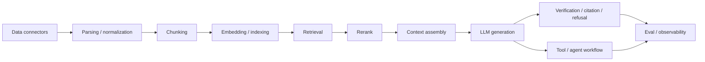
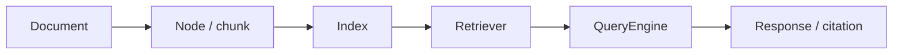
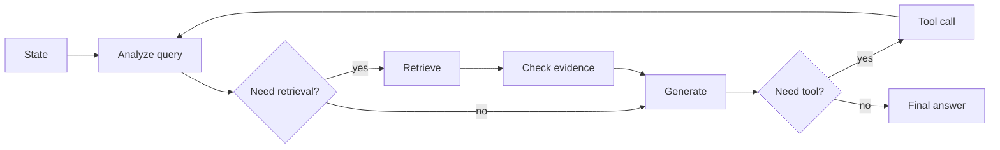
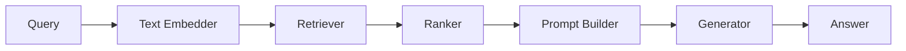
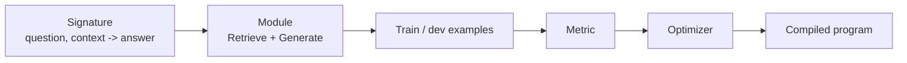
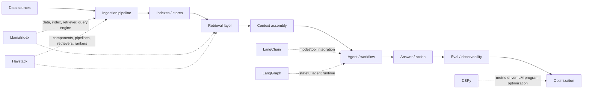

# RAG - 附录 A1：2026 主流框架对比：LlamaIndex、LangChain、Haystack 与 DSPy

## 学习目标（本节结束后你能做到什么）

1. 你能解释一个 RAG / LLM 应用框架到底在管哪几层：数据接入、索引、检索、编排、Agent、评测、观测、部署和优化。
2. 你能讲清 LlamaIndex、LangChain / LangGraph、Haystack、DSPy 的核心定位，而不是停留在“都能做 RAG”。
3. 你能基于团队场景做选型：什么时候选 LlamaIndex，什么时候选 LangGraph，什么时候选 Haystack，什么时候把 DSPy 作为优化层叠上去。
4. 你能识别框架的隐藏成本：抽象泄漏、版本迁移、调试难度、可观测性、数据管线成熟度、供应商绑定和团队学习成本。
5. 面试里如果被问“你们 RAG 系统为什么不用 LangChain / 为什么不用 LlamaIndex”，你能给出工程化回答，而不是框架偏好争论。

---

## 1. 先把问题摆正：框架不是架构，框架只是帮你管理某些复杂度

很多人选 RAG 框架时会这样问：

```text
哪个框架最好？
```

这个问题本身就有点危险。  
更好的问法是：

```text
我现在最需要框架帮我管理哪一类复杂度？
```

RAG 系统有很多层：



不同框架擅长的层不同：

- 有的更像 `data framework`
- 有的更像 `agent runtime`
- 有的更像 `pipeline orchestration`
- 有的更像 `prompt / LM program optimizer`
- 有的更像 `managed RAG platform`

所以框架选型不是宗教问题，而是工程边界问题：

`你要先知道你缺的是数据层、检索层、编排层、评测层，还是优化层。`

---

## 2. 2023 → 2024 → 2025 → 2026：RAG 框架为什么分化

### 2.1 2023：Chain 思维占主流

早期 LLM 应用框架的核心是：

```text
prompt -> model -> parser -> next step
```

这就是 chain 思维。

它解决了最早期的问题：

- 怎么接模型 API
- 怎么管理 prompt template
- 怎么串多个调用
- 怎么接工具
- 怎么做一个简单 RAG

这个阶段 LangChain 很有代表性。  
它把 LLM 应用里大量碎片能力打包成统一接口，让开发者快速搭 demo。

但 chain 思维也有问题：

- 复杂流程里状态越来越难管
- agent loop 不可控
- 错误恢复很弱
- 可观测性不足
- RAG 数据层经常被简化成 vector store wrapper

### 2.2 2024：RAG 数据层、Agent 运行时、评测优化开始分家

2024 之后，大家发现：

`RAG 不是 prompt chain，它是一套数据系统 + 检索系统 + 生成系统。`

于是框架开始分化：

- LlamaIndex 更强调 data / index / retriever / query engine。
- LangChain 继续保留集成生态，但复杂 agent 编排逐渐交给 LangGraph。
- Haystack 继续强调显式 pipeline、components、DocumentStore、retriever、reader / generator。
- DSPy 从另一个方向切入：不是手写 prompt，而是用 metric 编译和优化 LM programs。

也就是说，框架不再都争着做“全能胶水”。  
它们开始承认：LLM 应用里有不同类型的复杂度。

### 2.3 2025：Production 诉求压过 Demo 诉求

2025 的关键词是：

- durable execution
- human-in-the-loop
- observability
- eval
- dataset
- prompt / workflow versioning
- multi-agent
- graph orchestration
- structured outputs
- RAG quality regression
- managed ingestion / parsing

LangGraph 变得重要，是因为 agent 不是一次函数调用，而是带状态、分支、重试和人工审批的 workflow。  
LlamaIndex 推 LlamaCloud / LlamaParse，是因为企业 RAG 的痛点常常不是“怎么调用模型”，而是“怎么把脏文档变成可靠索引”。  
Haystack 的 Pipeline / Component 模式变得稳定，是因为生产系统需要显式、可测试、可序列化的图。  
DSPy 的价值变大，是因为 prompt 越来越多，靠手工调 prompt 不可持续。

### 2.4 2026：最新选型思路是组合，而不是单框架通吃

截至 2026-04-23，我建议把主流框架看成四种角色：

| 框架 | 更像什么 | 核心问题 |
| --- | --- | --- |
| LlamaIndex | Data / RAG framework | 如何把私有数据接入、索引、检索并交给 agent 使用 |
| LangChain + LangGraph | Integration + agent runtime | 如何把模型、工具、状态、分支、人工审批串成可靠 workflow |
| Haystack | Explicit pipeline framework | 如何用可组合 components 构建可测试、可部署的 RAG / search pipeline |
| DSPy | LM program optimization framework | 如何用数据和指标自动优化 prompt / reasoning / retrieval 程序 |

所以成熟团队常常不是四选一，而是：

```text
数据层用 LlamaIndex 或 Haystack
复杂 agent workflow 用 LangGraph
可观测和评测接 LangSmith / Langfuse / Phoenix
某些关键 prompt / router / reranker / answerer 用 DSPy 优化
底层索引、ACL、缓存、pipeline 自己掌控
```

这比“我们全栈用某某框架”更接近生产现实。

---

## 3. 评价框架的 10 个维度

不要只问“是否支持 RAG”。  
应该按下面 10 个维度评价。

| 维度 | 关键问题 |
| --- | --- |
| 数据接入 | 是否有 loader / connector？能不能处理增量、删除、权限、metadata？ |
| 文档解析 | 是否支持 PDF、表格、图片、OCR、layout？还是只吃纯文本？ |
| 索引抽象 | 是否支持向量、BM25、hybrid、graph、summary、multi-vector？ |
| 检索编排 | 是否支持 router、multi-query、rerank、query engine、citation？ |
| Agent 编排 | 是否支持状态、循环、分支、人工审批、持久化、工具调用？ |
| 评测优化 | 是否支持 dataset、metric、experiment、自动 prompt 优化？ |
| 可观测性 | 是否能追踪每个 span、prompt、retrieval、tool call、cost？ |
| 生产部署 | 是否支持序列化、异步、并发、重试、版本、rollback？ |
| 可控性 | 能否下沉到底层 API？抽象会不会挡住调优？ |
| 团队成本 | 学习曲线、生态稳定性、迁移成本、debug 难度如何？ |

一个框架如果在某一列很强，往往会在另一列妥协。  
比如抽象越高，上手越快，但 debug 和深度调优可能更难。  
抽象越低，可控性越强，但样板代码和工程成本更高。

---

## 4. LlamaIndex：最像“RAG 数据层框架”

### 4.1 它的核心定位

LlamaIndex 官方首页的定位是：

```text
Build agents over your data.
```

这句话很准确。  
LlamaIndex 的核心不是“又一个 agent 框架”，而是围绕私有数据做：

- data connectors
- document / node abstraction
- ingestion pipeline
- index abstraction
- retrievers
- query engines
- chat engines
- tools
- agents
- workflows
- LlamaParse / LlamaCloud

如果你要做的是：

```text
企业知识库 / 文档问答 / 私有数据 agent / 多数据源检索
```

LlamaIndex 往往是最自然的起点。

### 4.2 核心抽象：Document、Node、Index、Retriever、QueryEngine

可以把 LlamaIndex 的经典链路理解成：



其中：

- `Document`：原始文档或加载后的文档对象。
- `Node`：更细粒度的可检索单元，通常对应 chunk。
- `Index`：把 nodes 组织成可检索结构。
- `Retriever`：从 index 里取候选。
- `QueryEngine`：把 retrieval、synthesis、citation 等封装成问答接口。

这个抽象对 RAG 很友好，因为它把“数据变成检索对象”作为一等公民。

### 4.3 Ingestion pipeline 和 document management

LlamaIndex 官方文档里 ingestion pipeline 支持 transformations、vector store 写入、cache、document management。  
它也提供基于 `doc_id -> document_hash` 的文档管理示例，用来判断文档是否变化，从而 skip / upsert。

这和第 15 节讲的增量索引思想一致：

`RAG pipeline 不能每次全量重建，要记录文档 identity 和 hash。`

不过生产系统里你仍然要补：

- ACL
- delete propagation
- manifest
- source freshness
- retry / dead letter queue
- parser version
- embedding model version
- index alias / rollback

LlamaIndex 给你提供 RAG 数据层的好抽象，但不自动替你完成企业级 DataOps。

### 4.4 Workflows：从 RAG API 走向事件驱动编排

LlamaIndex Workflows 是 event-driven、step-based 的编排机制。  
它适合表达：

- query rewrite
- retrieval
- rerank
- synthesis
- verifier
- fallback
- agent step

它比简单 query engine 更灵活。  
但如果你要做跨小时 / 跨天持久化 workflow、复杂人工审批、状态恢复和长期 agent，LangGraph 或外部 workflow 系统可能更合适。

### 4.5 LlamaCloud / LlamaParse：托管化方向

LlamaIndex 的一个明显方向是：

`把难做的文档解析、索引、检索做成托管服务。`

LlamaParse 解决 PDF / 表格 / layout 等解析痛点。  
LlamaCloud 则围绕 enterprise data pipeline、managed ingestion、managed index、retrieval 等提供更完整平台能力。

这说明 LlamaIndex 的路线越来越清晰：

```text
开源库负责开发者抽象
托管服务负责企业 RAG 数据基础设施
```

### 4.6 适合场景

适合：

- 企业文档问答
- 私有知识库
- 多数据源 RAG
- 需要快速构建 retriever / query engine
- 需要文档解析和 ingestion 抽象
- 需要从 RAG 发展到 data agent

不太适合单独承担：

- 超复杂长生命周期 agent workflow
- 严格企业任务编排 / 审批流
- 完全自定义搜索引擎调优
- 底层索引和 ACL 需要极强控制的系统

### 4.7 面试表达

可以这样说：

```text
LlamaIndex 更像 RAG 数据层框架。
如果系统核心瓶颈是把企业私有数据接进来、切分、索引、检索、合成回答，我会优先考虑 LlamaIndex。
但我不会把权限、缓存、增量索引、上线评测完全交给框架。
生产里仍然要把 source identity、ACL、manifest、index version、observability 放在自己的架构边界里。
```

---

## 5. LangChain / LangGraph：从“LLM 集成胶水”走向“Agent Runtime”

### 5.1 LangChain 和 LangGraph 要分开看

2026 看 LangChain 生态，必须分层：

| 层 | 作用 |
| --- | --- |
| LangChain | 模型、工具、retriever、prompt、middleware、structured output 等集成与高级 API |
| LangGraph | 低层 agent orchestration runtime，提供状态、图、持久化、人类介入、durable execution |
| LangSmith | 观测、trace、dataset、eval、prompt / experiment 管理 |

LangChain v1 官方文档已经明确：LangChain agents 建在 LangGraph 之上，以获得 durable execution、human-in-the-loop、persistence 等能力。

所以不要再用 2023 的眼光看 LangChain：

```text
LangChain = 一堆 chain + memory + tools
```

更准确是：

```text
LangChain 是应用开发层，LangGraph 是复杂 agent 的运行时，LangSmith 是观测评测层。
```

### 5.2 LangChain 的优势：集成生态和开发速度

LangChain 的强项：

- 模型 provider 集成多
- tool / retriever / vector store 集成多
- structured output、middleware、tool calling 封装成熟
- 快速搭 agent / RAG demo
- 与 LangSmith 观测评测闭环紧
- 社区生态大

如果团队要快速试很多模型、工具、向量库、API，LangChain 很方便。

但这个优势也有反面：

- 抽象层多，debug 需要理解内部调用链
- 生态更新快，版本迁移需要管理
- 生产系统如果全靠高层 API，可能难以精细控制 RAG 细节
- RAG 数据层能力不是它最核心的长板

### 5.3 LangGraph 的核心：显式状态图

LangGraph 的核心思想是：

```text
把 agent / workflow 表达成带状态的 graph。
```

一个简化图：



比传统 chain 更适合：

- 多步推理
- 循环
- 分支
- 状态保存
- interrupt / resume
- human approval
- 长任务
- 可恢复执行

这对第 10 节讲的 Agentic RAG、第 16 节讲的 tool safety 很重要。

### 5.4 适合场景

LangChain / LangGraph 适合：

- 多工具 agent
- 有人类审批的 workflow
- 需要状态持久化和恢复
- 多模型 / 多 provider 快速集成
- 复杂业务流程编排
- 需要 LangSmith 观测评测闭环

不适合单独承担：

- 企业级文档解析 pipeline
- 深度索引调优
- 严格 search pipeline 的每个 component 测试
- RAG 数据治理和 ACL lifecycle

### 5.5 面试表达

可以这样说：

```text
如果系统主要是复杂 agent workflow，我会优先考虑 LangGraph，而不是只用 LangChain 的高层 agent API。
LangChain 负责模型、工具、retriever 等集成；LangGraph 负责状态图、持久化、人类介入和可恢复执行；LangSmith 负责 trace 和 eval。
但 RAG 的 ingestion、ACL、增量索引和索引版本，我仍然会独立设计，不会隐藏在 chain 里。
```

---

## 6. Haystack：最像“显式搜索 / RAG Pipeline 框架”

### 6.1 它的核心定位

Haystack 的官方文档围绕：

- Components
- Pipelines
- DocumentStores
- Retrievers
- Generators
- Rankers
- Evaluators
- Agents

它的气质和 LangChain / LlamaIndex 不太一样。  
Haystack 更强调：

```text
用显式 component graph 组合 NLP / LLM / search pipeline。
```

如果你是后端 / 搜索工程背景，会觉得 Haystack 的心智模型更像：

```text
typed components + DAG + document store + retriever + ranker + generator
```

而不是“魔法 agent”。

### 6.2 Pipeline / Component 是核心

Haystack pipeline 可以把组件显式串起来：



这有几个生产优势：

- 每个 component 可以单独测试
- pipeline graph 可视化和可序列化
- 输入输出边界清楚
- 更容易做替换和 A/B
- 更容易做异步 pipeline
- 更接近传统后端 pipeline 思维

Haystack 也支持 `AsyncPipeline`、SuperComponents、Agents、MCP 相关组件等能力，说明它也在吸收 agent 时代需求。  
但它的底色仍然是显式 pipeline。

### 6.3 DocumentStore 和 Retriever

Haystack 对 DocumentStore 和 Retriever 的抽象一直比较核心。  
它支持 Elasticsearch / OpenSearch / pgvector / Qdrant / Weaviate 等后端生态。

这很适合第 06、07、15 节里的生产检索思维：

- 文档存储和索引后端要可替换
- retriever 是 component
- ranker 是 component
- generator 是 component
- evaluation 是 component

### 6.4 适合场景

适合：

- 搜索 / RAG pipeline 可测试化
- 企业搜索问答
- 需要显式组件边界
- 后端团队维护 RAG 服务
- 需要 pipeline serialization / deployment
- 需要 retriever / ranker / generator 清晰分层

不太适合：

- 最快速度做 demo
- 非常动态、长生命周期、多分支 agent workflow
- 用自然语言快速拼很多工具的探索型开发
- 自动 prompt optimization

### 6.5 面试表达

可以这样说：

```text
Haystack 更像搜索工程师会喜欢的 RAG pipeline 框架。
它的优势是显式 component graph、DocumentStore、Retriever、Ranker、Generator 分层清楚，适合可测试、可部署的生产 pipeline。
如果业务更偏企业搜索和问答服务，而不是复杂 agent，我会认真考虑 Haystack。
```

---

## 7. DSPy：不是 RAG 框架，而是 LM 程序优化框架

### 7.1 它解决的问题完全不同

DSPy 经常被拿来和 LangChain / LlamaIndex 比，但它其实不是同一类东西。

LangChain / LlamaIndex / Haystack 主要帮你：

```text
搭 pipeline / 接工具 / 查数据 / 调模型
```

DSPy 主要帮你：

```text
把 prompt / reasoning / retrieval / generation 写成可优化的 LM program，并用 metric 自动改进。
```

DSPy 的核心口号可以理解成：

`Programming, not prompting.`

也就是不要手写一堆 prompt 字符串，而是定义：

- Signature：输入输出契约
- Module：可组合的 LM 调用模块
- Metric：什么叫好
- Optimizer：如何搜索 / 编译 prompt、few-shot examples、reasoning strategy

### 7.2 Signature、Module、Optimizer

一个 DSPy 心智模型：



这和传统 prompt engineering 的差异很大。

传统方式：

```text
我手写 prompt -> 试几个例子 -> 手工改 prompt
```

DSPy 方式：

```text
我写程序结构 + metric + examples -> optimizer 自动找更好的 instructions / demos / reasoning
```

### 7.3 DSPy 对 RAG 的价值

在 RAG 里，DSPy 可以优化：

- query rewrite
- query routing
- HyDE generator
- answer synthesizer
- citation-aware generator
- rerank judge
- refusal classifier
- multi-hop retrieval controller
- SQL generation
- evidence verifier

比如你可以定义 metric：

```text
答案必须：
1. 包含正确结论
2. 引用正确 source
3. 不包含 unsupported claim
4. token 成本低于阈值
```

然后让 DSPy optimizer 去找更好的 prompt / few-shot examples / module 参数。

这对生产很重要，因为复杂 RAG 系统里 prompt 很多：

- router prompt
- rewrite prompt
- decomposition prompt
- answer prompt
- verifier prompt
- refusal prompt
- citation prompt
- tool selection prompt

靠人工维护会越来越痛。

### 7.4 DSPy 的前提和风险

DSPy 不是魔法。  
它需要：

- 有代表性的训练 / dev examples
- 清晰 metric
- 可运行的 pipeline
- 足够预算做优化
- 防止过拟合
- offline / online 验证

如果你没有可靠评测集，DSPy 很难发挥。  
如果 metric 写错，它会把系统优化到错误目标上。

所以 DSPy 更适合已经有一定 RAG 评测基础的团队，而不是第一天做 demo 的团队。

### 7.5 面试表达

可以这样说：

```text
DSPy 不替代 LlamaIndex、LangChain 或 Haystack。
它更像一个优化层。
当 RAG pipeline 已经明确，并且有 evaluation dataset 和 metric 后，我可以用 DSPy 优化 query rewrite、answer synthesis、router 或 verifier。
它的优势是从手工 prompt tuning 转向 metric-driven optimization。
但它不负责数据接入、权限、索引、缓存、部署和安全治理。
```

---

## 8. 四个框架放在同一张系统图里

一个成熟系统可能这样组合：



这张图的意思是：

- LlamaIndex 和 Haystack 更靠近 data / retrieval pipeline。
- LangChain / LangGraph 更靠近 application / agent workflow。
- DSPy 更靠近 eval-driven optimization。
- 它们可以组合，但组合越多，系统复杂度越高。

工程上不要为了“先进”而堆框架。  
每引入一个框架都要回答：

```text
它替我管理了什么复杂度？
它带来了什么抽象泄漏？
出了问题我能不能绕过它？
```

---

## 9. 选型速查表

| 场景 | 首选倾向 | 原因 |
| --- | --- | --- |
| 快速做企业文档问答 Demo | LlamaIndex / LangChain | 上手快，资料多 |
| 私有数据 RAG 是核心 | LlamaIndex | data / index / query engine 抽象强 |
| 生产搜索问答 pipeline | Haystack / LlamaIndex | pipeline / retriever / ranker 分层清晰 |
| 复杂 agent workflow | LangGraph | 状态图、durable execution、HITL |
| 多模型多工具集成 | LangChain | 集成生态强 |
| Prompt / router / verifier 优化 | DSPy | metric-driven optimizer |
| 企业级可观测与评测 | LangSmith / Langfuse / Phoenix | 不要只靠框架默认 log |
| 文档解析难度高 | LlamaParse / 专门解析栈 | PDF / 表格 / OCR 是数据层问题 |
| 强安全 / 强权限系统 | 自建安全边界 + 框架局部使用 | ACL、cache、audit 不应完全交给框架 |
| 团队偏搜索工程 | Haystack | 组件化 pipeline 心智模型清楚 |
| 团队偏 agent 产品 | LangGraph | agent runtime 更自然 |

---

## 10. 常见误区

### 10.1 误区一：框架支持 RAG，所以它解决了 RAG

框架能帮你写更少代码。  
但它不自动解决：

- 文档解析质量
- chunking 策略
- embedding 选型
- hybrid retrieval
- rerank
- ACL
- metadata filtering
- semantic cache
- freshness
- citation verification
- prompt injection
- eval
- cost governance

这些仍然是系统设计问题。

### 10.2 误区二：用 LangChain 就不用懂底层

恰好相反。  
框架越强大，越需要你懂底层。  
否则出了问题你不知道是：

- retriever 配置问题
- prompt 问题
- memory 问题
- agent loop 问题
- tool schema 问题
- model provider 问题
- callback / trace 问题

面试里说“我们用 LangChain 所以不用管这些”是减分项。

### 10.3 误区三：LlamaIndex 等于向量库 wrapper

LlamaIndex 早就不只是 vector store wrapper。  
它围绕 documents、nodes、indices、retrievers、query engines、agents、workflows、LlamaCloud 形成了一套数据到 agent 的体系。

但也不要反过来神化它。  
生产里的增量索引、权限、删除、观测和回滚仍然要自己设计。

### 10.4 误区四：Haystack 老派，所以不适合 LLM

Haystack 的 pipeline / component 模式看起来没有 agent 框架酷，但它很适合生产系统。

很多企业 RAG 更需要：

- 可测试
- 可追踪
- 可替换
- 可部署
- 可灰度

而不是“自动 agent”。

### 10.5 误区五：DSPy 会自动让系统变好

DSPy 优化的是你定义的目标。  
如果 metric 错，它会把系统优化错。

所以 DSPy 的前提是：

- 有数据
- 有 metric
- 有 baseline
- 有 holdout set
- 有人工抽检

没有这些，DSPy 可能只是更高级的过拟合工具。

---

## 11. 一个工程化选型流程

可以按 6 步选型。

### 11.1 第一步：先定系统类型

你做的是哪类？

- 文档问答
- 企业搜索
- 数据分析 agent
- 代码库问答
- 客服知识库
- workflow automation
- 多工具 agent
- 结构化 + 非结构化混合问答

不同类型需要不同框架重心。

### 11.2 第二步：列出必须自己掌控的边界

通常这些不要完全交给框架：

- 用户认证
- ACL
- tenant isolation
- source identity
- incremental indexing
- deletion
- cache key
- audit log
- cost budget
- eval gate
- incident response

框架可以参与，但安全边界和数据生命周期要在你自己的架构里清楚可见。

### 11.3 第三步：做薄封装，不要让业务代码直接到处依赖框架

建议定义自己的 ports：

```python
from __future__ import annotations

from dataclasses import dataclass
from typing import Protocol


@dataclass(frozen=True)
class Evidence:
    chunk_id: str
    text: str
    source_uri: str
    score: float
    metadata: dict[str, str]


class RetrieverPort(Protocol):
    def retrieve(self, query: str, *, tenant_id: str, top_k: int) -> list[Evidence]:
        ...


class AnswererPort(Protocol):
    def answer(self, query: str, evidence: list[Evidence]) -> str:
        ...


class EvaluatorPort(Protocol):
    def score(self, query: str, answer: str, evidence: list[Evidence]) -> dict[str, float]:
        ...
```

业务层依赖自己的接口：

```python
def answer_question(
    query: str,
    *,
    tenant_id: str,
    retriever: RetrieverPort,
    answerer: AnswererPort,
    evaluator: EvaluatorPort,
) -> str:
    evidence = retriever.retrieve(query, tenant_id=tenant_id, top_k=20)
    answer = answerer.answer(query, evidence)
    scores = evaluator.score(query, answer, evidence)

    if scores.get("citation_support", 0.0) < 0.8:
        return "当前证据不足，无法给出可靠回答。"

    return answer
```

然后你可以把 LlamaIndex、Haystack、LangChain 或自研检索器挂在 `RetrieverPort` 后面。

这样做的好处：

- 后续换框架容易
- 单元测试容易
- 安全边界清楚
- 业务代码不被框架污染
- 可以 A/B 对比多个 pipeline

### 11.4 第四步：用真实 eval set 比较，而不是凭感觉

比较框架至少看：

- Recall@K
- nDCG
- answer correctness
- faithfulness
- citation support
- refusal accuracy
- p95 latency
- cost per supported answer
- developer velocity
- debug time
- production incident rate

框架选型不能只看“demo 写了多少行”。

### 11.5 第五步：做 POC 时故意测坏情况

POC 不要只测 happy path。  
要测：

- 大 PDF
- 表格
- 图片
- 多语言
- 权限过滤
- 删除传播
- 旧版本文档
- 冲突证据
- prompt injection
- cache invalidation
- provider timeout
- reranker failure

哪个框架在坏情况下更容易 debug，往往比 happy path 更重要。

### 11.6 第六步：决定组合方式

最后得到的可能不是“选一个”，而是：

```text
LlamaIndex 做 ingestion / retriever prototype
LangGraph 做 agent workflow
DSPy 优化 answerer / router
Langfuse 或 LangSmith 做 tracing / eval
自研服务掌控 ACL / cache / version / cost
```

这种组合很正常。  
关键是边界要清楚。

---

## 12. 面试高频问法与回答框架

### 12.1 “你会选 LangChain 还是 LlamaIndex？”

回答：

```text
我会先看系统核心复杂度在哪里。
如果核心是企业私有数据的接入、索引、检索、query engine，我更偏 LlamaIndex。
如果核心是多工具、多步骤、带状态和人工审批的 agent workflow，我更偏 LangGraph / LangChain。
它们不是绝对替代关系。生产里可以 LlamaIndex 管 RAG 数据层，LangGraph 管 agent workflow。
```

### 12.2 “Haystack 和 LangChain 有什么区别？”

回答：

```text
Haystack 更像显式搜索 / RAG pipeline 框架，用 components、pipelines、DocumentStores、Retrievers、Rankers、Generators 组合系统。
LangChain 更像模型和工具集成层，复杂 agent runtime 交给 LangGraph。
如果我要做可测试、可部署、组件边界清楚的企业搜索 pipeline，我会认真考虑 Haystack。
如果我要快速接很多工具和模型，或做复杂 agent workflow，我会考虑 LangChain / LangGraph。
```

### 12.3 “DSPy 能不能替代 LangChain？”

回答：

```text
不能直接替代，因为它解决的问题不同。
DSPy 是 LM program optimization framework，重点是用 signature、module、metric、optimizer 自动优化 prompt / few-shot / reasoning。
LangChain / LangGraph 解决集成和运行时编排。
我可以在 LangGraph 或 LlamaIndex 的某个节点里用 DSPy 优化 router、answerer、verifier，但 DSPy 不负责 ingestion、ACL、vector index、cache、observability 和部署。
```

### 12.4 “为什么不直接用框架的内置 RAG？”

回答：

```text
内置 RAG 很适合原型，但生产要补很多边界：
source identity、增量索引、删除、ACL pre-filter、metadata filter、rerank、citation verification、semantic cache、observability、eval gate、cost budget。
所以我会把框架当作某些层的加速器，而不是把架构责任全部交给框架。
```

### 12.5 “怎么避免框架锁定？”

回答：

```text
我会在业务层定义自己的 RetrieverPort、AnswererPort、EvaluatorPort、ToolPort。
框架适配器只放在基础设施层。
所有 trace、eval、cache key、ACL、index version 用自己的数据模型。
这样可以 A/B 对比 LlamaIndex、Haystack、自研 retriever，也可以在框架版本变化时降低迁移成本。
```

### 12.6 “如果团队没有 RAG 经验，怎么起步？”

回答：

```text
我会先用 LlamaIndex 或 LangChain 快速做端到端原型，验证数据源、问题类型和答案体验。
第二阶段补 eval set、observability、hybrid retrieval、rerank、citation 和 refusal。
第三阶段把 ingestion、ACL、cache、index version、cost governance 从 demo 代码里拆出来。
如果要做复杂 agent，就逐步引入 LangGraph。
如果 prompt 数量变多且有评测集，再引入 DSPy 优化关键模块。
```

---

## 13. 小结：A1 的 7 个关键 takeaway

1. 框架不是架构，框架只是帮你管理某些复杂度。
2. LlamaIndex 的长板是 RAG 数据层：documents、nodes、indices、retrievers、query engines、workflows 和 LlamaCloud。
3. LangChain / LangGraph 的长板是集成生态与 agent runtime：工具、模型、状态图、持久化、人类介入和可恢复执行。
4. Haystack 的长板是显式 pipeline：components、DocumentStores、retrievers、rankers、generators 和可测试的搜索问答流程。
5. DSPy 的长板是 metric-driven optimization：用数据和指标优化 LM programs，而不是替代 RAG 基础设施。
6. 生产系统最重要的是边界：ACL、增量索引、缓存、版本、观测、评测和安全不能被框架抽象掉。
7. 最成熟的选型往往不是四选一，而是按层组合，并用自己的 ports 降低框架锁定。

---

## 14. 检查站

你可以用下面 5 个问题自测：

1. LlamaIndex 和 Haystack 都能做 RAG，它们的心智模型有什么不同？
2. 为什么 2026 年讨论 LangChain 时必须同时讨论 LangGraph？
3. DSPy 为什么不是 LangChain / LlamaIndex 的替代品？它应该放在哪一层？
4. 如果你要做一个带审批和工具调用的企业 RAG agent，会怎么组合框架？
5. 如何设计自己的 `RetrieverPort` / `AnswererPort` 来避免框架锁定？

---

## 参考资料

- LlamaIndex 官方文档：Agents, workflows, RAG, retrieval, ingestion pipeline。https://docs.llamaindex.ai/
- LlamaIndex Ingestion Pipeline：transformations、vector store、cache、document management。https://docs.llamaindex.ai/en/stable/module_guides/loading/ingestion_pipeline/
- LlamaIndex Workflows：event-driven workflow、steps、events、agents。https://docs.llamaindex.ai/en/stable/module_guides/workflow/
- LlamaIndex Agents：AgentWorkflow、tools、multi-agent patterns。https://docs.llamaindex.ai/en/stable/module_guides/deploying/agents/
- LlamaParse Platform / LlamaCloud 文档：Parse、Extract、Classify、Split、Sheets、Index。https://docs.cloud.llamaindex.ai/
- LangChain v1 官方文档：agents 建在 LangGraph 之上，并支持 durable execution、human-in-the-loop、persistence。https://docs.langchain.com/oss/python/langchain/overview
- LangChain Retrieval 官方文档：document loaders、text splitters、embedding models、vector stores、retrievers。https://docs.langchain.com/oss/python/langchain/retrieval
- LangGraph 官方文档：agent orchestration framework，支持 durable execution、interrupts、persistence、human-in-the-loop。https://docs.langchain.com/oss/python/langgraph/overview
- LangSmith 官方文档：observability、evaluation、datasets、traces、prompt engineering。https://docs.smith.langchain.com/
- Haystack 官方文档：Components、Pipelines、DocumentStores、Retrievers、Rankers、Generators、Agents。https://docs.haystack.deepset.ai/
- Haystack Pipelines：component graph、连接、serialization、AsyncPipeline。https://docs.haystack.deepset.ai/docs/pipelines
- Haystack Document Stores：DocumentStore 抽象和后端集成。https://docs.haystack.deepset.ai/docs/document-store
- Haystack Agents：tools、agent loop、pipeline tools。https://docs.haystack.deepset.ai/docs/agents
- DSPy 官方文档：Signatures、Modules、Optimizers、evaluation-driven LM programming。https://dspy.ai/
- DSPy GitHub：StanfordNLP/dspy 项目与发布。https://github.com/stanfordnlp/dspy
- DSPy 论文：DSPy: Compiling Declarative Language Model Calls into Self-Improving Pipelines。https://arxiv.org/abs/2310.03714
