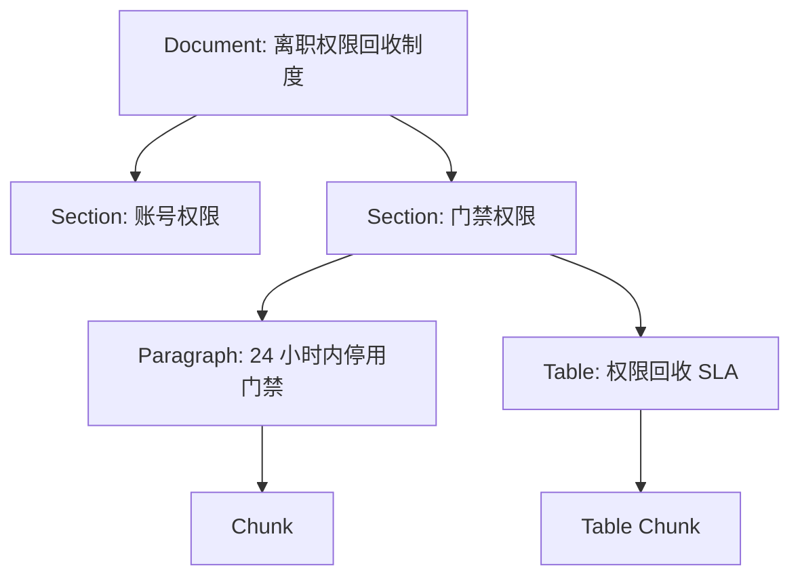
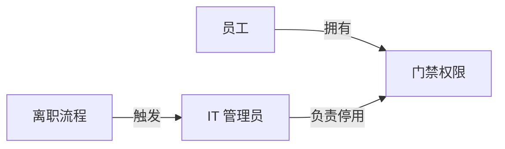
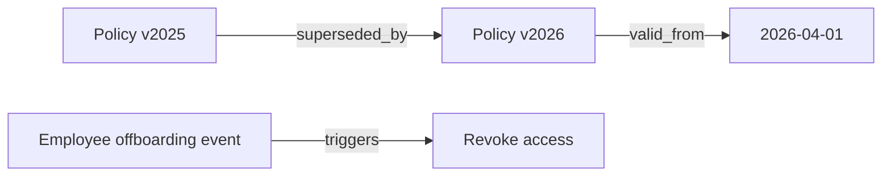
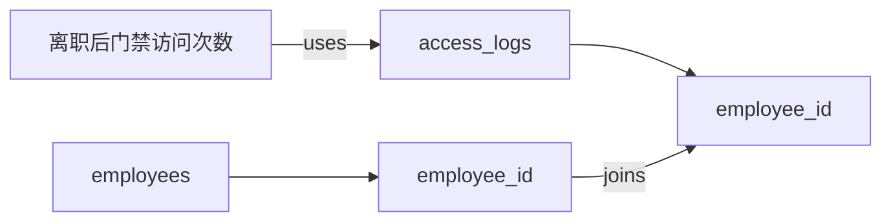
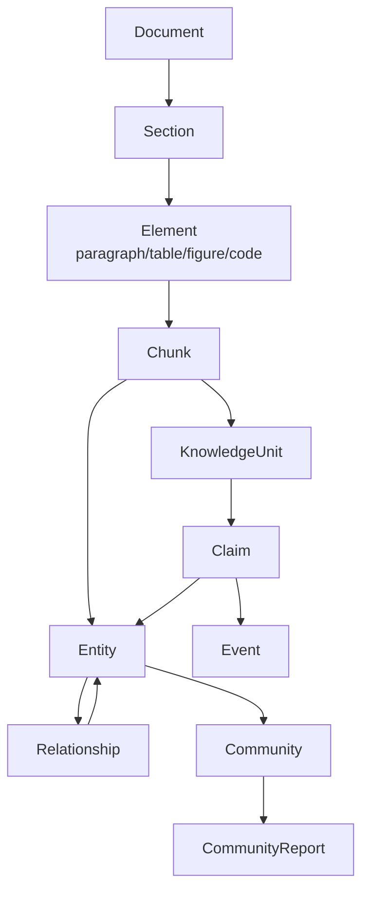
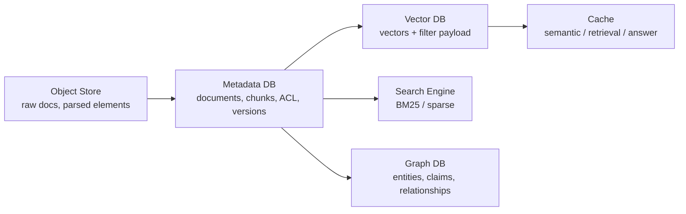

# RAG - 专题 S1：Metadata 设计与知识结构建模

## 学习目标（本节结束后你能做到什么）

1. 你能把 metadata 从“附加字段”提升为 RAG 的系统契约：它决定过滤、权限、版本、引用、审计、缓存、评测和成本。
2. 你能设计一套生产级 metadata schema，覆盖 identity、provenance、time、ACL、source、structure、quality、index、lifecycle 和 query routing。
3. 你能解释 metadata 设计为什么会影响 ANN 检索性能：字段类型、基数、选择性、payload index、namespace、partition、pre-filter 都不是小细节。
4. 你能把知识结构从 chunk list 升级成多层模型：Document / Section / Chunk / Entity / Relation / Claim / Event / Table / Community / Summary。
5. 你能在系统设计面试里回答：如何从一堆文档建模成可检索、可审计、可演进的知识系统。

---

## 1. 先把问题摆正：metadata 不是“方便筛选”，而是 RAG 的控制平面

很多人第一次做 RAG 时，chunk 长这样：

```json
{
  "id": "chunk_123",
  "text": "员工离职后，门禁权限应在 24 小时内停用。",
  "embedding": [0.12, -0.03, 0.91]
}
```

最多再加几个字段：

```json
{
  "source": "hr_policy.pdf",
  "page": 12
}
```

这在 demo 里能跑。  
但生产里很快会撞墙：

- 这个 chunk 属于哪个租户？
- 当前用户能不能看？
- 它来自哪个源系统的哪个版本？
- 它是不是过期政策？
- 它对应原 PDF 的哪一页、哪个段落、哪个表格？
- 它是正文、标题、脚注、表格、代码还是图片说明？
- 它用哪个 parser、chunker、embedding 模型生成？
- 它是否被人工审核过？
- 它的置信度和来源可信度是多少？
- 它是否已删除、归档、撤回？
- 它能否被语义缓存复用？
- 它在 GraphRAG 里对应哪些实体、关系和 claim？

所以 metadata 的本质不是“额外信息”，而是：

`RAG 系统对知识对象的控制平面。`

它决定：

- 检索边界：tenant、ACL、time window、source allowlist
- 排序策略：source trust、recency、document type、quality score
- 上下文组装：section hierarchy、page number、parent chunk、table id
- 引用审计：source_uri、source_offset、parser_version、index_version
- 增量索引：content_hash、metadata_hash、acl_hash、deleted_at
- 安全可靠：PII flag、classification、review_status、trust_score
- 成本治理：cold / hot data、embedding_model_version、cache_policy

如果 metadata 设计薄，后面所有高级 RAG 都会变脆。  
这也是为什么我更愿意说：

`先设计知识对象，再设计向量检索。`

---

## 2. 2024 → 2025 → 2026：metadata 设计为什么越来越重要

### 2.1 2024：metadata filtering 从“可选过滤”变成“检索边界”

2024 之前很多 RAG 系统把 metadata 当 UI 筛选条件：

```text
source = handbook
date > 2024-01-01
```

但企业 RAG 上线后发现，metadata filtering 首先是安全问题：

- 用户只能看自己部门文档
- 租户之间必须隔离
- 删除文档不能继续被召回
- 过期政策不能覆盖新政策
- 高敏文档不能进普通模型上下文

所以第 07b 节强调：

`ACL、tenant、有效版本通常是 hard constraints，不是 rerank feature。`

这让 metadata 从“结果筛选”变成“受约束检索”。

### 2.2 2025：向量库开始把 metadata 当性能问题处理

metadata filter 不是数据库 where 条件那么简单。  
向量检索里，如果先全库 ANN 再 post-filter，会有两个问题：

- 过滤后可能没有足够结果
- 未授权候选可能进入中间链路

所以主流向量库都在强化 filter-aware retrieval。

几个官方文档里的信号很清楚：

- Qdrant 把附加信息称为 `payload`，支持 JSON 表示的信息，并支持按类型过滤；payload index 还支持 keyword、integer、float、bool、datetime、uuid、geo 等类型。
- Pinecone metadata filtering 支持 `$eq`、`$ne`、`$gt`、`$gte`、`$lt`、`$lte`、`$in`、`$nin`、`$exists`、`$and`、`$or` 等操作符。
- Weaviate 明确强调 pre-filtering，并说明从 v1.34 起默认使用 ACORN filter strategy 来改善 restrictive filter 下的 HNSW 搜索性能。
- Milvus 支持 filtered search、scalar filtering、partition key 等能力，用来把向量搜索和结构化条件结合起来。

这说明 2025 之后 metadata schema 已经影响底层索引布局和查询性能。

### 2.3 2026：metadata 和 knowledge structure 开始融合

截至 2026-05-07，我对趋势的判断是：

`metadata 不再只是 chunk 的字段，metadata 正在变成知识结构的边。`

比如：

- `source_doc_id` 把 chunk 连回原文
- `section_path` 把 chunk 放回文档树
- `entity_ids` 把 chunk 连到实体图
- `claim_ids` 把 chunk 连到事实声明
- `valid_from / valid_to` 把知识放到时间轴
- `table_id / row_id / column_id` 把文本连到结构化表格
- `community_id` 把实体放到 GraphRAG 社区
- `parent_chunk_id / child_chunk_ids` 支持 parent-child retrieval
- `provenance` 支持引用、审计和信任判断

GraphRAG 官方知识模型很有代表性：它不只保留 Document 和 TextUnit，还抽取 Entity、Relationship、Covariate / claim、Community、Community Report。  
这其实就是把“metadata + structure + graph”合成一个知识模型。

---

## 3. Metadata 的三层：检索字段、审计字段、结构字段

不要把所有 metadata 都塞进向量库 payload。  
生产里最好分三层。

### 3.1 Retrieval metadata：在线检索必须用

这些字段会参与线上过滤、路由、排序：

| 字段 | 用途 |
| --- | --- |
| `tenant_id` | 多租户隔离 |
| `access_scope_ids` | ACL / group pre-filter |
| `source_type` | handbook、ticket、wiki、table、code |
| `doc_type` | policy、faq、contract、runbook、spec |
| `language` | 中英文、多语言路由 |
| `created_at` / `updated_at` | 新鲜度 |
| `valid_from` / `valid_to` | 制度有效期 |
| `status` | active、archived、deleted、draft |
| `classification` | public、internal、confidential、restricted |
| `embedding_model_version` | 避免新旧向量混用 |
| `index_version` | blue-green / rollback |
| `quality_score` | 解析质量、审核质量 |
| `trust_score` | 来源可信度 |

这些字段应该尽量：

- 类型稳定
- 枚举可控
- 基数可预期
- 可索引
- 可用于 pre-filter

### 3.2 Audit metadata：不一定参与检索，但必须能追溯

这些字段用于解释“答案为什么这么来”：

| 字段 | 用途 |
| --- | --- |
| `source_system` | Confluence、S3、Git、Jira、DB |
| `source_doc_id` | 源系统稳定 ID |
| `source_uri` | 可打开 / 可审计路径 |
| `source_version` | 源文档版本 |
| `source_updated_at` | 源更新时间 |
| `ingestion_run_id` | 哪次 pipeline 生成 |
| `parser_version` | 哪个解析器版本 |
| `chunker_version` | 哪个切分策略 |
| `content_hash` | 内容变化检测 |
| `metadata_hash` | 元数据变化检测 |
| `acl_hash` | 权限变化检测 |
| `created_by` / `reviewed_by` | 责任人 |
| `deleted_at` | 删除 / tombstone |

这些字段通常放在 metadata store 更合适。  
向量库只保留线上过滤必要的子集。

### 3.3 Structural metadata：把 chunk 放回知识结构

这些字段让系统理解 chunk 在知识里的位置：

| 字段 | 用途 |
| --- | --- |
| `document_id` | 所属文档 |
| `parent_id` | 父节点 |
| `section_id` | 所属章节 |
| `section_path` | 例如 `["入职", "权限", "门禁"]` |
| `page_number` | PDF 页码 |
| `bbox` | 页面坐标 |
| `element_type` | title、paragraph、table、figure、code |
| `table_id` / `row_id` / `column_id` | 表格定位 |
| `prev_chunk_id` / `next_chunk_id` | 顺序关系 |
| `entity_ids` | 涉及实体 |
| `claim_ids` | 支持的事实声明 |
| `summary_node_id` | 所属摘要节点 |
| `community_id` | 所属图社区 |

这类 metadata 的价值非常大：

- parent-child retrieval
- section window expansion
- citation 定位
- 表格问答
- GraphRAG
- 时间线问答
- 冲突证据检测
- 层次化摘要

---

## 4. 一个生产级 Chunk Metadata Schema

下面是一套可落地的 schema 起点。  
不要机械复制，但可以拿它作为系统设计面试的模板。

```json
{
  "chunk_id": "ck_01H...",
  "tenant_id": "tenant_acme",
  "source": {
    "system": "confluence",
    "doc_id": "conf_98341",
    "uri": "https://wiki.example.com/pages/98341",
    "title": "员工离职权限回收制度",
    "doc_type": "policy",
    "owner_team": "hr_ops",
    "created_at": "2026-01-02T08:00:00Z",
    "updated_at": "2026-04-20T10:12:00Z",
    "version": "v18"
  },
  "access": {
    "classification": "internal",
    "allowed_group_ids": ["hr", "it_admin"],
    "denied_user_ids": [],
    "acl_snapshot_id": "acl_20260507_1000",
    "acl_hash": "sha256:..."
  },
  "time": {
    "valid_from": "2026-04-01T00:00:00Z",
    "valid_to": null,
    "effective_status": "active"
  },
  "structure": {
    "element_type": "paragraph",
    "document_id": "doc_01H...",
    "section_id": "sec_01H...",
    "section_path": ["离职", "权限回收", "门禁"],
    "page_number": 12,
    "bbox": [72.0, 144.2, 510.4, 190.8],
    "prev_chunk_id": "ck_prev",
    "next_chunk_id": "ck_next"
  },
  "modeling": {
    "entity_ids": ["ent_employee", "ent_access_card"],
    "claim_ids": ["claim_24h_disable_badge"],
    "community_ids": ["comm_access_management"]
  },
  "pipeline": {
    "ingestion_run_id": "ing_20260507_001",
    "parser_version": "doc_parser_v4",
    "chunker_version": "semantic_section_v3",
    "embedding_model": "bge-m3",
    "embedding_model_version": "2026-02-01",
    "index_version": "kb_dense_v22",
    "content_hash": "sha256:...",
    "metadata_hash": "sha256:..."
  },
  "quality": {
    "parse_confidence": 0.94,
    "ocr_required": false,
    "review_status": "approved",
    "trust_score": 0.92,
    "pii_detected": false
  },
  "lifecycle": {
    "status": "active",
    "deleted_at": null,
    "archived_at": null
  }
}
```

这里有个关键点：

`schema 要分组思考，但落到向量库 payload 时要扁平化和可索引。`

例如线上过滤字段可能变成：

```json
{
  "tenant_id": "tenant_acme",
  "classification": "internal",
  "allowed_group_ids": ["hr", "it_admin"],
  "doc_type": "policy",
  "source_system": "confluence",
  "language": "zh",
  "valid_from": "2026-04-01T00:00:00Z",
  "valid_to": null,
  "status": "active",
  "index_version": "kb_dense_v22",
  "entity_ids": ["ent_employee", "ent_access_card"]
}
```

完整 audit metadata 放 metadata DB。  
高频 filter 字段放向量库 payload。  
复杂 ACL 放权限服务或倒排 ACL 表。

---

## 5. Metadata 字段设计的 12 条原则

### 5.1 字段必须有明确用途

每个字段都要回答：

- 是否参与过滤？
- 是否参与排序？
- 是否参与路由？
- 是否参与引用？
- 是否参与审计？
- 是否参与增量更新？
- 是否参与缓存 key？
- 是否参与评测切片？

如果都不参与，它可能只是噪声。

### 5.2 区分 hard constraint 和 soft feature

Hard constraint：

- tenant
- ACL
- deleted
- valid time
- classification
- source allowlist

Soft feature：

- recency score
- source trust
- parse confidence
- popularity
- manual rating

不要把 hard constraint 交给 reranker。  
reranker 可以提升相关性，但不能负责授权。

### 5.3 字段类型要和过滤语义一致

常见错误：

```json
{
  "created_at": "昨天",
  "page": "12",
  "tags": "hr,it,policy",
  "is_deleted": "false"
}
```

更好的方式：

```json
{
  "created_at": "2026-05-07T10:00:00Z",
  "page": 12,
  "tags": ["hr", "it", "policy"],
  "is_deleted": false
}
```

Qdrant、Weaviate、Pinecone、Milvus 这类系统都支持不同程度的 scalar / payload / metadata filtering。  
字段类型设计错了，后面要么 filter 错，要么性能差，要么无法迁移。

### 5.4 控制高基数字段

高基数字段包括：

- `user_id`
- `source_uri`
- `chunk_id`
- `trace_id`
- `request_id`

它们不适合作为普通过滤主轴。  
尤其不要在向量检索请求里塞几万个 `allowed_user_ids`。

更好的做法：

- 用户权限映射到 access group
- 高敏数据按 namespace / collection 隔离
- 复杂授权先查 ACL service 得到 allowed doc set
- 常见过滤字段建索引
- 超高基数字段留给 metadata DB

### 5.5 设计字段的选择性

字段选择性会影响 filtered ANN。

例如：

- `language = zh` 可能匹配 60% 数据
- `tenant_id = acme` 可能匹配 3% 数据
- `source_doc_id = doc_123` 可能匹配 0.001% 数据

过滤太宽，没什么裁剪效果。  
过滤太窄，ANN 可能退化或需要 flat search。  
Weaviate 的 filtering 文档就明确讨论了 restrictive filter、pre-filter、ACORN 和 flat-search cutoff。

所以 metadata schema 不是只看业务语义，也要看数据分布。

### 5.6 保留原始值和规范化值

例如来源里可能有：

```text
HR
Human Resources
人力资源部
hr-team
```

不要直接拿它们当 filter 枚举。  
建议：

```json
{
  "owner_team_raw": "Human Resources",
  "owner_team_id": "team_hr",
  "owner_team_name": "人力资源部"
}
```

原始值用于审计。  
规范化值用于过滤和聚合。

### 5.7 时间字段要拆成多个语义

时间不是一个 `created_at` 就够。

至少区分：

| 字段 | 含义 |
| --- | --- |
| `source_created_at` | 源文档创建时间 |
| `source_updated_at` | 源文档更新时间 |
| `ingested_at` | 入库时间 |
| `indexed_at` | 索引写入时间 |
| `valid_from` | 知识开始生效 |
| `valid_to` | 知识失效时间 |
| `deleted_at` | 删除时间 |

政策问答里尤其要区分：

`文档更新时间` 不等于 `政策生效时间`。

### 5.8 Metadata 也要版本化

内容没变，metadata 也可能变：

- 标题改了
- 来源变了
- owner 变了
- ACL 变了
- 分类变了
- 有效期变了

第 15 节提到过：

```text
content_hash
metadata_hash
acl_hash
```

三者应该分开。  
否则你会把“权限变化”误当成“内容没变”，最后越权。

### 5.9 Metadata schema 要有迁移策略

生产系统一定会改 schema。

建议：

- `schema_version`
- backward-compatible parser
- dual-write 新旧字段
- backfill job
- read path fallback
- deprecation window
- migration manifest

不要在向量库 payload 里无计划地新增字段。  
字段一旦被 query、cache、eval、dashboard 用上，就变成了公共契约。

### 5.10 Metadata 要能进入 eval slicing

评测不应该只有总分。  
要按 metadata 切片：

- by tenant
- by source type
- by doc type
- by language
- by parser version
- by chunker version
- by classification
- by freshness bucket
- by table / paragraph / image
- by high trust / low trust

这会让你发现：

```text
总体 recall 没变，但 PDF 表格类文档下降了 20%。
```

没有 metadata，就没有可解释评测。

### 5.11 Metadata 要进入 cache key

语义缓存不能只按 query 相似度命中。

至少要考虑：

- tenant
- access scope
- ACL snapshot
- index version
- model version
- prompt version
- query constraints
- source freshness
- answer language

否则 cache 会成为越权和陈旧答案的来源。

### 5.12 Metadata 不等于权限系统

metadata 可以表达权限快照，但真正授权通常在 IAM / ACL service。

正确理解：

```text
IAM / ACL service = 权限事实来源
metadata / payload = 检索时可用的权限投影
```

权限事实来源变了，metadata 投影必须同步。  
同步失败时，系统要 fail closed。

---

## 6. Knowledge Structure：从 chunk list 到知识模型

很多 RAG 系统的内部结构其实只有一张表：

```text
chunks(id, text, embedding, metadata)
```

这叫 chunk list。  
它能回答局部事实，但很难回答：

- 这个政策和哪个旧政策冲突？
- 某个实体在哪些文档里被提到？
- 这个表格行对应哪条制度？
- 某个 claim 的来源和有效期是什么？
- 两个项目之间有什么依赖关系？
- 整个知识库的主题结构是什么？
- 为什么这个答案引用了这三个 chunk？

所以生产 RAG 往往要建知识结构。

### 6.1 知识结构不是只有知识图谱

常见知识结构有 8 类：

| 结构 | 解决什么 |
| --- | --- |
| 文档树 | 原文层级、章节、页码、引用定位 |
| Chunk 顺序图 | 上下文扩展、上一段 / 下一段 |
| Parent-child 层级 | 小块召回，大块生成 |
| 摘要树 | 多尺度检索、全局概览 |
| 实体关系图 | 跨文档关联、GraphRAG |
| Claim 图 | 事实声明、冲突检测、引用支持 |
| 事件时间线 | 时间推理、政策演化、事故复盘 |
| 表格 / Schema 图 | Text-to-SQL、TableQA、结构化问答 |

知识建模不是为了“看起来高级”，而是为了匹配问题类型。

---

## 7. 第一层：Document Tree

Document Tree 解决的是：

`chunk 从哪里来，它在原文里处于什么位置。`

结构示例：



对应字段：

```json
{
  "document_id": "doc_hr_offboarding",
  "section_path": ["离职", "门禁权限"],
  "element_type": "paragraph",
  "page_number": 12,
  "bbox": [72, 144, 510, 190],
  "parent_id": "sec_access_badge",
  "prev_chunk_id": "ck_10",
  "next_chunk_id": "ck_12"
}
```

它支撑：

- citation 到页码 / 段落
- section window expansion
- parent-child retrieval
- table-aware context
- page screenshot / PDF 高亮
- 人工审计

没有 Document Tree，citation 很容易退化成：

```text
来源：hr_policy.pdf
```

这对审计不够。

---

## 8. 第二层：Semantic Unit / Knowledge Unit

Chunk 是技术切分单元，不一定是知识单元。

一个好的 knowledge unit 应该尽量表达一个完整事实或规则：

```json
{
  "unit_id": "ku_badge_disable_24h",
  "type": "policy_rule",
  "subject": "离职员工门禁权限",
  "predicate": "应在",
  "object": "24 小时内停用",
  "conditions": ["员工状态 = 离职"],
  "source_chunk_ids": ["ck_123", "ck_124"],
  "valid_from": "2026-04-01",
  "confidence": 0.93
}
```

Knowledge Unit 适合：

- FAQ / policy rule extraction
- claim-level citation
- conflict detection
- retrieval compression
- structured answer generation

但它也有成本：

- 抽取需要 LLM 或规则
- schema 设计要业务参与
- 错误抽取会污染系统
- 更新和回滚更复杂

所以建议：

`不要一开始全量抽 Knowledge Unit，先对高价值领域做。`

例如 HR 制度、合规条款、产品限制、SOP、故障处理手册。

---

## 9. 第三层：Entity / Relationship Graph

实体图解决的是：

`跨文档对象和对象之间的关系。`

一个基本 schema：

```text
Entity(id, name, type, aliases, description, source_refs)
Relationship(id, source_entity_id, target_entity_id, type, description, source_refs, confidence)
```

例子：



实体图适合：

- “A 和 B 有什么关系？”
- “哪些系统依赖这个服务？”
- “某政策影响哪些部门？”
- “某客户涉及哪些合同和工单？”
- “整个语料有哪些主题社区？”

Microsoft GraphRAG 的默认知识模型就是这条线：Document、TextUnit、Entity、Relationship、Covariate、Community、Community Report。  
它还把 TextUnit 作为 source reference，让图上的知识能回到原始文本。

这是非常关键的工程原则：

`图上的每个实体、关系、claim 都必须能回到 source text。`

否则图会变成“看起来结构化，但不可审计”的二手知识。

---

## 10. 第四层：Claim Graph

实体图表达对象关系。  
Claim Graph 表达事实声明。

Claim 的粒度通常是：

```text
某个主体在某个条件和时间下有某个事实。
```

例子：

```json
{
  "claim_id": "claim_badge_disable_24h",
  "subject_entity_id": "ent_badge_access",
  "claim_type": "policy_sla",
  "statement": "离职员工门禁权限应在 24 小时内停用。",
  "status": "supported",
  "valid_from": "2026-04-01",
  "valid_to": null,
  "source_chunk_ids": ["ck_123"],
  "confidence": 0.91
}
```

Claim Graph 适合做：

- citation support
- contradiction detection
- temporal reasoning
- compliance QA
- fact verification
- answer grounding

GraphRAG 官方文档里 `Covariate` 就很接近这一类：它表示 extracted claim information，包含关于实体的陈述，并且可能有时间边界。

### 10.1 为什么 Claim 比 Entity 更适合回答事实问题

实体图可以告诉你：

```text
离职流程 -> 门禁权限
```

但用户问的是：

```text
门禁权限多久停用？
```

这个答案在 claim 里：

```text
门禁权限应在 24 小时内停用。
```

所以一个成熟系统可能同时有：

- entity graph：找相关对象
- claim graph：找可回答事实
- text chunks：保留原始证据

---

## 11. 第五层：Event / Temporal Graph

很多企业问题有时间性：

- “当前有效政策是什么？”
- “2025 版和 2026 版有什么变化？”
- “这个事故发生前后哪些配置变了？”
- “某客户过去三个月的风险演化是什么？”

这需要事件和时间建模。

基本 schema：

```text
Event(id, type, happened_at, actor, object, source_refs)
PolicyVersion(id, valid_from, valid_to, supersedes, source_refs)
Claim(valid_from, valid_to)
```

例子：



时间建模的核心原则：

`不要用文档更新时间替代业务有效时间。`

制度文档可能 5 月更新，但规定 4 月 1 日生效。  
如果只看 `updated_at`，答案会错。

---

## 12. 第六层：Table / Schema Graph

结构化数据上的 RAG 需要另一套知识结构：

- database schema
- table / column descriptions
- foreign keys
- metric definitions
- business glossary
- sample values
- dashboard lineage
- semantic model

例如：



对应 metadata：

```json
{
  "object_type": "column",
  "table_name": "access_logs",
  "column_name": "employee_id",
  "semantic_type": "employee_identifier",
  "pii": true,
  "join_targets": ["employees.employee_id"],
  "owner_team": "security_ops"
}
```

这对 Text-to-SQL 和 TableQA 很重要。  
第 12 节讲过，结构化 RAG 的检索对象不是普通 chunk，而是：

- schema
- docs
- examples
- values
- metrics
- lineage

---

## 13. 三种建模路线：轻、中、重

### 13.1 轻量路线：Metadata-rich Chunk

结构：

```text
Document -> Chunk + rich metadata
```

适合：

- 大多数企业知识库
- FAQ
- 制度问答
- 普通文档搜索
- 预算有限团队

优点：

- 成本低
- 维护简单
- 与向量库兼容
- 上线快

缺点：

- 跨文档关系弱
- 全局综述弱
- 冲突检测弱
- 时间推理弱

建议作为起点。

### 13.2 中量路线：Document Tree + Entity / Claim Index

结构：

```text
Document Tree
Chunk Index
Entity Index
Claim Index
```

适合：

- 合规 / 政策系统
- 产品知识库
- 客服知识库
- 运维 Runbook
- 需要引用和冲突检测的系统

优点：

- 可审计
- 可做 claim-level grounding
- 跨文档召回更好
- 成本可控

缺点：

- schema 设计需要业务参与
- 抽取质量要评测
- 增量更新更复杂

这是我最推荐的生产折中。

### 13.3 重量路线：GraphRAG / Knowledge Graph

结构：

```text
Documents
TextUnits
Entities
Relationships
Claims
Communities
Community Reports
Graph + Vector + Sparse indexes
```

适合：

- 语料级全局综述
- 跨文档主题发现
- 调研 / 情报分析
- 大型组织知识地图
- 需要 graph traversal 的复杂问答

优点：

- 全局结构强
- 关系发现强
- 支持 community-level summary
- 适合 global query

缺点：

- 索引成本高
- 实体对齐难
- 权限传播难
- 更新难
- 抽取错误会放大

不要因为名字高级就默认上。  
GraphRAG 是解决特定问题的结构，不是所有 RAG 的默认底座。

---

## 14. 知识结构建模的核心对象模型

一个比较稳的对象模型：



关键不是一次性实现所有节点，而是知道它们的职责：

| 对象 | 作用 |
| --- | --- |
| Document | 源文档 identity 与版本 |
| Section | 原文结构和导航 |
| Element | 页面 / 文档元素，支持表格、图、代码 |
| Chunk | 检索基本单元 |
| KnowledgeUnit | 更结构化的知识单元 |
| Entity | 对象、概念、人、系统、产品 |
| Relationship | 实体关系 |
| Claim | 可验证事实声明 |
| Event | 时间性变化和动作 |
| Community | 图上的主题簇 |
| CommunityReport | 簇摘要，用于全局问答 |

---

## 15. 一个 Python 数据模型示例

下面的代码不是完整系统，而是展示如何把 metadata 和知识结构分开建模。

```python
from __future__ import annotations

from dataclasses import dataclass, field
from datetime import datetime
from enum import Enum
from hashlib import sha256
from typing import Literal


def stable_id(*parts: object) -> str:
    raw = "\n".join(str(part) for part in parts)
    return sha256(raw.encode("utf-8")).hexdigest()[:24]


class LifecycleStatus(str, Enum):
    ACTIVE = "active"
    ARCHIVED = "archived"
    DELETED = "deleted"
    DRAFT = "draft"


class ElementType(str, Enum):
    TITLE = "title"
    PARAGRAPH = "paragraph"
    TABLE = "table"
    FIGURE = "figure"
    CODE = "code"
    FOOTNOTE = "footnote"


@dataclass(frozen=True)
class SourceRef:
    source_system: str
    source_doc_id: str
    source_uri: str
    source_version: str
    page_number: int | None = None
    bbox: tuple[float, float, float, float] | None = None


@dataclass(frozen=True)
class AccessMetadata:
    tenant_id: str
    classification: Literal["public", "internal", "confidential", "restricted"]
    allowed_group_ids: tuple[str, ...]
    acl_snapshot_id: str
    acl_hash: str


@dataclass(frozen=True)
class PipelineMetadata:
    ingestion_run_id: str
    parser_version: str
    chunker_version: str
    embedding_model_version: str
    index_version: str
    content_hash: str
    metadata_hash: str


@dataclass(frozen=True)
class StructureMetadata:
    document_id: str
    section_id: str | None
    section_path: tuple[str, ...]
    element_type: ElementType
    prev_chunk_id: str | None = None
    next_chunk_id: str | None = None


@dataclass(frozen=True)
class ChunkRecord:
    chunk_id: str
    text: str
    source: SourceRef
    access: AccessMetadata
    pipeline: PipelineMetadata
    structure: StructureMetadata
    status: LifecycleStatus
    valid_from: datetime | None = None
    valid_to: datetime | None = None
    entity_ids: tuple[str, ...] = ()
    claim_ids: tuple[str, ...] = ()
    trust_score: float = 1.0

    def vector_payload(self) -> dict[str, object]:
        return {
            "tenant_id": self.access.tenant_id,
            "classification": self.access.classification,
            "allowed_group_ids": list(self.access.allowed_group_ids),
            "acl_hash": self.access.acl_hash,
            "source_system": self.source.source_system,
            "source_doc_id": self.source.source_doc_id,
            "source_version": self.source.source_version,
            "element_type": self.structure.element_type.value,
            "section_path": list(self.structure.section_path),
            "status": self.status.value,
            "valid_from": self.valid_from.isoformat() if self.valid_from else None,
            "valid_to": self.valid_to.isoformat() if self.valid_to else None,
            "embedding_model_version": self.pipeline.embedding_model_version,
            "index_version": self.pipeline.index_version,
            "entity_ids": list(self.entity_ids),
            "claim_ids": list(self.claim_ids),
            "trust_score": self.trust_score,
        }


@dataclass(frozen=True)
class Entity:
    entity_id: str
    name: str
    entity_type: str
    aliases: tuple[str, ...] = ()
    source_refs: tuple[SourceRef, ...] = ()


@dataclass(frozen=True)
class Relationship:
    relationship_id: str
    source_entity_id: str
    target_entity_id: str
    relation_type: str
    description: str
    source_chunk_ids: tuple[str, ...]
    confidence: float


@dataclass(frozen=True)
class Claim:
    claim_id: str
    statement: str
    subject_entity_id: str
    claim_type: str
    source_chunk_ids: tuple[str, ...]
    valid_from: datetime | None = None
    valid_to: datetime | None = None
    confidence: float = 1.0


def make_chunk_id(
    tenant_id: str,
    source_doc_id: str,
    source_version: str,
    section_path: tuple[str, ...],
    local_text: str,
    chunker_version: str,
) -> str:
    return "ck_" + stable_id(
        tenant_id,
        source_doc_id,
        source_version,
        "/".join(section_path),
        sha256(local_text.encode("utf-8")).hexdigest(),
        chunker_version,
    )
```

这个例子体现几个原则：

- 完整 metadata 对象留在应用层。
- `vector_payload()` 只输出在线检索需要的字段。
- `SourceRef` 支持 citation 和 provenance。
- `AccessMetadata` 与 `PipelineMetadata` 分开，方便权限变更和内容变更独立处理。
- `Entity`、`Relationship`、`Claim` 不直接替代 chunk，而是连接回 source chunks。

---

## 16. Query 如何使用 metadata 和知识结构

不同 query 应该走不同结构。

### 16.1 局部事实问题

问题：

```text
离职后门禁多久停用？
```

优先：

- metadata filter：tenant、ACL、doc_type=policy、valid time
- hybrid retrieval
- rerank
- chunk / claim evidence

不需要 full GraphRAG。

### 16.2 全局综述问题

问题：

```text
我们公司权限治理制度主要覆盖哪些方面？
```

优先：

- section summaries
- community reports
- GraphRAG global search
- topic clusters

只查 topK chunks 容易漏全局结构。

### 16.3 冲突检测问题

问题：

```text
离职权限回收有无互相矛盾的规定？
```

优先：

- claim index
- valid_from / valid_to
- source trust
- same subject claim comparison
- human review if high risk

### 16.4 时间演化问题

问题：

```text
2025 版和 2026 版权限回收制度有什么变化？
```

优先：

- policy version graph
- valid time
- document diff
- claim diff
- source version

### 16.5 表格 / 指标问题

问题：

```text
过去 30 天离职员工仍有门禁访问记录的人数是多少？
```

优先：

- structured data schema graph
- metric definition
- Text-to-SQL
- value retrieval
- runtime database query

不要只靠文档 chunk。

---

## 17. Metadata 与知识结构的存储布局

一个常见布局：



### 17.1 什么放向量库 payload

放：

- 高频过滤字段
- tenant / access scope
- status
- valid time
- doc type
- language
- source type
- entity ids if needed
- index version

不建议放：

- 完整 ACL 明细
- 大段 JSON
- 所有 provenance 细节
- 全量 section tree
- 几千个 tags
- 高频变化但不用过滤的字段

### 17.2 什么放 metadata DB

放：

- document record
- chunk record
- source version
- content hash
- parser / chunker / embedding version
- full provenance
- lifecycle
- ACL snapshot
- deletion tombstone
- eval slice labels

### 17.3 什么放 graph DB

放：

- entities
- relationships
- claims
- events
- communities
- source references
- aliases
- ontology / taxonomy

但 graph DB 不一定一开始就上。  
中小系统可以先用 relational tables 表达 entity / claim / relationship。

---

## 18. 面试高频问法与回答框架

### 18.1 “你会给 chunk 设计哪些 metadata？”

回答框架：

```text
我会分三类。
第一类是检索字段，比如 tenant、ACL scope、doc_type、source_type、language、valid_from、valid_to、status、classification、index_version。
第二类是审计字段，比如 source_system、source_doc_id、source_uri、source_version、ingestion_run_id、parser_version、chunker_version、content_hash、metadata_hash、acl_hash。
第三类是结构字段，比如 section_path、page_number、bbox、element_type、parent_id、prev/next chunk、entity_ids、claim_ids。
向量库 payload 只放高频过滤字段，完整审计信息放 metadata DB。
```

### 18.2 “metadata filter 为什么会影响向量检索效果？”

回答框架：

```text
因为 ANN 搜索不是普通 SQL。
如果先全库 ANN 再 post-filter，过滤后可能没有足够候选，而且未授权候选会进入中间链路。
所以更好的方式是 pre-filter 或 filter-aware ANN。
字段的类型、基数、选择性、是否建索引，会影响过滤性能和 recall。
比如 Weaviate 用 inverted index + HNSW 做 pre-filter，并从 v1.34 默认使用 ACORN 策略改善 restrictive filter；Qdrant 也有 payload index 和 tenant index。
```

### 18.3 “知识结构建模和 GraphRAG 是一回事吗？”

回答框架：

```text
不是。
知识结构建模包括文档树、chunk 顺序图、parent-child、摘要树、实体图、claim 图、事件图、表格 schema 图。
GraphRAG 是其中较重的一类，主要建实体关系、社区和社区报告，适合全局综述和跨文档关系问题。
很多生产系统不需要一开始上 full GraphRAG，可以先做 metadata-rich chunks，再加 document tree 和 claim/entity index。
```

### 18.4 “为什么要建 Claim？”

回答框架：

```text
chunk 是文本片段，不一定对应一个可验证事实。
Claim 是更接近问答的事实单元，包含 statement、subject、valid time、source chunks、confidence。
它能支持 citation support、冲突检测、时间有效性和合规问答。
但 claim 抽取有成本和错误风险，所以适合高价值领域，不建议全库无脑抽。
```

### 18.5 “metadata schema 怎么演进？”

回答框架：

```text
metadata schema 要版本化。
我会加 schema_version，新增字段先 dual-write，read path 支持 fallback，再跑 backfill，最后下线旧字段。
同时让 eval、cache key、dashboard、retriever config 显式依赖字段版本。
字段一旦进入 filter、ACL、cache 或评测，就不是随便能改的内部实现。
```

---

## 19. 小结：S1 的 8 个关键 takeaway

1. Metadata 是 RAG 的控制平面，不是附属字段。
2. Metadata 至少分成 retrieval、audit、structural 三层；不要把所有东西都塞进向量库 payload。
3. ACL、tenant、status、valid time 是 hard constraints，不能交给 reranker 或 LLM。
4. 字段类型、基数、选择性和索引方式会直接影响 filtered ANN 的性能和召回。
5. 知识结构不等于知识图谱；文档树、claim 图、事件图、表格 schema 图都属于知识结构。
6. Claim 是连接自然语言证据和可验证事实的关键对象，特别适合合规、政策和高风险问答。
7. GraphRAG 是重型知识结构，适合 global sensemaking，不是所有 RAG 的默认方案。
8. 生产系统最好从 metadata-rich chunk 起步，再按问题类型逐步引入 entity、claim、event、community。

---

## 20. 检查站

你可以用下面 5 个问题自测：

1. 一个 chunk 的 retrieval metadata、audit metadata、structural metadata 分别应该有哪些字段？
2. 为什么 `updated_at` 不能替代 `valid_from / valid_to`？
3. 为什么 high-cardinality ACL 字段不适合直接塞进向量库 filter？
4. Claim Graph 相比 Entity Graph 解决了什么问题？
5. 什么场景应该上 GraphRAG，什么场景只需要 metadata-rich chunk + claim index？

---

## 参考资料

- Qdrant Payload：payload 是和向量一起存储的 JSON 信息，并支持多种可过滤类型。https://qdrant.tech/documentation/concepts/payload/
- Qdrant Filtering：介绍 must / should / must_not、nested、range、geo、values count 等过滤条件。https://qdrant.tech/documentation/search/filtering/
- Qdrant Payload Indexing：介绍 keyword、integer、float、bool、datetime、uuid、tenant index 等索引。https://qdrant.tech/documentation/manage-data/indexing/
- Pinecone Filter by Metadata：介绍 metadata filter 操作符和 search 请求中的 filter 用法。https://docs.pinecone.io/guides/search/filter-by-metadata
- Weaviate Filtering：介绍 pre-filtering、ACORN filter strategy、indexFilterable、indexRangeFilters。https://docs.weaviate.io/weaviate/concepts/filtering
- Weaviate Multi-tenancy：说明 tenant shard、数据隔离和多租户操作。https://docs.weaviate.io/weaviate/manage-collections/multi-tenancy
- Milvus Filtered Search：介绍 scalar filtering 和 filtered vector search。https://milvus.io/docs/filtered-search.md
- Milvus Partition Key：介绍 partition key 对数据分区和检索的作用。https://milvus.io/docs/use-partition-key.md
- Microsoft GraphRAG Architecture：介绍 GraphRAG Knowledge Model、workflows、LLM caching 和 provider factory。https://microsoft.github.io/graphrag/index/architecture/
- Microsoft GraphRAG Dataflow：介绍 Document、TextUnit、Entity、Relationship、Covariate、Community、Community Report。https://microsoft.github.io/graphrag/index/default_dataflow/
- LlamaIndex Metadata Extraction：介绍 metadata extractor 在 ingestion 中的使用方式。https://developers.llamaindex.ai/python/framework/module_guides/loading/documents_and_nodes/usage_metadata_extractor/
- LlamaIndex VectorStoreIndex：介绍 VectorStoreIndex 和 metadata filtering。https://developers.llamaindex.ai/python/framework/module_guides/indexing/vector_store_index/
- LlamaIndex Property Graph Index：介绍 property graph index 的基础使用。https://developers.llamaindex.ai/python/examples/property_graph/property_graph_basic/
- W3C PROV-DM：通用 provenance data model，包含 entity、activity、agent、derivation 等概念。https://www.w3.org/TR/prov-dm/
- OpenLineage Dataset Facets：数据集元数据、schema、ownership、lifecycle、data source 等 facet 设计。https://openlineage.io/docs/spec/facets/dataset-facets/
- Schema.org Dataset：通用 Dataset metadata 词汇。https://schema.org/Dataset
- DCMI Metadata Terms：Dublin Core metadata terms。https://www.dublincore.org/specifications/dublin-core/dcmi-terms/
