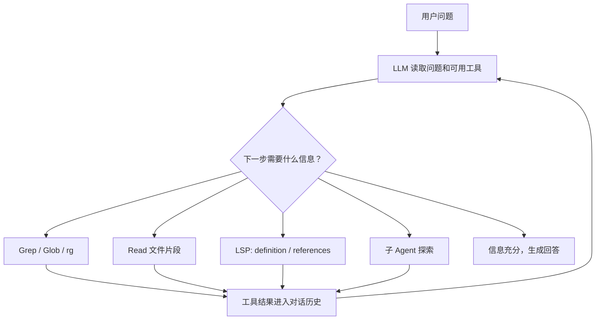
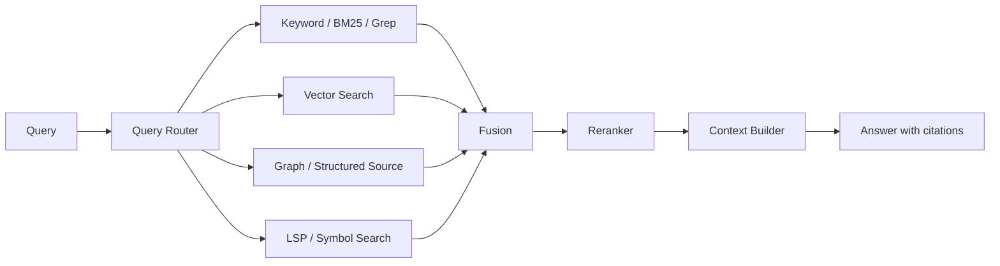

# S2 Agentic Search 与“RAG 已死”：Claude Code、Codex、Grep 和向量检索的边界

## 学习目标

读完这一篇，你应该能回答 5 个问题：

1. 为什么 2025-2026 年会出现“RAG 已死”的说法。
2. Claude Code / Codex 这类 Agent CLI 为什么敢在本地代码搜索里放弃 embedding 和向量库。
3. LLM 驱动 Grep 的搜索循环到底怎么工作，和传统一次性 top-K RAG 有什么本质差异。
4. ripgrep 为什么能让“暴力扫描”在本地代码库上足够快。
5. 什么时候应该用 Grep-only，什么时候应该用向量检索，什么时候必须做 hybrid retrieval。

> 可信度说明：本文把材料分成三类。第一类是官方资料，例如 Anthropic、OpenAI、Cursor、ripgrep、Turbopuffer 的公开文档或博客。第二类是论文、社区和厂商文章，例如 GrepRAG、Milvus、Zach Nussbaum、Beacon。第三类是泄露源码、泄露 system prompt、社交媒体转述。这类材料可以帮助理解实现思路，但不应该当作产品承诺或正式文档。

---

## 0. 先给结论：RAG 没死，死的是一种默认假设

“RAG 已死”这个标题很抓人，但如果认真拆开，它通常混淆了两件事：

- 广义 RAG：先检索外部信息，再把信息放进上下文，让模型基于上下文生成答案。
- 狭义 RAG：预先切 chunk、生成 embedding、写入向量库、用户提问时做一次 top-K 相似度检索。

Claude Code 和 Codex 放弃的主要是第二种，也就是“本地代码库必须先 embedding 建索引”的默认假设。它们并没有放弃检索增强生成。相反，它们更像把 RAG 的 retrieval 层从一个静态 pipeline，改造成一个由 LLM 在线决策的工具使用过程。

一句话概括：

> Agent 时代的变化不是“不要检索”，而是“检索从预先设计好的单次步骤，变成模型在运行时不断提出问题、调用工具、读结果、再改写问题的主动搜索过程”。

这也是为什么 Claude Code / Codex 的路线可以叫做 `agentic search`。它仍然是 retrieval-augmented generation，只是 retrieval 工具从 `embedding search` 换成了 `Grep / Glob / Read / LSP / shell`。

---

## 1. 从 Claude Code 的 Grep 说起

Claude Code 的一个反直觉选择是：它没有把“代码库理解”默认建立在本地向量数据库上。

Anthropic 官方的 [Effective Context Engineering for AI Agents](https://www.anthropic.com/engineering/effective-context-engineering-for-ai-agents) 把 Claude Code 的上下文管理分成多种策略，其中提到它会通过 `glob` 和 `grep` 这样的工具把信息 just-in-time 地加载进上下文。Claude Code 的安装文档也把 `ripgrep` 列为推荐依赖之一，用于更快的文件搜索。

公开访谈和评论里，Claude Code 创建者 Boris Cherny 反复强调过类似观点：

- 早期版本试过 RAG + local vector DB，但后来发现 agentic search 更适合 Claude Code 的使用场景。
- “Plain glob and grep, driven by the model, beat everything” 这句话经常被引用，核心意思是由模型驱动的 glob 和 grep 在他们测试中效果很好。
- Hacker News 上也有公开评论说，Claude Code 当前不使用 RAG，测试中 agentic search 对代码类任务更好。

这里要小心一个表达陷阱。Boris 说“不用 RAG”时，更像是在说“不用当时大家默认理解的 embedding + vector DB RAG”。如果按 RAG 的原始定义，也就是 retrieval augmented generation，Claude Code 仍然是在做检索增强生成。

### 1.1 为什么代码搜索天然适合 Grep

代码和普通自然语言文档最大的不同是：代码里到处都是程序员亲手埋下的精确锚点。

这些锚点包括：

- 函数名：`getUserById`、`createSession`、`parseActivityEvent`
- 类名：`SessionRunner`、`WebSocketTransport`
- 常量名：`TOOL_VERBS`、`DEFAULT_TIMEOUT`
- 文件路径：`bridge/sessionRunner.ts`
- 错误信息：`Permission denied`、`Invalid request payload`
- API route：`/api/v1/documents`

在自然语言里，一个概念可以有很多表达方式。例如“取消订阅”“停止自动续费”“关闭会员”可能指同一件事。但在代码里，`cancelSubscription` 通常就是 `cancelSubscription`。这让精确匹配的收益非常高。

这不是说代码不需要语义搜索，而是说代码搜索里的高频问题常常不是“帮我理解相似概念”，而是“帮我找到这个符号在哪里定义、在哪里被调用、哪条路径处理这个事件”。对这类问题，Grep 的确定性非常强。

---

## 2. 传统 RAG 和 Agentic Search 的控制流差异

传统向量 RAG 的典型控制流是：

```text
文档导入
  -> 文档解析
  -> chunk
  -> embedding
  -> 写入向量库

用户问题
  -> query embedding
  -> ANN top-K
  -> rerank
  -> 拼上下文
  -> LLM 生成答案
```

这个流程的问题不是“错”，而是它默认了一个很强的前提：系统在回答之前，必须一次性猜出哪些 chunk 有用。

Agentic Search 的控制流不一样：



关键差异在于：检索不再是一次性前置步骤，而是推理过程的一部分。模型可以先粗搜，再读文件，再根据中间发现换关键词，再继续搜索。

### 2.1 这不是 pipeline，而是反馈控制

传统 RAG 像一个 pipeline：

```text
query -> retrieve -> generate
```

Agentic Search 更像一个反馈控制系统：

```text
observe -> decide -> act -> observe -> decide -> act -> answer
```

这会带来两个结果：

- 好处：搜索路径可以根据中间结果动态调整，不必在一开始就猜对全部关键词。
- 代价：工具调用次数、token 消耗、延迟和失败面都会增加。

所以“Agentic Search 更好”不是无条件成立。它成立的前提是：搜索空间不太大、工具反馈足够快、中间结果能帮模型快速收敛。

---

## 3. Claude Code 式搜索循环：模型自己决定搜什么

Claude Code 的核心思想可以压成一句话：

> LLM 自己决定搜什么、用什么工具搜、搜到以后要不要继续搜，直到信息充分为止。

这和传统 RAG 很不一样。传统 RAG 里，retriever 通常是一个固定组件；在 Agentic Search 里，retriever 是一个工具集合，策略由 LLM 在运行时形成。

相关工具可以抽象成下面几类：

| 工具 | 底层能力 | 作用 |
| --- | --- | --- |
| GrepTool / `rg` | ripgrep 正则搜索 | 按内容找文件或匹配行 |
| GlobTool / `rg --files` / shell glob | 文件路径匹配 | 按文件名、目录、后缀缩小范围 |
| FileReadTool / `sed` / `fs` | 读取指定文件片段 | 看到真实代码上下文 |
| LSP 工具 | go to definition / find references | 找符号定义和引用 |
| AgentTool / sub-agent | 独立上下文搜索 | 把大范围探索隔离在子上下文里 |

一个典型循环长这样：

```text
1. 用户：bridge 是怎么追踪 GrepTool 调用的？
2. LLM：先搜索 GrepTool、tool activity、track 这类词。
3. 工具：返回若干文件路径。
4. LLM：bridge/sessionRunner.ts 看起来最相关，读取局部内容。
5. 工具：返回 TOOL_VERBS、activity parser 相关代码。
6. LLM：现在知道活动怎么生成，但还不知道谁消费，继续搜 SessionActivity。
7. 工具：返回 bridgeMain.ts、bridgeUI.ts、types.ts。
8. LLM：读关键片段，拼出完整链路。
9. LLM：回答。
```

注意这里没有硬编码“必须先 grep 再 read”。系统可以给模型建议，工具 schema 可以引导模型，但真正路径由模型根据中间结果决定。

### 3.1 子 Agent 的价值：不是更聪明，而是隔离上下文

子 Agent 很容易被误解成“再派一个更聪明的小模型”。它更重要的价值其实是 context isolation。

如果主对话直接做 10 轮 grep/read，大量中间结果会留在主上下文里。很多内容只是搜索过程中的噪声，不应该长期占据上下文预算。

子 Agent 的方式是：

```text
主 Agent
  -> 派发一个探索任务
  -> 子 Agent 在自己的上下文里 grep/read/总结
  -> 主 Agent 只拿到最终摘要
```

这等于把“搜索过程”和“主推理过程”分离。对于大范围代码探索，这比把所有 grep 输出塞进主 context 更稳定。

---

## 4. GrepTool 的关键设计：控制信息量，而不是只追求召回

Grep 的危险不在于找不到，而在于一次找太多。

如果每次 grep 都把所有匹配行、上下文、文件内容倒进 prompt，Agent 很快会被自己的检索结果淹没。所以一个生产级 Grep 工具最重要的设计之一是：控制返回信息的粒度。

可以把 Grep 的输出模式分成三种：

| 输出模式 | 返回什么 | 适合什么场景 | 风险 |
| --- | --- | --- | --- |
| `files_with_matches` | 只返回命中文件路径 | 先定位候选文件 | 需要后续 read |
| `content` | 返回匹配行和上下文 | 查常量、函数签名、局部逻辑 | 容易返回太多噪声 |
| `count` | 返回每个文件命中次数 | 判断关键词分布密度 | 不提供语义内容 |

默认返回文件路径通常是一个好设计。它让模型先知道“哪里可能相关”，再决定读哪几个文件，而不是一上来把所有内容都吞进上下文。

### 4.1 “先定位，再深入”是软约束

更合理的工具使用模式是：

```text
Glob / Grep(files)
  -> 找候选目录和文件
  -> Grep(content, 小上下文)
  -> Read(精确行范围)
  -> 必要时再 grep 新关键词
```

但这个顺序不能写死。因为有时模型已经知道文件路径，就应该直接 read；有时只需要确认一个常量值，`grep content -C 3` 就够了；有时需要评估词频分布，`count` 更合适。

好的 Agent 工具设计不是把模型绑死，而是让默认路径“自然地正确”。

---

## 5. 实战还原：追踪一次 GrepTool 调用怎么被 bridge 记录

这一节基于用户提供的 Claude Code 源码快照拆解材料。由于相关源码快照不是官方正式发布材料，下面更适合当作实现思想分析，不适合作为 Anthropic 产品承诺。

问题是：

> 当 LLM 调用 GrepTool 做搜索时，bridge 是怎么追踪和记录这次工具调用的？

如果用 Agentic Search 的思路，搜索过程大概会这样展开。

### 5.1 第一轮：宽关键词定位候选文件

模型先把问题中的概念翻译成若干关键词：

```text
GrepTool
tool.*track
tool.*activity
```

搜索请求类似：

```text
Grep(pattern="GrepTool|tool.*track|tool.*activity", glob="*.ts")
```

这一步最好只返回文件路径。假设结果里出现：

```text
structuredIO.ts
sessionRunner.ts
bridgeUI.ts
bridgeStatusUtil.ts
```

模型会根据文件名做第一轮判断。`sessionRunner.ts` 包含 `session` 和 `runner`，很可能和工具执行过程有关；`bridgeUI.ts` 可能是展示层；`bridgeStatusUtil.ts` 可能是状态摘要。

### 5.2 第二轮：小上下文看命中片段

接着模型会对最可疑文件做 content 模式 grep：

```text
Grep(
  pattern="GrepTool|tool.*activity",
  path="bridge/sessionRunner.ts",
  output_mode="content",
  -C=5
)
```

如果返回片段里出现：

```text
GrepTool -> Searching
BashTool -> Running
FileReadTool -> Reading
```

模型会意识到：这里可能有一个工具名到动词的映射表。但片段被截断了，所以需要 read 更完整的上下文。

### 5.3 第三轮：Read 关键文件，理解生成逻辑

读完整段后，可以得到三层结构：

第一层是工具名到动词的映射：

```text
Grep / GrepTool       -> Searching
Glob / GlobTool       -> Searching
Read / FileReadTool   -> Reading
Edit / FileEditTool   -> Editing
Bash / BashTool       -> Running
```

第二层是摘要生成函数：

```text
verb + target -> "Searching reconnect|backoff"
```

其中 `verb` 来自映射表，`target` 从工具输入里抽取，例如 `file_path`、`pattern`、`command`、`url`。

第三层是活动解析器：

```text
session stdout
  -> 逐行解析 JSON
  -> 发现工具调用事件
  -> 生成 activity summary
```

到这里已经知道了“活动怎么生成”，但还不知道“活动去了哪里”。

### 5.4 第四轮：追踪使用方

继续搜：

```text
Grep(
  pattern="SessionActivity|currentActivity",
  path="bridge/",
  output_mode="content",
  -C=2
)
```

可以拼出完整链路：

| 文件 | 角色 |
| --- | --- |
| `bridge/types.ts` | 定义 `SessionActivity` 类型、时间戳、summary 等字段 |
| `bridge/bridgeMain.ts` | 周期性轮询 session 当前活动，维护最近工具调用轨迹 |
| `bridge/bridgeUI.ts` | 缓存摘要并渲染到状态面板 |

最终答案是：

```text
session 进程输出工具调用 JSON
  -> activity parser 解析并生成摘要
  -> session 持有 currentActivity / activity buffer
  -> bridge main 周期性读取最新活动
  -> bridge UI 展示 "Searching xxx" 这类状态
```

这个例子的重点不是 Claude Code 的具体 bridge 实现，而是搜索路径本身：每一步要搜什么，都依赖上一步的结果。这是预先 top-K 很难模拟的。

---

## 6. 性能原理：为什么暴力搜索在本地代码库上够快

“每轮都 grep 一遍项目”听起来很粗暴，但这里的 grep 不是 1970 年代的 GNU grep 思路，而通常是 `ripgrep`。

[ripgrep](https://github.com/BurntSushi/ripgrep) 是用 Rust 写的现代搜索工具。它默认遵守 `.gitignore`，跳过隐藏文件和二进制文件，支持多线程搜索，底层依赖高性能正则实现。它不是“天真地逐字符扫所有文件”。

### 6.1 ripgrep 的五层过滤

真正进入内容匹配前，ripgrep 已经做了多层过滤：

| 层级 | 过滤方式 | 效果 |
| --- | --- | --- |
| 1 | `.gitignore` / ignore rules | 跳过 `node_modules`、`dist`、`target` 等整棵目录 |
| 2 | path 限制 | 只遍历指定目录，例如 `bridge/` |
| 3 | glob / file type | 只看 `*.ts`、`*.py`、`*.md` |
| 4 | binary detection | 跳过二进制文件 |
| 5 | regex match | 对剩下的文本文件做匹配 |

这些过滤是乘法叠加的。一个原始 5 万文件的项目，如果 `.gitignore` 去掉 4 万个依赖和产物，再用 path 限到某个 300 文件的目录，再用 glob 限到 80 个 TypeScript 文件，最后真正参与正则匹配的文件可能只有几十个。

所以“暴力扫描”的真实含义不是每次无差别扫完整磁盘，而是：

```text
先用路径、ignore、后缀、二进制检测把搜索空间砍掉
再对剩余文本做非常快的字节匹配
```

### 6.2 文件内匹配为什么快

内容匹配层面，ripgrep 的速度来自几类工程优化：

| 优化 | 原理 | 对代码搜索的影响 |
| --- | --- | --- |
| SIMD | 一条 CPU 指令比较多个字节 | 快速扫描候选字符或多模式 |
| literal extraction | 从正则中抽取固定子串先匹配 | 避免一开始就跑完整正则状态机 |
| 多线程 | 多个 worker 并行搜不同文件 | 大量小文件场景收益明显 |
| OS page cache | 热文件直接从内存读 | 开发者本地项目通常是热数据 |
| mmap / 高效 I/O | 减少额外复制和系统调用开销 | 大文件场景更明显 |

如果一个 250MB 的本地代码库已经在 page cache 里，瓶颈往往不是磁盘，而是内存带宽和 CPU 匹配。现代开发机扫一遍几百 MB 内存级数据，理论下界就是毫秒到十几毫秒级；加上正则匹配、路径遍历、进程启动等开销，实际常见是几十到一百多毫秒。

这解释了为什么 Claude Code / Codex 可以把 `rg` 放在交互式循环里：一次工具调用的主要耗时通常不是 `rg`，而是模型思考和 API 往返。

### 6.3 和向量检索的数据规模差异

向量检索面对的问题通常是：

```text
N 个向量，每个向量 d 维
query 向量和候选向量做近似最近邻
```

即使 ANN 能加速，它也需要：

- 建索引。
- 维护增量更新。
- 处理向量版本。
- 处理权限和过滤。
- 处理删除传播。
- 处理索引过期。

而本地代码搜索的常见规模是：

```text
几十 MB 到几百 MB
几千到几万文件
大量精确符号和路径锚点
```

在这个规模下，向量索引的固定成本可能高于它带来的收益。尤其是代码正在被用户不断编辑，索引新鲜度也会变成额外复杂度。

---

## 7. 行业路线对比：Claude Code、Codex、Cursor

这三类产品的路线可以放在一张表里看。

| 产品 | 默认代码搜索路线 | 是否预建向量索引 | 主要优势 | 主要代价 |
| --- | --- | --- | --- | --- |
| Claude Code | 专用 Grep / Glob / Read / LSP 工具，由模型驱动 | 公开材料显示不以向量索引为默认 | 零启动、工具结构化、信息量可控 | 语义召回依赖模型改写关键词 |
| Codex CLI | shell 工具执行 `rg`、`find`、`sed`、`git` 等 | 公开文档不把向量索引作为默认链路 | 灵活、贴近 Unix 工作流、可组合 | 模型要处理非结构化 shell 输出 |
| Cursor | 语义索引 + grep / trigram / rerank 等混合能力 | 是 | 大规模、多仓库、语义搜索能力强 | 有索引成本、同步成本、隐私和新鲜度问题 |

### 7.1 Claude Code：结构化工具封装

Claude Code 的路线偏“专用工具”：

```text
GrepTool(pattern, path, glob, output_mode, head_limit)
GlobTool(pattern)
FileReadTool(file_path, offset, limit)
```

优势是：

- 参数 schema 清楚。
- 输出可控。
- 比裸 shell 更容易限制权限和 token。
- 模型不需要解析复杂 shell 命令组合。

代价是：

- 灵活性不如 shell。
- 每个工具都需要产品侧维护。
- 高级命令组合能力取决于工具设计。

### 7.2 Codex：shell-first 的 Agent 工具哲学

OpenAI 的 [Unrolling the Codex Agent Loop](https://openai.com/index/unrolling-the-codex-agent-loop/) 把 Codex 的工作方式解释成一个 observe / decide / act 的循环，并明确提到 Codex 会通过工具读取文件、执行命令、修改代码、运行测试。Codex 的公开 prompting guide 也强调代码搜索时优先使用 `rg` 和 `rg --files`。

Codex 的路线更接近“把 Unix 工具箱交给模型”：

```bash
rg "SessionActivity|currentActivity" bridge/
rg --files | rg "session|bridge"
sed -n '120,220p' bridge/sessionRunner.ts
git grep "TOOL_VERBS"
```

这类设计的优势是极高灵活性。模型可以组合 shell 生态中的大量工具，而不是等待产品团队封装每个功能。

代价也很明显：

- shell 输出不一定结构化。
- 命令写错的空间更大。
- 权限控制和安全边界更复杂。
- token 控制要靠模型习惯和系统指导。

OpenAI `openai/codex#609` 中有人提出“增加 vector-space code indexing and semantic search support”，官方成员回复该功能“不在当前 roadmap”，并关闭了 issue。这个事件不能证明 Codex 永远不会做向量索引，但能说明截至该讨论时，向量索引不是 Codex CLI 的默认路线。

### 7.3 Cursor：索引优先，但不是只靠向量

Cursor 的路线不同。它既有 semantic search，也有精确搜索。Cursor 官方文档和博客介绍过 codebase indexing、加密上传、Merkle tree 复用、代码库搜索等机制。Turbopuffer 的 [Cursor 客户案例](https://turbopuffer.com/customers/cursor) 也披露了 Cursor 向量基础设施的规模：百亿级向量、千万级 namespace、非常高的写入吞吐。

这说明 Cursor 面对的问题和 Claude Code / Codex 不完全一样：

- 它要支持更大的代码库。
- 它要支持多项目、多用户、多仓库。
- 它需要后台索引带来的低延迟语义召回。
- 它还要在 IDE 场景里提供持续可用的 codebase context。

Cursor 并不是“向量替代 grep”，更像是 hybrid route：

```text
符号 / 已知关键词 / 文件路径问题
  -> grep / trigram / precise search

概念 / 意图 / 不知道关键词的问题
  -> semantic search / embedding / rerank

大规模项目
  -> 预索引降低在线搜索延迟
```

这反而支持本文的核心观点：架构选择不是信仰，而是由数据规模、任务类型和交互模式决定。

---

## 8. Grep-only 的真实成本：token、轮次和噪声

Grep 方案最大的批评点不是速度，而是 token。

Milvus / Zilliz 的文章 [Why I'm Against Claude Code's Grep-Only Retrieval? It Just Burns Too Many Tokens](https://milvus.io/blog/why-im-against-claude-codes-grep-only-retrieval-it-just-burns-too-many-tokens.md) 从向量数据库视角提出过很直接的质疑：多轮 grep/read 会把大量无关代码塞进 context，带来 token 膨胀、等待时间和噪声。

这个批评是成立的。Grep-only 的核心 tradeoff 是：

```text
少维护索引
  -> 多消耗在线搜索轮次和上下文预算
```

也就是说，它把成本从“离线预处理和索引维护”转移到了“在线工具调用和 token 消耗”。

### 8.1 Claude Code / Codex 类系统怎么压成本

通常会有三类工程手段。

第一类是 prompt cache。

Agent 循环中，相邻两轮请求大部分前缀完全相同，只是在末尾追加了新的工具结果。如果 API 支持 prompt caching，系统 prompt、工具说明、历史对话的大段前缀可以复用，重复输入的成本会下降。OpenAI 的 Codex agent loop 文章也明确把 prompt caching 作为降低长上下文循环成本的重要机制。

第二类是 compaction。

搜索轮次多了以后，历史会越来越长。compaction 的做法是把旧对话压缩成摘要，用摘要替换原始工具结果。这样模型保留关键事实，但不再携带每一轮 grep 的原始噪声。

第三类是 sub-agent 隔离。

大范围探索交给子 Agent 做，主 Agent 只接收最终摘要。这个方法不减少子 Agent 自己的成本，但可以保护主对话上下文，避免主上下文被中间搜索结果污染。

### 8.2 这些机制不是 Grep 独有优势

要注意，prompt cache、compaction、sub-agent 隔离并不是 Grep-only 专属。向量 RAG、GraphRAG、Agentic RAG 都可以用这些机制。

所以不能说：

```text
Grep 有 prompt cache，所以 Grep 比 embedding 省。
```

更准确的说法是：

```text
Grep-only 的在线 token 成本偏高，但 prompt cache / compaction / sub-agent 能把这个成本压到可接受范围。
```

当代码库继续变大，或者任务需要高召回的语义搜索时，这个成本仍然可能失控。

---

## 9. 有效性边界：代码搜索和自然语言 QA 是两种世界

为什么 Grep 在代码里这么有效？一个核心原因是标识符。

GrepRAG 论文 [An Empirical Study and Optimization of Grep-Like Retrieval for Code Completion](https://arxiv.org/abs/2601.23254) 系统比较了 grep-like retrieval 和 embedding / graph RAG 基线。论文的一个重要观察是：代码检索里的关键词大量来自 identifier，例如类名、方法名、变量名。标识符本身就是语义压缩后的锚点。

这解释了一个现象：在代码补全、代码定位、找定义、找调用这类任务里，朴素 grep 也可能非常强。

但自然语言 QA 不一样。

自然语言里的 query 和文档之间经常存在 lexical mismatch：

```text
用户问：如何关闭自动续费？
文档写：取消订阅将在当前计费周期结束后生效。
```

如果只搜“关闭 自动续费”，可能找不到“取消 订阅 计费周期”。这就是 embedding 擅长的地方：把不同表达映射到相近语义空间。

Zach Nussbaum 在 [On the Lost Nuance of Grep vs. Semantic Search](https://www.nuss-and-bolts.com/p/on-the-lost-nuance-of-grep-vs-semantic) 里讨论过类似问题：对自然语言问答，直接 grep 的召回会受到词汇不匹配严重影响；用 LLM 做 query expansion 可以大幅改善，但在软语义、同义改写、概念关联场景下，semantic search 仍然有独特价值。

### 9.1 可以这样划边界

| 场景 | Grep-only 是否合适 | 原因 |
| --- | --- | --- |
| 本地代码库，找符号、错误、路径、调用链 | 很合适 | 精确锚点多，数据规模小 |
| 小型 Markdown 文档库，关键词明确 | 可以 | 关键词匹配足够，零索引简单 |
| 企业知识库，用户自然语言提问 | 不建议只用 | 同义词、改写、概念匹配多 |
| 法务 / 政策 / 医疗等高召回场景 | 不建议只用 | 漏召回代价高，需要 hybrid + rerank |
| 超大 monorepo | 单纯在线 grep 可能不够 | 延迟和轮次会放大，需要索引 |
| 多租户权限复杂系统 | 不建议临时扫文件 | ACL、审计、删除传播更适合索引化治理 |

---

## 10. “RAG 已死”背后的真正迁移

过去的默认 RAG 假设是：

```text
先离线决定知识如何被切分和索引
在线只做一次 top-K 检索
模型被动消费检索结果
```

Agent 时代正在迁移到：

```text
模型在线决定当前缺什么信息
按需调用不同检索工具
根据结果继续探索
最后把证据压缩成答案
```

这是一种从 `static retrieval` 到 `interactive retrieval` 的迁移。

### 10.1 不是 embedding 被淘汰，而是 embedding 被重新定位

embedding 在传统 RAG 里常常被当作唯一入口：

```text
所有问题 -> query embedding -> vector top-K
```

更成熟的系统会把 embedding 放回它适合的位置：

```text
精确符号 / ID / 错误码 / 文件路径
  -> keyword / grep / BM25

概念相似 / 用户不知道关键词
  -> embedding / semantic search

高精度上下文选择
  -> reranker / cross-encoder / LLM judge

多跳关系 / 全局问题
  -> graph / hierarchy / agentic exploration
```

这其实和前面 07a、07c、08a、08c、10 章的结论一致：生产 RAG 越来越少依赖单一路径，而是多种 retrieval strategy 的路由和组合。

---

## 11. 工程选型矩阵

如果你在系统设计面试里被问“我们要不要建向量索引”，可以按下面这个矩阵回答。

### 11.1 可以优先 Grep / BM25 / keyword 的情况

满足越多，越适合零索引或轻索引：

- 数据在本地或单仓库内。
- 数据规模在 MB 到几百 MB。
- 主要查询包含精确符号、错误码、字段名、API 名、文件名。
- 用户能接受 Agent 多轮探索。
- 数据更新非常频繁，索引新鲜度很难维护。
- 隐私要求强，不希望上传代码或文档做 embedding。
- 召回失败可以通过下一轮搜索修正。

典型方案：

```text
LLM -> rg / grep / glob / read -> LSP -> summary
```

### 11.2 应该上向量检索的情况

满足越多，越应该用 embedding：

- 用户 query 是自然语言，关键词不稳定。
- 文档表达和用户问题经常不一致。
- 需要跨语言、跨同义表达召回。
- 数据规模大到在线扫全量不可接受。
- 系统需要低延迟一次性召回。
- 需要复用检索结果给多个用户、多次查询。
- 可以接受索引构建、更新和治理成本。

典型方案：

```text
query rewrite
  -> dense retrieval
  -> BM25 / keyword parallel retrieval
  -> RRF / DBSF fusion
  -> rerank
  -> context assembly
```

### 11.3 生产系统的默认答案：hybrid + routing

多数严肃生产系统最后会走 hybrid：



这也是对“RAG 已死”最稳的回应：

> 不是 RAG 死了，而是单一路径、静态 top-K、无反馈的 RAG 正在退场。

---

## 12. 面试表达：怎么讲得又深又不站队

面试官可能会问：

> Claude Code 和 Codex 都不用向量库，是不是说明 RAG 不需要 embedding 了？

一个成熟回答可以这样组织：

第一步，先定义 RAG。

```text
如果 RAG 指 retrieval augmented generation，那么 Grep + Read + context 仍然是 RAG。
如果 RAG 指 chunk + embedding + vector DB 的静态实现，那它在本地代码搜索里确实不一定是最优默认。
```

第二步，说清代码搜索的特殊性。

```text
代码有大量 identifier、文件路径、错误信息和符号引用，这些都是精确匹配友好的锚点。
本地项目规模通常不大，ripgrep 利用 ignore、glob、多线程、page cache 后，在线搜索延迟可以接受。
```

第三步，说清 Agent 带来的模式变化。

```text
传统 RAG 是一次性检索 top-K。
Agentic Search 是模型根据中间结果持续改写搜索策略。
它把 retrieval 从 pipeline component 变成 runtime policy。
```

第四步，承认成本和边界。

```text
Grep-only 会增加工具调用轮次和 token 噪声，所以需要 prompt cache、compaction、sub-agent 隔离、head limit、content mode 控制。
自然语言知识库、大规模代码库、权限复杂的企业系统仍然需要 embedding、BM25、rerank 和索引治理。
```

最后给出选型：

```text
小到中型本地代码库：agentic grep / rg-first。
大型 monorepo：trigram / symbol index / semantic index 混合。
自然语言企业知识库：hybrid retrieval + metadata filter + rerank。
高风险问答：hybrid + evidence citation + eval + audit。
```

这比简单说“RAG 死了”或“向量库永远必要”都更像工程师。

---

## 13. 小结

这篇可以压成 6 条 takeaway：

1. “RAG 已死”通常死的是狭义的 `chunk + embedding + vector DB + one-shot top-K`，不是 retrieval augmented generation 这个范式。
2. Claude Code / Codex 的零索引路线成立，是因为本地代码库有精确锚点、规模有限、ripgrep 很快、Agent 可以多轮探索。
3. Agentic Search 的核心不是 Grep，而是模型把 retrieval 当成运行时策略，根据中间结果不断调整搜索。
4. Grep-only 最大代价是 token、轮次和噪声，需要 prompt cache、compaction、子 Agent、输出模式和 head limit 来控制。
5. Cursor 这类产品选择索引，不代表路线落后，而是它面对更大规模、多仓库、语义搜索和 IDE 低延迟场景。
6. 生产系统最稳的方向不是押注 Grep 或 embedding，而是 query routing + hybrid retrieval + rerank + context engineering。

一句话收尾：

> RAG 没有死，只是 retrieval 这一层从“向量库默认答案”变成了“按任务、规模、数据形态动态选择工具”。

---

## 参考来源

### 官方资料

- Anthropic, [Effective Context Engineering for AI Agents](https://www.anthropic.com/engineering/effective-context-engineering-for-ai-agents)
- Anthropic Claude Code Docs, [Setup](https://code.claude.com/docs/en/setup)
- Anthropic Claude Code Docs, [Hooks](https://code.claude.com/docs/en/hooks)
- OpenAI, [Unrolling the Codex Agent Loop](https://openai.com/index/unrolling-the-codex-agent-loop/)
- OpenAI Cookbook, [Codex prompting guide](https://developers.openai.com/cookbook/examples/gpt-5/codex_prompting_guide)
- Cursor Docs, [Codebase Indexing](https://docs.cursor.com/context/codebase-indexing)
- Cursor Blog, [Secure Codebase Indexing](https://cursor.com/blog/secure-codebase-indexing)
- Cursor Blog, [Improving Code Retrieval with Semantic Search](https://cursor.com/blog/semsearch)
- Turbopuffer, [Customer Story: Cursor](https://turbopuffer.com/customers/cursor)
- ripgrep, [BurntSushi/ripgrep](https://github.com/BurntSushi/ripgrep)

### 访谈、评论与社区材料

- Boris Cherny, X/Twitter: [Early versions of Claude Code used RAG + a local vector db](https://x.com/bcherny/status/2017824286489383315)
- The Pragmatic Engineer, [Building Claude Code with Boris Cherny](https://newsletter.pragmaticengineer.com/p/building-claude-code-with-boris-cherny)
- Latent Space, [Claude Code: Anthropic's Agent in Your Terminal](https://www.latent.space/p/claude-code)
- Hacker News, [Boris Cherny comment on Claude Code and RAG](https://news.ycombinator.com/item?id=43164253)
- Milvus, [Why I'm Against Claude Code's Grep-Only Retrieval? It Just Burns Too Many Tokens](https://milvus.io/blog/why-im-against-claude-codes-grep-only-retrieval-it-just-burns-too-many-tokens.md)
- Zach Nussbaum, [On the Lost Nuance of Grep vs. Semantic Search](https://www.nuss-and-bolts.com/p/on-the-lost-nuance-of-grep-vs-semantic)
- Sagar, [Beacon: intercepting Claude Code Grep with semantic search](https://dev.to/sagarmk/how-i-built-a-claude-code-plugin-that-intercepts-grep-and-replaces-it-with-semantic-search-500h)
- GitHub, [openai/codex#609: vector-space code indexing feature request](https://github.com/openai/codex/issues/609)

### 论文

- GrepRAG, [An Empirical Study and Optimization of Grep-Like Retrieval for Code Completion](https://arxiv.org/abs/2601.23254)

### 非官方实现材料

- 2026 年 3 月公开流传的 Claude Code CLI 源码快照。本文中涉及 bridge、SessionActivity、GrepTool 映射表的部分来自用户提供的拆解素材，建议视作实现分析线索，而不是官方确认。
