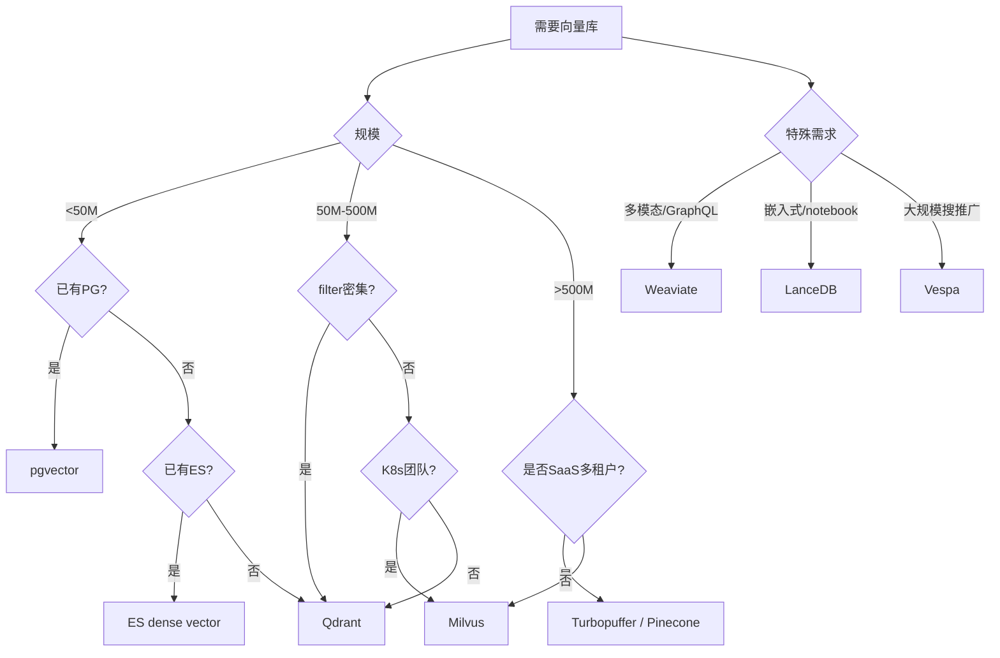

# RAG - 专题 S4：工业级选型对比 — 向量库 / Embedding / Reranker / BM25

> 这一篇专门解决一类反复在面试和方案评审里出现的问题：
> - "你为什么选 Milvus 不选 Qdrant？"
> - "bge-m3 和 Cohere v4 哪个更适合中英双语？"
> - "ColBERT 和 cross-encoder rerank 在生产里差多少？"
> - "BM25 你用的什么实现，为什么不直接用 Elasticsearch？"
>
> 这些问题没有标准答案，但有`结构化的回答方式`。本篇给出 2026 年生产环境下的选型框架、关键数据点和组合推荐，不是给你一个`最好`的产品，而是让你能在白板前 5 分钟内讲清楚`什么场景选什么、代价是什么`。

---

## 学习目标

读完这一篇，你应该能：

1. 在面试里就`向量数据库 / Embedding / Reranker / BM25`四类组件，给出一个`基于场景维度`的选型框架，而不是背产品名。
2. 知道 pgvector、Milvus、Qdrant、Weaviate、LanceDB、Pinecone、Vespa、Turbopuffer 各自最擅长什么、最容易翻车的地方在哪。
3. 区分`通用 embedding`、`多语言 embedding`、`领域 embedding`、`代码 embedding`、`多模态 embedding`的边界，知道 2024-2026 的主流模型（bge-m3、Qwen3-Embedding、Cohere v4、Voyage-3、Jina v3 等）各自的定位。
4. 区分 cross-encoder reranker、late-interaction reranker（ColBERT）、LLM reranker（RankGPT、Qwen3-Reranker）的成本/质量曲线。
5. 区分`经典 BM25`、`学习稀疏（SPLADE、bge-m3 sparse）`、`混合稀疏密集（hybrid sparse-dense）`的工程差异，知道为什么 Elasticsearch 不一定是默认选择。
6. 给出三套典型场景（百万级中等知识库、亿级企业知识库、代码搜索 / Agent 场景）的`端到端栈推荐`。

---

## 0. 先建一个统一的选型框架：6 个维度

无论选哪一类组件，都从同一套维度看。这是面试时最稳的回答骨架。

| 维度 | 你要问的问题 |
| --- | --- |
| **规模** | 数据量多大？向量数量？文档数量？预期增速？ |
| **延迟** | 端到端 P50/P99 要求？检索单独能容忍多少 ms？ |
| **质量** | 召回 Recall@K 目标？rerank 后 nDCG 目标？业务对错误率的容忍度？ |
| **成本** | 月度预算？是按 QPS 还是按数据量主导？是计算密集还是存储密集？ |
| **部署** | 自托管还是 SaaS？K8s 还是单机？是否要离线 / 内网部署？ |
| **生态** | 现有技术栈是什么？团队 ops 能力？是否需要 GraphRAG / 多租户 / 多模态？ |

记住一句话：**任何说"这个组件最好"的人都在背书，没在做工程**。所有选型都是 6 维度上的`帕累托权衡`。

---

## 1. 向量数据库对比

### 1.1 当前主流玩家（2026）

| 产品 | 类型 | 索引 | 最适合 | 典型短板 |
| --- | --- | --- | --- | --- |
| **pgvector** (0.8+) | Postgres 扩展 | HNSW / IVFFlat | <50M 向量，metadata 复杂，已有 PG 栈 | 大规模写入吞吐，filter-aware ANN 还在演进 |
| **Milvus** (2.5+) | 专职向量库 | HNSW / IVF-PQ / DiskANN / GPU IVF | 亿级以上规模，K8s 生态，多副本 | 运维重，metadata 过滤性能弱于 Qdrant |
| **Qdrant** (1.13+) | 专职向量库 | HNSW (filter-aware) | metadata 过滤密集场景，租户隔离 | 单集群上限低于 Milvus，社区生态偏小 |
| **Weaviate** (1.28+) | 专职向量库 | HNSW | 多模态、GraphQL 接口、模块化 reranker / generator | 性能略弱于 Qdrant/Milvus，复杂查询调优坑多 |
| **LanceDB** | Embedded / 文件型 | IVF-PQ | 嵌入式、Notebook、数据科学 | 不适合在线高 QPS 服务，多写并发弱 |
| **Pinecone** (Serverless) | 托管 SaaS | 自研 | 不想运维、波动负载、按需付费 | 价格、锁定、私有部署不可能 |
| **Vespa** | 企业级搜索引擎 | HNSW + 倒排 + tensor | 大规模混合检索、推荐、广告 | 学习曲线陡，配置 YAML 海洋 |
| **Turbopuffer** | 对象存储后端 | HNSW + S3 | 长尾低 QPS、超大规模、超低成本 | 冷查询慢（首次加载），不适合实时高 QPS |
| **Elasticsearch / OpenSearch** | 全文 + 向量 | HNSW (Lucene) | 已有 ES 栈、混合检索原生 | 内存吃得猛，HNSW 实现性能偏弱于 Qdrant |

### 1.2 几个不是产品对比能讲清楚的关键点

#### （1）pgvector 的位置在 2024-2026 被严重低估了

2023 年大家普遍觉得 pgvector 是`玩具`，2024-2026 不一样了：
- 0.5（2023.08）加了 HNSW，性能跳一个数量级
- 0.7（2024.06）加了 `halfvec`（fp16），向量内存减半
- 0.8（2025）加了 `iterative index scan`（filter-aware HNSW）和 binary 量化
- 0.8.x 在 5000 万向量、有 metadata 过滤的中文文档检索 benchmark 上，已经能跑赢 Milvus 早期版本

**什么时候用 pgvector 就够？**
- 向量 ≤ 5000 万
- 你已经在用 Postgres（80% 的 ToB 项目）
- metadata schema 复杂、需要 JOIN
- 不想多养一个 stateful 服务

**什么时候必须升级？**
- 向量 > 1 亿
- 需要 GPU 索引
- 需要按租户做物理隔离（多 collection、多 namespace）
- 写入 QPS > 5000/s 持续

#### （2）Qdrant vs Milvus 的真实差异

这两个是 2024-2026 自托管场景里最常被对比的组合：

| 维度 | Qdrant | Milvus |
| --- | --- | --- |
| 核心语言 | Rust | C++ / Go |
| 单机扩展性 | 强（单节点性能最好之一） | 一般（设计为分布式） |
| 集群扩展性 | 一般（manual sharding） | 强（原生分布式） |
| filter-aware ANN | 强（payload index + filterable HNSW） | 弱-中（filter 经常退化为 brute force） |
| 量化支持 | scalar / binary / product | scalar / IVF-PQ / GPU |
| 多租户 | collections + payload-based | collections + partitions |
| 运维复杂度 | 低（单二进制可用） | 高（Pulsar / etcd / MinIO 依赖） |
| 适合规模 | 千万-亿级 | 亿级以上 |
| 社区 | 中等，文档清晰 | 大，CNCF graduated |

**经验法则**：
- `< 1 亿向量 + metadata 过滤密集` → Qdrant
- `> 1 亿向量 + 多副本高可用 + K8s 团队成熟` → Milvus
- `企业内部要"安全合规可审计"且不要 K8s` → Qdrant 二进制部署

Milvus 的 filter 问题是个`长期被诟病`的点：当过滤器选择性高（pre-filter 后候选很少）时，Milvus 的 HNSW 容易退化成全扫描。Qdrant 的 filterable HNSW 在 1.5+ 之后专门优化过这种场景。

#### （3）Turbopuffer 与"对象存储向量库"这条新路线

Turbopuffer（2024 开始进入主流视野）的核心想法：**把向量数据放 S3，查询时按需 page-in**。
- 优点：存储成本是 Pinecone 的 1/10 - 1/30。
- 优点：冷数据近乎免费。
- 代价：第一次查询某个 namespace 时延迟会 spike（S3 cold read）。
- 代价：不适合需要稳定低 P99 的在线服务。

什么时候用？
- 多租户 SaaS，每个租户的查询量不大但租户数极多
- 内部分析、AI 助手、Agent 工具调用类（不要求毫秒级响应）

什么时候不用？
- 主搜索路径，需要 P99 < 100ms

这条`存算分离`的路线 2026 年很多向量库都在跟（Milvus 2.5 也在做 tiered storage），值得在面试里提一嘴。

#### （4）Elasticsearch / OpenSearch 的向量能力够不够用？

ES 从 8.0 起原生支持 dense vector + HNSW，OpenSearch 也跟进了。优点是`和现有 BM25 倒排合一`，混合检索原生。

但有几个坑：
- HNSW 内存常驻，向量数大于 1000 万时 heap 压力非常大
- 量化支持远不如 Qdrant / Milvus
- 单段（segment）HNSW，合并代价高

**经验法则**：如果你只有几百万向量、又恰好已经在用 ES 做日志或搜索，那就别多建一个向量库。超过这个体量，分开建会更省心。

### 1.3 一张选型决策树



---

## 2. Embedding 模型对比

### 2.1 2026 年主流模型（按家族分）

| 模型                                | 维度                  | Max Tokens | 多语言       | MRL | 量化友好           | 类型     | 备注                                                                   |
| --------------------------------- | ------------------- | ---------- | --------- | --- | -------------- | ------ | -------------------------------------------------------------------- |
| **OpenAI text-embedding-3-large** | 3072 (可降至 256-3072) | 8191       | 强         | ✅   | 中              | 闭源 API | MRL 原生，价格 $0.13/M tokens                                             |
| **OpenAI text-embedding-3-small** | 1536 (可降)           | 8191       | 强         | ✅   | 中              | 闭源 API | $0.02/M，性价比高                                                         |
| **Cohere embed-v4.0**             | 1536/256/字节         | 128K       | 多语言 SOTA  | ✅   | ✅（int8/binary） | 闭源 API | 2025 版，长上下文 128K，原生多模态文档                                             |
| **Voyage-3-large**                | 1024                | 32K        | 强         | ✅   | ✅              | 闭源 API | 检索任务榜单常驻前列                                                           |
| **voyage-code-3**                 | 1024                | 32K        | 代码        | ✅   | ✅              | 闭源 API | 代码检索 SOTA 之一                                                         |
| **bge-m3** (BAAI)                 | 1024                | 8192       | 中英双语 SOTA | ❌   | 中              | 开源     | dense + sparse + multi-vector 三合一                                    |
| **bge-large-en/zh-v1.5**          | 1024                | 512        | 单语        | ❌   | 中              | 开源     | 长期稳定的开源基线                                                            |
| **Qwen3-Embedding-8B**            | 4096                | 32K        | 中英 + 多语言  | ✅   | ✅              | 开源     | 2025 发布，MTEB 多语种 #1 之一                                               |
| **Qwen3-Embedding-4B / 0.6B**     | 2560 / 1024         | 32K        | 多语        | ✅   | ✅              | 开源     | 4B 是性价比之选                                                            |
| **gte-Qwen2-7B-instruct**         | 3584                | 32K        | 多语        | ❌   | 中              | 开源     | 2024 上半年榜首                                                           |
| **Jina embeddings v3**            | 1024                | 8192       | 多语        | ✅   | ✅              | 开源/API | task-specific LoRA adapters（retrieval / classification / separation） |
| **Nomic Embed v2 MoE**            | 768                 | 2048       | 多语        | ❌   | 中              | 开源     | MoE 架构，速度快                                                           |
| **mxbai-embed-large-v1**          | 1024                | 512        | 英语        | ✅   | ✅              | 开源     | 训练数据透明                                                               |
| **E5-mistral-7b-instruct**        | 4096                | 32K        | 多语        | ❌   | 中              | 开源     | 早期 LLM-based embedding 的代表                                           |
| **NV-Embed-v2** (NVIDIA)          | 4096                | 32K        | 英语        | ❌   | 中              | 开源     | LLM-as-encoder，MTEB-en 强                                             |

### 2.2 关键概念辨析（这是面试深挖点）

#### （1）Bi-encoder vs Cross-encoder vs Late-interaction

| 类型 | 计算方式 | 索引可行性 | 召回质量 | 代表 |
| --- | --- | --- | --- | --- |
| **Bi-encoder** | query 和 doc 各自编码成单向量 | ✅ 可预索引 | 中 | 上表全部 |
| **Cross-encoder** | query 和 doc 拼接，token-level 交互 | ❌ 无法预索引（必须实时算） | 高 | 所有 reranker |
| **Late-interaction** | query 和 doc 各编码成多向量，检索时做 MaxSim | ⚠️ 可索引但存储大 | 高 | ColBERT, ColBERTv2, ColPali |

**面试常考**：为什么 bi-encoder 用来做一阶段召回，cross-encoder 只用来 rerank？答：bi-encoder 单边编码可缓存可索引（ANN 查询），cross-encoder 必须 query-doc 配对实时算（n 个文档 = n 次 forward），无法做大规模检索，所以只能在小候选集上重排。

#### （2）Matryoshka Representation Learning (MRL)

OpenAI 2024 发布 text-embedding-3 时把这个想法推到主流。本质：**训练时让模型学到"前 k 维已经能用"**，所以同一个 embedding 可以截断到任意维度使用，不需要重新训练。

工程价值：
- 索引时存 3072 维（高精度召回）
- 重排前先用 256 维做粗筛（10 倍速度提升）
- 同一个模型支持多档质量/成本 trade-off

**坑**：不是所有模型都原生支持 MRL。bge-m3 不是 MRL 训练的，强制截断会掉点很多。Cohere v4、OpenAI v3、Voyage-3、Qwen3、Jina v3 是 MRL 训练的，截断友好。

#### （3）量化：int8 vs binary vs scalar

| 量化 | 精度损失 | 存储压缩 | 适合场景 |
| --- | --- | --- | --- |
| scalar (fp16/half) | 几乎无 | 2x | 默认选择，pgvector halfvec |
| int8 | <2% recall | 4x | 大规模生产 |
| binary | 5-15% recall | 32x | 超大规模 + 粗筛阶段 |

**两阶段量化检索**（2024 工业界流行做法）：
1. binary embedding 做 10 倍粗筛
2. int8 / fp16 做精排
3. 原始 fp32 / cross-encoder rerank

Cohere v3+ 和 Qwen3-Embedding 都原生支持 binary，自带 rescore。

#### （4）中英双语 / 中文优先的选型

这是中国团队最关心的问题。2026 年的真实选型框架：

| 场景 | 首选 | 备选 |
| --- | --- | --- |
| 中文为主 + 开源 + 部署 | bge-m3 / bge-large-zh-v1.5 | Qwen3-Embedding-4B |
| 中英混合 + 开源 + 高质量 | Qwen3-Embedding-8B | bge-m3 |
| 中英混合 + API + 不想运维 | Cohere v4 | Voyage-3-large |
| 代码检索 | voyage-code-3 | Qwen3-Embedding（代码 LoRA 微调） |
| 多模态文档 | Cohere v4（图文） / ColPali（视觉） | jina-clip-v2 |
| 极致成本 | bge-small-zh + int8 量化 | Qwen3-Embedding-0.6B |

#### （5）MTEB 榜单怎么看才不被骗

MTEB（Massive Text Embedding Benchmark）是默认基准，但 2025-2026 有几个`陷阱`要避免：

1. **榜单不等于你的业务**：MTEB 的 retrieval 子集主要是英文短文档问答，对你的中文长制度文档没那么有指示性。
2. **MTEB 污染问题**：很多模型为了刷榜，在 MTEB 训练集上做了对齐训练。看 `MTEB-en-leaderboard` 时最好同时看 `BEIR` 和 `MIRACL` 这种交叉验证集。
3. **新榜单**：2025 年 MTEB v2 / MMTEB 加入了更多语言和领域，更可信。
4. **C-MTEB**：中文领域专门 benchmark，bge / Qwen / gte 在这上面的差距比 MTEB 上更有参考价值。

**正确用法**：
1. 用 MTEB 筛掉明显差的（30+ 模型筛到 5 个）
2. 用 BEIR / MIRACL / C-MTEB 二次验证
3. 用自家 golden set（200-500 条业务样本）做最终决策

### 2.3 一张性价比矩阵（2026 经验值）

```
  质量
   ▲
   │              Qwen3-Embedding-8B
   │                   ●
   │         Cohere v4 ●  ● Voyage-3-large
   │                       ● OpenAI v3-large
   │             bge-m3 ●
   │                       ● Qwen3-Embedding-4B
   │  bge-large-zh ●
   │                ● Jina v3
   │                       ● OpenAI v3-small
   │  bge-small ●
   │                                              成本
   └──────────────────────────────────────────────►
```

---

## 3. Reranker 对比

### 3.1 主流 Reranker（2026）

| Reranker | 类型 | 模型大小 | Max tokens | 延迟 (P50 @ 100 docs) | 多语言 | 备注 |
| --- | --- | --- | --- | --- | --- | --- |
| **Cohere Rerank 3.5** | Cross-encoder | 闭源 | 4096 | 100-300ms (API) | ✅ | API 易用，多语言强 |
| **bge-reranker-v2-m3** | Cross-encoder | 568M | 8192 | 150-400ms (GPU) | ✅（中英 SOTA 开源） | 开源默认基线 |
| **bge-reranker-v2.5-gemma2-lightweight** | Cross-encoder | 2.5B | 8192 | 300-800ms (GPU) | ✅ | 质量更高，成本更高 |
| **Jina Reranker v2** | Cross-encoder | 278M | 8192 | 80-200ms | ✅ | 多语言，超轻 |
| **mxbai-rerank-large-v1** | Cross-encoder | 435M | 512 | 100-300ms | 英语 | 训练数据透明 |
| **Voyage rerank-2** | Cross-encoder | 闭源 | 16K | 100-250ms (API) | ✅ | 长上下文 16K |
| **Qwen3-Reranker-8B/4B/0.6B** | Cross-encoder | 0.6B-8B | 32K | 视模型 | ✅ | 2025 开源，质量极强 |
| **ColBERTv2 / JaColBERT** | Late-interaction | 110M | 512 | 视存储后端 | 英 / 日 / 多语 | 索引大但速度快 |
| **RankGPT / RankZephyr** | LLM-based | 取决于底模 | 长上下文 | 慢（秒级） | ✅ | 质量上限高，成本高 |

### 3.2 三类 Reranker 的本质差异

#### （1）Cross-encoder reranker（主流）

```python
# 伪代码
for doc in candidates:
    score = model([query, doc])  # 一次 forward
ranked = sorted(candidates, key=lambda d: scores[d], reverse=True)
```

特点：
- 每个 (query, doc) 对独立算一次
- 质量好（因为 token-level 交互）
- 不能预索引，必须实时算
- 受候选集大小限制（生产里通常 50-200 个 doc）

#### （2）Late-interaction reranker（ColBERT 家族）

```python
# query 编码成 multi-vector：[v1, v2, ..., vN]
# doc 也编码成 multi-vector：[u1, u2, ..., uM]
# MaxSim score = sum_i(max_j(v_i · u_j))
```

特点：
- doc 端可以预索引（multi-vector index）
- query 端实时算（但很快，因为 query 短）
- 比 cross-encoder 快 10-100 倍
- 存储成本高（每个 token 一个向量）
- 召回 + rerank 一体化

为什么不主流？因为索引存储太贵，但在`代码检索`、`长文档检索`这种场景下 ColBERT 路线是隐形主流——ColPali 就是 ColBERT 思路在视觉文档上的延伸。

#### （3）LLM-based reranker（RankGPT 路线）

```python
prompt = f"以下是 {N} 个候选文档，按相关性从高到低排序：\n{docs}\n请输出排序后的 id 列表。"
ranked = llm(prompt)
```

特点：
- 用通用 LLM 做 listwise 排序
- 质量上限高（理解能力强）
- 成本高（每次几千 token）
- 延迟高（生成式输出）

2024-2026 演化：
- 早期 RankGPT 用 GPT-4，太贵
- RankZephyr / RankVicuna 把它做成开源 7B 模型
- 2025 年 Qwen3-Reranker 直接把 LLM 训练成专用 reranker，质量接近 GPT-4，成本接近 cross-encoder

### 3.3 选型决策表

| 场景 | 首选 | 备选 |
| --- | --- | --- |
| 中英业务 + 开源默认 | bge-reranker-v2-m3 | Qwen3-Reranker-4B |
| 极致质量 + 不在乎成本 | Cohere Rerank 3.5 / Qwen3-Reranker-8B | RankZephyr |
| 极致延迟 + 多语言 | Jina Reranker v2 | mxbai-rerank |
| 长文档 (>2K tokens) | Voyage rerank-2 / bge-reranker-v2-m3 | Qwen3-Reranker（32K） |
| 代码检索 | ColBERTv2 | voyage-code-3 + cross-encoder |
| 视觉文档 | ColPali / ColQwen2 | — |
| 离线高质量评测 | RankZephyr / LLM rerank | Qwen3-Reranker-8B |

### 3.4 容易踩的坑

1. **Reranker 候选集太大**：top-K 给到 reranker 200 个以上，延迟爆炸。生产经验：dense 出 50-100，rerank 取 top-10。
2. **Reranker 不懂业务**：通用 reranker 在重术语领域（电力、医疗、法律）经常乱排。解法：业务 metadata hard filter 前置，或在业务数据上 fine-tune reranker。S3 实战课讲过这个具体案例。
3. **Reranker 和 embedding 模型不匹配**：用 bge-m3 召回 + Cohere rerank，结果 Cohere 的相关性判断和 bge 的相似度判断不一致，会出现`召回时排第 50、rerank 后第 1`的反转。生产里通常用同家族（bge 召回 + bge rerank）。
4. **Reranker 接收的上下文窗口**：很多 reranker max_tokens 是 512 / 8192，超长 chunk 会被截断。bge-reranker-v2-m3 / Voyage rerank-2 / Qwen3-Reranker 都支持 8K-32K。
5. **Reranker 分数不能直接做拒答阈值**：不同 reranker 的分数分布完全不同。如果要用 rerank 分做拒答，必须先在你的业务数据上校准阈值（拉 200 个样本，看正负样本分数分布）。

---

## 4. BM25 对比

很多人觉得 BM25 是个"老古董"，2024-2026 不是这样：**所有生产级 RAG 系统的混合检索默认底座之一是 BM25**，因为它对专有名词、代码、错误码、数字 ID 的精确命中能力是 dense embedding 永远比不上的。

### 4.1 BM25 实现对比

| 实现 | 语言 | 性能 (1M docs) | 中文支持 | 部署形态 | 备注 |
| --- | --- | --- | --- | --- | --- |
| **Elasticsearch / OpenSearch** | Java + Lucene | 极强（百亿级） | 需配 IK / Smart-CN | 集群 | 工业默认，但运维重 |
| **Lucene** | Java | 极强 | 需配中文分词 | 嵌入式 | ES 底层 |
| **Tantivy** | Rust | 极强 | 需配 jieba/lindera | 嵌入式 | Rust 版 Lucene，Qdrant 用过 |
| **Vespa BM25 / BM25F** | C++/Java | 极强 | 需配中文分词 | 集群 | 工业级搜推广默认 |
| **BM25S** | Python (NumPy/SciPy) | 中-强 (1M ~ 秒级查询) | 需要自分词 | 单机 | 2024 新秀，Python 纯实现最快 |
| **bm25-pt** | PyTorch | 中 | 自分词 | 单机 | GPU BM25，适合训练数据加速 |
| **rank_bm25** | Python (纯) | 弱（10W 级） | 自分词 | 单机 | 教学/小规模，生产别用 |
| **Pyserini** | Python wrapper of Anserini | 极强 | 多语言 | 单机 | 学术 benchmark 默认 |
| **Postgres tsvector + ts_rank_cd** | C (in PG) | 中（千万级） | 需 zhparser / pg_jieba | 嵌入式 | 已有 PG 时省一个组件 |
| **Qdrant sparse vectors** | Rust | 极强 | 视上游分词 | 集群 | 支持 SPLADE / bge-m3 sparse |
| **Milvus sparse vectors** | C++/Go | 极强 | 视上游分词 | 集群 | 2.4+ 支持，原生混合 |

### 4.2 几个关键判断

#### （1）Elasticsearch 不是默认选择

很多团队默认用 ES，但 2024-2026 这个判断在变。原因：
- ES 集群运维成本远高于 Qdrant / Milvus
- 如果只用 BM25，ES 有点重
- BM25 + 向量混合检索时，分两个系统反而清晰

**何时用 ES**：你已经在用 ES 做日志/全文搜索；或者向量数 < 1000 万，不想多养向量库。

**何时不用 ES**：纯 RAG，向量 > 1000 万，希望混合检索在一个系统里（Qdrant / Milvus / Weaviate 都支持原生 sparse + dense 混合）。

#### （2）BM25S 是 2024 的 Python 生态大事

> Lù, *BM25S: Orders of magnitude faster lexical search via eager sparse scoring*, 2024.07.

BM25S 把纯 Python BM25 的速度推到接近 Lucene 的 1/10-1/3。这意味着：
- 中小规模 RAG（百万级）可以不上 ES
- 离线评测、研究、原型可以直接 Python in-memory

```python
import bm25s
# 索引
retriever = bm25s.BM25()
retriever.index(corpus_tokens)
# 检索
results, scores = retriever.retrieve(query_tokens, k=10)
```

#### （3）Postgres tsvector 不要小看

如果你已经在用 PG，又只有几百万文档，PG 的全文搜索 + ts_rank_cd 完全够用：
- 中文配 `zhparser` 或 `pg_jieba`
- 和 pgvector 在同一个表里 JOIN，混合检索一条 SQL 就出
- 不用养 ES

```sql
-- 混合检索（pgvector + tsvector）
SELECT id, content,
       ts_rank_cd(tsv, query) AS bm25_score,
       1 - (embedding <=> :q_emb) AS vec_score
FROM docs, plainto_tsquery('zhcfg', :q_text) AS query
WHERE tsv @@ query OR embedding <=> :q_emb < 0.6
ORDER BY (ts_rank_cd(tsv, query) * 0.3 + (1 - (embedding <=> :q_emb)) * 0.7) DESC
LIMIT 10;
```

代价：百万级以上时 ts_rank_cd 会成为瓶颈，需要 GIN 索引调优。

### 4.3 学习稀疏（Learned Sparse）：BM25 的演化

经典 BM25 是`term-based`，对同义词无能为力。学习稀疏（SPLADE 家族）是 2021-2024 的重要演化：
- 把稀疏向量从`term-IDF`变成`learned weights over vocabulary`
- 模型学会对 query 做`expansion`（"主变" → 主变压器、变压器、主变器 等同义扩展）
- 索引依然是稀疏倒排，性能保留

| 学习稀疏模型 | 来源 | 备注 |
| --- | --- | --- |
| **SPLADE / SPLADE++** | Naver | 学习稀疏开山 |
| **SPLADE-v3** | Naver 2024 | 多语言增强 |
| **bge-m3 sparse component** | BAAI 2024 | dense + sparse + multi-vector 三合一 |
| **uniCOIL / DeepImpact** | UIUC | 早期工作 |

**生产里学习稀疏的位置**：在`需要同义词扩展`但又`想保留稀疏倒排性能`的场景里取代 BM25。例如医疗、法律这种术语变体多的领域。

代价：
- 索引比 BM25 大 3-5 倍
- 需要 GPU 编码 query 和 doc
- Qdrant / Milvus 都已支持 sparse vector 索引

### 4.4 BM25 调参细节（面试深挖区）

BM25 有两个核心参数：
- `k1`：词频饱和度。默认 1.2，越大越偏好高频词。
- `b`：长度归一化。默认 0.75，越大越惩罚长文档。

**经验值**：
- 短文档（FAQ、问句）：`k1=1.2, b=0.75`（默认）
- 长文档（手册、规程）：`k1=1.5, b=0.5`
- 代码搜索：`k1=2.0, b=0`（基本关掉长度归一化）

中文还有一个隐藏问题：**分词质量决定 BM25 上限**。
- jieba 默认词典对专业领域差
- 必须维护`领域词典`（电力、医疗、法律各自一套）
- 否则"主变压器"会被切成"主/变压器"或"主变/压器"，BM25 直接报废

---

## 5. 三套端到端栈推荐

下面给你三套`场景 → 端到端栈`的真实推荐。面试里能直接复用。

### 5.1 场景一：百万级中文知识库（典型 ToB FAQ / 制度问答）

- 规模：50 万-500 万 chunks
- QPS：< 100
- 团队：小，不要太多 ops

```
文档解析   : Docling / Unstructured + PyMuPDF4LLM
Chunking   : 结构化 + Parent-Child + bge-m3 做 Contextual Retrieval
Embedding  : bge-m3（dense + sparse 同时出）
向量库     : pgvector 0.8（halfvec + HNSW）+ tsvector（如果完全不想加组件）
            或 Qdrant（如果向量库要独立 scale）
BM25      : Postgres tsvector + zhparser
            或 Qdrant sparse vector
Rerank     : bge-reranker-v2-m3
LLM       : Qwen3 / Claude Opus 4.x
评测       : 自建 300 条 golden set + RAGAs
观测       : Langfuse 自托管
```

**why**：
- pgvector + tsvector 同库混合检索，一条 SQL 解决
- bge-m3 一个模型出 dense + sparse + multi-vector，最省心
- Qdrant 作为升级选项

### 5.2 场景二：亿级企业知识库（多租户、多领域、合规）

- 规模：1-10 亿 chunks
- QPS：500-5000
- 多租户、ACL、审计完备

```
文档解析   : MinerU / Docling 集群 (Airflow / Prefect 调度)
Chunking   : 多策略（结构化 / Late Chunking / Contextual）按文档类型路由
Embedding  : Qwen3-Embedding-4B（中文为主）+ Cohere v4（多语言补足）
向量库     : Milvus 2.5 集群（按租户 partition）
            + GPU 索引节点（IVF-PQ + GPU）
BM25      : Elasticsearch / OpenSearch（已有日志栈复用）
            或 Qdrant sparse（如果新建栈）
Rerank     : bge-reranker-v2-m3 + Cohere Rerank 3.5（两段：开源粗排 + API 精排）
查询路由   : 领域分类器（轻量 BERT）→ sub-corpus
LLM       : Claude / Qwen3 / GPT 多供应商
GraphRAG  : Neo4j / NebulaGraph（仅高价值文档子集）
评测       : RAGAs + ARES + golden set per domain
观测       : Langfuse 集群 + Prometheus
```

**why**：
- Milvus 多副本 + 大规模写入吞吐
- 多 reranker 阶梯：开源做 50→20，闭源做 20→5
- 领域路由对应 S3 实战课里的"分灶做"

### 5.3 场景三：代码搜索 / Agent 工具调用（Claude Code 路线）

- 规模：百万-千万 LOC
- 实时变更（IDE 场景）
- 用户是 Agent，不是人

```
"检索"层    : ripgrep + glob + LSP（不建索引！）
辅助索引    : ctags（符号定位）
向量库     : 仅对文档（README / docs）建索引：LanceDB 嵌入式
Embedding  : voyage-code-3（仅对自然语言文档）
BM25      : Tantivy（如果需要全文搜索 UI）
Rerank     : 不做（LLM 自己读结果）
LLM       : Claude / Qwen3-Coder
策略       : Agent loop（model decides when to search）
```

**why**：
- 这就是 S2 课讲的`agentic search`路线
- 代码本身不需要 embedding，因为有精确锚点
- 文档部分才需要 RAG

---

## 6. 面试怎么问

下面是 2026 年常见的深挖问法和回答骨架。

### Q1: "你为什么选 Qdrant 不选 Milvus？"

**回答骨架**：
1. 我们规模在 X 亿向量以下
2. metadata 过滤是核心场景（多租户 / 时间 / 权限）
3. Qdrant 的 filterable HNSW 在这种场景下比 Milvus 早期版本好（Milvus 2.4+ 在改进，但我们上线时是 2.x）
4. 团队不想引入 Pulsar / etcd / MinIO 三件套依赖
5. 如果规模到 X 亿以上，我们会评估迁移到 Milvus 或上 Turbopuffer

### Q2: "bge-m3 和 Qwen3-Embedding 你选哪个？"

**回答骨架**：
1. 取决于规模和成本
2. bge-m3 一个模型出 dense + sparse + multi-vector，省一个 SPLADE 部署
3. Qwen3-Embedding-4B/8B 在 C-MTEB 上质量更高，但需要更大显存
4. 中等规模选 bge-m3，追求质量上限选 Qwen3-Embedding-8B
5. 都做了 golden set 评测，业务上 Qwen3 提升 X 个百分点，是否值得看你的成本曲线

### Q3: "ColBERT 你为什么不用？"

**回答骨架**：
1. ColBERT 索引存储是 bi-encoder 的 5-20 倍
2. 我们的文档体量 X 亿 chunks，存储成本会爆
3. ColBERT 适合的场景：长文档 + 检索 ≈ rerank 一步完成 + 存储不敏感
4. 我们用 bi-encoder + cross-encoder rerank 两段式，存储和质量平衡更好
5. 视觉文档检索我们用 ColPali（它是 ColBERT 在视觉上的延伸），那个场景下 ColBERT 路线是必选

### Q4: "你为什么不用 Elasticsearch？"

**回答骨架**：
1. 我们已经在用 PG / 已经在用 Qdrant，再加一个 ES 集群运维成本高
2. 我们用 Qdrant sparse vector（或 PG tsvector + GIN）替代
3. 性能：在 X 千万规模下，Qdrant sparse 和 ES BM25 性能接近
4. 如果团队已经有 ES 栈，那 ES 是更合理的选择，不需要重复造
5. 不要把"用 ES"等价于"用 BM25"——ES 只是 BM25 的一种实现

### Q5: "Reranker 一定要加吗？"

**回答骨架**：
1. 一阶段召回（dense / sparse / hybrid）的 top-50 召回率高，但 top-5 precision 经常不够
2. Reranker 的作用是把候选集从 50 收敛到 5-10，保证 LLM 只看到最相关的
3. 我们 A/B 测试显示加 reranker 后 faithfulness +X%，answer relevancy +Y%
4. 延迟代价：bge-reranker-v2-m3 约 200ms（GPU），可接受
5. 如果业务对延迟极敏感，可以用 Jina Reranker v2（更小）或 不做 rerank 用 hybrid + RRF

---

## 7. 小结

1. **向量库不要默认 Pinecone**：pgvector 已经能扛 5000 万；Qdrant 是 100M 以下的最佳自托管；Milvus 是亿级以上的工业默认；Turbopuffer 是新出的低成本路线。
2. **Embedding 不要只看 MTEB**：MTEB 筛掉差的，BEIR/MIRACL/C-MTEB 二次验证，自家 golden set 最终决策。bge-m3 / Qwen3-Embedding 是 2026 年中英业务的开源默认。
3. **Reranker 是 precision 必备**：cross-encoder 是默认，late-interaction（ColBERT 系）只在特定场景，LLM rerank 是质量上限但成本高。注意 reranker 不懂业务，要靠 metadata hard filter 前置。
4. **BM25 实现 ≠ Elasticsearch**：BM25S、Tantivy、PG tsvector、Qdrant sparse、SPLADE 都是合法路径。已经在 PG 就用 PG，新建栈优先考虑向量库自带 sparse。
5. **学习稀疏（SPLADE / bge-m3 sparse）是 BM25 的演化**：在术语变体多的领域比纯 BM25 强，代价是索引大 3-5 倍 + 需要 GPU 编码。
6. **选型本质是 6 维权衡（规模 / 延迟 / 质量 / 成本 / 部署 / 生态）**：任何说"X 最好"的人都没在做工程。面试时用这 6 维框架回答永远不出错。

---

## 8. 检查站

试着不查资料回答：

1. 你的团队已经在用 Postgres，向量数据预计 3000 万，QPS 50，混合检索为主。你会选什么栈？为什么不直接上 Milvus？
2. 面试官说："我们要用 bge-m3 做召回 + Cohere Rerank 做精排。" 你能指出这套组合可能的两个潜在问题吗？
3. 为什么 ColBERT 路线在文本检索里没成为主流，但在视觉文档（ColPali）里却是 SOTA？
4. 你的 BM25 在中文场景下 recall 怎么都上不去，可能的原因有哪几类？给出排查顺序。
5. 你的业务上线后发现`rerank 后 top-1 经常比 dense 检索 top-1 还差`。这是什么问题？怎么调试？

---

## 9. 延伸阅读（站内）

- 第 5 课：Embedding 深度
- 第 6 课：向量索引底层
- 第 7a：混合检索（BM25 + dense + RRF）
- 第 7b：元数据过滤
- 第 7c：Reranker
- 第 11 课：多模态 RAG / ColPali
- S1：Metadata 设计与知识结构建模
- S2：Agentic Search（代码搜索的反例）
- S3：电力行业落地踩坑（reranker 不懂业务的真实案例）

---

## 10. 参考与延伸

- Lewis et al., *RAG for Knowledge-Intensive NLP Tasks*, NeurIPS 2020
- Khattab & Zaharia, *ColBERT*, SIGIR 2020；ColBERTv2, NAACL 2022
- Formal et al., *SPLADE: Sparse Lexical and Expansion Model*, SIGIR 2021；SPLADEv2 / SPLADE-v3
- OpenAI, *New embedding models with MRL*, 2024.01
- Anthropic, *Contextual Retrieval*, 2024.09
- BAAI, *BGE M3-Embedding*, 2024
- Alibaba, *Qwen3-Embedding / Qwen3-Reranker*, 2025
- Cohere, *Embed v4 multimodal*, 2025
- Lù, *BM25S*, 2024.07
- Faysse et al., *ColPali*, 2024.07
- Turbopuffer engineering blog (2024-2025)
- Qdrant filter-aware HNSW blog (2023-2025)
- Milvus 2.4 / 2.5 release notes
