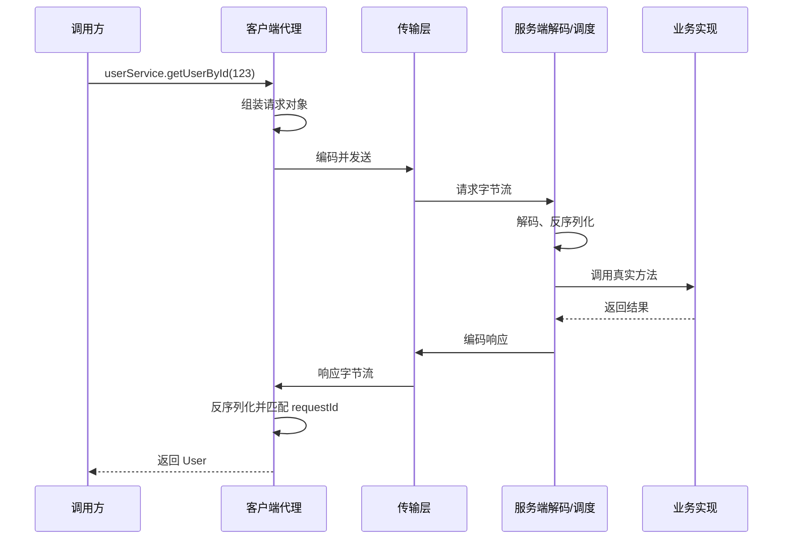

# RPC - 第 2 课：一次 RPC 调用到底发生了什么：代理、协议、传输与调度

## 学习目标（本节结束后你能做到什么）

- 按调用链顺序讲清一次 RPC 从发起到返回的全过程。
- 理解代理、序列化、协议帧、网络传输、服务端调度分别负责什么。
- 理解为什么 RPC 要设计 requestId、消息长度等协议字段。
- 初步建立“服务端收到的不是方法调用，而是一段带结构的字节流”的视角。
- 能用一段完整、面试可落地的话解释 RPC 原理。

## 内容讲解（核心概念，用类比、例子、图示说清楚）

### 1. 从一行代码开始

假设你的业务代码写了这样一行：

```java
User user = userService.getUserById(123);
```

表面看只是一个方法调用，但如果 `userService` 是远程服务代理，背后其实要经历一条完整链路。

你可以先记住最小流程：

1. 客户端代理拦截方法调用
2. 把方法名和参数编码成请求消息
3. 找到目标服务地址并发出去
4. 服务端收到消息后解码
5. 找到真正实现类并执行
6. 把结果编码成响应消息返回
7. 客户端收到后解码，还原成调用结果

这条链是所有 RPC 框架共同的骨架。

### 2. 客户端第一步：不是直接调实现，而是先调代理

调用方代码持有的 `userService`，通常不是真正的 `UserServiceImpl`，而是一个代理对象。

这个代理的职责是：

- 拦截方法调用
- 拿到方法名、参数类型、参数值
- 组装成请求模型
- 交给后面的网络和协议模块处理

所以 RPC 的第一步，本质上是把“本地方法调用语义”转换成“可传输的请求语义”。

### 3. 请求消息里到底要放什么

既然服务端并没有真的看到你的 Java 调用现场，它至少得知道这些信息：

- 调哪个服务
- 调哪个方法
- 参数类型是什么
- 参数值是什么
- 这次请求的唯一编号是什么

一个最简化的请求对象可能像这样：

```text
serviceName = UserService
methodName = getUserById
parameterTypes = [int]
arguments = [123]
requestId = 10001
```

你可以把它理解为：把“调用语义”翻译成“可序列化的消息对象”。

### 4. 消息对象还不能直接发，必须先序列化

网络不能直接传“Java 对象”或“Go 对象”，网络本质上传的是字节。

所以请求对象还要再经历一步：序列化。

比如：

- JSON：可读，但大
- Protobuf：紧凑，高效
- Hessian：Java 生态常见

序列化之后，才会得到真正可发送的字节数组。

### 5. 为什么还要协议帧，而不是直接发序列化结果

如果只把业务数据直接塞进 TCP，服务端会遇到一个大问题：

**它不知道一条消息从哪里开始、到哪里结束。**

因为 TCP 是字节流，不保留消息边界。你发两条消息，服务端可能：

- 一次性收到两条粘在一起
- 或只收到半条

所以 RPC 框架必须设计自己的消息帧格式。

一个常见思路是：

```text
| magic | version | serializeType | messageType | requestId | bodyLength | body |
```

这里最关键的字段之一就是 `bodyLength`，因为它告诉接收方后面要读多少字节才能拿到完整消息。

### 6. requestId 为什么重要

如果客户端是同步调用，一次发一个、等一个，requestId 的意义还不那么明显。

但真实 RPC 框架通常会：

- 复用连接
- 支持异步调用
- 允许同一条连接上同时飞多个请求

这时响应可能乱序回来。

所以必须给每个请求一个唯一编号，服务端响应时原样带回，客户端才能知道：

- 这个响应到底对应哪个请求
- 应该把结果交给哪个等待中的调用者

这就是 requestId 的核心意义：**把请求和响应重新对上号。**

### 7. 网络传输层在做什么

序列化完的请求消息，会通过网络传输层发送到远端。

这层通常负责：

- 建立连接
- 连接复用
- 发送与接收字节流
- 编解码
- 超时控制

早期很多 RPC 框架直接基于 TCP 自定义协议；gRPC 则跑在 HTTP/2 上。

不管底层选哪种，核心问题都一样：

- 如何高效传输
- 如何识别消息边界
- 如何把响应发回给对应调用方

### 8. 服务端不是“收到方法调用”，而是“收到一段字节”

很多初学者脑中会不自觉地把服务端想成“自动知道你在调哪个方法”。其实服务端看到的第一手东西只是网络上的字节。

服务端要做的步骤通常是：

1. 从连接里读取字节流
2. 根据协议头解析出消息长度、序列化方式等
3. 截取出完整 body
4. 反序列化成请求对象
5. 根据服务名和方法名找到目标实现
6. 调用真正业务逻辑

这里你可以看到，服务端首先是一个“解码器 + 调度器”，然后才是业务处理器。

### 9. 服务端调度：怎么找到真正的方法

服务启动时，通常会把暴露出去的服务注册到一个本地表中。

简化理解：

```java
Map<String, Object> serviceMap = new HashMap<>();
serviceMap.put("UserService", new UserServiceImpl());
```

收到请求后：

1. 根据 `serviceName` 找到实现对象
2. 根据 `methodName` 和参数类型找到目标方法
3. 执行方法
4. 得到结果

最朴素做法是反射调用。更高性能框架可能会用：

- `MethodHandle`
- 字节码生成
- 预生成 stub

来减少反射开销。

### 10. 返回结果也是同样一条链

服务端拿到执行结果后，还要把它：

1. 封装成响应对象
2. 带上原 requestId
3. 序列化
4. 按协议帧编码
5. 写回连接

客户端收到之后再：

1. 解码
2. 反序列化
3. 根据 requestId 找到原调用者
4. 把结果交回去

所以“请求链”和“响应链”是高度对称的。

### 11. 一段面试可直接说的 RPC 原理答案

如果面试官让你讲 RPC 原理，可以用这样一段结构化回答：

“RPC 的核心是通过代理把本地方法调用转换成远程请求。客户端调用代理对象时，代理会拿到服务名、方法名和参数，把它们序列化并按自定义协议编码后，通过 TCP 或 HTTP/2 发送给服务端。服务端收到字节流后先解码，再反序列化出请求对象，根据服务注册表找到真正的实现类并执行，最后把结果带着同一个 requestId 编码返回。客户端再通过 requestId 把响应和原请求关联起来，对调用方暴露出近似本地方法调用的体验。” 

这段话之所以好用，是因为它覆盖了：

- 代理
- 序列化
- 协议
- 网络
- 调度
- requestId

### 12. 一张完整链路图



## 小结

- 一次 RPC 调用的本质，是把“方法调用”翻译成“结构化消息”再通过网络传递。
- 代理负责截获调用，序列化和协议负责把请求变成字节流，传输层负责发送，服务端调度负责找到真实实现。
- TCP 是字节流，所以 RPC 必须自己定义消息边界，长度字段是关键。
- requestId 的作用，是在连接复用和异步场景下把响应重新交回正确的调用者。
- 会讲完整链路，比只会说“底层走 TCP”要强得多。

