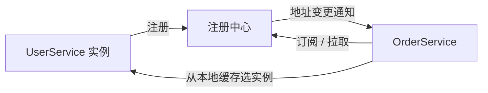

# RPC - 第 5 课：服务注册与发现：注册中心、K8s、CAP 与健康检查

## 学习目标（本节结束后你能做到什么）

- 理解为什么服务地址不能写死，服务发现到底在解决什么问题。
- 说清楚注册中心的基本工作流：注册、发现、订阅、变更通知。
- 理解心跳、临时节点、服务端探测分别是什么。
- 说清 CAP 中的 P 到底是什么，为什么它在分布式系统里不是可选项。
- 理解 K8s 为什么常常可以直接充当服务发现体系，以及它和传统注册中心的差异。

## 内容讲解（核心概念，用类比、例子、图示说清楚）

### 1. 为什么服务地址不能写死

假设订单服务要调用用户服务，最原始做法可能是把地址写进配置：

```text
user-service = 10.0.0.12:8080
```

这在单机、单实例时还能勉强接受，但一旦用户服务变成：

- 有 3 个实例
- 会扩容缩容
- 会因为故障被摘掉某一台

写死地址就会立刻崩掉。

所以服务发现本质上解决的是：

**调用方如何在一个会变化的服务实例集合里，持续找到当前可用的目标地址。**

### 2. 注册中心在整条链路里扮演什么角色

你可以把注册中心理解成“动态通讯录”。

它做的事通常有三步：

1. 服务注册
   - 服务启动时告诉注册中心：我是谁、我在哪、我还活着
2. 服务发现
   - 调用方查询：某服务当前有哪些实例可用
3. 变更通知
   - 当实例上线、下线、故障时，注册中心把变化通知给调用方

这样一来，调用方就不需要手工维护每台机器地址。

### 3. 一个完整调用过程



注意这个流程里非常关键的一点：

**调用方通常不会每次调用都实时去注册中心查。**

而是：

- 先拿到一份地址列表
- 缓存在本地
- 后续直接基于本地缓存发请求
- 当注册中心推送变化时再更新缓存

这就是为什么注册中心短暂抖动时，很多调用依然还能继续。

### 4. 注册中心怎么知道实例挂了

这是服务发现里一个核心问题。

#### 方案一：客户端心跳

服务实例每隔几秒向注册中心发一次“我还活着”的心跳。

如果连续多次收不到，注册中心就把它判定为失效。

优点：

- 模型简单

缺点：

- 感知故障有延迟
- “服务进程还活着但内部已不可用”时，心跳可能仍然正常

#### 方案二：临时节点 / 会话模型

ZooKeeper 典型做法是：服务实例和注册中心保持会话，注册一个临时节点。连接断了，临时节点自动消失。

优点：

- 感知更快

缺点：

- 对网络抖动更敏感
- 连接短暂异常也可能被误判为下线

#### 方案三：服务端探测

用户在对话里问到过“服务端探测是什么”，这个点很重要。

它和心跳不同，心跳是实例自己说“我还活着”，服务端探测是注册中心或旁路组件主动去探你的健康接口，比如：

- `/health`
- `/ready`

这样就能发现一种情况：

- 进程没死
- 心跳还能发
- 但线程池、数据库连接池、依赖服务已经卡死

这种时候光靠心跳不够，主动探测更靠谱。

### 5. CAP 里的 P 到底是什么

P 是 Partition Tolerance，通常翻成分区容错性。

它指的不是“系统能阻止网络出问题”，而是：

**当网络分区发生时，系统该如何继续工作。**

网络分区的意思是：多台机器都还活着，但彼此之间通信断掉了，集群被网络故障切成了几块。

举个类比：

- 北京办公室和上海办公室的人都还在
- 但电话线和网络全断了
- 双方都不知道对方刚刚做了什么

这就是分区。

### 6. 为什么 P 不是可选项

因为在分布式系统里，网络出问题不是理论假设，而是客观现实。

只要你是多机部署，就必须接受：

- 网络会抖
- 交换机会坏
- 跨机房链路会中断

所以 CAP 的真正含义不是“C、A、P 三选二”，而更接近：

**网络分区一旦发生，也就是 P 已经成了现实，此时你在一致性和可用性之间怎么取舍。**

这就是为什么说 P 不是你主动选择的特性，而是分布式系统必须面对的前提。

### 7. 为什么注册中心很多时候更偏 AP

注册中心里常见的一种思考是：

- 如果短时间内返回的实例列表有一点旧数据，可能只是少数请求失败
- 但如果注册中心整体不可用，新的服务发现可能全停

所以在很多服务发现系统里，会更偏向优先保证可用性，再通过本地缓存、健康检查、重试等机制兜住短时间不一致。

这就是为什么像 Eureka 一类系统偏 AP；而 ZooKeeper 更偏 CP。

### 8. 北美常见服务发现方案

用户在对话里还问过“北美最常用什么”，这个背景也值得沉淀下来。

在北美和云原生场景里，常见选择包括：

- Consul
- etcd（更多通过 Kubernetes 间接使用）
- Kubernetes Service + DNS
- gRPC + xDS / Service Mesh 生态

而不是只有传统 Java 世界里的 Eureka、ZooKeeper。

这说明服务发现的答案很大程度取决于部署平台。

### 9. K8s 为什么常常能直接完成服务发现

在 Kubernetes 里，很多时候不需要额外部署独立注册中心，因为 K8s 自己就提供了很强的注册发现能力。

核心角色有三个：

- Pod：实际运行的服务实例
- Service：给一组 Pod 提供稳定访问入口
- Endpoint / EndpointSlice：当前这组 Service 背后到底有哪些可用 Pod

你定义一个 Service：

```yaml
spec:
  selector:
    app: user-service
```

K8s 控制面就会持续维护所有匹配这个标签的 Pod 列表。

调用方通常直接访问：

```text
http://user-service
```

背后通过 CoreDNS 解析成 Service 地址，再由 kube-proxy / IPVS / CNI 机制把流量转到具体 Pod。

### 10. K8s 健康检查和传统注册中心有什么不同

K8s 里非常重要的是两个探针：

- `livenessProbe`
- `readinessProbe`

它们分别回答两个不同问题：

- 你死了没有
- 你现在适不适合接流量

尤其是 `readinessProbe`，它决定一个 Pod 是否应该出现在可用实例列表里。

这和传统注册中心里的“只是发心跳”相比，更贴近“能不能真正接业务流量”。

### 11. 传统注册中心和 K8s 服务发现的差异

可以从几个维度看：

- 传统注册中心：应用通常需要主动注册或引入 SDK
- K8s：服务实例作为 Pod 被编排系统托管，注册发现更偏平台内建能力

再进一步说：

- 传统模式更像“服务自己去报到”
- K8s 模式更像“平台根据声明式配置自动维护通讯录”

所以如果公司已经全面容器化，很多“注册中心选型”问题，最后会转化成“K8s 原生服务发现够不够，是否要再加 Service Mesh”。

## 小结

- 服务发现解决的是“实例地址会变化，调用方如何持续找到可用服务”的问题。
- 注册中心的核心工作流是注册、发现、订阅和变更通知，调用方通常依赖本地缓存而不是每次实时查询。
- 心跳、临时节点、服务端探测分别适合不同故障感知模型。
- CAP 里的 P 是网络分区，不是可选项，而是分布式系统必须面对的现实前提。
- 在 K8s 环境中，Service、DNS、Endpoint 和探针常常已经构成了一套很强的原生服务发现体系。

