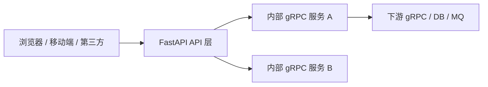

# RPC - 补充专题：FastAPI 与 gRPC：特点、原理、边界与选型

## 学习目标（本节结束后你能做到什么）

- 理解 FastAPI 和 gRPC 为什么经常被放在一起比较，但它们并不处于同一抽象层。
- 说清 FastAPI 的核心价值不只是“写 HTTP API 很快”，而是围绕 Python Web 服务开发效率做的一整套设计。
- 说清 gRPC 的核心价值不只是“比 JSON 快”，而是围绕强契约、跨语言、流式通信和内部服务协作做的协议栈设计。
- 理解 FastAPI 的底层运行模型：ASGI、事件循环、依赖注入、请求校验、序列化。
- 理解 gRPC 的底层运行模型：IDL、代码生成、Protobuf、HTTP/2 Stream、Metadata、Trailer、流控。
- 面试时能回答“FastAPI 和 gRPC 怎么选”“它们是替代还是互补”这类问题，而且能答出深度。

## 内容讲解（核心概念，用类比、例子、图示说清楚）

### 1. 为什么大家会把 FastAPI 和 gRPC 放在一起比较

因为它们都会出现在“服务和服务之间怎么通信”这个话题里。

比如一个团队在做 Python 后端时，经常会面临这样的选择：

- 我是直接暴露 HTTP/JSON 接口？
- 还是给内部服务做 gRPC 接口？
- 如果我用 FastAPI，对内和对外能不能共用一套？
- 如果我用 gRPC，是不是就不需要 FastAPI 了？

但这里有一个很重要的前提：

**FastAPI 和 gRPC 不是严格同类产品。**

更准确地说：

- **FastAPI** 是一个 Python Web 框架，关注的是“如何高效地写 HTTP API 服务”
- **gRPC** 是一个 RPC 框架和通信协议栈，关注的是“如何以强契约方式做远程调用”

所以它们可以比较，但比较的不是“谁更高级”，而是：

- 它们分别在优化什么问题
- 它们各自把复杂度放在了哪里
- 它们适合站在系统的哪一层

### 2. 先说结论：它们的设计重心根本不同

如果用一句话概括：

- **FastAPI 更偏向“面向 HTTP 应用开发”的生产力框架**
- **gRPC 更偏向“面向内部服务协作”的高契约通信体系**

所以它们的默认侧重点不一样：

#### FastAPI 的默认侧重点

- 开发效率
- 接口可读性
- 自动生成文档
- 和浏览器、第三方系统、Webhook、前端、脚本工具的兼容性
- Python 生态整合

#### gRPC 的默认侧重点

- 接口契约强约束
- 高效二进制传输
- 多语言一致性
- 流式通信
- 服务到服务调用的稳定工程化

这意味着它们经常不是互斥关系，而是分工关系。

一个非常常见的架构就是：

- 对外：FastAPI 暴露 HTTP/JSON API
- 对内：服务之间用 gRPC 通信



### 3. FastAPI 到底强在哪里

很多人把 FastAPI 理解成“Flask 的更现代版本”，这个说法有一点方向，但还不够深入。

FastAPI 真正强的地方是：

#### 3.1 它把 Python 类型提示变成了运行时接口契约

比如你写：

```python
from fastapi import FastAPI
from pydantic import BaseModel

app = FastAPI()

class UserIn(BaseModel):
    name: str
    age: int

@app.post("/users")
async def create_user(user: UserIn) -> dict:
    return {"name": user.name, "age": user.age}
```

FastAPI 不只是“帮你收一个 JSON”，它会基于类型提示和数据模型做一整套事：

- 解析请求体
- 校验字段类型
- 生成错误响应
- 生成 OpenAPI Schema
- 自动产出 Swagger UI / ReDoc 文档

也就是说，FastAPI 的一个核心设计思想是：

**尽量让“Python 代码里的类型信息”直接成为 API 契约的一部分。**

这和很多传统 Web 框架形成鲜明对比。传统框架里：

- 路由是一层
- 参数校验是一层
- 文档是一层
- 序列化又是一层

而 FastAPI 把这些层尽量压缩到同一个声明式模型里。

#### 3.2 它优化的是“写 API 服务的人”的体验

FastAPI 的哲学非常偏工程生产力：

- 少写样板代码
- 尽可能自动推导
- 用声明式方式表达校验和依赖
- 让文档和代码尽量不分离

所以 FastAPI 尤其适合：

- BFF 层
- 面向前端的业务 API
- AI / 推理服务的 HTTP 接口
- 管理后台 API
- Webhook / 回调接收服务
- 数据平台、内部工具、快速迭代服务

#### 3.3 它的真正底座不是 FastAPI 本身，而是 ASGI 生态

理解 FastAPI，不能只看它的装饰器语法，还要看到它下面那层。

它的关键栈通常是：

- **Uvicorn / Hypercorn**：ASGI Server
- **Starlette**：底层 Web Toolkit / Routing / Middleware
- **FastAPI**：在 Starlette 上封装更强的参数声明、校验和文档能力
- **Pydantic**：数据模型和校验

也就是说：

**FastAPI 的“快”和“现代感”，其实很大程度建立在 ASGI + Starlette + Pydantic 这一整层基础设施之上。**

#### 3.4 把 ASGI、Starlette、Pydantic 三层真正拆开看

这一层如果不拆开，很多人会把 FastAPI 误解成“自己什么都做了”。

更准确地说，这三层各自解决的是完全不同的问题：

| 层 | 它解决什么问题 | 你可以把它理解成什么 |
| --- | --- | --- |
| ASGI | 服务器和 Python 应用之间怎么通信 | 底层协议接口 |
| Starlette | HTTP/Web 应用最基础的路由、中间件、请求响应抽象 | Web Toolkit |
| Pydantic | 数据模型、类型校验、序列化与错误表达 | 数据契约引擎 |

如果把它们连起来看，关系大概是：


这里最重要的认知是：

- **ASGI 不关心你的业务参数长什么样**
- **Starlette 不关心你的数据模型是不是 `BaseModel`**
- **Pydantic 不关心请求是不是从 HTTP、消息队列还是本地函数来的**

它们是三个边界非常清楚的层。

#### 3.5 ASGI 的本质：不是框架，而是“应用和服务器之间的标准接口”

很多人第一次看到 ASGI，会以为它是某种“异步框架”。其实不对。

ASGI 更像一个约定：

- 服务器怎么把请求事件交给应用
- 应用怎么把响应事件再发回服务器

一个最简化的 ASGI 应用大概长这样：

```python
async def app(scope, receive, send):
    assert scope["type"] == "http"
    await send(
        {
            "type": "http.response.start",
            "status": 200,
            "headers": [(b"content-type", b"text/plain")],
        }
    )
    await send(
        {
            "type": "http.response.body",
            "body": b"hello",
        }
    )
```

这里三个参数是理解 ASGI 的钥匙：

- `scope`
  这次连接或请求的静态上下文，比如：
  - 请求类型是 `http` 还是 `websocket`
  - 路径、方法、Header
  - client/server 地址
- `receive`
  一个异步函数，用来从服务器接收事件
  - HTTP 请求体分块
  - WebSocket message
  - 连接关闭事件
- `send`
  一个异步函数，用来把事件发回服务器
  - 响应头
  - 响应体
  - WebSocket send

所以 ASGI 的世界观不是“一次函数调用 -> 一次完整响应”，而是：

**应用和服务器之间围绕事件流协作。**

这也是它比 WSGI 更适合现代场景的根本原因。

#### 3.6 为什么 ASGI 比 WSGI 更适合现代 Python 服务

WSGI 的模型更接近：

- 来一个请求
- 同步处理
- 一次性返回响应

这在传统 Django / Flask 时代完全够用，但它天然不擅长下面这些事：

- 长连接
- WebSocket
- 流式响应
- 异步 I/O 并发

而 ASGI 从协议层就把这些能力纳进去了，所以它能自然支持：

- HTTP
- WebSocket
- Lifespan 事件（启动、关闭）

从这个角度看，ASGI 的价值不只是“让 `async def` 能跑”，而是：

**它给 Python Web 应用提供了一个更通用的异步运行时边界。**

#### 3.7 Starlette 的本质：把生硬的 ASGI 事件接口变成可写应用

如果你只拿到裸 ASGI，其实开发体验并不好。

因为你要自己处理：

- 路由匹配
- 方法分发
- Header / Query / Body 提取
- Middleware 链
- Response 对象封装
- 异常处理

Starlette 的价值就在这里。

它站在 ASGI 之上，提供一层更像“Web 应用工具箱”的抽象。

比如：

- `Request`
- `Response`
- `Router`
- `Middleware`
- `BackgroundTask`
- `WebSocket`
- `Lifespan`

你可以把 Starlette 理解成：

**一个非常薄、非常干净，但足以搭起现代 Python Web 服务骨架的内核。**

#### 3.8 Starlette 到底在请求链路里做了什么

当一个 HTTP 请求进来时，Starlette 典型会做这些事：

1. 拿到 ASGI `scope`
2. 基于路由表匹配 `path + method`
3. 把裸 `scope/receive` 包装成 `Request` 对象
4. 让中间件链依次执行
5. 调用匹配到的 endpoint
6. 把 endpoint 返回值包装成 `Response`
7. 最后再把 `Response` 通过 ASGI `send` 发出去

所以 Starlette 做的本质工作是：

- 把底层事件协议，抬升成“路由到 endpoint 的 Web 处理流程”

可以把它想成：

- ASGI 是汇编接口
- Starlette 是很薄的一层运行库

#### 3.9 Starlette 中间件为什么重要

很多框架里中间件只是“顺手一提”，但在 Starlette/FastAPI 体系里它是非常核心的结构。

因为跨切面逻辑往往都放在这里：

- CORS
- 认证
- 请求日志
- Trace 注入
- 耗时统计
- 异常兜底
- GZip 压缩

而从实现上看，中间件本质上就是对 ASGI app 的一层层包装。

这意味着：

- 最内层是业务 app
- 外层层层包上 middleware
- 每层都能在请求进入前做事
- 也能在响应返回时做事

这和很多后端框架的过滤器链、拦截器链本质上是同一类设计。

#### 3.10 Pydantic 的本质：不是“一个校验库”，而是类型到数据契约的编译层

很多人对 Pydantic 的理解停在：

- 能定义 `BaseModel`
- 能自动校验字段

这还不够。

Pydantic 更深的一层价值是：

**它把 Python 类型声明，变成一套可执行的数据验证和序列化规则。**

例如：

```python
class UserIn(BaseModel):
    name: str
    age: int
    tags: list[str] = []
```

这不是普通类定义而已。Pydantic 会从中提炼出：

- 字段结构
- 必填/选填信息
- 默认值规则
- 类型转换规则
- 错误信息结构
- 输出序列化规则

所以 Pydantic 在系统里的角色更像：

- schema engine
- validation engine
- serialization engine

#### 3.11 Pydantic 在运行时到底做了什么

当一份输入数据过来时，Pydantic 通常会经历：

1. 读取模型定义和类型注解
2. 构建内部 schema 表达
3. 按 schema 对输入做解析与校验
4. 把通过校验的数据转成 Python 对象
5. 如果失败，返回结构化错误

例如输入：

```json
{"name": "alice", "age": "18"}
```

如果你的模型里 `age: int`，Pydantic 往往会尝试把 `"18"` 转成 `18`。

这就体现出它和静态类型系统不同的地方：

- 它不是只在编辑器里提示
- 它是在运行时真正处理不干净的数据

所以 Pydantic 非常适合边界层，因为边界层收到的数据几乎总是：

- 不可信
- 不完整
- 类型可能漂移
- 需要规范化

#### 3.12 Pydantic v2 为什么更快

如果你想再往深一点理解，可以知道一个关键背景：

Pydantic v2 底层大量依赖 `pydantic-core` 去执行高性能验证逻辑。

你不一定要记实现细节，但要知道它意味着什么：

- Pydantic 不只是“靠 Python 反射慢慢校验”
- 它已经把数据验证这件事做成了一层性能很认真的基础设施

这也是为什么 FastAPI 能把“请求校验 + 文档生成 + 模型转换”做得比较自然，同时性能还不错。

#### 3.13 FastAPI 是怎么把 Starlette 和 Pydantic 粘起来的

这一步才是 FastAPI 真正的“产品价值”。

FastAPI 做的事不是重新发明服务器，也不是重新发明路由，更不是重新发明数据模型，而是：

1. 读取 Python 函数签名
2. 判断每个参数来自哪里
   - Path
   - Query
   - Header
   - Cookie
   - Body
   - Dependency
3. 为这些参数建立校验规则
4. 在请求到来时调用 Pydantic 做解析
5. 把解析后的参数按函数签名传给 endpoint
6. 再把返回值按 `response_model` 等规则序列化出去

例如：

```python
@app.get("/users/{user_id}")
async def get_user(
    user_id: int,
    verbose: bool = False,
    token: str = Header(...),
):
    ...
```

FastAPI 会自动推断：

- `user_id` 来自 path
- `verbose` 来自 query
- `token` 来自 header

并在请求到来时自动完成：

- 提取
- 校验
- 类型转换
- 错误响应生成

所以 FastAPI 最强的地方不只是“有文档”，而是：

**它把 Starlette 的请求处理能力和 Pydantic 的数据契约能力，通过函数签名整合成了一个声明式编程模型。**

#### 3.14 一条完整链路，把三者串起来

如果你要把 `ASGI + Starlette + Pydantic` 真正讲顺，可以直接用下面这条链：

1. `Uvicorn` 接收 socket 连接，解析 HTTP 协议
2. 它把请求转换成 ASGI 事件，交给应用
3. `Starlette` 基于路由和中间件体系接管这次请求
4. `FastAPI` 读取 endpoint 签名，决定参数来源和依赖关系
5. `Pydantic` 负责把外部输入校验并转换成 Python 对象
6. 业务函数拿到已经规范化的数据开始执行
7. 返回结果再经过 Pydantic / FastAPI / Starlette 序列化为 HTTP 响应
8. 最终通过 ASGI `send` 回到服务器，发给客户端


这条链路一旦建立起来，你就不会再把 FastAPI 理解成“一个黑盒框架”，而会知道：

- 它下面的服务器边界是 ASGI
- 它下面的 Web 内核是 Starlette
- 它下面的数据契约引擎是 Pydantic

#### 3.15 为什么这三层分离非常重要

这不是“好看”的架构，而是非常实用的分层。

因为它允许你：

- 只用 Starlette，不用 FastAPI
- 只用 Pydantic 做数据校验，不碰 HTTP
- 换 ASGI Server，但应用层代码几乎不动
- 在不同项目里复用中间件、模型和运行时能力

也就是说，FastAPI 的成功并不是单点创新，而是：

**它建立在三个职责清晰、组合良好的基础层之上。**

### 4. FastAPI 的底层原理：请求是怎么被处理的

一条典型的 FastAPI 请求链路大概是这样：


拆开看：

#### 4.1 ASGI 是它的并发模型入口

ASGI 可以理解成 Python Web 世界里面向异步时代的服务接口标准。

它相对 WSGI 的核心变化在于：

- 支持异步
- 支持长连接
- 支持 WebSocket
- 更适合高并发 I/O 场景

所以 FastAPI 经常被说“性能不错”，本质上并不是因为它神奇，而是因为：

- 它运行在 ASGI 体系上
- 能配合 `async/await` 把 I/O 等待让出事件循环

#### 4.2 `async` 的价值主要体现在 I/O 密集，不在 CPU 密集

这是理解 FastAPI 的关键点。

如果你的接口主要在做：

- 数据库查询
- 调远程 HTTP 服务
- 调 Redis
- 读写对象存储

那 `async` 很有价值，因为在等待这些 I/O 时，线程可以不被白白阻塞。

但如果你的接口主要在做：

- 大模型推理前后的重 CPU 计算
- 图片处理
- 大量数据压缩/解压
- 复杂数值运算

那么单纯用了 FastAPI 的 `async` 并不会自动变快。因为 CPU-bound 场景里，瓶颈不是 I/O 等待，而是算力和 Python 运行时本身。

所以要避免一个常见误区：

**FastAPI 快，不等于你的业务逻辑快。它主要优化的是 Web 层并发处理模型，不是替你消灭 CPU 开销。**

#### 4.3 `def` 和 `async def` 在 FastAPI 里不是同一个执行语义

这点很容易被忽略。

- `async def`：会运行在事件循环语义下，适合调用异步 I/O 客户端
- `def`：通常会被放到线程池里执行，避免阻塞事件循环

这说明 FastAPI 其实在帮你做一层调度决策：

- 如果你写异步处理函数，它尽量让你走事件驱动路径
- 如果你写同步函数，它尽量避免拖死整个 event loop

#### 4.4 依赖注入是它很强但也容易被低估的能力

FastAPI 的 `Depends` 不是简单语法糖，它是在帮你把请求级别依赖结构化。

例如：

- 鉴权逻辑
- DB Session 获取
- 请求级上下文
- 限流器、审计器、租户识别

这些都可以以声明式方式挂进接口调用链。

这让 FastAPI 很适合做 API 边界层，因为边界层通常充满了：

- 校验
- 鉴权
- 参数转换
- 响应整形
- 观测埋点

### 5. FastAPI 的局限也要讲清楚

如果只讲优点，这个比较就不够诚实。

FastAPI 的常见局限包括：

#### 5.1 它优化的是 HTTP API，不是强契约跨语言 RPC

FastAPI 虽然可以生成 OpenAPI 文档，也可以通过类型提示提高约束，但它的契约通常还是偏：

- HTTP 路径
- Query / Header / Body
- JSON 结构

它不是那种天然以跨语言代码生成客户端 Stub 为中心的系统。

所以在大规模多语言服务协作里，它的契约强度通常不如 gRPC 那么“编译期友好”。

#### 5.2 JSON/HTTP 语义天生更重、更松

HTTP/JSON 的优势是通用和可读，但代价也很真实：

- 字段名重复传输
- 序列化体积更大
- 解析开销更高
- 类型精度和约束更松

所以在高频、低延迟、内部东西向调用里，FastAPI 往往不是最优通信方案。

#### 5.3 它对浏览器和人类很友好，但不一定对极致内部调用最友好

FastAPI 的强项包括：

- `curl` 一把梭
- 抓包可读
- Swagger 文档即开即用

但这些优势恰恰说明它更偏“可访问、可理解、可调试”的 API 系统，而不是“最强调二进制协议效率和 Stub 契约”的 RPC 系统。

### 6. gRPC 到底强在哪里

gRPC 的强，不应该只总结成“比 REST 快”。

它真正强在下面几个维度：

#### 6.1 它是 IDL-first 的系统

gRPC 的核心起点通常不是“先写 handler 再补文档”，而是：

1. 先定义 `.proto`
2. 生成客户端和服务端代码
3. 双方围绕同一份契约协作

例如：

```protobuf
syntax = "proto3";

service UserService {
  rpc GetUser(GetUserRequest) returns (UserResponse);
}

message GetUserRequest {
  int64 user_id = 1;
}

message UserResponse {
  int64 user_id = 1;
  string name = 2;
}
```

这个模型带来的深层价值是：

- 契约先于实现
- 客户端和服务端约束一致
- 多语言团队共享同一份协议定义
- 字段演化有更明确的规则

#### 6.2 它优化的是“服务到服务”的通信体验

gRPC 的世界观不是以浏览器为中心，而是以服务协作为中心。

所以它天然重视：

- Stub 代码生成
- Deadline / Timeout
- Metadata
- 拦截器
- 双向流
- 多语言 SDK 一致性

这说明 gRPC 的重点不在“让人类看请求更舒服”，而在“让机器之间协作更稳定、更高效、更一致”。

#### 6.3 它把 Protobuf、HTTP/2、流式通信捆成了一套体系

gRPC 不是单一协议点，而是几个关键部件的组合：

- **接口描述**：Protobuf IDL
- **消息编码**：Protobuf Binary
- **传输承载**：HTTP/2
- **调用语义**：Unary / Streaming
- **治理能力挂点**：Metadata、Interceptor、Deadline、Status

也就是说：

**gRPC 的竞争力不是某一个组件特别厉害，而是整套通信栈的协同设计非常完整。**

### 7. gRPC 的底层原理：一次调用到底发生了什么

一条典型的 gRPC Unary 调用可以拆成这样：


把它展开看：

#### 7.1 `.proto` 会生成 Stub，而 Stub 是“像本地调用”的关键

这和我们前面讲的动态代理思想是相通的，只是 gRPC 更强调代码生成。

客户端写的往往像：

```python
resp = user_stub.GetUser(GetUserRequest(user_id=123))
```

你表面看到的是方法调用，背后实际发生的是：

- 组装请求对象
- 序列化成二进制
- 走 HTTP/2 发到远端
- 收到响应后反序列化

所以 Stub 本质上仍然是在“模拟本地调用体验”。

#### 7.2 gRPC 消息不是直接裸丢给 HTTP/2 的

这点很多人只知道“gRPC 基于 HTTP/2”，但不知道中间还有一层 gRPC 自己的消息封装。

一条典型 gRPC message 在逻辑上通常包含：

- 1 byte：是否压缩
- 4 bytes：消息长度
- N bytes：Protobuf 消息体

然后这些 gRPC message 再被放进 HTTP/2 的 DATA frame 里传输。

所以准确地说：

- HTTP/2 提供的是连接、流、多路复用、流控、头部压缩这些基础能力
- gRPC 在 HTTP/2 之上，定义了自己的调用语义和消息边界

#### 7.3 HTTP/2 Stream 是 gRPC 很重要的地基

HTTP/2 的一个核心概念是：

**一个 TCP 连接上可以并行承载多个独立 Stream。**

这带来几个关键收益：

- 不需要为每个请求都新建连接
- 多个请求响应可以并发交错返回
- 更适合高并发内部调用

对 gRPC 来说，这一点尤其重要，因为微服务调用通常是：

- 高频
- 小包
- 并发高
- 链路长

如果每次都像传统 HTTP/1.1 那样更重地建立/复用请求，就没有那么自然。

#### 7.4 Metadata 和 Trailer 是 gRPC 语义里很关键的两个点

gRPC 并不只是传请求体和响应体，它还很重视元信息。

常见 Metadata 用途包括：

- 鉴权 token
- trace id
- tenant id
- 灰度标签

而 Trailer 很重要，是因为 gRPC 常把调用状态放在响应尾部，例如：

- `grpc-status`
- `grpc-message`

这和普通 REST API 只盯着 HTTP Status Code 的思维不完全一样。

#### 7.5 Deadline、Cancellation、Flow Control 是它工程成熟度的重要体现

真正成熟的 RPC 系统，重点不是“调用能成功”，而是“失败时能否优雅、受控地失败”。

gRPC 在这方面很有体系感：

- **Deadline**：这次调用最晚什么时候结束
- **Cancellation**：上游不等了，下游也该尽快停止无意义工作
- **Flow Control**：流式场景下避免一端生产过快把另一端压爆

所以 gRPC 的流式通信并不只是“能边发边收”，而是配套有背压和控制机制。

### 8. gRPC 的局限同样要正视

#### 8.1 它对浏览器和人类不够友好

你不能像调普通 HTTP API 一样，天然拿浏览器或 `curl` 就把所有事情搞定。

常见问题包括：

- 直接调试门槛更高
- 需要 `grpcurl`、生成客户端、专门 SDK
- 浏览器原生不直接支持标准 gRPC，往往需要 gRPC-Web 或网关转换

所以如果你的主要调用方是：

- 浏览器
- 第三方开发者
- 低门槛脚本调用者

那 gRPC 就不一定是最友好的边界协议。

#### 8.2 它对协议治理和发布纪律要求更高

因为 gRPC 很强调 IDL 和代码生成，所以也意味着：

- `.proto` 管理要规范
- 字段演化要守规则
- 多语言生成链路要稳定
- 版本发布流程要更严谨

换句话说，gRPC 很强，但也要求团队工程纪律更高。

#### 8.3 它不是天然适合“所有对外接口”

很多公网 API 场景更在意：

- 通用性
- SDK 门槛低
- 浏览器兼容
- 可直接抓包排查

这些点上，HTTP/JSON 往往还是更有现实优势。

### 9. 把 FastAPI 和 gRPC 真正放到同一张表里

| 维度 | FastAPI | gRPC |
| --- | --- | --- |
| 抽象层 | Python Web 框架 | RPC 框架 + 协议栈 |
| 主要优化目标 | HTTP API 开发效率 | 服务间强契约通信效率 |
| 默认接口风格 | HTTP + JSON | RPC + Protobuf |
| 契约形态 | Python 类型提示 + Pydantic + OpenAPI | `.proto` + 代码生成 |
| 调用方友好度 | 对人类、浏览器、第三方更友好 | 对服务、SDK、多语言客户端更友好 |
| 调试体验 | `curl`、浏览器、抓包都方便 | 需 `grpcurl`/SDK，二进制调试更难 |
| 流式能力 | 可做 WebSocket/SSE，但不是核心主线 | 原生支持四种 RPC 模式，流式是主能力 |
| 性能侧重点 | 足够快且开发快 | 更强调协议效率和内部调用密度 |
| 跨语言协作 | 依赖 HTTP 文档和约定 | 天然强，多语言 codegen 一致 |
| 常见位置 | 对外 API、BFF、管理后台、AI 接口 | 内部微服务、网关后端、平台基础服务 |

### 10. 它们到底是谁替代谁

最容易答错的一点是：

**FastAPI 和 gRPC 通常不是一对一替代关系。**

更常见的是三种关系：

#### 10.1 互补关系

最常见，也最推荐。

- 外部边界：FastAPI
- 内部通信：gRPC

原因是两边优化目标不同：

- 外部更需要通用性、文档、调试友好
- 内部更需要强契约、效率、流式和多语言一致性

#### 10.2 竞争关系

在某些内部纯 Python 团队里，确实会出现二选一：

- 全部都用 FastAPI + HTTP/JSON
- 或内部关键路径改成 gRPC

这时真正要看的不是“谁先进”，而是：

- 调用频率有多高
- 团队是否多语言
- 是否需要强约束 schema
- 是否需要流式能力
- 是否能接受更重的协议和代码生成链路

#### 10.3 包装关系

还有一种常见模式是：

- 外部 FastAPI 只是适配层
- 核心业务服务其实都在 gRPC 后面

FastAPI 在这里做的是：

- 鉴权
- 协议转换
- 聚合多个后端 gRPC 调用
- 返回更适合前端消费的 JSON

这在 API Gateway / BFF 场景里非常常见。

### 11. 如果从原理角度看，它们最大的差异是什么

这一点值得单独拎出来。

#### FastAPI 的核心设计逻辑

- 假设你在做 HTTP 应用
- 假设调用方更偏“人”和“通用客户端”
- 假设代码组织、参数校验、文档生成、开发效率很重要
- 所以把复杂度压到框架层和声明式开发体验里

#### gRPC 的核心设计逻辑

- 假设你在做服务到服务协作
- 假设调用方更偏“程序”和“生成代码客户端”
- 假设契约、一致性、性能和流式更重要
- 所以把复杂度压到 IDL、代码生成和协议栈里

这就是两者最深层的分野：

- FastAPI 更像“应用开发框架”
- gRPC 更像“通信系统框架”

### 12. 什么时候该选 FastAPI

更适合 FastAPI 的场景通常包括：

- 面向浏览器、前端、第三方的开放 API
- AI 推理服务、RAG 服务、文件上传下载接口
- 需要快速迭代、快速调试的业务 API
- Python 团队主导，且不需要很强的跨语言 Stub 契约
- 团队更重视交付速度和接口可观察性

### 13. 什么时候该选 gRPC

更适合 gRPC 的场景通常包括：

- 服务间调用频繁，延迟和吞吐敏感
- 多语言微服务协作
- 希望接口契约先行并自动生成客户端
- 需要双向流、长连接流式处理
- 希望和 Envoy、Service Mesh、平台治理生态更自然衔接

### 14. 一句工程化判断

如果你要一个尽量短但有深度的判断，可以这样说：

“FastAPI 优化的是 Python Web API 的开发体验，它把路由、参数解析、数据校验、依赖注入和 OpenAPI 文档整合在 ASGI 体系上，所以很适合作为对外 HTTP 边界层。gRPC 优化的是服务间强契约通信，它通过 Protobuf IDL、代码生成、HTTP/2 多路复用和流式调用语义，构建了一套更适合内部高频、多语言、低延迟协作的 RPC 栈。两者并不完全竞争，很多系统里恰恰应该是 FastAPI 对外、gRPC 对内。” 

## 小结（3-5 条关键点）

- FastAPI 和 gRPC 经常被放在一起比较，但本质上一个更偏 Web 应用框架，一个更偏 RPC 通信体系。
- FastAPI 的核心价值在 ASGI、类型声明、Pydantic 校验、依赖注入和自动文档，优化的是 HTTP API 开发效率。
- gRPC 的核心价值在 Protobuf IDL、代码生成、HTTP/2 Stream、Metadata/Trailer 和流式调用，优化的是内部服务强契约协作。
- FastAPI 更适合对外边界和快速迭代，gRPC 更适合内部服务、多语言、流式和高频调用。
- 真正成熟的架构里，它们常常不是替代关系，而是分层协作关系。

## 问题（检测你对当前章节内容是否了解）

1. 为什么说 FastAPI 和 gRPC 不处于完全同一抽象层？请分别说明它们各自优化的核心问题。
2. FastAPI 的 `async` 为什么更适合 I/O 密集场景，而不是天然解决 CPU 密集问题？
3. gRPC 为什么不只是“HTTP/2 + Protobuf”这么简单？请至少说出两个额外的调用语义或工程机制。
4. 普通对外 API 为什么很多时候更适合 FastAPI，而内部多语言微服务为什么很多时候更适合 gRPC？
5. 如果系统采用“FastAPI 对外、gRPC 对内”，中间这一层承担的职责通常是什么？
