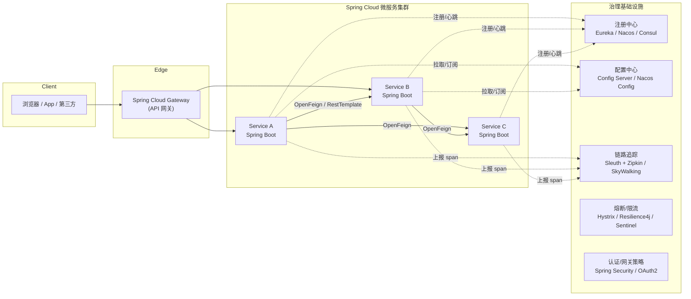

# RPC - 补充专题：Spring Cloud：从微服务体系视角理解它和 RPC 的关系

## 学习目标（本节结束后你能做到什么）

- 理解 Spring Cloud 不是一个 RPC 框架，而是一整套围绕 Spring Boot 的微服务体系标准。
- 说清 Spring Cloud 在前面学的"代理 / 注册中心 / 负载均衡 / 熔断 / 链路追踪"这套通用骨架里，各组件分别对应哪一块。
- 理解 OpenFeign 的工作原理：它本质上就是"基于 HTTP 的客户端 RPC stub 生成器"。
- 区分清楚 Spring Cloud Netflix、Spring Cloud Alibaba、Spring Cloud 官方三条主线在历史上的关系。
- 对比 Spring Cloud 和 Dubbo 的设计取舍，对比 Spring Cloud 和 Service Mesh 的演进关系。
- 面试时能回答"Spring Cloud 是不是 RPC""为什么大多数 Spring Cloud 项目用 HTTP 而不是 gRPC""Spring Cloud 和 Dubbo 怎么选"这类问题，并且能答出深度。

## 内容讲解

### 1. 为什么 Spring Cloud 不应该和 gRPC、Dubbo 放在同一格比较

很多人第一次接触 Spring Cloud，会把它和 Dubbo、gRPC 直接对位：

> "Java 里 RPC 三件套：Dubbo、gRPC、Spring Cloud。"

这句话听上去顺，但其实是一个**抽象层错位的简化**。更准确的说法是：

- **Dubbo / gRPC / Thrift** 是 RPC 框架，关心的是"一次远程调用怎么完成"。
- **Spring Cloud** 是一个微服务工程标准 + 一组规范实现，关心的是"一个由很多 Spring Boot 服务组成的系统，怎么落地"。

这两者抽象层不同。可以这样类比：

- Dubbo / gRPC 是"汽车的发动机和变速箱"。
- Spring Cloud 是"一整套整车装配工艺：座椅怎么装、空调怎么走线、车机怎么联网、保养手册怎么写"。

所以一个 Spring Cloud 项目内部的服务间通信，**真正完成 RPC 那一步的，往往是 OpenFeign / RestTemplate / WebClient / gRPC-Java**。Spring Cloud 自己并不发明 RPC，它做的是：

- 给所有这些通信方式加上"注册中心、负载均衡、熔断、配置、追踪"这一层标准包装。
- 用 Spring Boot 的"约定 + 注解 + 自动装配"风格把这些能力黏起来，让业务工程师感觉"一行注解就有了"。

也就是说：Spring Cloud 是站在第 5、6、7 课所讲的"服务发现 / 负载均衡 / 熔断 / 链路追踪"那一层做整合的，**它不是 RPC 协议层的新发明**。

### 2. 先在脑中放一张图：Spring Cloud 体系全景

下面这张图是后面所有讨论的基线，请先建立这张全景：



把这张图存在脑里，后面每讲一个组件，你就能直接定位它在这张图的哪一格。

### 3. Spring Cloud 体系的核心组件清单

如果说前面那张图是"地理位置图"，下面这张表就是"人员花名册"。

| 模块 | 关注的问题 | 常见实现 | 在通用骨架里的位置 |
| --- | --- | --- | --- |
| 服务注册与发现 | 服务实例在哪里 | Eureka、Nacos、Consul、ZooKeeper | 第 4 课的注册中心 |
| 客户端负载均衡 | 在多个实例中挑一个 | Ribbon、Spring Cloud LoadBalancer | 第 5 课的负载均衡 |
| 声明式远程调用 | 让 HTTP 调用看起来像本地方法 | OpenFeign | 第 2、3 课的 stub + 代理 |
| 熔断、降级、隔离 | 防止级联故障 | Hystrix、Resilience4j、Sentinel | 第 5、6 课的容错 |
| 配置中心 | 配置和代码解耦，动态生效 | Spring Cloud Config、Nacos Config、Apollo | 微服务治理 |
| 网关 | 入口收口、鉴权、限流、路由 | Spring Cloud Gateway、Zuul | 边界层 |
| 链路追踪 | 一次请求贯穿多个服务的可观测 | Sleuth + Zipkin、SkyWalking | 第 7 课的链路追踪 |
| 消息驱动 | 通过消息队列做异步集成 | Spring Cloud Stream | 异步通信层 |
| 分布式事务 | 跨服务一致性 | Seata（属于 Alibaba 系） | 数据一致性 |
| 安全 | 鉴权、令牌、OAuth2 | Spring Security、Spring Authorization Server | 安全层 |

学 Spring Cloud 的"路标"就是这张表：**每讲一个名词，先问自己它属于哪一格**。

### 4. 三条主线：Netflix、Alibaba、官方原生，是怎么演化过来的

Spring Cloud 让初学者最容易迷失的，是它的"实现可选项"。同一个能力你能看到三套甚至四套名字。原因是 Spring Cloud 从一开始就是**规范优先、实现可换**的项目。

历史上有三条主要的实现线：

#### 4.1 Spring Cloud Netflix（第一代主流，已逐步退场）

Netflix 在 2010s 开源了一套微服务组件，被 Spring 团队封装为 Spring Cloud Netflix：

- Eureka（注册中心）
- Ribbon（客户端负载均衡）
- Hystrix（熔断器）
- Zuul（网关）
- Feign（声明式 HTTP 客户端，被 Spring 改造成 OpenFeign）

这套组合在 2017–2019 年是事实标准，但 Netflix 自己在 2018 年宣布 Hystrix、Ribbon、Zuul 1 进入维护模式（maintenance mode），不再加新特性。Spring 官方因此把这些组件从 Spring Cloud 主版本逐步移除（多数在 Spring Cloud 2020.0 / Hoxton 之后正式退场）。

> 面试如果被问"为什么 Hystrix 不推荐了"——核心答案就两点：**Netflix 官方停止开发**，以及 **Resilience4j 设计更现代、Reactive 友好、依赖更轻**。

#### 4.2 Spring Cloud Alibaba（国内主流的事实标准）

Netflix 撤退后，国内项目大量迁到 Spring Cloud Alibaba。它在国内的市场份额非常高，组件包括：

- Nacos：注册中心 + 配置中心二合一
- Sentinel：流量控制 / 熔断 / 系统保护
- Seata：分布式事务
- RocketMQ：消息中间件
- Dubbo：Alibaba 把 Dubbo 也整合进了 Spring Cloud 体系，使 Dubbo 既能独立用，也能作为 Spring Cloud 的"通信实现"使用

它的卖点：**一套生态、官方维护、对中文文档和国内云厂商支持友好**。

#### 4.3 Spring Cloud 官方原生（更轻、更"Spring 化"）

为了不被某一家厂商绑死，Spring 团队自己也维护了一套替代实现：

- Spring Cloud LoadBalancer：替代 Ribbon
- Spring Cloud Gateway：替代 Zuul（Reactive、基于 Netty）
- Spring Cloud Config：配置中心
- Resilience4j 整合：替代 Hystrix（虽然 Resilience4j 不是 Spring 项目，但官方把它列为推荐熔断方案）
- Micrometer Tracing：替代 Sleuth（在 Spring Boot 3 / Spring Cloud 2022 之后接管追踪上下文传播）

#### 4.4 三条线放在一张对照表里

| 能力 | Netflix 系（旧） | 官方原生 | Alibaba 系 |
| --- | --- | --- | --- |
| 注册中心 | Eureka | —（无官方注册中心实现） | Nacos |
| 配置中心 | —（Archaius 已弃） | Spring Cloud Config | Nacos Config |
| 客户端负载均衡 | Ribbon | Spring Cloud LoadBalancer | LoadBalancer + Nacos |
| 熔断 | Hystrix | Resilience4j | Sentinel |
| 网关 | Zuul | Spring Cloud Gateway | Spring Cloud Gateway + Sentinel |
| 声明式调用 | Feign | OpenFeign | OpenFeign / Dubbo |
| 链路追踪 | Sleuth + Zipkin | Micrometer Tracing | SkyWalking |
| 分布式事务 | — | — | Seata |

记忆口诀：**老项目看 Netflix、新项目看官方原生、国内新项目看 Alibaba**。

### 5. OpenFeign 的工作原理：它就是"基于 HTTP 的客户端 RPC stub"

回到我们第 2、3 课讲过的核心问题：

> RPC 真正神奇的地方，是让远程调用看起来像本地方法。

Spring Cloud 体系里负责把这件事做出来的，**绝大多数情况就是 OpenFeign**。

#### 5.1 一个最常见的写法

```java
@FeignClient(name = "user-service")
public interface UserClient {

    @GetMapping("/users/{id}")
    UserDTO getUser(@PathVariable("id") long id);

    @PostMapping("/users")
    UserDTO createUser(@RequestBody CreateUserRequest req);
}
```

调用方代码：

```java
@RestController
public class OrderController {

    private final UserClient userClient;

    @GetMapping("/orders/{id}")
    public OrderView getOrder(@PathVariable long id) {
        UserDTO user = userClient.getUser(id);   // 看起来就是本地方法调用
        return new OrderView(id, user);
    }
}
```

注意：`UserClient` 是一个**接口**，没有任何实现类。Spring Cloud 通过自动装配，在容器启动时，给这个接口生成一个动态代理对象注入。

这一步，**和我们在第 2、3 课讲的"动态代理"是同一件事**。区别只是：

- Dubbo 的代理调用的是 Dubbo 协议（默认 TCP 二进制）。
- gRPC 的 stub 调用的是 HTTP/2 + Protobuf。
- **OpenFeign 的代理调用的是 HTTP/1.1 + JSON。**

所以你完全可以把 OpenFeign 理解成"**基于 HTTP 的 RPC stub 生成器**"。

#### 5.2 从源码视角看一次 Feign 调用发生了什么

把第 2 课的链路图复用过来，对照 Feign 体系：

```
[业务代码] userClient.getUser(123)
      │
      ▼
[Feign 动态代理]
   ① 解析方法注解 @GetMapping("/users/{id}")
   ② 通过 ParamProcessor 把方法参数填进 URL 模板 / Header / Body
   ③ 构造 RequestTemplate
      │
      ▼
[名字解析 / 负载均衡]
   ④ 服务名 "user-service" 交给 LoadBalancer
   ⑤ LoadBalancer 从注册中心拿到实例列表，挑一个 host:port
      │
      ▼
[HTTP Client]
   ⑥ 默认是 java.net.HttpURLConnection
      可换成 OkHttp / Apache HttpClient / Reactor Netty
   ⑦ 发出真实 HTTP 请求
      │
      ▼
[服务端 Spring MVC / WebFlux]
   ⑧ 走 DispatcherServlet / HandlerMapping
   ⑨ 反序列化 JSON 成 Java 对象
   ⑩ 进入 @RestController 方法
      │
      ▼
[响应回程]
   ⑪ Jackson 把返回对象序列化成 JSON
   ⑫ Feign 端用 Decoder 反序列化回 UserDTO
   ⑬ 代理方法 return
```

把这条链路和第 2 课"RPC 调用完整流程"放在一起看，会发现：

- 第 2 课里的"自定义协议 + 二进制序列化 + 长连接复用"那一段，在 Feign 里被替换成了"标准 HTTP/1.1 + JSON"。
- 第 2 课里的"requestId 多路复用"在 HTTP/1.1 上**不存在**（HTTP/1.1 是串行的，连接池靠并发连接而不是多路复用解决吞吐）。
- 其余的"动态代理、序列化、客户端负载均衡、超时重试、熔断"这套链路是**完全同构**的。

所以从原理课视角看，Spring Cloud + OpenFeign 是 RPC 的"HTTP 实现派"。

#### 5.3 Feign 的几个关键扩展点

Feign 设计上是非常面向扩展的，常见的扩展点：

- **Encoder / Decoder**：默认是 Jackson，可以换成 GSON、Protobuf、Avro。
- **Interceptor**：常用于注入鉴权 Header、TraceID、租户 ID。
- **Retryer**：Feign 自己也有一层重试策略，可关闭并交给 Resilience4j。
- **ErrorDecoder**：把 4xx/5xx 转换成业务异常。
- **Contract**：可以把"Spring MVC 注解契约"换成"原生 Feign 注解契约"或者"JAX-RS 注解契约"。

> 面试追问"OpenFeign 和 RestTemplate 有什么不同"——核心答案：**OpenFeign 是声明式的，把 stub 自动生成出来；RestTemplate 是命令式的，你要自己写 URL 字符串拼接**。从工程角度看，OpenFeign 更接近 RPC 思想；RestTemplate 更接近"裸 HTTP 客户端"。

### 6. 客户端负载均衡：Ribbon 与 Spring Cloud LoadBalancer

#### 6.1 为什么是"客户端"负载均衡

注意区别于网关或 Nginx 这种"服务端负载均衡"。在 Spring Cloud 体系里：

- 注册中心知道 user-service 有 5 个实例。
- 调用方 OrderService 从注册中心拉取这 5 个实例的地址。
- OrderService 自己挑一个发请求。

这个"自己挑一个"的逻辑就发生在**调用方进程内部**，所以叫客户端负载均衡。它的好处：

- 少一跳，没有中心化代理瓶颈。
- 可以利用更丰富的本地信息（线程数、响应时间、权重）做选择。
- 失败重试时可以快速换实例。

代价：

- 每个语言、每个客户端都要实现一遍策略（这正是后面 Service Mesh 想解决的痛点）。

#### 6.2 Ribbon → Spring Cloud LoadBalancer 的迁移

Ribbon 自带的策略：

- RoundRobinRule（轮询）
- RandomRule
- WeightedResponseTimeRule（按响应时间权重）
- BestAvailableRule（避开断路器跳闸的实例）
- ZoneAvoidanceRule（按可用区）

Spring Cloud LoadBalancer 是官方的替代，特点：

- 默认 Reactive（基于 Reactor）。
- 接口更小，少而精。
- 默认策略：轮询 + 健康过滤；可扩展为按区域、按权重、按缓存命中等。

这里的关键点不是"哪个更强"，而是要理解：

> **客户端负载均衡的设计模型是同一个：实例列表 + 选择策略 + 健康过滤 + 与熔断器联动。**
>
> 框架换了，模型没变。

### 7. 注册中心：Eureka 与 Nacos 的取舍

第 4 课已经讲过注册中心的通用模型（注册、发现、心跳、推送、CAP）。这里只补充 Spring Cloud 体系下的具体差别。

#### 7.1 Eureka（典型 AP 设计）

- 自我保护机制：心跳大面积异常时不会立刻摘除实例（避免网络抖动把整片摘空）。
- 客户端缓存比较重，注册中心挂了还能继续用。
- 集群间通过 P2P 复制（非强一致）。
- 缺点：长时间不维护、不支持配置中心、生态相对老旧。

#### 7.2 Nacos（同时支持 AP 与 CP，且自带配置中心）

- 注册中心支持两种模式：
  - 临时实例（基于心跳）：AP，类似 Eureka。
  - 持久实例（基于 Raft）：CP，适合 DB / 中间件等长期存在的服务。
- 内置配置中心：避免另外部署 Apollo / Config Server。
- 与 Spring Cloud Alibaba 紧密集成。

> 一个高频面试问法："注册中心选 CP 还是 AP？"——回答模板：**对外暴露的业务微服务一般选 AP（可用性优先，瞬时数据不准能接受）；对底座类、强一致服务实例选 CP**。

### 8. 熔断与流控：Hystrix → Resilience4j → Sentinel

第 5 课讲过熔断器三态（关闭 / 打开 / 半开）和降级、隔离的通用模型，这里看 Spring Cloud 体系内的实现差异。

#### 8.1 Hystrix（已退场）

设计特点：

- 线程池隔离（每个依赖一个独立线程池），强隔离但开销大。
- 信号量隔离（同进程计数器），轻量但不能隔离阻塞。
- 命令模式（HystrixCommand）侵入性较强。
- 仪表盘和 Turbine 提供聚合监控。

退场原因：Netflix 自己进入维护期，不支持响应式编程模型，依赖较重。

#### 8.2 Resilience4j（Spring 官方推荐替代）

设计特点：

- 函数式 API，基于 `Supplier`、`CompletionStage`、Reactive 适配。
- 模块化：CircuitBreaker、Bulkhead、RateLimiter、Retry、TimeLimiter 各自独立，可组合。
- 不依赖线程池（信号量为主），开销低。
- 与 Micrometer、Prometheus 天然集成。

代码风格：

```java
CircuitBreaker cb = CircuitBreaker.ofDefaults("userService");
Supplier<UserDTO> decorated = CircuitBreaker
    .decorateSupplier(cb, () -> userClient.getUser(id));
UserDTO user = Try.ofSupplier(decorated)
    .recover(throwable -> fallbackUser(id))
    .get();
```

#### 8.3 Sentinel（Alibaba 系）

Sentinel 的设计哲学比 Hystrix / Resilience4j 更靠近"**流量控制**"而不是单纯"熔断"。差异：

- 不只看"失败率"，还能看 QPS、并发线程数、链路相对调用源的关系。
- 内置实时控制台，规则可在控制台改后秒级生效（推模式）。
- 提供"系统自适应保护"：基于系统负载、CPU、RT 综合决定是否限流。
- 与 Nacos、Apollo 集成做规则持久化。
- 与 Spring Cloud Gateway 集成做网关层限流。

> 一句话总结这三者关系：**Hystrix 是教材里那个经典的熔断器；Resilience4j 是函数式时代的熔断器；Sentinel 是更偏向"流控 + 系统保护"的全套规则引擎。**

### 9. 配置中心：Spring Cloud Config 与 Nacos Config

#### 9.1 为什么配置中心是必需品

微服务规模上去后，本地 `application.yml` 不够用，原因：

- 同一份配置在不同环境（dev、test、prod）必须不一样。
- 同一份配置在线上要可以**不重启**修改（开关、阈值、限流规则、灰度名单）。
- 配置变更要有**审计、回滚、灰度发布**能力。
- 多个服务共享同一份基础配置（DB 密码、中间件地址）。

这些事用 OS 环境变量 + CI 模板能凑合，但工程化上拼装得很难看。

#### 9.2 Spring Cloud Config 的模型

```
[Git Repo] <---- 读 ---- [Config Server] <----- HTTP ----- [服务 A]
                                                            [服务 B]
```

- 配置存储在 Git（或 SVN、本地文件、数据库）。
- 客户端启动时拉取，Bootstrap 阶段载入 Spring Environment。
- 动态刷新走 Spring Cloud Bus（通过消息总线广播 RefreshEvent）。

特点：**走 Pull + Webhook**，简单稳重，不天然支持秒级推送。

#### 9.3 Nacos Config 的模型

```
[Nacos Server]
   ▲  ▲  ▲
   │  │  │   长轮询 / 长连接监听
   │  │  │
[服务 A][服务 B][服务 C]
```

- 配置存在 Nacos 自带的存储（MySQL 持久化）。
- 客户端通过长轮询监听变更，秒级推送。
- 支持 namespace（环境隔离）、group（业务分组）、dataId（具体配置）。

特点：**Push（实际是长轮询）+ 多维度隔离**，更适合大规模和需要秒级生效的场景。

### 10. 网关：Zuul → Spring Cloud Gateway

#### 10.1 网关在 Spring Cloud 体系里的位置

网关是外部流量进入"微服务森林"的唯一收口，负责：

- 路由：根据 path / header / 服务名转发到下游。
- 鉴权：JWT、OAuth2、内部签名。
- 限流：与 Sentinel / Resilience4j 整合。
- 流量整形：灰度、A/B、按租户分流。
- 协议适配：HTTP → 内部 RPC（少数项目）。
- 可观测：访问日志、TraceID 注入、Metrics。

#### 10.2 Zuul 1 vs Zuul 2 vs Spring Cloud Gateway

| 维度 | Zuul 1 | Zuul 2 | Spring Cloud Gateway |
| --- | --- | --- | --- |
| I/O 模型 | 阻塞 Servlet | 异步 Netty | 异步 Netty + Reactor |
| 编程模型 | 命令式 | 异步回调 | 响应式（Mono / Flux） |
| 配置 | YAML + Java | YAML + Java | YAML + RouteLocator |
| 与 Spring 生态 | 紧密 | 集成度低 | 官方推荐 |

> Spring Cloud Gateway 几乎是新项目的默认选择。它基于 Reactor，单机吞吐和延迟都好过 Zuul 1，而且配置 DSL 更"Spring 化"。

#### 10.3 Gateway 的核心三件套：Route / Predicate / Filter

```yaml
spring:
  cloud:
    gateway:
      routes:
        - id: user-route
          uri: lb://user-service
          predicates:
            - Path=/api/users/**
          filters:
            - StripPrefix=1
            - AddRequestHeader=X-Trace-Id, ${random.uuid}
            - name: RequestRateLimiter
              args:
                redis-rate-limiter.replenishRate: 100
                redis-rate-limiter.burstCapacity: 200
```

- Predicate 是"匹配条件"：path、method、header、cookie、host。
- Filter 是"动作链"：改 header、限流、鉴权、降级、写日志。
- `lb://` 前缀表示"通过负载均衡到注册中心里的服务名"，是它和注册中心衔接的关键。

### 11. 链路追踪：Sleuth → Micrometer Tracing

Sleuth 在 Spring Boot 3 / Spring Cloud 2022 后被 **Micrometer Tracing** 接管，名字变了，原理没变：

- 进入入口时生成 TraceID。
- 每经过一个服务、一次调用，生成新的 SpanID，关联 ParentSpanID。
- 通过 Header（B3 或 W3C TraceContext）传递。
- 上报到 Zipkin、SkyWalking、Tempo、Datadog 等后端。

Spring Cloud 体系做的事情主要是两件：

1. 自动埋点：MVC、WebClient、RestTemplate、OpenFeign、Kafka、Redis 等组件入口都自动织入 trace。
2. 上下文传播：把 trace 上下文塞进 MDC、HTTP Header、消息属性。

这一段几乎不会让你重写第 7 课的链路追踪部分，但要记住：**Spring Cloud 没有发明新的链路追踪协议，它只是把第 7 课讲的那套通用模型在 Spring 体系里"开箱即用"了**。

### 12. 分布式事务：Seata 与它的边界

Seata 不属于 Spring Cloud 官方，但属于 Spring Cloud Alibaba，是国内最常出现的分布式事务方案。它有四种模式：

| 模式 | 思路 | 适用 | 代价 |
| --- | --- | --- | --- |
| AT | 自动两阶段 + undo log 反向补偿 | 标准 SQL DB，业务低侵入 | 需要全局锁，热点会被串行化 |
| TCC | Try-Confirm-Cancel 三阶段，业务方自己写补偿 | 强一致 + 高定制场景 | 开发成本高、要写 Try/Confirm/Cancel 三个接口 |
| SAGA | 长事务编排 + 反向补偿 | 长流程、跨多个外部系统 | 中间状态可见，需要业务幂等 |
| XA | 数据库原生 XA 协议 | 强一致 + DB 原生支持 | 性能差、长时间持锁 |

> 必须强调一句：**RPC 课程的范畴并不强求分布式事务。** 分布式事务和 RPC 是正交问题。把 Seata 放在这里只是因为很多 Spring Cloud Alibaba 项目里会同时出现这两个名字，**不要把"Spring Cloud 自带分布式事务"当成 RPC 的一部分**。

### 13. Spring Cloud 体系下的服务通信模型选择

绝大多数 Spring Cloud 项目，**服务间用的是 HTTP/1.1 + JSON + OpenFeign**。这是非常常见但常被人忽视的事实：

- 历史原因：Spring Boot/MVC 天生 HTTP，Feign 也是 HTTP；最小阻力路径。
- 工程原因：HTTP/JSON 调试方便，日志、Postman、curl 都能用。
- 团队原因：Java 后端工程师对 HTTP 状态码、Header、Cookie 远比对 Protobuf 熟悉。
- 业务原因：很多内部 API 与对外 API 共用一份 Controller，自然就走 HTTP。

但 Spring Cloud **并不绑定 HTTP/JSON**。常见的几种替代：

1. **OpenFeign + Protobuf**：保持 HTTP 但换成更紧凑的二进制 payload。
2. **gRPC-Java + Spring Boot Starter**：在 Spring 生态里直接跑 gRPC，注册到 Nacos / Eureka 的实例可以同时暴露 HTTP 和 gRPC 端口。
3. **Dubbo + Spring Cloud Alibaba**：直接换成 Dubbo 协议（默认 TCP 二进制），整合到 Spring Cloud 体系做注册发现和治理。
4. **Spring Cloud Stream + Kafka / RocketMQ**：异步通信替代同步 RPC。

> 这里有一个非常重要的认知：**Spring Cloud 的"治理层"和"通信协议"是分开设计的。** 治理层是 Eureka/Nacos + LoadBalancer + Resilience4j + Gateway + Sleuth；通信协议层可以是 HTTP/JSON、HTTP/Protobuf、gRPC、Dubbo、消息。Spring Cloud 不规定你用哪个，它只规定你怎么"治理"它们。

### 14. Spring Cloud vs Dubbo：到底怎么选

把这两个体系并排放在一张表里：

| 维度 | Spring Cloud（OpenFeign 默认栈） | Dubbo |
| --- | --- | --- |
| 抽象定位 | 微服务体系 + 规范 + 实现可换 | RPC 框架（也有自己的生态） |
| 默认协议 | HTTP/1.1 + JSON | Dubbo 协议（TCP）/ Triple（gRPC over HTTP/2） |
| 性能 | 中（受限于 HTTP/1.1 + JSON） | 高（二进制 + 多路复用） |
| 服务治理 | 通过组件拼装（Resilience4j、Sentinel） | 内置较完整（路由、过滤器、限流） |
| 协议扩展 | 不发明协议，依赖 HTTP / gRPC | 协议本身是扩展点（Hessian / Triple） |
| 跨语言 | 强（HTTP 谁都能调） | 中（Java 优先，Triple 后跨语言有所提升） |
| 学习曲线 | 平缓（Spring 注解+约定） | 中（要理解协议、SPI） |
| 与 K8s / Mesh 关系 | 容易共存：HTTP/JSON 与 sidecar 天然契合 | 配合需要适配（Triple 后好转） |

选型建议（不是绝对，而是常见经验）：

- **团队主要是 Spring Boot、对外 API 多、需要快速迭代、调试便利优先** → Spring Cloud + OpenFeign。
- **内部高并发、强契约、性能敏感、跨语言要求高** → 单独的 gRPC，或 Dubbo Triple。
- **国内项目、需要一站式治理（注册 + 配置 + 限流 + 事务）、有阿里云使用倾向** → Spring Cloud Alibaba。
- **要长期演进到 Service Mesh、希望逐步把治理下沉到 sidecar** → Spring Cloud + HTTP，迁移最平滑。

### 15. Spring Cloud 与 Service Mesh：一对此消彼长的关系

Spring Cloud 把治理逻辑放进**业务进程内**：

- OpenFeign + LoadBalancer + Resilience4j + Sleuth，全部在调用方的 JVM 里。

这有两个明显代价：

1. 跨语言治理难：Python、Go 服务想接入同一套治理体系就要重写一遍 SDK。
2. SDK 升级即业务升级：熔断策略要改，所有服务要发版。

Service Mesh（Istio / Linkerd / Aeraki 等）的思路是把这层治理逻辑**下沉到 sidecar**：

- 每个 Pod 旁边跑一个 Envoy。
- 路由、负载均衡、熔断、限流、TLS、追踪都由 Envoy 做。
- 业务进程只做"业务"，对治理无感。

从演进视角看：

- Spring Cloud 是"**SDK 治理时代**"的代表作。
- Service Mesh 是"**基础设施治理时代**"的代表作。

但它们不是非此即彼。常见演进路径有两种：

1. **保留 Spring Cloud，逐步把"重治理"卸给 Mesh**：注册发现、TLS、灰度路由交给 Istio，应用里只保留 OpenFeign 这种"看起来像 RPC"的客户端。
2. **彻底切换到 Mesh，应用回归裸 HTTP**：OpenFeign 退化成普通 HTTP 客户端，治理完全外置。

> 面试时被问"Spring Cloud 会不会被 Service Mesh 取代"——稳健回答：**短期内不会，因为 Spring Cloud 的开发体验、生态、与 Spring Boot 的整合度依旧是 Java 微服务的强引力；中长期看，治理层下沉是清晰趋势，但应用框架还是 Spring Boot，开发者层面感觉变化不会很剧烈。**

### 16. 把 Spring Cloud 放回 RPC 学习骨架

最后我们回到本课程贯穿的那条 RPC 骨架，逐项把 Spring Cloud 放回去：

| RPC 通用骨架 | 对应的 Spring Cloud 元素 | 备注 |
| --- | --- | --- |
| 客户端 stub / 动态代理 | `@FeignClient` 接口 + Feign 代理 | 第 2、3 课 |
| 序列化 | Jackson（默认 JSON），可换 Protobuf | 第 3、4 课 |
| 协议帧 / 传输 | HTTP/1.1（默认），可走 HTTP/2 或 gRPC | 第 2 课 |
| 服务发现 | Eureka / Nacos / Consul | 第 4 课 |
| 客户端负载均衡 | Ribbon / Spring Cloud LoadBalancer | 第 5 课 |
| 重试 / 超时 | OpenFeign Retryer / Resilience4j Retry | 第 5、6 课 |
| 熔断 / 降级 / 隔离 | Hystrix → Resilience4j / Sentinel | 第 5、6 课 |
| 限流 | Sentinel / Gateway RequestRateLimiter | 第 7 课 |
| 链路追踪 | Sleuth / Micrometer Tracing | 第 7 课 |
| 配置 | Spring Cloud Config / Nacos Config | 微服务治理 |
| 网关 | Spring Cloud Gateway | 边界层 |

读完这张表你应该能形成一个非常稳的认知：

> **Spring Cloud 没有发明 RPC 的任何一块基础原理。它的全部价值在于：用 Spring 生态的"自动装配 + 注解 + 标准"，把前面 RPC 通用骨架的每一格都做了一个"开箱即用 + 可替换"的实现集合。**
>
> 这也是为什么学完 RPC 通用骨架再回过头看 Spring Cloud，所有名字都会变成你已经认识的零件的"具名实现"。

## 关键问题自测

- Spring Cloud 是 RPC 框架吗？如果不是，它是什么？为什么很多人会把它和 Dubbo、gRPC 摆在一起？
- 一个 Spring Cloud + OpenFeign 项目里，请求从 `userClient.getUser(123)` 出发到拿回响应，一共经过哪些层？哪几步对应第 2 课讲的 RPC 通用流程？
- Hystrix 为什么退场？Resilience4j 和 Sentinel 在设计哲学上有什么不同？
- Eureka 和 Nacos 一般分别选 CP 还是 AP？为什么注册中心常常偏 AP？
- Spring Cloud Netflix、官方原生、Spring Cloud Alibaba 各自适合什么场景？
- 为什么很多 Spring Cloud 项目不用 gRPC？什么情况下又会切换到 gRPC 或 Dubbo？
- 网关层（Gateway）和服务间调用（Feign）的"限流"，哪一层做更合理？为什么？
- Spring Cloud 和 Service Mesh 的关系是什么？把治理下沉到 Mesh 之后，Spring Cloud 还剩什么价值？
- 如果让你画一张图把 Spring Cloud 体系所有核心组件放在 RPC 通用骨架上，你能画出来吗？

## 延伸阅读建议

- Spring Cloud 官方文档（spring.io/projects/spring-cloud）：先看 Reference 的目录结构，理解它"规范优先"的设计。
- Spring Cloud Alibaba 官方文档：先看 Nacos / Sentinel / Seata 三件套，再回看 Dubbo 整合。
- Resilience4j 官方文档：理解函数式熔断器 API 的设计，对照 Hystrix 看为什么"线程池隔离"被弱化。
- Spring Cloud Gateway 官方文档：重点理解 Predicate / Filter / RouteLocator 三件套。
- Netflix Tech Blog 关于 Hystrix / Zuul 退役的文章：理解 SDK 治理时代为什么走向终结。
- Istio / Envoy 文档：理解治理层下沉到 sidecar 后，Spring Cloud 治理组件的对应物。
