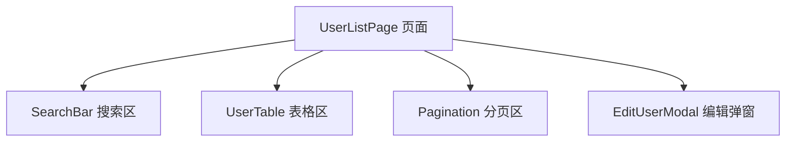

# React - 第 1 课：React 到底是什么，它在解决什么问题

## 学习目标（本节结束后你能做到什么）

- 说清楚 React 不是“一个写页面的库”这么简单，而是一套声明式 UI 编程模型。
- 理解为什么复杂页面里直接操作 DOM 会越来越难维护。
- 能用 `UI = f(state)` 解释 React 的核心思想。
- 初步理解组件、Props、State、重新渲染、提交 DOM 之间的关系。
- 能判断什么场景适合用 React，什么场景用 React 反而可能过重。

## 内容讲解（核心概念，用类比、例子、图示说清楚）

### 1. 后端工程师第一次看 React，最容易困惑在哪里

如果你从后端视角进入前端，最自然的想法通常是：

- 页面上有按钮，我给按钮绑定事件。
- 用户点了按钮，我去改某个 DOM。
- 请求接口拿到数据，我把数据拼成 HTML 塞进页面。
- 表单输入变化，我读取输入框的值再提交。

这种写法不是错。早期很多页面就是这么写出来的。问题在于，当页面状态越来越多时，你会开始遇到一种很难受的复杂度：**数据和界面经常不同步**。

想象一个后台管理列表页，它可能同时有这些状态：

- 搜索关键词
- 当前页码
- 是否正在加载
- 接口是否报错
- 当前选中的表格行
- 弹窗是否打开
- 表单是否被修改
- 保存按钮是否禁用
- 用户权限是否允许编辑

如果你用原生 DOM 或 jQuery 思路写，就要在很多地方手动维护这些细节：

- 请求开始时，显示 loading。
- 请求成功时，隐藏 loading，渲染列表，更新分页。
- 请求失败时，隐藏 loading，展示错误。
- 用户清空搜索条件时，重置页码，再重新请求。
- 选中表格行时，按钮状态要变化。
- 弹窗关闭时，表单状态要重置。

单个动作看起来都不难，但组合起来以后，真正难的是保证所有 UI 永远和当前数据一致。

这就是 React 要解决的核心问题：**不要让开发者到处手动同步 DOM，而是让开发者描述“当前状态下页面应该长什么样”。**

### 2. 命令式 DOM：你一步一步命令浏览器怎么改

先看一个很小的例子。假设页面上有一个登录按钮，点击后进入 loading，成功后展示用户名。

命令式写法大概是这样：

```js
const button = document.querySelector("#login-button");
const tip = document.querySelector("#login-tip");

button.addEventListener("click", async () => {
  button.disabled = true;
  button.textContent = "登录中...";
  tip.textContent = "";

  try {
    const user = await login();
    button.textContent = "已登录";
    tip.textContent = `欢迎你，${user.name}`;
  } catch (error) {
    button.disabled = false;
    button.textContent = "重新登录";
    tip.textContent = "登录失败，请稍后重试";
  }
});
```

这段代码的问题不在于语法，而在于职责混在一起：

- 它既关心业务状态：是否 loading、是否成功、是否失败。
- 又关心具体 DOM 操作：按钮文字是什么、是否禁用、提示文案是什么。
- 还关心异常路径：失败时要恢复哪些东西。

当交互变复杂后，你很容易漏掉某个 DOM 更新。比如失败时忘了恢复按钮，或者成功后忘了清掉错误提示。页面显示出来的东西，就可能不再代表真实业务状态。

### 3. 声明式 UI：你描述“状态对应的界面”

React 的思路是反过来的。你不要到处命令 DOM 怎么改，而是先维护状态，再根据状态描述 UI。

用 React 思路可以写成这样：

```jsx
function LoginPanel() {
  const [status, setStatus] = useState("idle");
  const [user, setUser] = useState(null);

  async function handleLogin() {
    setStatus("loading");

    try {
      const nextUser = await login();
      setUser(nextUser);
      setStatus("success");
    } catch (error) {
      setStatus("error");
    }
  }

  return (
    <section>
      <button disabled={status === "loading"} onClick={handleLogin}>
        {status === "loading" ? "登录中..." : "登录"}
      </button>

      {status === "success" && <p>欢迎你，{user.name}</p>}
      {status === "error" && <p>登录失败，请稍后重试</p>}
    </section>
  );
}
```

这里的重点不是语法，而是思路变化：

- 你不直接说“把按钮文字改成什么”。
- 你只维护 `status` 和 `user`。
- React 会根据最新状态重新计算这段 UI 应该是什么样。

这就是声明式 UI。你声明结果，而不是一步一步描述修改过程。

### 4. React 的核心公式：UI = f(state)

React 最重要的心智模型可以写成一个公式：

```text
UI = f(state)
```

意思是：**界面是状态经过组件函数计算出来的结果。**

这和后端里一些概念很像。比如你写一个接口：

```text
response = handler(request, databaseState)
```

请求进来后，后端根据请求参数和数据库状态计算响应。你不会手动“修改浏览器里的 JSON”，你是返回一个新的响应结果。

React 组件也类似：

```text
view = Component(props, state)
```

组件接收外部传入的 `props`，读取自己管理的 `state`，然后返回一段 UI 描述。状态变了，组件就重新执行，得到新的 UI 描述。React 再比较前后差异，把必要变化提交到真实 DOM。

### 图示：React 的更新链路


这条链路非常关键。后面你学 State、Effect、列表 key、性能优化，几乎都在围绕这条链路展开。

### 5. 重新渲染不是刷新页面，也不是把整个 DOM 全删了重建

很多初学者听到“状态变了组件会重新渲染”，会误以为：

- 页面会整体刷新。
- 所有 DOM 都会重新创建。
- 重新渲染一定很慢。

这些理解都不准确。

在 React 里，重新渲染首先意味着：**组件函数重新执行，重新计算 UI 描述。**

这个 UI 描述不是马上等于真实 DOM。它更像一份“页面应该长什么样”的结构化对象。React 会拿新旧两份描述做比较，然后尽量只修改真实 DOM 中必须变化的部分。

比如一个列表页里只有 loading 文案从 `加载中` 变成了 `加载完成`，React 不需要把整个页面推倒重来。它只需要提交这处文本变化。

所以你可以先建立这个直觉：

- Render 阶段：算出新的 UI 描述。
- Commit 阶段：把必要变化提交到真实 DOM。
- Browser Paint：浏览器根据 DOM 和样式完成绘制。

后面我们会专门讲渲染机制。第一章先记住：**React 让你用状态描述 UI，但它不会天真地每次重建整个页面。**

### 6. 组件是什么：前端里的模块边界

React 里最基本的组织单位是组件。

你可以把组件理解成“前端 UI 的函数模块”。它有输入，有内部状态，有输出：

```text
组件输入：props
组件内部事实：state
组件输出：UI
```

一个后台管理页可以拆成这样：



这种拆分的好处和后端模块化类似：

- 搜索区只关心搜索条件怎么输入。
- 表格区只关心数据怎么展示。
- 分页区只关心页码怎么变化。
- 弹窗只关心编辑表单怎么组织。

但 React 组件不是随便把 HTML 切成小片段。好的组件边界通常来自“状态和职责边界”。如果一个组件既管搜索、又管表格、又管弹窗、又管接口请求，后面就会越来越难维护。

### 7. Props 和 State：一个来自外部，一个属于自己

第一章先给你一个足够实用的区分：

- Props：父组件传进来的参数，组件自己不应该直接修改。
- State：组件自己持有的状态，变化后会触发重新渲染。

比如：

```jsx
function UserBadge({ user }) {
  return <span>{user.name}</span>;
}
```

这里的 `user` 是 props。`UserBadge` 只负责展示它，不负责修改它。

再看一个有内部状态的组件：

```jsx
function ToggleButton() {
  const [enabled, setEnabled] = useState(false);

  return (
    <button onClick={() => setEnabled(!enabled)}>
      {enabled ? "已开启" : "已关闭"}
    </button>
  );
}
```

这里的 `enabled` 是 state。用户点击按钮后，state 变化，组件重新渲染，按钮文案跟着变化。

这个区分后面非常重要。很多 React 代码混乱，本质上都是因为没有想清楚：这个数据到底应该由谁拥有？谁能修改？谁只负责展示？

### 8. 为什么 React 要把 HTML 写进 JavaScript

很多人第一次看到 JSX 会不舒服：为什么 HTML 和 JS 混在一起？

其实 React 不是在鼓励“乱混”。它的判断是：现代前端组件里，标记结构、交互逻辑和状态关系本来就强绑定。

比如一个按钮：

- 它显示什么文案，取决于状态。
- 它能不能点击，取决于权限和 loading。
- 它点击后做什么，取决于业务动作。
- 它出现还是隐藏，取决于当前用户角色。

如果强行把模板、逻辑、状态拆到三个文件里，看起来分离了，实际理解一个组件时反而要在多个文件之间跳来跳去。

JSX 的本质不是“在 JS 里写 HTML”，而是“用接近 HTML 的语法写 UI 描述”。它最后会被编译成 JavaScript 对象，交给 React 去计算和更新。

### 9. React 适合什么，不适合什么

React 很强，但不是所有页面都应该用 React。

适合 React 的场景：

- 后台管理系统
- 多状态表单
- 数据看板
- 搜索、筛选、分页复杂的列表页
- 需要大量组件复用的业务系统
- SPA 或需要复杂前端交互的应用

不一定适合 React 的场景：

- 只有几段静态文案的展示页
- 几乎没有交互的官网落地页
- 用服务端模板就能非常简单解决的页面
- 团队完全没有前端工程化能力，又没有复杂交互需求

判断标准很简单：如果页面复杂度主要来自“状态变化、交互组合、组件复用”，React 很合适。如果页面只是“服务端吐一段 HTML”，React 可能过重。

### 10. 用后端类比建立第一层直觉

为了让你更快建立感觉，可以先用后端经验做类比：

| React 概念 | 后端类比 | 注意边界 |
| --- | --- | --- |
| Component | 模块 / handler / view function | 组件会随状态变化反复执行 |
| Props | 调用参数 / DTO | 子组件不应该直接修改 props |
| State | 当前模块持有的内存状态 | state 变化会触发重新渲染 |
| Render | 根据输入计算输出 | render 里不应该做副作用 |
| Effect | 与外部系统同步 | 例如请求、订阅、定时器、DOM API |
| DOM Commit | 把计算结果落到真实环境 | React 控制提交时机 |

这个类比不是一一对应，但能帮你先抓住主线：React 不是让你手动维护页面细节，而是让你维护状态和组件结构。

### 11. 第一章最重要的三个反直觉点

#### 11.1 改普通变量不会自动更新页面

React 只会响应 State 变化。如果你只是改一个普通变量，React 不知道这个变化需要重新渲染。

#### 11.2 函数组件重新执行是正常现象

React 函数组件不是“只初始化一次的对象”。当状态变化时，函数组件会重新执行，重新计算 UI。不要把重新执行本身当成 bug。

#### 11.3 不要在 render 过程中做副作用

组件返回 UI 描述时，最好像纯函数一样稳定。请求接口、订阅事件、手动操作 DOM 这类和外部世界同步的行为，应该放到后面要学的 Effect 里。

## 小结（3-5 条关键点）

- React 的核心不是“更方便地写 HTML”，而是用声明式方式描述状态对应的 UI。
- 命令式 DOM 的难点在于手动同步太多 UI 细节，复杂页面很容易出现数据和界面不一致。
- React 的核心模型是 `UI = f(state)`：状态变化后，组件重新执行，计算新的 UI 描述。
- 重新渲染不等于刷新页面，也不等于重建所有 DOM；React 会比较前后差异并提交必要更新。
- 组件是 React 的模块边界，Props 是外部输入，State 是内部状态，二者职责要分清。

## 问题 （检测用户对当前章节内容是否了解）

1. 为什么复杂页面里直接操作 DOM 会越来越难维护？请用一个业务页面举例。
2. 用你自己的话解释 `UI = f(state)`，不要只翻译字面意思。
3. React 里的“重新渲染”到底重新做了什么？它和浏览器刷新页面有什么区别？
4. Props 和 State 的区别是什么？如果一个用户列表页有“当前页码”，你觉得它更像 Props 还是 State？为什么？
5. 哪些页面适合用 React？哪些页面用 React 可能反而过重？

请把你的答案直接告诉我。我会根据你的回答判断第 1 课是否掌握，再决定是进入第 2 课，还是先补一节 React 心智模型的强化讲解。
