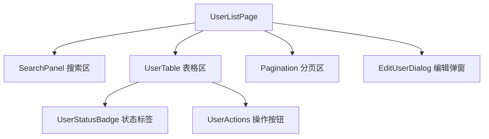
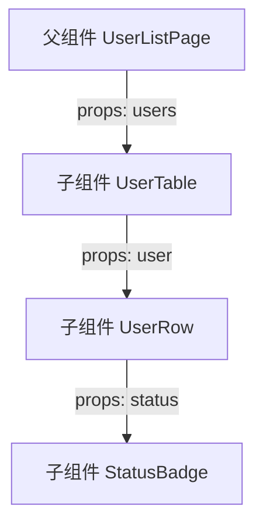
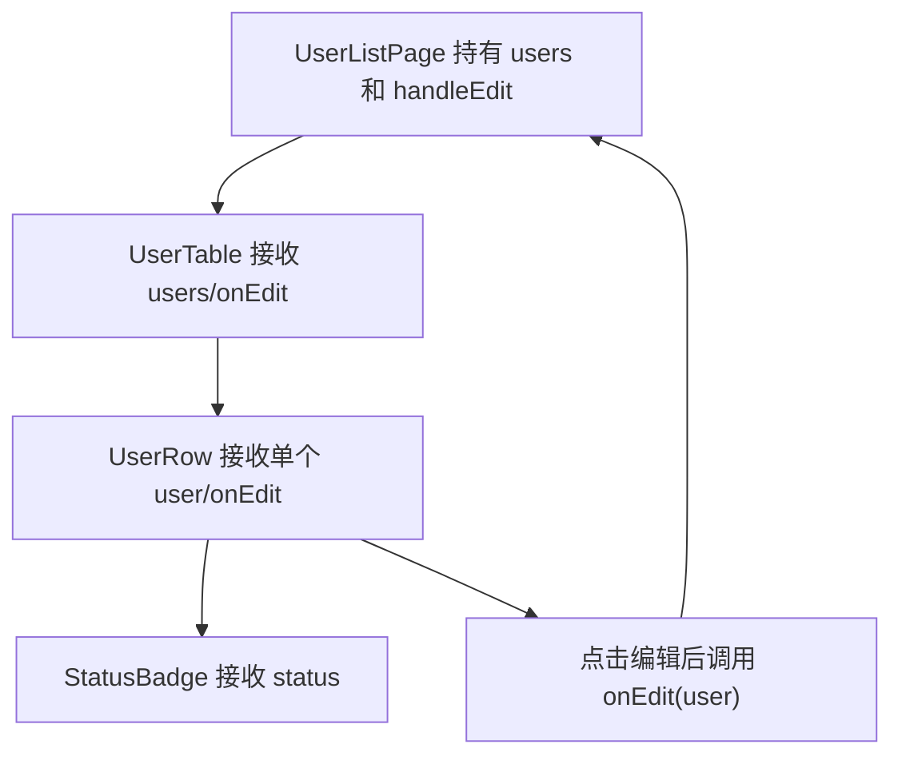

# React - 第 2 课：JSX、组件与 Props：把页面拆成可组合积木

## 学习目标（本节结束后你能做到什么）

- 理解 JSX 不是 HTML，而是 JavaScript 里的 UI 描述语法。
- 能说清楚组件为什么是 React 的核心组织单位。
- 能区分普通函数、React 函数组件和组件实例之间的关系。
- 掌握 Props 的基本使用方式，并理解 Props 是组件的外部输入。
- 能用“职责边界”和“数据流”判断一个页面应该怎么拆组件。

## 内容讲解（核心概念，用类比、例子、图示说清楚）

上一课我们建立了 React 的核心心智模型：

```text
UI = f(state)
```

也就是说，React 不是让你一步一步命令 DOM 怎么改，而是让你根据当前状态描述页面应该长什么样。

这一课我们继续往下走：这个“描述页面”的东西具体怎么写？页面又应该怎么拆？

答案就是 JSX、组件和 Props。

你可以先把三者的关系理解成：

- JSX：描述 UI 结构的语法。
- 组件：封装一块 UI 与相关逻辑的函数模块。
- Props：父组件传给子组件的输入参数。

如果说后端代码里你会用函数、类、模块来组织复杂业务，那么 React 里最基础的组织手段就是组件。JSX 是组件的返回值写法，Props 是组件之间传递信息的方式。

### 1. JSX 不是 HTML，而是 JavaScript 的语法扩展

第一次看到 JSX，很容易把它当成 HTML：

```jsx
const element = <h1>Hello React</h1>;
```

它确实长得像 HTML，但它不是 HTML。更准确地说，JSX 是一种 JavaScript 语法扩展，用来更直观地描述 UI 结构。构建工具会把 JSX 编译成普通 JavaScript。

例如这段 JSX：

```jsx
const element = <h1 className="title">Hello React</h1>;
```

可以粗略理解为会被转换成类似这样的 JavaScript 调用：

```js
const element = React.createElement(
  "h1",
  { className: "title" },
  "Hello React"
);
```

现代 React 项目里你通常不会手写 `React.createElement`，但理解这件事很重要：**JSX 最终会变成 JavaScript 对象，不是直接变成真实 DOM。**

这也解释了一个关键点：React 组件返回的不是“已经挂到浏览器上的 DOM”，而是一份 UI 描述。React 会根据这份描述去决定如何更新真实 DOM。

### 2. JSX 里的几个基本规则

JSX 很像 HTML，但有一些规则来自 JavaScript。

#### 2.1 只能返回一个根节点

错误写法：

```jsx
function UserCard() {
  return (
    <h2>张三</h2>
    <p>后端工程师</p>
  );
}
```

因为这个组件返回了两个并列节点。React 需要一个明确的返回值，所以你要包一层：

```jsx
function UserCard() {
  return (
    <div>
      <h2>张三</h2>
      <p>后端工程师</p>
    </div>
  );
}
```

如果不想额外生成真实 DOM，可以用 Fragment：

```jsx
function UserCard() {
  return (
    <>
      <h2>张三</h2>
      <p>后端工程师</p>
    </>
  );
}
```

`<>...</>` 就是 Fragment 的简写。它让组件返回一个逻辑上的根节点，但不会在真实 DOM 里多生成一层无意义的 `div`。

#### 2.2 JavaScript 表达式放在 `{}` 里

JSX 里如果要嵌入变量、计算结果、函数调用，就用花括号：

```jsx
function UserCard() {
  const name = "张三";
  const score = 92;

  return (
    <section>
      <h2>{name}</h2>
      <p>考试分数：{score}</p>
      <p>是否通过：{score >= 60 ? "通过" : "未通过"}</p>
    </section>
  );
}
```

注意，`{}` 里放的是表达式，不是语句。表达式会产生一个值，比如：

- `name`
- `score + 10`
- `score >= 60 ? "通过" : "未通过"`
- `formatDate(createdAt)`

而 `if`、`for` 这类语句不能直接塞进 JSX 的 `{}` 里。你可以先在外面算好结果，或者使用三元表达式、`map` 这些表达式写法。

#### 2.3 属性名更接近 JavaScript

因为 JSX 最终是 JavaScript，所以有些属性名不是 HTML 原名。

最常见的是：

```jsx
<div className="panel">内容</div>
<label htmlFor="email">邮箱</label>
```

在 HTML 里是 `class` 和 `for`，但在 JSX 里通常写成 `className` 和 `htmlFor`。原因是 `class` 和 `for` 在 JavaScript 里有特殊含义，React 选择使用更贴近 DOM 属性的命名。

事件也是驼峰命名：

```jsx
<button onClick={handleClick}>提交</button>
```

这里的 `onClick` 接收的是一个函数，而不是字符串。

### 3. 组件：把 UI 拆成可复用、可组合的函数

在 React 里，组件通常就是一个返回 JSX 的函数：

```jsx
function UserCard() {
  return (
    <section>
      <h2>张三</h2>
      <p>后端工程师</p>
    </section>
  );
}
```

这个函数有几个特点：

- 函数名必须大写开头，例如 `UserCard`。
- 返回值是一段 JSX。
- 可以被其他组件像标签一样使用。

比如：

```jsx
function UserListPage() {
  return (
    <main>
      <h1>用户列表</h1>
      <UserCard />
      <UserCard />
    </main>
  );
}
```

为什么组件名要大写？因为 React 需要区分两类标签：

- 小写标签：原生 DOM 标签，比如 `div`、`span`、`button`。
- 大写标签：自定义组件，比如 `UserCard`、`SearchBar`、`UserTable`。

所以 `<button />` 表示浏览器按钮，而 `<UserCard />` 表示你定义的 React 组件。

### 4. 组件不是为了“少写几行 HTML”，而是为了建立边界

很多人刚学组件时，会把组件理解成“复用 HTML 片段”。这只是很浅的一层。

组件真正重要的价值是：**它帮你给复杂页面建立职责边界。**

以一个后台用户管理页为例，页面可能长这样：



如果全部写在一个组件里，它很快会变成这样：

- 上面一段是搜索表单。
- 中间一段是表格。
- 下面一段是分页。
- 再下面是弹窗。
- 里面还有权限判断、状态标签、按钮禁用、错误提示。

最后一个文件几百行，任何小改动都可能影响别的区域。

拆成组件后，每块职责会清楚很多：

- `SearchPanel` 负责展示搜索条件和触发搜索。
- `UserTable` 负责展示用户数据。
- `UserStatusBadge` 负责把状态码翻译成可读标签。
- `UserActions` 负责根据权限展示操作按钮。
- `Pagination` 负责页码切换。
- `EditUserDialog` 负责编辑表单。

好的组件拆分，应该让你读代码时很快知道：这个组件负责什么，不负责什么。

### 5. Props：组件的外部输入

上一节的 `UserCard` 有一个明显问题：它写死了“张三”和“后端工程师”。如果要展示不同用户，就需要 Props。

Props 可以理解成父组件传给子组件的参数。

```jsx
function UserCard({ name, role }) {
  return (
    <section>
      <h2>{name}</h2>
      <p>{role}</p>
    </section>
  );
}

function UserListPage() {
  return (
    <main>
      <UserCard name="张三" role="后端工程师" />
      <UserCard name="李四" role="前端工程师" />
    </main>
  );
}
```

这里发生了两件事：

- 父组件 `UserListPage` 通过标签属性传入 `name` 和 `role`。
- 子组件 `UserCard` 通过函数参数接收这些值。

这和后端函数调用很像：

```js
UserCard({ name: "张三", role: "后端工程师" });
```

只是 React 让你用更像标签的方式写出来。

### 6. Props 是只读的：子组件不要修改父组件传来的值

Props 有一个非常重要的原则：**子组件应该把 Props 当作只读输入。**

这和后端里函数参数的设计直觉类似。一个函数接收参数后，最好不要偷偷修改调用方传进来的对象，否则调用链会变得很难推理。

在 React 里，数据流默认是从父到子：



父组件拥有数据，子组件负责展示。子组件如果想让父组件改变数据，通常不是直接修改 Props，而是调用父组件传下来的回调函数。

比如：

```jsx
function UserActions({ user, onEdit }) {
  return (
    <button onClick={() => onEdit(user)}>
      编辑
    </button>
  );
}
```

这里 `UserActions` 没有自己修改用户数据，它只是告诉父组件：“用户点击了编辑按钮，你来决定接下来怎么处理。”

这种单向数据流会让复杂页面更可控。你知道数据从哪里来，也知道修改动作会回到哪里去。

### 7. 用 Props 传什么：数据、配置、回调和 children

Props 不只能传字符串，也可以传很多类型。

#### 7.1 传数据

```jsx
<UserCard user={user} />
```

适合把一个业务对象交给子组件展示。

#### 7.2 传配置

```jsx
<Button variant="primary" disabled={loading} />
```

适合控制组件的样式、状态、尺寸或行为模式。

#### 7.3 传回调

```jsx
<SearchPanel onSearch={handleSearch} />
```

适合让子组件把用户操作通知给父组件。

#### 7.4 传 children

`children` 是 React 里一个特殊的 Props，表示组件标签中间包裹的内容。

```jsx
function Card({ title, children }) {
  return (
    <section className="card">
      <h2>{title}</h2>
      <div>{children}</div>
    </section>
  );
}

function Page() {
  return (
    <Card title="用户信息">
      <p>姓名：张三</p>
      <p>角色：后端工程师</p>
    </Card>
  );
}
```

`children` 特别适合做布局类组件，比如 `Card`、`Modal`、`PageLayout`。这类组件不关心里面具体放什么，只负责提供外壳和布局。

### 8. 组件拆分的关键：不是越小越好

组件化不是把每个标签都拆成组件。拆得太碎也会带来成本：

- 文件数量变多。
- 数据传递链路变长。
- 读代码时需要频繁跳转。
- 简单逻辑被过度抽象。

所以拆组件时不要只问“能不能拆”，更要问“拆了以后边界是否更清楚”。

一个实用判断标准是：

1. 这块 UI 是否有独立职责？
2. 这块 UI 是否会复用？
3. 这块 UI 是否已经让父组件变得太长？
4. 这块 UI 是否有独立的数据输入和事件输出？
5. 给它起一个名字是否自然？

如果一个区域很难命名，通常说明它不是一个稳定抽象。比如 `LeftTopThing`、`UserPartOne` 这种名字，往往是在强行拆。

### 9. 一个真实一点的拆分例子：用户列表页

假设我们要写一个用户列表页，页面包含：

- 搜索框
- 状态筛选
- 用户表格
- 分页
- 编辑按钮

可以先写一个页面级组件：

```jsx
function UserListPage() {
  const users = [
    { id: 1, name: "张三", role: "后端工程师", status: "active" },
    { id: 2, name: "李四", role: "前端工程师", status: "disabled" },
  ];

  function handleSearch(filters) {
    console.log("搜索条件", filters);
  }

  function handleEdit(user) {
    console.log("编辑用户", user);
  }

  return (
    <main>
      <h1>用户管理</h1>
      <SearchPanel onSearch={handleSearch} />
      <UserTable users={users} onEdit={handleEdit} />
    </main>
  );
}
```

再拆表格：

```jsx
function UserTable({ users, onEdit }) {
  return (
    <table>
      <thead>
        <tr>
          <th>姓名</th>
          <th>角色</th>
          <th>状态</th>
          <th>操作</th>
        </tr>
      </thead>
      <tbody>
        {users.map((user) => (
          <UserRow key={user.id} user={user} onEdit={onEdit} />
        ))}
      </tbody>
    </table>
  );
}
```

再拆行：

```jsx
function UserRow({ user, onEdit }) {
  return (
    <tr>
      <td>{user.name}</td>
      <td>{user.role}</td>
      <td><StatusBadge status={user.status} /></td>
      <td>
        <button onClick={() => onEdit(user)}>编辑</button>
      </td>
    </tr>
  );
}
```

再拆状态标签：

```jsx
function StatusBadge({ status }) {
  const text = status === "active" ? "启用" : "禁用";

  return <span>{text}</span>;
}
```

这套结构里，数据流是清楚的：



这就是 React 组件化的基本味道：父组件组织数据和业务动作，子组件负责展示和局部交互，事件通过回调往上通知。

### 10. 常见误区：把 Props 当全局变量用

有些代码会出现一种坏味道：父组件什么都不管，只把一堆数据一层层往下传，传到很深的子组件才真正使用。

这叫 props drilling，中文常说“props 层层透传”。

例如：

```text
Page -> Layout -> Panel -> Table -> Row -> Button
```

如果 `Button` 需要 `currentUser`，中间的 `Layout`、`Panel`、`Table`、`Row` 都只是帮忙转手，那代码就会变得啰嗦。

但注意：不是所有多层 Props 都是问题。React 默认就是单向数据流，适度传递 Props 很正常。真正的问题是中间组件完全不关心这个数据，却被迫知道它的存在。

遇到这种情况，后面可以考虑：

- 重新调整组件边界。
- 用组合方式把组件直接传进去。
- 用 Context 管理跨层共享数据。
- 在更合适的位置管理状态。

这些我们后面会专门讲。现在先记住：Props 是组件之间最基础、最优先的通信方式，不要因为怕传 Props 就过早引入全局状态。

### 11. 常见误区：组件一拆就复用

很多人拆组件时，会下意识追求复用。但在业务系统里，组件化的第一目标常常不是复用，而是可读性和可维护性。

比如 `UserTable` 可能只在用户管理页使用一次，它依然值得拆，因为它让页面级组件更清楚：

```jsx
function UserListPage() {
  return (
    <main>
      <SearchPanel />
      <UserTable />
      <Pagination />
      <EditUserDialog />
    </main>
  );
}
```

读这段代码时，你可以很快看到页面骨架。这比把所有表格行、按钮、状态判断都堆在一个组件里更容易理解。

所以组件拆分有两个价值：

- 复用：同一块 UI 多处使用。
- 分治：把复杂页面拆成更容易理解的局部。

后端开发里也是一样。你抽一个函数，不一定是因为它会被调用十次，也可能只是因为主流程太长，需要把细节藏到一个好名字后面。

### 12. 本章先形成的组件设计直觉

学完这一章，你暂时不需要追求写出最优雅的组件库，但要建立几条直觉：

1. JSX 是 UI 描述，不是真实 DOM。
2. 组件是 React 里的模块边界，不只是 HTML 片段。
3. Props 是父组件给子组件的只读输入。
4. 子组件想影响父组件，通常通过回调通知父组件。
5. 拆组件要看职责、数据输入、事件输出和命名是否自然。

这些直觉会直接影响后面学 State。因为 State 最大的问题不是“怎么写 `useState`”，而是“这个状态到底应该放在哪个组件里”。如果组件边界不清楚，State 归属也会跟着混乱。

## 小结（3-5 条关键点）

- JSX 看起来像 HTML，但本质是 JavaScript 的 UI 描述语法，最终会被编译成 JavaScript 对象。
- React 组件通常是返回 JSX 的函数，组件名要大写，用来区别自定义组件和原生 DOM 标签。
- Props 是组件的外部输入，数据默认从父组件流向子组件，子组件不应该直接修改 Props。
- 子组件如果要影响父组件，通常通过父组件传下来的回调函数通知上层处理。
- 组件拆分不是越小越好，重点是职责边界清楚、数据流清楚、命名自然。

## 问题 （检测用户对当前章节内容是否了解）

1. JSX 和 HTML 最大的区别是什么？为什么说 JSX 最终是 JavaScript？
2. 为什么 React 组件名通常必须大写开头？`<button />` 和 `<UserButton />` 在 React 看来有什么区别？
3. Props 和普通函数参数有什么相似之处？为什么说 Props 应该被当作只读输入？
4. 子组件想让父组件打开一个编辑弹窗，为什么不应该直接修改父组件状态？更常见的做法是什么？
5. 假设你要写一个“订单列表页”，包含搜索区、订单表格、分页、订单状态标签、操作按钮。你会怎么拆组件？请说明每个组件的职责。

请把你的答案直接告诉我。我会根据你的回答判断第 2 课是否掌握，再决定是进入第 3 课，还是补一节组件拆分和 Props 数据流的强化讲解。
