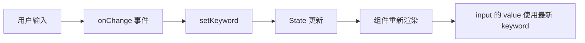
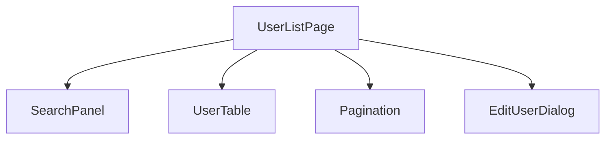
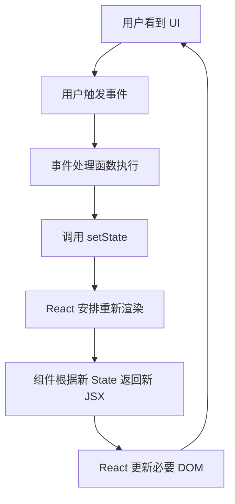

# React - 第 3 课：State、事件与受控组件：让界面真正活起来

## 学习目标（本节结束后你能做到什么）

- 理解 State 和普通变量的本质区别：State 变化会触发 React 重新渲染。
- 掌握 `useState` 的基本用法，并能解释 setter 函数为什么不是普通赋值。
- 理解 React 事件处理的写法，以及事件如何触发状态更新。
- 能正确更新对象和数组类型的 State，避免直接修改原对象。
- 理解受控组件是什么，并能用 State 管理输入框、下拉框、复选框等表单元素。
- 初步建立“状态应该放在哪里”的判断能力。

## 内容讲解（核心概念，用类比、例子、图示说清楚）

前两课我们已经建立了两个基础：

- React 的核心模型是 `UI = f(state)`。
- JSX 和组件让我们可以把页面拆成可组合的模块。

但到目前为止，页面还只是“能展示”。真正的业务页面一定会变化：

- 用户点击按钮，数量加一。
- 输入搜索词，列表重新查询。
- 勾选复选框，批量操作按钮变成可用。
- 打开编辑弹窗，表单展示当前用户信息。
- 请求接口时显示 loading，请求失败时显示错误。

这些变化背后都离不开一个东西：State。

如果 Props 是父组件传进来的外部输入，那么 State 就是组件自己持有、会影响渲染结果的内部事实。

### 1. 普通变量为什么不能让页面更新

先看一个很容易写错的例子：

```jsx
function Counter() {
  let count = 0;

  function handleClick() {
    count = count + 1;
    console.log(count);
  }

  return (
    <button onClick={handleClick}>
      当前数量：{count}
    </button>
  );
}
```

你点击按钮后，控制台里的 `count` 可能变了，但页面上的数字不会按你预期更新。

原因是：**普通变量变化，不会通知 React 重新渲染组件。**

React 不会监听你函数里的每一个局部变量。对 React 来说，组件函数执行一次后，返回了一份 UI 描述。如果你只是改了一个普通变量，React 并不知道“这个变化需要重新计算 UI”。

这和后端有点像。你在某个 handler 的局部变量里改了值，不代表客户端会自动收到新的响应。你必须真正返回新的 response，外部世界才会看到变化。

在 React 里，让 UI 重新计算的标准方式就是更新 State。

### 2. useState：给组件一份可被 React 追踪的状态

正确的计数器写法是：

```jsx
import { useState } from "react";

function Counter() {
  const [count, setCount] = useState(0);

  function handleClick() {
    setCount(count + 1);
  }

  return (
    <button onClick={handleClick}>
      当前数量：{count}
    </button>
  );
}
```

`useState(0)` 做了两件事：

- 创建一个状态值，初始值是 `0`。
- 返回一个更新这个状态的函数，也就是 `setCount`。

你可以把它理解成：

```text
const [当前状态, 更新状态的函数] = useState(初始状态);
```

当你调用 `setCount(count + 1)` 时，React 会知道：

```text
这个组件的状态变了，需要重新执行组件函数，重新计算 UI。
```

于是页面上的数字会更新。

### 图示：State 更新链路


这条链路非常关键。你以后看到页面不更新，第一反应就应该问：

- 我改的是 State，还是普通变量？
- 我有没有调用 setter？
- 我是不是直接修改了对象或数组，导致 React 没识别出变化？

### 3. State 不是变量赋值，setter 是一次“请求更新”

很多人刚学 `useState` 时，会把 `setCount` 当成普通赋值：

```jsx
setCount(count + 1);
console.log(count);
```

然后困惑：为什么 `console.log(count)` 还是旧值？

关键在于：**调用 setter 不是立刻修改当前这次渲染里的变量，而是告诉 React 下一次渲染应该使用新状态。**

在一次组件函数执行中，`count` 是这次渲染的快照。你调用 `setCount` 后，React 会安排下一次渲染。下一次组件函数重新执行时，`count` 才会变成新值。

可以这样理解：

```text
本次渲染：count = 0
点击按钮：setCount(1)
React 安排下一次渲染
下次渲染：count = 1
```

所以不要写依赖“set 后立即读到新值”的逻辑。React 的状态更新更像“提交一次变更请求”，而不是直接改当前局部变量。

### 4. 连续更新同一个 State：为什么推荐函数式更新

看这个例子：

```jsx
function Counter() {
  const [count, setCount] = useState(0);

  function handleClick() {
    setCount(count + 1);
    setCount(count + 1);
    setCount(count + 1);
  }

  return <button onClick={handleClick}>{count}</button>;
}
```

很多人会以为点一次按钮后 `count` 会加 3。但在 React 的批处理语义下，这三次更新都基于同一个渲染快照里的 `count`。如果本次 `count` 是 `0`，三次都是在提交 `1`。

如果你确实想基于上一次更新结果继续加，就应该写函数式更新：

```jsx
function handleClick() {
  setCount((prev) => prev + 1);
  setCount((prev) => prev + 1);
  setCount((prev) => prev + 1);
}
```

这里的 `prev` 表示 React 在处理这次更新时拿到的最新状态。这样点一次按钮就能稳定加 3。

一个实用规则是：

- 新状态只依赖当前渲染里已有的变量，可以直接 `setCount(count + 1)`。
- 新状态依赖上一次状态，尤其是连续更新时，优先用 `setCount(prev => ...)`。

### 5. React 事件处理：传函数，不是立刻执行函数

React 事件写法通常是：

```jsx
function SaveButton() {
  function handleSave() {
    console.log("保存");
  }

  return <button onClick={handleSave}>保存</button>;
}
```

注意这里是 `onClick={handleSave}`，不是 `onClick={handleSave()}`。

两者区别非常大：

```jsx
<button onClick={handleSave}>保存</button>
```

意思是：把 `handleSave` 这个函数交给 React，等用户点击时再调用。

```jsx
<button onClick={handleSave()}>保存</button>
```

意思是：组件渲染时立刻执行 `handleSave()`，把执行结果作为点击处理函数。这通常是错误的。

如果你需要传参数，可以包一层函数：

```jsx
function UserActions({ user, onEdit }) {
  return (
    <button onClick={() => onEdit(user)}>
      编辑
    </button>
  );
}
```

这表示：点击时执行箭头函数，然后在箭头函数里调用 `onEdit(user)`。

### 6. 事件对象：从输入框里拿到用户输入

输入框变化时，我们通常通过事件对象拿值：

```jsx
function SearchBox() {
  const [keyword, setKeyword] = useState("");

  function handleChange(event) {
    setKeyword(event.target.value);
  }

  return (
    <input
      value={keyword}
      onChange={handleChange}
      placeholder="请输入关键词"
    />
  );
}
```

这里有两条数据流：



这个输入框的值由 React State 控制，所以它叫受控组件。我们马上会展开讲。

### 7. 受控组件：表单值由 State 驱动

在普通 HTML 里，输入框自己维护当前值。你可以认为 DOM 是值的拥有者。

而在 React 受控组件里，State 是值的拥有者。输入框显示什么，取决于 State；用户输入时，通过事件把新值同步回 State。

最小例子：

```jsx
function NameInput() {
  const [name, setName] = useState("");

  return (
    <input
      value={name}
      onChange={(event) => setName(event.target.value)}
    />
  );
}
```

这里的闭环是：

```text
State -> input.value -> 用户输入 -> onChange -> setState -> State
```

这看起来比原生表单啰嗦一点，但好处非常明显：React 永远知道当前输入值是什么。于是你可以很自然地做这些事：

- 实时展示输入内容。
- 根据输入内容禁用提交按钮。
- 做前端校验。
- 点击重置按钮时清空表单。
- 提交时直接读取 State，而不是手动查 DOM。

### 8. 受控组件的真实例子：搜索栏

后台列表页里最常见的需求是搜索。

```jsx
function SearchPanel({ onSearch }) {
  const [keyword, setKeyword] = useState("");
  const [status, setStatus] = useState("all");

  function handleSubmit(event) {
    event.preventDefault();
    onSearch({ keyword, status });
  }

  function handleReset() {
    setKeyword("");
    setStatus("all");
    onSearch({ keyword: "", status: "all" });
  }

  return (
    <form onSubmit={handleSubmit}>
      <input
        value={keyword}
        onChange={(event) => setKeyword(event.target.value)}
        placeholder="搜索用户名"
      />

      <select
        value={status}
        onChange={(event) => setStatus(event.target.value)}
      >
        <option value="all">全部状态</option>
        <option value="active">启用</option>
        <option value="disabled">禁用</option>
      </select>

      <button type="submit">搜索</button>
      <button type="button" onClick={handleReset}>重置</button>
    </form>
  );
}
```

这段代码里：

- `keyword` 控制输入框。
- `status` 控制下拉框。
- `handleSubmit` 把当前 State 组装成搜索条件交给父组件。
- `handleReset` 同时重置 State 和触发一次默认搜索。

这就是 React 表单的典型工作方式。表单不是提交时才去 DOM 里取值，而是在用户每次输入时就把值同步到 State。

### 9. checkbox 和多选：布尔值与数组 State

复选框常见两种情况。

第一种是单个布尔值，比如“是否只看异常数据”：

```jsx
function ErrorOnlyFilter() {
  const [errorOnly, setErrorOnly] = useState(false);

  return (
    <label>
      <input
        type="checkbox"
        checked={errorOnly}
        onChange={(event) => setErrorOnly(event.target.checked)}
      />
      只看异常数据
    </label>
  );
}
```

注意 checkbox 用的是 `checked`，不是 `value`。

第二种是多选列表，比如批量选择用户 ID：

```jsx
function UserSelector({ users }) {
  const [selectedIds, setSelectedIds] = useState([]);

  function toggleUser(userId) {
    setSelectedIds((prev) => {
      if (prev.includes(userId)) {
        return prev.filter((id) => id !== userId);
      }

      return [...prev, userId];
    });
  }

  return (
    <ul>
      {users.map((user) => (
        <li key={user.id}>
          <label>
            <input
              type="checkbox"
              checked={selectedIds.includes(user.id)}
              onChange={() => toggleUser(user.id)}
            />
            {user.name}
          </label>
        </li>
      ))}
    </ul>
  );
}
```

这里有一个很重要的点：更新数组时没有直接 `push`，而是返回新数组。

这就引出了 React State 更新里非常关键的一条原则：不要直接修改对象和数组。

### 10. 更新对象 State：不要直接改原对象

看一个编辑用户的例子：

```jsx
function UserForm() {
  const [user, setUser] = useState({
    name: "",
    email: "",
    role: "user",
  });

  function handleNameChange(event) {
    setUser({
      ...user,
      name: event.target.value,
    });
  }

  return (
    <input
      value={user.name}
      onChange={handleNameChange}
    />
  );
}
```

为什么要写：

```js
setUser({
  ...user,
  name: event.target.value,
});
```

而不是：

```js
user.name = event.target.value;
setUser(user);
```

原因是 React 判断状态是否变化时，很大程度依赖引用变化。如果你直接修改原对象，再把同一个对象传回去，React 很可能认为“引用没变”，更新行为就不可靠。更重要的是，直接修改会破坏 React 里“状态快照”的思维模型。

正确方式是：**创建一个新对象，保留旧字段，覆盖变化字段。**

如果更新依赖上一次 State，也可以写函数式更新：

```jsx
setUser((prev) => ({
  ...prev,
  name: event.target.value,
}));
```

当一个更新函数里可能连续修改多个字段，或者依赖旧值时，函数式更新通常更稳。

### 11. 更新数组 State：map、filter、展开，而不是 push、splice

数组 State 也一样，不要直接改原数组。

#### 11.1 新增一项

```jsx
setUsers((prev) => [
  ...prev,
  { id: 3, name: "王五" },
]);
```

不要这样：

```js
users.push({ id: 3, name: "王五" });
setUsers(users);
```

#### 11.2 删除一项

```jsx
setUsers((prev) => prev.filter((user) => user.id !== deletedId));
```

#### 11.3 修改一项

```jsx
setUsers((prev) =>
  prev.map((user) =>
    user.id === updatedUser.id
      ? { ...user, ...updatedUser }
      : user
  )
);
```

这三种写法背后的共同原则是：

```text
旧数组 -> 计算出新数组 -> setState(新数组)
```

不要在原数组上原地修改。

### 12. 派生状态：能算出来的，不一定要存成 State

State 很重要，但不是所有变量都应该放进 State。

假设你有购物车商品：

```jsx
const [items, setItems] = useState([
  { id: 1, name: "键盘", price: 300, quantity: 1 },
  { id: 2, name: "鼠标", price: 100, quantity: 2 },
]);
```

总价可以直接算：

```jsx
const totalPrice = items.reduce(
  (sum, item) => sum + item.price * item.quantity,
  0
);
```

不要轻易再建一个：

```jsx
const [totalPrice, setTotalPrice] = useState(0);
```

因为这样会制造两个状态源：

- `items`
- `totalPrice`

一旦你更新了商品数量，却忘了同步总价，数据就不一致了。

一个很实用的规则是：

**如果一个值可以由现有 Props 或 State 稳定计算出来，就优先在渲染过程中计算，不要额外存成 State。**

State 应该存“事实”，不要存“可以推导出来的结果”。

### 13. State 应该放在哪里：谁拥有，谁修改，谁需要

React 里最难的常常不是 `useState` 语法，而是状态归属。

比如一个用户列表页：

- 搜索条件应该放在哪里？
- 当前页码应该放在哪里？
- 编辑弹窗是否打开应该放在哪里？
- 表单字段应该放在哪里？
- 当前选中的用户应该放在哪里？

一个初步判断框架是：

1. 只有一个组件自己使用的状态，放在这个组件内部。
2. 多个兄弟组件都需要的状态，提升到它们最近的共同父组件。
3. 跨很多层都需要的状态，后面再考虑 Context 或状态管理库。
4. 可以从其他状态算出来的值，不要单独存。

举例：



如果搜索条件会影响 `UserTable` 和 `Pagination`，那搜索条件通常应该放在 `UserListPage`。`SearchPanel` 负责输入和提交，父组件负责用搜索条件请求数据。

如果编辑弹窗内部有表单草稿，而且只有弹窗自己关心这些字段，可以放在 `EditUserDialog` 内部。

如果当前选中的用户既影响表格行高亮，又影响弹窗内容，那它可能应该放在 `UserListPage`。

这就是状态提升的起点。我们后面会专门讲组件通信和状态提升。

### 14. 一个完整小例子：搜索 + 列表 + 选中状态

下面这个例子把本章几个点串起来：

```jsx
function UserListPage() {
  const [keyword, setKeyword] = useState("");
  const [selectedUserId, setSelectedUserId] = useState(null);

  const users = [
    { id: 1, name: "张三", role: "后端工程师" },
    { id: 2, name: "李四", role: "前端工程师" },
    { id: 3, name: "王五", role: "测试工程师" },
  ];

  const filteredUsers = users.filter((user) =>
    user.name.includes(keyword)
  );

  return (
    <main>
      <h1>用户列表</h1>

      <input
        value={keyword}
        onChange={(event) => setKeyword(event.target.value)}
        placeholder="按姓名搜索"
      />

      <ul>
        {filteredUsers.map((user) => (
          <li key={user.id}>
            <button onClick={() => setSelectedUserId(user.id)}>
              {user.name} - {user.role}
            </button>
          </li>
        ))}
      </ul>

      <p>
        当前选中用户 ID：
        {selectedUserId === null ? "未选择" : selectedUserId}
      </p>
    </main>
  );
}
```

这里：

- `keyword` 是 State，因为用户输入会改变它，并影响 UI。
- `selectedUserId` 是 State，因为用户点击会改变它，并影响 UI。
- `filteredUsers` 不是 State，因为它可以由 `users + keyword` 计算出来。
- 点击用户按钮时调用 `setSelectedUserId`，触发重新渲染。
- 输入框是受控组件，值由 `keyword` 驱动。

这个例子虽小，但已经包含了真实业务页面的核心模式。

### 15. 常见误区：把所有东西都放进 State

有些初学者会觉得 State 很重要，于是把所有变量都放进 State。

这会带来几个问题：

- 状态源变多，容易不同步。
- setter 到处调用，数据流难追踪。
- 简单计算也变成状态同步问题。
- 组件逻辑变得比必要情况复杂。

你可以用这个问题自查：

```text
这个值是否会随用户交互、接口响应或时间变化，并且变化后需要影响渲染？
```

如果答案是否，它大概率不需要是 State。

比如：

- 常量配置不需要 State。
- 可以由已有 State 算出来的过滤结果不一定需要 State。
- 纯展示用的格式化文本不需要 State。
- 组件内部临时计算变量不需要 State。

### 16. 常见误区：直接修改 State 后发现页面不稳定

这类 bug 在对象和数组里尤其常见。

错误直觉是：

```js
user.name = "新名字";
setUser(user);
```

或者：

```js
selectedIds.push(id);
setSelectedIds(selectedIds);
```

正确直觉是：

```text
State 是一张快照。不要在旧快照上涂改，要创建下一张快照。
```

所以对象用展开：

```jsx
setUser((prev) => ({ ...prev, name: "新名字" }));
```

数组用 `map`、`filter`、展开：

```jsx
setSelectedIds((prev) => [...prev, id]);
```

这不仅是为了让 React 更新，更是为了让代码更容易推理。你能清楚看到：旧状态是什么，新状态是什么，中间没有隐藏修改。

### 17. 本章建立的核心心智模型

到这里，我们可以把 React 交互模型串起来：



这就是 React 页面“活起来”的主循环。

以后你写一个功能，可以先不用急着想代码，而是先问：

- 页面有哪些会变化的事实？
- 哪些事实需要放进 State？
- 哪些只是派生计算？
- 用户做什么动作会改变这些 State？
- State 变化后，哪些 UI 应该随之变化？

如果这几个问题能回答清楚，代码通常不会太乱。

## 小结（3-5 条关键点）

- 普通变量变化不会触发 React 重新渲染，State 变化才会让组件重新计算 UI。
- `useState` 返回当前状态和 setter；调用 setter 更像“请求下一次渲染使用新状态”，不是直接修改当前变量。
- 当新状态依赖旧状态，尤其是连续更新时，优先使用函数式更新。
- 受控组件的值由 State 驱动，用户输入通过事件同步回 State。
- 更新对象和数组 State 时不要直接修改原值，而应该创建新对象或新数组。

## 问题 （检测用户对当前章节内容是否了解）

1. 为什么修改普通变量不会让 React 页面更新？`useState` 解决了什么问题？
2. `setCount(count + 1)` 后立刻 `console.log(count)`，为什么可能还是旧值？
3. 连续三次 `setCount(count + 1)` 和连续三次 `setCount(prev => prev + 1)` 有什么区别？
4. 什么是受控组件？为什么搜索框、编辑表单通常会写成受控组件？
5. 更新数组 State 时，为什么不推荐 `push` 后再 `setState`？请用“状态快照”解释。
6. 假设一个订单列表页有搜索关键词、当前页码、订单列表、选中的订单 ID、弹窗表单草稿。你会把这些状态分别放在哪里？为什么？

请把你的答案直接告诉我。我会根据你的回答判断第 3 课是否掌握，再决定是进入第 4 课，还是先补一节 State 归属和表单处理的强化讲解。
