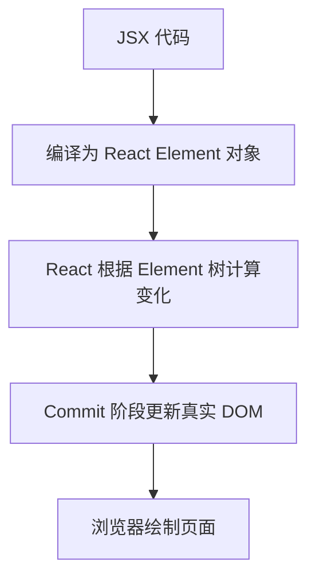
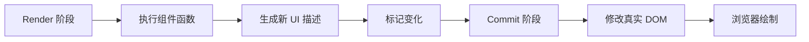
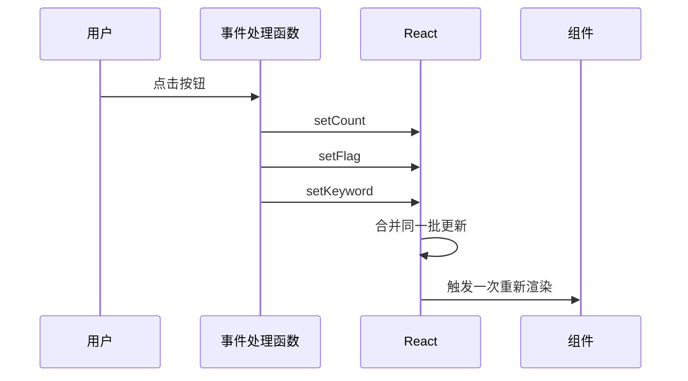

# React - 第 4 课：渲染机制：重新渲染、批处理、提交与浏览器绘制

## 学习目标（本节结束后你能做到什么）

- 区分“组件重新渲染”“真实 DOM 更新”“浏览器重新绘制”这三件事。
- 理解 React 从 State 更新到页面变化的大致链路。
- 能解释 Render 阶段和 Commit 阶段分别做什么。
- 理解为什么函数组件会反复执行，以及这不是异常。
- 初步理解 React Element、Fiber、比较差异和 key 的关系。
- 理解批处理的基本意义：多次状态更新可以合并成一次渲染。
- 能识别常见误区：重新渲染不等于一定慢，不等于整页刷新，也不等于真实 DOM 全量重建。

## 内容讲解（核心概念，用类比、例子、图示说清楚）

前面三课我们已经能写出这样的代码：

```jsx
function Counter() {
  const [count, setCount] = useState(0);

  return (
    <button onClick={() => setCount(count + 1)}>
      当前数量：{count}
    </button>
  );
}
```

你已经知道：

- `count` 是 State。
- 点击按钮会调用 `setCount`。
- State 变化后组件会重新渲染。
- 页面上的数字会更新。

但这里有一个非常关键的问题：

**“重新渲染”到底重新做了什么？**

很多 React 困惑都来自这个词。有人以为重新渲染就是刷新页面，有人以为重新渲染就是把整个 DOM 删除再创建，有人一看到子组件函数执行了就觉得性能一定出问题。

这一章的目标就是把这条链路拆开：

```text
State 更新 -> 组件重新执行 -> 生成新的 UI 描述 -> React 比较差异 -> 提交 DOM 更新 -> 浏览器绘制
```

这几步不是一回事。只要能区分它们，后面学 `useEffect`、列表 `key`、性能优化、`memo`、`useMemo`、`useCallback` 时会清楚很多。

### 1. 先建立一条完整链路

React 页面从用户操作到视觉变化，大致可以看成这条链：


这条链路里最容易混淆的是中间三段：

- Render：React 执行组件函数，计算新的 UI 描述。
- Diff：React 判断新旧 UI 描述之间哪里变了。
- Commit：React 把必要变化真正应用到 DOM。

浏览器绘制则是更后面的事。React 更新 DOM 后，浏览器还要根据 DOM、CSS、布局、图层等信息完成页面呈现。

所以以后不要笼统说“React 重新渲染页面”。更准确的表达是：

**React 先重新执行相关组件，计算新的 UI 树，再把必要的变化提交给真实 DOM，最后浏览器把变化画出来。**

### 2. 组件重新渲染：首先是函数重新执行

在函数组件里，“重新渲染”最直接的表现就是组件函数重新执行。

看这个例子：

```jsx
function UserProfile({ user }) {
  console.log("UserProfile render");

  return (
    <section>
      <h2>{user.name}</h2>
      <p>{user.role}</p>
    </section>
  );
}
```

当父组件重新渲染，或者这个组件自己的 State 更新时，`UserProfile` 函数可能会再次执行，控制台会再次打印。

这不是 bug。函数组件本来就是：

```text
输入 props/state -> 执行函数 -> 返回 JSX
```

State 变了，React 就需要重新执行函数，拿到新的 JSX。函数组件不像一个长期存在、内部字段随便变的对象。每次渲染更像一次新的函数调用。

这也是为什么上一章说：

```jsx
setCount(count + 1);
console.log(count);
```

这里的 `count` 还是当前这次渲染的快照。下一次组件函数执行时，`count` 才会变成新值。

### 3. JSX 不是 DOM，而是 React Element 描述

这一点非常重要。

当你写：

```jsx
return <button>当前数量：{count}</button>;
```

你不是直接创建了一个真实 DOM 按钮。JSX 会变成 React Element，一种描述 UI 的普通对象。

你可以粗略理解为：

```js
{
  type: "button",
  props: {
    children: ["当前数量：", count]
  }
}
```

这不是完整真实结构，但足够帮助你建立直觉：

- JSX 是描述。
- React Element 是对象。
- DOM 是浏览器里的真实节点。

React 的工作，就是根据这些描述对象，管理真实 DOM 的创建、更新和删除。

所以组件重新执行时，React 不是立刻改 DOM，而是先生成一棵新的 UI 描述树。

### 图示：JSX、Element、DOM 的关系



这就是为什么 React 能做到声明式。你只写“现在 UI 应该是什么样”，React 负责把新描述和旧描述协调到真实 DOM 上。

### 4. Render 阶段：计算新的 UI 树

Render 阶段可以理解为 React 的“计算阶段”。

它主要做几件事：

- 找到哪些组件需要更新。
- 执行这些组件函数。
- 根据组件返回的 JSX 创建新的 React Element。
- 构建或更新内部的 Fiber 树。
- 比较新旧结果，标记哪些地方需要在 Commit 阶段处理。

你可以先不用深入 Fiber 的全部细节，但要知道它大概是什么：

**Fiber 是 React 内部用来表示组件树、记录状态、更新任务和副作用标记的数据结构。**

如果 React Element 是“本次 UI 应该长什么样”的描述，那么 Fiber 更像 React 内部的工作单元和账本。它帮助 React 记录：

- 这个节点对应哪个组件或 DOM 元素。
- 它的父子兄弟关系是什么。
- 它上一次的状态是什么。
- 这次是否需要更新、插入、删除。
- 后续 Commit 阶段要执行什么操作。

用后端类比，React Element 像一份新的配置声明，Fiber 树像运行时里的调度结构和执行计划。

### 5. Commit 阶段：把必要变化应用到真实 DOM

Render 阶段算完之后，React 进入 Commit 阶段。

Commit 阶段可以理解为“落地阶段”。它会把 Render 阶段标记出来的变化真正应用到宿主环境。对于浏览器应用来说，宿主环境主要就是真实 DOM。

例如：

- 创建新的 DOM 节点。
- 删除不再需要的 DOM 节点。
- 更新文本内容。
- 更新属性，比如 `className`、`disabled`、`value`。
- 绑定或更新事件。
- 执行某些生命周期或 Effect 相关处理。

这一步是真正会影响页面的阶段。

所以 Render 阶段可以被认为是“算”，Commit 阶段是“改”。



这也解释了一个重要原则：

**Render 阶段应该尽量保持纯净，不要在组件函数主体里做副作用。**

因为 Render 阶段是计算 UI 的过程。React 可能因为开发模式检查、并发调度或中断重试等原因，多次执行某些渲染计算。如果你在函数主体里发请求、写日志入库、手动改 DOM，就会让行为变得不可预测。

后面第 5 课讲 `useEffect` 时，我们会专门讲副作用应该放在哪里。

### 6. 重新渲染不等于真实 DOM 一定更新

这是一个很重要的反直觉点。

组件函数重新执行了，不代表真实 DOM 一定发生变化。

看例子：

```jsx
function App() {
  const [count, setCount] = useState(0);
  const [name, setName] = useState("张三");

  return (
    <main>
      <button onClick={() => setCount(count + 1)}>
        count: {count}
      </button>
      <UserName name={name} />
    </main>
  );
}

function UserName({ name }) {
  console.log("UserName render");
  return <p>{name}</p>;
}
```

当你点击按钮更新 `count` 时，父组件 `App` 重新渲染，`UserName` 也可能跟着重新执行。但如果 `name` 没变，`UserName` 最终返回的 `<p>张三</p>` 和上一次一样，那么真实 DOM 里这段文本不需要变化。

所以你要区分两层：

- 组件函数执行了：React 重新计算了这个组件的 UI 描述。
- DOM 更新了：React 发现真实 DOM 需要改，并在 Commit 阶段改了它。

组件重新执行有成本，但通常比真实 DOM 大量变更要轻。性能优化时，不能只看到 `console.log("render")` 就慌，而要看这次重新渲染是否真的造成了明显性能问题。

### 7. 为什么父组件渲染，子组件常常也会渲染

React 默认策略比较直接：父组件重新渲染时，它返回的 JSX 里包含的子组件也会重新参与计算。

例如：

```jsx
function Parent() {
  const [count, setCount] = useState(0);

  return (
    <section>
      <button onClick={() => setCount(count + 1)}>加一</button>
      <Child />
    </section>
  );
}

function Child() {
  console.log("Child render");
  return <p>我是子组件</p>;
}
```

点击按钮时，`Parent` 重新执行。`Parent` 返回的 JSX 里有 `<Child />`，所以 `Child` 也会执行。

这不是 React “傻”，而是它需要重新计算这棵子树，确认输出是否变化。

如果子组件很轻，通常不需要优化。如果子组件很重，或者列表很大，后面可以用组件边界、状态下放、`memo` 等方式优化。但在学习初期，最重要的是先理解默认行为：

**父组件状态变化，会让父组件重新渲染；父组件重新渲染时，默认会递归计算子组件。**

### 8. 批处理：多次状态更新合并成一次渲染

上一章我们提过连续更新：

```jsx
function handleClick() {
  setCount((prev) => prev + 1);
  setFlag(true);
  setKeyword("");
}
```

如果每调用一次 setter 都立刻渲染一次，性能会很差。React 会把同一个事件处理过程里的多次状态更新合并处理，最终只触发一次重新渲染。这就是批处理。

可以粗略理解为：

```text
事件处理开始
  setCount
  setFlag
  setKeyword
事件处理结束
React 统一处理这批更新
组件重新渲染一次
```

这有点像数据库事务或消息批量提交：不是每来一条变化都立刻刷盘，而是在合适的边界合并处理，减少重复工作。

批处理带来的直接影响是：

- 多次 setter 不一定对应多次渲染。
- setter 后当前渲染里的变量不会立刻变。
- 如果更新依赖旧值，函数式更新更安全。

### 图示：批处理



你现在不需要记所有批处理边界，只要先记住它的核心目的：减少不必要的重复渲染，同时保持状态更新语义一致。

### 9. 状态快照：每次渲染都有自己的 props 和 state

React 里一个特别重要但容易忽略的概念是“快照”。

每一次组件渲染，都会拿到那一次渲染对应的 props 和 state。事件处理函数也是在那一次渲染中创建的，所以它闭包里拿到的也是那一次的值。

看例子：

```jsx
function Counter() {
  const [count, setCount] = useState(0);

  function handleClick() {
    setTimeout(() => {
      console.log(count);
    }, 1000);
  }

  return (
    <>
      <button onClick={() => setCount(count + 1)}>加一</button>
      <button onClick={handleClick}>一秒后打印</button>
    </>
  );
}
```

如果当前 `count` 是 0，你点击“一秒后打印”，然后马上点几次“加一”。一秒后打印出来的可能还是 0。因为 `handleClick` 捕获的是创建它时那次渲染里的 `count`。

这不是 React 乱了，而是 JavaScript 闭包和 React 渲染快照共同作用的结果。

你可以先记住：

**每次渲染都是一次快照，事件处理函数看到的是它所属那次渲染里的状态。**

后面讲 `useEffect` 和 Hook 心智模型时，这个概念会非常重要。

### 10. Diff：React 怎么判断哪些地方变了

React 不会每次都暴力重建整个 DOM。它会比较新旧 UI 描述，判断哪些地方需要变化。这个过程通常叫 reconciliation，也经常被简单称为 diff。

你不需要一开始就掌握完整算法，但要理解几个关键直觉。

#### 10.1 不同类型的节点，通常直接替换

如果上一次是：

```jsx
<div>Hello</div>
```

下一次变成：

```jsx
<section>Hello</section>
```

节点类型从 `div` 变成 `section`，React 通常会认为这是不同结构，需要替换。

#### 10.2 同类型节点，比较属性和子节点

如果上一次是：

```jsx
<button disabled={false}>保存</button>
```

下一次是：

```jsx
<button disabled={true}>保存中</button>
```

类型都是 `button`，React 可以复用这个 DOM 节点，只更新 `disabled` 属性和文本内容。

#### 10.3 组件类型相同，组件状态通常可以保留

如果同一个位置一直是 `<UserForm />`，React 会认为它是同一个组件，组件内部 State 可以保留。

如果从 `<UserForm />` 切换成 `<AdminForm />`，类型变了，React 会把它当成不同组件，旧组件状态会被丢弃，新组件重新挂载。

这会直接影响表单状态、输入框内容、组件内部缓存等行为。

### 11. key：列表里用来判断元素身份

上一章写列表时我们已经用了：

```jsx
{users.map((user) => (
  <UserRow key={user.id} user={user} />
))}
```

`key` 的作用不是给你在组件里读取的普通 props。它是 React 用来判断列表元素身份的标识。

为什么需要它？

假设列表原来是：

```text
A, B, C
```

现在在开头插入一个 X：

```text
X, A, B, C
```

如果没有稳定 key，React 很难判断这些节点到底是：

- 原来的 A 变成了 X，B 变成了 A，C 变成了 B，然后新增 C？
- 还是只是在开头插入了 X，A/B/C 都还是原来的 A/B/C？

稳定 key 就是在告诉 React：

```text
这个元素的业务身份是谁。
```

所以通常用数据库 ID、业务 ID，而不是数组下标或随机数。

### 12. 为什么不推荐用数组下标当 key

数组下标不是永远不能用，但在会增删、排序、筛选的列表里非常容易出问题。

假设你有三个输入框：

```text
0: 张三
1: 李四
2: 王五
```

如果用下标当 key，然后删除第一项，列表变成：

```text
0: 李四
1: 王五
```

React 可能会认为：

- key 为 0 的那个节点还在，只是内容从张三变成李四。
- key 为 1 的那个节点还在，只是内容从李四变成王五。

如果这些行里有输入框、内部 State 或动画状态，就可能出现状态错位。

而如果用稳定 ID：

```text
u1: 张三
u2: 李四
u3: 王五
```

删除 `u1` 后，React 能清楚知道 `u2` 和 `u3` 是原来的元素，只是位置变了。

这就是 key 的本质：**帮助 React 在列表变化时保持元素身份稳定。**

### 13. 浏览器绘制：React 之后还有工作

React Commit 完 DOM 更新后，浏览器还要把变化真正显示出来。

浏览器大致会经历这些步骤：

- Style：计算样式。
- Layout：计算元素大小和位置，也叫 reflow。
- Paint：把文本、颜色、边框、阴影等绘制出来。
- Composite：把不同图层合成到屏幕上。

不是每次 DOM 更新都会触发完整流程，具体取决于你改了什么。

例如：

- 改文本内容，可能影响布局和绘制。
- 改 `width`、`height`、`margin`，通常会影响布局。
- 改 `color`，可能只影响绘制。
- 改 `transform`、`opacity`，很多情况下更容易走合成层，成本相对可控。

这部分属于浏览器渲染原理，不是 React 独有。但理解它能帮你知道：React 性能问题不只在 React 内部，还可能发生在浏览器布局和绘制阶段。

### 14. React 渲染慢和浏览器绘制慢不是一回事

当页面卡顿时，可能有不同原因：

```text
React 计算慢：组件太重、列表太大、重复计算太多。
DOM 更新慢：一次提交大量节点变化。
浏览器布局慢：复杂布局、大量尺寸计算、频繁读写布局。
绘制合成慢：阴影、滤镜、大图、动画太重。
网络慢：接口响应慢，UI 等数据。
JavaScript 慢：事件处理函数里做了大量同步计算。
```

如果不区分这些层次，就容易乱优化。

比如一个表格滚动卡顿，你不能马上断定是“React 重新渲染太多”。也可能是：

- 每行 DOM 太复杂。
- CSS 阴影和固定列成本高。
- 一次渲染了 10000 行，没有虚拟列表。
- 每次鼠标移动都触发大量同步计算。
- 浏览器 Layout 太频繁。

React 性能优化的第一步不是上 `memo`，而是定位瓶颈发生在哪一层。

### 15. 开发模式下为什么有些组件像是渲染了两次

在开发环境里，如果项目启用了 `StrictMode`，你可能会看到某些组件函数执行了两次。

这通常是 React 为了帮助你发现不安全的副作用和不纯渲染逻辑。它会在开发环境做额外检查，让一些问题更早暴露。

重要的是：

- 这主要是开发环境行为。
- 不应该因为看到两次打印，就立刻认为生产环境也一样。
- 如果组件函数执行两次就造成请求重复、数据写入重复、订阅重复，说明你可能把副作用放错地方了。

这再次强调：组件函数主体应该尽量像纯函数。它负责根据 props 和 state 返回 UI，不应该在渲染过程中直接做外部副作用。

### 16. 一个例子串起完整过程

看这个例子：

```jsx
function TodoApp() {
  const [todos, setTodos] = useState([
    { id: 1, text: "学习 JSX", done: true },
    { id: 2, text: "理解 State", done: true },
    { id: 3, text: "理解渲染机制", done: false },
  ]);

  function toggleTodo(todoId) {
    setTodos((prev) =>
      prev.map((todo) =>
        todo.id === todoId
          ? { ...todo, done: !todo.done }
          : todo
      )
    );
  }

  return (
    <ul>
      {todos.map((todo) => (
        <li key={todo.id}>
          <label>
            <input
              type="checkbox"
              checked={todo.done}
              onChange={() => toggleTodo(todo.id)}
            />
            {todo.text}
          </label>
        </li>
      ))}
    </ul>
  );
}
```

当你勾选第三项时，发生的事情是：

1. 浏览器触发 checkbox 的 change 事件。
2. React 调用 `onChange` 处理函数。
3. `toggleTodo(3)` 执行。
4. `setTodos` 收到一个函数式更新。
5. React 根据旧 `todos` 计算新 `todos`。
6. `TodoApp` 重新执行。
7. `todos.map` 重新生成三行 JSX 描述。
8. React 根据 `key={todo.id}` 知道三项业务身份没变。
9. React 发现第三项的 `checked` 从 `false` 变成 `true`。
10. Commit 阶段更新对应 checkbox 的 DOM 属性。
11. 浏览器绘制勾选后的状态。

注意，这里不是整个页面刷新，也不是三行 DOM 都必须重建。React 可以根据类型和 key 复用已有节点，只提交必要变化。

### 17. 什么时候重新渲染值得关注

重新渲染本身不是坏事。React 的设计就是通过重新计算 UI 来保持界面和状态一致。

真正需要关注的是这些情况：

- 一个很大的列表频繁重新渲染。
- 子组件计算很重，比如复杂图表、大量格式化、大量排序过滤。
- 输入框每输入一个字符，整页大量组件都跟着重算。
- 父组件把新对象、新函数不断传给子组件，导致优化失效。
- 组件 render 过程中做了昂贵计算或副作用。

但在没有实际卡顿或性能证据之前，不要过早优化。过早引入 `memo`、`useMemo`、`useCallback`，可能让代码更难懂，还不一定提升性能。

一个合理顺序是：

1. 先写清楚正确的数据流。
2. 再保证组件边界合理。
3. 页面真的慢时，用工具定位瓶颈。
4. 最后再针对性优化。

### 18. 后端视角类比：React 渲染像执行计划，不像手动改库

可以用后端类比帮助理解。

命令式 DOM 像这样：

```text
手动 update button set text = ...
手动 update input set disabled = ...
手动 delete error message
手动 insert success message
```

React 更像这样：

```text
给出新的目标状态和 UI 描述
React 生成更新计划
React 只执行必要变更
```

这和数据库执行 SQL 有一点相似：你声明想要什么结果，数据库优化器决定怎么执行。虽然这个类比不完全准确，但能帮你抓住重点：React 不希望你手动操作每个 DOM 细节，而是希望你描述目标 UI。

### 19. 本章需要记住的几个判断句

遇到 React 渲染相关问题时，可以先用这些判断句自查：

- 组件函数执行了，不代表真实 DOM 一定变了。
- 真实 DOM 变了，不代表浏览器绘制成本一定高。
- State 更新通常会导致相关组件重新渲染。
- 父组件渲染时，子组件默认也会重新参与计算。
- `key` 决定列表元素身份，不是为了消除 warning 随便填。
- Render 阶段应该计算 UI，副作用应该放到合适的 Effect 或事件处理里。
- 性能优化前，先定位是 React 计算慢、DOM 更新慢、浏览器绘制慢，还是业务逻辑慢。

如果这些句子你都能解释清楚，React 渲染机制的第一层地基就稳了。

## 小结（3-5 条关键点）

- React 的更新链路可以理解为：State 更新 -> Render 计算 UI -> Diff 标记变化 -> Commit 更新 DOM -> 浏览器绘制。
- 组件重新渲染首先意味着函数组件重新执行，重新生成 UI 描述，不等于真实 DOM 全量重建。
- Render 阶段偏计算，Commit 阶段才真正修改真实 DOM；组件函数主体应尽量避免副作用。
- 批处理会把同一批状态更新合并处理，减少重复渲染；依赖旧状态时优先使用函数式更新。
- `key` 帮 React 判断列表元素身份，稳定 key 能避免列表增删排序时出现状态错位。

## 问题 （检测用户对当前章节内容是否了解）

1. “组件重新渲染”和“真实 DOM 更新”有什么区别？请用自己的话解释。
2. React 的 Render 阶段和 Commit 阶段分别做什么？为什么不建议在组件函数主体里发请求？
3. 父组件 State 变化时，为什么子组件可能也会重新执行？这是否一定代表性能问题？
4. 什么是批处理？为什么连续多次 setter 不一定导致多次渲染？
5. 列表里的 `key` 到底解决什么问题？为什么在可增删排序的列表里不推荐用数组下标当 key？
6. 如果一个页面卡顿，你会如何区分是 React 计算慢、DOM 更新慢、浏览器绘制慢，还是接口慢？

请把你的答案直接告诉我。我会根据你的回答判断第 4 课是否掌握，再决定是进入第 5 课，还是先补一节渲染机制和 key 的强化讲解。
