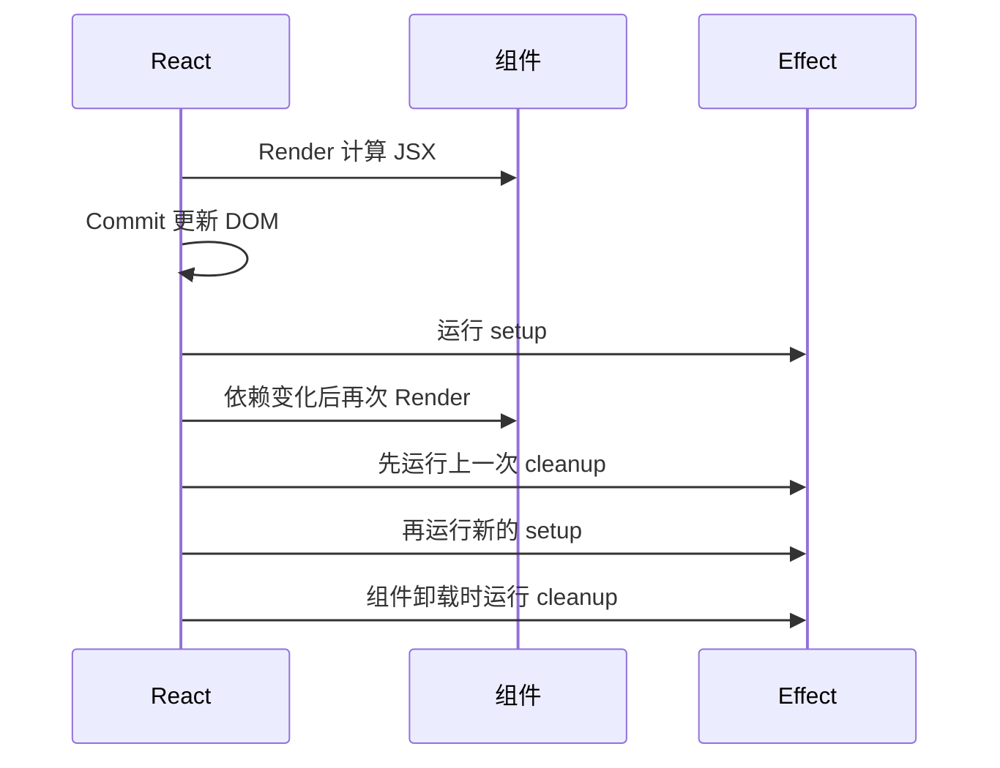
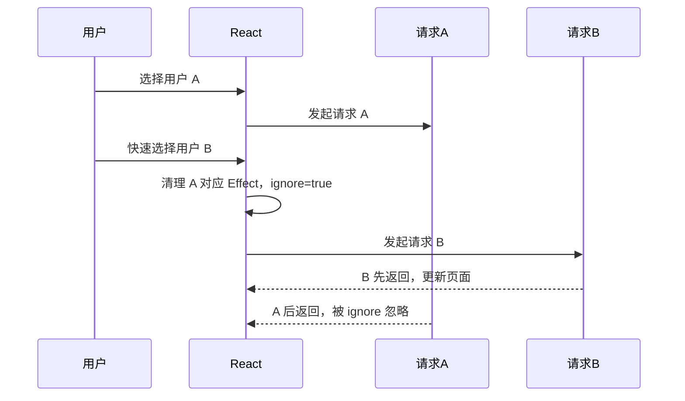

# React - 第 5 课：useEffect 到底在同步什么：副作用、依赖与清理

## 学习目标（本节结束后你能做到什么）

- 理解 `useEffect` 的核心职责：让组件和 React 外部系统保持同步。
- 区分渲染逻辑、事件逻辑和 Effect 逻辑，不再把所有代码都塞进 `useEffect`。
- 能解释依赖数组的含义，以及为什么依赖不是“想写什么就写什么”。
- 掌握清理函数的作用：取消订阅、清理定时器、断开连接、忽略过期请求。
- 能识别常见死循环、旧闭包、重复请求和竞态问题。
- 知道哪些场景其实不需要 `useEffect`，应该直接计算或放进事件处理函数。

## 内容讲解（核心概念，用类比、例子、图示说清楚）

前几课我们已经建立了 React 的主循环：

```text
用户操作 -> 事件处理 -> setState -> 组件重新渲染 -> React 提交 DOM 更新 -> 浏览器绘制
```

如果 React 只是处理组件内部状态和 UI，这条链路已经够用了。

但真实业务里，组件经常需要和 React 之外的世界打交道：

- 请求后端接口。
- 监听浏览器窗口大小。
- 设置定时器。
- 订阅 WebSocket。
- 控制第三方图表库。
- 调用视频播放器的 `play()`、`pause()`。
- 向埋点系统发送曝光日志。
- 手动操作某个 DOM API。

这些都不是纯粹的“根据 props/state 计算 JSX”。它们会触碰 React 外部系统，会产生副作用。

`useEffect` 就是用来处理这类事情的。

一句话先记住：

**`useEffect` 不是“组件加载后执行代码”的万能入口，而是“组件渲染结果需要和外部系统同步”时使用的工具。**

这个区别非常重要。很多 React 代码变乱，就是因为把 `useEffect` 当成了“只要不知道放哪，就放这里”的垃圾桶。

### 1. 什么是副作用

在编程里，一个函数如果只根据输入计算输出，不影响外部世界，我们通常说它比较“纯”。

比如：

```js
function formatUserName(user) {
  return `${user.name}（${user.role}）`;
}
```

它只做计算，不发请求、不改全局变量、不操作 DOM、不写数据库、不订阅事件。给同样的输入，通常得到同样的输出。

而下面这些都属于副作用：

```js
fetch("/api/users");
window.addEventListener("resize", handleResize);
localStorage.setItem("token", token);
document.title = "用户列表";
setInterval(tick, 1000);
analytics.track("page_view");
```

它们的共同点是：**影响了函数外部的世界，或者依赖函数外部系统的状态。**

React 组件的渲染阶段应该尽量像纯计算：

```text
props + state -> JSX
```

如果你在组件函数主体里直接发请求或绑定事件，就会让渲染过程变得不纯。组件每次重新执行都可能重复触发这些副作用，开发模式下还可能因为 Strict Mode 的检查暴露更多问题。

### 2. 三类逻辑：渲染逻辑、事件逻辑、Effect 逻辑

在 React 组件里，代码大致可以分成三类。

#### 2.1 渲染逻辑

渲染逻辑写在组件函数顶层，用来计算 JSX。

```jsx
function UserCard({ user }) {
  const displayName = `${user.name}（${user.role}）`;

  return <p>{displayName}</p>;
}
```

这类代码应该尽量纯粹：根据 props/state 计算结果，不做外部副作用。

#### 2.2 事件逻辑

事件逻辑由用户具体动作触发，比如点击、输入、提交。

```jsx
function BuyButton({ productId }) {
  async function handleBuy() {
    await fetch(`/api/products/${productId}/buy`, {
      method: "POST",
    });
  }

  return <button onClick={handleBuy}>购买</button>;
}
```

购买商品是用户点击按钮造成的，不是“组件出现在页面上”造成的。所以它应该放在事件处理函数里，而不是 `useEffect`。

#### 2.3 Effect 逻辑

Effect 逻辑不是由某个具体点击直接触发，而是由“组件已经渲染到屏幕上，并且需要和外部系统同步”触发。

比如聊天室组件出现在页面上时，需要连接对应房间；房间 ID 变化时，需要断开旧连接、连接新房间；组件离开页面时，需要断开连接。

```jsx
function ChatRoom({ roomId }) {
  useEffect(() => {
    const connection = createConnection(roomId);
    connection.connect();

    return () => {
      connection.disconnect();
    };
  }, [roomId]);

  return <section>当前房间：{roomId}</section>;
}
```

这里连接聊天室不是某个按钮点击造成的，而是组件“需要展示这个房间”这个渲染结果要求它和外部聊天服务同步。

### 3. useEffect 的基本形态

`useEffect` 的基本写法是：

```jsx
useEffect(() => {
  // setup：执行副作用

  return () => {
    // cleanup：清理副作用，可选
  };
}, [dependencies]);
```

它有三个关键部分：

- setup：Effect 要做的事情，比如订阅、连接、设置定时器、发起请求。
- cleanup：清理上一次 setup 做过的事情，比如取消订阅、断开连接、清除定时器。
- dependencies：依赖数组，告诉 React 什么时候需要重新运行这个 Effect。

可以把它理解成：

```text
当依赖对应的渲染结果生效后，执行 setup。
当依赖变化或组件卸载前，执行 cleanup。
```

### 图示：Effect 生命周期



注意顺序：Effect 通常发生在 React 把更新提交到屏幕后。它不是用来决定这次 JSX 长什么样的，而是用来让已经提交的界面和外部系统同步。

### 4. 三种依赖数组写法分别意味着什么

`useEffect` 最容易出错的地方就是依赖数组。先看三种形式。

#### 4.1 不写依赖数组：每次渲染后都运行

```jsx
useEffect(() => {
  console.log("每次渲染后运行");
});
```

这意味着组件每次渲染提交后，Effect 都会运行。

这种写法不常用，因为大多数外部同步不需要每次渲染都做。比如只是输入框每输入一个字符，整个组件重新渲染，如果你每次都重新连接 WebSocket，就很浪费。

#### 4.2 空依赖数组：组件挂载后运行，卸载时清理

```jsx
useEffect(() => {
  console.log("组件挂载后运行");

  return () => {
    console.log("组件卸载时清理");
  };
}, []);
```

空数组表示这个 Effect 不依赖组件里的响应式值。通常可以理解为：这个组件加到页面后执行一次，离开页面时清理。

但要小心，不要把 `[]` 理解成“我就想让它只执行一次，所以强行空数组”。如果 Effect 里面用了 props 或 state，依赖数组通常就不能是空。

#### 4.3 有依赖数组：依赖变化时重新运行

```jsx
useEffect(() => {
  document.title = `当前用户：${userName}`;
}, [userName]);
```

这表示：

- 组件第一次提交后运行。
- 之后只有 `userName` 相比上次变了，才重新运行。

这是最常见、最健康的写法。Effect 用到了哪些响应式值，就把这些值放进依赖数组。所谓响应式值，主要包括 props、state，以及组件函数内部定义的变量和函数。

### 5. 依赖数组不是性能开关，而是同步契约

很多人会把依赖数组当成“控制执行次数”的开关：

```jsx
useEffect(() => {
  fetchUser(userId);
}, []); // 为了只请求一次，故意不写 userId
```

这通常是危险的。

如果 `userId` 会变化，比如从用户 A 的详情页跳到用户 B 的详情页，而组件没有卸载复用同一个实例，那么这个 Effect 不会重新运行，页面可能继续展示旧用户数据。

更正确的写法是：

```jsx
useEffect(() => {
  fetchUser(userId);
}, [userId]);
```

依赖数组的真实含义是：

```text
这个 Effect 的同步逻辑依赖哪些响应式值？
这些值变了，外部系统就需要重新同步。
```

所以依赖数组不是“我希望它什么时候执行”，而是“这段 Effect 代码读取了哪些会随渲染变化的值”。

如果你为了减少执行次数而故意漏依赖，往往会制造旧闭包问题。

### 6. 旧闭包问题：Effect 看到的是某次渲染的快照

第 4 课我们讲过：每次渲染都有自己的 props 和 state 快照。Effect 也是一样。

看这个例子：

```jsx
function Timer() {
  const [count, setCount] = useState(0);

  useEffect(() => {
    const id = setInterval(() => {
      console.log(count);
    }, 1000);

    return () => clearInterval(id);
  }, []);

  return (
    <button onClick={() => setCount(count + 1)}>
      count: {count}
    </button>
  );
}
```

你可能期待定时器每秒打印最新 `count`，但它可能一直打印初始值 `0`。

原因是这个 Effect 只在第一次渲染后运行。它里面的定时器回调捕获的是第一次渲染时的 `count`。后面 `count` 更新了，Effect 没有重新运行，定时器里的闭包仍然拿着旧快照。

如果这段逻辑确实需要响应 `count` 变化，可以把 `count` 加入依赖：

```jsx
useEffect(() => {
  const id = setInterval(() => {
    console.log(count);
  }, 1000);

  return () => clearInterval(id);
}, [count]);
```

这样每次 `count` 变化，React 会先清理旧定时器，再创建新定时器。

但这不代表所有定时器都应该依赖 `count`。如果你只是想每秒让 `count` 自增，更好的写法是函数式更新：

```jsx
useEffect(() => {
  const id = setInterval(() => {
    setCount((prev) => prev + 1);
  }, 1000);

  return () => clearInterval(id);
}, []);
```

这里 `setCount((prev) => prev + 1)` 不需要读取外层 `count`，所以依赖数组可以是空。

### 7. 清理函数：撤销 setup 做过的事

Effect 如果做了“开始某件事”，通常就要考虑如何“停止这件事”。

常见对应关系是：

| setup | cleanup |
| --- | --- |
| `addEventListener` | `removeEventListener` |
| `setInterval` | `clearInterval` |
| `setTimeout` | `clearTimeout` |
| `connect` | `disconnect` |
| `subscribe` | `unsubscribe` |
| 发起请求 | 取消请求或忽略过期结果 |
| 启动动画 | 停止或重置动画 |

例如监听窗口大小：

```jsx
function WindowSize() {
  const [width, setWidth] = useState(window.innerWidth);

  useEffect(() => {
    function handleResize() {
      setWidth(window.innerWidth);
    }

    window.addEventListener("resize", handleResize);

    return () => {
      window.removeEventListener("resize", handleResize);
    };
  }, []);

  return <p>窗口宽度：{width}</p>;
}
```

如果不清理，组件卸载后监听器还在，后续窗口变化仍然可能调用已经不该存在的逻辑。这就是内存泄漏和异常更新的来源。

### 8. 为什么开发环境下 Effect 可能执行两次

如果项目启用了 React Strict Mode，开发环境里你可能看到 Effect 的 setup、cleanup、setup 被执行一轮。

这不是 React 要在生产里重复执行你的业务逻辑，而是在开发时帮你检查：你的 cleanup 是否真的能撤销 setup。

比如：

```jsx
useEffect(() => {
  const connection = createConnection(roomId);
  connection.connect();

  return () => {
    connection.disconnect();
  };
}, [roomId]);
```

在开发环境里，React 可能会做：

```text
connect -> disconnect -> connect
```

如果你的代码这样跑会出问题，通常说明 cleanup 不完整，或者你把本该由用户事件触发的行为放进了 Effect。

例如“购买商品”“提交订单”“扣款”这种操作，不应该放进组件挂载 Effect。因为组件显示、刷新、返回页面都可能触发它。它们应该放进用户点击按钮的事件处理函数。

### 9. 请求数据：Effect 可以做，但要知道它的边界

在普通 React 客户端组件里，Effect 经常用来根据某个参数请求数据：

```jsx
function UserDetail({ userId }) {
  const [user, setUser] = useState(null);
  const [loading, setLoading] = useState(false);
  const [error, setError] = useState(null);

  useEffect(() => {
    let ignore = false;

    async function loadUser() {
      setLoading(true);
      setError(null);

      try {
        const response = await fetch(`/api/users/${userId}`);
        const data = await response.json();

        if (!ignore) {
          setUser(data);
        }
      } catch (err) {
        if (!ignore) {
          setError(err);
        }
      } finally {
        if (!ignore) {
          setLoading(false);
        }
      }
    }

    loadUser();

    return () => {
      ignore = true;
    };
  }, [userId]);

  if (loading) return <p>加载中...</p>;
  if (error) return <p>加载失败</p>;
  if (!user) return <p>暂无数据</p>;

  return <p>{user.name}</p>;
}
```

这里有几个关键点：

- `userId` 是依赖，因为请求哪个用户取决于它。
- 每次 `userId` 变化，重新请求。
- cleanup 里把 `ignore` 设为 `true`，用于忽略已经过期的响应。
- `loading`、`error`、`user` 分别表示异步 UI 的不同状态。

为什么需要 `ignore`？因为网络请求有竞态。

### 10. 请求竞态：后发请求不一定后返回

假设用户快速切换详情页：

```text
点击用户 A -> 发起请求 A
立刻点击用户 B -> 发起请求 B
请求 B 先返回 -> 页面显示 B
请求 A 后返回 -> 如果不处理，页面可能又被 A 覆盖
```

这就是请求竞态。请求发起顺序和返回顺序不一定一致。

用 `ignore` 的目的就是：当 `userId` 变化时，旧 Effect 的 cleanup 会执行，把旧请求对应的 `ignore` 标记为 `true`。旧请求即使后来返回，也不会再更新 State。

流程可以看成：



除了 ignore，也可以使用 `AbortController` 尝试取消请求：

```jsx
useEffect(() => {
  const controller = new AbortController();

  async function loadUser() {
    const response = await fetch(`/api/users/${userId}`, {
      signal: controller.signal,
    });
    const data = await response.json();
    setUser(data);
  }

  loadUser().catch((err) => {
    if (err.name !== "AbortError") {
      setError(err);
    }
  });

  return () => {
    controller.abort();
  };
}, [userId]);
```

真实项目里，如果数据请求复杂，通常会使用 React Query、SWR、框架级 loader 或服务端渲染能力来处理缓存、去重、重新验证、竞态和错误状态。Effect 可以请求数据，但它不是完整数据层。

### 11. 不要用 Effect 做派生状态

看一个常见坏味道：

```jsx
function UserList({ users, keyword }) {
  const [filteredUsers, setFilteredUsers] = useState([]);

  useEffect(() => {
    setFilteredUsers(
      users.filter((user) => user.name.includes(keyword))
    );
  }, [users, keyword]);

  return <UserTable users={filteredUsers} />;
}
```

这段代码能跑，但不理想。

`filteredUsers` 完全可以由 `users` 和 `keyword` 计算出来，它不是独立事实。把它放进 State，再用 Effect 同步，会带来额外问题：

- 初次渲染时可能先出现空列表，再 Effect 后更新。
- 多了一次不必要渲染。
- 多了一个状态源，可能和原数据不同步。
- 逻辑更绕。

更好的写法是直接计算：

```jsx
function UserList({ users, keyword }) {
  const filteredUsers = users.filter((user) =>
    user.name.includes(keyword)
  );

  return <UserTable users={filteredUsers} />;
}
```

如果计算真的很重，后面可以再考虑 `useMemo`，但不要第一反应就用 Effect。

记住这条：

**如果没有外部系统，只是根据 props/state 计算另一个值，通常不需要 Effect。**

### 12. 不要用 Effect 响应用户事件

再看一个常见坏味道：

```jsx
function ProductPage({ productId }) {
  const [shouldBuy, setShouldBuy] = useState(false);

  useEffect(() => {
    if (shouldBuy) {
      fetch(`/api/products/${productId}/buy`, {
        method: "POST",
      });
    }
  }, [shouldBuy, productId]);

  return (
    <button onClick={() => setShouldBuy(true)}>
      购买
    </button>
  );
}
```

这段代码把“用户点击购买”绕成了：

```text
点击 -> setShouldBuy -> 渲染 -> Effect -> 请求
```

但购买行为本来就是点击事件造成的，直接放事件处理函数更清楚：

```jsx
function ProductPage({ productId }) {
  async function handleBuy() {
    await fetch(`/api/products/${productId}/buy`, {
      method: "POST",
    });
  }

  return <button onClick={handleBuy}>购买</button>;
}
```

判断标准很简单：

- 如果逻辑是“因为用户做了某个具体动作”，放事件处理函数。
- 如果逻辑是“因为这个组件已经以某种状态出现在屏幕上，需要同步外部系统”，放 Effect。

### 13. 死循环：Effect 更新 State，State 又改变依赖

最典型的死循环是：

```jsx
function Counter() {
  const [count, setCount] = useState(0);

  useEffect(() => {
    setCount(count + 1);
  });

  return <p>{count}</p>;
}
```

因为：

```text
渲染 -> Effect 运行 -> setCount -> 再渲染 -> Effect 再运行 -> setCount -> ...
```

如果加上依赖也可能循环：

```jsx
useEffect(() => {
  setCount(count + 1);
}, [count]);
```

这表示每次 `count` 变化后，Effect 又把 `count` 改了，于是继续触发。

遇到 Effect 死循环时，不要第一反应是“怎么骗过依赖数组”。应该先问：

- 这个 Effect 是否真的在同步外部系统？
- 它为什么需要 setState？
- 这个 State 是否可以由其他 State 直接计算？
- 这段逻辑是不是应该放到事件处理函数里？

很多死循环的根因，都是不该用 Effect。

### 14. 对象和函数依赖为什么容易导致重复运行

看这个例子：

```jsx
function ChatRoom({ roomId }) {
  const options = {
    serverUrl: "wss://example.com",
    roomId,
  };

  useEffect(() => {
    const connection = createConnection(options);
    connection.connect();

    return () => connection.disconnect();
  }, [options]);

  return <p>当前房间：{roomId}</p>;
}
```

问题在于：`options` 是每次渲染都会新创建的对象。即使 `roomId` 没变，`options` 的引用也变了。React 比较依赖时会发现它和上次不是同一个对象，于是 Effect 会重新运行。

一种更好的写法是把对象创建放进 Effect 内部：

```jsx
function ChatRoom({ roomId }) {
  useEffect(() => {
    const options = {
      serverUrl: "wss://example.com",
      roomId,
    };

    const connection = createConnection(options);
    connection.connect();

    return () => connection.disconnect();
  }, [roomId]);

  return <p>当前房间：{roomId}</p>;
}
```

这样依赖只剩真正会影响连接的 `roomId`。

函数依赖也类似。如果你在组件里定义函数，然后 Effect 依赖它，这个函数每次渲染也可能是新引用。解决方向通常不是第一时间 `useCallback`，而是先思考：

- 这个函数能不能移到 Effect 内部？
- 这段逻辑是不是根本不需要 Effect？
- 这个函数是不是可以移到组件外部？
- 如果确实需要稳定引用，再考虑 `useCallback`。

### 15. Effect 和数据流：不要把它当“监听器系统”

有些代码会把 Effect 写成这样：

```jsx
useEffect(() => {
  if (keyword) {
    setPage(1);
  }
}, [keyword]);
```

意思是：关键词变了，把页码重置为 1。

这不是一定错，但要警惕。很多时候，更清晰的写法是把“关键词变化”和“页码重置”放到同一个事件处理里：

```jsx
function handleKeywordChange(nextKeyword) {
  setKeyword(nextKeyword);
  setPage(1);
}
```

这样逻辑因果更直接：

```text
用户改关键词 -> 同时更新关键词和页码
```

而不是：

```text
用户改关键词 -> 渲染 -> Effect 发现关键词变了 -> 再更新页码 -> 再渲染
```

Effect 不是 Vue `watch` 的简单替代品，也不是数据库触发器。它的主要职责不是“监听一个状态，然后改另一个状态”，而是同步外部系统。

### 16. document.title：一个简单但合适的 Effect

有些 Effect 很小，但很合理。比如根据页面状态同步浏览器标题：

```jsx
function InboxPage({ unreadCount }) {
  useEffect(() => {
    document.title = unreadCount > 0
      ? `你有 ${unreadCount} 条未读消息`
      : "收件箱";
  }, [unreadCount]);

  return <h1>收件箱</h1>;
}
```

为什么这适合 Effect？

- `document.title` 是 React 外部的浏览器 API。
- 标题应该和当前渲染状态里的 `unreadCount` 保持同步。
- 当 `unreadCount` 变化时，需要重新同步。

这里没有 cleanup，因为更新标题不需要撤销订阅或释放资源。但如果离开页面后要恢复默认标题，也可以在 cleanup 里处理。不过真实应用里标题通常由路由或页面框架统一管理。

### 17. 控制非 React 组件或浏览器 API

有些外部系统不归 React 管，比如原生视频播放器：

```jsx
function VideoPlayer({ src, isPlaying }) {
  const videoRef = useRef(null);

  useEffect(() => {
    if (isPlaying) {
      videoRef.current.play();
    } else {
      videoRef.current.pause();
    }
  }, [isPlaying]);

  return <video ref={videoRef} src={src} />;
}
```

这里 `videoRef.current` 指向真实 DOM 节点。React 可以渲染 `<video>` 标签，但播放和暂停是浏览器视频 API 的行为，所以用 Effect 根据 `isPlaying` 去同步播放器状态。

这类场景是 Effect 的典型用途：

```text
React state: isPlaying
外部系统: video DOM element
同步目标: isPlaying 为 true 时播放，为 false 时暂停
```

### 18. useEffect 和 useLayoutEffect 的简单区别

大多数副作用使用 `useEffect` 就够了。

`useEffect` 通常在浏览器完成绘制后执行，所以不会阻塞用户看到更新后的页面。它适合：

- 请求数据
- 订阅事件
- 定时器
- 日志和埋点
- 同步非视觉关键的外部系统

`useLayoutEffect` 会在浏览器绘制前执行，更适合非常少数需要读取布局并同步调整 UI 的场景，比如测量元素尺寸、避免定位闪烁。

但不要一开始就滥用 `useLayoutEffect`。因为它可能阻塞浏览器绘制，使用不当会影响性能。

初学阶段可以先记住：

- 默认用 `useEffect`。
- 只有遇到“必须在用户看到前完成 DOM 测量或布局修正”的视觉问题，再考虑 `useLayoutEffect`。

### 19. 后端视角类比：Effect 像资源生命周期管理

作为后端工程师，你可以把 Effect 理解成某种资源生命周期管理。

比如你在服务里打开一个连接：

```text
创建连接 -> 使用连接 -> 关闭连接
```

或者注册一个消费者：

```text
订阅 topic -> 消费消息 -> 取消订阅
```

在 React 里也是类似：

```text
组件以某个状态出现在页面上 -> 建立外部同步 -> 状态变化或组件离开时清理
```

所以一个写得好的 Effect 通常有对称结构：

```jsx
useEffect(() => {
  externalSystem.start(value);

  return () => {
    externalSystem.stop(value);
  };
}, [value]);
```

如果你发现一个 Effect 只有 `setState`，没有任何外部系统，也没有明确资源生命周期，就要警惕它是不是多余的。

### 20. 写 Effect 前的检查清单

每次准备写 `useEffect` 前，可以先问自己这几个问题：

1. 这段逻辑是在同步 React 外部系统吗？
2. 如果是用户点击、输入、提交造成的，能不能放进事件处理函数？
3. 如果只是由 props/state 计算另一个值，能不能直接在渲染阶段计算？
4. Effect 里读取了哪些 props、state、组件内变量或函数？
5. 这些读取的响应式值是否都在依赖数组里？
6. setup 做了什么，是否需要 cleanup 撤销？
7. 依赖变化时，旧的外部同步是否会正确停止？
8. 组件卸载后，异步结果是否还会更新已经过期的 State？

这份清单能帮你避免大部分 `useEffect` 坑。

## 小结（3-5 条关键点）

- `useEffect` 的核心职责是同步外部系统，不是普通数据流管理工具。
- 渲染逻辑应该保持纯净；用户动作导致的逻辑优先放事件处理函数；组件和外部系统同步才考虑 Effect。
- 依赖数组不是随意控制执行次数的开关，而是 Effect 使用了哪些响应式值的同步契约。
- cleanup 用来撤销 setup 做过的事，常见于事件监听、定时器、连接、订阅和请求竞态处理。
- 如果一个 Effect 只是根据 props/state 设置另一个 state，通常要先考虑能不能直接计算或重构事件逻辑。

## 问题 （检测用户对当前章节内容是否了解）

1. 用你自己的话解释：`useEffect` 到底是在解决什么问题？为什么说它不是“生命周期函数换皮”？
2. 渲染逻辑、事件逻辑、Effect 逻辑分别适合放什么代码？请各举一个例子。
3. 依赖数组 `[userId]` 的真实含义是什么？为什么不应该为了“只执行一次”故意漏写 `userId`？
4. 清理函数什么时候需要写？请分别用事件监听、定时器、WebSocket 或请求竞态举例。
5. 为什么用 Effect 做 `filteredUsers = users.filter(...)` 通常不是好写法？更好的写法是什么？
6. 用户点击“提交订单”应该放在事件处理函数里，还是放在 `useEffect` 里？为什么？
7. 如果一个 Effect 不断死循环，你会按什么顺序排查？

请把你的答案直接告诉我。我会根据你的回答判断第 5 课是否掌握，再决定是进入第 6 课，还是先补一节依赖数组、旧闭包和请求竞态的强化讲解。
