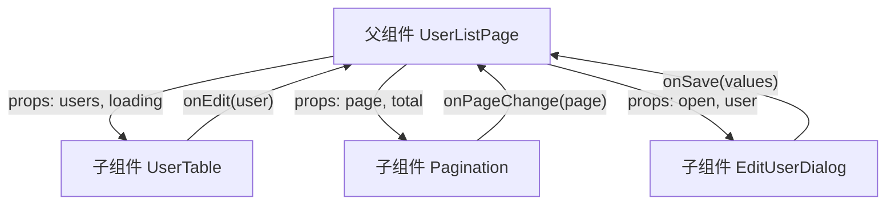
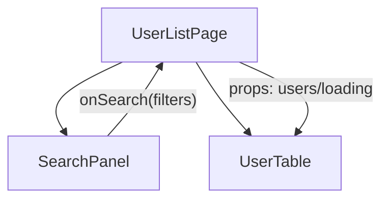
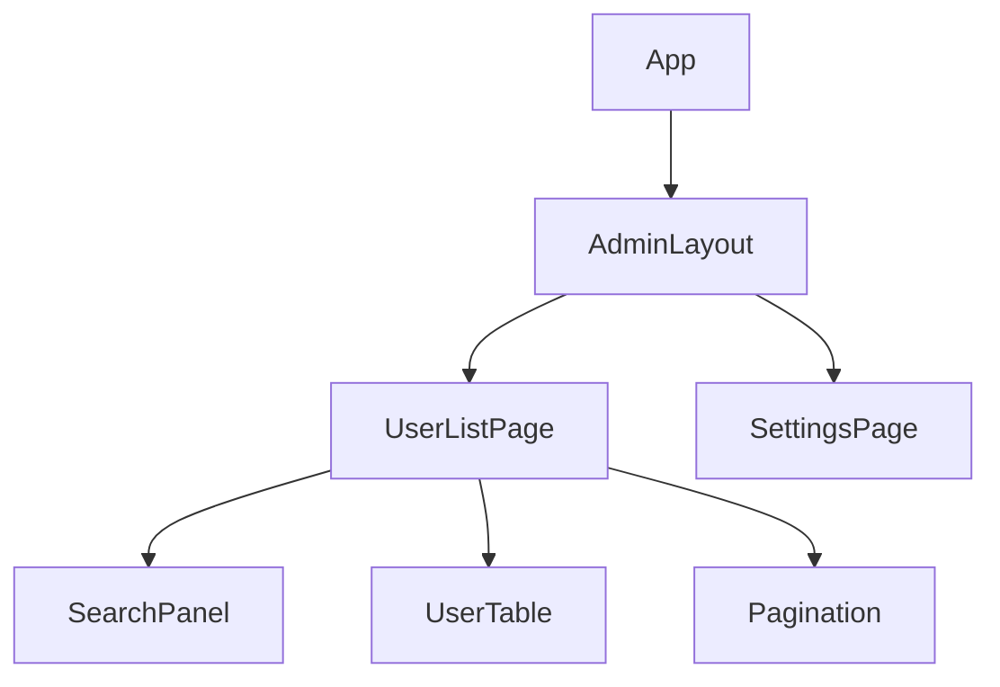

# React - 第 6 课：组件通信与状态提升：父子、兄弟、组合与 Context

## 学习目标（本节结束后你能做到什么）

- 理解 React 默认的数据流是从父组件到子组件的单向数据流。
- 掌握父子组件通信的基本方式：父传子用 Props，子通知父用回调函数。
- 理解兄弟组件不能直接互相改状态，通常要通过共同父组件协调。
- 能判断什么时候需要状态提升，以及状态应该提升到哪一层。
- 理解组件组合如何减少 props 层层透传。
- 知道 Context 适合解决什么问题，也知道它不应该被滥用成万能全局状态。
- 初步形成“状态归属”和“通信边界”的工程判断能力。

## 内容讲解（核心概念，用类比、例子、图示说清楚）

前面几课我们已经学过：

- Props 是父组件传给子组件的输入。
- State 是组件内部会影响渲染的状态。
- State 变化会触发相关组件重新渲染。
- Effect 用来同步外部系统，不应该承担普通数据流管理职责。

现在问题来了：真实页面从来不是一个组件单独工作。

一个后台管理页面通常会有：

- 搜索区
- 表格区
- 分页区
- 编辑弹窗
- 批量操作栏
- 权限按钮
- 错误提示
- loading 状态

这些组件之间一定要协作。比如：

- 搜索区提交条件后，表格要重新加载。
- 分页区切换页码后，表格要展示新数据。
- 表格点击“编辑”后，弹窗要打开。
- 弹窗保存成功后，表格要刷新。
- 勾选表格行后，批量删除按钮要变成可用。

这就是组件通信要解决的问题。

React 在这件事上的默认立场很清晰：

**数据从父组件流向子组件；子组件不能直接修改父组件状态，只能通过回调通知父组件。**

这个默认规则看起来有点绕，但它换来的是可预测性。你能知道状态是谁拥有的，谁能修改它，谁只是读取它。

### 1. 单向数据流：React 组件协作的底层规则

先看一张图：



图里有两种方向：

- 数据向下流：父组件通过 props 把数据传给子组件。
- 事件向上报：子组件通过调用回调函数告诉父组件发生了什么。

这就是 React 最常见的数据流。

注意，这里的“事件向上报”不是说子组件真的能直接改父组件状态。子组件只是调用父组件传下来的函数。真正决定如何修改状态的，仍然是父组件。

用后端类比：

- 父组件像一个聚合服务或 orchestrator。
- 子组件像具体功能模块。
- 子组件不直接改上层数据源，而是发出一个意图。
- 上层收到意图后决定状态如何变化。

这种方式会让页面数据流更容易追踪。

### 2. 父传子：用 Props 传数据和配置

父组件给子组件传数据，是最基础的通信方式。

```jsx
function UserListPage() {
  const users = [
    { id: 1, name: "张三", status: "active" },
    { id: 2, name: "李四", status: "disabled" },
  ];

  return <UserTable users={users} />;
}

function UserTable({ users }) {
  return (
    <table>
      <tbody>
        {users.map((user) => (
          <tr key={user.id}>
            <td>{user.name}</td>
            <td>{user.status}</td>
          </tr>
        ))}
      </tbody>
    </table>
  );
}
```

这里 `UserListPage` 拥有 `users`，`UserTable` 只负责展示。

Props 可以传很多类型：

```jsx
<UserTable
  users={users}
  loading={loading}
  selectable={true}
  pageSize={20}
/>
```

这些都是父组件对子组件的输入：

- `users` 是数据。
- `loading` 是状态。
- `selectable` 是功能开关。
- `pageSize` 是配置。

子组件应该把这些 Props 当成只读输入，不要在子组件里尝试直接修改它们。

### 3. 子通知父：用回调函数表达用户意图

如果子组件内部发生了用户操作，比如点击编辑按钮，它应该怎么影响父组件？

答案是：父组件传一个回调函数给子组件，子组件在合适的时候调用它。

```jsx
function UserListPage() {
  const [editingUser, setEditingUser] = useState(null);

  function handleEdit(user) {
    setEditingUser(user);
  }

  return (
    <>
      <UserTable users={users} onEdit={handleEdit} />
      {editingUser && <EditDialog user={editingUser} />}
    </>
  );
}

function UserTable({ users, onEdit }) {
  return (
    <table>
      <tbody>
        {users.map((user) => (
          <tr key={user.id}>
            <td>{user.name}</td>
            <td>
              <button onClick={() => onEdit(user)}>
                编辑
              </button>
            </td>
          </tr>
        ))}
      </tbody>
    </table>
  );
}
```

这段代码的含义是：

- `UserListPage` 拥有 `editingUser` 状态。
- `UserTable` 不知道弹窗怎么打开，也不拥有弹窗状态。
- `UserTable` 只在用户点击按钮时调用 `onEdit(user)`。
- 父组件收到通知后，调用 `setEditingUser(user)`。
- 父组件重新渲染，弹窗出现。

这就是“子通知父”的基本模式。

### 4. 回调函数命名：用业务意图，而不是实现细节

回调函数命名很重要。它会影响组件边界是否清楚。

不太好的命名：

```jsx
<UserTable setEditingUser={setEditingUser} />
```

这样子组件知道了父组件内部状态叫 `editingUser`，还知道父组件用的是 setter。这会让子组件和父组件实现细节耦合。

更好的命名：

```jsx
<UserTable onEdit={handleEdit} />
```

`onEdit` 表达的是业务事件：“用户想编辑”。至于父组件收到这个事件后是打开弹窗、跳转页面、还是记录日志，子组件不用知道。

再比如：

```jsx
<SearchPanel onSearch={handleSearch} />
<Pagination onPageChange={handlePageChange} />
<EditDialog onSave={handleSaveUser} onCancel={handleCloseDialog} />
```

这些名字都在描述用户意图或业务事件，而不是暴露父组件内部怎么实现。

一个实用规则是：

**子组件 props 里的回调名，尽量用 `onXxx` 表达“发生了什么”，而不是用 `setXxx` 暴露“父组件怎么改状态”。**

### 5. 兄弟组件通信：通过共同父组件

兄弟组件不能直接通信。它们通常通过最近的共同父组件共享状态。

比如搜索区和表格区：



`SearchPanel` 不应该直接操作 `UserTable`。它只负责把搜索条件告诉 `UserListPage`。父组件更新搜索条件并请求数据，再把新 `users` 传给 `UserTable`。

代码大概是：

```jsx
function UserListPage() {
  const [filters, setFilters] = useState({
    keyword: "",
    status: "all",
  });
  const [users, setUsers] = useState([]);

  async function handleSearch(nextFilters) {
    setFilters(nextFilters);
    const nextUsers = await fetchUsers(nextFilters);
    setUsers(nextUsers);
  }

  return (
    <main>
      <SearchPanel onSearch={handleSearch} />
      <UserTable users={users} />
    </main>
  );
}
```

这里的状态归属很清楚：

- 搜索区负责收集输入。
- 页面父组件负责保存搜索条件和请求数据。
- 表格只负责展示数据。

### 6. 状态提升：当多个组件需要同一份状态

状态提升是 React 里非常核心的设计方法。

它的意思是：**如果多个组件都需要读写同一份状态，就把这份状态提升到它们最近的共同父组件。**

看一个温度转换例子：

```jsx
function TemperatureCalculator() {
  const [celsius, setCelsius] = useState("");

  const fahrenheit = celsius === ""
    ? ""
    : Number(celsius) * 9 / 5 + 32;

  return (
    <section>
      <TemperatureInput
        label="摄氏度"
        value={celsius}
        onChange={setCelsius}
      />
      <TemperatureInput
        label="华氏度"
        value={fahrenheit}
        onChange={(nextFahrenheit) => {
          const nextCelsius = (Number(nextFahrenheit) - 32) * 5 / 9;
          setCelsius(String(nextCelsius));
        }}
      />
    </section>
  );
}

function TemperatureInput({ label, value, onChange }) {
  return (
    <label>
      {label}
      <input
        value={value}
        onChange={(event) => onChange(event.target.value)}
      />
    </label>
  );
}
```

这里如果两个输入框各自维护自己的 State，就很容易不同步。把核心状态提升到共同父组件后，两个输入框都从同一个源头得到值。

这就是状态提升解决的问题：

```text
多个组件需要保持一致 -> 不要复制多份状态 -> 找共同父组件持有唯一状态源
```

### 7. 状态应该提升到多高

状态提升不是越高越好。

一个常见误区是：只要一个状态有一点共享需求，就直接放到最顶层 App，甚至全局状态库。

这样会带来问题：

- 顶层组件越来越臃肿。
- 很多不相关组件被迫知道这份状态。
- 更新影响范围变大。
- 数据流变长，排查困难。

更好的判断标准是：

**把状态放到所有需要它的组件的最近共同父组件。**

比如：



如果搜索条件只影响 `SearchPanel`、`UserTable`、`Pagination`，那它应该放在 `UserListPage`，而不是 `AdminLayout` 或 `App`。

如果登录用户信息影响整个后台的导航、权限按钮、头像，那它可能适合放到更高层，甚至通过 Context 提供。

状态放置的核心问题是：

- 谁需要读？
- 谁需要改？
- 哪些组件需要因为它变化而重新渲染？
- 它的生命周期应该跟哪个页面或模块一致？

### 8. 状态下放：不是所有状态都要提升

和状态提升相对的是状态下放。

如果一份状态只有某个子组件自己关心，就应该放在子组件内部，不要提升。

例如弹窗内部的临时表单草稿：

```jsx
function EditUserDialog({ user, onSave, onCancel }) {
  const [form, setForm] = useState({
    name: user.name,
    email: user.email,
  });

  function handleSubmit() {
    onSave(form);
  }

  return (
    <form>
      <input
        value={form.name}
        onChange={(event) =>
          setForm((prev) => ({ ...prev, name: event.target.value }))
        }
      />
      <button type="button" onClick={handleSubmit}>保存</button>
      <button type="button" onClick={onCancel}>取消</button>
    </form>
  );
}
```

如果表单草稿只在弹窗内部使用，放在弹窗里就很好。父组件只需要知道：

- 弹窗是否打开。
- 当前编辑哪个用户。
- 保存时拿到最终提交值。

父组件没必要知道用户每输入一个字符。

这能减少父组件复杂度，也能缩小重新渲染影响范围。

### 9. 状态归属判断：订单列表页例子

假设你有一个订单列表页：

- 搜索关键词
- 订单状态筛选
- 当前页码
- 订单列表数据
- loading
- 当前选中的订单 ID
- 批量选中的订单 ID 列表
- 编辑弹窗是否打开
- 编辑弹窗表单草稿

可以这样判断：

| 状态 | 推荐位置 | 原因 |
| --- | --- | --- |
| 搜索关键词 | `OrderListPage` 或 `SearchPanel` | 如果搜索输入影响表格和分页，最终查询条件应在页面层 |
| 订单状态筛选 | `OrderListPage` 或 `SearchPanel` | 与搜索条件类似 |
| 当前页码 | `OrderListPage` | 影响列表请求和分页展示 |
| 订单列表数据 | `OrderListPage` | 表格展示、分页、刷新都依赖它 |
| loading | `OrderListPage` | 表格、按钮、空态可能都要读 |
| 当前选中的订单 ID | `OrderListPage` | 表格高亮和详情区域都可能用 |
| 批量选中的订单 ID | `OrderListPage` 或 `OrderTable` | 如果批量操作栏在页面层，放页面层；如果只表格内部用，放表格 |
| 弹窗是否打开 | `OrderListPage` | 父组件决定是否渲染弹窗 |
| 弹窗表单草稿 | `EditOrderDialog` | 只有弹窗内部输入时使用 |

这张表不是绝对答案，但展示了判断方式：看谁需要读，谁需要改，以及这份状态的生命周期属于谁。

### 10. props 层层透传：什么时候是问题

React 默认用 props 传数据，所以多传几层并不一定是问题。

但如果出现下面这种情况，就要警惕：

```text
App -> Layout -> Sidebar -> Menu -> MenuItem -> PermissionButton
```

假设只有 `PermissionButton` 需要 `currentUser`，中间的 `Layout`、`Sidebar`、`Menu`、`MenuItem` 都只是把 `currentUser` 原样转发下去。这时候就出现了 props drilling，也就是 props 层层透传。

它的问题不是“多传了几层”本身，而是：

- 中间组件被迫知道自己不关心的数据。
- 每加一个需要深层使用的字段，都要改很多中间组件。
- 组件边界被污染。

解决它不一定马上用 Context。可以先考虑组件组合。

### 11. 组件组合：把“要渲染什么”作为 children 传进去

组件组合是 React 非常强的一种思路。

假设你有一个布局组件：

```jsx
function PageShell({ user, children }) {
  return (
    <main>
      <Header user={user} />
      <section>{children}</section>
    </main>
  );
}
```

如果 `PageShell` 只是为了把 `user` 传给很深的某个按钮，那可能会造成透传。另一种方式是让上层直接把需要的内容组合好：

```jsx
function App() {
  const user = useCurrentUser();

  return (
    <PageShell
      header={<Header user={user} />}
      sidebar={<Sidebar user={user} />}
    >
      <UserListPage user={user} />
    </PageShell>
  );
}

function PageShell({ header, sidebar, children }) {
  return (
    <main>
      <aside>{sidebar}</aside>
      <section>
        {header}
        {children}
      </section>
    </main>
  );
}
```

这样 `PageShell` 不需要知道 `user`，它只负责布局。谁需要 `user`，就在更上层组合时直接传给谁。

这体现了一个很重要的原则：

**如果一个组件只是提供外壳或布局，就尽量不要让它知道太多业务数据。**

`children`、`header`、`footer`、`actions` 这类“插槽式 props”可以让组件更灵活，也能减少无意义透传。

### 12. 组合优于过早 Context

很多初学者遇到 props drilling，第一反应是 Context。

但在使用 Context 前，可以先问：

- 能不能把状态放到更合适的共同父组件？
- 能不能通过 `children` 或插槽 props 组合组件？
- 中间组件是不是不该承载这个业务数据？
- 是否只是两三层传递，且中间组件本来就关心这个数据？

如果组合能解决，就先用组合。Context 不是不能用，而是它会让数据来源变得更隐式。组件可以不通过 props 就读到外部值，这在某些场景很方便，但也会降低局部可读性。

### 13. Context 解决什么问题

Context 适合解决跨层级共享、变化频率不高、很多组件都需要读取的数据。

典型场景：

- 当前登录用户
- 主题配置
- 国际化语言
- 权限能力
- 路由上下文
- 表单上下文
- 设计系统配置

这些数据有共同特点：

- 很多层级的组件都可能需要。
- 一层层通过 props 传会污染大量中间组件。
- 它们通常更像环境信息或上下文。

Context 的基本用法是：

```jsx
const CurrentUserContext = createContext(null);

function App() {
  const currentUser = {
    id: 1,
    name: "张三",
    role: "admin",
  };

  return (
    <CurrentUserContext.Provider value={currentUser}>
      <AdminLayout />
    </CurrentUserContext.Provider>
  );
}

function UserAvatar() {
  const currentUser = useContext(CurrentUserContext);

  return <span>{currentUser.name}</span>;
}
```

这里 `UserAvatar` 不需要从 `App -> AdminLayout -> Header -> UserAvatar` 一层层拿 props。它可以直接从 Context 读取当前用户。

### 14. Context 不是状态管理库

Context 经常被误解成“React 自带 Redux”。这个理解不准确。

Context 的核心能力是“跨层传值”。它本身不负责：

- 状态更新逻辑组织
- 异步请求缓存
- 数据规范化
- 中间件
- 时间旅行调试
- 精细化订阅
- 服务端状态重新验证

你当然可以把 `useState` 或 `useReducer` 和 Context 组合起来，做一个简单全局状态：

```jsx
const AuthContext = createContext(null);

function AuthProvider({ children }) {
  const [currentUser, setCurrentUser] = useState(null);

  const value = {
    currentUser,
    login: setCurrentUser,
    logout: () => setCurrentUser(null),
  };

  return (
    <AuthContext.Provider value={value}>
      {children}
    </AuthContext.Provider>
  );
}
```

这适合小规模共享状态。但如果状态复杂、更新频繁、需要缓存请求、需要细粒度订阅，就要谨慎。Context 值变化时，读取这个 Context 的组件通常都会重新渲染，可能带来性能和组织问题。

所以更准确的判断是：

**Context 适合传上下文，不适合无脑承载所有业务状态。**

### 15. Context 的使用边界：哪些状态不该放进去

下面这些通常不适合一开始就放 Context：

- 某个页面的搜索关键词
- 某个表格的当前页码
- 某个弹窗内部表单草稿
- 某个按钮的 hover 状态
- 某个列表局部选中状态
- 可以由已有数据计算出来的派生值

这些状态的生命周期通常很局部。放到 Context 会扩大影响范围，也让状态来源更难追踪。

适合留在局部或页面层：

```text
只和这个页面相关 -> 页面组件
只和这个弹窗相关 -> 弹窗组件
只和这个输入框相关 -> 输入框组件
多个兄弟组件共享 -> 最近共同父组件
整个应用很多地方都需要 -> 再考虑 Context
```

### 16. Context 拆分：不要一个大 Context 装所有东西

一个常见坏味道是：

```jsx
const AppContext = createContext(null);

function AppProvider({ children }) {
  const value = {
    currentUser,
    theme,
    locale,
    permissions,
    notifications,
    sidebarOpen,
    setSidebarOpen,
    filters,
    setFilters,
  };

  return (
    <AppContext.Provider value={value}>
      {children}
    </AppContext.Provider>
  );
}
```

这看起来方便，但问题很多：

- 任何一项变化都可能影响很多消费者。
- 组件读数据时不知道自己依赖了一个巨大上下文。
- 不同生命周期的数据被混在一起。
- 后续维护时很难判断某个字段是否还能删。

更好的做法是按领域拆分：

```text
AuthContext：当前用户、登录、登出
ThemeContext：主题
LocaleContext：语言
PermissionContext：权限判断
```

Context 应该表达稳定的上下文边界，而不是变成全局变量包。

### 17. 用 Context 做权限按钮：一个适合的例子

假设后台里很多按钮都要根据当前用户权限决定是否展示。

可以提供一个权限上下文：

```jsx
const PermissionContext = createContext({
  can: () => false,
});

function PermissionProvider({ permissions, children }) {
  function can(action) {
    return permissions.includes(action);
  }

  return (
    <PermissionContext.Provider value={{ can }}>
      {children}
    </PermissionContext.Provider>
  );
}

function PermissionButton({ action, children, onClick }) {
  const { can } = useContext(PermissionContext);

  if (!can(action)) {
    return null;
  }

  return <button onClick={onClick}>{children}</button>;
}
```

使用时：

```jsx
function UserActions({ user, onDelete }) {
  return (
    <PermissionButton
      action="user.delete"
      onClick={() => onDelete(user)}
    >
      删除用户
    </PermissionButton>
  );
}
```

这个场景适合 Context，因为：

- 权限是全局上下文。
- 很多深层按钮都需要读权限。
- 中间组件不应该被权限 props 污染。
- 权限变化频率通常不高。

### 18. Provider 的位置也很重要

Provider 放得越高，影响范围越大。

比如当前用户信息可能适合包住整个后台：

```jsx
function App() {
  return (
    <AuthProvider>
      <AdminApp />
    </AuthProvider>
  );
}
```

但某个表单上下文只应该包住表单区域：

```jsx
function UserForm() {
  return (
    <FormProvider>
      <UserBasicFields />
      <UserPermissionFields />
      <SubmitButton />
    </FormProvider>
  );
}
```

不要为了省事把所有 Provider 都堆到最顶层。Provider 的范围应该和这份上下文的生命周期一致。

### 19. 组件通信的几种方式怎么选

可以用这张表做初步判断：

| 场景 | 优先方式 | 原因 |
| --- | --- | --- |
| 父组件给子组件传展示数据 | Props | 最直接、最清晰 |
| 子组件通知父组件用户操作 | 回调函数 | 子组件表达意图，父组件决定状态变化 |
| 兄弟组件共享状态 | 最近共同父组件 | 保持单一状态源 |
| 深层组件需要布局外壳 | 组件组合 / children | 减少无意义透传 |
| 很多层级都需要当前用户、主题、语言 | Context | 避免大量中间组件透传 |
| 复杂跨页面共享状态、频繁更新 | 状态管理库或专门数据层 | Context 可能不够精细 |
| 服务端数据缓存、重新验证、请求去重 | React Query / SWR 等 | 这是服务端状态问题，不只是组件通信 |

这个表不是绝对规则，但能帮你避免两个极端：

- 所有东西都 props drill。
- 所有东西都全局状态。

### 20. 一个完整例子：搜索、表格、分页、弹窗协作

下面用一个用户管理页串起来：

```jsx
function UserListPage() {
  const [filters, setFilters] = useState({
    keyword: "",
    status: "all",
  });
  const [page, setPage] = useState(1);
  const [editingUser, setEditingUser] = useState(null);

  const users = [
    { id: 1, name: "张三", status: "active" },
    { id: 2, name: "李四", status: "disabled" },
  ];

  function handleSearch(nextFilters) {
    setFilters(nextFilters);
    setPage(1);
  }

  function handlePageChange(nextPage) {
    setPage(nextPage);
  }

  function handleEdit(user) {
    setEditingUser(user);
  }

  function handleCloseDialog() {
    setEditingUser(null);
  }

  return (
    <main>
      <SearchPanel
        initialFilters={filters}
        onSearch={handleSearch}
      />

      <UserTable
        users={users}
        onEdit={handleEdit}
      />

      <Pagination
        page={page}
        total={100}
        onPageChange={handlePageChange}
      />

      {editingUser && (
        <EditUserDialog
          user={editingUser}
          onCancel={handleCloseDialog}
          onSave={handleCloseDialog}
        />
      )}
    </main>
  );
}
```

这里页面层 `UserListPage` 负责协调：

- 搜索条件
- 页码
- 当前编辑用户
- 子组件之间的协作

子组件职责很清楚：

- `SearchPanel` 收集搜索条件，提交时调用 `onSearch`。
- `UserTable` 展示用户，点击编辑时调用 `onEdit`。
- `Pagination` 展示页码，切换时调用 `onPageChange`。
- `EditUserDialog` 管理表单草稿，取消或保存时通知父组件。

这就是一个典型 React 页面结构：页面组件持有跨区域状态，子组件负责局部 UI 和用户意图。

### 21. 常见误区：子组件直接复制 props 到 state

看这个写法：

```jsx
function UserCard({ user }) {
  const [localUser, setLocalUser] = useState(user);

  return <p>{localUser.name}</p>;
}
```

这很容易出问题。`useState(user)` 只在初始渲染时使用一次。后面如果父组件传入新的 `user`，`localUser` 不会自动同步。

如果只是展示，直接用 props：

```jsx
function UserCard({ user }) {
  return <p>{user.name}</p>;
}
```

如果确实需要编辑草稿，比如弹窗打开后允许用户修改但不立即影响父组件，可以复制成内部 State。但这时要明确这是“草稿”，不是自动同步的镜像：

```jsx
function EditUserDialog({ user, onSave }) {
  const [draft, setDraft] = useState(() => ({
    name: user.name,
    email: user.email,
  }));

  function handleSave() {
    onSave(draft);
  }

  return <button onClick={handleSave}>保存</button>;
}
```

如果弹窗在不同用户之间复用，还要考虑 `key={user.id}` 或在用户变化时重置草稿。这个问题后面讲列表 key 和表单时还会继续遇到。

### 22. 常见误区：为了方便把 setter 传得到处都是

比如：

```jsx
<UserTable setEditingUser={setEditingUser} />
```

这样写短期很方便，但长期会让子组件知道太多父组件实现细节。

更好的方式是传业务回调：

```jsx
<UserTable onEdit={handleEdit} />
```

区别在于：

- `setEditingUser` 暴露了父组件状态结构。
- `onEdit` 暴露的是用户意图。

组件通信越偏业务意图，组件越容易复用和维护。

### 23. 常见误区：Context 用来逃避状态设计

有些代码一遇到状态传递就放 Context：

```text
搜索条件放 Context
当前页码放 Context
弹窗开关放 Context
表格选中项放 Context
表单草稿放 Context
```

这看起来省了 props，但代价是状态来源变隐式了。任何深层组件都可以读取和修改这些状态，页面行为会越来越难追踪。

Context 应该是你完成局部状态设计、状态提升和组合之后的工具，而不是逃避设计的捷径。

问自己一句：

```text
如果我把这个状态放到 Context，是因为它真的属于上下文，还是因为我不想认真设计组件边界？
```

这句话很有用。

### 24. 本章的核心判断框架

以后遇到组件通信问题，可以按这个顺序判断：

1. 这个数据是否只属于一个组件？如果是，放在组件内部。
2. 是否只有父组件需要传给子组件展示？如果是，用 Props。
3. 子组件是否只是通知父组件发生了什么？如果是，用回调函数。
4. 多个兄弟组件是否需要共享同一份状态？如果是，提升到最近共同父组件。
5. 是否只是中间层不关心但被迫转发？如果是，先考虑组件组合。
6. 是否是很多层级都需要的环境信息？如果是，考虑 Context。
7. 是否是复杂跨页面状态或服务端缓存？如果是，再考虑状态管理库或数据请求库。

这个顺序能让你优先使用 React 最基础、最清晰的机制，而不是一上来就上复杂工具。

## 小结（3-5 条关键点）

- React 默认是单向数据流：父组件通过 Props 向下传数据，子组件通过回调函数向上通知事件。
- 兄弟组件共享状态时，通常把状态提升到最近共同父组件，保持单一状态源。
- 状态提升不是越高越好，状态应该放在所有使用者的最近共同父组件；局部状态应该尽量下放。
- 组件组合和 `children` 可以减少无意义 props 透传，让布局组件少知道业务细节。
- Context 适合跨层共享上下文信息，但不应该被当作万能全局状态或逃避状态设计的工具。

## 问题 （检测用户对当前章节内容是否了解）

1. React 的单向数据流是什么意思？为什么子组件不应该直接修改父组件状态？
2. 父组件给子组件传数据、子组件通知父组件事件，分别应该用什么方式？请用一个“编辑用户”的例子说明。
3. 什么是状态提升？如果搜索区和表格都依赖搜索条件，搜索条件应该放在哪里？为什么？
4. 状态提升是不是越高越好？请说明状态放太高可能带来哪些问题。
5. props 层层透传什么时候是真问题？组件组合可以如何缓解？
6. Context 适合哪些场景？为什么不建议把某个页面的搜索条件、页码、弹窗表单草稿都放进 Context？
7. 假设你要写一个订单管理页，包含搜索区、表格、分页、批量操作栏、编辑弹窗。请说明哪些状态放页面层，哪些状态可以放子组件内部。

请把你的答案直接告诉我。我会根据你的回答判断第 6 课是否掌握，再决定是进入第 7 课，还是先补一节状态归属、组件组合和 Context 边界的强化讲解。
