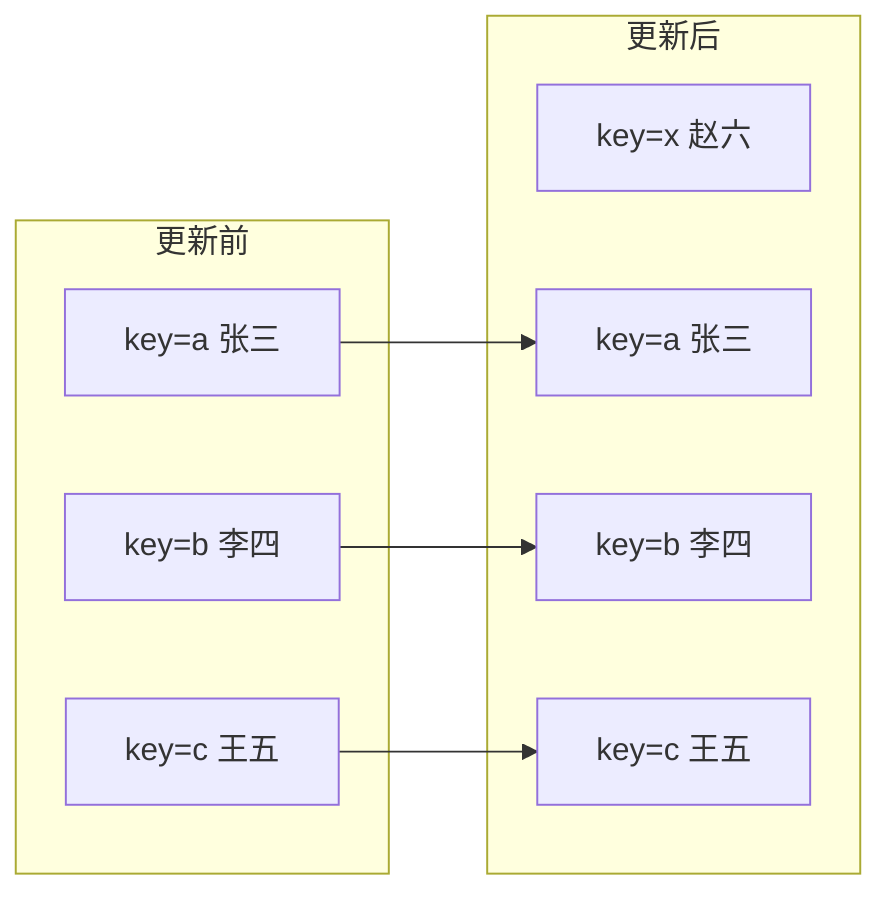

# React - 第 7 课：列表渲染与 key：为什么 React 需要身份标识

## 学习目标（本节结束后你能做到什么）

- 掌握用 `map` 把数组数据渲染成 JSX 列表。
- 理解条件渲染、空态、loading、error 和列表展示之间的关系。
- 能解释 `key` 的本质：帮助 React 判断列表元素的业务身份。
- 知道为什么可增删、排序、筛选的列表不推荐用数组下标做 key。
- 知道为什么不能用 `Math.random()` 这类不稳定值做 key。
- 理解 key 如何影响组件状态保留、重置和列表 diff。
- 能在真实业务列表页里设计合理的数据结构和渲染边界。

## 内容讲解（核心概念，用类比、例子、图示说清楚）

React 业务页面里，列表几乎无处不在：

- 用户列表
- 订单列表
- 商品列表
- 消息列表
- 权限菜单
- 评论区
- 搜索结果
- 表格行
- 标签组
- 下拉选项

前面我们已经多次写过类似代码：

```jsx
{users.map((user) => (
  <UserRow key={user.id} user={user} />
))}
```

这一行看起来很简单，但里面其实有 React 非常重要的设计思想：

- `map` 负责把数据变成 UI。
- `UserRow` 负责封装每一行的展示。
- `key` 负责告诉 React 每一行的身份。

很多初学者觉得 `key` 只是为了消除控制台 warning。这个理解太浅了。`key` 的真正作用是：**当列表发生增删、移动、排序、筛选时，React 需要知道哪些元素是同一个，哪些元素是新增或删除。**

如果身份判断错了，轻则多做 DOM 更新，重则出现输入框内容错位、行内状态串行、动画异常、组件状态不该保留却保留，或者该保留却丢失。

这一章我们就把列表渲染和 key 一次讲透。

### 1. 从数组到 UI：用 map 渲染列表

React 里列表渲染的核心思路是：

```text
数组数据 -> map -> JSX 数组 -> React 渲染成 UI
```

例如：

```jsx
function UserList() {
  const users = [
    { id: 1, name: "张三", role: "后端工程师" },
    { id: 2, name: "李四", role: "前端工程师" },
    { id: 3, name: "王五", role: "测试工程师" },
  ];

  return (
    <ul>
      {users.map((user) => (
        <li key={user.id}>
          {user.name} - {user.role}
        </li>
      ))}
    </ul>
  );
}
```

这里 `users.map(...)` 会返回一个 JSX 元素数组：

```text
[
  <li key={1}>张三 - 后端工程师</li>,
  <li key={2}>李四 - 前端工程师</li>,
  <li key={3}>王五 - 测试工程师</li>
]
```

React 可以渲染 JSX 数组，所以这段代码能正常展示三行。

这和后端里把数据库记录映射成 DTO 有点像：

```text
records.map(record -> responseItem)
```

只不过 React 里映射出来的是 UI 描述。

### 2. map 里为什么要有 return

如果你用圆括号，可以隐式返回：

```jsx
{users.map((user) => (
  <li key={user.id}>{user.name}</li>
))}
```

如果你用花括号，就要显式 `return`：

```jsx
{users.map((user) => {
  return <li key={user.id}>{user.name}</li>;
})}
```

常见错误是：

```jsx
{users.map((user) => {
  <li key={user.id}>{user.name}</li>;
})}
```

这段代码不会渲染出列表，因为箭头函数用了 `{}`，但没有 `return`，所以每次返回的是 `undefined`。

一个小经验：

- 列表项逻辑很简单，用 `(...)` 隐式返回。
- 逻辑稍复杂，需要提前计算变量，用 `{ return ... }`。

例如：

```jsx
{users.map((user) => {
  const statusText = user.active ? "启用" : "禁用";

  return (
    <li key={user.id}>
      {user.name} - {statusText}
    </li>
  );
})}
```

### 3. 列表项复杂时，拆成子组件

如果列表项只是一个 `<li>`，直接写在 `map` 里没问题。

但真实业务表格行往往很复杂：

- 多列字段展示
- 状态标签
- 权限按钮
- 操作菜单
- loading 或禁用状态
- 行内编辑
- 错误提示

这时建议拆成子组件：

```jsx
function UserTable({ users, onEdit, onDelete }) {
  return (
    <table>
      <tbody>
        {users.map((user) => (
          <UserRow
            key={user.id}
            user={user}
            onEdit={onEdit}
            onDelete={onDelete}
          />
        ))}
      </tbody>
    </table>
  );
}

function UserRow({ user, onEdit, onDelete }) {
  return (
    <tr>
      <td>{user.name}</td>
      <td>{user.email}</td>
      <td><StatusBadge status={user.status} /></td>
      <td>
        <button onClick={() => onEdit(user)}>编辑</button>
        <button onClick={() => onDelete(user.id)}>删除</button>
      </td>
    </tr>
  );
}
```

拆组件的好处是：

- `UserTable` 负责列表结构。
- `UserRow` 负责单行展示。
- `StatusBadge` 负责状态翻译。
- 操作回调从上层传入，保持数据流清晰。

列表渲染不是简单地把代码堆进 `map`。当每一项有独立职责时，拆子组件会让页面更容易维护。

### 4. key 的本质：元素身份，不是数组位置

先记住一句话：

**`key` 是 React 用来识别同一层级列表元素身份的标识。**

它不是给你业务代码读取的普通 props。比如：

```jsx
<UserRow key={user.id} user={user} />
```

在 `UserRow` 内部拿不到 `props.key`。如果你真的需要这个 ID，要显式传：

```jsx
<UserRow key={user.id} userId={user.id} user={user} />
```

为什么 React 需要 key？

因为列表会变化。比如原来是：

```text
A, B, C
```

下一次渲染变成：

```text
X, A, B, C
```

React 要判断：这是在前面新增了 `X`，还是原来的 `A` 变成了 `X`，`B` 变成了 `A`，`C` 变成了 `B`？

如果每一项有稳定 key：

```text
key=a -> A
key=b -> B
key=c -> C
```

新增后：

```text
key=x -> X
key=a -> A
key=b -> B
key=c -> C
```

React 就能知道 `A/B/C` 仍然是原来的元素，只是位置后移了。

### 图示：key 帮 React 识别身份



如果没有稳定 key，React 对列表变化的判断就容易变得不准确。

### 5. 好 key 的标准：稳定、唯一、来自业务数据

一个好的 key 通常满足三个条件：

1. 在同一层级列表内唯一。
2. 同一个业务实体在多次渲染之间保持稳定。
3. 尽量来自数据本身，而不是渲染时临时生成。

最常见的好 key 是数据库 ID：

```jsx
{orders.map((order) => (
  <OrderRow key={order.id} order={order} />
))}
```

如果没有单独 ID，可以用业务上稳定唯一的字段：

```jsx
{permissions.map((permission) => (
  <PermissionItem
    key={permission.code}
    permission={permission}
  />
))}
```

比如权限码 `user.delete`、订单号 `orderNo`、SKU 编码 `skuCode`，这些通常都比数组下标更适合做 key。

如果数据本身没有 ID，你应该优先考虑在数据进入前端时补一个稳定 ID，而不是在渲染时用随机数。

### 6. 为什么不推荐用数组下标做 key

数组下标的问题在于：它代表位置，不代表业务身份。

如果列表永远静态、不增删、不排序、不筛选，用下标问题不大。

但真实业务列表经常会变化：

- 插入一行
- 删除一行
- 搜索筛选
- 排序
- 拖拽调整顺序
- 分页替换数据

这时下标会导致身份错位。

看一个例子。原列表：

```text
index=0 张三
index=1 李四
index=2 王五
```

如果删除第一项，下一次列表变成：

```text
index=0 李四
index=1 王五
```

React 如果用 index 做 key，会认为：

```text
key=0 的元素还在，只是内容从张三变成李四
key=1 的元素还在，只是内容从李四变成王五
```

但从业务身份看，`李四` 和 `王五` 不是原来的位置对应的元素，而是原来的业务实体移动了。

如果每一行只是纯文本，问题可能不明显。但如果每一行有自己的内部状态，就会出事。

### 7. 下标 key 导致状态错位：一个真实坑

假设有一个可编辑联系人列表：

```jsx
function ContactList({ contacts }) {
  return (
    <ul>
      {contacts.map((contact, index) => (
        <ContactRow key={index} contact={contact} />
      ))}
    </ul>
  );
}

function ContactRow({ contact }) {
  const [draftName, setDraftName] = useState(contact.name);

  return (
    <li>
      <input
        value={draftName}
        onChange={(event) => setDraftName(event.target.value)}
      />
    </li>
  );
}
```

用户把第一行“张三”输入框改成“张三-修改中”，但还没保存。然后删除第一行前面的某个元素，或者列表重新排序。

如果用 index 做 key，React 可能会复用错误的 `ContactRow` 实例，导致某个输入框的 `draftName` 出现在另一个联系人行上。

这就是状态错位。

根因是：

```text
React 根据 key 判断组件身份。
index 代表位置。
位置变了，但业务实体没变。
于是 React 把状态保留给了错误的业务实体。
```

正确写法应该用联系人 ID：

```jsx
function ContactList({ contacts }) {
  return (
    <ul>
      {contacts.map((contact) => (
        <ContactRow key={contact.id} contact={contact} />
      ))}
    </ul>
  );
}
```

这样 React 知道 `contact.id=123` 的那一行才是同一个联系人，状态也会跟着正确的业务实体走。

### 8. 为什么不能用 Math.random 做 key

有些人看到 key warning 后，会这样写：

```jsx
{users.map((user) => (
  <UserRow key={Math.random()} user={user} />
))}
```

这比不写 key 还糟糕。

因为每次渲染 `Math.random()` 都会生成新值。对 React 来说，每次渲染这些元素的 key 都全变了。它会认为旧列表全部消失，新列表全部出现。

后果是：

- 组件状态无法保留。
- 输入框可能每次渲染都重置。
- DOM 复用失效。
- 性能变差。
- Effect 可能反复清理和重新 setup。

key 必须稳定。随机数、当前时间戳、每次渲染新生成的 UUID，都不适合直接放在渲染过程里做 key。

如果确实需要前端生成 ID，应该在数据创建时生成一次并保存，而不是每次 render 都生成。

例如：

```jsx
function TodoApp() {
  const [todos, setTodos] = useState([]);

  function addTodo(text) {
    setTodos((prev) => [
      ...prev,
      {
        id: crypto.randomUUID(),
        text,
      },
    ]);
  }

  return (
    <ul>
      {todos.map((todo) => (
        <li key={todo.id}>{todo.text}</li>
      ))}
    </ul>
  );
}
```

这里 `id` 是创建 todo 时生成的，后续渲染都保持稳定。

### 9. key 只需要在同级列表内唯一

key 不要求全应用唯一，只要求在同一个父节点下的兄弟列表项之间唯一。

例如：

```jsx
function Dashboard({ users, orders }) {
  return (
    <>
      <section>
        {users.map((user) => (
          <UserCard key={user.id} user={user} />
        ))}
      </section>

      <section>
        {orders.map((order) => (
          <OrderCard key={order.id} order={order} />
        ))}
      </section>
    </>
  );
}
```

`users` 里有 `id=1`，`orders` 里也有 `id=1`，没问题，因为它们不在同一个兄弟列表里。

但同一个列表里不能有重复 key：

```jsx
{users.map((user) => (
  <UserCard key={user.role} user={user} />
))}
```

如果多个用户都是 `admin`，这个 key 就重复了。React 会无法准确判断身份。

### 10. key 放在哪里：放在 map 直接返回的元素上

如果你直接返回 DOM 元素：

```jsx
{users.map((user) => (
  <li key={user.id}>{user.name}</li>
))}
```

key 放在 `li` 上。

如果你返回组件：

```jsx
{users.map((user) => (
  <UserRow key={user.id} user={user} />
))}
```

key 放在 `UserRow` 上。

常见错误是把 key 放到子组件内部：

```jsx
function UserList({ users }) {
  return (
    <>
      {users.map((user) => (
        <UserRow user={user} />
      ))}
    </>
  );
}

function UserRow({ user }) {
  return <div key={user.id}>{user.name}</div>;
}
```

这样 `UserList` 这一层的兄弟元素 `<UserRow />` 仍然没有 key。React 需要 key 来区分 `map` 直接生成的那些兄弟节点，所以 key 应该写在 `UserRow` 使用处。

### 11. Fragment 列表也需要 key

有时候一个列表项需要返回多个兄弟节点：

```jsx
{users.map((user) => (
  <>
    <dt>{user.name}</dt>
    <dd>{user.email}</dd>
  </>
))}
```

这里短语法 `<>...</>` 不能接收 key。你应该使用显式 Fragment：

```jsx
import { Fragment } from "react";

function UserDescriptionList({ users }) {
  return (
    <dl>
      {users.map((user) => (
        <Fragment key={user.id}>
          <dt>{user.name}</dt>
          <dd>{user.email}</dd>
        </Fragment>
      ))}
    </dl>
  );
}
```

这能避免为了包一层 key 而生成多余 DOM。

### 12. 条件渲染：列表页不只有 success 状态

真实列表页通常不是只有“有数据”这一种状态。至少要考虑：

- loading：正在加载
- error：加载失败
- empty：加载成功但没有数据
- success：有数据

不要写成：

```jsx
function UserList({ users }) {
  return (
    <ul>
      {users.map((user) => (
        <li key={user.id}>{user.name}</li>
      ))}
    </ul>
  );
}
```

这只处理了 success。更完整的结构是：

```jsx
function UserList({ users, loading, error }) {
  if (loading) {
    return <p>加载中...</p>;
  }

  if (error) {
    return <p>加载失败，请稍后重试</p>;
  }

  if (users.length === 0) {
    return <p>暂无用户</p>;
  }

  return (
    <ul>
      {users.map((user) => (
        <li key={user.id}>{user.name}</li>
      ))}
    </ul>
  );
}
```

这类“提前 return”在列表页里很常见。它让每个状态的 UI 独立清楚。

### 13. 条件渲染的几种常见写法

#### 13.1 if 提前返回

适合页面级或区域级状态：

```jsx
if (loading) return <Loading />;
if (error) return <ErrorView />;
if (items.length === 0) return <EmptyView />;

return <ItemList items={items} />;
```

优点是清楚，适合复杂分支。

#### 13.2 三元表达式

适合二选一：

```jsx
{user.active ? <ActiveBadge /> : <DisabledBadge />}
```

#### 13.3 `&&` 短路渲染

适合“满足条件才展示”：

```jsx
{selectedIds.length > 0 && (
  <BatchToolbar selectedIds={selectedIds} />
)}
```

要注意一个小坑：

```jsx
{items.length && <List items={items} />}
```

当 `items.length` 是 `0` 时，页面可能渲染出 `0`。更稳的写法是：

```jsx
{items.length > 0 && <List items={items} />}
```

### 14. 过滤和排序：先得到新数组，再 map

列表页常常有搜索和排序。

一个简单写法是：

```jsx
function UserList({ users, keyword }) {
  const filteredUsers = users.filter((user) =>
    user.name.includes(keyword)
  );

  return (
    <ul>
      {filteredUsers.map((user) => (
        <li key={user.id}>{user.name}</li>
      ))}
    </ul>
  );
}
```

排序也类似：

```jsx
function UserList({ users }) {
  const sortedUsers = [...users].sort((a, b) =>
    a.name.localeCompare(b.name)
  );

  return (
    <ul>
      {sortedUsers.map((user) => (
        <li key={user.id}>{user.name}</li>
      ))}
    </ul>
  );
}
```

注意这里用了 `[...users].sort(...)`，而不是直接 `users.sort(...)`。

因为 `sort` 会原地修改数组。如果 `users` 来自 props 或 state，直接修改会破坏不可变更新原则。

正确思路是：

```text
旧数组 -> 复制新数组 -> 排序新数组 -> map 渲染
```

### 15. 不要把派生列表轻易存成 State

上一课讲过派生状态，这里再结合列表强调一次。

不推荐：

```jsx
function UserList({ users, keyword }) {
  const [filteredUsers, setFilteredUsers] = useState([]);

  useEffect(() => {
    setFilteredUsers(
      users.filter((user) => user.name.includes(keyword))
    );
  }, [users, keyword]);

  return <UserTable users={filteredUsers} />;
}
```

更推荐：

```jsx
function UserList({ users, keyword }) {
  const filteredUsers = users.filter((user) =>
    user.name.includes(keyword)
  );

  return <UserTable users={filteredUsers} />;
}
```

如果过滤排序非常重，数据量很大，可以后面考虑 `useMemo` 或服务端分页搜索。但不要因为“它会变化”就把它存成 State。它不是独立事实，而是由 `users + keyword` 推导出来的结果。

### 16. 分页列表：key 应该用全局业务 ID

后台列表经常分页：

```jsx
function OrderTable({ orders }) {
  return (
    <table>
      <tbody>
        {orders.map((order) => (
          <OrderRow key={order.id} order={order} />
        ))}
      </tbody>
    </table>
  );
}
```

不要因为每页只有 20 条就用 index：

```jsx
{orders.map((order, index) => (
  <OrderRow key={index} order={order} />
))}
```

分页切换时，第一页的 index 0 和第二页的 index 0 不是同一个订单。用 index 会让 React 误以为同一位置的行可以复用，可能导致行内状态错位。

如果每一页数据是完全替换，且行没有内部状态，短期可能看不出问题。但从习惯上，订单列表这种业务数据应该始终使用订单 ID。

### 17. key 也可以用来故意重置组件状态

key 不只是列表用。它还可以帮助 React 判断某个组件是否应该被当成“新的实例”。

例如用户详情页：

```jsx
function UserDetailPage({ userId }) {
  return <UserForm key={userId} userId={userId} />;
}
```

如果 `userId` 从 `1` 变成 `2`，`UserForm` 的 key 也变了。React 会把它当成一个新的组件实例，旧的表单内部 State 会被丢弃，新的表单重新初始化。

这在某些场景很有用，比如：

- 切换编辑对象时重置表单草稿。
- 切换聊天对象时重置输入框。
- 切换题目时重置答题状态。

但也要小心。key 改变会导致组件卸载再挂载：

- 内部 State 会丢失。
- Effect 会 cleanup 后重新 setup。
- DOM 可能重新创建。

所以 key 既能保留身份，也能重置身份。关键是你要明确自己想要哪种行为。

### 18. key 与表单草稿：保留还是重置

假设有一个编辑弹窗：

```jsx
function EditUserDialog({ user }) {
  const [draft, setDraft] = useState({
    name: user.name,
    email: user.email,
  });

  return (
    <form>
      <input
        value={draft.name}
        onChange={(event) =>
          setDraft((prev) => ({ ...prev, name: event.target.value }))
        }
      />
    </form>
  );
}
```

`useState` 的初始值只在组件初次挂载时使用。如果弹窗组件没有卸载，只是 `user` 从张三变成李四，`draft` 不会自动重置。

一种做法是给弹窗加 key：

```jsx
{editingUser && (
  <EditUserDialog
    key={editingUser.id}
    user={editingUser}
  />
)}
```

这样切换用户时，React 会创建新的 `EditUserDialog` 实例，表单草稿重新初始化。

但这不是唯一做法。你也可以在 `useEffect` 里根据 `user.id` 重置草稿，或者设计成每次关闭弹窗都会卸载。选择哪种方式取决于业务语义。

关键问题是：

```text
切换业务实体时，内部状态应该保留，还是应该重置？
```

key 正是表达这个身份边界的工具之一。

### 19. 列表里不要在 render 中改变原数组

看这个错误写法：

```jsx
function UserList({ users }) {
  users.sort((a, b) => a.name.localeCompare(b.name));

  return (
    <ul>
      {users.map((user) => (
        <li key={user.id}>{user.name}</li>
      ))}
    </ul>
  );
}
```

问题是 `sort` 会改变原数组。如果 `users` 是父组件传来的 props，这相当于子组件偷偷修改了父组件的数据。

更好的写法：

```jsx
function UserList({ users }) {
  const sortedUsers = [...users].sort((a, b) =>
    a.name.localeCompare(b.name)
  );

  return (
    <ul>
      {sortedUsers.map((user) => (
        <li key={user.id}>{user.name}</li>
      ))}
    </ul>
  );
}
```

同理，`reverse`、`splice` 这类会原地修改数组的方法也要小心。列表渲染前处理数组时，优先使用不可变思路。

### 20. 删除、插入、更新列表项的正确方式

如果列表数据在 State 里，更新时也要保持不可变。

#### 20.1 删除

```jsx
function deleteUser(userId) {
  setUsers((prev) =>
    prev.filter((user) => user.id !== userId)
  );
}
```

#### 20.2 插入

```jsx
function addUser(newUser) {
  setUsers((prev) => [newUser, ...prev]);
}
```

#### 20.3 更新

```jsx
function updateUser(updatedUser) {
  setUsers((prev) =>
    prev.map((user) =>
      user.id === updatedUser.id
        ? { ...user, ...updatedUser }
        : user
    )
  );
}
```

这三种写法都遵循同一个原则：

```text
不要改旧数组，返回新数组。
不要改旧对象，返回新对象。
```

这样 React 更容易判断状态变化，代码也更容易推理。

### 21. 列表里事件处理：传业务 ID，而不是传 index

比如删除订单：

```jsx
function OrderTable({ orders, onDelete }) {
  return (
    <table>
      <tbody>
        {orders.map((order) => (
          <tr key={order.id}>
            <td>{order.orderNo}</td>
            <td>
              <button onClick={() => onDelete(order.id)}>
                删除
              </button>
            </td>
          </tr>
        ))}
      </tbody>
    </table>
  );
}
```

优先传 `order.id`，不要传 `index`：

```jsx
<button onClick={() => onDelete(index)}>删除</button>
```

因为 index 只是当前渲染顺序里的位置。搜索、排序、分页后，index 的业务含义很弱。父组件拿到 index 再去删数据，很容易删错。

事件回调也应该表达业务身份：

```text
删除哪个订单？order.id
编辑哪个用户？user.id 或 user 对象
选中哪个商品？skuId
```

不要让 UI 位置承担业务身份。

### 22. 大列表性能：不要一开始就优化，但要知道问题在哪

当列表只有几十行、几百行时，正常 `map` 通常够用。

但如果一次渲染几千行、几万行，就可能出现性能问题：

- React 计算大量 JSX。
- DOM 节点太多。
- 浏览器 layout 和 paint 压力大。
- 滚动卡顿。
- 每行组件逻辑太重。

常见优化方向包括：

- 服务端分页，减少一次返回的数据。
- 前端分页，只展示当前页。
- 虚拟列表，只渲染可视区域。
- 拆分行组件，减少不必要重算。
- 避免在每行 render 中做昂贵计算。
- 用 Profiler 定位真正慢的部分。

但不要在列表刚写出来时就到处加 `memo`。优先保证：

- key 正确。
- 数据结构合理。
- 状态放置合理。
- 列表项组件职责清楚。

真正慢了，再基于测量结果优化。

### 23. 一个完整例子：订单列表页

下面把本章内容串起来：

```jsx
function OrderListPage() {
  const [keyword, setKeyword] = useState("");
  const [status, setStatus] = useState("all");
  const [selectedIds, setSelectedIds] = useState([]);

  const orders = [
    { id: "o1", orderNo: "A001", customer: "张三", status: "paid", amount: 99 },
    { id: "o2", orderNo: "A002", customer: "李四", status: "pending", amount: 199 },
    { id: "o3", orderNo: "A003", customer: "王五", status: "paid", amount: 299 },
  ];

  const visibleOrders = orders
    .filter((order) =>
      order.customer.includes(keyword) || order.orderNo.includes(keyword)
    )
    .filter((order) =>
      status === "all" ? true : order.status === status
    );

  function toggleOrder(orderId) {
    setSelectedIds((prev) =>
      prev.includes(orderId)
        ? prev.filter((id) => id !== orderId)
        : [...prev, orderId]
    );
  }

  return (
    <main>
      <h1>订单管理</h1>

      <section>
        <input
          value={keyword}
          onChange={(event) => setKeyword(event.target.value)}
          placeholder="搜索订单号或客户"
        />

        <select
          value={status}
          onChange={(event) => setStatus(event.target.value)}
        >
          <option value="all">全部状态</option>
          <option value="paid">已支付</option>
          <option value="pending">待支付</option>
        </select>
      </section>

      {selectedIds.length > 0 && (
        <p>已选择 {selectedIds.length} 个订单</p>
      )}

      <OrderTable
        orders={visibleOrders}
        selectedIds={selectedIds}
        onToggleOrder={toggleOrder}
      />
    </main>
  );
}

function OrderTable({ orders, selectedIds, onToggleOrder }) {
  if (orders.length === 0) {
    return <p>暂无订单</p>;
  }

  return (
    <table>
      <thead>
        <tr>
          <th>选择</th>
          <th>订单号</th>
          <th>客户</th>
          <th>状态</th>
          <th>金额</th>
        </tr>
      </thead>
      <tbody>
        {orders.map((order) => (
          <OrderRow
            key={order.id}
            order={order}
            selected={selectedIds.includes(order.id)}
            onToggle={() => onToggleOrder(order.id)}
          />
        ))}
      </tbody>
    </table>
  );
}

function OrderRow({ order, selected, onToggle }) {
  return (
    <tr>
      <td>
        <input
          type="checkbox"
          checked={selected}
          onChange={onToggle}
        />
      </td>
      <td>{order.orderNo}</td>
      <td>{order.customer}</td>
      <td><OrderStatus status={order.status} /></td>
      <td>{order.amount}</td>
    </tr>
  );
}
```

这里有几个关键点：

- `orders` 用 `order.id` 做 key。
- 搜索和状态筛选通过派生数组 `visibleOrders` 完成，没有额外存 State。
- 选中状态用订单 ID 数组，而不是行下标。
- `OrderTable` 处理空态。
- `OrderRow` 只关心单行展示和点击通知。
- `selectedIds.includes(order.id)` 用业务 ID 判断是否选中。

这就是一个比较健康的列表渲染结构。

### 24. 列表渲染的自查清单

写列表时，可以按这份清单检查：

1. `map` 返回的每个同级元素是否有 key？
2. key 是否来自稳定业务 ID？
3. 是否误用了数组下标、随机数或时间戳做 key？
4. key 是否放在 `map` 直接返回的元素上？
5. 列表是否处理了 loading、error、empty、success？
6. 筛选、排序是否直接修改了 props 或 state 原数组？
7. 派生列表是否可以直接计算，而不是放进 State + Effect？
8. 行内事件是否传业务 ID，而不是传 index？
9. 列表项是否复杂到应该拆成子组件？
10. 切换业务实体时，内部状态应该保留还是重置？是否需要 key 控制？

如果这些问题都能回答，列表相关的常见坑基本就能避开大半。

## 小结（3-5 条关键点）

- React 列表渲染的核心是用 `map` 把数组数据映射成 JSX 元素数组。
- `key` 的本质是元素身份标识，帮助 React 在列表增删、排序、筛选时判断哪些元素是同一个。
- 好 key 应该稳定、同级唯一，并尽量来自业务数据；不要在可变化列表里随便用数组下标，也不要用随机数。
- key 会影响组件状态的保留和重置；切换业务实体时，可以用 key 明确告诉 React 是否创建新实例。
- 列表页要同时考虑 loading、error、empty、success，以及筛选排序、不可变更新和事件回调里的业务 ID。

## 问题 （检测用户对当前章节内容是否了解）

1. React 里用 `map` 渲染列表时，为什么每个同级元素需要 `key`？
2. `key` 是不是普通 props？如果子组件需要 ID，应该怎么传？
3. 为什么可增删、排序、筛选的列表里不推荐用数组下标做 key？请用“状态错位”解释。
4. 为什么 `Math.random()` 或每次 render 新生成的 UUID 不适合做 key？
5. key 只需要在哪里唯一？全应用唯一是否必要？
6. 列表筛选和排序时，为什么不应该直接 `users.sort(...)`？更好的写法是什么？
7. 假设一个订单列表有行内编辑输入框、搜索筛选、批量选择。你会如何设计 key、选中状态和事件回调，避免状态错位？

请把你的答案直接告诉我。我会根据你的回答判断第 7 课是否掌握，再决定是进入第 8 课，还是先补一节 key、列表状态错位和派生列表的强化讲解。
