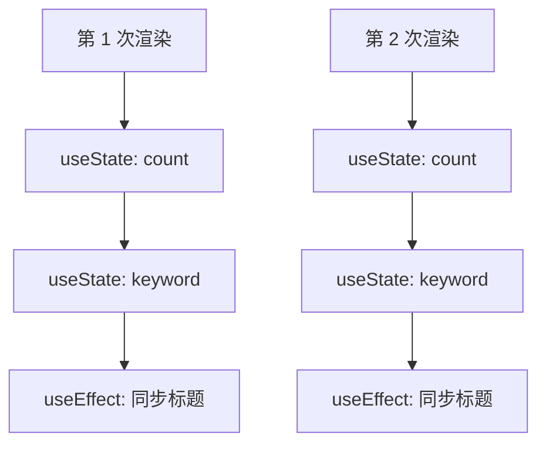
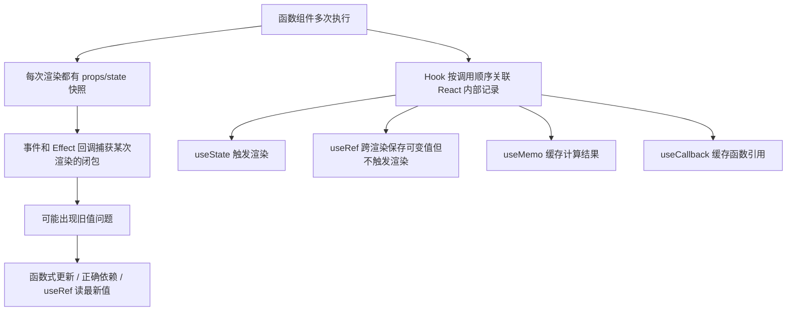

# React - 第 8 课：Hook 心智模型：闭包、引用、useRef 与性能缓存

## 学习目标（本节结束后你能做到什么）

- 理解 Hook 不是普通工具函数，而是 React 用来把状态、引用、Effect 等能力挂到函数组件上的机制。
- 能解释为什么 Hook 必须在组件顶层调用，不能放进条件、循环或普通嵌套函数里。
- 理解“每次渲染都是一次快照”，并能用 JavaScript 闭包解释旧值问题。
- 掌握 `useRef` 的两个核心用途：访问 DOM，以及保存跨渲染但不触发渲染的可变值。
- 能区分 State 和 Ref：什么时候应该触发 UI 更新，什么时候只是保存实例级数据。
- 理解 `useMemo` 和 `useCallback` 的真实作用：缓存计算结果和函数引用，而不是默认性能保险。
- 能判断什么时候需要 memoization，什么时候过早优化会让代码更难维护。

## 内容讲解（核心概念，用类比、例子、图示说清楚）

前面我们已经用了很多 Hook：

```jsx
const [count, setCount] = useState(0);

useEffect(() => {
  document.title = `count: ${count}`;
}, [count]);
```

你可能已经能写出一些功能，但对 Hook 仍然会有几个困惑：

- 为什么 `useState` 不能写在 `if` 里面？
- 为什么函数组件每次执行，State 没有丢？
- 为什么定时器里读到的是旧值？
- 为什么 `useRef` 改了值页面不会更新？
- 为什么有人说不要乱用 `useMemo` 和 `useCallback`？
- 为什么依赖数组总是和闭包问题绑在一起？

这些问题看起来分散，其实根都在一个地方：**React 函数组件是反复执行的，Hook 让 React 能在多次执行之间关联同一个组件的状态和资源。**

这一章我们不急着背 API，而是建立 Hook 的心智模型。

### 1. Hook 到底是什么

Hook 是 React 提供的一类特殊函数。它们让函数组件可以使用 React 的能力，例如：

- `useState`：保存会触发重新渲染的状态。
- `useEffect`：同步外部系统。
- `useRef`：保存跨渲染的可变引用。
- `useMemo`：缓存一次计算结果。
- `useCallback`：缓存一个函数引用。
- `useContext`：读取上下文。
- `useReducer`：用 reducer 组织复杂状态更新。

这些函数都以 `use` 开头，这不是随便命名，而是 React 和相关工具识别 Hook 的约定。

普通函数每次调用完，局部变量就结束了。但函数组件会反复执行，React 需要一种方式知道：

```text
这次渲染里的第一个 useState，对应上次渲染里的哪一份 State？
这次渲染里的 useEffect，对应上次渲染里的哪个 Effect？
这个组件实例自己的 ref 应该保存在哪里？
```

Hook 就是 React 在函数组件多次执行之间保存这些信息的机制。

### 2. 为什么 Hook 必须写在组件顶层

React 有两条非常重要的 Hook 规则：

- 只在 React 函数组件或自定义 Hook 中调用 Hook。
- 只在顶层调用 Hook，不要放进条件、循环、嵌套函数、提前 return 后面。

例如不要这样：

```jsx
function UserPanel({ user }) {
  if (user.isAdmin) {
    const [visible, setVisible] = useState(true);
  }

  return <p>{user.name}</p>;
}
```

也不要这样：

```jsx
function UserList({ users }) {
  for (const user of users) {
    const [selected, setSelected] = useState(false);
  }

  return <div>...</div>;
}
```

原因不是 React 故意限制你，而是 React 需要依赖 Hook 的调用顺序来匹配状态。

可以粗略想象 React 内部给每个组件维护了一串 Hook 记录：

```text
第 1 个 Hook -> count state
第 2 个 Hook -> keyword state
第 3 个 Hook -> effect
第 4 个 Hook -> ref
```

每次组件执行时，React 按顺序读取这些 Hook。

如果你把 Hook 写在条件里，某次渲染条件成立，调用了 4 个 Hook；下一次条件不成立，只调用了 3 个 Hook。顺序乱了，React 就不知道“第 2 个 Hook”到底对应哪个旧状态。

### 图示：Hook 依赖调用顺序



只要每次调用顺序一致，React 就能稳定匹配。

### 3. 条件逻辑应该放到 Hook 里面，而不是把 Hook 放到条件里面

如果确实需要条件逻辑，可以这样写：

```jsx
function UserPanel({ user }) {
  const [visible, setVisible] = useState(true);

  if (!user.isAdmin) {
    return <p>{user.name}</p>;
  }

  return (
    <section>
      <button onClick={() => setVisible(!visible)}>
        切换管理面板
      </button>
      {visible && <AdminPanel />}
    </section>
  );
}
```

Hook 仍然在顶层调用，条件只控制后面的渲染。

Effect 也是一样。不要把 `useEffect` 放进条件里：

```jsx
if (enabled) {
  useEffect(() => {
    start();
    return stop;
  }, []);
}
```

应该把条件写进 Effect 内部：

```jsx
useEffect(() => {
  if (!enabled) {
    return;
  }

  start();

  return () => {
    stop();
  };
}, [enabled]);
```

这样 Hook 调用顺序稳定，但副作用逻辑仍然可以根据条件决定是否执行。

### 4. 每次渲染都是一次快照

第 4 课和第 5 课我们已经多次提到快照。现在把它讲得更明确一点。

函数组件每次渲染，都会拿到那一次渲染对应的 props 和 state。

```jsx
function Counter() {
  const [count, setCount] = useState(0);

  function handleAlert() {
    setTimeout(() => {
      alert(count);
    }, 3000);
  }

  return (
    <>
      <button onClick={() => setCount(count + 1)}>加一</button>
      <button onClick={handleAlert}>三秒后提示</button>
    </>
  );
}
```

如果当前 `count` 是 0，你点击“三秒后提示”，然后连续点几次“加一”。三秒后弹出的可能仍然是 0。

这不是 React 的 bug，而是 JavaScript 闭包的自然结果：

- `handleAlert` 是在 `count = 0` 那次渲染中创建的。
- `setTimeout` 回调捕获了那次渲染里的 `count`。
- 后续 `count` 更新，会产生新的渲染和新的 `count`，但不会改变旧回调已经捕获的变量。

可以这样想：

```text
第 1 次渲染：count = 0，创建 handleAlert#1
点击 handleAlert#1：定时器捕获 count = 0
第 2 次渲染：count = 1，创建 handleAlert#2
第 3 次渲染：count = 2，创建 handleAlert#3
定时器触发：执行旧的 handleAlert#1 里的回调，看到 count = 0
```

每次渲染都是一张照片。旧照片不会因为你后来又拍了新照片而变化。

### 5. 闭包旧值不一定是坏事

闭包旧值不是 React 的缺陷。有时候它正是你想要的行为。

比如你点击“发送消息”时，希望提交的是点击那一刻输入框里的内容。即使后面用户又改了输入框，已经发出去的请求也应该使用当时的值。

```jsx
function MessageForm() {
  const [text, setText] = useState("");

  async function handleSubmit() {
    const submittedText = text;
    await sendMessage(submittedText);
  }

  return (
    <form onSubmit={handleSubmit}>
      <input
        value={text}
        onChange={(event) => setText(event.target.value)}
      />
    </form>
  );
}
```

这里事件处理函数读取当前渲染的 `text` 很合理。

问题通常发生在：

- 定时器
- 订阅回调
- WebSocket 回调
- Promise 回调
- 外部库保存的回调
- 依赖数组故意漏依赖的 Effect

这些回调可能在很久以后执行，而你以为它会自动看到最新 state。

### 6. 解决旧值问题的几种方向

遇到旧值问题，不要机械地加 ref 或禁用依赖检查。先判断你真正需要什么。

#### 6.1 如果是基于旧状态计算新状态，用函数式更新

```jsx
setCount((prev) => prev + 1);
```

这不需要读取外层 `count`，React 会把最新状态传给你。

适合：

- 计数器自增
- 数组追加
- 根据旧对象更新某个字段
- 定时器里周期性更新 state

#### 6.2 如果 Effect 用了某个响应式值，把它放进依赖数组

```jsx
useEffect(() => {
  document.title = `count: ${count}`;
}, [count]);
```

这样 count 变化时，Effect 会重新同步。

#### 6.3 如果需要在异步回调里读最新值，但不想触发渲染，用 ref 保存最新值

```jsx
function CounterLogger() {
  const [count, setCount] = useState(0);
  const latestCountRef = useRef(count);

  useEffect(() => {
    latestCountRef.current = count;
  }, [count]);

  useEffect(() => {
    const id = setInterval(() => {
      console.log(latestCountRef.current);
    }, 1000);

    return () => clearInterval(id);
  }, []);

  return (
    <button onClick={() => setCount((prev) => prev + 1)}>
      {count}
    </button>
  );
}
```

这里定时器只创建一次，但每次打印都能读到最新 `count`。因为 ref 是一个跨渲染保持同一引用的可变对象。

这就进入 `useRef`。

### 7. useRef 是什么

`useRef` 返回一个对象：

```jsx
const ref = useRef(initialValue);
```

这个对象长这样：

```js
{
  current: initialValue
}
```

它有两个关键特征：

- 多次渲染之间，React 会返回同一个 ref 对象。
- 修改 `ref.current` 不会触发组件重新渲染。

这让它很适合保存“组件实例级”的可变值。

可以这样类比：

- State 像会驱动 UI 的业务事实。
- Ref 像组件身上的一个可变口袋，能保存东西，但不会通知 React 重新渲染。

### 8. State 和 Ref 的区别

看一个简单对比：

| 对比项 | State | Ref |
| --- | --- | --- |
| 值变化是否触发重新渲染 | 是 | 否 |
| 是否适合显示到 UI | 是 | 通常否 |
| 是否跨渲染保留 | 是 | 是 |
| 更新方式 | setter | 修改 `.current` |
| 常见用途 | 表单值、开关状态、列表数据 | DOM 引用、定时器 ID、外部实例、最新值缓存 |

判断标准很实用：

**如果这个值变化后，页面应该重新显示不同内容，用 State。否则，如果只是想跨渲染保存一个可变值，可以考虑 Ref。**

例如：

```jsx
function ClickCounter() {
  const countRef = useRef(0);

  function handleClick() {
    countRef.current += 1;
    console.log(countRef.current);
  }

  return <button onClick={handleClick}>点击</button>;
}
```

点击按钮会打印递增数字，但页面不会变。因为 ref 变化不触发渲染。

如果你希望页面显示点击次数，就应该用 State：

```jsx
function ClickCounter() {
  const [count, setCount] = useState(0);

  return (
    <button onClick={() => setCount((prev) => prev + 1)}>
      点击次数：{count}
    </button>
  );
}
```

### 9. useRef 用途一：访问 DOM

最常见的 ref 用途是访问 DOM 节点。

比如点击按钮后聚焦输入框：

```jsx
function SearchBox() {
  const inputRef = useRef(null);

  function focusInput() {
    inputRef.current.focus();
  }

  return (
    <>
      <input ref={inputRef} placeholder="请输入关键词" />
      <button onClick={focusInput}>聚焦输入框</button>
    </>
  );
}
```

这里发生了几件事：

- `useRef(null)` 创建一个 ref 对象。
- `<input ref={inputRef} />` 告诉 React：提交 DOM 后，把真实 input 节点放到 `inputRef.current`。
- 点击按钮时，调用 DOM API `focus()`。

这类场景适合 ref，因为焦点控制是浏览器 DOM API，不是 React 的声明式 UI 本身。

其他常见 DOM ref 场景：

- 播放或暂停视频。
- 读取元素尺寸。
- 滚动到某个位置。
- 与第三方 DOM 库集成。

### 10. useRef 用途二：保存定时器 ID、外部实例等可变值

有时候你需要保存一个值，但它不应该触发 UI 更新。

例如保存定时器 ID：

```jsx
function Stopwatch() {
  const [seconds, setSeconds] = useState(0);
  const intervalRef = useRef(null);

  function start() {
    if (intervalRef.current !== null) {
      return;
    }

    intervalRef.current = setInterval(() => {
      setSeconds((prev) => prev + 1);
    }, 1000);
  }

  function stop() {
    clearInterval(intervalRef.current);
    intervalRef.current = null;
  }

  return (
    <section>
      <p>计时：{seconds}s</p>
      <button onClick={start}>开始</button>
      <button onClick={stop}>停止</button>
    </section>
  );
}
```

`seconds` 用 State，因为它要显示到页面。

`intervalRef` 用 Ref，因为定时器 ID 只是内部资源句柄，不需要显示，也不应该因为它变化触发渲染。

这就是 State 和 Ref 的典型分工。

### 11. 不要滥用 ref 绕开 React 数据流

Ref 很有用，但也容易被滥用。

比如你写一个输入框，却不用受控组件：

```jsx
function UserForm() {
  const nameRef = useRef(null);

  function handleSubmit() {
    console.log(nameRef.current.value);
  }

  return (
    <>
      <input ref={nameRef} />
      <button onClick={handleSubmit}>提交</button>
    </>
  );
}
```

这在某些简单表单里可以，但如果你需要：

- 实时校验
- 根据输入禁用按钮
- 展示错误提示
- 重置表单
- 联动其他字段

受控组件通常更适合，因为输入值本身就是 UI 状态，应该由 State 管理。

一个简单判断：

- 只是提交时读取一次，ref 可以。
- 输入值会影响当前 UI，优先 State。

不要把 ref 当成“不会重新渲染的 state”。如果一个值是业务状态，应该让 React 看到它。

### 12. 渲染期间读写 ref 要谨慎

通常不要在渲染过程中随意读写 `ref.current` 来决定 JSX。

不推荐：

```jsx
function Panel() {
  const countRef = useRef(0);
  countRef.current += 1;

  return <p>{countRef.current}</p>;
}
```

这会让渲染变得不纯。React 可能因为开发模式检查、并发调度等原因多次执行渲染计算。如果渲染中修改 ref，行为就不容易推理。

可以接受的一类例外是惰性初始化一个稳定对象：

```jsx
function ExpensiveInstanceHolder() {
  const instanceRef = useRef(null);

  if (instanceRef.current === null) {
    instanceRef.current = createExpensiveInstance();
  }

  return <p>实例已创建</p>;
}
```

这里每次渲染结果都一致，只有第一次初始化。即便如此，初学阶段也建议优先把外部实例的创建放到 Effect 或事件逻辑里，除非你明确知道为什么要这样写。

### 13. 自定义 Hook：复用有状态逻辑

Hook 还有一个非常重要的能力：把组件里的状态逻辑抽成自定义 Hook。

比如多个组件都需要获取窗口宽度：

```jsx
function useWindowWidth() {
  const [width, setWidth] = useState(window.innerWidth);

  useEffect(() => {
    function handleResize() {
      setWidth(window.innerWidth);
    }

    window.addEventListener("resize", handleResize);

    return () => {
      window.removeEventListener("resize", handleResize);
    };
  }, []);

  return width;
}
```

使用：

```jsx
function ResponsivePanel() {
  const width = useWindowWidth();

  return <p>当前宽度：{width}</p>;
}
```

自定义 Hook 本质上还是函数，但它内部可以调用其他 Hook，所以名字必须以 `use` 开头。这样 React 规则和 lint 工具才能识别它。

自定义 Hook 适合复用“有状态逻辑”，不是复用 UI。复用 UI 用组件，复用状态逻辑用 Hook。

### 14. useMemo：缓存计算结果

`useMemo` 的基本写法：

```jsx
const memoizedValue = useMemo(() => {
  return expensiveCalculation(a, b);
}, [a, b]);
```

它的含义是：

- 第一次渲染时执行计算，得到结果。
- 后续渲染时，如果依赖 `a`、`b` 没变，就复用上一次结果。
- 如果依赖变了，重新计算。

适合场景：

- 计算确实比较昂贵。
- 组件频繁重新渲染。
- 依赖变化频率低于组件渲染频率。

例如：

```jsx
function OrderStats({ orders, status }) {
  const visibleOrders = useMemo(() => {
    return orders
      .filter((order) => status === "all" || order.status === status)
      .sort((a, b) => b.createdAt - a.createdAt);
  }, [orders, status]);

  return <OrderTable orders={visibleOrders} />;
}
```

如果订单量很大，筛选排序又频繁发生，`useMemo` 可能有价值。

但如果只是：

```jsx
const fullName = `${firstName} ${lastName}`;
```

就没必要用 `useMemo`。缓存本身也有成本，会让代码更复杂。

### 15. useMemo 不是语义保证，不要依赖它保证正确性

`useMemo` 应该用于性能优化，而不是让代码“逻辑正确”。

不应该写成：

```jsx
const user = useMemo(() => {
  return { name, role };
}, [name]);
```

如果漏了 `role`，缓存结果就可能是旧的。依赖数组仍然要准确。

更重要的是：即使没有 `useMemo`，代码也应该语义正确，只是可能多算几次。

一个健康判断是：

```text
删掉 useMemo 后，功能是否仍然正确？
如果不正确，说明你在用 useMemo 承担语义职责，而不是性能优化。
```

### 16. useCallback：缓存函数引用

`useCallback` 的基本写法：

```jsx
const handleSubmit = useCallback(() => {
  submitForm(form);
}, [form]);
```

它大致等价于：

```jsx
const handleSubmit = useMemo(() => {
  return () => submitForm(form);
}, [form]);
```

也就是说，`useCallback` 缓存的是函数引用。

但要非常小心：**`useCallback` 不会让函数内部逻辑执行得更快。它只是让这个函数对象在依赖不变时保持同一个引用。**

什么时候有用？

常见场景有两个：

#### 16.1 传给 memoized 子组件，避免子组件因为函数引用变化而重新渲染

```jsx
const UserRow = memo(function UserRow({ user, onEdit }) {
  return (
    <tr>
      <td>{user.name}</td>
      <td>
        <button onClick={() => onEdit(user.id)}>编辑</button>
      </td>
    </tr>
  );
});

function UserTable({ users }) {
  const handleEdit = useCallback((userId) => {
    console.log("edit", userId);
  }, []);

  return (
    <tbody>
      {users.map((user) => (
        <UserRow
          key={user.id}
          user={user}
          onEdit={handleEdit}
        />
      ))}
    </tbody>
  );
}
```

如果 `UserRow` 用了 `memo`，而 `onEdit` 每次父组件渲染都是新函数，`memo` 的效果可能被削弱。`useCallback` 可以让 `onEdit` 引用稳定。

#### 16.2 某个 Effect 依赖这个函数

如果 Effect 里需要调用组件内函数，函数引用每次变会导致 Effect 反复运行。可以先考虑把函数移进 Effect；如果不合适，再考虑 `useCallback`。

```jsx
const createOptions = useCallback(() => {
  return {
    roomId,
    serverUrl: "wss://example.com",
  };
}, [roomId]);

useEffect(() => {
  const connection = createConnection(createOptions());
  connection.connect();

  return () => connection.disconnect();
}, [createOptions]);
```

不过很多时候更简单的是把对象或函数直接写进 Effect 内部：

```jsx
useEffect(() => {
  const options = {
    roomId,
    serverUrl: "wss://example.com",
  };

  const connection = createConnection(options);
  connection.connect();

  return () => connection.disconnect();
}, [roomId]);
```

这通常比为了依赖稳定而加 `useCallback` 更清楚。

### 17. memo、useMemo、useCallback 的关系

这三个名字很像，但职责不同：

| 工具 | 缓存什么 | 典型用途 |
| --- | --- | --- |
| `memo(Component)` | 组件渲染结果的复用判断 | props 没变时跳过子组件重新渲染 |
| `useMemo(fn, deps)` | `fn()` 的计算结果 | 避免昂贵计算重复执行，或稳定对象引用 |
| `useCallback(fn, deps)` | 函数引用 | 传给 memo 子组件，或作为 Effect 依赖 |

它们经常配合使用，但不要默认全上。

一个常见误区是：

```text
组件里每个函数都 useCallback
每个对象都 useMemo
每个子组件都 memo
```

这会让代码噪音变大，而且依赖数组维护成本很高。更糟的是，如果依赖写错，还会引入旧值 bug。

性能优化应该建立在实际问题上，而不是仪式感。

### 18. 引用相等：为什么对象和函数总是“变了”

JavaScript 里对象、数组、函数比较的是引用。

```js
{} === {} // false
[] === [] // false
(() => {}) === (() => {}) // false
```

所以在组件里写：

```jsx
function UserPage() {
  const filters = { status: "active" };

  return <UserTable filters={filters} />;
}
```

每次 `UserPage` 渲染，都会创建一个新的 `filters` 对象。即使内容一样，引用也不一样。

这会影响两个地方：

- 如果 `UserTable` 被 `memo` 包裹，新的对象引用会让它认为 props 变了。
- 如果这个对象放进 Effect 依赖，Effect 会每次运行。

解决方式不一定总是 `useMemo`。可以先考虑：

- 这个对象能不能放到组件外部？
- 能不能只传更原始的值，比如 `status="active"`？
- 能不能在子组件内部创建对象？
- 是否真的存在性能问题？

只有确实需要稳定对象引用时，再使用 `useMemo`：

```jsx
const filters = useMemo(() => {
  return { status: "active" };
}, []);
```

### 19. 过早优化的代价

看两段代码。

简单版本：

```jsx
function UserCard({ user }) {
  const displayName = `${user.name}（${user.role}）`;

  function handleClick() {
    console.log(user.id);
  }

  return <button onClick={handleClick}>{displayName}</button>;
}
```

过度优化版本：

```jsx
function UserCard({ user }) {
  const displayName = useMemo(() => {
    return `${user.name}（${user.role}）`;
  }, [user.name, user.role]);

  const handleClick = useCallback(() => {
    console.log(user.id);
  }, [user.id]);

  return <button onClick={handleClick}>{displayName}</button>;
}
```

第二段不是一定错，但如果没有性能问题，它只是让代码更复杂。

`displayName` 只是字符串拼接，没必要缓存。`handleClick` 也没有传给 memoized 子组件，只是当前按钮自己使用，没必要缓存。

一个实用原则：

**先写直观代码；只有当某个计算昂贵、某个子组件确实因为引用变化频繁重渲染，或者工具定位出瓶颈时，再加 memoization。**

### 20. 依赖数组和闭包：不要骗 React

无论是 `useEffect`、`useMemo` 还是 `useCallback`，依赖数组都不是随便写的。

如果回调里读取了某个响应式值，就应该把它放进依赖数组。

错误写法：

```jsx
const handleSave = useCallback(() => {
  saveUser(userId, form);
}, [userId]);
```

这里读取了 `form`，但依赖里没有 `form`。如果 `form` 变化，`handleSave` 仍然可能拿旧的 `form`。

正确写法：

```jsx
const handleSave = useCallback(() => {
  saveUser(userId, form);
}, [userId, form]);
```

如果你觉得加了 `form` 后函数引用变化太频繁，不要第一反应是漏依赖，而应该重新设计：

- 是否真的需要 `useCallback`？
- 能否把保存逻辑放事件处理函数里，不缓存？
- 能否把表单状态组织得更合理？
- 能否使用函数式更新避免读取旧值？
- 能否把变化频繁的逻辑下放到子组件？

依赖数组是闭包正确性的边界。不要为了“少执行”牺牲正确性。

### 21. useReducer：复杂 State 更新的另一种选择

虽然本章重点不是 `useReducer`，但它也是 Hook 心智模型的一部分。

当一个组件状态更新逻辑变复杂时，多个 `useState` 可能让代码分散：

```jsx
const [loading, setLoading] = useState(false);
const [error, setError] = useState(null);
const [users, setUsers] = useState([]);
const [selectedIds, setSelectedIds] = useState([]);
```

如果这些状态之间有明显的状态机关系，可以考虑 `useReducer`：

```jsx
function reducer(state, action) {
  switch (action.type) {
    case "load_start":
      return { ...state, loading: true, error: null };
    case "load_success":
      return { ...state, loading: false, users: action.users };
    case "load_error":
      return { ...state, loading: false, error: action.error };
    case "toggle_select":
      return {
        ...state,
        selectedIds: state.selectedIds.includes(action.id)
          ? state.selectedIds.filter((id) => id !== action.id)
          : [...state.selectedIds, action.id],
      };
    default:
      return state;
  }
}
```

使用：

```jsx
const [state, dispatch] = useReducer(reducer, {
  loading: false,
  error: null,
  users: [],
  selectedIds: [],
});
```

`useReducer` 的价值是把状态转移逻辑集中起来，更适合复杂交互。它不是替代 `useState` 的默认选择，而是复杂度上来后的组织工具。

### 22. 自定义 Hook 不是共享 State

这是一个很容易误解的点。

如果两个组件都调用同一个自定义 Hook：

```jsx
function ComponentA() {
  const count = useCounter();
}

function ComponentB() {
  const count = useCounter();
}
```

它们不会自动共享同一份 State。每次调用 Hook，都是这个组件自己的 Hook 状态。

自定义 Hook 复用的是逻辑，不是默认共享数据。

如果要共享数据，通常需要：

- 把 State 提升到共同父组件。
- 使用 Context。
- 使用外部状态管理库。
- 使用数据请求缓存库。

这一点和普通函数也类似：两个地方调用同一个函数，不代表它们共享函数内部的局部变量。

### 23. Hook 心智模型总结图

可以把本章内容串成这样：



最核心的主线是：

```text
函数组件不是对象实例，但 React 通过 Hook 给每个组件实例保存跨渲染的数据。
每次渲染是快照，闭包捕获快照。
State 变化驱动 UI，Ref 保存非 UI 可变值。
memoization 是性能工具，不是默认写法。
```

### 24. 写 Hook 代码的自查清单

写复杂组件时，可以用这份清单检查：

1. Hook 是否都在组件或自定义 Hook 顶层调用？
2. 是否有 Hook 被放进条件、循环、嵌套函数或提前 return 后面？
3. 事件处理函数里读到的值，是不是当前这次渲染的快照？
4. 异步回调里如果读 state，是否可能读到旧值？
5. 能用函数式更新解决的问题，是否避免了无谓依赖？
6. 这个值变化后是否需要更新 UI？需要就用 State，不需要再考虑 Ref。
7. `useRef` 是否被用来绕开正常数据流？
8. `useMemo` 缓存的是不是昂贵计算，删掉后功能是否仍然正确？
9. `useCallback` 是否真的传给了 memo 子组件，或者真的用于稳定 Effect 依赖？
10. 依赖数组是否准确表达了闭包里读取的响应式值？

这份清单能帮你避免大部分 Hook 相关问题。

## 小结（3-5 条关键点）

- Hook 让 React 能在函数组件多次执行之间关联状态、Effect、Ref 等内部记录，因此 Hook 调用顺序必须稳定。
- 每次渲染都是一次快照，事件回调和 Effect 回调会捕获创建它们那次渲染里的 props/state。
- `useRef` 可以跨渲染保存可变值，但修改 `.current` 不会触发重新渲染；需要驱动 UI 的值应该用 State。
- `useMemo` 缓存计算结果，`useCallback` 缓存函数引用，它们主要是性能工具，不应该承担业务正确性。
- 依赖数组是闭包正确性的边界，不要为了减少执行次数故意漏依赖。

## 问题 （检测用户对当前章节内容是否了解）

1. 为什么 Hook 不能写在 `if`、循环或普通嵌套函数里？请用“调用顺序”解释。
2. 什么叫“每次渲染都是一次快照”？为什么定时器里可能读到旧的 `count`？
3. State 和 Ref 的核心区别是什么？分别适合保存什么类型的数据？
4. 如果要点击按钮后聚焦输入框，为什么适合用 `useRef`？
5. `useMemo` 和 `useCallback` 分别缓存什么？为什么说它们不应该默认到处加？
6. 为什么 `useCallback` 不会让函数执行更快？它真正稳定的是什么？
7. 如果一个 `useCallback` 里读取了 `form`，但依赖数组没写 `form`，可能出现什么问题？应该怎么排查？
8. 自定义 Hook 复用的是状态本身，还是有状态逻辑？两个组件调用同一个自定义 Hook 会自动共享 State 吗？

请把你的答案直接告诉我。我会根据你的回答判断第 8 课是否掌握，再决定是进入第 9 课，还是先补一节闭包旧值、useRef 和 memoization 边界的强化讲解。
