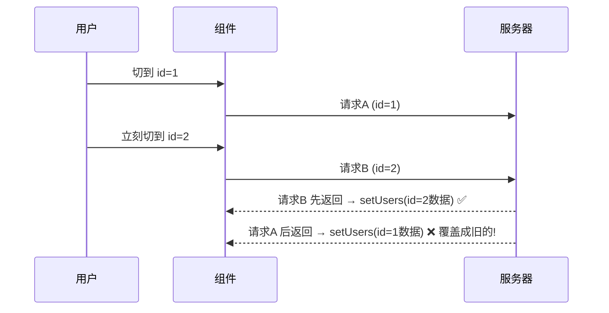
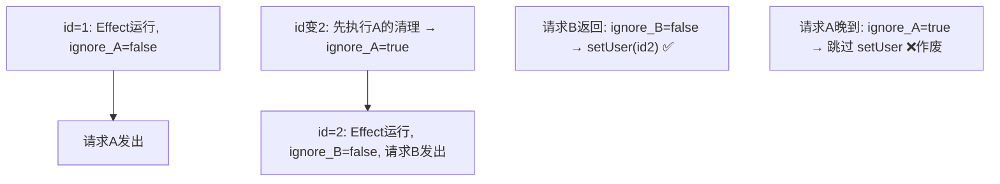
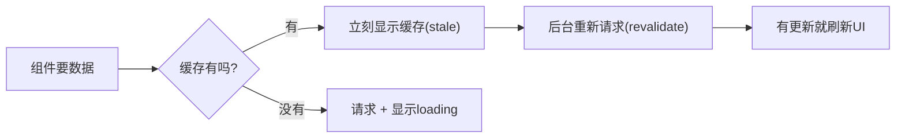
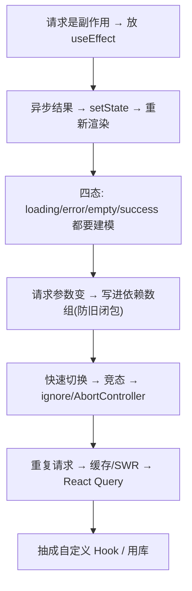

# React - 第 9 课：数据获取与异步 UI，loading、error、竞态与缓存

## 学习目标（本节结束后你能做到什么）

- 理解为什么“在 React 里发请求”不是一句 `fetch` 那么简单，而是个需要专门设计的难题。
- 能把一个异步请求拆成 **loading / error / empty / success 四种状态**，并解释为什么必须显式建模。
- 掌握在 `useEffect` 里发请求的标准写法，以及它和闭包、依赖数组的关系。
- 真正理解**请求竞态（race condition）**：为什么快速切换会让旧数据覆盖新数据，以及怎么用清理函数 / `AbortController` 解决。
- 建立“缓存与重新验证”的直觉，知道 React Query / SWR 这类库到底替你解决了什么。
- 能把数据获取逻辑抽成一个**自定义 Hook**，并应用到搜索、分页这类真实场景。

> 前置衔接：本课大量用到「前端基础」第 7 课（异步：Promise/async/await/事件循环）和第 6 课（闭包、旧闭包），以及 React 第 5 课（useEffect）、第 8 课（Hook 心智模型）。如果对 `await`、旧闭包还不熟，建议先回看那两课，否则本课的“竞态”会比较吃力。

## 内容讲解（核心概念，用类比、例子、图示说清楚）

### 1. 为什么“数据获取”在 React 里是个专门的难题

在后端，你取数据很直接：调一个方法、等它返回、拿到结果继续往下。它是**同步思维**的——一行代码一个结果。

但在 React 里发请求，三件事叠在一起，难度陡增：

1. **它是异步的**：请求要等几百毫秒（前端基础第 7 课），这期间页面不能卡，得先显示“加载中”。
2. **它发生在声明式的世界里**：React 的核心是 `UI = f(state)`（第 1 课）。请求结果不是“塞进某个 DOM”，而是要变成 **state**，再由 state 驱动 UI。所以请求的本质动作是：**异步拿到数据 → `setState` → 触发重新渲染**。
3. **它和组件生命周期纠缠**：组件会挂载、更新、卸载；请求可能在组件已经没了之后才回来；用户可能在上一个请求没回来时就触发了下一个。这些时序问题，是数据获取真正的坑。

所以“在 React 里取数据”不是把后端那套同步思维搬过来，而是要专门处理：**怎么表达中间态、怎么把结果变成 state、怎么应对时序混乱。** 这一课就是系统地解决这三件事。

### 2. 四种状态：把异步的“过程”显式建模

一个请求不是只有“成功”一个结果。回忆「前端基础」第 8 课命令式待办列表的痛——状态不显式管理就会乱。在 React 里，一次数据获取至少有**四种 UI 状态**，你必须把它们都想到：

| 状态 | 含义 | 对应 Promise | UI 应该显示 |
| --- | --- | --- | --- |
| loading | 请求进行中 | pending | 骨架屏 / 加载动画 |
| error | 请求失败 | rejected | 错误提示 + 重试按钮 |
| empty | 成功但数据为空 | fulfilled（空数组） | “暂无数据”空态 |
| success | 成功且有数据 | fulfilled（有数据） | 正常渲染列表 |

**为什么必须四态都建模？** 因为新手最常犯的错，就是只写 success：

```jsx
// ❌ 只考虑成功态
function UserList() {
  const [users, setUsers] = useState([]);
  useEffect(() => {
    fetchUsers().then(setUsers);
  }, []);
  return <ul>{users.map(u => <li key={u.id}>{u.name}</li>)}</ul>;
}
```

这段代码的问题：

- 请求那几百毫秒里，页面是**空白**的——用户以为页面坏了。
- 请求**失败**时，`users` 还是 `[]`，页面显示“空列表”，用户根本不知道是出错了。
- 接口**真的返回空**和**出错了**，UI 表现一模一样，无法区分。

好的体验必须让这四种状态各有各的样子。第 3、4 节给出标准写法。

### 3. 在 useEffect 里发请求的标准写法

回忆 React 第 5 课：**请求是副作用，应该放在 `useEffect` 里**，不能在渲染过程中直接发（渲染要保持纯净）。标准结构是：

```jsx
function UserList() {
  const [users, setUsers] = useState([]);
  const [loading, setLoading] = useState(true);
  const [error, setError] = useState(null);

  useEffect(() => {
    async function load() {
      setLoading(true);
      setError(null);
      try {
        const data = await fetchUsers();   // 前端基础第7课的 fetch+await
        setUsers(data);
      } catch (err) {
        setError(err);                      // 失败兜到 error 状态
      } finally {
        setLoading(false);                  // 无论成败都结束 loading
      }
    }
    load();
  }, []);   // 空依赖：只在挂载时请求一次

  if (loading) return <Spinner />;
  if (error) return <ErrorTip onRetry={...} />;
  if (users.length === 0) return <Empty />;
  return <ul>{users.map(u => <li key={u.id}>{u.name}</li>)}</ul>;
}
```

几个关键点：

- **为什么把 async 函数定义在 Effect 内部再调用？** 因为 `useEffect` 的回调本身不能是 async 函数（async 函数返回 Promise，而 Effect 回调的返回值被 React 当作“清理函数”，类型对不上）。所以标准做法是在里面定义一个 async 函数 `load` 再调用它。
- **`try/catch/finally` 三段**：成功 `setUsers`、失败 `setError`、`finally` 里关 loading——这是「前端基础」第 7 课那个请求骨架的 React 版。
- **渲染部分按状态分支返回**：loading → error → empty → success，顺序就是“先排除异常情况，最后渲染正常内容”。这种早返回（early return）让每种状态的 UI 清清楚楚。

### 4. 用一个 status 状态机收敛多个布尔

上面用了 `loading` 和 `error` 两个布尔。状态一多，布尔组合会出现“非法状态”——比如 `loading=true` 同时 `error` 有值，逻辑上不该发生，但类型上允许。更稳的做法是用一个**字面量联合类型的 status**（呼应「前端基础」第 9 课的 `"idle" | "loading" | ...`）：

```tsx
type Status = "idle" | "loading" | "success" | "error";

function UserList() {
  const [status, setStatus] = useState<Status>("idle");
  const [users, setUsers] = useState<User[]>([]);
  const [error, setError] = useState<Error | null>(null);

  useEffect(() => {
    async function load() {
      setStatus("loading");
      try {
        const data = await fetchUsers();
        setUsers(data);
        setStatus("success");
      } catch (err) {
        setError(err as Error);
        setStatus("error");
      }
    }
    load();
  }, []);

  switch (status) {
    case "loading": return <Spinner />;
    case "error":   return <ErrorTip error={error} />;
    case "success": return users.length ? <List users={users} /> : <Empty />;
    default:        return null;
  }
}
```

`status` 在任一时刻只能是一个值，**不可能同时 loading 又 error**，非法状态从源头被排除。这就是“用状态机思维管理异步 UI”——它把第 2 节那张四态表，编码成了代码里一个明确的、互斥的状态字段。

### 5. 旧闭包与依赖数组：请求里的隐藏陷阱

回忆「前端基础」第 6 课的“旧闭包”和 React 第 8 课的“快照”：**Effect 回调是个闭包，它捕获的是某一次渲染时的 props/state。** 这在数据获取里会埋雷。

设想列表页根据一个 `page`（页码）请求：

```jsx
useEffect(() => {
  async function load() {
    const data = await fetchUsers(page);   // 这里的 page 是哪一次的？
    setUsers(data);
  }
  load();
}, [page]);   // 依赖 page：page 变就重新请求
```

依赖数组写 `[page]` 是对的——`page` 变了，Effect 重新执行，用新的 `page` 发请求。**但如果你漏写 `page`（写成 `[]`）**，那么 Effect 只在挂载时跑一次，里面那个 `page` 永远是第一次渲染的旧值（旧闭包），翻页就失效了。

所以请记住第 8 课那条原则在数据获取里的具体表现：**Effect 里读了哪个会变的值（page、搜索词、id），就必须把它写进依赖数组**，否则会用到过期的值。依赖数组在这里的语义就是：“这些请求参数变了，就重新发请求。”

### 6. 请求竞态（race condition）：数据获取最难的坑

这是本课的重头戏，也是只写 success 的代码永远不会注意到、但线上一定会出问题的地方。

**场景**：详情页根据 `id` 请求。用户快速从 id=1 切到 id=2。于是发了两个请求：

- 请求 A（id=1）先发出。
- 请求 B（id=2）后发出。

问题在于：**网络是不保证顺序的**（回忆「前端基础」第 7 课，异步完成时间不定）。完全可能请求 B 先回来、请求 A 后回来：



结果：界面停在 id=2，**显示的却是 id=1 的数据**。这就是竞态——后发的请求被先发的、晚到的请求覆盖了。这种 bug 极其隐蔽，偶发、难复现，但用户搜索/翻页快一点就会撞上。

**解法一：清理函数 + 忽略过期响应（最常用）**

利用 React 第 5 课的 **Effect 清理函数**：每次 Effect 重新执行前，React 会先调用上一次的清理函数。我们用一个 `ignore` 标志，把“上一个请求的结果”作废：

```jsx
useEffect(() => {
  let ignore = false;        // 本次 Effect 的“是否作废”标志

  async function load() {
    const data = await fetchUser(id);
    if (!ignore) {            // 只有没被作废，才更新 state
      setUser(data);
    }
  }
  load();

  return () => {
    ignore = true;           // 清理：id 变了/组件卸载时，把本次请求标记作废
  };
}, [id]);
```

原理：每个 Effect 执行都有自己的闭包，各自捕获自己的 `ignore`。当 `id` 从 1 变成 2，React 先执行**请求 A 那次** Effect 的清理函数，把 A 的 `ignore` 置为 `true`。于是即使请求 A 的响应晚到了，`if (!ignore)` 也为假，**它的 `setUser` 被跳过**，不会覆盖请求 B 的结果。



这套“`let ignore` + 清理置 true + `if (!ignore)` 才 setState”是**处理竞态的标准模式**，务必记住。它正是「前端基础」第 6 课旧闭包知识的正向运用——每个闭包捕获自己那次的标志。

**解法二：AbortController 真正取消请求**

`ignore` 只是“忽略结果”，请求其实还在跑。更彻底的是用 `AbortController` **真的中止**网络请求：

```jsx
useEffect(() => {
  const controller = new AbortController();

  async function load() {
    try {
      const res = await fetch(`/api/users/${id}`, { signal: controller.signal });
      const data = await res.json();
      setUser(data);
    } catch (err) {
      if (err.name === "AbortError") return;   // 被取消的请求，正常忽略
      setError(err);
    }
  }
  load();

  return () => controller.abort();   // 清理：中止上一个请求
}, [id]);
```

`controller.abort()` 会让那个 `fetch` 抛出 `AbortError`，我们在 catch 里识别并忽略它。这样旧请求被真正取消，既解决竞态，又省掉无谓的网络流量。两种方案都行——`ignore` 简单通用，`AbortController` 更彻底。

### 7. 重复请求与缓存：为什么需要、思路是什么

到这里，单个请求的正确性解决了。但真实应用还有效率问题：

- 用户在列表页和详情页之间来回切，每次回到列表都**重新请求一次**——同样的数据反复拉，慢且浪费。
- 多个组件都要“当前用户信息”，各自发一遍请求。

理想做法是**缓存**：请求过的数据先存起来，下次直接用缓存，同时在后台悄悄重新验证（拿最新的）。这套策略有个名字叫 **stale-while-revalidate（SWR）**：先把旧的（stale）缓存立刻显示出来，同时在后台 revalidate（重新请求），拿到新数据再更新。用户既不用等，又能看到最新数据。



自己实现这套缓存、去重、重新验证、失效，很复杂（要管缓存键、过期时间、并发去重、窗口聚焦重新拉取……）。所以社区把它做成了库——这就引出下一节。

### 8. React Query / SWR：把这些都封装掉

**React Query（现叫 TanStack Query）** 和 **SWR** 是专门解决“服务端数据获取”的库。它们把前面所有麻烦——loading/error 状态、竞态、缓存、去重、重新验证、重试——全封装成一个 Hook：

```jsx
import { useQuery } from "@tanstack/react-query";

function UserList() {
  const { data, isLoading, error } = useQuery({
    queryKey: ["users"],            // 缓存键
    queryFn: () => fetchUsers(),    // 怎么取数据
  });

  if (isLoading) return <Spinner />;
  if (error) return <ErrorTip />;
  return <List users={data} />;
}
```

对比第 3 节那一大段手写：竞态、缓存、loading/error，全没了——库都替你管了。`queryKey: ["users"]` 是缓存键，相同 key 的请求自动去重、共享缓存；数据自动缓存、自动在窗口重新聚焦时 revalidate。

这引出一个重要的概念区分，会在第 11 课（状态管理）展开：

- **客户端状态（client state）**：弹窗开关、表单输入、当前选中——只属于前端、由用户交互产生。用 `useState` 管。
- **服务端状态（server state）**：来自后端、前端只是它的缓存副本——用户列表、订单详情。用 React Query 这类工具管。

**新手期的建议**：先把第 3-6 节的**手写方式彻底搞懂**（这是地基，面试也常问竞态），再在真实项目里用 React Query 提效。不要一上来只会用库，否则遇到 bug 不知道底层发生了什么。理解了手写版，你才知道库帮你挡掉了什么。

### 9. 把数据获取抽成自定义 Hook

回忆 React 第 8 课的自定义 Hook：复用的是“有状态的逻辑”。数据获取逻辑天生适合抽成 Hook，让组件保持干净：

```jsx
// 自定义 Hook：把“取用户列表”的全部逻辑封进去
function useUsers() {
  const [users, setUsers] = useState([]);
  const [status, setStatus] = useState("loading");

  useEffect(() => {
    let ignore = false;
    async function load() {
      setStatus("loading");
      try {
        const data = await fetchUsers();
        if (!ignore) { setUsers(data); setStatus("success"); }
      } catch {
        if (!ignore) setStatus("error");
      }
    }
    load();
    return () => { ignore = true; };
  }, []);

  return { users, status };
}

// 组件变得极简，只关心“拿到什么、怎么显示”
function UserList() {
  const { users, status } = useUsers();
  if (status === "loading") return <Spinner />;
  if (status === "error") return <ErrorTip />;
  return <List users={users} />;
}
```

好处：竞态处理、状态管理都收进 Hook，组件只剩“按状态渲染”。这其实就是 React Query 的雏形——它无非是把这个 `useUsers` 做得更通用、更强大。

### 10. 真实业务：搜索 + 分页 + 防抖

把这一课用到一个最常见的后台场景——带搜索和分页的列表：

```jsx
function UserTable() {
  const [keyword, setKeyword] = useState("");
  const [page, setPage] = useState(1);
  const [users, setUsers] = useState([]);
  const [status, setStatus] = useState("idle");

  useEffect(() => {
    let ignore = false;
    async function load() {
      setStatus("loading");
      try {
        const data = await fetchUsers({ keyword, page });
        if (!ignore) { setUsers(data); setStatus("success"); }
      } catch {
        if (!ignore) setStatus("error");
      }
    }
    load();
    return () => { ignore = true; };   // keyword/page 变化时作废上一次（防竞态）
  }, [keyword, page]);   // 搜索词或页码变 → 重新请求

  return (
    <div>
      <input value={keyword} onChange={e => { setKeyword(e.target.value); setPage(1); }} />
      {/* ...表格、分页... */}
    </div>
  );
}
```

两个细节体现了这一课的所有要点：

- **依赖数组 `[keyword, page]`**：任一变化都重新请求（第 5 节）。搜索词改变时同时 `setPage(1)`（搜索要回到第一页，否则可能停在不存在的页）。
- **`ignore` 清理**：用户快速打字，每个字符都触发请求，旧请求晚到不会覆盖新结果（第 6 节竞态）。

还有一个性能问题：用户每打一个字就发一次请求，太频繁。解法是**防抖（debounce）**——等用户停止输入一小段时间（如 300ms）再发请求。防抖的实现要用到第 8 课的 `useRef` 存定时器，这里先点出概念，第 13 课（与后端协作）会专门讲搜索防抖。

### 11. 收束：数据获取的心智模型



记住一条主线：**在 React 里取数据，不是“调接口”，而是“把一个异步过程，安全地映射成驱动 UI 的状态”。** loading 要让用户安心、error 要可重试、empty 要有交代、竞态要被挡住——这些都不是锦上添花，而是“能用的页面”的及格线。

## 小结（关键点）

- 在 React 里发请求难，是因为三件事叠加：**异步、声明式（结果要变成 state）、和组件生命周期纠缠**。请求的本质动作是“异步拿数据 → setState → 重新渲染”。
- 一次请求至少有 **loading / error / empty / success 四态**，必须显式建模；只写 success 会让用户面对空白页和无声失败。用字面量 `status` 状态机可排除非法状态。
- 请求放在 `useEffect` 里，用“内部定义 async 函数再调用 + try/catch/finally”的标准结构；**请求参数（page/keyword/id）必须写进依赖数组**，否则旧闭包会用过期值。
- **竞态**是最隐蔽的坑：快速切换时旧请求晚到会覆盖新数据。用 **`let ignore` + 清理函数置 true + `if (!ignore)` 才 setState** 解决，或用 **`AbortController`** 真正取消请求。
- 重复请求用**缓存 + stale-while-revalidate** 优化；**React Query / SWR** 把 loading/error/竞态/缓存/去重全封装，对应“服务端状态”的管理。
- 把数据获取抽成**自定义 Hook**，组件只负责按状态渲染；新手应先吃透手写版，再用库提效。

## 问题 （检测用户对当前章节内容是否了解）

1. 为什么说“在 React 里发请求”比后端取数据难？请求在 React 里的本质动作是什么（用 `UI = f(state)` 解释）？
2. 一次数据获取有哪四种状态？只写 success 态会带来哪两个具体的糟糕体验？
3. 为什么 `useEffect` 的回调不能直接写成 async 函数？标准写法是怎么绕过的？
4. 一个详情页根据 `id` 请求，依赖数组应该写什么？如果漏写 `id`、写成 `[]`，会发生什么？用“旧闭包”解释。
5. 用你自己的话讲清楚“请求竞态”是怎么发生的，画或描述一下时序。
6. `let ignore = false` + 清理函数 + `if (!ignore)` 这套是怎么解决竞态的？为什么每个 Effect 的 `ignore` 互不干扰？
7. `AbortController` 和 `ignore` 方案有什么区别？各自的优点是什么？
8. 什么是 stale-while-revalidate？React Query 这类库主要替你解决了哪些问题？“客户端状态”和“服务端状态”有什么区别？

请把你的答案直接告诉我。我会根据你的回答判断第 9 课是否掌握，再决定是进入第 10 课（路由与页面组织），还是先补一节竞态与清理函数的强化讲解。
