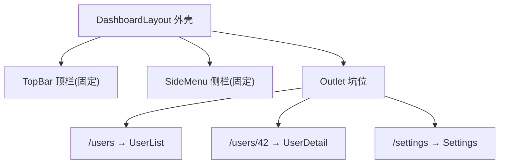
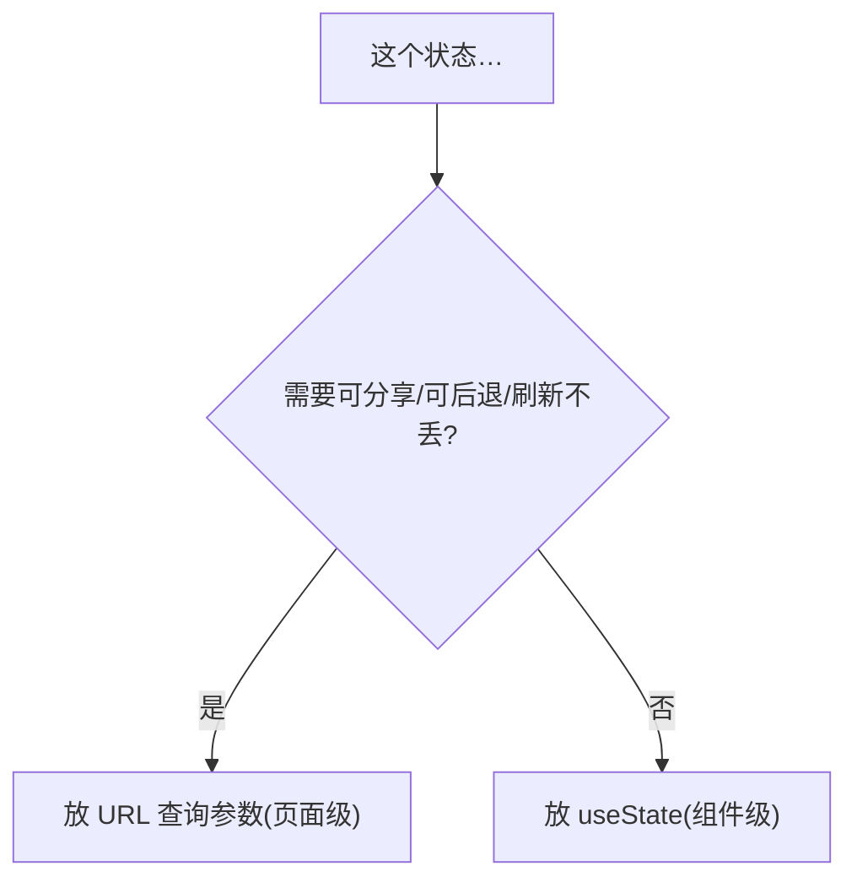
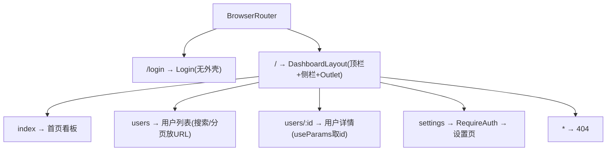

# React - 第 10 课：路由与页面组织，SPA、Layout、权限与嵌套路由

## 学习目标（本节结束后你能做到什么）

- 说清楚“前端路由”是什么、它和你熟悉的后端路由有什么本质区别。
- 理解 SPA 里“切换页面不刷新”是怎么做到的（呼应「前端基础」第 1 课的 SPA 模型）。
- 掌握 React Router 的核心：`Routes`/`Route`/`Link`/`useParams`/`useNavigate`。
- 会用**嵌套路由 + Layout** 组织一个有侧边栏/顶栏的后台系统。
- 会实现**权限路由（受保护路由）**，并理解它和后端拦截器的异同。
- 分清**页面级状态**和**组件级状态**，知道路由参数也是一种状态来源。
- 了解路由级**代码分割（懒加载）**，知道它解决什么性能问题。

> 前置衔接：本课建立在「前端基础」第 1 课（SPA、浏览器模型）和 React 第 6 课（组件通信、组合）之上。注意：React 本身**不内置路由**，路由是第三方库的事，最主流的是 **React Router**，本课以它为例。

## 内容讲解（核心概念，用类比、例子、图示说清楚）

### 1. 后端工程师看“前端路由”，最容易困惑在哪

你对“路由”这个词不陌生——后端的路由是把 URL 映射到 handler：

```text
GET /users      → UserController.list()
GET /users/:id  → UserController.detail()
```

每次请求一个 URL，服务器查路由表，找到对应 handler，**生成一个新的 HTML 页面返回**，浏览器整页刷新。这是“后端路由”，也是「前端基础」第 1 课讲的“传统多页应用”。

**前端路由是另一回事。** 在 SPA 里（前端基础第 1 课），浏览器**只加载一次** HTML 外壳，之后切换“页面”时**不再向服务器要新 HTML**，而是由 JavaScript 在前端**根据当前 URL，决定渲染哪个组件**，并用第 8 课讲的方式改 DOM。整个过程**地址栏变了，但页面没有整页刷新**。

```mermaid
flowchart TD
    subgraph 后端路由（多页应用）
        A1["点链接"] --> A2["向服务器请求新URL"] --> A3["服务器返回新HTML"] --> A4["整页刷新"]
    end
    subgraph 前端路由（SPA）
        B1["点链接"] --> B2["拦截，不发请求"] --> B3["改地址栏 + 渲染对应组件"] --> B4["局部更新，无刷新"]
    end
```

所以困惑点在于：**同样叫“路由”，后端路由决定“服务器返回什么 HTML”，前端路由决定“前端渲染哪个组件”。** 一个在服务端、整页刷新；一个在客户端、无刷新切换。理解了这个区别，下面就好懂了。

### 2. 前端路由的底层：URL 变了但不刷新，怎么做到的

前端路由靠浏览器提供的 **History API**（`history.pushState`）实现：JavaScript 可以**修改地址栏的 URL，但不触发浏览器向服务器发请求**。React Router 帮你做了三件事：

1. **拦截链接点击**：你点 `<Link to="/users">`，它阻止默认跳转（回忆「前端基础」第 8 课 `preventDefault`），改用 `pushState` 改地址栏。
2. **监听 URL 变化**：地址栏一变，它就知道了。
3. **匹配并渲染**：拿当前 URL 去匹配你配置的路由表，渲染对应的组件。


你不需要自己碰 History API，React Router 封装好了。但知道“前端路由 = 用 JS 操纵地址栏 + 按 URL 渲染组件”这个本质，能让你看穿它。

### 3. React Router 的核心积木

先装：`npm install react-router-dom`（回忆「前端基础」第 10 课 npm）。最小的路由配置：

```jsx
import { BrowserRouter, Routes, Route, Link } from "react-router-dom";

function App() {
  return (
    <BrowserRouter>
      {/* 导航：用 Link，不是 <a>（<a> 会整页刷新！） */}
      <nav>
        <Link to="/">首页</Link>
        <Link to="/users">用户</Link>
        <Link to="/settings">设置</Link>
      </nav>

      {/* 路由表：当前URL匹配哪个path，就渲染哪个element */}
      <Routes>
        <Route path="/" element={<Home />} />
        <Route path="/users" element={<UserList />} />
        <Route path="/settings" element={<Settings />} />
        <Route path="*" element={<NotFound />} />  {/* 兜底404 */}
      </Routes>
    </BrowserRouter>
  );
}
```

四个核心积木：

- **`BrowserRouter`**：路由的总开关，包在最外层，提供整个路由环境。
- **`Routes` + `Route`**：路由表。`Route` 把一个 `path` 映射到一个 `element`（组件）。`path="*"` 是兜底，匹配不到时显示 404。
- **`Link`**：导航链接。**关键：用 `Link` 而不是原生 `<a>`**——`<a>` 会触发浏览器整页刷新（回到后端路由模式），`Link` 才是 SPA 的无刷新跳转。

这就是路由的骨架：一个 URL 进来，`Routes` 从上到下找第一个匹配的 `Route`，渲染它的 `element`。和后端路由表查找是同一个直觉，只是结果是“渲染组件”而非“返回 HTML”。

### 4. 路由参数与查询参数：URL 也是一种状态

详情页的 URL 通常带 id，比如 `/users/42`。这种**动态段**用 `:参数名` 声明，组件里用 `useParams` 读：

```jsx
// 路由表里声明动态段
<Route path="/users/:id" element={<UserDetail />} />

// 组件里读取
import { useParams } from "react-router-dom";

function UserDetail() {
  const { id } = useParams();   // URL 是 /users/42 → id === "42"
  // 拿 id 去请求详情（接上第9课的数据获取）
  useEffect(() => {
    let ignore = false;
    fetchUser(id).then(data => { if (!ignore) setUser(data); });
    return () => { ignore = true; };
  }, [id]);   // id 变就重新请求，依赖数组 + 竞态处理（第9课）
}
```

**查询参数**（`?keyword=张三&page=2`）用 `useSearchParams`：

```jsx
import { useSearchParams } from "react-router-dom";

function UserList() {
  const [searchParams, setSearchParams] = useSearchParams();
  const keyword = searchParams.get("keyword") ?? "";
  const page = Number(searchParams.get("page") ?? 1);

  // 改查询参数 = 改 URL（可被收藏、可后退）
  setSearchParams({ keyword: "李四", page: "1" });
}
```

这里有个重要观念：**URL 本身就是一种状态来源。** 把搜索词、页码放进 URL（查询参数）而不是只放 `useState`，有几个好处：

- **可分享、可收藏**：把链接发给同事，他打开看到的是同样的筛选结果。
- **可前进后退**：浏览器的后退按钮能回到上一个筛选状态。
- **刷新不丢**：刷新页面，筛选条件还在。

这是“页面级状态”的典型——第 8 节会展开。后端类比：URL 的 path 参数像 `@PathVariable`，查询参数像 `@RequestParam`，概念是通的。

### 5. 编程式导航：用代码跳转

`Link` 是用户点击跳转，但很多场景要**代码触发跳转**——比如登录成功后跳到首页、删除后跳回列表。用 `useNavigate`：

```jsx
import { useNavigate } from "react-router-dom";

function LoginForm() {
  const navigate = useNavigate();

  async function handleLogin() {
    await login();
    navigate("/dashboard");        // 跳转到首页
    // navigate(-1);                // 后退一步（等于浏览器后退）
    // navigate("/users", { replace: true });  // 替换当前历史（登录页常用，防止后退回登录页）
  }
}
```

`replace: true` 值得注意：登录成功后跳转用它，可以**替换**掉历史里的登录页，这样用户点后退不会又回到登录页。这种细节是真实项目里的体验打磨点。

### 6. 嵌套路由与 Layout：组织后台系统的骨架

真实后台系统不是一堆平级页面，而是**共享一个外壳**：顶部有导航栏、左侧有侧边菜单，只有中间的内容区随路由变化。如果每个页面都自己写一遍顶栏侧栏，既重复又难维护。

**嵌套路由**就是为此而生：父路由提供 Layout（外壳），子路由的内容渲染进 Layout 里的一个“坑”——这个坑用 `<Outlet />` 标记。

```jsx
function App() {
  return (
    <BrowserRouter>
      <Routes>
        {/* 父路由：提供 Layout 外壳 */}
        <Route path="/" element={<DashboardLayout />}>
          {/* 子路由：渲染进 Layout 的 Outlet */}
          <Route index element={<Home />} />            {/* path="/" 默认页 */}
          <Route path="users" element={<UserList />} />  {/* /users */}
          <Route path="users/:id" element={<UserDetail />} /> {/* /users/42 */}
          <Route path="settings" element={<Settings />} />
        </Route>
        <Route path="/login" element={<Login />} />     {/* 登录页不要外壳 */}
      </Routes>
    </BrowserRouter>
  );
}

// Layout：固定外壳 + 一个 Outlet 坑位
import { Outlet } from "react-router-dom";

function DashboardLayout() {
  return (
    <div className="layout">
      <TopBar />
      <SideMenu />
      <main>
        <Outlet />   {/* 子路由的内容渲染到这里 */}
      </main>
    </div>
  );
}
```



切换 `/users` 和 `/settings` 时，**顶栏和侧栏不重新渲染、不刷新**，只有 `<Outlet />` 里的内容变。这正是后台系统该有的体验。`<Outlet />` 本质是 React 第 6 课讲的 `children`/组合思想在路由层的应用——父组件留一个插槽，路由系统把匹配的子页面填进去。

嵌套可以多层：`/users` 下还能再有 `/users/:id/orders`，对应更深的 Outlet。这让你能按“页面层级”自然地组织复杂应用。

### 7. 权限路由：受保护的页面

后台系统里，很多页面要登录后、甚至特定角色才能访问。这对应后端的**鉴权拦截器/中间件**。前端的做法是包一层“守卫组件”：

```jsx
import { Navigate } from "react-router-dom";

// 守卫组件：检查登录态，没登录就重定向到登录页
function RequireAuth({ children }) {
  const isLoggedIn = useAuth();   // 从全局状态/Context 读登录态（第11课）

  if (!isLoggedIn) {
    return <Navigate to="/login" replace />;   // 重定向
  }
  return children;   // 已登录，正常渲染被保护的内容
}

// 用守卫包住需要保护的路由
<Route
  path="/settings"
  element={
    <RequireAuth>
      <Settings />
    </RequireAuth>
  }
/>
```

`<Navigate to="/login" />` 是声明式重定向——渲染它就等于跳转。这是 React 声明式思想（第 1 课）在路由的体现：你不“命令跳转”，而是“根据状态渲染一个会导致跳转的东西”。

**和后端拦截器的关键区别（重要安全认知）**：前端的权限路由**只是体验层的控制，不是安全边界**。它能挡住“普通用户看到管理页面”，但**挡不住有心人**——前端代码、接口都在用户手里，他可以绕过前端直接调你的接口。所以：

> **前端权限控制用于体验（该看到什么菜单、能进哪个页面），真正的安全必须由后端在每个接口上校验。** 前端路由守卫 ≠ 后端鉴权，两者都要做，但后端那道才是真防线。

这一点后端工程师特别容易想当然，务必记牢。

### 8. 页面级状态 vs 组件级状态

学路由顺带要建立一个状态归属的判断（呼应第 6 课“谁该拥有状态”）：

- **组件级状态**：只影响一个组件的临时状态。比如一个下拉框开没开、一个输入框的值。用 `useState`，放在组件内部。
- **页面级状态**：影响整个页面、且适合反映在 URL 里的状态。比如列表的搜索词、页码、排序、当前 tab。**优先放进 URL 查询参数**（第 4 节），而不是只用 `useState`。



判断标准：**“如果我把这个链接发给别人，他应该看到一样的东西吗？”** 是 → 放 URL；否 → 放组件 state。比如“搜索结果第 2 页”应该可分享（放 URL），但“某个下拉菜单展开了”不需要（放 state）。这个判断能让你的页面更符合用户对浏览器（前进后退、收藏、刷新）的预期。

### 9. 路由级代码分割：懒加载页面

回忆「前端基础」第 10 课：构建工具会把代码打包。如果把所有页面打成一个大文件，用户首次打开要下载**整个应用**的代码，即使他只想看首页。这在大型后台系统里会让首屏变慢。

解法是**代码分割（code splitting）+ 懒加载（lazy loading）**：按路由把代码拆成小块，**用户访问哪个页面才下载哪个页面的代码**。React 提供 `lazy` + `Suspense`：

```jsx
import { lazy, Suspense } from "react";

// 懒加载：这些组件的代码被单独打包，访问时才下载
const UserList = lazy(() => import("./pages/UserList"));
const Settings = lazy(() => import("./pages/Settings"));

<Routes>
  <Route path="/" element={<DashboardLayout />}>
    <Route
      path="users"
      element={
        <Suspense fallback={<Spinner />}>  {/* 加载该页代码时显示 */}
          <UserList />
        </Suspense>
      }
    />
  </Route>
</Routes>
```

`lazy(() => import(...))` 告诉构建工具“把这个组件单独切一块”，`Suspense` 的 `fallback` 在那块代码下载期间显示加载态。效果：首屏只下载必要代码，其余页面按需加载，首屏更快。这是路由层面最常见、收益最明显的性能优化（性能话题第 12 课系统讲）。

### 10. 把路由拼进真实后台应用

收束成一张真实后台系统的路由组织图：



这套结构覆盖了后台系统路由的全部要点：登录页独立、主体共享 Layout、列表/详情用嵌套路由和路由参数、敏感页加权限守卫、筛选状态进 URL、页面级代码懒加载。学到这，你已经能把多个页面组织成一个完整应用了——这是从“会写组件”到“会做应用”的关键一步。

## 小结（关键点）

- **前端路由 ≠ 后端路由**：后端路由决定“服务器返回什么 HTML、整页刷新”；前端路由用 History API 改地址栏**不发请求**，按当前 URL 决定“渲染哪个组件”，无刷新切换。
- React 不内置路由，用 **React Router**。核心积木：`BrowserRouter`（环境）、`Routes`/`Route`（路由表）、`Link`（**必须用它代替 `<a>`**，否则整页刷新）。
- 路由参数用 `:id` + `useParams` 读，查询参数用 `useSearchParams`；**URL 是一种状态来源**，搜索词/页码放 URL 可分享、可后退、刷新不丢。编程式跳转用 `useNavigate`（登录后跳转用 `replace`）。
- **嵌套路由 + `<Outlet />`** 组织共享 Layout 的后台系统：顶栏侧栏固定，只有 Outlet 内容随路由变。
- **权限路由**用守卫组件 + `<Navigate>` 重定向；但前端权限**只是体验层，不是安全边界**——真正的鉴权必须后端在每个接口校验。
- 区分**页面级状态**（放 URL）和**组件级状态**（放 useState），判断标准是“链接发给别人该不该看到一样的东西”。
- 路由级 **懒加载**（`lazy` + `Suspense`）按需下载页面代码，优化首屏。

## 问题 （检测用户对当前章节内容是否了解）

1. 前端路由和后端路由的本质区别是什么？SPA 里“切页面不刷新”是靠什么做到的？
2. 为什么导航必须用 `<Link>` 而不是原生 `<a>`？用 `<a>` 会发生什么？
3. `/users/:id` 这个路由，组件里怎么拿到 `id`？拿到后接第 9 课的数据获取，依赖数组该写什么、为什么？
4. 为什么说“把搜索词和页码放进 URL”比只放 `useState` 好？举出至少两个好处。
5. 嵌套路由里 `<Outlet />` 的作用是什么？它怎么让后台系统的顶栏侧栏在切页时不重新渲染？
6. 怎么实现一个“未登录就跳转到登录页”的受保护路由？`<Navigate>` 体现了什么思想？
7. **安全题**：前端的权限路由能不能作为安全边界？为什么？真正的安全应该由谁来保证？
8. 路由懒加载（`lazy` + `Suspense`）解决了什么性能问题？`Suspense` 的 `fallback` 是干嘛的？

请把你的答案直接告诉我。我会根据你的回答判断第 10 课是否掌握，再决定是进入第 11 课（状态管理怎么选），还是先补一节嵌套路由与权限控制的强化讲解。
