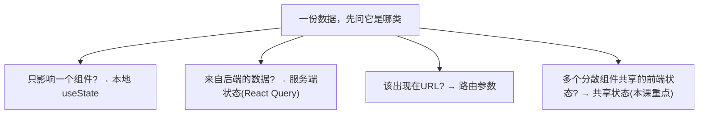
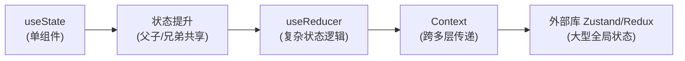
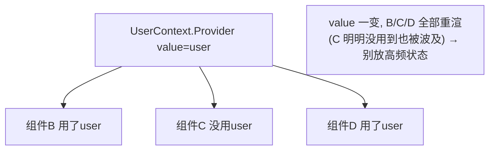
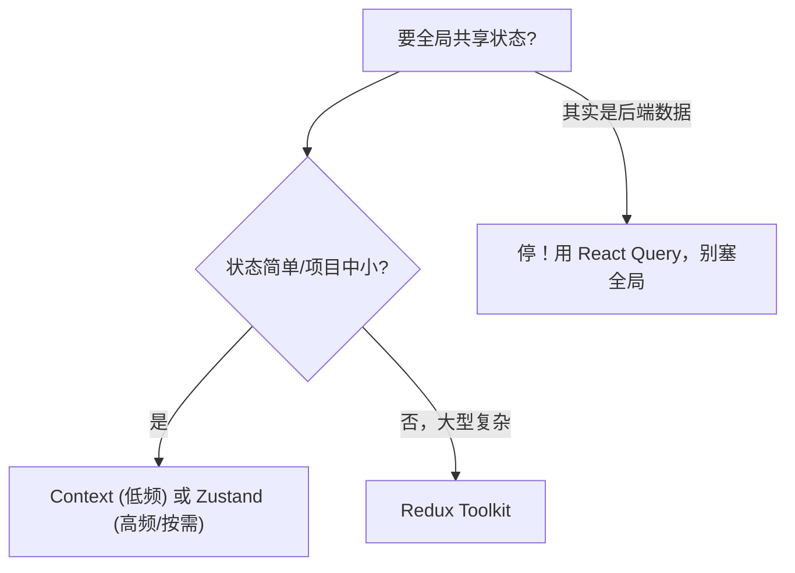
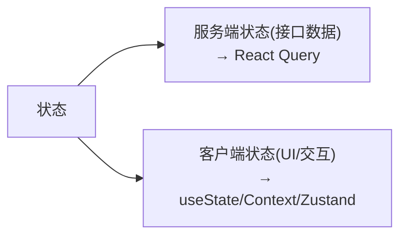

# React - 第 11 课：状态管理怎么选，State、Reducer、Context、Zustand 与 Redux

## 学习目标（本节结束后你能做到什么）

- 把“状态管理”从“用哪个库”的问题，转变成“**这个状态该放哪**”的判断问题。
- 能对状态分类：本地 UI 状态、跨组件共享状态、服务端状态、URL 状态——并知道各用什么管。
- 掌握从简单到复杂的状态方案阶梯：`useState` → 状态提升 → `useReducer` → `Context` → 外部库。
- 理解 `useReducer` 适合什么（复杂状态转移逻辑），以及它和后端状态机的关系。
- 看清 **Context 的真实定位（依赖注入，不是状态管理库）和它的性能陷阱**。
- 知道 Zustand、Redux 各解决什么、什么时候才真的需要它们。
- 建立“**别过早全局化**”的判断，避免后端工程师常犯的过度设计。

> 前置衔接：本课大量建立在 React 第 6 课（状态提升、组合、Context）、第 8 课（Hook）、第 9 课（服务端状态）之上。本课的核心是“判断”，不是“API”——比起记 Redux 怎么写，更重要的是知道**什么时候根本不需要它**。

## 内容讲解（核心概念，用类比、例子、图示说清楚）

### 1. 状态管理的真问题：不是“用什么库”，而是“放哪”

后端工程师学 React 状态管理，常一上来就问“该用 Redux 还是别的”。这个问法本身就跑偏了。

状态管理的真问题是：**一份数据，应该由谁持有、放在哪一层？** 库只是“放哪”的某一种实现。如果你状态归属想清楚了，大多数页面**根本不需要任何状态管理库**，`useState` + 状态提升就够。反过来，归属没想清，再强的库也救不了——你会把一堆本该是局部的东西塞进全局，制造出难以维护的“全局垃圾场”。

所以这一课先建立分类和判断，最后才谈库。**记住一句话贯穿全课：状态要放在“需要它的组件们的最近公共位置”，不多不少。** 这是第 6 课“状态提升”的延伸。

### 2. 给状态分类：四种状态，四种归宿

不是所有“数据”都是一回事。先把状态分成四类，这是后面所有判断的基础：

| 类型 | 例子 | 特点 | 该用什么管 |
| --- | --- | --- | --- |
| 本地 UI 状态 | 下拉开关、输入框值、当前 tab | 只影响一个组件 | `useState`（放组件内） |
| 跨组件共享状态 | 登录用户信息、主题、语言 | 多个分散组件要读 | 状态提升 / Context / 外部库 |
| 服务端状态 | 用户列表、订单详情 | 来自后端，前端是缓存副本 | React Query 等（第 9 课） |
| URL 状态 | 搜索词、页码、筛选 | 适合反映在地址栏 | 路由查询参数（第 10 课） |



**最重要的认知：很多人以为“状态管理”要管的是一大坨东西，其实真正需要专门‘共享状态’方案的，只剩第四类里那一小撮。** 服务端状态被 React Query 拿走了（第 9 课讲过别把它塞全局），URL 状态被路由拿走了，本地状态 useState 就够。剩下要全局共享的，往往只有“当前登录用户、主题、权限”这种很少的几样。明确了这个，你对“状态管理库”的需求会大幅缩水。

### 3. 方案阶梯：从最简单开始，需要才升级

共享状态的方案是一个**由简到繁的阶梯**。原则是**从最简单的开始，遇到真实痛点才升级**，而不是一上来就上最重的。



每一级解决上一级的什么痛：

- **useState**：单个组件自己的状态。够用就别动。
- **状态提升**（第 6 课）：两三个组件要共享，把状态提到它们最近的公共父组件，用 props 传下去。**这是最常被低估的方案——大量“需要共享”的场景，提升一下就解决了，根本不用库。**
- **useReducer**：状态本身简单，但**更新逻辑复杂**（很多种操作、互相关联）时，把逻辑收敛成一个 reducer。
- **Context**：状态要传给**很多层之下、很分散**的组件，props 一层层透传太痛苦（prop drilling）时，用 Context 跨层提供。
- **外部库**：应用大到有大量全局状态、复杂交互、需要中间件/调试工具时，才上 Zustand/Redux。

后端类比：这就像你不会给一个 CRUD 小服务上来就套微服务 + 消息队列 + 服务网格。**按复杂度匹配方案**，是工程判断力的体现。下面逐级展开后三级。

### 4. useReducer：把复杂的状态转移收敛成一处

`useState` 适合简单状态。但当一个状态有**很多种更新方式、且更新逻辑互相关联**时，组件里会散落一堆 `setXxx`，难以维护。`useReducer` 把所有更新逻辑收进一个**纯函数 reducer**，组件只负责“派发动作（dispatch action）”。

后端工程师对这个模式应该很熟——它就是**状态机 / 事件溯源**的思路：当前状态 + 一个动作 → 新状态。

```jsx
import { useReducer } from "react";

// reducer：纯函数，(当前状态, 动作) => 新状态。注意是不可变更新（前端基础第5课）
function cartReducer(state, action) {
  switch (action.type) {
    case "add":
      return { ...state, items: [...state.items, action.item] };
    case "remove":
      return { ...state, items: state.items.filter(i => i.id !== action.id) };
    case "clear":
      return { ...state, items: [] };
    default:
      return state;
  }
}

function Cart() {
  const [state, dispatch] = useReducer(cartReducer, { items: [] });

  return (
    <div>
      <button onClick={() => dispatch({ type: "add", item: newItem })}>加入</button>
      <button onClick={() => dispatch({ type: "clear" })}>清空</button>
      {/* 渲染 state.items */}
    </div>
  );
}
```

`useReducer` 的好处：

- **更新逻辑集中**：所有“购物车怎么变”的逻辑都在 `cartReducer` 一个地方，组件里只有 `dispatch({type})`，一眼能看全有哪些操作。
- **可测试**：reducer 是纯函数（前端基础第 4 课），输入状态和动作、输出新状态，不依赖组件，单测极易。
- **可预测**：状态只能通过 dispatch 动作来改，改动有迹可循。

**什么时候从 useState 升级到 useReducer？** 信号：① 一个状态对象有多个字段、多种相互关联的更新；② 下一个状态依赖上一个状态的复杂计算；③ 你发现组件里 `setXxx` 满天飞、逻辑看不清。表单复杂校验、向导式多步流程、购物车，都是典型。简单开关、单个输入框，用 useState 就行，别为了用而用。

### 5. Context：解决“层层透传”，但它不是状态管理库

回忆第 6 课的 prop drilling 痛点：一个数据要从顶层传到很深的子组件，中间每一层都得帮忙转发 props，哪怕它们自己根本不用。Context 就是解决这个的——**它让你把数据“注入”到组件树的某一层，子树里任何组件都能直接取，不用逐层传**。

```jsx
import { createContext, useContext } from "react";

// 1. 创建 Context
const UserContext = createContext(null);

// 2. 在高层用 Provider 提供值
function App() {
  const [user, setUser] = useState(currentUser);
  return (
    <UserContext.Provider value={user}>
      <Layout />   {/* 整棵子树都能取到 user，无需逐层传 */}
    </UserContext.Provider>
  );
}

// 3. 深层任意组件直接取，不经过中间层
function UserAvatar() {
  const user = useContext(UserContext);   // 直接拿到 user
  return ;
}
```

**关键认知：Context 的本质是“依赖注入 / 跨层传递”，不是“状态管理”。** 它只解决“怎么把值送到深层组件”，**本身不管状态怎么存、怎么更新**——值还是来自某个 `useState`/`useReducer`。后端类比：Context 像 Spring 的依赖注入容器（把 bean 注入到需要的地方），不是数据库。把它当成“能跨层取值的管道”，而不是“全局状态仓库”，你才用得对。

**Context 的两个适用场景（共同点：低频变化、全局需要）：**

- 当前登录用户、权限。
- 主题（暗黑模式）、语言（国际化）。

**Context 的性能陷阱（重要，后端工程师常踩）：**

> **Provider 的 `value` 一变，所有 `useContext` 订阅它的组件都会重新渲染**，不管它们用没用到变的那部分。

所以**不要把频繁变化的状态（比如每次输入都变的表单、鼠标位置）放进一个大 Context**——会导致大量无关组件跟着重渲染，性能崩坏。Context 适合“放进去后很少变”的东西。如果你需要“频繁变化 + 全局共享 + 只重渲用到的部分”，那是外部库的活了（第 6 节）。这也是“Context 不是状态管理库”的实践含义——它没有“按需订阅、只更新相关组件”的能力。



### 6. 外部状态库：Zustand 与 Redux，什么时候才需要

当应用大到：有**大量跨页面共享的全局状态**、**复杂的状态交互**、需要**调试工具/中间件/持久化**，且 Context 因为性能或组织问题撑不住时——才轮到外部状态库。

**Zustand（轻量、现代、推荐新手了解）**

```jsx
import { create } from "zustand";

// 定义一个 store：状态 + 改状态的方法，集中一处
const useCartStore = create((set) => ({
  items: [],
  addItem: (item) => set((s) => ({ items: [...s.items, item] })),
  clear: () => set({ items: [] }),
}));

// 组件里直接用，且可以只订阅自己要的那部分（按需订阅，避免无关重渲）
function CartCount() {
  const count = useCartStore((s) => s.items.length);   // 只订阅 length
  return <span>{count}</span>;
}
```

Zustand 解决了 Context 的两个痛：① **按需订阅**——组件只订阅它用到的那片状态，其余变化不会害它重渲；② **不用包 Provider、不用 dispatch 模板**，API 极简。中小项目要全局状态，Zustand 往往是性价比最高的选择。

**Redux（规范、生态强、但重）**

Redux 是老牌全局状态库，核心思想和 `useReducer` 一脉相承（单一 store + action + reducer + 不可变更新），但加了严格的单向数据流规范、强大的中间件（处理异步、日志）和时间旅行调试工具。

- **优点**：超大型应用里，强约束带来可预测性和可维护性；团队协作有统一范式；调试工具强大。
- **代价**：模板代码多、上手成本高、小项目用它是“杀鸡用牛刀”。现代用 Redux 一般配 Redux Toolkit（RTK）来减少样板。

**怎么选（实用建议）：**



新手期：**先把 useState + 状态提升 + Context 用熟，需要全局且 Context 不够时先试 Zustand，Redux 等真的进了大型团队项目再学。** 不要因为“听起来专业”就上 Redux。

### 7. 别把服务端状态塞进全局状态库（最常见的错）

这是第 9 课埋的点，必须在这里再强调，因为它是新手最大的误区：

> **来自后端的数据（用户列表、订单、详情）是“服务端状态”，不要把它放进 Redux/Zustand/Context 当全局状态管理。**

为什么？因为服务端状态有一堆全局状态库不擅长的需求：缓存、过期重新验证、请求去重、加载/错误态、竞态处理（第 9 课全讲过）。如果你用 Redux 存接口数据，你会发现自己在 Redux 里手写一遍缓存、loading、错误处理——重新发明 React Query，又写得更差。

正确分工：

- **服务端状态** → React Query / SWR（专门工具）。
- **客户端状态**（UI 开关、表单、当前选中、登录态）→ useState / Context / Zustand。



把这两类分开，是现代 React 状态管理最重要的一条心法。很多“状态管理很复杂”的痛苦，根源就是把这两类混在一个大全局 store 里。

### 8. 反模式：过早全局化（后端工程师高发）

后端工程师做 React，有个高发的过度设计：**一上来就建一个全局 store，把所有状态都往里塞**，理由是“以后可能要共享”。这几乎总是错的。

为什么有害：

- **耦合**：本该独立的组件，因为共享同一个全局 store 而互相牵连，改一处影响一片。
- **性能**：全局状态变化容易引发大范围重渲染。
- **难追踪**：状态散在全局，谁改的、为什么改，难以定位（局部 useState 一眼能看清归属）。
- **可复用性差**：组件依赖了全局 store，就不能独立复用了。

正确心态：**状态默认是局部的，只有当“确实有多个分散组件都要读写同一份数据”这个痛点真实出现时，才往上提一级。** 这和你后端“先单体、有瓶颈再拆”的演进式架构是一个道理。YAGNI（You Aren't Gonna Need It）在前端状态管理上同样适用。

判断口诀：**“能 useState 就 useState，能提升就提升，能不全局就不全局。”**

### 9. 一张决策图收束

把整课收敛成一张“这个状态放哪”的决策流程：

```mermaid
flowchart TD
    Start["来了一份数据/状态"] --> Q1{来自后端的数据?}
    Q1 -->|是| RQ["React Query (服务端状态)"]
    Q1 -->|否| Q2{该出现在URL里?}
    Q2 -->|是| URL["路由查询参数 (第10课)"]
    Q2 -->|否| Q3{只有一个组件用?}
    Q3 -->|是| US["useState (本地)"]
    Q3 -->|否| Q4{几个邻近组件共享?}
    Q4 -->|是| LIFT["状态提升 (第6课)"]
    Q4 -->|否，跨很多层/很分散| Q5{频繁变化?}
    Q5 -->|否(登录/主题)| CTX["Context"]
    Q5 -->|是/大型| LIB["Zustand / Redux"]
```

这张图就是这一课的全部判断力。**注意它把大多数情况都导向了“不需要状态库”的分支**——这正是重点：状态管理的最高境界，是大部分状态根本不需要“管理”。

## 小结（关键点）

- 状态管理的真问题不是“用哪个库”，而是“**这份数据该由谁持有、放在哪一层**”；归属想清楚，多数页面不需要状态库。
- 先给状态分四类：**本地 UI 状态**（useState）、**服务端状态**（React Query）、**URL 状态**（路由参数）、**跨组件共享状态**（本课重点）——真正需要“共享状态方案”的只剩最后一小撮。
- 方案是由简到繁的阶梯：**useState → 状态提升 → useReducer → Context → 外部库**，从最简单开始，遇到真实痛点才升级。
- **useReducer** 把复杂、多动作、相互关联的状态更新收敛成纯函数 reducer（状态机思路），可测试、可预测。
- **Context 是依赖注入/跨层传递，不是状态管理库**；适合低频全局值（登录用户、主题）；陷阱是 **value 一变所有订阅者全重渲**，别放高频状态。
- **Zustand** 轻量且支持按需订阅，是中小项目全局状态的高性价比选择；**Redux** 规范但重，大型团队项目才划算。
- 两条铁律：**别把服务端状态塞进全局 store**（用 React Query）；**别过早全局化**（默认局部，有真实痛点才上提）。

## 问题 （检测用户对当前章节内容是否了解）

1. 为什么说“该用 Redux 还是别的”这个问法本身就跑偏了？状态管理的真问题是什么？
2. 状态分成哪四类？“用户列表”“下拉框开没开”“搜索词和页码”“当前登录用户”各属于哪类、该用什么管？
3. 状态方案的“阶梯”是哪几级？为什么提倡“从最简单开始，需要才升级”？用后端经验类比一下。
4. 什么情况下该把 `useState` 升级到 `useReducer`？`useReducer` 和后端的状态机/事件处理有什么相似？
5. 为什么说“Context 不是状态管理库，而是依赖注入”？它适合放什么、不适合放什么？
6. Context 有什么性能陷阱？为什么不能把每次输入都变的表单状态放进一个大 Context？
7. 为什么不能把接口返回的数据（服务端状态）塞进 Redux/Zustand 当全局状态？正确做法是什么？
8. “过早全局化”有哪些害处？“能 useState 就 useState，能提升就提升，能不全局就不全局”这句话你怎么理解？

请把你的答案直接告诉我。我会根据你的回答判断第 11 课是否掌握，再决定是进入第 12 课（性能优化与调试），还是先补一节状态归属判断的强化讲解。
