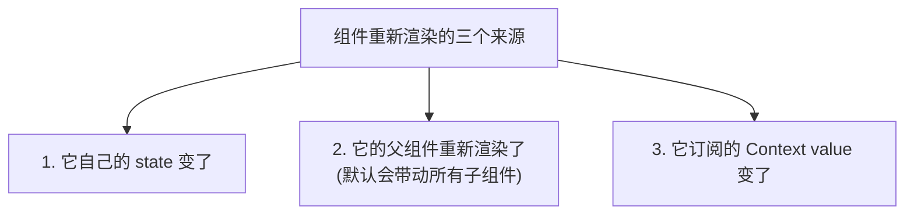
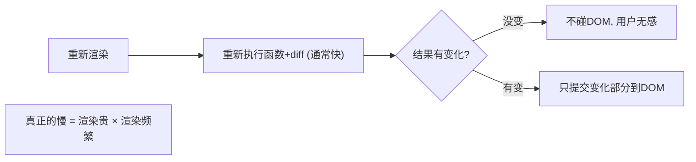
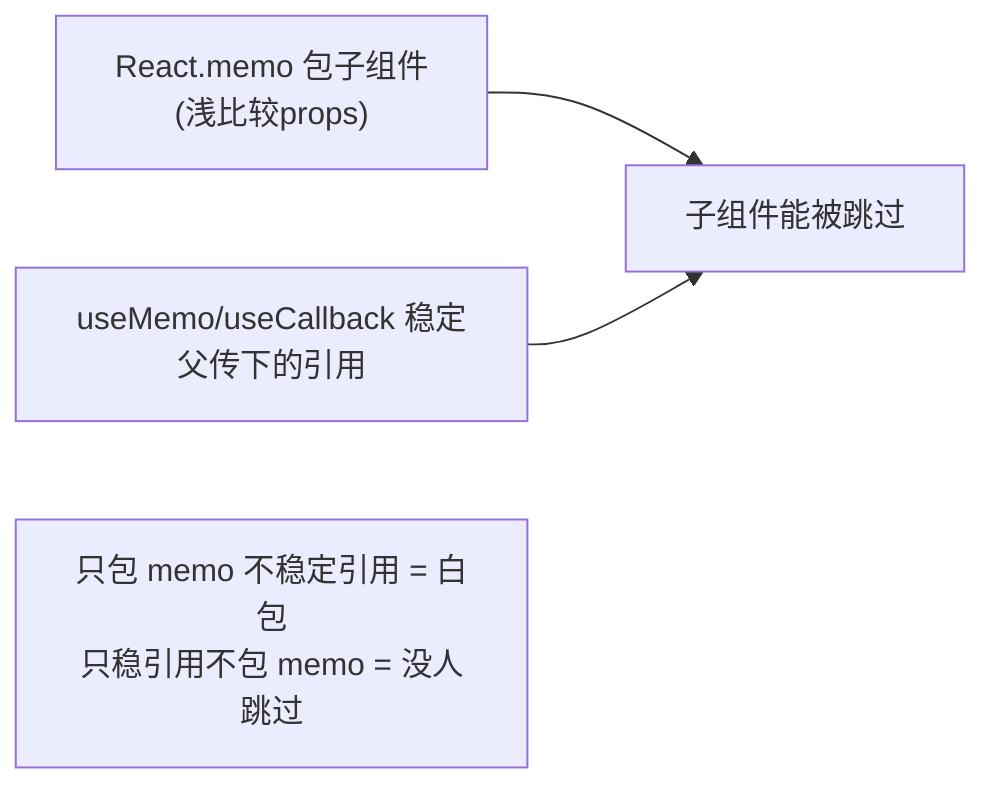
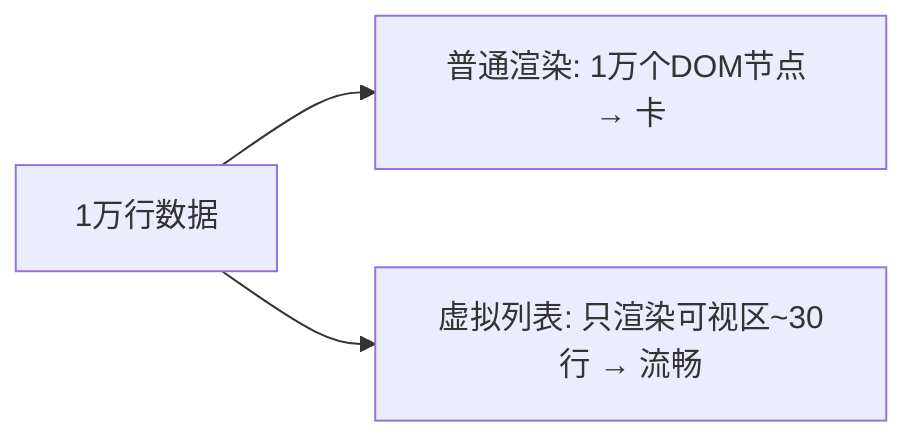
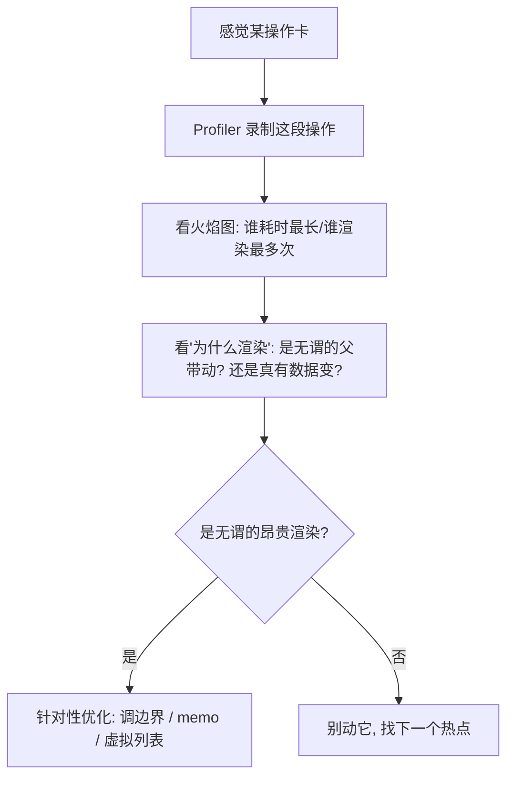

# React - 第 12 课：性能优化与调试，渲染边界、memo 与 Profiler

## 学习目标（本节结束后你能做到什么）

- 建立性能优化的第一原则：**先测量、再优化**，不靠猜。
- 说清楚“重新渲染”从哪来，以及“重新渲染”为什么不等于“慢”。
- 掌握 `React.memo` + `useMemo` + `useCallback` 这套组合到底在优化什么、怎么正确配合。
- 学会用**调整渲染边界**（组件拆分、状态下移、children 透传）从结构上消除无谓渲染——这往往比加 memo 更有效。
- 会用 **React DevTools Profiler** 定位“是谁、为什么、渲染了多少次”。
- 建立一条**性能问题排查路径**，并理解“过度优化”本身也是一种性能债。

> 前置衔接：本课是 React 第 4 课（渲染机制：render/commit/批处理）、第 7 课（列表 key）、第 8 课（memo/useMemo/useCallback、闭包）的综合实战。第 8 课讲了这些 API“是什么”，本课讲它们在真实排查里“何时用、怎么用、什么时候根本不该用”。

## 内容讲解（核心概念，用类比、例子、图示说清楚）

### 1. 性能优化第一原则：先测量，别猜

后端做性能优化你一定懂这条铁律：**先用 profiler 找到真正的瓶颈，再动手**。没测量就优化，十有八九优化了不耗时的地方，还把代码搞复杂。

React 性能优化完全一样，但新手特别容易违反——一看到“可能重渲染”就到处加 `React.memo`、`useMemo`、`useCallback`，结果：

- 大部分加在了**根本不慢**的地方，毫无收益。
- 这些缓存本身有成本（存储、比较），加错了反而**更慢**。
- 代码被一堆 memo 包裹，可读性和可维护性下降。

回忆第 8 课的结论：**memoization 不是默认操作，是针对性手段。** 所以本课的顺序刻意是：先理解渲染从哪来（第 2-3 节）→ 学会测量定位（第 8 节）→ 才谈具体优化手段。**记住：没测量之前，不要加任何 memo。**

### 2. 重新渲染从哪来

要优化渲染，先得知道一个组件为什么会重新渲染（第 4 课讲过 render 阶段，这里聚焦“触发源”）。一个组件重新执行，只有三个原因：



第 2 点是最容易被忽略、也是大多数“无谓渲染”的根源：**默认情况下，父组件一渲染，它的所有子组件都会跟着重新执行——哪怕子组件的 props 根本没变。**

```jsx
function Parent() {
  const [count, setCount] = useState(0);
  return (
    <div>
      <button onClick={() => setCount(count + 1)}>{count}</button>
      <ExpensiveChild />   {/* count 变化导致 Parent 重渲，这个孩子也跟着重渲，哪怕它跟 count 无关 */}
    </div>
  );
}
```

每点一次按钮，`Parent` 重渲，`ExpensiveChild` 也重新执行了一遍——即使它不依赖 `count`。这是 React 的默认行为（“父渲染带动子渲染”）。它通常没问题（见下节），但当子组件渲染很贵、或这种连锁很大时，就成了性能问题。

### 3. 关键澄清：重新渲染 ≠ 慢

这是最重要的认知，能帮你避免一大半无谓优化。**“组件重新执行”本身通常很快**——回忆第 1、4 课：重新渲染只是“重新执行组件函数、算出新的 UI 描述（React Element），再和旧的做 diff”，**它不等于操作真实 DOM，更不等于刷新页面**。React 只把 diff 出来的**真正变化**提交到 DOM（commit 阶段）。

所以：

- 一个组件重渲 100 次，如果每次计算都很轻、且 diff 后 DOM 没怎么变，**用户根本感觉不到**。
- 真正让人卡的是：**渲染本身很贵**（大列表、复杂计算）、或**渲染太频繁**（高频事件触发）、或**diff/commit 的量很大**。



**结论：不要为了“减少渲染次数”而优化，要为了“消除昂贵且无收益的渲染”而优化。** 判断一个渲染该不该消除，标准是“它贵不贵、有没有产生实际变化”，而不是“它发生了几次”。这个心态摆正了，你才不会到处乱加 memo。

### 4. React.memo：跳过 props 没变的子组件

当你**测量确认**某个子组件渲染贵、且它的 props 经常没变却被父组件带着重渲时，用 `React.memo` 把它包起来：它会**浅比较 props**，props 没变就跳过这次重渲。

```jsx
import { memo } from "react";

// 包一层 memo：props 浅比较没变，就复用上次结果，不重新执行
const ExpensiveChild = memo(function ExpensiveChild({ data }) {
  // ...昂贵的渲染...
  return <div>{/* ... */}</div>;
});
```

现在 `Parent` 因为 `count` 变化而重渲时，只要传给 `ExpensiveChild` 的 `data` 引用没变，它就被跳过。

但这里有个**第 8 课和前端基础第 4 课（引用类型）合起来的坑**：`memo` 做的是 **props 浅比较**（比较引用）。如果父组件每次渲染都**新建**了传下去的对象/数组/函数，引用每次都不同，`memo` 就永远判定“props 变了”，**等于白包**：

```jsx
function Parent() {
  const [count, setCount] = useState(0);
  const data = { value: 1 };               // ❌ 每次渲染都是新对象，引用不同
  const handleClick = () => doSomething();  // ❌ 每次渲染都是新函数，引用不同

  return <ExpensiveChild data={data} onClick={handleClick} />;
  // memo 失效：data/handleClick 每次引用都变 → 永远判定 props 变了
}
```

这就是为什么 `memo` 经常要和 `useMemo`/`useCallback` 配套——后两者负责**稳定住传给 memo 子组件的引用**。

### 5. useMemo / useCallback：稳定引用，喂给 memo

回忆第 8 课：`useMemo` 缓存一个**计算结果**，`useCallback` 缓存一个**函数引用**，只有依赖变了才重新生成。它们在性能优化里的核心用途，就是**让传给 `memo` 子组件的 props 引用保持稳定**：

```jsx
import { useMemo, useCallback } from "react";

function Parent() {
  const [count, setCount] = useState(0);
  const [items, setItems] = useState([...]);

  // useMemo：缓存对象/计算结果，依赖没变就复用同一个引用
  const data = useMemo(() => ({ value: 1 }), []);

  // useCallback：缓存函数，依赖没变就复用同一个函数引用
  const handleClick = useCallback(() => doSomething(), []);

  // 现在 data / handleClick 引用稳定，memo 才真正生效
  return <ExpensiveChild data={data} onClick={handleClick} />;
}
```

**三者是一套组合拳，缺一不可：**



**但务必记住第 8 课的警告：这套组合有成本（缓存、比较、依赖管理），不该默认到处用。** 只在“`memo` 子组件 + 渲染确实贵 + 引用确实在变”这三个条件同时成立时才上。否则你是在用复杂度换不存在的收益。

### 6. 调整渲染边界：比加 memo 更治本的优化

很多人不知道：**大量无谓渲染可以靠“改组件结构”消除，根本不用 memo。** 这类优化更治本、副作用更小，应该优先考虑。两个最有用的手法：

**手法一：状态下移（把 state 推到真正用它的地方）**

如果一个高频变化的状态放在大组件顶部，会带着整棵子树重渲。把它**下移**到只需要它的小组件里，影响范围就缩小了：

```jsx
// ❌ 改之前：input 的值放在顶层，每次输入都让整个大页面重渲
function Page() {
  const [text, setText] = useState("");
  return (
    <div>
      <input value={text} onChange={e => setText(e.target.value)} />
      <HugeExpensiveList />   {/* 跟 text 无关，却被每次输入连累重渲 */}
    </div>
  );
}

// ✅ 改之后：把 input 和它的 state 一起下移到小组件，重渲只发生在 SearchBox 内
function Page() {
  return (
    <div>
      <SearchBox />          {/* 自己管自己的 text，重渲不外溢 */}
      <HugeExpensiveList />  {/* 不受影响 */}
    </div>
  );
}
```

**手法二：用 children 透传，把“不变的部分”隔离开**

如果一个组件因为自身 state 变化而重渲，但它包着一些与该 state 无关的内容，可以把那些内容作为 `children` 传进来——**children 是在父级创建的，引用稳定，不会因为这个组件 state 变化而重新创建**：

```jsx
// 把昂贵且无关的内容作为 children 传入，counter 变化不会重渲它
function Counter({ children }) {
  const [count, setCount] = useState(0);
  return (
    <div>
      <button onClick={() => setCount(count + 1)}>{count}</button>
      {children}   {/* 这部分在父级创建，count 变化不影响它 */}
    </div>
  );
}

<Counter>
  <ExpensiveThing />   {/* 不会因 Counter 内部 count 变化而重渲 */}
</Counter>
```

**为什么优先用结构优化而不是 memo？** 因为调整边界是“从源头让无谓渲染不发生”，没有缓存成本、没有依赖数组要维护；而 memo 是“事后拦截”，有成本也容易因引用问题失效。**好的组件结构能让你少用很多 memo。** 这是高级 React 工程师和初级的分水岭之一。

### 7. 列表性能：key 与虚拟列表

大列表是前端性能的重灾区，两个要点：

**(1) 稳定的 key（第 7 课）**：列表项必须用稳定、唯一的 key（用数据 id，别用数组下标）。key 让 React 在列表增删改时能精确复用对应的 DOM 节点，而不是错位重建。key 错了不仅有 bug，也有性能损失（大量本可复用的节点被重建）。

**(2) 虚拟列表（virtualization）**：当列表有成千上万行时，**根本不该把它们全渲染出来**——屏幕一次也就显示几十行。虚拟列表只渲染“可视区域内的那几十行”，滚动时动态替换内容。常用库 `react-window` / `react-virtualized`。



后台系统遇到“几千上万行不分页的表格卡顿”，第一反应应该是虚拟列表或分页，而不是去给行组件加 memo。**找对优化层级，比优化手段本身更重要。**

### 8. 用 React DevTools Profiler 定位问题

这是把“先测量”落到实处的工具。装 **React DevTools** 浏览器扩展后，多一个 **Profiler** 面板，能录制一段交互、看清：

- **哪些组件渲染了**、各渲染了几次。
- 每次渲染**耗时多少**（火焰图，越宽越慢）。
- **为什么渲染**（DevTools 能告诉你是 props 变了、state 变了、还是父组件渲染带动的——开启 "Record why each component rendered"）。

排查流程：



**关键：让 Profiler 告诉你瓶颈在哪，再决定优化谁。** 不要凭感觉。很多时候你以为慢的地方其实不慢，真正的热点是个你没想到的组件。这跟你后端拿火焰图找热点方法、再针对性优化是一模一样的工作方式。

### 9. 一条完整的性能排查路径

把这一课收敛成实战中可直接照做的顺序：

1. **确认真的有性能问题**（用户感知到卡、Profiler 有明显热点），而不是“理论上可能慢”。
2. **用 Profiler 定位**：谁渲染贵、谁渲染频繁、为什么渲染。
3. **优先从结构下手**：能不能状态下移、能不能 children 隔离、列表该不该虚拟化/分页、是不是 key 用错了。
4. **结构改不动时，才上 memo 三件套**：`React.memo` + `useMemo`/`useCallback`，且只包真正贵的、引用真在变的。
5. **改完再用 Profiler 验证**：确认真的快了，而不是自我感觉良好。
6. **回看可读性**：优化引入的复杂度是否值得？不值就回退。


### 10. 过度优化也是一种债

最后回到第 1 节，强调反面：**不必要的优化是负资产。** 每个 `memo`/`useMemo`/`useCallback` 都增加了：

- **认知成本**：读代码的人要理解为什么包、依赖对不对。
- **维护成本**：依赖数组写错会引入第 8 课的旧闭包 bug；改需求时这些缓存都要跟着维护。
- **运行成本**：缓存和比较本身要花时间和内存，加在不慢的地方就是纯亏。

所以判断要双向：**该优化的没优化是性能债，不该优化的乱优化是复杂度债。** 成熟的标准是——**默认写简单直接的代码，等 Profiler 指出真实热点，再做最小必要的优化。** 这和你后端“不要过早优化（premature optimization）”是同一句箴言。

## 小结（关键点）

- **第一原则：先测量、再优化**。没用 Profiler 定位之前，不要加任何 `memo`/`useMemo`/`useCallback`。
- 重新渲染只有三个来源：自身 state 变、**父组件重渲带动**、订阅的 Context 变；其中“父带动子”是无谓渲染的最大来源。
- **重新渲染 ≠ 慢**：它只是重新执行函数 + diff，通常很快，React 只提交真正的变化到 DOM。真正的慢 = 渲染贵 × 渲染频繁。
- `React.memo` 浅比较 props 跳过子组件，但父组件每次新建对象/函数会让它**失效**；需配 `useMemo`/`useCallback` **稳定引用**，三者是一套组合拳。
- **调整渲染边界更治本**：状态下移、children 透传隔离、列表虚拟化/分页、修正 key——优先用结构优化消除无谓渲染，能少用很多 memo。
- 用 **React DevTools Profiler** 看“谁渲染、渲染几次、为什么、耗时多少”，按“确认问题→定位→改结构→再 memo→验证”的路径排查。
- **过度优化是复杂度债**：默认写简单代码，针对 Profiler 指出的真实热点做最小必要优化。

## 问题 （检测用户对当前章节内容是否了解）

1. 为什么说“先测量、再优化”是 React 性能优化的第一原则？乱加 memo 会带来哪些坏处？
2. 一个组件重新渲染的三个来源是什么？其中哪个是“无谓渲染”最常见的根源？
3. “重新渲染 ≠ 慢”怎么理解？真正让用户感到卡的因素是什么？
4. `React.memo` 在比较什么？为什么父组件里写 `const data = {...}` 会让子组件的 `memo` 失效？怎么解决？
5. `React.memo` + `useMemo` + `useCallback` 为什么是“一套组合拳”，单独用其中一个会怎样？
6. 举出两种“靠调整组件结构而非加 memo”来消除无谓渲染的手法，并说明原理。
7. 一个有上万行的表格很卡，你应该优先考虑什么优化？为什么不是给行组件加 memo？
8. 描述一条完整的性能排查路径。React DevTools Profiler 能告诉你哪些信息？

请把你的答案直接告诉我。我会根据你的回答判断第 12 课是否掌握，再决定是进入第 13 课（React 与后端协作），还是先补一节渲染边界与 Profiler 实操的强化讲解。
