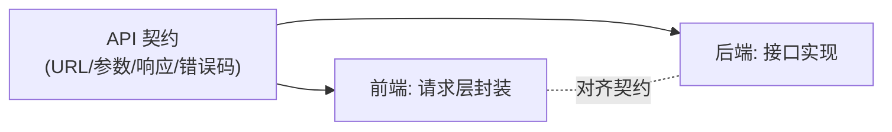
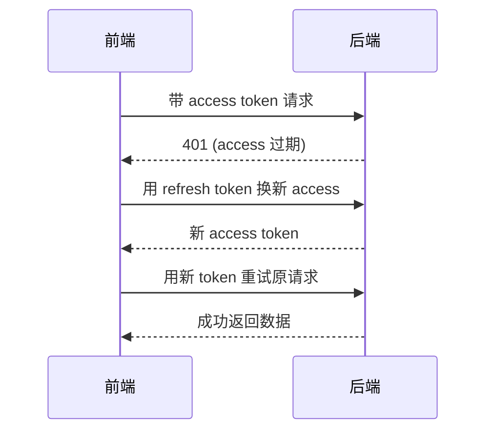
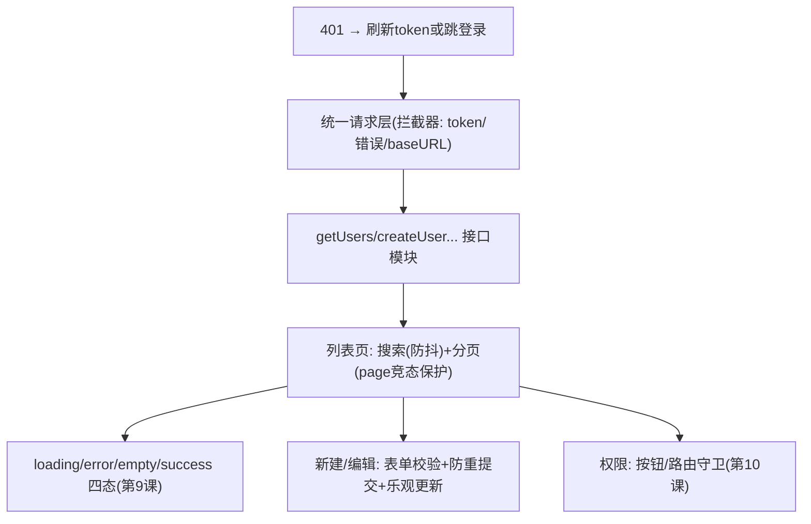

# React - 第 13 课：React 与后端协作，API 契约、鉴权、分页、搜索与错误处理

## 学习目标（本节结束后你能做到什么）

- 从“前后端协作”的视角，建立一个 React 应用对接后端的整体心智：契约、封装、鉴权、错误、分页、搜索。
- 会设计一个**统一的请求层**（封装 fetch/axios + 拦截器），而不是到处散落裸 `fetch`。
- 理解前端**鉴权**怎么做：token 存哪、怎么携带、401 怎么处理、refresh token 怎么转。
- 会设计前端的**错误处理**：区分 HTTP 错误和业务错误码，做统一兜底 + 局部友好提示。
- 掌握**分页**（page/offset 与 cursor）、**搜索 + 防抖/节流**、**表单提交防重与乐观更新**、**文件上传**这几个高频实战。
- 理解跨域（CORS）是怎么回事，知道它需要后端配合。

> 前置衔接：本课是 React 第 9 课（数据获取、竞态）、第 10 课（路由权限）、第 8 课（useRef）的应用落地。对你这个后端工程师，这是最有共鸣的一课——你熟悉的契约、拦截器、鉴权、错误码，全部要在前端再走一遍，只是站到了“消费方”的位置。

## 内容讲解（核心概念，用类比、例子、图示说清楚）

### 1. 前后端协作的核心是“契约”

你做后端最清楚：前后端能并行开发、能互不踩坑，靠的是一份**明确的 API 契约**——每个接口的 URL、方法、请求参数、响应结构、错误码，都说清楚。前端是这份契约的**消费方**。

契约里前端最关心三样：

```text
1. 请求长什么样：GET /api/users?keyword=张三&page=1&size=20
2. 成功响应长什么样：{ code: 0, data: { list: [...], total: 135 }, message: "ok" }
3. 失败/错误长什么样：{ code: 1001, data: null, message: "用户不存在" }  + HTTP 状态码
```

前端所有的数据获取（第 9 课）、错误处理、分页渲染，都是围绕这份契约写的。**契约不清，前端只能瞎猜字段名、猜错误格式，bug 不断。** 所以协作的第一步永远是对齐契约——这点你比纯前端更有体会。本课就是讲：拿到契约后，前端怎么把这套对接做得规范、健壮。



### 2. 统一请求层：别让裸 fetch 散落各处

第 9 课为了讲清楚，每个组件里都写了 `fetch`。但真实项目**绝不能这样**——鉴权头、错误处理、baseURL、超时这些是**横切关注点**，散落各处会重复且不一致。正确做法是封装一个**统一请求层**（类似你后端的统一 HTTP client / Feign + 拦截器）。

可以用 `fetch` 自己封，也常用 `axios` 库（自带拦截器，更方便）。以 axios 为例：

```js
// api/request.js —— 全应用唯一的请求实例
import axios from "axios";

const request = axios.create({
  baseURL: "/api",        // 统一前缀
  timeout: 10000,         // 超时
});

// 请求拦截器：每个请求自动带上 token（鉴权，下一节细讲）
request.interceptors.request.use((config) => {
  const token = getToken();
  if (token) config.headers.Authorization = `Bearer ${token}`;
  return config;
});

// 响应拦截器：统一处理错误码、统一剥离外层结构
request.interceptors.response.use(
  (response) => {
    const { code, data, message } = response.data;
    if (code !== 0) {
      // 业务错误：统一弹提示，并抛出让调用方也能 catch
      showToast(message);
      return Promise.reject(new Error(message));
    }
    return data;   // 成功：直接返回 data，组件不用每次剥 response.data.data
  },
  (error) => {
    // HTTP 层错误（网络、5xx、401）统一兜底
    handleHttpError(error);
    return Promise.reject(error);
  }
);

export default request;
```

封装后，业务里调接口变得很干净：

```js
// api/user.js —— 按业务模块组织接口函数
import request from "./request";

export const getUsers = (params) => request.get("/users", { params });
export const getUser = (id) => request.get(`/users/${id}`);
export const createUser = (body) => request.post("/users", body);
```

```js
// 组件里：和第 9 课一样的数据获取，但请求细节都被封装掉了
const users = await getUsers({ keyword, page });
```

**这一层的价值**（你后端做拦截器/AOP 的同款收益）：鉴权、错误处理、日志、baseURL 只写一遍；接口按模块组织、有类型（配 TS）、可复用；将来换域名、加全局 header，改一处即可。**拿到任何前端项目，先找它的请求层封装，就知道它怎么对接后端。**

### 3. 鉴权：token 存哪、怎么带、401 怎么办

前端鉴权是后端工程师最容易问“到底怎么做”的部分。主流是基于 **token**（如 JWT）：登录成功后端发个 token，前端之后每个请求都带上它。

**(1) token 存哪里？——这是个安全权衡**

| 存法 | 优点 | 风险 |
| --- | --- | --- |
| `localStorage` | 简单、JS 易读写 | **XSS 可读取**（前端基础第 8 课的脚本注入能偷走它） |
| `httpOnly` Cookie | JS 读不到，**防 XSS 偷取** | 需防 **CSRF**；要后端配合设置 |

简化结论：**安全性要求高，优先用后端下发的 `httpOnly` Cookie（JS 偷不到）+ CSRF 防护**；很多后台系统为了简单用 `localStorage` 存 token，那就**必须严防 XSS**（别用 `innerHTML` 插不可信内容、对输出转义——前端基础第 8 课讲过）。这个权衡要和后端一起定。

**(2) 怎么携带？**——就在第 2 节的请求拦截器里统一加 `Authorization: Bearer <token>`，不要每个请求手写。

**(3) 401 怎么处理？**——token 过期/无效时后端返回 401，前端在响应拦截器里统一处理：清掉本地登录态、跳转登录页（呼应第 10 课的权限路由）。

```js
request.interceptors.response.use(null, (error) => {
  if (error.response?.status === 401) {
    clearToken();
    window.location.href = "/login";   // 或用路由跳转
  }
  return Promise.reject(error);
});
```

**(4) 无感刷新（refresh token）**——为了不让用户频繁重登，常用双 token：短命的 access token + 长命的 refresh token。access 过期（401）时，前端**自动用 refresh token 换新 access**，再重试原请求，用户无感知。



实现要点：在响应拦截器里捕获 401 → 调刷新接口 → 更新 token → 重发原请求。还要处理“多个请求同时 401”的并发去重（只刷新一次，其余排队等新 token）——这是请求层封装里最有技术含量的一段。新手期理解流程即可，真实实现可参考成熟方案。

### 4. 错误处理：HTTP 错误 vs 业务错误，两层兜底

前端的错误处理常做得很糙（只 `catch` 一下打个 log）。规范做法要区分两类错误，分层处理：

- **HTTP 层错误**：网络断了、超时、5xx、401/403。这类是“请求本身没成”，在**响应拦截器统一兜底**（弹通用提示、401 跳登录、5xx 提示“服务异常”）。
- **业务错误码**：HTTP 200，但响应体里 `code != 0`（如“用户名已存在”“余额不足”）。这类是“请求成了但业务不通过”，需要**对应到具体的用户提示**。

```mermaid
flowchart TD
    A["一个请求的结果"] --> B{HTTP 成功(2xx)?}
    B -->|否| C["HTTP错误: 网络/超时/401/5xx<br/>→ 拦截器统一兜底"]
    B -->|是| D{业务 code == 0?}
    D -->|否| E["业务错误: code!=0<br/>→ 按 message 提示用户"]
    D -->|是| F["成功: 用 data"]
```

**两层处理的分工：**

- **全局统一**（拦截器）：兜住所有人都一样的处理——网络错误提示、401 跳转、未捕获的业务错误弹个 toast。保证“任何错误都不会让页面静默崩掉或卡在 loading”。
- **局部定制**（组件 try/catch）：某些接口的错误需要特殊 UI——比如表单提交时“用户名已存在”要标红那个输入框，而不是弹个全局 toast。这时组件自己 catch 来定制。

```js
// 局部定制错误处理的例子
async function handleSubmit() {
  try {
    await createUser(form);
    showToast("创建成功");
  } catch (err) {
    if (err.code === 1001) {
      setFieldError("username", "用户名已存在");   // 局部、具体
    }
    // 其它错误已被拦截器统一兜底，这里不用管
  }
}
```

**关键原则：不要让任何错误“静默消失”。** 第 9 课讲过——loading 卡住不动、或失败了却显示空列表，都是因为错误没被妥善处理。统一兜底 + 局部定制，保证每种错误用户都有明确反馈。

### 5. 分页：page/offset 与 cursor 两种范式

列表分页是后台系统标配。后端常见两种分页范式，前端要配合：

**(1) 页码/偏移分页（offset-based，最常见）**

```text
请求：GET /users?page=2&size=20
响应：{ list: [...], total: 135 }   // total 用来算总页数
```

前端维护 `page` 和 `size`，渲染一个页码组件，点页码就改 `page` 重新请求（接第 9 课依赖数组 `[page]`）：

```jsx
const [page, setPage] = useState(1);
const [data, setData] = useState({ list: [], total: 0 });

useEffect(() => {
  let ignore = false;
  getUsers({ page, size: 20 }).then(d => { if (!ignore) setData(d); });
  return () => { ignore = true; };   // 翻页竞态保护（第9课）
}, [page]);

const totalPages = Math.ceil(data.total / 20);
```

优点：能跳到任意页、能显示总页数。缺点：深翻页（page 很大）后端性能差；数据频繁增删时翻页可能重复/遗漏。

**(2) 游标分页（cursor-based）**

```text
请求：GET /users?cursor=xxx&size=20
响应：{ list: [...], nextCursor: "yyy" }   // 用上次返回的游标取下一批
```

适合“无限滚动”“信息流”这类只往下加载的场景，性能稳定、不会重复遗漏，但不能随机跳页。常配合“滚动到底自动加载下一页”（无限滚动），把新数据**追加**到列表（注意第 9 课的不可变更新：`setList([...list, ...next])`）。

**怎么选取决于后端提供哪种、以及交互形态**：后台管理表格通常用页码分页（要跳页），App 信息流用游标分页（无限滚动）。和你后端设计分页接口时的考量是一致的。

### 6. 搜索 + 防抖：别每打一个字就请求一次

第 9 课第 10 节留的钩子在这里收。搜索框如果“每输入一个字符就发一次请求”，会产生大量无谓请求（还加重竞态）。解法是**防抖（debounce）**：用户**停止输入一小段时间**（如 300ms）后才真正发请求。

防抖要用第 8 课的 `useRef` 存定时器（跨渲染保存、改它不触发重渲）：

```jsx
function SearchBox({ onSearch }) {
  const [text, setText] = useState("");
  const timerRef = useRef(null);   // 用 ref 存定时器 id（第8课）

  function handleChange(e) {
    const value = e.target.value;
    setText(value);                      // 输入框即时更新（受控组件）
    clearTimeout(timerRef.current);      // 取消上一个待发的请求
    timerRef.current = setTimeout(() => {
      onSearch(value);                   // 停止输入 300ms 后才真正搜
    }, 300);
  }

  return <input value={text} onChange={handleChange} />;
}
```

```mermaid
flowchart LR
    A["每次输入: 清掉上个定时器, 设新的300ms"] --> B{300ms内又输入?}
    B -->|是| A
    B -->|否(停了)| C["定时器触发 → 真正发请求"]
```

效果：连续打字时不停“重置 300ms 倒计时”，只有真正停下来才发一次请求。**防抖**用于搜索、输入校验；它的兄弟**节流（throttle）**（固定间隔最多触发一次）用于滚动、resize 这类高频事件。两者都是控制“触发频率”的经典手段，理解一个另一个就通了。

> 进阶：把防抖逻辑抽成自定义 Hook `useDebounce(value, 300)`（第 8 课自定义 Hook），组件更干净；真实项目也常用 lodash 的 `debounce`。

### 7. 表单提交：校验、防重复、乐观更新

表单提交是写操作，比读取更要小心，三个要点：

**(1) 提交期间禁用按钮，防重复提交**

网络慢时用户可能狂点提交，导致重复创建。提交时进入 loading 并禁用按钮（呼应第 1、3 课的受控/状态驱动）：

```jsx
const [submitting, setSubmitting] = useState(false);

async function handleSubmit(e) {
  e.preventDefault();              // 阻止表单默认提交刷新（前端基础第8课）
  if (submitting) return;
  setSubmitting(true);
  try {
    await createUser(form);
    showToast("成功");
  } finally {
    setSubmitting(false);
  }
}

<button disabled={submitting}>{submitting ? "提交中..." : "提交"}</button>
```

**(2) 提交前做前端校验**——必填、格式、长度等先在前端拦一遍（即时反馈、减少无效请求）。但**前端校验只是体验，不是安全边界**——和第 10 课权限路由同理，后端必须再校验一遍，因为前端校验能被绕过。

**(3) 乐观更新（optimistic update）**——为了让交互“跟手”，可以**先假设会成功，立刻更新 UI，再发请求**；如果失败再回滚。比如点赞：先把数字 +1 显示出来，请求失败再 -1 回去。它让界面响应即时，但要处理好失败回滚。是否值得用看场景——高频、低风险的操作（点赞、勾选）适合，重要的写操作还是等结果更稳。

### 8. 文件上传

上传用 `FormData` 把文件包成 `multipart/form-data`：

```jsx
async function handleUpload(e) {
  const file = e.target.files[0];     // 从 <input type="file"> 拿文件
  const formData = new FormData();
  formData.append("file", file);

  await request.post("/upload", formData, {
    headers: { "Content-Type": "multipart/form-data" },
    onUploadProgress: (evt) => {       // 上传进度（用来显示进度条）
      const percent = Math.round((evt.loaded / evt.total) * 100);
      setProgress(percent);
    },
  });
}

<input type="file" onChange={handleUpload} />
```

要点：用 `FormData`、设 `multipart/form-data`、用 `onUploadProgress` 做进度条。大文件还涉及分片上传、断点续传，那是进阶，原理是把文件切块分别传、后端再合并。

### 9. 跨域（CORS）：需要后端配合的一道坎

开发前端时几乎一定会撞上 CORS。浏览器有**同源策略**：默认不允许前端页面向**不同源**（协议/域名/端口任一不同）的服务器发请求，这是浏览器的安全机制。

```text
前端跑在 http://localhost:5173
后端在   http://localhost:8080   → 端口不同 = 跨域，浏览器拦截
```

解决方式（都需要后端或工具配合，前端单方面解决不了）：

- **后端设置 CORS 响应头**（`Access-Control-Allow-Origin` 等）允许你的源——生产环境的正解。
- **开发时用 dev server 代理**（前端基础第 10 课的 Vite）：让前端请求先发给本地 dev server，由它转发到后端，绕过浏览器跨域限制。

```js
// vite.config.js —— 开发代理
server: {
  proxy: { "/api": "http://localhost:8080" }   // /api 开头的请求代理到后端
}
```

**关键认知（后端工程师要理解）**：CORS 是**浏览器**的限制，不是后端的——你的接口用 Postman/curl 调好好的，浏览器里却报跨域，就是这个原因。它需要前后端一起配合解决。

### 10. 把这一课拼成一个真实列表页

收束成后台系统最典型的“带搜索、分页、增删的用户管理页”，它综合了本课和第 9、10 课：



这张图就是一个生产级前端业务页面对接后端的完整骨架。学到这，你已经具备“独立写一个稳定的后台业务模块”的能力了——剩下的第 14 课讲怎么把它工程化、上线。

## 小结（关键点）

- 前后端协作的核心是**契约**（URL/参数/响应/错误码）；前端是契约的消费方，对接前先对齐契约。
- 用**统一请求层**（封装 + 拦截器）集中处理鉴权头、错误、baseURL、超时，接口按模块组织——别让裸 `fetch` 散落各处。
- **鉴权**：token 存 `localStorage`（防 XSS）还是 `httpOnly` Cookie（防偷取但要防 CSRF）是安全权衡；请求拦截器统一带 token；401 统一跳登录；refresh token 做无感刷新。
- **错误处理分两层**：HTTP 错误（网络/401/5xx）在拦截器统一兜底，业务错误码（code!=0）按 message 提示、必要时组件局部定制；**绝不让错误静默消失**。
- **分页**有 page/offset（可跳页、深翻页慢）和 cursor（无限滚动、不能跳页）两种范式；翻页要做竞态保护（第 9 课）。
- **搜索防抖**用 `useRef` 存定时器，停止输入才请求；表单提交要**禁用按钮防重复**、前端校验（仅体验、**后端必须再校验**）、可选乐观更新；上传用 `FormData` + 进度回调。
- **CORS** 是浏览器同源策略，需后端设响应头或开发代理配合——这是浏览器的限制，不是后端 bug。

## 问题 （检测用户对当前章节内容是否了解）

1. 为什么说前后端协作的核心是“契约”？前端最关心契约里的哪三样东西？
2. 为什么不该在每个组件里写裸 `fetch`？统一请求层（拦截器）解决了哪些横切问题？和你后端的什么机制类似？
3. token 存 `localStorage` 和存 `httpOnly` Cookie 各有什么风险？分别要防什么攻击？
4. 401 在前端一般怎么统一处理？refresh token 的“无感刷新”大致流程是什么？
5. “HTTP 层错误”和“业务错误码”有什么区别？前端为什么要分两层（全局兜底 + 局部定制）处理它们？
6. page/offset 分页和 cursor 分页各适合什么场景？翻页时为什么要做竞态保护？
7. 搜索防抖是为了解决什么问题？为什么实现它要用 `useRef` 而不是 `useState` 存定时器？
8. 表单的前端校验能不能替代后端校验？为什么？乐观更新是什么、适合什么场景？
9. CORS 跨域是谁的限制？为什么接口用 curl 能通、浏览器却报跨域？怎么解决？

请把你的答案直接告诉我。我会根据你的回答判断第 13 课是否掌握，再决定是进入第 14 课（现代 React 工程化，最后一课），还是先补一节请求层与鉴权实战的强化讲解。
