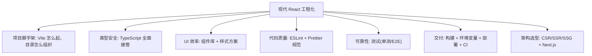
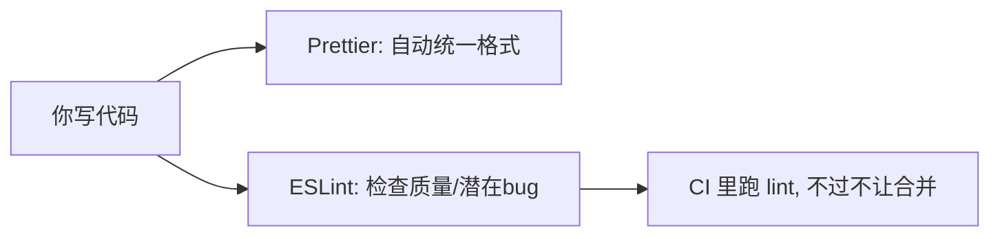
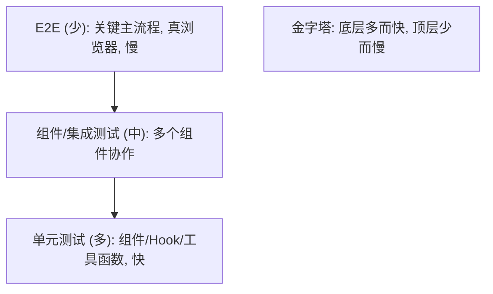
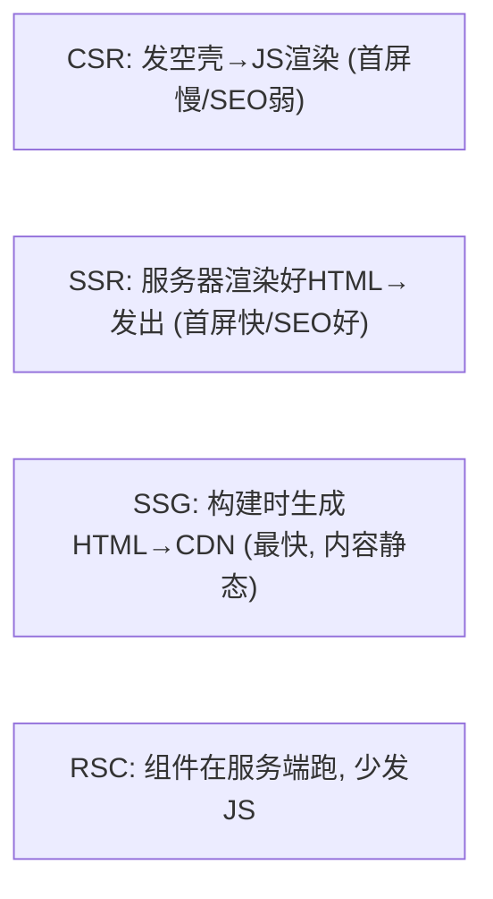
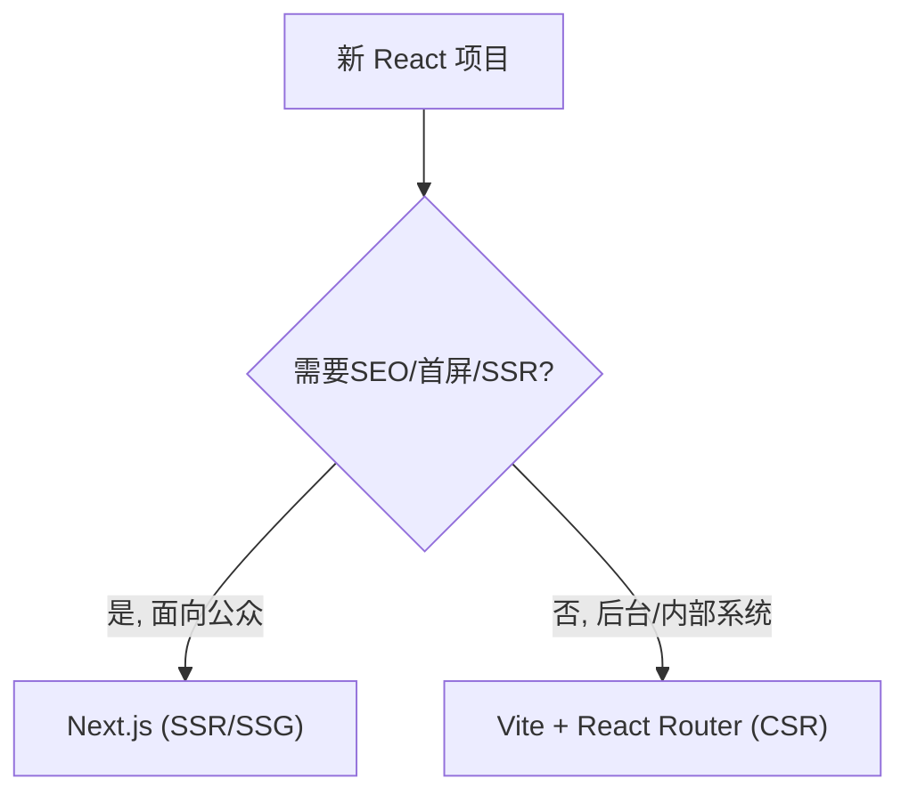
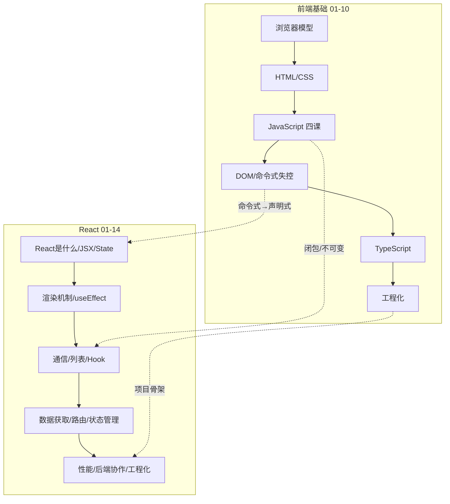

# React - 第 14 课：现代 React 工程化，Vite、TypeScript、测试与 Next.js

## 学习目标（本节结束后你能做到什么）

- 把前面所有零件组装成一个**能开发、能测试、能上线**的真实 React 项目。
- 会用 Vite 起项目、理解标准目录结构（呼应「前端基础」第 10 课）。
- 掌握 **TypeScript 在 React 里的实战**：Props 类型、事件类型、`useState` 泛型、自定义 Hook 类型。
- 知道组件库、样式方案、代码规范（ESLint/Prettier）各解决什么，怎么选。
- 建立前端**测试**的心智：单元测试（Vitest + Testing Library）测什么、怎么测、测试哲学；E2E 的定位。
- 理解 **CSR / SSR / SSG / RSC** 这几种渲染范式的区别，以及 **Next.js** 解决什么、什么时候才该上。
- 拿到整套课程的总览和后续学习建议。

> 前置衔接：本课是「前端基础」第 9 课（TypeScript）、第 10 课（工程化）和整个 React track 的收尾。前面你学会了“写组件、对接后端”，这一课讲“怎么把它变成一个工程化、可维护、能交付的真实项目”——这正是你后端最熟悉的那套“代码规范 + 测试 + CI/CD + 架构选型”，只是搬到了前端。

## 内容讲解（核心概念，用类比、例子、图示说清楚）

### 1. 工程化全景：从“会写组件”到“能交付项目”

到上一课为止，你已经会写组件、管状态、对接后端了。但“一堆能跑的组件”离“一个能交付、能多人协作、能长期维护的项目”还差一层——**工程化**。它要回答这些问题：



这张图里每一项你后端都有对应物（脚手架、强类型、lint、测试金字塔、CI/CD、架构选型）。所以这一课对你不是学新概念，而是**把熟悉的工程实践映射到前端**。下面逐个落地。

### 2. Vite 起项目与目录结构

回忆「前端基础」第 10 课：现代项目用 Vite。一条命令起一个 React + TS 项目：

```bash
npm create vite@latest my-app -- --template react-ts
cd my-app
npm install
npm run dev    # localhost:5173，带热更新
```

一个组织良好的中型项目目录，体现的是“按职责分层”（你后端的分层思想）：

```text
src/
├── main.tsx          # 入口：createRoot().render(<App/>)
├── App.tsx           # 根组件 + 路由配置
├── pages/            # 页面级组件（对应路由）
├── components/       # 可复用的展示组件（无业务）
├── features/         # 按业务功能聚合（如 user/、order/，含该功能的组件+hook+api）
├── hooks/            # 通用自定义 Hook（useDebounce 等）
├── api/              # 请求层 + 各模块接口（第13课的 request.js）
├── store/            # 全局状态（第11课，如有）
├── types/            # 全局 TS 类型定义
└── utils/            # 纯工具函数
```

两种组织法：小项目按**技术类型**分（components/hooks/api）；项目变大后推荐按**业务功能**分（features/user/、features/order/，每个功能自带它的组件/hook/接口/类型）——这就是后端的“按领域聚合”而非“按技术分层”，高内聚、好维护。**目录结构没有唯一标准，原则是让人能快速定位代码、让相关的东西待在一起。**

### 3. TypeScript 在 React 里的实战

「前端基础」第 9 课讲了 TS 语法，这一课落到 React 的具体用法。现代 React 项目几乎都用 TS，这几处是日常高频：

**(1) 组件 Props 类型（最常用）**

```tsx
interface UserCardProps {
  user: User;                       // 复用已定义的数据类型
  selected?: boolean;               // 可选 prop
  onSelect: (id: number) => void;   // 函数类型的 prop
  children?: React.ReactNode;       // children 的类型（任意可渲染内容）
}

function UserCard({ user, selected = false, onSelect, children }: UserCardProps) {
  return (
    <div className={selected ? "selected" : ""} onClick={() => onSelect(user.id)}>
      {user.name}
      {children}
    </div>
  );
}
```

`React.ReactNode` 是 children 的标准类型（能容纳 JSX、字符串、数组、null 等）。Props 标了类型后，**传错/漏传/拼错 prop 名编译器立刻报错**，还有自动补全——这是 TS 在 React 里最大的收益。

**(2) useState 泛型**

```tsx
const [count, setCount] = useState(0);                  // 推断为 number，不用标
const [user, setUser] = useState<User | null>(null);    // 必须标：否则推断成 null
const [users, setUsers] = useState<User[]>([]);         // 标明是 User 数组
const [status, setStatus] = useState<Status>("idle");   // 字面量联合（第9课状态机）
```

规则：初始值能推断出类型就不用标（`useState(0)`）；初始值是 `null`/`[]` 这种**推断不出最终类型**的，必须用泛型 `useState<T>` 显式标注。

**(3) 事件类型**

```tsx
function handleChange(e: React.ChangeEvent<HTMLInputElement>) {
  setText(e.target.value);
}
function handleSubmit(e: React.FormEvent) {
  e.preventDefault();
}
function handleClick(e: React.MouseEvent<HTMLButtonElement>) { /* ... */ }
```

事件类型名字长，但你不用背——编辑器会提示，或者直接内联写箭头函数让 TS 自动推断 `onChange={e => ...}`（这时 `e` 类型自动推出来，最省事）。

**(4) 自定义 Hook 的类型**

```tsx
// 给自定义 Hook 的返回值标类型，调用方就有完整提示
function useUsers(): { users: User[]; status: Status } {
  const [users, setUsers] = useState<User[]>([]);
  const [status, setStatus] = useState<Status>("loading");
  // ...第9课的数据获取逻辑...
  return { users, status };
}
```

掌握这四处，你就能读写绝大多数带类型的 React 代码了。**TS 把你后端享受的编译期类型安全，完整带回了前端**——这是现代 React 项目的标配，不是可选项。

### 4. 组件库与样式方案

不必什么都手写。真实项目靠**组件库**和**样式方案**提效。

**组件库**：现成的、带好样式和交互的高质量组件（按钮、表格、弹窗、表单、日期选择器……）。后台系统尤其依赖它们，能省掉海量重复劳动：

- **Ant Design**：后台系统最流行，组件全、企业级，中文生态好。
- **MUI（Material UI）**：Google Material 风格，生态强。
- **shadcn/ui**：现代、可定制、基于 Tailwind，近年很火。

```tsx
import { Table, Button, Modal } from "antd";   // 直接用现成组件
<Table dataSource={users} columns={columns} pagination={{ pageSize: 20 }} />
```

**样式方案**（呼应「前端基础」第 3 课第 12 节）：

- **CSS Modules**：`.module.css`，类名局部化，避免全局冲突。
- **Tailwind CSS**：原子类直接拼样式（`className="flex p-4 text-center"`），现在非常主流。
- **CSS-in-JS**（styled-components）：样式写在 JS 里、和组件绑定。

**选型建议**：后台管理系统优先选一个成熟组件库（Ant Design / MUI），它能覆盖 80% 的 UI；样式按团队习惯选 Tailwind 或 CSS Modules。**别从零手写一套 UI 组件——那是重复造轮子**，和你后端不会手写一个 ORM 是同个道理。

### 5. 代码规范：ESLint + Prettier

多人协作必须统一代码风格和质量，靠两个工具（脚手架通常已内置）：

- **ESLint**：**代码质量检查器**——查潜在 bug、坏味道、违反规则的写法（比如 useEffect 依赖漏写、用了未定义变量）。相当于你后端的静态代码分析（SonarQube/Checkstyle）。
- **Prettier**：**代码格式化器**——统一缩进、引号、换行等格式，保存即自动格式化。它只管“长相”，不管对错。



实践：编辑器装插件做到“保存自动格式化 + 实时标红”，CI 里跑 `npm run lint` 卡关。**统一规范让代码看起来像一个人写的**，减少无谓的风格争论和 review 噪音——这点你在后端团队一定深有体会。

### 6. 前端测试：测什么、怎么测、测试哲学

前端也要测试，思路和后端的测试金字塔一致：**多写快而稳的单元/组件测试，少写慢而脆的端到端测试。**

**(1) 单元 / 组件测试：Vitest + React Testing Library**

- **Vitest**：测试运行器（类似后端的 JUnit/pytest），和 Vite 同源、快。
- **React Testing Library（RTL）**：渲染组件、模拟用户交互、断言结果的库。

```tsx
import { render, screen } from "@testing-library/react";
import userEvent from "@testing-library/user-event";
import Counter from "./Counter";

test("点击按钮后计数加一", async () => {
  render(<Counter />);                              // 渲染组件
  const button = screen.getByRole("button");        // 像用户一样找元素
  expect(button).toHaveTextContent("0");
  await userEvent.click(button);                     // 模拟用户点击
  expect(button).toHaveTextContent("1");            // 断言结果
});
```

**核心测试哲学（RTL 的精髓，务必理解）：测“用户能感知的行为”，不测“内部实现细节”。**

> 不要去断言“某个 state 变量等于几”“某个函数被调了几次”，而要断言“用户点了按钮后，屏幕上显示的数字变了”。

为什么？因为测实现细节，会让测试变得**脆弱**——你重构内部写法（把 useState 换成 useReducer），行为没变但测试全挂了。测行为则相反：只要用户看到的结果对，内部怎么重构都不影响测试。这让测试成为**重构的保护网**而非负担。这条原则和你后端“测公共行为/契约，别测私有实现”完全相通。

**(2) 端到端测试（E2E）：Playwright / Cypress**

E2E 用真实浏览器跑完整流程（打开页面→登录→下单→看结果），最接近真实用户，但慢、脆、维护成本高。所以只给**最关键的几条主流程**写 E2E（登录、下单、支付），其余靠单元/组件测试覆盖。



新手期：先会写组件单测（RTL）就很有价值，E2E 了解定位即可。

### 7. 构建、环境变量与部署

把项目交付上线，这一步对应你后端的打包部署：

**(1) 构建**：`npm run build`（前端基础第 10 课）产出 `dist/`——一堆优化过的静态文件（HTML/JS/CSS）。

**(2) 环境变量**：区分开发/测试/生产的配置（如接口地址）。Vite 用 `.env` 文件 + `import.meta.env`：

```bash
# .env.production
VITE_API_BASE_URL=https://api.example.com
```
```js
const baseURL = import.meta.env.VITE_API_BASE_URL;   // 代码里读取
```

注意：**前端环境变量会被打进产物、用户能看到，绝不能放密钥**（密钥只能在后端）。这是后端工程师容易想当然的安全点。

**(3) 部署**：SPA 构建出的是纯静态文件，部署很简单——丢到 Nginx、对象存储 + CDN、或 Vercel/Netlify 这类静态托管平台即可。有个 SPA 部署的经典坑：**前端路由（第 10 课）需要服务器把所有路径都回退到 `index.html`**（否则刷新 `/users/42` 会 404），Nginx 要配 `try_files ... /index.html`。

**(4) CI/CD**：在 GitHub Actions 等流水线里跑 `lint → test → build → deploy`，和你后端的 CI/CD 一模一样。

### 8. 渲染范式：CSR / SSR / SSG / RSC

到这里你学的都是 **CSR（客户端渲染）**——浏览器下载 JS，由 JS 在前端渲染（前端基础第 1 课的 SPA）。它有两个固有短板：

- **首屏慢**：要先下载并执行 JS 才能看到内容，白屏时间长。
- **SEO 弱**：爬虫拿到的初始 HTML 基本是空壳，不利于搜索引擎收录。

为解决这些，有了其他范式：

| 范式 | 含义 | 解决什么 | 代价 |
| --- | --- | --- | --- |
| **CSR** | 客户端渲染，JS 在浏览器渲染 | 交互强、部署简单 | 首屏慢、SEO 弱 |
| **SSR** | 服务端渲染，服务器先生成 HTML 再发给浏览器 | 首屏快、SEO 好 | 需要 Node 服务器、复杂 |
| **SSG** | 静态生成，构建时就生成好 HTML | 极快、可 CDN | 仅适合内容不常变的页面 |
| **RSC** | React Server Components，组件在服务端运行、不带 JS 到客户端 | 减少 JS 体积、可直连数据 | 新、心智模型有变化 |



**判断**：纯后台管理系统（登录后才用、不需要 SEO、交互重）用 **CSR 完全够**，别为了“先进”上 SSR 徒增复杂度；面向公众、需要 SEO 和首屏速度的网站（电商、内容站、营销页）才需要 SSR/SSG。**按需求选范式，不为技术而技术**——这又是你后端“别过度设计”的老道理。

### 9. Next.js 的定位：什么时候才该上

**Next.js** 是目前最主流的 React **全栈框架**。它在 React 之上提供了：文件系统路由、内置 SSR/SSG/RSC、API 路由（前端项目里直接写后端接口）、图片/字体优化、约定式工程化配置等。可以理解为“React 的 Spring Boot”——把一堆工程化决策和能力打包好。

**什么时候用 Next.js？**

- 需要 SSR/SSG/SEO（内容站、电商、官网、博客）。
- 想要一个开箱即用、约定优于配置的全栈框架，少操心工程化。
- 团队认可它的约定。

**什么时候不必用？**

- 纯后台管理系统、内部工具（CSR + Vite 更轻、更简单，没有 SSR 的额外复杂度和 Node 服务器运维）。



**给你的建议**：先用 Vite + React Router 把 CSR 这套彻底掌握（你前面学的全部适用），需要 SSR/SEO 时再学 Next.js。不要一上来被“Next.js 最流行”带着跑——先懂 React 本身，再懂框架在 React 之上加了什么，顺序别反。

### 10. 整套课程总览与后续建议

恭喜，到这里**「前端基础」+「React」两个 track 全部学完**。回看你走过的完整路径：



**后续学习建议（按优先级）：**

1. **动手做一个完整项目**：用 Vite + React Router + TS + 一个组件库，做一个带登录、列表、搜索分页、增删改查的后台系统。**前面所有知识只有在做项目时才能真正内化**——光看会忘，做一遍才是你的。
2. **回头做每课的检查题**：每课末尾的「问题」是用来自测的。挑你不确定的课，把检查题答一遍，发我帮你判断掌握程度。
3. **按需深入**：真做项目遇到性能问题再回看第 12 课、遇到复杂状态再回看第 11 课——带着问题回看，比通读高效。
4. **需要 SSR/SEO 时再学 Next.js**；想要更好的服务端状态管理就深入 React Query。

你现在已经具备“独立写出一个稳定、可维护的 React 业务系统”的完整知识地图了。从这里开始，最重要的是**写**。

## 小结（关键点）

- 工程化是从“会写组件”到“能交付项目”的那一层，每一项（脚手架/类型/规范/测试/CI/选型）你后端都有对应物。
- 用 **Vite** 起项目；目录小项目按技术分、大项目**按业务功能聚合**（高内聚）。
- **TypeScript 在 React** 的四处高频：Props 类型、`useState<T>` 泛型、事件类型、自定义 Hook 返回类型——现代 React 标配。
- 用**组件库**（Ant Design/MUI）和**样式方案**（Tailwind/CSS Modules）提效，别从零造 UI 轮子；**ESLint（质量）+ Prettier（格式）** 统一规范。
- **测试**遵循金字塔：多写**组件单测（Vitest + RTL）**，核心是**测用户行为不测实现细节**（让测试成为重构保护网）；E2E 只覆盖关键主流程。
- **部署**：`build` 出静态文件，环境变量**不能放密钥**，SPA 路由要配 `index.html` 回退；CI 跑 lint/test/build/deploy。
- **渲染范式**按需选：后台系统 **CSR + Vite 足够**；面向公众需 SEO/首屏才上 **SSR/SSG**（Next.js）；先掌握 React 本身，再学框架。

## 问题 （检测用户对当前章节内容是否了解）

1. 现代 React 工程化包含哪几块？分别对应你后端的什么实践？
2. 大型项目目录为什么推荐“按业务功能聚合”而非“按技术类型分”？这和后端的什么思想一致？
3. TypeScript 在 React 里最高频的几处用法是什么？`useState` 什么时候必须用泛型显式标类型？
4. ESLint 和 Prettier 各负责什么？为什么说它们对多人协作很重要？
5. React Testing Library 的核心测试哲学是什么？为什么“测实现细节”会让测试变脆弱？
6. 测试金字塔在前端怎么落地？为什么 E2E 只写关键主流程？
7. 前端环境变量为什么不能放密钥？SPA 部署时为什么要配“路径回退到 index.html”？
8. CSR、SSR、SSG 各解决什么、有什么代价？一个纯后台管理系统该用哪种、要不要上 Next.js？为什么？

这是整套课程的最后一课。把你的答案发我即可——或者，更建议你现在就动手起一个 Vite 项目，把前面学的拼成一个真实的后台页面。需要我陪你做这个项目、或针对任何一课出练习/答疑，随时找我。
