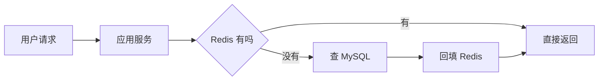

# Redis - 第 1 课：Redis 是什么、为什么这么常用、能解决什么问题

## 本篇定位

主线入门层。先建立 Redis 在后端系统里的角色认知，后面所有数据结构、缓存、高可用和排障内容都以这一篇为起点。

## 学习目标（本节结束后你能做到什么）

- 用自己的话解释 Redis 是什么，而不是只会说“一个缓存”。
- 理解 Redis 在系统架构中的位置，以及它为什么几乎成了后端标配。
- 说清楚 Redis 适合解决哪些问题，不适合解决哪些问题。
- 分清“把 Redis 当缓存”“把 Redis 当数据结构服务器”“把 Redis 当基础设施组件”三种视角。
- 为后续学习数据结构、高性能、持久化、高可用打下整体认知基础。

## 内容讲解（核心概念，用类比、例子、图示说清楚）

### 1. Redis 到底是什么

Redis 的全名是 `Remote Dictionary Server`。这个名字里有两个词很重要：

- `Remote`：它不是你进程里的本地集合，而是通过网络访问的独立服务
- `Dictionary`：它最早的核心抽象是键值存储，但后来演化成了一个丰富的数据结构服务器

所以最准确的理解不是“Redis 是缓存”，而是：

**Redis 是一个基于内存、支持丰富数据结构、提供高性能读写能力的远程数据服务。**

它当然很常被拿来做缓存，但如果只把 Redis 理解成缓存，你会漏掉它大量真正有价值的能力。

### 2. 为什么大家老说 Redis 是缓存

因为它确实特别适合缓存。

想象一个最简单的商品详情接口：

```text
用户请求 -> 应用服务 -> MySQL
```

如果热点商品每天被访问几十万次，而每次都直接查数据库，数据库很快就会成为瓶颈。于是我们在中间加一层 Redis：



这样一来，绝大部分热点请求都被 Redis 挡住了，数据库压力会大幅下降。

因为这个场景太常见，所以很多人一提 Redis，第一反应就是缓存。

但缓存只是 Redis 最常见的用途，不是 Redis 的全部。

### 3. Redis 还可以拿来做什么

Redis 真正厉害的地方，在于它不是只会存字符串。

它支持：

- String
- Hash
- List
- Set
- ZSet
- Bitmap
- HyperLogLog
- Geo
- Stream

于是它不仅能做“缓存一段 JSON”，还能做很多更有结构感的事情：

- 用 `Hash` 存用户画像
- 用 `List` 或 `Stream` 做消息缓冲
- 用 `Set` 做去重
- 用 `ZSet` 做排行榜
- 用 Bitmap 做签到统计
- 用 HyperLogLog 做 UV 估算
- 用 `SET NX PX` 做分布式锁

这就是为什么更准确的说法应该是：

**Redis 不只是缓存，而是一个提供高性能数据结构操作能力的内存服务器。**

### 4. Redis 为什么这么常用

Redis 的普及不是偶然，而是因为它同时满足了几个后端系统特别在乎的诉求。

#### 4.1 它足够快

Redis 的数据主要在内存里，避免了磁盘随机 I/O 的巨大开销。再加上它内部实现和事件循环模型非常高效，通常能提供很低的读写延迟。

这使它特别适合承接：

- 高频读
- 高频写
- 小数据量但高并发的访问

#### 4.2 它的数据结构足够实用

很多业务问题本质上不是“我要存一段字符串”，而是：

- 我要一个可去重集合
- 我要一个按分数排序的集合
- 我要一个支持原子自增的计数器
- 我要一个带过期时间的键

如果没有 Redis，你可能要自己在数据库、应用内存、消息队列之间拼很多东西。Redis 把这些基础能力直接提供出来了。

#### 4.3 它的原子操作很适合做基础设施

例如：

- 计数
- 限流
- 去重
- 抢占
- 锁

这些操作如果放在数据库里做，往往代价更高；放在应用本地做，又很难跨实例共享。Redis 处在一个很合适的中间位置。

#### 4.4 它的生态非常成熟

几乎所有语言都有成熟客户端，云厂商也都提供托管 Redis，面试、项目、开源组件里到处能看到它。

这意味着你用 Redis 时，通常不是在赌一个小众技术，而是在使用一个后端世界里非常成熟的公共基础设施。

### 5. Redis 在系统里通常扮演什么角色

你可以把 Redis 理解成后端系统里的“高速内存层”。

常见位置有：

- 数据库前面的缓存层
- 应用之间共享状态的中间层
- 轻量消息缓冲层
- 排行榜和计数系统
- 限流、锁、幂等等控制层

例如一个电商系统里，Redis 可能同时承担：

- 商品详情缓存
- 购物车临时状态
- 秒杀库存预扣
- 排行榜
- 用户会话
- 接口限流计数

这说明 Redis 的价值不只在“快”，还在于它能把很多常见的基础设施诉求用统一方式承接下来。

### 6. Redis 适合什么，不适合什么

这是后端工程里特别重要的一步：不要因为 Redis 很强，就把一切都往里塞。

#### 适合 Redis 的场景

- 热点缓存
- 高频计数
- 去重、集合运算
- 排行榜
- 分布式协调中的轻量状态
- 短期状态存储
- 对响应延迟很敏感的数据访问

#### 不适合 Redis 的场景

- 超大规模冷数据长期存储
- 强事务、多表关联、复杂查询
- 对数据持久可靠要求极高且不能接受内存成本的主存储
- 大对象、大批量扫描、大量复杂聚合

一句话总结：

**Redis 适合做“快而轻”的共享数据层，不适合直接替代关系型数据库和大规模离线存储。**

### 7. 学 Redis 的关键误区

#### 误区一：Redis 只是缓存

这是最常见误区。它当然是缓存利器，但它更像一个“内存数据结构服务”。

#### 误区二：Redis 很快，所以什么都往里放

Redis 快，但内存贵，热点友好，冷数据不友好；简单访问友好，复杂分析不友好。技术没有银弹。

#### 误区三：会用几个命令就算会 Redis

真正的 Redis 能力，至少要包括：

- 会选数据类型
- 会分析复杂度
- 会做缓存设计
- 会解释高可用和集群
- 会定位常见线上问题

## 实战落地：先把 Redis 角色分清楚

真实项目里，Redis 最容易出问题的地方不是命令不会用，而是角色没定义清楚。一个服务接入 Redis 前，至少要把这些问题写清楚：

- 这个 key 是缓存、副本数据、临时状态，还是业务事实数据。
- key 的 owner 是哪个服务，谁负责写入、删除、续期和回收。
- 数据丢了以后能不能从数据库、MQ 或第三方服务恢复。
- 这个 key 的访问模式是高频读、低频写、计数、排行榜，还是共享状态。
- 这个数据是否允许短时间不一致，允许多久。

比如用户详情缓存、商品库存预扣、登录态 Session、限流计数器虽然都能放 Redis，但它们的可靠性要求完全不同。用户详情缓存丢了可以回源；库存预扣丢了要对账；Session 丢了会影响登录体验；限流计数器丢了可能放大流量。

## 生产问题处理：别只看 Redis 是否存活

线上 Redis 出问题时，第一反应不要只问“Redis 挂了吗”，而要先判断它在当前链路里扮演什么角色：

- 如果 Redis 是缓存：看命中率、回源量、数据库 QPS 是否被打爆。
- 如果 Redis 是限流器：看限流 key 是否过期、Lua 是否报错、是否有热点接口绕过限流。
- 如果 Redis 是锁：看锁是否误删、是否过期太短、业务执行时间是否超过锁 TTL。
- 如果 Redis 是队列：看积压长度、消费组 pending、重试和死信是否可见。
- 如果 Redis 是 Session：看连接池、过期策略、登录态是否被批量淘汰。

这个判断能直接决定处置动作：缓存故障优先保护数据库，锁故障优先保护幂等，队列故障优先防止重复消费和消息丢失。Redis 不是孤立组件，处理事故时要先回到业务链路。

## 小结

- Redis 不是“一个缓存工具”，而是一个基于内存的高性能数据结构服务器。
- 缓存是 Redis 最常见的用途，但不是它的全部。
- Redis 常见价值包括热点缓存、计数、排行榜、共享状态、限流、锁和轻量消息处理。
- Redis 适合承接高并发、小而热、需要简单原子操作的场景，不适合替代数据库做复杂事务和长期主存储。
- 学 Redis 的第一步不是背命令，而是先理解它在后端系统里到底扮演什么角色。

## 问题（检测你对当前章节内容是否了解）

1. 如果有人说“Redis 就是缓存”，你会怎么纠正这个说法？
2. 为什么热点数据特别适合放 Redis，而冷数据不一定适合？
3. 你能举出三个“不是缓存，但很适合 Redis”的真实场景吗？
4. 为什么 Redis 不能简单替代 MySQL 这类关系型数据库？
